# 第五章：构建真实的应用程序

我们已经涵盖了构建全栈 JavaScript 应用程序所需了解的基本组件。从现在开始，我们将使用所有这些技术来构建一个完整的 Web 应用程序。

在这本书中，我们将构建一个具有以下功能的电影评分应用程序：

+   一个列出所有电影及其其他属性的首页

+   将会有一个管理员部分，管理员将能够添加电影

+   用户将能够登录和注册

+   用户将能够对电影进行评分

+   将会有一个电影简介部分，登录用户可以对该电影进行评分

那么，让我们开始吧。

# 介绍 Vue.js

Vue.js 是一个用于构建用户界面的开源、渐进式 JavaScript 框架。新 JavaScript 框架的兴起是巨大的。随着这种增长，你可能会感到困惑，不知道从哪里开始以及如何开始。今天有数百个 JavaScript 框架；其中，有数十个框架脱颖而出。但仍然，从这些数十个中选择可能是一项艰巨的任务。

今天有很多流行的框架，例如 React、Ember 和 Angular。虽然这些框架有其自身的优点，但也存在一些局限性。虽然使用 React 或 Angular 构建应用程序本身是好的，但 Vue.js 有助于消除与这些框架相关的一些局限性。

Vue.js 是**渐进式**的。使用 Vue.js，你可以从小型应用开始，然后逐步构建更大的应用程序。这意味着如果你是初学者，你可能想从一个非常小的应用程序开始，并逐步扩展。Vue.js 非常适合这样的应用程序。它轻量级且灵活。学习曲线也非常容易，并且非常容易上手。

Vue.js 是由 Evan You 发明的。它首次发布于 2014 年 2 月，并在 2016 年左右获得了巨大的流行度。他曾经为谷歌工作，并在 Angular 项目中工作。发明这个技术的动机主要是因为他不想在小型项目中使用 Angular，因为 Angular 提供了大量的内置包，因此不够轻量级，不适合小型应用程序。话虽如此，Vue.js 并不仅针对小型应用程序。它确实不提供所有的包，但你可以随着应用程序的进展逐步添加它们。这就是 Vue.js 的美丽之处。

# 安装 Vue.js

让我们从 Vue.js 的安装开始。安装和使用 Vue.js 有三种方式。

# 在`<script>`标签中包含它

使用 Vue.js 最简单的方法是下载它并将其包含在`<script>`标签中。你可以从[`cdn.jsdelivr.net/npm/vue`](https://cdn.jsdelivr.net/npm/vue)下载：

```js
<script type="text/javascript" src="img/vue.js"></script>
```

# 使用内容分发网络（CDN）直接链接

CDN 是一个分布式服务器网络。它在不同的地理位置存储内容的缓存版本，以便在获取内容时加载更快。我们可以在 `script` 标签中直接使用 CDN 链接：

```js
<script type="text/javascript" src="img/vue.js"></script>
```

# 将 Vue.js 作为 npm 包使用

`npm` 也为 `vue` 提供了一个包，可以按照以下步骤进行安装：

```js
$ npm install vue
```

# 介绍 vue-cli

CLI 代表命令行界面。一个 `cli` 在命令行界面中连续运行一个或多个命令。Vue.js 也有一个 `cli`，当安装后，可以非常容易地启动项目。我们将在这本书中使用 `vue-cli` 来创建 Vue.js 应用程序。让我们使用以下命令安装 `vue-cli`。您可以在根目录中执行此命令：

```js
$ npm install -g vue-cli
```

# 使用 vue-cli 初始化项目

让我们继续创建一个新的项目文件夹，用于我们的电影评分应用。我们将称之为 `movie_rating_app`。在终端中转到您想要创建应用程序的目录，并运行以下命令：

```js
$ vue init webpack movie_rating_app
```

上述命令初始化了一个包含 Vue.js 项目所需所有依赖的应用程序。它将询问您一些有关项目设置的问题，您可以选择回答 *y*（表示是）或 *n*（表示否）：

+   **Vue 构建选项**：您将找到两个构建 Vue.js 应用的选项：运行时 + 编译器，或仅运行时。这与模板编译器有关：

    +   **仅运行时**：运行时选项用于创建 `vue` 实例。此选项不包括模板编译器。

    +   **运行时 + 编译器**：此选项包括模板编译器，这意味着 `vue` 模板将被编译成普通的 JavaScript 渲染函数。

+   **Vue-router**：Vue-router 是 Vue.js 应用的官方路由器。此选项特别用于我们想要将我们的应用程序制作成 **单页应用**（**SPA**）的情况。当使用此选项时，应用程序在页面首次加载时一次性发出所有必要的请求，并在需要新数据时向服务器发送请求。我们将在未来的章节中更多地讨论单页和多页应用。现在，我们将使用 Vue-router。

+   **ESLint**：ESLint 是一个 JavaScript 代码检查工具。它是一个静态代码分析工具，用于查找代码中的错误或错误。它基本上确保代码遵循标准指南。选择 ESLint 也有两种选项：标准检查或 Airbnb 检查。我们将在这个项目中使用 Airbnb。

+   **设置测试**：通过设置测试，项目为我们将为应用程序编写的测试创建了一个包装器。它创建了测试代码所需的必要结构和配置，以便能够运行。我们也将使用此选项。对于测试运行器，我们将使用 Mocha 和 Karma，对于端到端测试，我们将使用 Nightwatch，我们将在后续章节中学习它。

+   **依赖管理**：最后，为了管理包和依赖项，这里有两种选项：`npm` 和 `Yarn`。我们在前面的章节中主要讨论了 `npm`。`Yarn` 也是一个与 `npm` 类似的依赖管理工具。Yarn 和 `npm` 都有自己的优点，但在这个应用程序中，我们将使用 `npm`。你可以在这里了解更多关于 Yarn 的信息 ([`yarnpkg.com/en/`](https://yarnpkg.com/en/))。

这将花费一些时间，因为它将安装所有依赖项。以下是我们在应用程序中选择的选项：


当命令成功执行后，你应该能在你的终端上看到进一步的步骤：

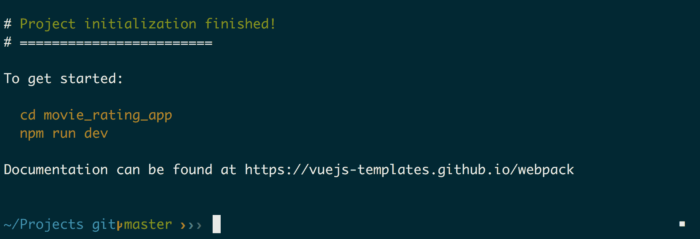

如果构建成功，我们将能够看到前面的输出。现在，让我们按照终端上的指示操作：

```js
$ cd movie_rating_app
$ npm run dev
```

这将启动你的应用程序。Vue.js 应用程序的默认端口是 8080。正如你在终端中看到的那样，它应该显示：

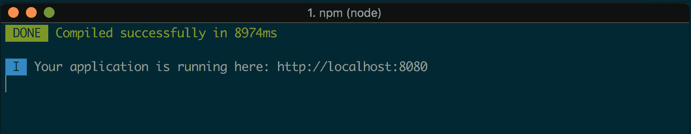

打开浏览器并访问 URL `http://localhost:8080/#/`，我们应该能够看到我们的应用程序：

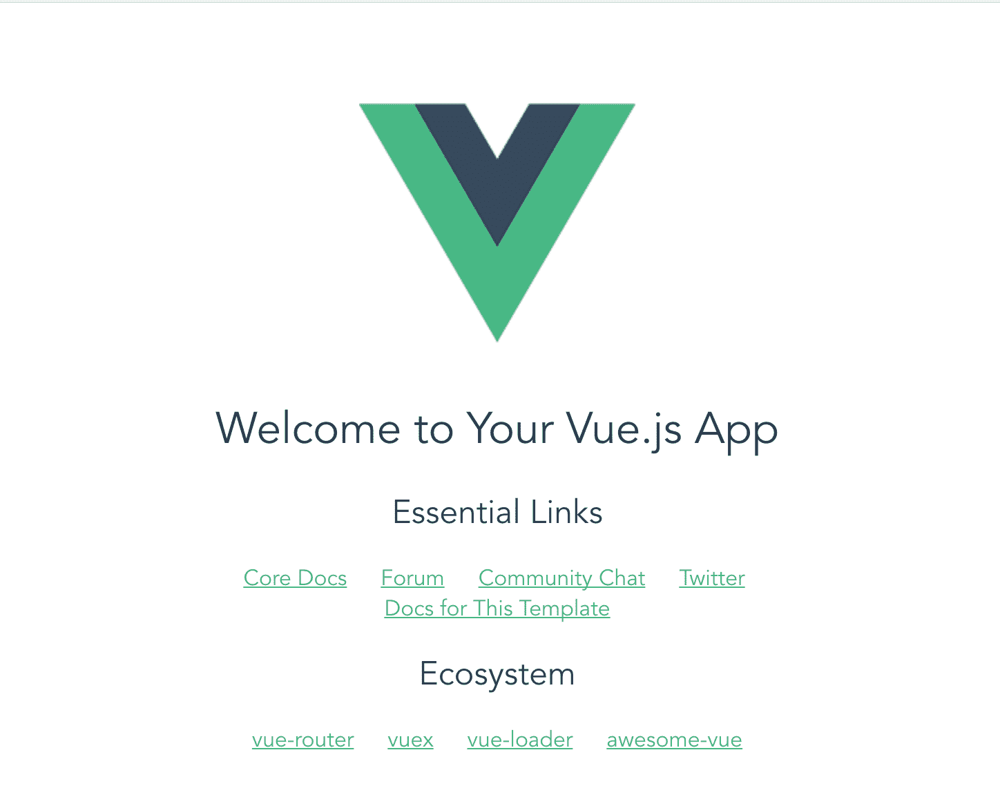

干得好！这很简单。你已经成功创建并运行了一个 Vue.js 应用程序。

# 项目文件夹结构

现在，如果你已经注意到，`vue-cli` 命令为你的应用程序添加了一堆依赖项，这些依赖项列在 `package.json` 文件中。`cli` 命令还设置了一个你可以根据需要定制的文件夹结构。让我们回顾并理解 `cli` 为我们创建的结构：

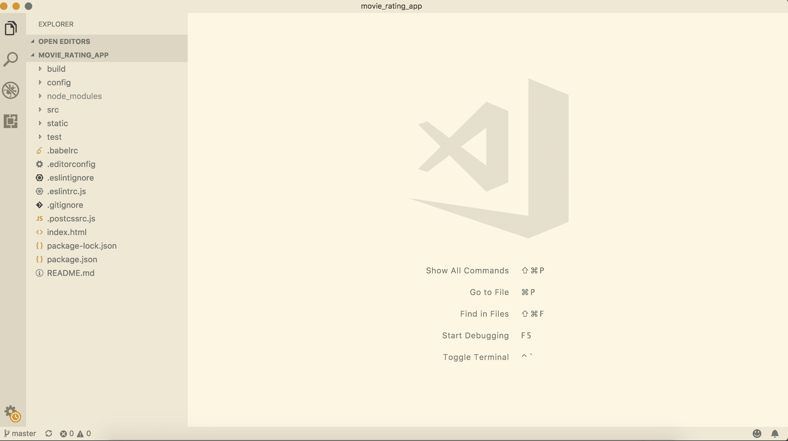

+   `build` 文件夹：这个文件夹包含不同环境（开发、测试和生产）的 `webpack` 配置文件

+   `config` 文件夹：所有应用程序的配置都会放在这里

+   `node_modules`: 我们安装的所有 `npm` 包都位于这个文件夹中

+   `src`: 这个文件夹包含所有与在浏览器中渲染组件相关的文件：

    +   `assets`: 你可以在该文件夹内添加你的应用程序的 CSS 和图片。

    +   `components`: 这个文件夹将存放所有具有 `.vue` 扩展名的前端渲染文件。

    +   `router`: 这个文件夹将负责应用程序中不同页面的所有 URL 路由。

    +   `App.vue`: 你可以将 `App.vue` 视为渲染视图文件的主组件。其他文件将扩展此文件上定义的布局以创建不同的视图。

    +   `main.js`: 这是任何 Vue.js 应用程序的主入口点。

+   `Static`: 你也可以使用这个文件夹来保存你的静态文件，例如 CSS 和图片。

+   `Test`: 这个文件夹将用于处理我们应用程序编写的所有测试。

# 使用 Vue.js 构建静态应用程序

现在我们已经初始化了一个项目，让我们继续创建一个静态的 Web 应用程序。别忘了在 GitHub 上创建一个仓库，并定期提交和推送更改。

当你访问 URL `http://localhost:8080/#/` 时，你将看到一个默认页面被渲染。这段代码是写在 `src/components/HelloWorld.vue` 中的。

如果你查看 `build/webpack.base.conf.js`，你将在 `module.exports` 部分看到以下代码行：

```js
module.exports = {
  context: path.resolve(__dirname, '../'),
  entry: {
    app: './src/main.js'
  },
  output: {
```

这意味着，当你运行应用时，这个 `main.js` 将是应用的入口点。一切都将从这里开始。让我们快速查看 `src` 中的 `main.js` 文件：

```js
// The Vue build version to load with the `import` command
// (runtime-only or standalone) has been set in webpack.base.conf with an alias.
import Vue from 'vue';
import App from './App';
import router from './router';

Vue.config.productionTip = false;

/* eslint-disable no-new */
new Vue({
 el: '#app',
 router,
 template: '<App/>',
 components: { App },
});
```

前三条语句导入了此应用运行所需的必要包。`App.vue` 是此应用的主模板布局。所有其他 `.vue` 文件都将扩展此布局。

底部块定义了运行应用时渲染哪个组件。在这种情况下，这是告诉我们的应用将模板 `<App>` 渲染在 `#app` 元素内。现在，如果我们查看 `App.vue`：

```js
<template>
 <div id="app">
 
 <router-view/>
 </div>
</template>

<script>
export default {
 name: 'app',
};
</script>

<style>
#app {
 font-family: 'Avenir', Helvetica, Arial, sans-serif;
 -webkit-font-smoothing: antialiased;
 -moz-osx-font-smoothing: grayscale;
 text-align: center;
 color: #2c3e50;
 margin-top: 60px;
}
</style>
```

这里有一个包含 ID `#app` 的 `div` 元素的模板。这意味着我们创建的 `vue` 模板将被渲染在这里。

# 重新定义主页

让我们为主页创建自己的视图页面。为此，我们只需修改 `HelloWorld.vue` 组件。`.vue` 文件应该始终以模板开始。因此，此文件的基本模板如下：

```js
<template>
 <div>
 </div>
</template>
```

你也可以在这个页面上包含你的样式表和 JavaScript 代码定义，但如果我们将这些代码分离到其他地方，页面会显得更整洁。

让我们从 `HelloWorld.vue` 中删除所有内容，并添加以下代码行：

```js
<template>
 <div>
 Hello World
 </div>
</template>
```

我们也不需要 Vue.js 的标志，所以让我们也从 `src/assets` 中删除它，并在 `App.vue` 中的代码行：

```js

```

现在，如果你重新访问 URL `http://localhost:8080/#/`，你将看到 `Hello World` 被渲染：


# 分离 CSS

是时候分离 CSS 了。让我们在 `src/assets` 文件夹内创建一个名为 `stylesheets` 的文件夹，并添加一个 `main.css` 文件。在 `main.css` 中添加以下行：

```js
@import './home.css';
```

`main.css` 将是我们的主要 CSS 文件，它包含所有其他 CSS 组件。我们也可以直接在这里添加所有样式代码。但为了保持可读性，我们将为应用中的不同部分创建单独的样式表并将它们导入此处。

由于我们将在这里导入所有样式表，现在我们只需要在主应用中包含 `main.css` 文件，以便它被加载。为此，让我们在 `src/App.vue` 中添加以下代码行：

```js
<template>
  <div id="app">
    <router-view/>
  </div>
</template>

<script>
import './assets/stylesheets/main.css'; 
export default {
  name: 'App',
};
</script>
```

我们在 `main.css` 中导入了名为 `home.css` 的样式表，但该样式表尚未存在。因此，让我们在同一个目录 `src/assets` 中创建它。此外，让我们从 `App.vue` 中删除以下代码段并将其粘贴到 `home.css` 文件中，以便我们的组件更简洁：

```js
#app {
 font-family: 'Avenir', Helvetica, Arial, sans-serif;
 -webkit-font-smoothing: antialiased;
 -moz-osx-font-smoothing: grayscale;
 text-align: center;
 color: #2c3e50;
 margin-top: 60px;
 width: 100%;
}
```

# Vuetify 简介

Vuetify 是一个可以用于为 Vue.js 应用构建物质化网页设计的模块。它提供了一些可以作为我们应用构建块使用的功能。它是一个类似于 Bootstrap 的 UI 框架，但它主要包含材料组件。更多详情，您可以访问这个链接[`vuetifyjs.com`](https://vuetifyjs.com)。

在构建应用时，我们将同时使用 Vuetify 和 Bootstrap。第一步是安装包：

```js
$ npm install bootstrap bootstrap-vue vuetify --save
```

安装完这些之后，接下来我们需要在我们的主文件中引入这些包。所以，在`src/main.js`文件中，添加以下代码行：

```js
// The Vue build version to load with the `import` command
// (runtime-only or standalone) has been set in webpack.base.conf with an alias.
import 'bootstrap/dist/css/bootstrap.min.css';
import 'bootstrap-vue/dist/bootstrap-vue.css';
import BootstrapVue from 'bootstrap-vue'; 
import Vue from 'vue';
import Vuetify from 'vuetify';
import App from './App';
import router from './router';

Vue.use(BootstrapVue);
Vue.use(Vuetify);

Vue.config.productionTip = false;

/* eslint-disable no-new */
new Vue({
  el: '#app',
  router,
  components: { App },
  template: '<App/>',
});
```

我们还需要使用`vuetify.css`，它包含了所有与其设计相关的样式表。我们也将需要它。我们可以简单地链接一个样式表来实现这一点。在`index.html`文件中，在你的`head`部分添加以下代码行：

```js
...
<head>
    <meta charset="utf-8">
    <meta name="viewport" content="width=device-width,initial-scale=1.0">
    <link href="https://unpkg.com/vuetify/dist/vuetify.min.css" rel="stylesheet">
    <title>movie_rating_app</title>
  </head>
...
```

Vuetify 很好地使用了材料图标，因此也要导入字体。在`index.html`中同样添加以下代码行：

```js
<head>
    <meta charset="utf-8">
    <meta name="viewport" content="width=device-width,initial-scale=1.0">
    <link href="https://unpkg.com/vuetify/dist/vuetify.min.css" rel="stylesheet">
    <link href="https://fonts.googleapis.com/css?family=Roboto:300,400,500,700|Material+Icons" rel="stylesheet">
    <title>movie_rating_app</title>
  </head>
```

# 使用 Vuetify 重新设计页面

现在我们有了 Vuetify，让我们继续创建应用页面。它还提供了一些预定义的主题。我们将为应用使用一个非常简单和极简主义的主题。当然，我们也可以根据我们的需求进行自定义。

本节的结果将如下所示：


# 重新设计主页

在我们的`App.vue`中，将文件内容替换为以下代码：

```js
<template>
 <v-app id="inspire">
 <v-navigation-drawer
 fixed
 v-model="drawer"
 app
 >
 <v-list dense>
 <router-link v-bind:to="{ name: 'Home' }" class="side_bar_link">
 <v-list-tile>
 <v-list-tile-action>
 <v-icon>home</v-icon>
 </v-list-tile-action>
 <v-list-tile-content>Home</v-list-tile-content>
 </v-list-tile>
 </router-link>
 <router-link v-bind:to="{ name: 'Contact' }" class="side_bar_link">
 <v-list-tile>
 <v-list-tile-action>
 <v-icon>contact_mail</v-icon>
 </v-list-tile-action>
 <v-list-tile-content>Contact</v-list-tile-content>
 </v-list-tile>
 </router-link>
 </v-list>
 </v-navigation-drawer>
 <v-toolbar color="indigo" dark fixed app>
 <v-toolbar-side-icon @click.stop="drawer = !drawer"></v-toolbar-side-icon>
 <v-toolbar-title>Home</v-toolbar-title>
 </v-toolbar>
 <v-content>
 <v-container fluid>
 <div id="app">
 <router-view/>
 </div>
 </v-container>
 </v-content>
 <v-footer color="indigo" app>
 <span class="white--text">&copy; 2018</span>
 </v-footer>
 </v-app>
</template>

<script>
import './assets/stylesheets/main.css';

export default {
 data: () => ({
 drawer: null,
 }),
 props: {
 source: String,
 },
};
</script>
```

这包含了一些主要以`v-`开头的标签。这些是 Vuetify 提供的标签，用于定义我们的 UI 块。我们与前面的文件一起附加了一个名为`main.css`的`stylesheet`文件。让我们给我们的`App.vue`页面添加一些样式。

将以下代码添加到`src/assets/stylesheets/home.css`中：

```js
#app {
 font-family: 'Avenir', Helvetica, Arial, sans-serif;
 -webkit-font-smoothing: antialiased;
 -moz-osx-font-smoothing: grayscale;
 text-align: center;
 color: #2c3e50;
}

#inspire {
 font-family: 'Avenir', Helvetica, Arial, sans-serif;
}

.container.fill-height {
 align-items: normal;
}

a.side_bar_link {
 text-decoration: none;
}
```

我们仍然有一个包含 ID 为 app 的`div`部分。这是所有其他`.vue`文件将被渲染的部分。

现在，在`HelloWorld.vue`中，将内容替换为以下内容：

```js
<template>
 <v-layout>
 this is home
 </v-layout>
</template>
```

现在，如果你访问`http://localhost:8080/#/`，你应该能够查看主页。

# 重新设计联系页面

让我们继续添加一个新的联系页面。首先要做的是在我们的路由文件中添加一个路由。在`router/index.js`中添加以下代码：

```js
import Vue from 'vue';
import Router from 'vue-router';
import HelloWorld from '@/components/HelloWorld';
import Contact from '@/components/Contact';

Vue.use(Router);

export default new Router({
  routes: [
    {
      path: '/',
      name: 'HelloWorld',
      component: HelloWorld,
    },
 {
 path: '/contact',
 name: 'Contact',
 component: Contact,
 },
  ],
});
```

我们在这里所做的是为联系页面添加了一个路径，组件的名称，这是我们之前在`.vue`文件中的导出模块中做的，以及组件的实际名称。现在我们需要构建一个视图文件。所以，让我们在`src/components/`中创建一个`Contact.vue`文件，并添加以下内容：

```js
<template>
 <v-layout>
 this is contact
 </v-layout>
</template>
```

现在，访问`http://localhost:8080/#/contact`，你应该能够查看这两个页面。

为了使它对我们应用来说既可用又易于阅读，让我们将`HelloWorld`组件重命名为`Home`组件。将文件`HelloWorld.vue`重命名为`Home.vue`

同时，在`App.vue`中将绑定路由从`HelloWorld`更改为`Home`：

```js
<template>
  <v-app id="inspire">
    <v-navigation-drawer
      fixed
      v-model="drawer"
      app
    >
      <v-list dense>
 <router-link v-bind:to="{ name: 'Home' }" class="side_bar_link">
          <v-list-tile @click="">
            <v-list-tile-action>
              <v-icon>home</v-icon>
```

在`routes/index.js`中，同样将组件名称和路由从`HelloWorld`更改为`Home`：

```js
import Vue from 'vue';
import Router from 'vue-router';
import Home from '@/components/Home';
import Contact from '@/components/Contact';

Vue.use(Router);

export default new Router({
  routes: [
    {
      path: '/',
      name: 'Home',
      component: Home,
    },
    {
      path: '/contact',
      name: 'Contact',
      component: Contact,
    },
  ],
});
```

当我们访问 URL `http://localhost:8080/#/` 时，我们应该能看到类似以下内容：


就这样。你已经成功创建了一个基本的静态两页网页应用！

# 理解 Vue.js 组件

`vue` 组件与你在应用中编写的 HTML 文件等效。你可以在 `.vue` 文件中编写纯 HTML 语法。唯一需要注意的事情是，需要将所有内容包裹在 `<template></template>` 中。

# Vue.js 指令

指令与标记语言一起使用，在 DOM 元素上执行一些功能。例如，在 HTML 标记语言中，当我们写入：

```js
<div class='app'></div>
```

这里使用的 `class` 是 HTML 语言的指令。同样，Vue.js 也提供了许多这样的指令来简化应用开发，例如：

+   `v-text`

+   `v-on`

+   `v-ref`

+   `v-show`

+   `v-pre`

+   `v-transition`

+   `v-for`

# v-text

当你需要动态定义一些变量来显示时，可以使用 `v-text`。让我们通过一个例子来看一下。在 `src/components/Home.vue` 中，让我们添加以下内容：

```js
<template>
  <v-layout>
    <div v-text="message"></div>
  </v-layout>
</template>
<script type="text/javascript">
export default {
 data() {
 return {
 message: 'Hello there, how are you this morning?',
 };
 },
};
</script>
```

script 标签内的代码是一个数据变量，它将定义在其中的数据绑定到该组件。当你改变该变量的值 message 时，带有该指令的 `div` 元素也会更新。

如果我们访问 URL (`http://localhost:8080/#/`)，我们可以看到以下内容：

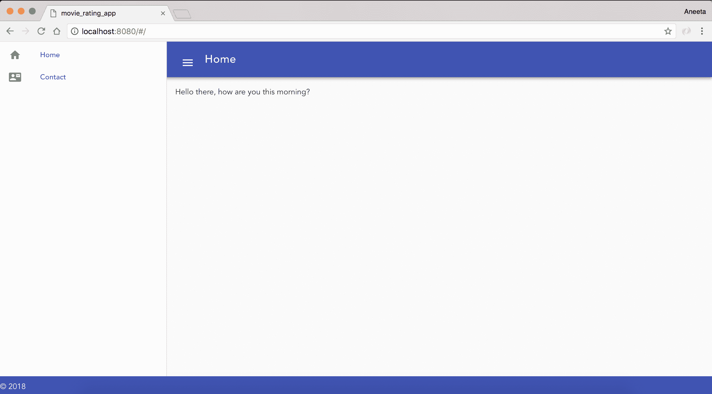

# v-on

这个指令用于事件处理。我们可以用它来触发应用中的某些逻辑。例如，假设我们想要回复上一个例子中的一个问题，为此我们可以这样做。将 `src/components/Home.vue` 中的代码更改为以下内容：

```js
<template>
  <v-layout row wrap>
 <v-flex xs12>
 <div v-text="message"></div>
 </v-flex>
 <v-flex xs12>
 <v-btn color="primary" v-on:click="reply">Reply</v-btn>
 </v-flex>
 </v-layout>
</template>
<script type="text/javascript">
export default {
  data() {
    return {
      message: 'Hello there, how are you this morning?',
    };
  },
  methods: {
 reply() {
 this.message = "I'm doing great. Thank You!";
 },
 },
};
</script>
```

第一屏将如下所示：


当你点击回复时，你会看到以下内容：

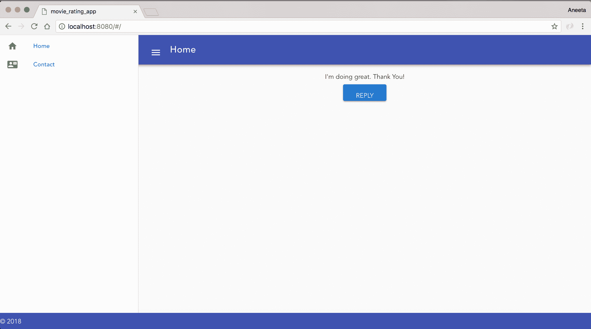

这些是我们将在应用中主要使用的指令。还有很多其他的指令，我们将在学习过程中探索。如果你想了解更多关于每个指令的信息，你可以访问 `https://012.vuejs.org/api/directives.html`。

# 数据绑定

**数据绑定**是同步数据的过程。例如，对于我们在 `v-text` 中所做的相同示例，我们可以使用数据绑定与模板符号，换句话说，使用 `{{}}` 操作符。

例如，我们可以使用 `{{message}}` 而不是使用 Vue.js 指令来显示消息。让我们将 `src/components/Home.vue` 中的代码更改为以下内容：

```js
<template>
  <v-layout row wrap>
    <v-flex xs12>
      <div>{{message}}</div>
    </v-flex>
    <v-flex xs12>
      <v-btn color="primary" v-on:click="reply">Reply</v-btn>
    </v-flex>
  </v-layout>
</template>
<script type="text/javascript">
  export default {
    data () {
      return {
        message: 'Hello there, how are you?',
      }
    },
    methods: {
      reply () {
        this.message = "I'm doing great. Thank You!"
      }
    }
  }
</script>
```

这将表现得与我们在 `v-text` 中所做的一样。

# 使用 Vue.js 处理表单

现在我们对 Vue.js 的工作原理有了基本的了解，让我们继续我们的第一个表单，我们将添加电影的详细信息并在主页上显示这些电影，以便用户可以查看。

# 创建电影列表页面

首先，让我们从为我们的主页创建静态电影卡片开始，我们将在下一步使这些数据动态化。在`Home.vue`中，将`template`内的内容替换为以下代码：

```js
<template>
 <v-layout row wrap>
 <v-flex xs4>
 <v-card>
 <v-card-title primary-title>
 <div>
 <div class="headline">Batman vs Superman</div>
 <span class="grey--text">2016 ‧ Science fiction film/Action fiction ‧ 3h 3m</span>
 </div>
 </v-card-title>
 <v-card-text>
 It's been nearly two years since Superman's (Henry Cavill) colossal battle with Zod (Michael Shannon) devastated the city of Metropolis. The loss of life and collateral damage left many feeling angry and helpless, including crime-fighting billionaire Bruce Wayne (Ben Affleck). Convinced that Superman is now a threat to humanity, Batman embarks on a personal vendetta to end his reign on Earth, while the conniving Lex Luthor (Jesse Eisenberg) launches his own crusade against the Man of Steel.
 </v-card-text>
 <v-card-actions>
 <v-btn flat color="purple">Rate this movie</v-btn>
 <v-spacer></v-spacer>
 </v-card-actions>
 </v-card>
 </v-flex>
 <v-flex xs4>
 <v-card>
 <v-card-title primary-title>
 <div>
 <div class="headline">Logan</div>
 <span class="grey--text">2017 ‧ Drama/Science fiction film ‧ 2h 21m</span>
 </div>
 </v-card-title>
 <v-card-text>
 In the near future, a weary Logan (Hugh Jackman) cares for an ailing Professor X (Patrick Stewart) at a remote outpost on the Mexican border. His plan to hide from the outside world gets upended when he meets a young mutant (Dafne Keen) who is very much like him. Logan must now protect the girl and battle the dark forces that want to capture her.
 </v-card-text>
 <v-card-actions>
 <v-btn flat color="purple">Rate this movie</v-btn>
 <v-spacer></v-spacer>
 </v-card-actions>
 </v-card>
 </v-flex>
 <v-flex xs4>
 <v-card>
 <v-card-title primary-title>
 <div>
 <div class="headline">Star Wars: The Last Jedi</div>
 <span class="grey--text">2017 ‧ Fantasy/Science fiction film ‧ 2h 35m</span>
 </div>
 </v-card-title>
 <v-card-text>
 Luke Skywalker's peaceful and solitary existence gets upended when he encounters Rey, a young woman who shows strong signs of the Force. Her desire to learn the ways of the Jedi forces Luke to make a decision that changes their lives forever. Meanwhile, Kylo Ren and General Hux lead the First Order in an all-out assault against Leia and the Resistance for supremacy of the galaxy.
 </v-card-text>
 <v-card-actions>
 <v-btn flat color="purple">Rate this movie</v-btn>
 <v-spacer></v-spacer>
 </v-card-actions>
 </v-card>
 </v-flex>
 <v-flex xs4>
 <v-card>
 <v-card-title primary-title>
 <div>
 <div class="headline">Wonder Woman</div>
 <span class="grey--text">2017 ‧ Fantasy/Science fiction film ‧ 2h 21m</span>
 </div>
 </v-card-title>
 <v-card-text>
 Before she was Wonder Woman (Gal Gadot), she was Diana, princess of the Amazons, trained to be an unconquerable warrior. Raised on a sheltered island paradise, Diana meets an American pilot (Chris Pine) who tells her about the massive conflict that's raging in the outside world. Convinced that she can stop the threat, Diana leaves her home for the first time. Fighting alongside men in a war to end all wars, she finally discovers her full powers and true destiny.
 </v-card-text>
 <v-card-actions>
 <v-btn flat color="purple">Rate this movie</v-btn>
 <v-spacer></v-spacer>
 </v-card-actions>
 </v-card>
 </v-flex>
 <v-flex xs4>
 <v-card>
 <v-card-title primary-title>
 <div>
 <div class="headline">Dunkirk</div>
 <span class="grey--text">2017 ‧ Drama/Thriller ‧ 2 hours</span>
 </div>
 </v-card-title>
 <v-card-text>
 In May 1940, Germany advanced into France, trapping Allied troops on the beaches of Dunkirk. Under air and ground cover from British and French forces, troops were slowly and methodically evacuated from the beach using every serviceable naval and civilian vessel that could be found. At the end of this heroic mission, 330,000 French, British, Belgian and Dutch soldiers were safely evacuated.
 </v-card-text>
 <v-card-actions>
 <v-btn flat color="purple">Rate this movie</v-btn>
 <v-spacer></v-spacer>
 </v-card-actions>
 </v-card>
 </v-flex>
 <v-flex xs4>
 <v-card>
 <v-card-title primary-title>
 <div>
 <div class="headline">The Revenant</div>
 <span class="grey--text">2015 ‧ Drama/Thriller ‧ 2h 36m</span>
 </div>
 </v-card-title>
 <v-card-text>
 While exploring the uncharted wilderness in 1823, frontiersman Hugh Glass (Leonardo DiCaprio) sustains life-threatening injuries from a brutal bear attack. When a member (Tom Hardy) of his hunting team kills his young son (Forrest Goodluck) and leaves him for dead, Glass must utilize his survival skills to find a way back to civilization. Grief-stricken and fueled by vengeance, the legendary fur trapper treks through the snowy terrain to track down the man who betrayed him.
 </v-card-text>
 <v-card-actions>
 <v-btn flat color="purple">Rate this movie</v-btn>
 <v-spacer></v-spacer>
 </v-card-actions>
 </v-card>
 </v-flex>
 </v-layout>
</template>
```

此外，按照以下内容替换`home.css`中的内容：

```js
#app {
 font-family: 'Avenir', Helvetica, Arial, sans-serif;
 -webkit-font-smoothing: antialiased;
 -moz-osx-font-smoothing: grayscale;
 text-align: center;
 color: #2c3e50;
 width: 100%;
}

#inspire {
 font-family: 'Avenir', Helvetica, Arial, sans-serif;
}

.container.fill-height {
 align-items: normal;
}

a.side_bar_link {
 text-decoration: none;
}

.card__title--primary, .card__text {
 text-align: left;
}

.card {
 height: 100% !important;
}
```

此外，在`App.vue`中，将内容替换为以下内容：

```js
<template>
 <v-app id="inspire">
 <v-navigation-drawer
 fixed
 v-model="drawer"
 app
 >
 <v-list dense>
 <router-link v-bind:to="{ name: 'Home' }" class="side_bar_link">
 <v-list-tile>
 <v-list-tile-action>
 <v-icon>home</v-icon>
 </v-list-tile-action>
 <v-list-tile-content>Home</v-list-tile-content>
 </v-list-tile>
 </router-link>
 <router-link v-bind:to="{ name: 'Contact' }" class="side_bar_link">
 <v-list-tile>
 <v-list-tile-action>
 <v-icon>contact_mail</v-icon>
 </v-list-tile-action>
 <v-list-tile-content>Contact</v-list-tile-content>
 </v-list-tile>
 </router-link>
 </v-list>
 </v-navigation-drawer>
 <v-toolbar color="indigo" dark fixed app>
 <v-toolbar-side-icon @click.stop="drawer = !drawer"></v-toolbar-side-icon>
 <v-toolbar-title>Home</v-toolbar-title>
 <v-spacer></v-spacer>
 <v-toolbar-items class="hidden-sm-and-down">
 <v-btn flat v-bind:to="{ name: 'AddMovie' }">Add Movie</v-btn>
 </v-toolbar-items>
 </v-toolbar>
 <v-content>
 <v-container fluid>
 <div id="app">
 <router-view/>
 </div>
 </v-container>
 </v-content>
 <v-footer color="indigo" app>
 <span class="white--text">&copy; 2018</span>
 </v-footer>
 </v-app>
</template>

<script>
import './assets/stylesheets/main.css';

export default {
 data: () => ({
 drawer: null,
 }),
 props: {
 source: String,
 },
};
</script>
```

最后，替换`src/main.js`中的内容：

```js
// The Vue build version to load with the `import` command
// (runtime-only or standalone) has been set in webpack.base.conf with an alias.
import 'bootstrap/dist/css/bootstrap.min.css';
import 'bootstrap-vue/dist/bootstrap-vue.css'; 
import BootstrapVue from 'bootstrap-vue';
import Vue from 'vue';
import Vuetify from 'vuetify';
import App from './App';
import router from './router';

Vue.use(BootstrapVue);
Vue.use(Vuetify);

Vue.config.productionTip = false;

/* eslint-disable no-new */
new Vue({
 el: '#app',
 router,
 components: { App },
 template: '<App/>',
});
```

这样，我们应该在主页上有一个这样的页面：

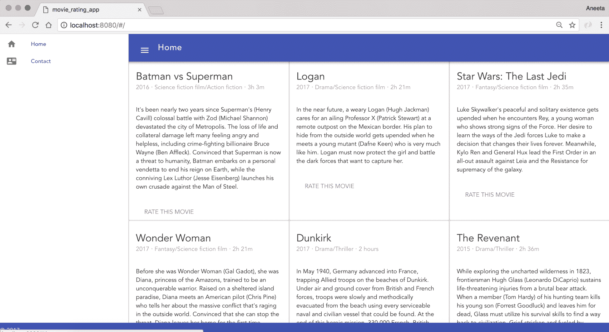

我们将在进行过程中使这些页面动态化。

# 创建添加电影表单

首先，我们需要添加一个链接，带我们到一个添加电影的表单。为此，我们需要更改`App.vue`中的工具栏。所以，让我们在`App.vue`的工具栏中添加一个链接：

```js
<v-toolbar color="indigo" dark fixed app>
 <v-toolbar-side-icon @click.stop="drawer = !drawer"></v-toolbar-side-icon>
 <v-toolbar-title>Home</v-toolbar-title>
 <v-spacer></v-spacer>
 <v-toolbar-items class="hidden-sm-and-down">
 <v-btn flat v-bind:to="{ name: 'AddMovie' }">Add Movie</v-btn>
 </v-toolbar-items>
</v-toolbar>
```

现在我们有了链接，我们需要添加一个路由来将其链接到页面。就像我们为我们的`Contact`页面所做的那样，让我们添加一个用于添加电影到我们应用程序的路由。所以，在`routes/index.js`中：

```js
import Vue from 'vue';
import Router from 'vue-router';
import Home from '@/components/Home';
import Contact from '@/components/Contact';
import AddMovie from '@/components/AddMovie';

Vue.use(Router);

export default new Router({
  routes: [
    {
      path: '/',
      name: 'Home',
      component: Home,
    },
    {
      path: '/contact',
      name: 'Contact',
      component: Contact,
    },
    {
 path: '/movies/add',
 name: 'AddMovie',
 component: AddMovie,
 },
  ],
});
```

在这里，我们为`AddMovie`添加了一个路由，这意味着我们现在可以访问`http://localhost:8080/#/movies/add`的添加电影页面。

现在我们需要做的是创建一个`vue`组件文件。为此，让我们在`src/components`中添加一个新的`AddMovie.vue`文件。Vuetify 提供了一个非常简单的方式来创建表单并添加验证。你可以在[`vuetifyjs.com/components/forms`](https://vuetifyjs.com/components/forms)查找更多信息。

让我们在`src/components/AddMovie.vue`中添加以下内容：

```js
<template>
 <v-form v-model="valid" ref="form" lazy-validation>
 <v-text-field
 label="Movie Name"
 v-model="name"
 :rules="nameRules"
 required
 ></v-text-field>
 <v-text-field
 name="input-7-1"
 label="Movie Description"
 v-model="description"
 multi-line
 ></v-text-field>
 <v-select
 label="Movie Release Year"
 v-model="release_year"
 :items="years"
 ></v-select>
 <v-text-field
 label="Movie Genre"
 v-model="genre"
 ></v-text-field>
 <v-btn
 @click="submit"
 :disabled="!valid"
 >
 submit
 </v-btn>
 <v-btn @click="clear">clear</v-btn>
 </v-form>
</template>
```

Vuetify 还为表单提供了一些基本的验证。让我们也添加一些验证。

在`AddMovie.vue`中的`script`标签内添加以下代码：

```js
<template>
...
</template>
<script>
export default {
 data: () => ({
 valid: true,
 name: '',
 description: '',
 genre: '',
 release_year: '',
 nameRules: [
 v => !!v || 'Movie name is required',
 ],
 select: null,
 years: [
 '2018',
 '2017',
 '2016',
 '2015',
 ],
 }),
 methods: {
 submit() {
 if (this.$refs.form.validate()) {
 // Perform next action
 }
 },
 clear() {
 this.$refs.form.reset();
 },
 },
};
</script>
```

如果我们查看`AddMovie.vue`中的表单元素，说“`v-model="year"`”的行：

```js
 <v-form v-model="valid" ref="form" lazy-validation> 
```

这里`v-model="valid"`部分的作用是，确保表单在为真之前不会提交，这再次与我们在底部添加的脚本相关联。此外，让我们看看我们添加到表单中的验证。

第一个基本验证是`required`验证：

```js
<v-text-field
  label="Movie Name"
  v-model="name"
  :rules="nameRules"
  required
></v-text-field>
```

这在`name`字段中添加了一个`required`验证。

此外，对于`release_year`字段，我们希望它是一个年份的下拉列表，因此，为此，我们添加了以下内容：

```js
<script>
export default {
  data: () => ({
    valid: true,
    name: '',
    description: '',
    genre: '',
    release_year: '',
    nameRules: [
      v => !!v || 'Movie name is required',
    ],
    select: null,
    years: [
 '2018',
 '2017',
 '2016',
 '2015',
 ],
  }),
  methods: {
    submit() {
      if (this.$refs.form.validate()) {
        // Perform next action
      }
    },
    clear() {
      this.$refs.form.reset();
    },
  },
};
</script>
```

这通过脚本动态地向选择列表中添加项目。

关于最后一部分，我们有两个按钮`Submit`和`Clear`，分别调用`submit()`和`clear()`方法。

现在，当你访问 URL（`http://localhost:8080/#/movies/add`）时，你应该有一个这样的表单：


**Movie Name**中的`*`表示这是一个必填字段。

如果你注意到了，我们一直在向所有添加的路由中添加`#`。这是因为这是 Vue.js 路由器的默认设置。我们可以通过在`routes/index.js`中添加`mode: 'history'`来移除它：

```js
import Vue from 'vue';
import Router from 'vue-router';
import Home from '@/components/Home';
import Contact from '@/components/Contact';
import AddMovie from '@/components/AddMovie';

Vue.use(Router);

export default new Router({
  mode: 'history',
  routes: [
    {
      path: '/',
      name: 'Home',
      component: Home,
    },
    {
      path: '/contact',
      name: 'Contact',
      component: Contact,
    },
    {
      path: '/movies/add',
      name: 'AddMovie',
      component: AddMovie,
    },
  ],
});
```

现在，我们都可以在 URL 中不添加`#`来路由，如下所示：

+   `http://localhost:8080/`

+   `http://localhost:8080/contact`

+   `http://localhost:8080/movies/add`

# 与服务器通信

现在我们已经有了电影列表页面，也有了一个添加电影的页面，所以接下来我们要做的是在提交表单时将数据保存到 MongoDB 中。

# 将 express 添加到我们的应用程序

现在我们已经准备好了所有组件，是时候将服务器层添加到我们的应用程序中。

让我们从添加以下 express 包开始：

```js
npm install express --save
```

下一个部分是创建必要的端点和模型，以便我们可以将电影添加到数据库中。

要做到这一点，我们首先需要安装所需的包：

+   `body-parser`: 解析传入的请求

+   `cors`: 用于处理前端和后端之间的跨域请求

+   `morgan`: HTTP 请求记录器

+   `mongoose`: 用于 MongoDB 的对象建模

让我们在终端中运行以下命令来安装所有这些包：

```js
$ npm install morgan body-parser cors mongoose --save
```

# 添加服务器文件

现在，我们需要为我们的应用程序设置服务器。让我们在应用程序的根目录下添加一个名为 `server.js` 的文件，并添加以下内容：

```js
const express = require('express');
const bodyParser = require('body-parser');
const mongoose = require('mongoose');
const cors = require('cors');
const morgan = require('morgan');
const fs = require('fs');

const app = express();
const router = express.Router();
app.use(morgan('combined'));
app.use(bodyParser.json());
app.use(cors());

//connect to mongodb
mongoose.connect('mongodb://localhost/movie_rating_app', function() {
 console.log('Connection has been made');
})
.catch(err => {
 console.error('App starting error:', err.stack);
 process.exit(1);
});

router.get('/', function(req, res) {
 res.json({ message: 'API Initialized!'});
});

const port = process.env.API_PORT || 8081;
app.use('/', router);
app.listen(port, function() {
 console.log(`api running on port ${port}`);
});
```

在这里，我们已经设置了一个服务器，告诉 express 服务器在 8081 端口上运行。我们将使用这个服务器通过 express 处理所有 API 请求。

此外，我们在 `server.js` 文件中已导入并使用了所有需要的包。

此外，对于 mongoose 连接，我们已经添加了一个连接到我们本地数据库 `movie_rating_app` 的连接，以下为代码块：

```js
//connect to mongodb
mongoose.connect('mongodb://localhost/movie_rating_app', function() {
  console.log('Connection has been made');
})
.catch(err => {
  console.error('App starting error:', err.stack);
  process.exit(1);
});
```

如我之前提到的，如果数据库尚不存在，当我们向 DB 添加第一个 Mongoose 文档时，它将自动创建。

下一步是运行我们的 MongoDB 服务器。让我们在终端中运行以下命令来完成：

```js
$ mongod
```

一旦 Mongo 服务器启动，让我们使用以下命令启动这个应用程序的 `node` 服务器：

```js
$ node server.js
```

现在，当我们打开 `http://localhost:8081/` 时，你应该能看到以下信息：

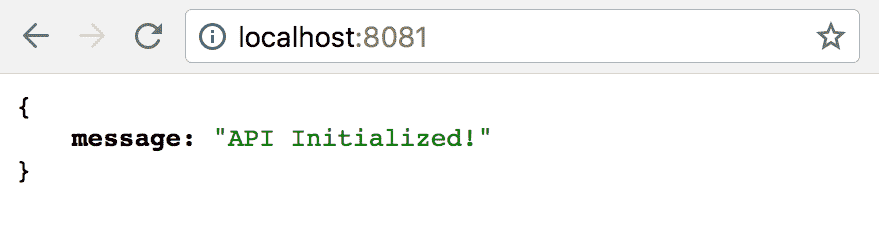

到目前为止，我们的前端服务器已经在端口 8080 上启动并运行，以下为配置信息：

```js
$ npm run dev
```

后端服务器运行在端口 8081，以下为配置信息：

```js
$ node server.js 
```

需要记住的一个重要事项是，每次我们更改 `server.js` 中的代码时，都必须通过运行以下命令来重新启动服务器：

```js
$ node server.js
```

这是一个非常繁琐的任务。然而，有一个很好的方法可以摆脱它。有一个名为 `nodemon` 的包，当安装后，每当代码更新时，它会自动重新启动服务器，我们不需要每次都手动操作。所以，让我们继续安装这个包：

```js
$ npm install nodemon --save 
```

安装了包后，现在我们可以使用以下命令启动我们的服务器：

```js
$ nodemon server.js
```

# 添加电影模型

下一步是在提交表单时将电影添加到数据库中。让我们先在根目录下创建一个名为 `models` 的文件夹，并在 `models` 文件夹中添加一个 `Movie.js` 文件：

我们将为模型使用单数大写名称，并为 `Controllers` 文件使用所有小写复数名称。

将以下代码块放入 `Movie.js`：

```js
const mongoose = require('mongoose');

const Schema = mongoose.Schema;
const MovieSchema = new Schema({
 name: String,
 description: String,
 release_year: Number,
 genre: String,
});

const Movie = mongoose.model('Movie', MovieSchema)
module.exports = Movie;
```

这里，我们创建了一个 Movie 模型，它将接受我们之前添加到 `AddMovie.vue` 表单中的所有四个属性。

# 添加电影控制器

现在，我们需要设置的最后一件事是保存电影到数据库的端点。让我们在根目录中创建一个名为 `controllers` 的文件夹，并在该目录中添加一个名为 `movies.js` 的文件，并添加以下代码：

```js
const MovieSchema = require('../models/Movie.js');

module.exports.controller = (app) => {
 // add a new movie
 app.post('/movies', (req, res) => {
 const newMovie = new MovieSchema({
 name: req.body.name,
 description: req.body.description,
 release_year: req.body.release_year,
 genre: req.body.genre,
 });

 newMovie.save((error, movie) => {
 if (error) { console.log(error); }
 res.send(movie);
 });
 });
};
```

在这里，我们添加了一个端点，它接受带有给定参数的 post 请求，并在我们配置的数据库中创建一个 Mongoose 文档。

由于这些控制器有路由，我们需要将这些文件包含在我们的主入口点中。对于我们的后端，主入口文件是 `server.js`。所以，让我们在 `server.js` 中添加以下高亮代码块：

```js
...
//connect to mongodb
mongoose.connect('mongodb://localhost/movie_rating_app', function() {
  console.log('Connection has been made');
})
.catch(err => {
  console.error('App starting error:', err.stack);
  process.exit(1);
});

// Include controllers
fs.readdirSync("controllers").forEach(function (file) {
 if(file.substr(-3) == ".js") {
 const route = require("./controllers/" + file)
 route.controller(app)
 }
})

router.get('/', function(req, res) {
  res.json({ message: 'API Initialized!'});
});
...
```

这个代码块将包括所有控制器的文件，我们不需要手动添加每一个。

# 连接前端和后端

现在，我们有了模型和端点。接下来要做的事情是在我们点击 `AddMovie.vue` 中的 `提交` 按钮时调用这个端点。

这是我们需要与前端和后端通信的部分。为此，我们需要使用一个名为 axios 的单独包。

axios 包帮助我们从 Node.js 中进行 HTTP 请求。它还帮助我们从前端进行 Ajax 调用。axios 也有几个替代方案，例如 fetch 和 superagent。但 axios 已经足够成功，成为了这些中最受欢迎的一个。因此，我们也将使用它。

# 安装 axios

现在，为了在客户端和服务器之间进行通信，我们将使用 `axios` 库。所以，让我们首先安装这个库：

```js
npm install axios --save
```

# 连接所有部分

现在，我们已经有了所有东西（电影模型、电影控制器和 axios）来在客户端和服务器之间进行通信。现在要做的最后一件事是在我们点击电影添加表单中的提交按钮时连接这些部分。如果你记得，我们在 `AddMovie.vue` 中提交按钮时添加了一个占位符：

```js
<v-select
      label="Movie Release Year"
      v-model="select"
      :items="years"
    ></v-select>
    <v-text-field
      label="Movie Genre"
      v-model="genre"
    ></v-text-field>
    <v-btn
 @click="submit"
 :disabled="!valid"
 >
      submit
    </v-btn>
    <v-btn @click="clear">clear</v-btn>
```

这段代码告诉我们，当按钮被点击时，执行 `submit()` 方法。我们也在 `script` 部分有这个操作：

```js
...
methods: {
    submit() {
 if (this.$refs.form.validate()) {
 // Perform next action
 }
 },
    clear() {
      this.$refs.form.reset();
    },
  },
...
```

我们将在本节中添加所有方法。现在我们已经有了 `submit` 的占位符，让我们修改这段代码以包含电影添加表单：

```js
<script>
import axios from 'axios';

export default {
  data: () => ({
    valid: true,
    name: '',
    description: '',
    genre: '',
    release_year: '',
    nameRules: [
      v => !!v || 'Movie name is required',
    ],
    select: null,
    years: [
      '2018',
      '2017',
      '2016',
      '2015',
    ],
  }),
  methods: {
    submit() {
 if (this.$refs.form.validate()) {
 return axios({
 method: 'post',
 data: {
 name: this.name,
 description: this.description,
 release_year: this.release_year,
 genre: this.genre,
 },
 url: 'http://localhost:8081/movies',
 headers: {
 'Content-Type': 'application/json',
 },
 })
 .then(() => {
 this.$router.push({ name: 'Home' });
 this.$refs.form.reset();
 })
 .catch(() => {
 });
 }
 return true;
 },
    clear() {
      this.$refs.form.reset();
    },
  },
};
</script>
```

这应该足够了。现在，让我们从 UI 本身添加一个电影到 `http://localhost:8080/movies/add` 端点。我们应该能够将电影的记录保存到 MongoDB 中。让我简单解释一下我们在这里做了什么。

当我们点击 `提交` 按钮时，我们通过 axios 发送一个 AJAX 请求，以击中电影控制器中的 post 端点。电影控制器中的 `post` 方法反过来，根据我们为电影设计的模型模式保存记录。并且，当这个过程完成后，将页面重定向回主页。

为了检查记录是否实际上已创建，让我们看看 MongoDB：

```js
$ mongo
$ use movie_rating_app
$ db.movies.find()
```

我们可以看到正在创建的记录，其参数是我们提供的表单中的参数：

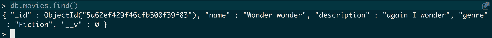

# 添加表单验证

我们在上一节中介绍了如何添加验证。让我们继续添加一些验证到我们的电影添加表单中。我们将添加以下验证：

+   `电影名称`不能为空

+   `电影描述`是可选的

+   `电影发行年份`不能为空

+   电影类型是必需的，并且最大长度为 80 个字符

在`AddMovie.vue`中，让我们在输入字段中添加规则，并将规则从脚本中绑定：

```js
<template>
  <v-form v-model="valid" ref="form" lazy-validation>
    <v-text-field
      label="Movie Name"
      v-model="name"
      :rules="nameRules"
      required
    ></v-text-field>
    <v-text-field
      name="input-7-1"
      label="Movie Description"
      v-model="description"
      multi-line
    ></v-text-field>
    <v-select
      label="Movie Release Year"
      v-model="release_year"
      required
 :rules="releaseRules"
      :items="years"
    ></v-select>
    <v-text-field
      label="Movie Genre"
      v-model="genre"
      required
 :rules="genreRules"
    ></v-text-field>
    <v-btn
      @click="submit"
      :disabled="!valid"
    >
      submit
    </v-btn>
    <v-btn @click="clear">clear</v-btn>
  </v-form>
</template>
<script>
  import axios from 'axios';

  export default {
    data: () => ({
      valid: true,
      name: '',
      description: '',
      genre: '',
      release_year: '',
      nameRules: [
        (v) => !!v || 'Movie name is required'
      ],
      genreRules: [
 v => !!v || 'Movie genre year is required',
 v => (v && v.length <= 80) || 'Genre must be less than equal to 80 characters.',
 ],
 releaseRules: [
 v => !!v || 'Movie release year is required',
 ],
      select: null,
      years: [
        '2018',
        '2017',
        '2016',
        '2015'
      ],
      checkbox: false
    }),
    methods: {
      submit () {
        if (this.$refs.form.validate()) {
          return axios({
            method: 'post',
            data: {
              name: this.name,
              description: this.description,
              release_year: this.release_year,
              genre: this.genre
            },
            url: 'http://localhost:8081/movies',
            headers: {
              'Content-Type': 'application/json'
            }
          })
          .then((response) => {
            this.$router.push({ name: 'Home' });
            this.$refs.form.reset();
          })
          .catch((error) => {
          });
        }
      },
      clear () {
        this.$refs.form.reset()
      }
    }
  }
</script>
```

现在，如果我们尝试提交所有字段都为空的表单，以及`电影类型`字段超过 80 个字符，我们就不应该能够提交表单。表单将显示以下错误信息：

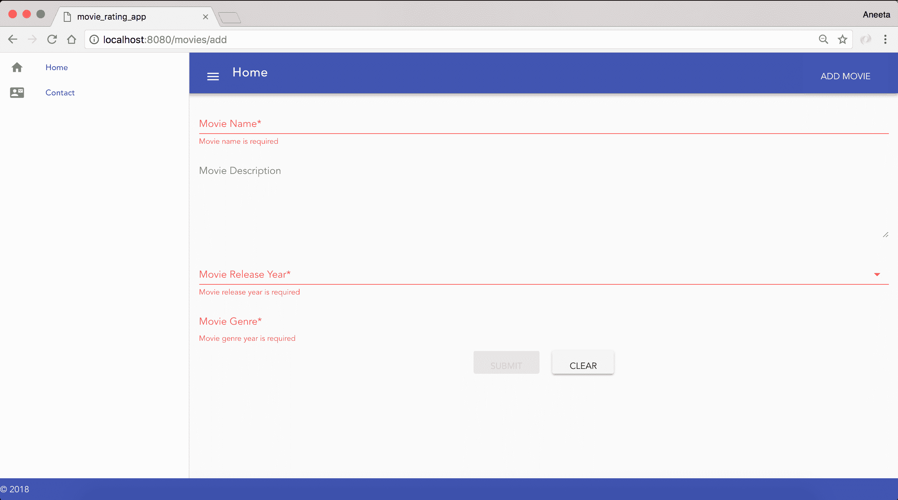

# 添加闪存消息

我们已经介绍了应用构建的基础知识。现在，既然我们可以添加一部电影，那么当电影成功保存在数据库中时，显示一条消息或者通知如果出现错误就非常好了。有几个`npm`包可以做到这一点。我们也可以自己构建。对于这个应用，我们将使用一个名为：`vue-swal(https://www.npmjs.com/package/vue-swal)`的包。让我们首先添加这个包：

```js
$ npm install vue-swal --save
```

现在，让我们将包包含到我们的`main.js`文件中：

```js
// The Vue build version to load with the `import` command
// (runtime-only or standalone) has been set in webpack.base.conf with an alias.
import 'bootstrap/dist/css/bootstrap.min.css';
import 'bootstrap-vue/dist/bootstrap-vue.css';

import BootstrapVue from 'bootstrap-vue';
import Vue from 'vue';
import Vuetify from 'vuetify';
import VueSwal from 'vue-swal';
import App from './App';
import router from './router';

Vue.use(BootstrapVue);
Vue.use(Vuetify);
Vue.use(VueSwal);

Vue.config.productionTip = false;

/* eslint-disable no-new */
new Vue({
  el: '#app',
  router,
  components: { App },
  template: '<App/>',
});
```

现在，让我们修改我们的`AddMovie.vue`，以便在操作成功执行或失败时显示闪存消息：

```js
...
methods: {
  submit() {
    if (this.$refs.form.validate()) {
      return axios({
        method: 'post',
        data: {
          name: this.name,
          description: this.description,
          release_year: this.release_year,
          genre: this.genre,
        },
        url: 'http://localhost:8081/movies',
        headers: {
          'Content-Type': 'application/json',
        },
      })
        .then(() => {
          this.$swal(
 'Great!',
 'Movie added successfully!',
 'success',
 );
          this.$router.push({ name: 'Home' });
          this.$refs.form.reset();
        })
        .catch(() => {
          this.$swal(
 'Oh oo!',
 'Could not add the movie!',
 'error',
 );
        });
    }
    return true;
  },
  clear() {
    this.$refs.form.reset();
  },
},
...
```

现在，有了这个，当我们提交电影时，我们应该能够在重定向到主页之前看到一条成功消息：

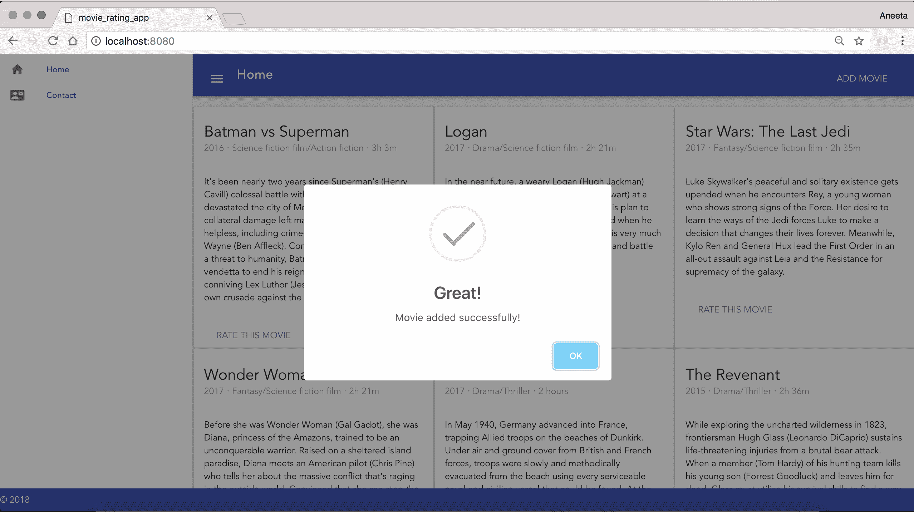

还有其他几个用于消息警报的包，例如`vue-flash`、`vuex-flash`和`sweet-alert`。

# 在主页上加载动态内容

目前，我们的主页内容中包含所有静态电影。让我们用我们添加到数据库中的电影数据来填充数据。为此，首先要做的事情是添加一些电影到数据库中，我们可以通过 UI 中的`http://localhost:8080/movies/add`端点来完成：

# 获取所有电影的 API 端点

首先，我们需要添加一个端点来从 Mongo 数据库中获取所有电影。所以，让我们首先在`controllers/movies.js`中添加一个获取所有电影的端点：

```js
const MovieSchema = require('../models/Movie.js');

module.exports.controller = (app) => {
  // fetch all movies
 app.get('/movies', (req, res) => {
 MovieSchema.find({}, 'name description release_year genre', (error, movies) => {
 if (error) { console.log(error); }
 res.send({
 movies,
 });
 });
 });

  // add a new movie
  app.post('/movies', (req, res) => {
    const newMovie = new MovieSchema({
      name: req.body.name,
      description: req.body.description,
      release_year: req.body.release_year,
      genre: req.body.genre,
    });

    newMovie.save((error, movie) => {
      if (error) { console.log(error); }
      res.send(movie);
    });
  });
};
```

现在，如果你点击 URL `http://localhost:8081/movies`，我们应该能够看到通过 UI 或 mongo shell 本身添加的整个电影列表。以下是我所看到的：

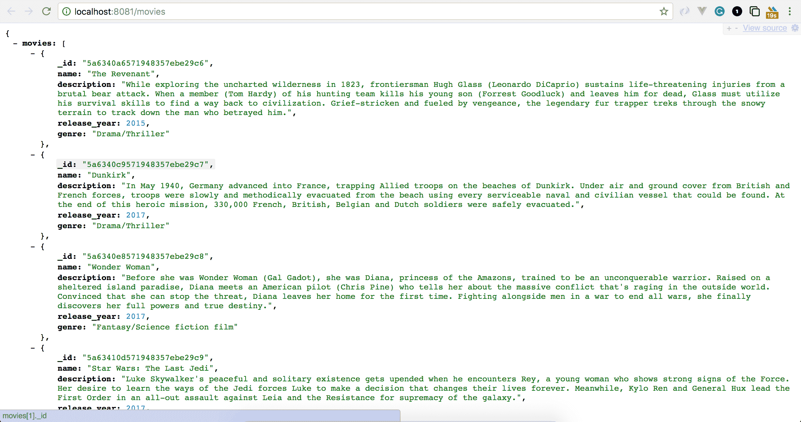

# 修改`Home.vue`以显示动态内容

现在，让我们更新我们的`Home.vue`，它将获取我们的 Mongo 数据库中的电影并显示动态内容。用以下内容替换`Home.vue`中的代码：

```js
<template>
  <v-layout row wrap>
    <v-flex xs4>
      <v-card>
        <v-card-title primary-title>
          <div>
            <div class="headline">Batman vs Superman</div>
            <span class="grey--text">2016 ‧ Science fiction film/Action 
            fiction ‧ 3h 3m</span>
          </div>
        </v-card-title>
        <v-card-text>
          It's been nearly two years since Superman's (Henry Cavill) colossal battle with Zod (Michael Shannon) devastated the city of Metropolis. The loss of life and collateral damage left many feeling angry and helpless, including crime-fighting billionaire Bruce Wayne (Ben Affleck). Convinced that Superman is now a threat to humanity, Batman embarks on a personal vendetta to end his reign on Earth, while the conniving Lex Luthor (Jesse Eisenberg) launches his own crusade against the Man of Steel.
        </v-card-text>
        <v-card-actions>
          <v-btn flat color="purple">Rate this movie</v-btn>
          <v-spacer></v-spacer>
        </v-card-actions>
      </v-card>
    </v-flex>
    <v-flex xs4>
      <v-card>
        <v-card-title primary-title>
          <div>
            <div class="headline">Logan</div>
            <span class="grey--text">2017 ‧ Drama/Science fiction film ‧ 
            2h 21m</span>
          </div>
        </v-card-title>
        <v-card-text>
          In the near future, a weary Logan (Hugh Jackman) cares for an ailing Professor X (Patrick Stewart) at a remote outpost on the Mexican border. His plan to hide from the outside world gets upended when he meets a young mutant (Dafne Keen) who is very much like him. Logan must now protect the girl and battle the dark forces that want to capture her.
        </v-card-text>
        <v-card-actions>
          <v-btn flat color="purple">Rate this movie</v-btn>
          <v-spacer></v-spacer>
        </v-card-actions>
      </v-card>
    </v-flex>
    <v-flex xs4>
      <v-card>
        <v-card-title primary-title>
          <div>
            <div class="headline">Star Wars: The Last Jedi</div>
            <span class="grey--text">2017 ‧ Fantasy/Science fiction film 
            ‧ 2h 35m</span>
          </div>
        </v-card-title>
        <v-card-text>
          Luke Skywalker's peaceful and solitary existence gets upended when he encounters Rey, a young woman who shows strong signs of the Force. Her desire to learn the ways of the Jedi forces Luke to make a decision that changes their lives forever. Meanwhile, Kylo Ren and General Hux lead the First Order in an all-out assault against Leia and the Resistance for supremacy of the galaxy.
        </v-card-text>
        <v-card-actions>
          <v-btn flat color="purple">Rate this movie</v-btn>
          <v-spacer></v-spacer>
        </v-card-actions>
      </v-card>
    </v-flex>
    <v-flex xs4>
      <v-card>
        <v-card-title primary-title>
          <div>
            <div class="headline">Wonder Woman</div>
            <span class="grey--text">2017 ‧ Fantasy/Science fiction film 
            ‧ 2h 21m</span>
          </div>
        </v-card-title>
        <v-card-text>
          Before she was Wonder Woman (Gal Gadot), she was Diana, princess of the Amazons, trained to be an unconquerable warrior. Raised on a sheltered island paradise, Diana meets an American pilot (Chris Pine) who tells her about the massive conflict that's raging in the outside world. Convinced that she can stop the threat, Diana leaves her home for the first time. Fighting alongside men in a war to end all wars, she finally discovers her full powers and true destiny.
        </v-card-text>
        <v-card-actions>
          <v-btn flat color="purple">Rate this movie</v-btn>
          <v-spacer></v-spacer>
        </v-card-actions>
      </v-card>
    </v-flex>
    <v-flex xs4>
      <v-card>
        <v-card-title primary-title>
          <div>
            <div class="headline">Dunkirk</div>
            <span class="grey--text">2017 ‧ Drama/Thriller ‧ 2 
            hours</span>
          </div>
        </v-card-title>
        <v-card-text>
          In May 1940, Germany advanced into France, trapping Allied troops on the beaches of Dunkirk. Under air and ground cover from British and French forces, troops were slowly and methodically evacuated from the beach using every serviceable naval and civilian vessel that could be found. At the end of this heroic mission, 330,000 French, British, Belgian and Dutch soldiers were safely evacuated.
        </v-card-text>
        <v-card-actions>
          <v-btn flat color="purple">Rate this movie</v-btn>
          <v-spacer></v-spacer>
        </v-card-actions>
      </v-card>
    </v-flex>
    <v-flex xs4>
      <v-card>
        <v-card-title primary-title>
          <div>
            <div class="headline">The Revenant</div>
            <span class="grey--text">2015 ‧ Drama/Thriller ‧ 2h 
            36m</span>
          </div>
        </v-card-title>
        <v-card-text>
          While exploring the uncharted wilderness in 1823, frontiersman Hugh Glass (Leonardo DiCaprio) sustains life-threatening injuries from a brutal bear attack. When a member (Tom Hardy) of his hunting team kills his young son (Forrest Goodluck) and leaves him for dead, Glass must utilize his survival skills to find a way back to civilization. Grief-stricken and fueled by vengeance, the legendary fur trapper treks through the snowy terrain to track down the man who betrayed him.
        </v-card-text>
        <v-card-actions>
          <v-btn flat color="purple">Rate this movie</v-btn>
          <v-spacer></v-spacer>
        </v-card-actions>
      </v-card>
    </v-flex>
  </v-layout>
</template>
<script>
import axios from 'axios';

export default {
  name: 'Movies',
  data() {
    return {
      movies: [],
    };
  },
  mounted() {
    this.fetchMovies();
  },
  methods: {
    async fetchMovies() {
      return axios({
        method: 'get',
        url: 'http://localhost:8081/movies',
      })
        .then((response) => {
          this.movies = response.data.movies;
        })
        .catch(() => {
        });
    },
  },
};
</script>
```

此代码在页面加载时调用一个方法，该方法在 `mounted` 方法中定义。该方法使用 axios 请求获取电影。现在，我们已经从服务器将数据拉到客户端。现在，我们将使用 `vue` 指令遍历这些电影并在主页上渲染。在 `Home.vue` 中，将 `<template>` 标签的内容替换为以下代码：

```js
<template>
  <v-layout row wrap>
    <v-flex xs4 v-for="movie in movies" :key="movie._id">
      <v-card>
        <v-card-title primary-title>
          <div>
            <div class="headline">{{ movie.name }}</div>
            <span class="grey--text">{{ movie.release_year }} ‧ {{ movie.genre }}</span>
          </div>
        </v-card-title>
        <v-card-text>
          {{ movie.description }}
        </v-card-text>
      </v-card>
    </v-flex>
  </v-layout>
</template>
...
```

如您所见，我们使用了 `vue` 指令 `for`。键用于为每个记录分配一个唯一的标识符。现在，当您访问 `http://localhost:8080/` 时，您将看到以下内容：

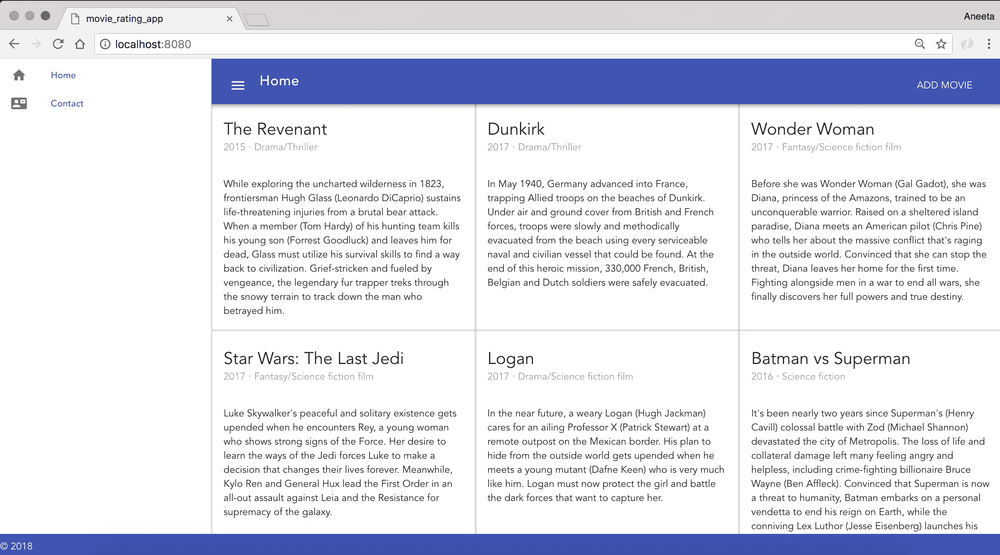

我们已经成功构建了一个应用程序，可以添加电影到 MongoDB，并在主页上显示数据库记录。

# 添加电影简介页面

现在，我们需要一个页面，让登录用户可以前往并评分电影。为此，让我们在主页上添加一个链接到电影的标题。在 `Home.vue` 中，将模板部分替换为以下内容：

```js
<template>
  <v-layout row wrap>
    <v-flex xs4 v-for="movie in movies" :key="movie._id">
      <v-card>
        <v-card-title primary-title>
          <div>
            <div class="headline">
 <v-btn flat v-bind:to="`/movies/${movie._id}`">
 {{ movie.name }}
 </v-btn>
 </div>
            <span class="grey--text">{{ movie.release_year }} ‧ {{ movie.genre }}</span>
          </div>
        </v-card-title>
        <v-card-text>
          {{ movie.description }}
        </v-card-text>
      </v-card>
    </v-flex>
  </v-layout>
</template>
```

在这里，我们添加了一个链接到标题，该链接将用户带到相应的详情页面。

让我们添加一个页面，用于显示电影的详细视图，登录用户可以前往并评分电影。在 `src/components` 目录下创建一个名为 `Movie.vue` 的文件，并添加以下内容：

```js
<template>
 <v-layout row wrap>
 <v-flex xs4>
 <v-card>
 <v-card-title primary-title>
 <div>
 <div class="headline">{{ movie.name }}</div>
 <span class="grey--text">{{ movie.release_year }} ‧ {{ movie.genre }}</span>
 </div>
 </v-card-title>
 <h6 class="card-title">Rate this movie</h6>
 <v-card-text>
 {{ movie.description }}
 </v-card-text>
 </v-card>
 </v-flex>
 </v-layout>
</template>
<script>
import axios from 'axios';

export default {
 name: 'Movie',
 data() {
 return {
 movie: [],
 };
 },
 mounted() {
 this.fetchMovie();
 },
 methods: {
 async fetchMovie() {
 return axios({
 method: 'get',
 url: `http://localhost:8081/api/movies/${this.$route.params.id}`,
 })
 .then((response) => {
 this.movie = response.data;
 })
 .catch(() => {
 });
 },
 },
};
</script>
```

我们在这里添加了一个 axios 请求，用于在用户点击电影标题时获取电影。

现在，我们还需要定义到该页面的路由。所以，在 `routes/index.js` 中，将内容替换为以下：

```js
import Vue from 'vue';
import Router from 'vue-router';
import Home from '@/components/Home';
import Contact from '@/components/Contact';
import AddMovie from '@/components/AddMovie';
import Register from '@/components/Register';
import Login from '@/components/Login';
import Movie from '@/components/Movie';

Vue.use(Router);

export default new Router({
  mode: 'history',
  routes: [
    {
      path: '/',
      name: 'Home',
      component: Home,
    },
    {
      path: '/contact',
      name: 'Contact',
      component: Contact,
    },
    {
      path: '/movies/add',
      name: 'AddMovie',
      component: AddMovie,
    },
    {
 path: '/movies/:id',
 name: 'Movie',
 component: Movie,
 },
  ],
});
```

现在，我们需要添加一个用于获取指定 ID 电影的 GET 请求端点。

将 `controllers/movies.js` 中的内容替换为以下：

```js
const MovieSchema = require('../models/Movie.js');

module.exports.controller = (app) => {
  // fetch all movies
  app.get('/movies', (req, res) => {
    MovieSchema.find({}, 'name description release_year genre', (error, movies) => {
      if (error) { console.log(error); }
      res.send({
        movies,
      });
    });
  });

  // fetch a single movie
 app.get('/api/movies/:id', (req, res) => {
 MovieSchema.findById(req.params.id, 'name description release_year genre', (error, movie) => {
 if (error) { console.error(error); }
 res.send(movie);
 });
 });

  // add a new movie
  app.post('/movies', (req, res) => {
    const newMovie = new MovieSchema({
      name: req.body.name,
      description: req.body.description,
      release_year: req.body.release_year,
      genre: req.body.genre,
    });

    newMovie.save((error, movie) => {
      if (error) { console.log(error); }
      res.send(movie);
    });
  });
};
```

现在，当我们点击电影标题上的链接时，我们应该能够看到以下页面：

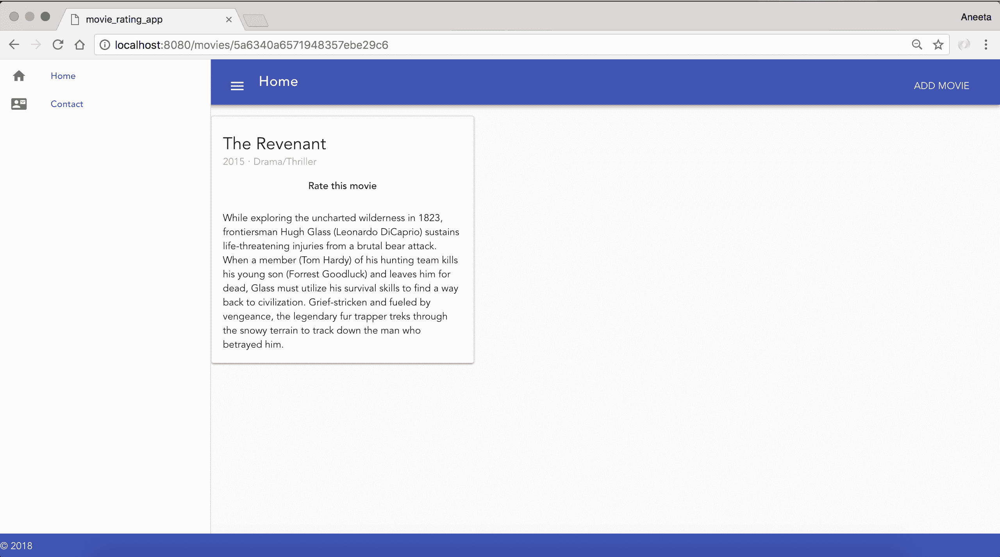

在这里，我们还添加了一个用户可以点击的区域来评分电影。让我们继续添加评分电影的功能。为此，我们将使用一个名为 `vue-star-rating` 的包，它使得添加评分组件变得容易。您可以在以下链接中找到这个示例：`https://jsfiddle.net/anteriovieira/8nawdjs7/`。

让我们首先添加这个包：

```js
$ npm install vue-star-rating --save
```

在 `Movie.vue` 中，将内容替换为以下：

```js
<template>
  <v-layout row wrap>
    <v-flex xs4>
      <v-card>
        <v-card-title primary-title>
          <div>
            <div class="headline">{{ movie.name }}</div>
            <span class="grey--text">{{ movie.release_year }} ‧ {{ movie.genre }}</span>
          </div>
        </v-card-title>
 <h6 class="card-title" v-if="current_user">Rate this movie</h6>
        <v-card-text>
          {{ movie.description }}
        </v-card-text>
      </v-card>
    </v-flex>
  </v-layout>
</template>
<script>
import axios from 'axios';
import Vue from 'vue';
import StarRating from 'vue-star-rating';

const wrapper = document.createElement('div');
// shared state
const state = {
 note: 0,
};
// crate component to content
const RatingComponent = Vue.extend({
 data() {
 return { rating: 0 };
 },
 watch: {
 rating(newVal) { state.note = newVal; },
 },
 template: `
 <div class="rating">
 How was your experience getting help with this issues?
 <star-rating v-model="rating" :show-rating="false"></star-rating>
 </div>`,
 components: { 'star-rating': StarRating },
});

const component = new RatingComponent().$mount(wrapper);

export default {
  name: 'Movie',
  data() {
    return {
      movie: [],
    };
  },
  mounted() {
    this.fetchMovie();
  },
  methods: {
    async rate() {
 this.$swal({
 content: component.$el,
 buttons: {
 confirm: {
 value: 0,
 },
 },
 }).then(() => {
 const movieId = this.$route.params.id;
 return axios({
 method: 'post',
 data: {
 rate: state.note,
 },
 url: `http://localhost:8081/movies/rate/${movieId}`,
 headers: {
 'Content-Type': 'application/json',
 },
 })
 .then(() => {
 this.$swal(`Thank you for rating! ${state.note}`, 'success');
 })
 .catch((error) => {
 const message = error.response.data.message;
 this.$swal('Oh oo!', `${message}`, 'error');
 });
 });
 },
    async fetchMovie() {
      return axios({
        method: 'get',
        url: `http://localhost:8081/api/movies/${this.$route.params.id}`,
      })
        .then((response) => {
          this.movie = response.data;
        })
        .catch(() => {
        });
    },
  },
};
</script>
```

让我们更新代码，以便在点击“评分这部电影”时调用 `rate` 方法。在 `Movie.vue` 中更新以下代码行：

```js
...
<h6 class="card-title" v-if="current_user" @click="rate">Rate this movie</h6>
...
```

现在我们需要做的最后一件事是在 `movies.js` 中添加 `rate` 端点：

```js
var Movie = require("../models/Movie");

module.exports.controller = (app) => {
  // fetch all movies
  app.get("/movies", function(req, res) {
    Movie.find({}, 'name description release_year genre', function (error, movies) {
      if (error) { console.log(error); }
       res.send({
        movies: movies
      })
    })
  })

  // fetch a single movie
  app.get("/api/movies/:id", function(req, res) {
    Movie.findById(req.params.id, 'name description release_year 
    genre', function (error, movie) {
      if (error) { console.error(error); }
      res.send(movie)
    })
  })

  // rate a movie
 app.post('/movies/rate/:id', (req, res) => {
 const rating = new Rating({
 movie_id: req.params.id,
 user_id: req.body.user_id,
 rate: req.body.rate,
 })

 rating.save(function (error, rating) {
 if (error) { console.log(error); }
 res.send({
 movie_id: rating.movie_id,
 user_id: rating.user_id,
 rate: rating.rate
 })
 })
 })

  // add a new movie
  app.post('/movies', (req, res) => {
    const movie = new Movie({
      name: req.body.name,
      description: req.body.description,
      release_year: req.body.release_year,
      genre: req.body.genre
    })

    movie.save(function (error, movie) {
      if (error) { console.log(error); }
      res.send(movie)
    })
  })
}
```

该端点将用户评分保存到一个名为 `Rating` 的单独集合中，我们尚未创建。让我们继续创建该文件。在 `models` 目录下创建一个名为 `Rating.js` 的文件，并添加以下内容：

```js
const mongoose = require('mongoose')
const Schema = mongoose.Schema
const RatingSchema = new Schema({
 movie_id: String,
 user_id: String,
 rate: Number
})

const Rating = mongoose.model("Rating", RatingSchema)
module.exports = Rating
```

同样在 `movies.js` 中包含相同的模型：

```js
const Movie = require("../models/Movie");
const Rating = require("../models/Rating");
```

就这样！现在，用户在登录后应该能够评分电影。当点击“评分这部电影”时，用户应该会弹出一个窗口，并在成功评分后显示评分分数以及感谢信息：

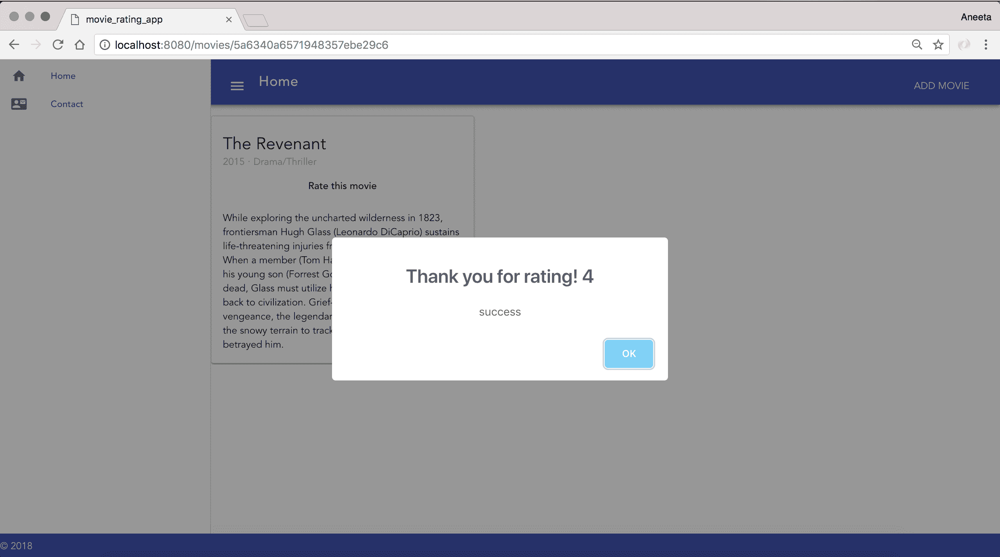

# 摘要

在本章中，我们介绍了 Vue.js 是什么！我们构建了一个静态应用程序，列出了电影，随后通过一个表单添加了动态功能，该表单将电影存储在 MongoDB 中。我们还学习了 Vue.js 组件、数据绑定和 Vue.js 指令。

我们还增加了用户对电影进行评分的功能。

在下一章中，我们将在同一应用程序中添加用户和登录/注册功能。
