# 第七章：使用 passport.js 构建 OAuth 策略

在上一章中，我们讨论了 passport-JWT 策略。我们讨论了如何利用 JWT 包来构建一个健壮的用户注册流程。我们介绍了如何实现用户的注册和登录过程。在本章中，我们将深入以下部分：

+   `passport.js` Facebook 策略

+   `passport.js` Twitter 策略

+   `passport.js` Google 策略

+   `passport.js` LinkedIn 策略

如果我们从头开始做这些工作，这些部分单独就会花费很多时间。`passport.js`提供了一种更简单的方法，以非常灵活的方式集成所有这些策略，并使它们更容易实现。

**OAuth**是一种认证协议，允许用户通过不同的外部服务登录。例如，如果用户已经在 Facebook 或 Twitter 上登录，那么通过 Facebook 或 Twitter 登录应用程序不需要用户提供用户名和密码。这节省了用户在应用程序中设置新账户的时间，使得登录过程更加顺畅。这使得登录应用程序变得更加容易；否则，用户首先需要在我们应用程序中注册，然后使用这些凭据登录。Passport 的 OAuth 策略允许用户在浏览器记住账户的情况下，通过单点登录到我们的应用程序。其余的一切都是自动完成的，并由策略本身处理。

# Passport 的 Facebook 策略

Passport 的 Facebook 策略易于集成。一如既往，让我们从安装这个策略开始。

# 安装 Passport 的 Facebook 策略

我们可以通过运行以下命令来安装 passport 的 Facebook 策略：

```js
$ npm install passport-facebook --save
```

以下代码应该会将包添加到你的`package.json`文件中：

```js
...
"node-sass": "⁴.7.2",
"nodemon": "¹.14.10",
"passport": "⁰.4.0",
"passport-facebook": "².1.1",
...
```

# 配置 Passport 的 Facebook 策略

配置 Passport 的 Facebook 策略有几个步骤。我们将详细讨论每个步骤：

1.  创建并设置一个 Facebook 应用。这将为我们提供一个`App ID`和一个`App Secret`。

1.  在我们的登录页面上添加一个按钮，允许我们的用户通过 Facebook 登录。

1.  添加 Facebook 认证所需的必要路由。

1.  添加一个中间件方法来检查认证是否成功。

让我们深入了解前面每个步骤的细节。

# 创建并设置一个 Facebook 应用

要使用 Facebook 策略，你必须首先构建一个 Facebook 应用。Facebook 的开发者门户在[`developers.facebook.com/`](https://developers.facebook.com/)。

登录后，点击“开始”按钮，然后点击“下一步”。

然后，你将在屏幕右上角看到一个名为“我的应用”的下拉菜单，你可以在这里找到创建新应用程序的选项。

选择一个你想为你的应用程序命名的显示名称。在这种情况下，我们将命名为`movie_rating_app`：

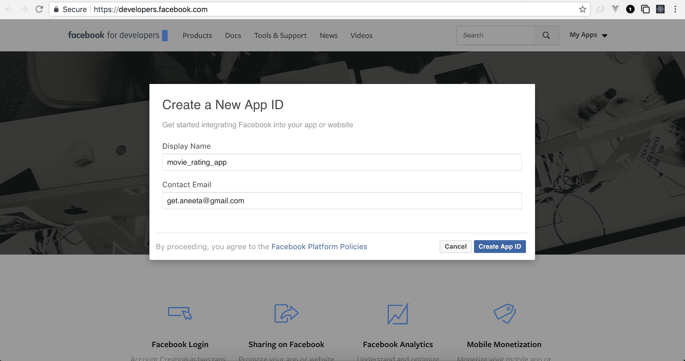

点击“创建 App ID”。如果你进入设置页面，你会看到你应用的 App ID 和 App Secret：

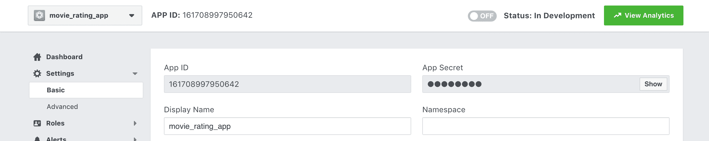

你将需要前一个屏幕截图中提到的值。

# 在我们的登录页面添加一个按钮，允许用户通过 Facebook 登录

下一步是在登录页面添加一个“使用 Facebook 登录”按钮，你将链接到你的 Facebook 应用程序。将 `Login.vue` 的内容替换为以下内容：

```js
<template>
  <div>
    <div class="login">
      <a class="btn facebook" href="/login/facebook"> LOGIN WITH FACEBOOK</a>
 </div>
    <v-form v-model="valid" ref="form" lazy-validation>
      <v-text-field
        label="Email"
        v-model="email"
        :rules="emailRules"
        required
      ></v-text-field>
      <v-text-field
        label="Password"
        v-model="password"
        :rules="passwordRules"
        required
      ></v-text-field>
      <v-btn
        @click="submit"
        :disabled="!valid"
      >
        submit
      </v-btn>
      <v-btn @click="clear">clear</v-btn><br/>
    </v-form>
  </div>
</template>
...
```

让我们也为这些按钮添加一些样式。在 `src/assets/stylesheets/home.css` 中，添加以下代码：

```js
#app {
  font-family: 'Avenir', Helvetica, Arial, sans-serif;
  -webkit-font-smoothing: antialiased;
  -moz-osx-font-smoothing: grayscale;
  text-align: center;
  color: #2c3e50;
  width: 100%;
}

#inspire {
  font-family: 'Avenir', Helvetica, Arial, sans-serif;
}

.container.fill-height {
  align-items: normal;
}

a.side_bar_link {
  text-decoration: none;
}

.card__title--primary, .card__text {
  text-align: left;
}

.card {
  height: 100% !important;
}

.btn.facebook {
 background-color: #3b5998 !important;
 border-color: #2196f3;
 color: #fff !important;
}

.btn.twitter {
 background-color: #2196f3 !important;
 border-color: #2196f3;
 color: #fff !important;
}

.btn.google {
 background-color: #dd4b39 !important;
 border-color: #dd4b39;
 color: #fff !important;
}

.btn.linkedin {
 background-color: #4875B4 !important;
 border-color: #4875B4;
 color: #fff !important;
}
```

上述代码将添加一个“使用 Facebook 登录”按钮：


# 为 Facebook 应用添加配置

让我们配置 Facebook 策略，就像我们为本地策略所做的那样。我们将创建一个单独的文件来处理 Facebook 登录，以便代码更简单。让我们在 `controllers` 文件夹中创建一个名为 `facebook.js` 的文件，并将以下内容添加到其中：

```js
const User = require('../models/User.js');
const passport = require('passport');
const config = require('./../config/Config');
const Strategy = require('passport-facebook').Strategy;

module.exports.controller = (app) => {
 // facebook strategy
 passport.use(new Strategy({
 clientID: config.FACEBOOK_APP_ID,
 clientSecret: config.FACEBOOK_APP_SECRET,
 callbackURL: '/login/facebook/return',
 profileFields: ['id', 'displayName', 'email']
 },
 (accessToken, refreshToken, profile, cb) => {
 // Handle facebook login
 }));
};
```

在上述代码中，`exports` 方法内部的第一行代码导入了 Facebook 策略。配置需要三个参数：`clientID`、`clientSecret` 和回调 URL。`clientID` 和 `clientSecret` 分别是 Facebook 应用的 `App ID` 和 `App Secret`。

让我们将这些密钥添加到我们的配置文件中。在 `config/Config.js` 中，让我们添加我们的 Facebook 密钥，`facebook_client_id` 和 `facebook_client_secret`：

```js
module.exports = {
  DB: 'mongodb://localhost/movie_rating_app',
  SECRET: 'movieratingappsecretkey',
  FACEBOOK_APP_ID: <facebook_client_id>,
 FACEBOOK_APP_SECRET: <facebook_client_secret>
}
```

回调 URL 是在成功与 Facebook 交易后，你想要将应用程序路由到的 URL。

我们在这里定义的回调是 `http://127.0.0.1:8081/login/facebook/return`，这是我们必须要定义的。配置之后是一个函数，该函数接受以下四个参数：

+   `accessToken`

+   `refreshToken`

+   `profile`

+   `cb`（回调）

请求成功后，我们的应用程序将被重定向到主页。

# 添加必要的 Facebook 登录路由

现在，让我们继续添加必要的路由，以便在点击登录按钮和收到 Facebook 的回调时使用。在同一个文件 `facebook.js` 中，添加以下路由：

```js
const User = require("../models/User");
const passport = require('passport');
const config = require('./../config/Config');

module.exports.controller = (app) => {
  // facebook strategy
  const Strategy = require('passport-facebook').Strategy;

  passport.use(new Strategy({
    clientID: config.FACEBOOK_APP_ID,
    clientSecret: config.FACEBOOK_APP_SECRET,
    callbackURL: '/api/login/facebook/return',
    profileFields: ['id', 'displayName', 'email']
  },
  function(accessToken, refreshToken, profile, cb) {
  }));

  app.get('/login/facebook',
 passport.authenticate('facebook', { scope: ['email'] }));

 app.get('/login/facebook/return',
 passport.authenticate('facebook', { failureRedirect: '/login' }),
 (req, res) => {
 res.redirect('/');
 });
}
```

在上述代码中，我们添加了两个路由。如果你还记得，在 `Login.vue` 中，我们添加了一个链接到 `http://127.0.0.1:8081/login/facebook`，这将由我们在这里定义的第一个路由提供。

此外，如果你还记得，在配置设置中，我们已经添加了一个回调函数，它将由第二个路由提供，我们也在这里定义了它。

现在，最后要做的就是使用策略实际登录用户。将 `facebook.js` 的内容替换为以下内容：

```js
const User = require('../models/User.js');
const passport = require('passport');
const config = require('./../config/Config');
const Strategy = require('passport-facebook').Strategy;

module.exports.controller = (app) => {
  // facebook strategy
  passport.use(new Strategy({
    clientID: config.FACEBOOK_APP_ID,
    clientSecret: config.FACEBOOK_APP_SECRET,
    callbackURL: '/login/facebook/return',
    profileFields: ['id', 'displayName', 'email'],
  },
  (accessToken, refreshToken, profile, cb) => {
 const email = profile.emails[0].value;
 User.getUserByEmail(email, (err, user) => {
 if (!user) {
 const newUser = new User({
 fullname: profile.displayName,
 email,
 facebookId: profile.id,
 });
 User.createUser(newUser, (error) => {
 if (error) {
 // Handle error
 }
 return cb(null, user);
 });
 } else {
 return cb(null, user);
 }
 return true;
 });
 }));

  app.get('/login/facebook',
    passport.authenticate('facebook', { scope: ['email'] }));

  app.get('/login/facebook/return',
    passport.authenticate('facebook', { failureRedirect: '/login' }),
    (req, res) => {
      res.redirect('/');
    });
};
```

在使用 Facebook 登录时，如果用户已经在我们的数据库中存在，用户只需简单登录并保存在会话中。会话数据不是存储在浏览器 cookies 中，而是在服务器端本身。如果用户不在我们的数据库中，那么我们将使用从 Facebook 提供的电子邮件创建一个新的用户。

在这里要配置的最后一件事是添加从 Facebook 到我们应用程序的返回 URL 或重定向 URL。为此，我们可以在 Facebook 的应用设置页面中添加 URL。在应用的`设置`页面中，在`有效的 OAuth 重定向 URI`下，添加从 Facebook 到我们应用程序的重定向 URL。

现在，我们应该能够通过 Facebook 登录。当`login`函数成功时，它将重定向用户到主页。如果你注意到，Facebook 将我们重定向到`http://localhost:8081/#*=*`而不是仅仅`http://localhost:8081`。这是因为一个安全漏洞。我们可以在主文件`index.html`中添加以下代码片段来从 URL 中移除`#`：

```js
<!DOCTYPE html>
<html>
  <head>
    <meta charset="utf-8">
    <meta name="viewport" content="width=device-width,initial-scale=1.0">
    <link href="https://fonts.googleapis.com/css?family=Roboto:300,400,500,700|Material+Icons" rel="stylesheet">
    <link href="https://unpkg.com/vuetify/dist/vuetify.min.css" rel="stylesheet">
    <title>movie_rating_app</title>
  </head>
  <body>
    <div id="app"></div>
    <!-- built files will be auto injected -->
  </body>
  <script type="text/javascript">
 if (window.location.hash == '#_=_'){
 history.replaceState
 ? history.replaceState(null, null, window.location.href.split('#')[0])
 : window.location.hash = '';
 }
 </script>
</html>
```

这将移除前面 URL 中的`#`符号。当你成功登录后，我们应该在顶部栏视图中看到你的电子邮件，类似于以下这样：

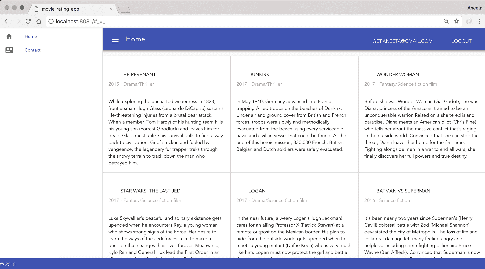

# Passport 的 Twitter 策略

下一个策略是 Passport 的 Twitter 策略。让我们从安装这个策略开始。

# 安装 Passport 的 Twitter 策略

运行以下命令来安装 Twitter 策略：

```js
$ npm install passport-twitter --save
```

前面的命令应该将包添加到你的`package.json`文件中：

```js
...
"node-sass": "⁴.7.2",
"nodemon": "¹.14.10",
"passport": "⁰.4.0",
"passport-twitter": "².1.1",
...
```

# 配置 Passport 的 Twitter 策略

就像 Facebook 策略一样，我们必须执行以下步骤来配置 Passport 的 Twitter 策略：

1.  创建和设置 Twitter 应用程序。这将为我们提供消费者密钥（API 密钥）和消费者密钥（API 密钥）。

1.  在我们的登录页面添加一个按钮，允许我们的用户通过 TWITTER 登录。

1.  添加必要的路由。

1.  添加一个中间件方法来检查身份验证。

1.  重定向用户到主页并在顶部栏显示已登录用户的电子邮件。

让我们深入了解前面每个步骤的细节。

# 创建和设置 Twitter 应用程序

就像 Facebook 策略一样，为了能够使用 Twitter 策略，我们同样需要构建一个 Twitter 应用程序。Twitter 的开发者门户位于[`apps.twitter.com/`](https://apps.twitter.com/)，在那里你可以看到所有应用程序的列表。如果这是第一次，你将看到一个创建新应用程序的按钮——点击创建你的 Twitter 应用程序。

你将看到一个表单，它将要求你填写应用程序名称和其他详细信息。你可以将应用程序命名为你想要的任何名称。对于这个应用程序，我们将将其命名为`movie_rating_app`。对于回调 URL，我们提供了`http://localhost:8081/login/twitter/return`，我们稍后需要定义它：

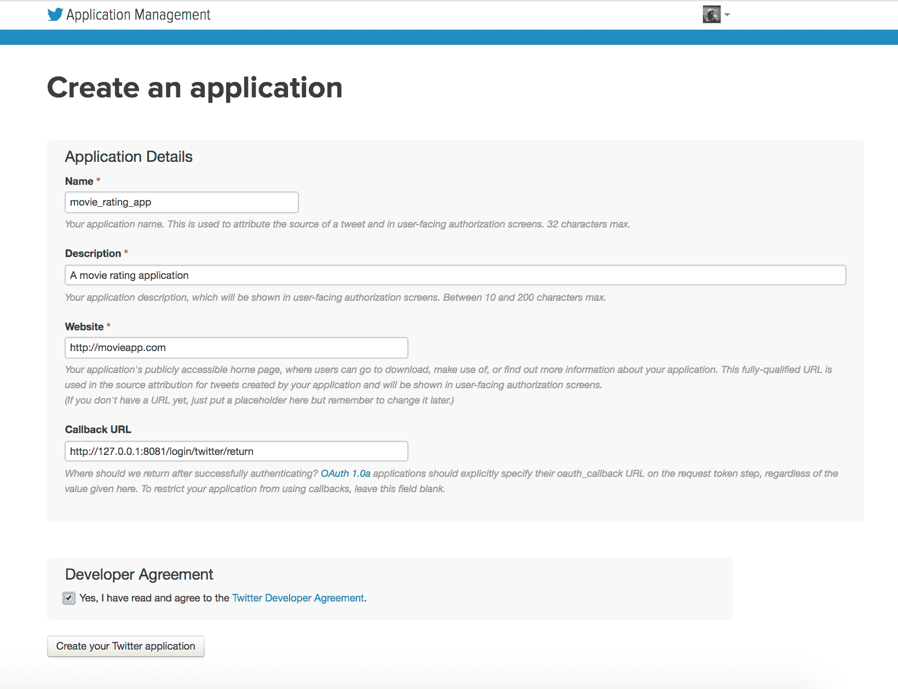

在应用程序成功创建后，你可以在“密钥和访问令牌”选项卡中看到 API 密钥（消费者密钥）和 API 密钥（消费者密钥）：

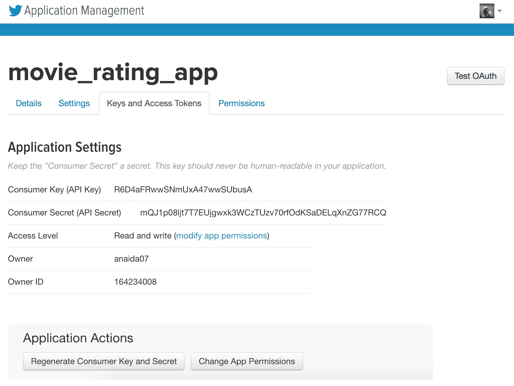

这些令牌将用于我们应用程序中的身份验证。

# 在我们的登录页面添加一个按钮，允许用户通过 Twitter 登录

下一步是在我们的登录页面添加一个“登录 Twitter”按钮，并将其链接到我们刚刚创建的 Twitter 应用程序。

在 `Login.vue` 中，添加以下链接以通过 Twitter 登录：

```js
<template>
  <div>
    <div class="login">
      <a class="btn facebook" href="/login/facebook"> LOGIN WITH FACEBOOK</a>
       <a class="btn twitter" href="/login/twitter"> LOGIN WITH TWITTER</a>
    </div>
    <v-form v-model="valid" ref="form" lazy-validation>
      <v-text-field
        label="Email"
        v-model="email"
        :rules="emailRules"
        required
      ></v-text-field>
...
```

上述代码将添加一个“登录 Twitter”按钮。让我们运行以下命令：

```js
$ npm run build
```

现在，如果我们访问 URL `http://localhost:8080/users/login`，我们应该看到以下页面：

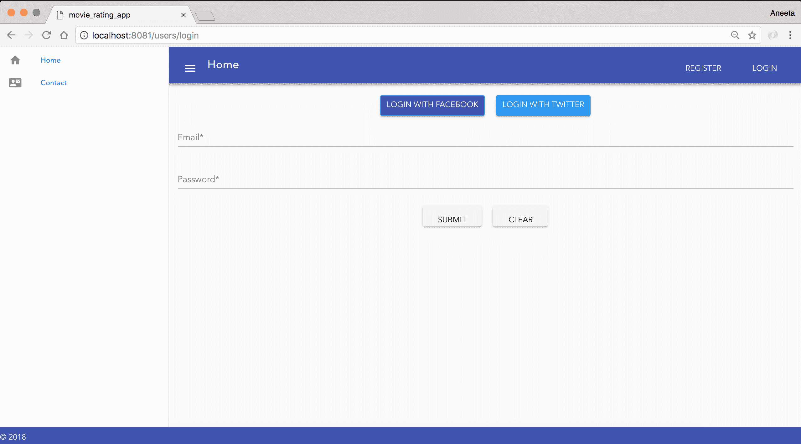

# 添加 Twitter 应用的配置

现在，下一步是添加 Twitter 登录的必要路由。为此，我们需要配置设置和回调 URL。就像我们为 Facebook 策略所做的那样，让我们创建一个单独的文件来设置我们的 Twitter 登录。让我们在 `controllers` 目录中创建一个名为 `twitter.js` 的新文件，并添加以下内容：

```js
const User = require('../models/User.js');
const passport = require('passport');
const config = require('./../config/Config');
const Strategy = require('passport-twitter').Strategy;

module.exports.controller = (app) => {
 // twitter strategy
 passport.use(new Strategy({
 consumerKey: config.TWITTER_APP_ID,
 consumerSecret: config.TWITTER_APP_SECRET,
 callbackURL: '/login/twitter/return',
 profileFields: ['id', 'displayName', 'email'],
 },
 (accessToken, refreshToken, profile, cb) => {
 // Handle twitter login
 }));
};
```

正如我们在 Facebook 策略中所做的那样，第一行导入 Twitter 策略。配置需要以下三个参数：`clientID`、`clientSecret` 和一个回调 URL。`consumerKey` 和 `consumerSecret` 分别是 Twitter 应用程序的 `App ID` 和 `App Secret`。

让我们将这些秘密添加到我们的配置文件中。在 `config/Config.js` 中，添加 `Facebook 客户端 ID` 和 `Facebook 客户端密钥`：

```js
module.exports = {
  DB: 'mongodb://localhost/movie_rating_app',
  SECRET: 'movieratingappsecretkey',
  FACEBOOK_APP_ID: <facebook_client_id>,
  FACEBOOK_APP_SECRET: <facebook_client_secret>, TWITTER_APP_ID: <twitter_consumer_id>,
  TWITTER_APP_SECRET: <twitter_consumer_secret>
}
```

回调 URL 是在与 Twitter 成功交易后，您希望将应用程序路由到的 URL。

我们在 [前面的代码片段中定义的回调是 `http://localhost:8081/login/twitter/return`，我们必须定义它。配置之后是一个函数，该函数接受以下四个参数：

+   `accessToken`

+   `refreshToken`

+   `profile`

+   `cb` (回调)

请求成功后，我们的应用程序将被重定向到主页。

# 添加 Twitter 登录的必要路由

现在，让我们添加当点击“登录”按钮和收到 Twitter 回调时所需的必要路由。在同一个文件 `twitter.js` 中，添加以下路由：

```js
const User = require('../models/User.js');
const passport = require('passport');
const config = require('./../config/Config');
const Strategy = require('passport-twitter').Strategy;

module.exports.controller = (app) => {
  // twitter strategy
  passport.use(new Strategy({
    consumerKey: config.TWITTER_APP_ID,
    consumerSecret: config.TWITTER_APP_SECRET,
    callbackURL: '/login/twitter/return',
    profileFields: ['id', 'displayName', 'email'],
  },
  (accessToken, refreshToken, profile, cb) => {
    // Handle twitter login
  }));

  app.get('/login/google',
 passport.authenticate('google', { scope: ['email'] }));

 app.get('/login/google/return',
 passport.authenticate('google', { failureRedirect: '/login' }),
 (req, res) => {
 res.redirect('/');
 });
};
```

在前面的代码中，我们添加了两个路由：`/login/google` 和 `/login/google/return`。如果您记得，在 `Login.vue` 中，我们添加了一个链接到 `http://localhost:8081/login/twitter`，它将由我们在这里定义的第一个路由提供服务。

现在，最后一件事就是实际使用策略登录用户。将 `twitter.js` 的内容替换为以下内容：

```js
const User = require('../models/User.js');
const passport = require('passport');
const config = require('./../config/Config');
const Strategy = require('passport-twitter').Strategy;

module.exports.controller = (app) => {
  // twitter strategy
  passport.use(new Strategy({
    consumerKey: config.TWITTER_APP_ID,
    consumerSecret: config.TWITTER_APP_SECRET,
    userProfileURL: 'https://api.twitter.com/1.1/account/verify_credentials.json?include_email=true',
    callbackURL: '/login/twitter/return',
  },
  (accessToken, refreshToken, profile, cb) => {
 const email = profile.emails[0].value;
 User.getUserByEmail(email, (err, user) => {
 if (!user) {
 const newUser = new User({
 fullname: profile.displayName,
 email,
 facebookId: profile.id,
 });
 User.createUser(newUser, (error) => {
 if (error) {
 // Handle error
 }
 return cb(null, user);
 });
 } else {
 return cb(null, user);
 }
 return true;
 });
 }));

  app.get('/login/twitter',
    passport.authenticate('twitter', { scope: ['email'] }));

  app.get('/login/twitter/return',
    passport.authenticate('twitter', { failureRedirect: '/login' }),
    (req, res) => {
      res.redirect('/');
    });
};
```

在这里，我们必须考虑几个事项。Twitter 默认不允许我们访问用户的电子邮件地址。为此，我们需要在设置 Twitter 应用程序时检查一个名为“从用户请求电子邮件地址”的字段，该字段位于“权限”选项卡下。

在我们这样做之前，我们还需要设置隐私政策 URL 和服务条款 URL，以便请求用户的电子邮件地址访问权限。此设置可以在“设置”选项卡下找到：

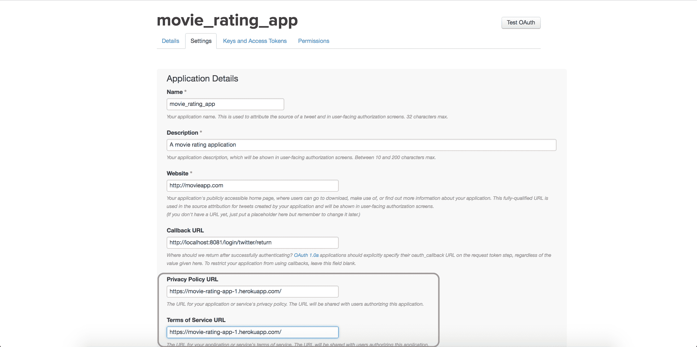

填写隐私政策和服务条款的 URL，然后在“权限”选项卡下，勾选“从用户请求电子邮件地址”的复选框，然后点击“更新设置”：

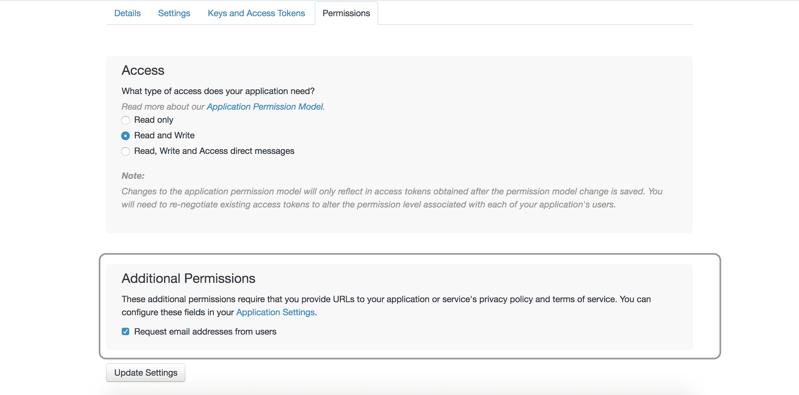

我们还需要做的是指定资源 URL，以便能够访问电子邮件地址，我们通过在`twitter.js`中添加以下内容来实现：

```js
...
passport.use(new Strategy({
    consumerKey: config.TWITTER_APP_ID,
    consumerSecret: config.TWITTER_APP_SECRET,
    userProfileURL: 
    "https://api.twitter.com/1.1/account/verify_credentials.json?   
    include_email=true",
    callbackURL: '/login/twitter/return',
  },
...
```

现在，Twitter 登录准备工作已经完成。我们应该能够通过“通过 Twitter 登录”按钮成功登录。

# 护照的 Google 策略

下一个策略是护照的 Google 策略。让我们从安装这个策略开始。

# 安装 Passport 的 Google 策略

运行以下命令安装 Passport 的 Google 策略：

```js
$ npm install passport-google-oauth20 --save
```

前面的命令应该会将包添加到您的`package.json`文件中：

```js
...
"node-sass": "⁴.7.2",
"nodemon": "¹.14.10",
"passport": "⁰.4.0",
"passport-google-oauth20": "¹.0.0",
...
```

# 配置护照的 Google 策略

所有策略的配置都有些类似。对于 Google 策略，配置时我们需要遵循以下步骤：

1.  在 Google 上创建和注册应用程序。这将为我们提供消费者密钥（API 密钥）和消费者密钥（API 密钥）。

1.  在我们的登录页面添加一个按钮，允许我们的用户通过 Google 登录。

1.  添加必要的路由。

1.  添加一个中间件方法来检查身份验证。

1.  将用户重定向到主页并显示登录用户在顶部栏中的电子邮件地址。

让我们深入了解前面每个步骤的细节。

# 创建和设置 Google 应用程序

正如我们在 Facebook 和 Twitter 策略中所做的那样，为了能够使用 Google 策略，我们必须构建一个 Google 应用程序。Google 的开发者门户位于[`console.developers.google.com/`](https://console.developers.google.com/)。

然后，点击页面左上角的“项目”下拉列表。会出现一个弹出窗口。然后，点击加号图标创建一个新的应用程序。

您只需添加您应用程序的名称。我们将应用程序命名为*movieratingapp*，因为 Google 不允许下划线或任何其他特殊字符：

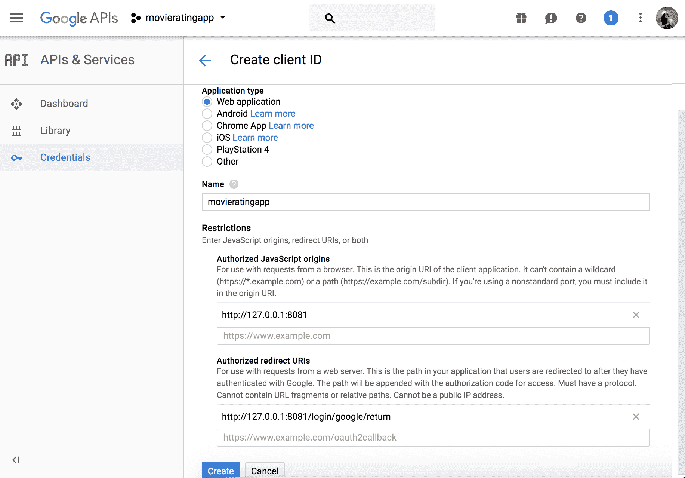

当应用程序成功创建后，点击“凭证”和“创建”，然后点击 OAuth 客户端 ID 以生成应用程序令牌。为了生成令牌，我们首先需要通过开发者控制台在[`console.developers.google.com/`](https://console.developers.google.com/)启用 Google+ API。

然后，它将带我们到“创建同意”页面，在那里我们需要填写有关我们应用程序的一些信息。之后，在“凭证”页面，我们将能够查看我们的“客户端 ID”和“客户端密钥”。

这些令牌将用于在我们的应用程序中验证身份验证：

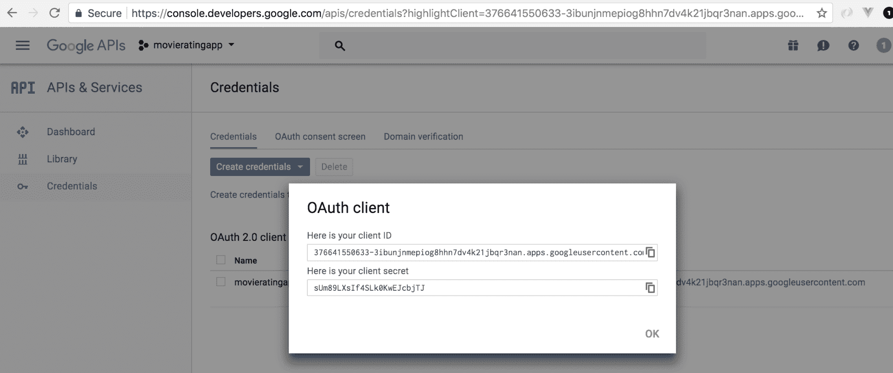

# 在我们的登录页面添加一个按钮，允许用户通过 Google 登录

下一步是在我们的登录页面中添加一个“使用谷歌登录”按钮，我们将将其链接到我们刚刚创建的谷歌应用程序：

```js
<template>
  <div>
    <div class="login">
       <a class="btn facebook" href="/login/facebook"> LOGIN WITH FACEBOOK</a>
       <a class="btn twitter" href="/login/twitter"> LOGIN WITH TWITTER</a>
       <a class="btn google" href="/login/google"> LOGIN WITH GOOGLE</a>
 </div>
    <v-form v-model="valid" ref="form" lazy-validation>
      <v-text-field
        label="Email"
        v-model="email"
        :rules="emailRules"
        required
      ></v-text-field>
      <v-text-field
        label="Password"
        v-model="password"
        :rules="passwordRules"
        required
      ></v-text-field>
      <v-btn
        @click="submit"
        :disabled="!valid"
      >
        submit
      </v-btn>
      <v-btn @click="clear">clear</v-btn><br/>
    </v-form>
  </div>
</template>
...
```

上述代码将添加一个“使用谷歌登录”按钮：

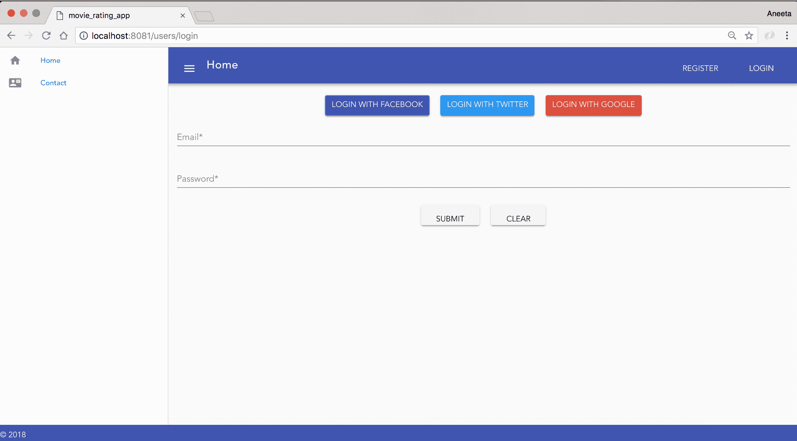

# 添加谷歌应用的配置

让我们像为 Facebook 和 Twitter 策略所做的那样配置谷歌策略。我们将创建一个单独的文件来处理谷歌登录，以便代码更简单。在`controllers`文件夹内创建一个名为`google.js`的文件，并将以下内容添加到其中：

```js
const User = require('../models/User');
const passport = require('passport');
const config = require('./../config/Config');
const Strategy = require('passport-google-oauth20').OAuth2Strategy;

module.exports.controller = (app) => {
 // google strategy
 passport.use(new Strategy({
 clientID: config.GOOGLE_APP_ID,
 clientSecret: config.GOOGLE_APP_SECRET,
 callbackURL: '/login/google/return',
 },
 (accessToken, refreshToken, profile, cb) => {
 // Handle google login
 }));
};
```

正如我们在 Facebook 和 Twitter 策略中所做的那样，第一行导入 Google 策略。配置需要以下三个参数：`clientID`、`clientSecret`和回调 URL。`clientID`和`clientSecret`是我们刚刚创建的谷歌应用的`App ID`和`App Secret`。

让我们将这些秘密添加到我们的`config`文件中。在`config/Config.js`中添加`facebook_client_id`和`facebook_client_secret`：

```js
module.exports = {
  DB: 'mongodb://localhost/movie_rating_app',
  SECRET: 'movieratingappsecretkey',
  FACEBOOK_APP_ID: <facebook_client_id>,
  FACEBOOK_APP_SECRET: <facebook_client_secret>,
  TWITTER_APP_ID: <twitter_client_id>,
  TWITTER_APP_SECRET: <twitter_client_secret>, GOOGLE_APP_ID: <google_client_id>,
  GOOGLE_APP_SECRET: <google_client_secret>
}
```

回调 URL 是您希望应用程序在成功与谷歌交易后重定向到的 URL。

我们刚刚添加的回调是`http://127.0.0.1:8081/login/google/return`，我们必须定义它。配置后面跟着一个函数，该函数接受以下四个参数：

+   `accessToken`

+   `refreshToken`

+   `profile`

+   `cb`（回调函数）

在请求成功后，我们的应用程序将被重定向到我们尚未定义的`profile`页面。

# 添加谷歌登录所需的必要路由

现在，让我们继续添加必要的路由，当点击登录按钮以及从谷歌收到回调时。在同一个文件`google.js`中，添加以下路由：

```js
const User = require('../models/User');
const passport = require('passport');
const config = require('./../config/Config');
const Strategy = require('passport-google-oauth20').OAuth2Strategy;

module.exports.controller = (app) => {
  // google strategy
  passport.use(new Strategy({
    clientID: config.GOOGLE_APP_ID,
    clientSecret: config.GOOGLE_APP_SECRET,
    callbackURL: '/login/google/return',
  },
  (accessToken, refreshToken, profile, cb) => {
    // Handle google login
  }));

  app.get('/login/google',
 passport.authenticate('google', { scope: ['email'] }));

 app.get('/login/google/return',
 passport.authenticate('google', { failureRedirect: '/login' }),
 (req, res) => {
 res.redirect('/');
 });
};
```

在前面的代码中，我们添加了两个路由。如果您还记得，在`Login.vue`中，我们添加了一个链接到`http://localhost:8081/login/google`，它将由我们在这里定义的第一个路由提供。

此外，如果您还记得，在配置设置中，我们添加了一个回调函数，它将由我们在这里定义的第二个路由提供。

现在，最后要做的就是实际使用策略登录用户。用以下内容替换`google.js`的内容：

```js
const User = require('../models/User');
const passport = require('passport');
const config = require('./../config/Config');
const GoogleStrategy = require('passport-google-oauth20').Strategy;

module.exports.controller = (app) => {
  // google strategy
  passport.use(new GoogleStrategy({
    clientID: config.GOOGLE_APP_ID,
    clientSecret: config.GOOGLE_APP_SECRET,
    callbackURL: '/login/google/return',
  },
  (accessToken, refreshToken, profile, cb) => {
 const email = profile.emails[0].value;
 User.getUserByEmail(email, (err, user) => {
 if (!user) {
 const newUser = new User({
 fullname: profile.displayName,
 email,
 facebookId: profile.id,
 });
 User.createUser(newUser, (error) => {
 if (error) {
 // Handle error
 }
 return cb(null, user);
 });
 } else {
 return cb(null, user);
 }
 return true;
 });
  }));

  app.get('/login/google',
    passport.authenticate('google', { scope: ['email'] }));

  app.get('/login/google/return',
    passport.authenticate('google', { failureRedirect: '/login' }),
    (req, res) => {
      res.redirect('/');
    });
};
```

# Passport 的 LinkedIn 策略

到现在为止，您必须非常清楚如何使用`passport.js`提供的每个策略。让我们快速复习这些策略，使用 LinkedIn 策略。这是我们将在本书中覆盖的最后一个策略。根据您的需求，您可以使用几种其他策略。您可以在[`github.com/jaredhanson/passport/wiki/Strategies`](https://github.com/jaredhanson/passport/wiki/Strategies)找到列表。

现在，让我们从安装这个策略开始。

# 安装 Passport 的 LinkedIn 策略

运行以下命令来安装 LinkedIn 策略：

```js
$ npm install passport-linkedin --save
```

上述命令应在您的`package.json`文件中添加以下包：

```js
...
"node-sass": "⁴.7.2",
"nodemon": "¹.14.10",
"passport": "⁰.4.0",
"passport-linkedin-oauth2": "².1.1",
...
```

# 配置 Passport 的 LinkedIn 策略

所有策略的配置大致相似。因此，以下是我们必须遵循的步骤来配置此策略：

1.  在 LinkedIn 上创建和注册一个应用。这将为我们提供消费者密钥（API 密钥）和消费者密钥（API 密钥）。

1.  在我们的登录页面添加一个按钮，允许用户通过 LinkedIn 登录。

1.  添加必要的路由。

1.  添加一个中间件方法来检查身份验证。

1.  将用户重定向到主页并在顶部栏显示已登录用户的电子邮件。

让我们深入了解前面每个步骤的细节。

# 创建并设置 LinkedIn 应用

就像我们对 Facebook 和 Twitter 策略所做的那样，为了能够使用 LinkedIn 策略，我们必须构建一个 LinkedIn 应用。LinkedIn 的开发者门户位于 [`www.linkedin.com/developer/apps`](https://www.linkedin.com/developer/apps)。您将在那里看到所有应用的列表。您还会注意到一个创建新应用的按钮；点击创建应用。

我们只需添加我们应用的名称。我们可以将应用命名为任何我们想要的名称，但为了我们的应用，我们将将其命名为 `movie_rating_app`：

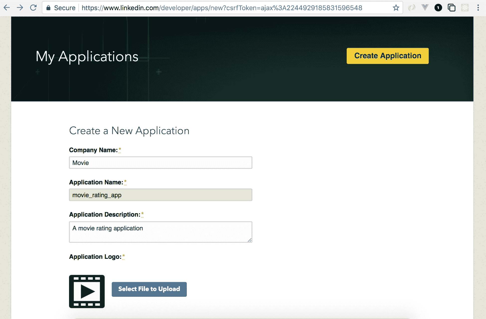

在应用程序成功创建后，您可以在凭据选项卡中看到 API 密钥（`clientID`）和 API 密钥（`client secret`）。

这些令牌将用于在我们的应用程序中验证身份验证：

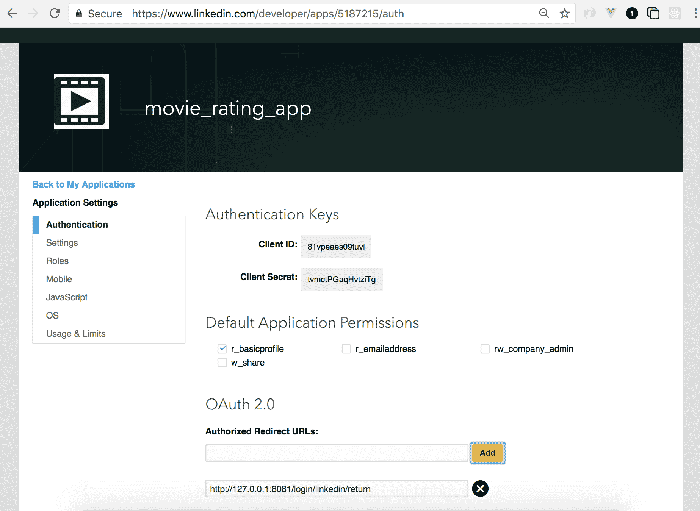

# 在我们的登录页面添加一个按钮，允许用户通过 LinkedIn 登录

下一步是在我们的登录页面添加一个 `LOGIN WITH LINKEDIN` 按钮，我们将将其链接到我们刚刚创建的 LinkedIn 应用。

在 `Login.vue` 中添加以下代码：

```js
<template>
  <div>
    <div class="login">
      <a class="btn facebook" href="/login/facebook"> LOGIN WITH FACEBOOK</a>
       <a class="btn twitter" href="/login/twitter"> LOGIN WITH TWITTER</a>
       <a class="btn google" href="/login/google"> LOGIN WITH GOOGLE</a>
       <a class="btn linkedin" href="/login/linkedin"> LOGIN WITH LINKEDIN</a>
    </div>
    <v-form v-model="valid" ref="form" lazy-validation>
      <v-text-field
        label="Email"
        v-model="email"
        :rules="emailRules"
        required
      ></v-text-field>
      <v-text-field
        label="Password"
        v-model="password"
        :rules="passwordRules"
        required
      ></v-text-field>
      <v-btn
        @click="submit"
        :disabled="!valid"
      >
        submit
      </v-btn>
      <v-btn @click="clear">clear</v-btn><br/>
    </v-form>
  </div>
</template>
<script>
  import axios from 'axios';
  import bus from "./../bus.js";

  export default {
    data: () => ({
      valid: true,
      email: '',
      password: '',
      emailRules: [
        (v) => !!v || 'E-mail is required',
        (v) => /^\w+([\.-]?\w+)*@\w+([\.-]?\w+)*(\.\w{2,3})+$/.test(v) || 'E-mail must be valid'
      ],
      passwordRules: [
        (v) => !!v || 'Password is required',
      ]
    }),
    methods: {
      async submit () {
        if (this.$refs.form.validate()) {
          return axios({
            method: 'post',
            data: {
              email: this.email,
              password: this.password
            },
            url: '/users/login',
            headers: {
              'Content-Type': 'application/json'
            }
          })
          .then((response) => {
            localStorage.setItem('jwtToken', response.data.token)
            this.$swal("Good job!", "You are ready to start!", 
            "success");
            bus.$emit("refreshUser");
            this.$router.push({ name: 'Home' });
          })
          .catch((error) => {
            const message = error.response.data.message;
            this.$swal("Oh oo!", `${message}`, "error")
          });
        }
      },
      clear () {
        this.$refs.form.reset()
      }
    }
  }
</script>
```

前面的代码将添加一个 `LOGIN WITH LINKEDIN` 按钮：

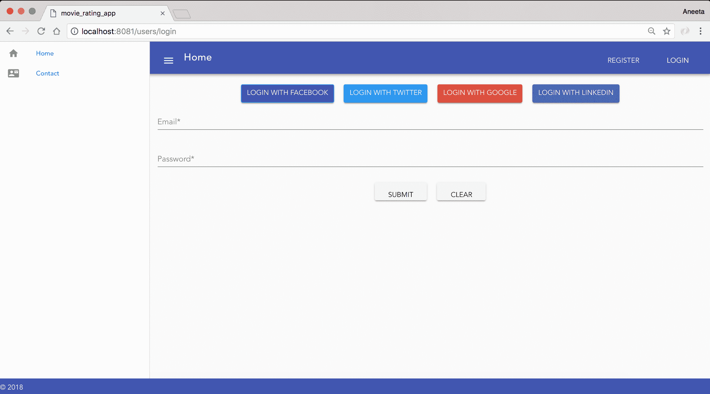

# 添加 LinkedIn 应用的配置

让我们像配置所有其他策略一样配置 LinkedIn 策略。我们将创建一个单独的文件来处理 LinkedIn 登录，以便代码更简单。让我们在 `controllers` 文件夹内创建一个名为 `linkedin.js` 的文件，并将以下内容添加到其中：

```js
const User = require('../models/User.js');
const passport = require('passport');
const config = require('./../config/Config');
const Strategy = require('passport-linkedin').Strategy;

module.exports.controller = (app) => {
 // linkedin strategy
 passport.use(new Strategy({
 consumerKey: config.LINKEDIN_APP_ID,
 consumerSecret: config.LINKEDIN_APP_SECRET,
 callbackURL: '/login/linkedin/return',
 profileFields: ['id', 'first-name', 'last-name', 'email-address']
 },
 (accessToken, refreshToken, profile, cb) => {
 // Handle linkedin login
 }));
};
```

在前面的代码中，第一行导入了 LinkedIn 策略。配置需要以下三个参数：`clientID`、`clientSecret` 和回调 URL。`clientID` 和 `clientSecret` 分别是我们刚刚创建的 LinkedIn 应用的 `App ID` 和 `App Secret`。

让我们在 `config` 文件中添加这些密钥。在 `config/Config.js` 中添加 `Facebook Client ID` 和 `Facebook Client Secret`：

```js
module.exports = {
  DB: 'mongodb://localhost/movie_rating_app',
  SECRET: 'movieratingappsecretkey',
  FACEBOOK_APP_ID: <facebook_client_id>,
  FACEBOOK_APP_SECRET: <facebook_client_secret>,
  TWITTER_APP_ID: <twitter_consumer_id>,
  TWITTER_APP_SECRET: <twitter_consumer_secret>,
  GOOGLE_APP_ID: <google_consumer_id>,
  GOOGLE_APP_SECRET: <google_consumer_secret>,
  LINKEDIN_APP_ID: <linkedin_consumer_id>,
 LINKEDIN_APP_SECRET: <linkedin_consumer_secret>
}
```

`callbackURL` 是在成功与 LinkedIn 交易后，您希望将应用程序路由到的 URL。

在前面的代码中定义的 `callbackURL` 是 `http://127.0.0.1:8081/login/linkedin/return`，我们必须定义它。配置后面跟着一个函数，该函数接受以下四个参数：

+   `accessToken`

+   `refreshToken`

+   `profile`

+   `cb` (回调)

在请求成功后，我们的应用程序将被重定向到我们尚未定义的个人资料页面。

# 添加 LinkedIn 登录所需的路由

现在，让我们添加当点击登录按钮和从 LinkedIn 收到回调时所需的必要路由：

```js
const User = require('../models/User.js');
const passport = require('passport');
const config = require('./../config/Config');
const Strategy = require('passport-linkedin').Strategy;

module.exports.controller = (app) => {
  // linkedin strategy
  passport.use(new Strategy({
    consumerKey: config.LINKEDIN_APP_ID,
    consumerSecret: config.LINKEDIN_APP_SECRET,
    callbackURL: '/login/linkedin/return',
    profileFields: ['id', 'first-name', 'last-name', 'email-address']
  },
  (accessToken, refreshToken, profile, cb) => {
    // Handle linkedin login
  }));

  app.get('/login/linkedin',
 passport.authenticate('linkedin'));

 app.get('/login/linkedin/return',
 passport.authenticate('linkedin', { failureRedirect: '/login' }),
 (req, res) => {
 res.redirect('/');
 });
};
```

在前面的代码中，我们添加了两个路由。如果你记得，在 `Login.vue` 中，我们添加了一个链接到 `http://localhost:8081/login/linkedin`，这个链接将由我们在这里定义的第一个路由提供。

此外，如果你还记得，在配置设置中，我们添加了一个回调函数，它将由我们在这里定义的第二个路由提供。

现在，最后一件事就是实际使用策略登录用户。将 `linkedin.js` 的内容替换为以下内容：

```js
const User = require('../models/User');
const passport = require('passport');
const config = require('./../config/Config');
const Strategy = require('passport-linkedin').Strategy;

module.exports.controller = (app) => {
  // linkedin strategy
  passport.use(new Strategy({
    consumerKey: config.LINKEDIN_APP_ID,
    consumerSecret: config.LINKEDIN_APP_SECRET,
    callbackURL: '/login/linkedin/return',
    profileFields: ['id', 'first-name', 'last-name', 'email-address'],
  },
  (accessToken, refreshToken, profile, cb) => {
 const email = profile.emails[0].value;
 User.getUserByEmail(email, (err, user) => {
 if (!user) {
 const newUser = new User({
 fullname: profile.displayName,
 email: profile.emails[0].value,
 facebookId: profile.id,
 });
 User.createUser(newUser, (error) => {
 if (error) {
 // Handle error
 }
 return cb(null, user);
 });
 } else {
 return cb(null, user);
 }
 return true;
 });
  }));

  app.get('/login/linkedin',
    passport.authenticate('linkedin'));

  app.get('/login/linkedin/return',
    passport.authenticate('linkedin', { failureRedirect: '/login' }),
    (req, res) => {
      res.redirect('/');
    });
};
```

使用这个，LinkedIn 登录的一切准备工作都已经就绪。现在我们应该能够通过点击“使用 LinkedIn 登录”按钮成功登录。

# 摘要

在本章中，我们介绍了 OAuth 是什么以及如何将不同类型的 OAuth 集成到我们的应用程序中。我们还介绍了由 `passport.js` 提供的 Facebook、Twitter、Google 和 LinkedIn 策略。如果你想探索不同的策略，可以在[`github.com/jaredhanson/passport/wiki/Strategies`](https://github.com/jaredhanson/passport/wiki/Strategies)找到一份可用的包列表。

在下一章中，我们将了解更多关于 `Vuex` 是什么以及我们如何使用 `Vuex` 来简化我们的应用程序。
