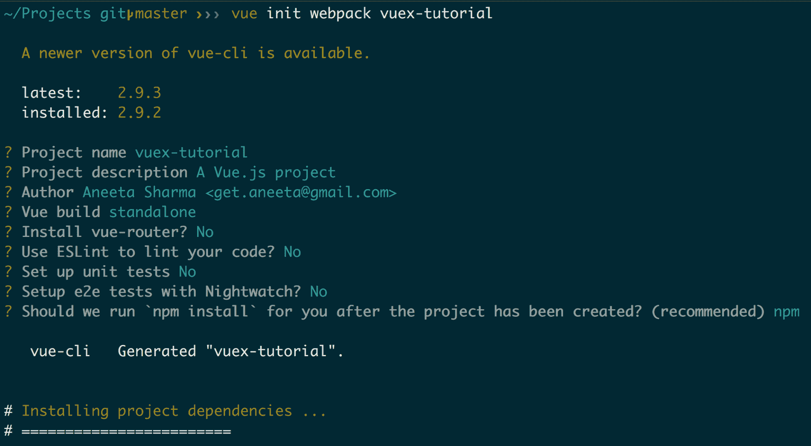

# 第八章：Vuex 简介

Vuex 是一个库，我们可以与 Vue.js 一起使用来管理应用中的不同状态。如果你正在构建一个不需要组件之间大量数据交换的小型应用，你最好不使用这个库。然而，随着你的应用增长，复杂性也随之增加。应用中将有多个组件，最明显的是，你需要从一个组件交换数据到另一个组件，或者跨多个组件共享相同的数据。这就是 Vuex 出现的时候。

Vue.js 还提供了一个 `emit` 方法，用于在不同组件之间传递数据，我们在前面的章节中已经使用过。随着你的应用增长，当数据更新时，你可能还希望更新多个组件中的数据。

因此，Vuex 提供了一个集中位置来存储我们应用中的所有数据片段。每当数据发生变化时，这个新的数据集将存储在这个集中位置。此外，所有想要使用这些数据的组件都将从存储中获取。这意味着我们有一个单一的数据存储源，我们构建的所有组件都将能够访问这些数据。

让我们先熟悉一些 Vuex 伴随的术语：

+   **状态（State）**：这是一个包含数据的对象。Vuex 使用一个单一的状态树，这意味着它是一个包含应用所有数据片段的单个对象。

+   **获取器（Getters）**：它用于从状态树中获取数据。

+   **突变（mutations）**：它们是改变状态树中数据的方法。

+   **动作（Actions）**：它们是执行突变（mutations）的函数。

我们将在本章中讨论这些内容。

# 传统多网页应用

在传统的多网页应用中，当我们构建一个网页应用并通过导航到浏览器打开网站时，它会请求网页服务器获取该页面并将其提供给浏览器。当我们点击同一网站上的按钮时，它再次请求网页服务器获取另一个页面并再次提供。这个过程在我们对网站进行的每一次交互中都会发生。所以，基本上，网站在每次交互时都会重新加载，这消耗了大量的时间。

以下是一个解释多页面应用工作原理的示例图：


当浏览器发送请求时，请求被发送到服务器。然后服务器返回 HTML 内容，并加载一个全新的页面。

**多页面应用（MPA**）同样可以提供一些好处。选择 MPA 还是 **单页面应用（SPA**）并不是问题，关键在于你应用的内容。如果你的应用包含大量的用户交互，你应该选择 SPA；然而，如果你的应用唯一目的是向用户提供内容，你可以选择 MPA。我们将在本章后面进一步探讨 SPAs 和 MPAs。

# 单页面应用（SPA）简介

与传统的 MPAs 不同，SPA 是专门为基于 Web 的应用程序设计的。SPA 在浏览器中首次加载网站时获取所有数据。一旦所有数据都获取完毕，你就不需要再获取更多数据。当进行任何其他交互时，这些数据将通过互联网获取，无需向服务器发送请求，也不需要重新加载页面。这意味着 SPA 比传统的 MPAs 要快得多。然而，由于 SPA 在首次加载时一次性获取所有数据，因此首次页面加载时间可能会较慢。一些集成了 SPA 的应用程序包括 Gmail、Facebook、GitHub、Trello 等等。SPA 的核心理念是通过将内容放在一个单独的页面上，并避免让用户等待他们想要的信息，从而提升用户体验。

下图是一个关于 SPA 工作原理的示例图：


网站在首次页面加载时就包含了所有需要的内容。当用户点击某个内容时，它只会获取该特定区域的信息，并只刷新网页的该部分。

# SPA 与 MPA 的比较

SPA 和 MPA 服务于不同的目的。你可能需要根据你的需求选择使用其中之一。在你开始你的应用之前，确保你清楚你想要构建的应用类型。

# 使用 MPAs 的优点

如果你想让你的应用对搜索引擎优化（SEO）友好，多页面应用（MPAs）是最佳选择。谷歌可以通过搜索你在每个页面分配的关键词来爬取你应用的不同页面，而在单页面应用（SPA）中这是不可能的，因为 SPA 只有一个页面。

# 使用 MPA 的缺点

使用 MPAs 有一些缺点：

+   MPA 的开发工作比 SPA 要多得多，因为前端和后端是紧密耦合的。

+   MPAs 的前端和后端紧密耦合，这使得前端和后端开发者之间的工作分离变得更加困难。

# 使用 SPA 的优点

SPA 提供了许多好处：

+   **减少服务器响应时间**：SPA 在网站首次加载时获取所有所需数据。使用此类应用，服务器无需重新加载网站上的资源。如果需要获取新数据，它只会从服务器获取更新的信息片段，与多页面应用不同，这显著减少了服务器响应时间。

+   **更好的用户交互**：服务器响应时间的减少最终改善了用户体验。每次交互，用户都会得到一个渲染速度更快的页面，这意味着*满意的客户*。

+   **改变 UI 的灵活性**：SPA 没有耦合的前端和后端。这意味着我们可以更改前端并完全重写它，而无需担心服务器端会出问题。

+   **数据缓存**：SPA 在本地存储中缓存数据。它只在第一次请求时发送一次请求并保存数据。这使得即使在断网的情况下，应用仍然可用。

# 使用 SPA 的缺点

使用 SPA 也有一些缺点：

+   SPA 对搜索引擎优化（SEO）不友好。由于所有操作都在单个页面上完成，可爬性非常低。

+   由于只有一个链接到该页面的链接，因此您无法与他人共享特定的信息。

+   与 MPA 相比，单页应用（SPA）的安全问题更为严重。

# Vuex 简介

Vuex 是一个专为与 Vue.js 构建的应用程序一起使用的状态管理库。它是 Vuex 的集中式状态管理。

# Vuex 的核心概念

我们在简介中简要了解了这些核心概念。现在，让我们更详细地探讨每个概念：


前面的图示是一个简单的图解，说明了 Vuex 是如何工作的。最初，所有内容都存储在状态中，这是唯一的真相来源。每个视图组件都会从这个状态中获取数据。每当需要更改时，动作会在数据上执行变动并将其存储回状态：


当我们在浏览器中打开我们的应用程序时，所有 Vue 组件都将被加载。当我们点击按钮从组件获取某些信息时，该组件将触发一个执行数据变动的动作。当变动成功完成后，状态对象被更新，并使用新值。然后，我们可以使用新状态来为我们的组件提供数据，并在浏览器中显示。

# 创建一个简单的 Vuex 应用程序

我们将从头开始创建一个新的应用程序来学习 Vuex 的基础知识。让我们开始吧。

让我们首先创建一个新的应用程序：

```js
$ vue init webpack vuex-tutorial
```

前面的代码片段将询问您有关应用程序设置的一些问题。您可以选择您想要保留的内容。我将选择以下配置：



安装完成后，导航到项目目录：

```js
$ cd vuex-tutorial
```

下一步是运行以下命令：

```js
$ npm install
```

之后，运行以下命令：

```js
$ npm run dev
```

前面的命令将在`localhost:8080`上启动服务器并打开一个端口。

# 安装 Vuex

下一步是安装`vuex`。为此，请运行以下命令：

```js
$ npm install --save vuex
```

# 设置 Vuex

现在，让我们创建一个`store`文件夹来管理我们应用程序中的`vuex`。

# 创建存储文件

在`src`目录中创建一个`store`文件夹和一个`store.js`文件。然后，将以下内容添加到`store.js`文件中：

```js
import Vue from 'vue'
import Vuex from 'vuex'

Vue.use(Vuex)
```

在前面的代码块中，`Vue.use(Vuex)`这一行导入了 Vuex 库。没有这个，我们将无法使用任何`vuex`功能。现在，让我们构建一个存储对象。

# 状态

在相同的`store.js`文件中，添加以下代码行：

```js
import Vue from 'vue'
import Vuex from 'vuex'

Vue.use(Vuex)

const state = {
 count: 0
}

export const store = new Vuex.Store({
 state
})
```

在前面的代码中，我们将名为`count`的变量的默认状态设置为`0`，并通过 store 导出了一个 Vuex 状态。

现在，我们需要修改`src/main.js`：

```js
// The Vue build version to load with the `import` command
// (runtime-only or standalone) has been set in webpack.base.conf with an alias.
import Vue from 'vue'
import App from './App'
import { store } from './store/store'

Vue.config.productionTip = false

/* eslint-disable no-new */
new Vue({
  el: '#app',
  store,
  components: { App },
  template: '<App/>'
})
```

前面的代码导入了我们刚刚创建的存储文件，我们可以在我们的 Vue 组件中访问这个变量。

让我们继续创建一个将获取此存储数据的组件。当我们使用 Vue 创建一个新应用时，会创建一个默认组件。如果我们查看`src/components`目录，我们会找到一个名为`HelloWorld.vue`的文件。让我们使用相同的组件`HelloWorld.vue`，或者你可以创建一个新的。让我们修改这个文件以访问我们在状态中定义的`count`。

在`src/components/HelloWorld.vue`中添加以下代码：

```js
<template>
  <div class="hello">
 <h1>{{ $store.state.count }}</h1>
 </div>
</template>

<script>
export default {
  name: 'HelloWorld',
  data () {
    return {
      msg: 'Welcome to Your Vue.js App'
    }
  }
}
</script>

<!-- Add "scoped" attribute to limit CSS to this component only -->
<style scoped>
</style>
```

以下是最终的文件夹结构：


前面的截图应该在`HelloWorld.vue`组件中打印出计数的默认值。如果你导航到`http://localhost:8080/#/`，你应该看到以下截图：


在前面的截图中，我们直接使用`$`运算符访问了存储中的计数变量，这不是首选的方法。我们已经学习了使用状态的基本知识。现在，通过使用`getters`来访问变量是正确的方式。

# Getters

`getter`是一个用于从存储中访问对象的函数。让我们创建一个`getter`方法来获取我们在存储中拥有的计数。

在`store.js`中添加以下代码：

```js
import Vue from 'vue'
import Vuex from 'vuex'

Vue.use(Vuex)

const state = {
  count: 0
}

const getters = {
 fetchCount: state => state.count
}

export const store = new Vuex.Store({
  state,
  getters
})
```

在前面的代码中，我们添加了一个名为`fetchCount`的方法，它返回`count`的当前值。现在，为了在我们的 vue 组件`HelloWorld.vue`中访问这个值，我们需要更新以下代码：

```js
<template>
  <div class="hello">
 <h1>The count is: {{ fetchCount }}</h1>
  </div>
</template>

<script>
import { mapGetters } from 'vuex'
export default {
  name: 'HelloWorld',
  computed: mapGetters([
 'fetchCount'
 ])
}
</script>

<!-- Add "scoped" attribute to limit CSS to this component only -->
<style scoped>
</style>
```

我们必须从 Vuex 导入一个名为`mapGetters`的模块，它用于导入我们在`store.js`中创建的作为`getter`方法的`fetchCount`函数。现在，通过重新加载浏览器检查数字；这也应该打印出计数为`0`：


# mutations

让我们继续讨论`mutations`。`mutations`是执行对存储状态修改的方法。我们将像定义`getters`一样定义`mutations`。

在`store.js`中添加以下代码：

```js
import Vue from 'vue'
import Vuex from 'vuex'

Vue.use(Vuex)

const state = {
  count: 0
}

const getters = {
  fetchCount: state => state.count
}

const mutations = {
 increment: state => state.count++,
 decrement: state => state.count--
}

export const store = new Vuex.Store({
  state,
  getters,
  mutations
})
```

在前面的代码中，我们添加了两个不同的`mutation`函数。`increment`方法将计数增加 1，而`decrement`方法将计数减少 1。这就是我们引入行为的地方。

# 行为

行为是调度变异函数的方法。行为执行`mutations`。由于`actions`是异步的，而`mutations`是同步的，因此始终使用`actions`来变异状态是一个好的实践。现在，就像`getters`和`mutations`一样，让我们也定义`actions`。在同一个文件中，即`store.js`，添加以下代码行：

```js
import Vue from 'vue'
import Vuex from 'vuex'

Vue.use(Vuex)

const state = {
  count: 0
}

const getters = {
  fetchCount: state => state.count
}

const mutations = {
  increment: state => state.count++,
  decrement: state => state.count--
}

const actions = {
 increment: ({ commit }) => commit('increment'),
 decrement: ({ commit }) => commit('decrement')
}

export const store = new Vuex.Store({
  state,
  getters,
  mutations,
  actions
})
```

在前面的代码中，我们添加了两个不同的函数用于增加和减少。由于这些方法提交`mutations`，我们需要传递一个参数来使`commit`方法可用。

现在我们需要使用之前定义的`actions`，并在我们的 vue 组件`HelloWorld.vue`中使它们可用：

```js
<template>
  <div class="hello">
    <h1>The count is: {{ fetchCount }}</h1>
  </div>
</template>

<script>
import { mapGetters, mapActions } from 'vuex'
export default {
  name: 'HelloWorld',
  computed: mapGetters([
    'fetchCount'
  ]),
  methods: mapActions([
 'increment',
 'decrement'
 ])
}
</script>

<!-- Add "scoped" attribute to limit CSS to this component only -->
<style scoped>
</style>
```

要调用这些操作，让我们创建两个按钮。在 `HelloWorld.vue` 中，让我们添加以下代码行：

```js
<template>
  <div class="hello">
    <h1>The count is: {{ fetchCount }}</h1>
    <button class="btn btn-primary" @click="increment">Increase</button>
 <button class="btn btn-primary" @click="decrement">Decrease</button>
  </div>
</template>
...
```

以下代码行添加了两个按钮，点击这些按钮会调用一个方法来增加或减少计数。让我们也导入 Bootstrap 用于 CSS。在 `index.html` 中，添加以下代码：

```js
<!DOCTYPE html>
<html>
  <head>
    <meta charset="utf-8">
    <meta name="viewport" content="width=device-width,initial-scale=1.0">
    <!-- Latest compiled and minified CSS -->
    <link rel="stylesheet" href="https://maxcdn.bootstrapcdn.com/bootstrap/3.3.7/css/bootstrap.min.css" integrity="sha384-BVYiiSIFeK1dGmJRAkycuHAHRg32OmUcww7on3RYdg4Va+PmSTsz/K68vbdEjh4u" crossorigin="anonymous">
    <title>vuex-tutorial</title>
  </head>
  <body>
    <div id="app"></div>
    <!-- built files will be auto injected -->
  </body>
</html>
```

就这样。现在，如果你重新加载浏览器，你应该能看到以下结果：


当你点击相关按钮时，计数应该会增加或减少。这让你对如何在应用程序中实现 Vuex 有一个基本的了解。

# 在电影应用程序中安装和使用 Vuex

我们介绍了 Vuex 的基础知识——它在应用程序中的工作原理和核心概念。我们介绍了如何创建存储和突变，以及如何使用操作来分发它们，还讨论了如何使用获取器从存储中获取信息。

在前几章中，我们为电影列表页面构建了一个应用程序。我们将使用同一个应用程序来演示 Vuex。我们将执行以下操作：

+   我们将定义一个存储，其中将存储所有电影

+   当添加新电影时，我们将自动将其显示在电影列表页面上，而无需重新加载页面

让我们打开应用程序并运行前端和后端服务器：

```js
$ cd movie_rating_app
$ npm run build
$ nodemon server.js
```

此外，使用以下命令运行 `mongo` 服务器：

```js
$ mongod
```

电影列表页面应该看起来像这样：


让我们从安装 `vuex` 开始：

```js
$ npm install --save vuex
```

检查你的 `package.json` 文件；`vuex` 应该列在依赖项中：

```js
...
"vue-router": "³.0.1",
    "vue-swal": "0.0.6",
    "vue-template-compiler": "².5.14",
    "vuetify": "⁰.17.6",
    "vuex": "³.0.1"
  },
...
```

现在，让我们创建一个文件，我们将能够将我们定义的所有 `getters`、`mutations` 和 `actions` 放进去。

# 定义一个存储

让我们在 `src` 目录中创建一个名为 `store` 的文件夹，并在 `store` 目录中创建一个名为 `store.js` 的新文件，并将以下代码行添加到其中：

```js
import Vue from 'vue';
import Vuex from 'vuex';
import axios from 'axios';

Vue.use(Vuex);

export const store = new Vuex.Store({
})
```

就像我们在前面的示例应用程序中所做的那样，让我们添加一个 `state` 变量来存储电影列表页面的当前状态。

在 `store.js` 中添加以下代码行：

```js
import Vue from 'vue';
import Vuex from 'vuex';
import axios from 'axios';

Vue.use(Vuex);

export const store = new Vuex.Store({
  state: {
 movies: []
 },
})
```

这意味着应用程序的初始状态将有一个空的电影列表。

现在，我们需要将此 `store` 导入到 `main.js` 中，以便在整个组件中都可以访问。在 `src/main.js` 中添加以下代码行：

```js
// The Vue build version to load with the `import` command
// (runtime-only or standalone) has been set in webpack.base.conf with an alias.
import 'bootstrap/dist/css/bootstrap.min.css';
import 'bootstrap-vue/dist/bootstrap-vue.css';

import BootstrapVue from 'bootstrap-vue';
import Vue from 'vue';
import Vuetify from 'vuetify';
import VueSwal from 'vue-swal';
import App from './App';
import router from './router';
import { store } from './store/store';

Vue.use(BootstrapVue);
Vue.use(Vuetify);
Vue.use(VueSwal);

Vue.config.productionTip = false;

/* eslint-disable no-new */
new Vue({
  el: '#app',
  store,
  router,
  components: { App },
  template: '<App/>',
});
```

现在，当我们在浏览器中打开位置 `http://localhost:8081/` 时，我们需要获取电影。以下是我们要做的事情：

1.  修改 `Home.vue` 组件以调用获取电影的行动

1.  创建一个操作来获取所有电影

1.  创建一个突变来存储从状态中获取的电影

1.  创建一个获取器方法，从状态中获取电影以在主页上显示

# 修改 Home.vue

让我们从修改我们的 `Home.vue` 组件开始这一部分。更新文件的 `script` 部分，添加以下代码行：

```js
<script>
export default {
  name: 'Movies',
  computed: {
 movies() {
 return this.$store.getters.fetchMovies;
 }
 },
 mounted() {
 this.$store.dispatch("fetchMovies");
 },
};
</script>
```

在前面的代码中，在 `mounted()` 方法中，我们已派发了一个名为 `fetchMovies` 的操作，我们将在我们的操作中定义它。

当电影成功获取时，我们将使用 `computed` 方法，它将被映射到 `movies` 变量，我们将在模板中使用它：

```js
<template>
  <v-layout row wrap>
 <v-flex xs4 v-for="movie in movies" :key="movie._id">
      <v-card>
        <v-card-title primary-title>
        ...
```

# 创建一个操作

让我们继续添加 `store.js` 文件中的操作：

```js
import Vue from 'vue';
import Vuex from 'vuex';
import axios from 'axios';

Vue.use(Vuex);

export const store = new Vuex.Store({
  state: {
    movies: []
  },
  actions: {
 fetchMovies: (context, payload) => {
 axios({
 method: 'get',
 url: '/movies',
 })
 .then((response) => {
 context.commit("MOVIES", response.data.movies);
 })
 .catch(() => {
 });
 }
 }
})
```

在前面的代码中，我们将 `axios` 部分从组件中移除。当我们得到成功的响应时，我们将提交一个名为 `MOVIES` 的突变，然后突变状态中的 `movies` 的值。

# 创建一个突变

让我们继续添加一个突变。在 `store.js` 中，将内容替换为以下代码：

```js
import Vue from 'vue';
import Vuex from 'vuex';
import axios from 'axios';

Vue.use(Vuex);

export const store = new Vuex.Store({
  state: {
    movies: []
  },
  mutations: {
 MOVIES: (state, payload) => {
 state.movies = payload;
 }
 },
  actions: {
    fetchMovies: (context, payload) => {
      axios({
        method: 'get',
        url: '/movies',
      })
        .then((response) => {
          context.commit("MOVIES", response.data.movies);
        })
        .catch(() => {
        });
    }
  }
})
```

前面的 `mutations` 突变应用程序中电影的州。

现在我们有了 `action` 和 `mutation`。现在，最后一部分是添加一个 `getter` 方法，它从状态中获取 `movies` 的值。

# 创建一个 getter

让我们在 `store.js` 中添加我们创建的用于管理应用程序状态的 `getter` 方法：

```js
import Vue from 'vue';
import Vuex from 'vuex';
import axios from 'axios';

Vue.use(Vuex);

export const store = new Vuex.Store({
  state: {
    movies: []
  },
  getters: {
 fetchMovies: state => state.movies,
 },
  mutations: {
    MOVIES: (state, payload) => {
      state.movies = payload;
    }
  },
  actions: {
    fetchMovies: (context, payload) => {
      axios({
        method: 'get',
        url: '/movies',
      })
        .then((response) => {
          context.commit("MOVIES", response.data.movies);
        })
        .catch(() => {
        });
    }
  }
})
```

就这样。当我们导航到 `http://localhost:8081/movies/add` 时，我们应该有一个功能齐全的 Vuex 实现，它将电影数据获取到主页上。

让我们继续实现当我们在应用程序中添加电影时的存储。我们将遵循之前相同的流程：

1.  修改 `AddMovie.vue` 以调用创建电影的动作

1.  创建一个调用 POST API 创建电影的 `action`

1.  创建一个 `mutation` 将添加的新电影存储到 `movies` 存储

将 `AddMovie.vue` 中的 `script` 内容替换为以下代码：

```js
<script>
export default {
  data: () => ({
    movie: null,
    valid: true,
    name: '',
    description: '',
    genre: '',
    release_year: '',
    nameRules: [
      v => !!v || 'Movie name is required',
    ],
    genreRules: [
      v => !!v || 'Movie genre year is required',
      v => (v && v.length <= 80) || 'Genre must be less than equal to 
      80 characters.',
    ],
    releaseRules: [
      v => !!v || 'Movie release year is required',
    ],
    select: null,
    years: [
      '2018',
      '2017',
      '2016',
      '2015',
    ],
  }),
  methods: {
    submit() {
 if (this.$refs.form.validate()) {
 const movie = {
 name: this.name,
 description: this.description,
 release_year: this.release_year,
 genre: this.genre,
 }
 this.$store.dispatch("addMovie", movie);
 this.$refs.form.reset();
 this.$router.push({ name: 'Home' });
 }
 return true;
 },
    clear() {
      this.$refs.form.reset();
    },
  },
};
</script>
```

然后，将 `action` 和 `mutations` 添加到 `store.js` 文件中：

```js
import Vue from 'vue';
import Vuex from 'vuex';
import axios from 'axios';

Vue.use(Vuex);

export const store = new Vuex.Store({
  state: {
    movies: []
  },
  getters: {
    fetchMovies: state => state.movies,
  },
  mutations: {
    ADD_MOVIE: (state, payload) => {
 state.movies.unshift(payload);
 },
    MOVIES: (state, payload) => {
      state.movies = payload;
    }
  },
  actions: {
    addMovie: (context, payload) => {
 return axios({
 method: 'post',
 data: payload,
 url: '/movies',
 headers: {
 'Content-Type': 'application/json',
 },
 })
 .then((response) => {
 context.commit("ADD_MOVIE", response.data)
 this.$swal(
 'Great!',
 'Movie added successfully!',
 'success',
 );
 })
 .catch(() => {
 this.$swal(
 'Oh oo!',
 'Could not add the movie!',
 'error',
 );
 });
 },
    fetchMovies: (context, payload) => {
      axios({
        method: 'get',
        url: '/movies',
      })
        .then((response) => {
          context.commit("MOVIES", response.data.movies);
        })
        .catch(() => {
        });
    }
  }
})
```

最后，运行以下命令来构建我们的 Vue 组件的静态文件：

```js
$ npm run build
```

现在，当我们以管理员用户登录并添加电影时，电影应该被添加到数据库中，并且也会列在主页上。

在这样一个小型应用中使用 Vuex 是过度的。Vuex 最好的用途是在需要在不同组件间传输和共享数据的规模较大的应用中。这让你对 Vuex 的工作原理以及如何在应用中实现它有一个了解。

# 摘要

在本章中，我们讨论了 Vuex 是什么——Vuex 的核心概念，包括状态、getters、mutations、actions 以及如何在应用中使用它们。我们讨论了如何构建我们的应用程序以实现 Vuex，以及当应用程序规模扩大时它带来的好处。

在下一章中，我们将介绍如何为 Vue.js 和 Node.js 应用程序编写单元测试和集成测试。
