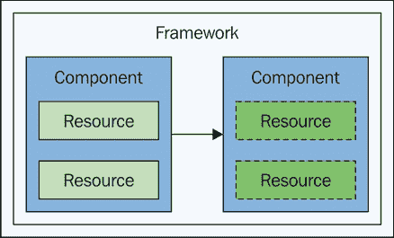
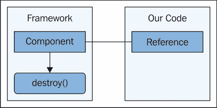

# 第八章：信息生命周期

任何信息系统都有其生命周期。这些系统中的单个组件也有它们自己的生命周期。累积起来，这些可能很容易处理，也可能非常困难。在前端 JavaScript 架构中，趋势是后者。原因很简单，我们的组件经历的生命周期，从根本上改变了信息随时间流动的方式，这是几乎无法预测的。

本章讨论的是 Flux 架构中的信息生命周期。Flux 与其他架构的不同之处在于，它强调信息的扩展而不是 JavaScript 组件。我们将从审视多年来的困难开始，这些困难是使用现代 JavaScript 框架中典型的组件生命周期所面临的。然后，我们将这种做法与 Flux 的方法进行对比，在 Flux 中，高级组件相对静态。

接下来，我们将探讨信息扩展的概念以及它是如何导致更合理的架构的，这些架构比其他方法更容易维护。我们将以讨论不活跃的存储结束本章——这些存储不活跃地服务于带有数据的视图。让我们开始吧。

# 组件生命周期困难

前端架构扩展的一个方面是清理未使用的资源。这为新创建的资源释放内存，这些资源是在用户与应用程序交互时创建的。JavaScript 是垃圾回收的，这意味着一旦一个对象没有任何引用指向它，它就符合在下一次回收器运行时被收集的条件。这让我们前进了一半；也就是说，没有必要手动分配/释放内存。然而，我们还有另一类扩展问题，它们都与组件的生命周期有关。

在本节中，我们将讨论我们想要回收未使用资源的场景以及这通常在前端架构中是如何发生的。然后，我们将从生命周期管理的角度审视组件依赖带来的挑战。最后，我们将探讨内存泄漏场景。即使有最好的工具，我们的代码也可能做了某些事情来规避内存管理。

## 回收未使用资源

在应用程序的整个过程中，经常发生的事情是，在旧资源被销毁的同时，新资源被创建。这是对用户交互的反应——当他们遍历应用程序的功能时，会创建新的组件来展示新的信息。JavaScript 对象和 DOM 元素的这种创建和销毁的大部分对我们来说是透明的——我们使用的工具可以为我们处理这些。以下图表捕捉了组件在改变状态时释放内部资源的概念：



关键在于我们组件的生命周期。根据负责管理此生命周期的框架，不同时间可能会发生不同的事情。例如，当父组件创建时，你的组件被实例化并存储。当你的组件被渲染时，它会插入新的 DOM 元素并保持对它们的引用。最后，当组件的父组件被销毁时，我们的组件被指示移除其 DOM 元素并释放对它们的任何引用。这是一个过于简化的工作流程，但无论有多少移动部件，基本思想都是相同的。我们使用的工具的职责是以一种回收未使用组件的方式处理我们组件的生命周期。

为什么回收未使用的组件如此重要？我们面临的基本限制是内存是有限的，我们正在尝试构建一个健壮的应用程序，它能很好地扩展。当组件不再需要时，从内存中移除组件，为需要时创建新组件腾出空间。那么，如果我们使用一个为我们的组件定义了良好生命周期的框架，并且为我们处理了很多繁琐的细节，这有什么大不了的？

这种方法的限制因素之一是，对于具有许多移动部件的复杂应用程序，框架会不断创建和销毁对象。这不可避免地导致垃圾收集器频繁调用，导致主 JavaScript 执行线程暂停。在最坏的情况下，这可能导致由于用户事件无响应而导致的用户体验暂停。自动管理组件生命周期的另一个潜在陷阱是，框架并不总是知道我们在想什么，这可能导致最终破坏组件创建/销毁生命流程的隐藏依赖项。

## 隐藏的依赖项

定义特定类型组件生命周期的模式是好事——前提是我们组件始终百分之百遵守其生命周期。这很少能成功，因为我们试图构建一些独特的东西，为我们的用户提供解决方案，而不是仅仅为了与框架友好相处而构建的软件。这里最大的风险是我们可能会意外地通过引入依赖项阻止框架正确释放资源。这些依赖项在我们的应用程序的上下文中可能完全合理，但就框架而言，它并不知道它们，这会导致不可预测的方式中断。看看下面的图示：



我们实际面临的情况将比这里描述的场景更为复杂。总体来说，主题是管理生命周期的框架非常严格。只需一个放置错误的位置的依赖项，就可以完全无效化框架为应用程序所做的一切。然而，这正是我们最初为架构组件设置生命周期的成本/收益。好处是我们需要回收组件以腾出空间给新的组件，如果框架能为我们自动化这项艰巨的任务，那就更好了。风险是，每次创建和销毁事物时，都有可能没有正确完成，从而导致内存泄漏。

## 内存泄漏

当我们的代码不断创建和销毁对象时，JavaScript 垃圾回收器会变得不稳定，我们可能会遇到性能问题。然而，与那些从未完全被垃圾回收的泄漏 JavaScript 组件相比，这只是一个小问题。这种情况通常发生在我们的应用程序代码有一些与负责管理组件生命周期的框架不完全匹配的想法时。显然，内存泄漏是一个巨大的可扩展性问题，我们无论如何都要避免。

因此，我们在架构组件的生命周期方面有两个相关的可扩展性问题。首先，我们不希望不断创建和销毁对象，因为这会有垃圾回收暂停的问题。其次，我们不希望通过引入框架未知的隐藏依赖而泄漏内存，破坏预期的生命周期。正如我们将在下一节中看到的，Flux 架构有助于解决组件生命周期问题的两个方面。在 Flux 架构中，组件的创建/销毁并不多。这减少了引入逻辑破坏特定组件生命周期的可能性。在本章的后面部分，我们将看到 Flux 如何专注于信息而不是 JavaScript 组件来实现可扩展性。

# Flux 结构是静态的

既然不断创建和销毁对象的需要为可扩展性问题提供了机会，那么我们似乎应该尽可能少地创建和销毁。结果证明，在这一点上，Flux 架构有所不同，因为大部分组件基础设施是静态的。

在本节中，我们将探讨 Flux 在这一点上与其他架构的不同之处，从许多模块使用的单例模式开始。然后，我们将比较传统的 MVC 模型方法与 Flux 存储。最后，我们将查看静态视图组件，看看这是否是一个值得追求以实现可扩展性的想法。

## 单例模式

如您现在可能已经注意到的，我们在这本书中迄今为止使用的多数模块都导出了一个单一实例。分发器暴露了来自 Facebook Flux 包的`Dispatcher`类的一个单一实例。这就是单例模式的应用。

基本思想是，一个类只有一个实例，创建更多是不必要的，因为第一个实例就是我们需要的所有。这与我们在本章中讨论的扩展问题相吻合，其中不断的创建和销毁使我们的代码容易出错。这些错误最终阻止了应用程序的扩展，因为内存泄漏或性能问题。

相反，Flux 架构倾向于在启动时组装组件之间的管道，并且这些管道永久地保持原位。想想您居住的地方的物理管道，当它没有被使用时，它就处于闲置状态。然而，拆除物理管道以回收空间，以及当需要时更换它的成本，简单地说是不划算的。在我们的墙壁内拥有静态管道结构的开销并不是我们日常生活中的扩展瓶颈。

因此，虽然我们可以通过遵循单例模式避免一些对象的创建和销毁，但这是有代价的。例如，单例模式并不一定是一个好的模式。至少在我们所有的模块中，一切都是一个类，而且一切只实例化一次。让我们看看存储模块，看看我们是否可以实施实际上不需要存储的东西。首先，让我们实现一个典型的存储模块，以便进行比较：

```js
import { EventEmitter } from 'events';
import dispatcher from '../dispatcher';
import { MY_ACTION } from '../actions/my-action';

// A typical Flux store class. This module
// exports a singleton instance of it.
class SingletonStore extends EventEmitter {
  constructor() {
    super();

    this.state = {
      pending: true
    };

    this.id = dispatcher.register((e) => {
      switch(e.type) {
        case MY_ACTION:
          this.state.pending = false;
          this.emit('change', this.state);
          break;
      }
    });
  }
}

export default new SingletonStore();
```

外部世界从这个模块中需要的属性只有少数几个。它需要状态，以便其他组件可以读取它。它需要调度器注册的标识符，以便其他组件可以使用`waitFor()`依赖它。此外，它还需要`EventEmitter`，以便其他组件可以监听存储状态的变化。现在让我们实现一个实际上不需要实例化新类的存储：

```js
import { EventEmitter } from 'events';
import dispatcher from '../dispatcher';
import { MY_ACTION } from '../actions/my-action';

// Exports the state of this store...
export var state = {
  pending: true
};

// Exports the "id" of the dispatcher registration
// so that other stores can depend on this module.
export var id = dispatcher.register((e) => {
  switch(e.type) {
    case MY_ACTION:
      state.pending = false;
      emitter.emit('change', state);
      break;
    }
});

// We need to create a new "EventEmitter" here
// since there's no class to extend it.
const emitter = new EventEmitter();

// Exports the minimal interface that views
// require to listen/unlisten to stores.
export const on = emitter.on.bind(emitter);
export const off = emitter.removeListener.bind(emitter);
```

如您所见，我们正在导出基本需求，使其他组件可以将此模块视为存储。实际上，它确实是一个存储，只是结构不同。我们不是导出一个具有基本存储接口的单例类实例，而是直接导出接口的各个部分。这两种方法有任何根本性的优势吗？没有，没有。如果您喜欢类以及扩展基类的功能，那么请坚持使用单例模式。如果您觉得类很丑陋且不必要，请坚持使用模块方法。

最终，架构结果是相同的。存储简单地存在。当用户与应用程序交互时，没有必要创建和销毁存储。没有任何东西阻止我们这样做——随着应用程序状态的变化，设置和拆除存储。但正如我们将在本章后面看到的那样，这样做实际上并没有优势，就像在下水道不运行时拆掉墙壁一样没有优势。

让我们看看这两个存储的实际效果。除了它们如何导入之外，它们是无法区分的：

```js
import { myAction } from './actions/my-action';
import singletonStore from './stores/singleton-store';

// Note that "moduleStore" is a module, with everything
// that it exports, not a class instance.
import * as moduleStore from './stores/module-store';

// Registers a "change" callback with the singleton
// store...
singletonStore.on('change', (state) => {
  console.log('singleton', state.pending);
});

// Registers a "change" callback with the module
// store. Not that it looks and feels exactly
// like a class instance.
moduleStore.on('change', (state) => {
  console.log('module', state.pending);
});

// Triggers the "MY_ACTION" action.
myAction();
```

## 与模型的比较

记得存储代表我们应用程序顶级功能的想法吗？嗯，顶级功能通常不会在整个应用程序生命周期中不断创建和销毁。另一方面，模型，我们来自 MV* 架构家族的朋友，通常代表更细粒度的数据域。正因为如此，它们需要出现和消失。

例如，假设我们正在应用程序的搜索页面，并且显示了一堆结果。单个结果可能是模型，代表 API 返回的某些结构。渲染搜索结果的视图可能知道如何显示这些模块。当结果发生变化或用户导航到应用程序的另一个部分时，模型不可避免地会被销毁。这是我们在本章前面讨论的整个生命周期讨论的一部分。这不是一个简单的删除——需要执行一些清理步骤。

使用 Flux 存储，我们不需要相同级别的复杂性。存在一些视图会监听特定的存储，但仅此而已。当存储的状态发生变化时，例如当某些搜索结果数据从存储状态中删除时，视图会被通知。然后视图需要通过重新渲染 UI 来反映这些变化的数据。在 Flux 中，清理工作只是一个简单的删除问题，无论是从 DOM 的角度来看还是从存储的角度来看。在我们用户与应用程序交互时不会删除整个存储的事实意味着我们的架构组件之间出现不同步的机会更小。

## 静态视图

由于视图是负责渲染用户可以看到的信息的组件，当用户没有在查看它时清理视图似乎是有意义的，对吧？嗯，不一定。回顾一下管道类比，当我们离开厨房时，我们会关闭水槽的龙头。我们不会拿一个工具箱开始拆除管道。Flux 架构中的视图可以是静态的这一观点实际上是可行的。我们需要关闭的是水，而不是管道，以便进行扩展。

让我们看看一些在启动时创建且在用户与应用程序交互时不会被销毁的视图。首先，我们将实现一个基于类的静态视图：

```js
import myStore from '../stores/my-store';

class ClassView {
  constructor() {

    // The "container" DOM element for this view.
    this.container =
      document.getElementById('class-view');

    // Render the new state when "myStore" changes.
    myStore.on('change', (state) => {
      this.render(state);
    });
  }

  render({ classContent } = myStore.state) {

    // Sets the content of the container element.
    // This is done by reducing the "classContent"
    // array to a single string. If it's empty,
    // any existing DOM elements are removed from
    // the container.
    this.container.innerHTML = classContent.reduce(
      (x, y) => `<strong>${x + y}</strong>`, '');
  }
}

export default new ClassView();
```

这看起来就像你在 Flux 架构中会找到的典型类。它是在模块内部实例化并导出的。内容本身是通过将数组减少到一个 `<strong>` 标签来渲染的。当我们查看存储时，我们会看到为什么要以这种方式渲染这样的标签。但首先，让我们看看另一个以函数形式存在的静态视图：

```js
import React from 'react';

// Renders the view content using a functional
// React component.
export default ({content}) => (
  <strong>{content}</strong>
);
```

这是你在上一章中介绍到的 React 组件的函数式风格。正如你所见，并没有什么特别的，因为 React 为我们处理了很多繁重的工作。现在让我们看看这两个视图都依赖的信息存储：

```js
import { EventEmitter } from 'events';
import dispatcher from '../dispatcher';
import { SHOW_CLASS, SHOW_FUNCTION } from '../actions/show';

class MyStore extends EventEmitter {
  constructor() {
    super();

    // The two content properties of this store's state
    // empty arrays, meaning empty content.
    this.state = {
      classContent: [],
      functionContent: []
    };

    this.id = dispatcher.register((e) => {
      let {state} = this;

      switch(e.type) {

        // If the "SHOW_CLASS" action was dispatched,
        // the "classContent" state gets a single item
        // array and the "functionContent" state gets
        // and empty array.
        case SHOW_CLASS:
          Object.assign(state, {
            classContent: [ 'Class View' ],
            functionContent: []
          });

          this.emit('change', state);
          break;

        // If the "SHOW_FUNCTION" action was dispatched,
        // the "functionContent" state gets a single item
        // array and the "classContent" state gets an
        // empty array.
        case SHOW_FUNCTION:
          Object.assign(state, {
            classContent: [],
            functionContent: [ 'Function View' ]
          });

          this.emit('change', state);
          break;
      }
    });
  }
}

export default new MyStore();
```

您可以看到，这两个动作——`SHOW_CLASS`和`SHOW_FUNCTION`——被以相同的方式处理。一个动作设置一个状态项，同时删除另一个。让我们在这里讨论一下这种方法。`classContent`和`functionContent`状态属性都使用包含字符串值的单元素数组。我们的两个视图都会遍历这些数组——使用`map()`和`reduce()`。我们这样做的原因是让逻辑不进入视图。在存储上操作的业务逻辑应该留在存储中。然而，视图需要知道显示什么和删除什么。通过始终遍历一个集合，如数组，内容生成是一致的且无逻辑的。让我们看看这两个视图如何在`main.js`中使用：

```js
import React from 'react';
import { render } from 'react-dom';

import { showClass, showFunction } from './actions/show';
import myStore from './stores/my-store';
import classView from './views/class';
import FunctionView from './views/function';

// The DOM element used by our "FunctionView"
// component.
var functionContainer = document
  .getElementById('function-view');

// Utility to render the "FunctionView" React
// component. Called by the store "change"
// handler and to perform the initial rendering.
function renderFunction(state) {
  render(
    <FunctionView
      content={state.functionContent}/>,
    functionContainer
  );
}

// Sets up the "change" handler for "FunctionView"...
myStore.on('change', renderFunction);

// Perform the initial rendering of both views...
classView.render();
renderFunction(myStore.state);

// Dispatch the "SHOW_CLASS" action.
showClass();

// Wait one second, then dispatch the "SHOW_FUNCTION"
// action.
setTimeout(() => {
  showFunction();
}, 1000);
```

`classView`的使用非常简单。它被导入并渲染。存储状态处理封装在`view`模块中。另一方面，`FunctionView` React 组件需要设置一个处理函数，当`myStore`状态改变时会被调用。技术上讲，这并不是一个静态视图，因为它是一个在每次调用`React.render()`时都会被调用的函数。然而，在 Flux 的上下文中，它确实表现得像静态视图，因为 React 渲染系统负责创建和销毁视图组件——我们的代码并没有创建或销毁任何东西——只是将组件传递给`render()`。

# 信息扩展

如您在本章中迄今为止所见，Flux 不会尝试扩展那些不需要扩展的事物。例如，存储和视图通常在启动时只创建一次。随着应用程序随时间变化状态，试图反复清理这些组件是容易出错的。如果我们不小心，扩展通过我们的 Flux 组件流动的信息将会使我们的系统崩溃。

我们将从这个部分开始，看看我们的 Flux 架构如何在没有大量数据进入系统的情况下很好地扩展。这也旨在说明这些实际上是两个独立的问题——扩展我们的 Flux 组件的基础设施与扩展我们的架构能够处理的数据量。然后，我们将讨论为更少的信息设计我们的用户界面，以使可扩展组件的设计过程简单化。我们将探讨在将我们的系统扩展到下一个级别时 Flux 动作的作用。

## 什么可以很好地扩展？

随着我们的应用程序增长，它需要响应新功能请求和增长的数据集等问题进行扩展。问题是，这些扩展问题中哪一个最值得我们关注？应该是那些最有潜力使我们的系统崩溃的问题。一般来说，这更多与输入数据有关，而不是与我们的 Flux 组件的配置有关。例如，如果我们以多项式时间而不是对数时间处理输入数据，就存在潜在的扩展问题。

正因如此，我们的 Flux 架构不需要像其他架构那样关注生命周期和组件之间的管道维护。拥有大量组件是否会占用比它们需要的更多内存，并且在性能上是否昂贵？当然，这始终是一个考虑因素——我们不希望拥有比我们需要的更多组件。在实践中，这种开销几乎不会被用户注意到。让我们看看大型组件基础设施对性能的影响。首先，看看视图：

```js
// A really simple view...
export default class MyView {
  constructor(store) {

    // Do nothing except verify that there's
    // a "result" state property.
    store.on('change', ({ result }) => {
      console.assert(
        Number.isInteger(result),
        'MyView'
      );
    });
  }
}
```

这个视图没有什么特别的，因为不需要有。我们不是在测试视图本身的渲染性能——我们是在测试架构的可扩展性。所以所需的就是视图存在并且可以监听一个存储。我们通过构造函数传递存储实例，因为我们正在创建几个监听不同存储的视图实例，正如我们稍后将看到的。让我们看看存储代码：

```js
import { EventEmitter } from 'events';
import dispatcher from '../dispatcher';
import { MY_ACTION } from '../actions/my-action';

// We're exporting the store class instead of
// an instance from this module because the
// main module will create a bunch of them.
export default class MyStore extends EventEmitter {
  constructor() {
    super();

    // The EventEmitter thinks we're leaking memory
    // there's too many listeners. This circumvents
    // the limitation.
    this.setMaxListeners(5000);

    this.state = {};

    this.id = dispatcher.register((e) => {
      let {state} = this;

      // Perform some basic arithmetic before emitting
      // the "change" event with the "result" state
      // property.
      switch(e.type) {
        case MY_ACTION:
          state.result = 100000 * e.payload;
          this.emit('change', state);
          break;
      }
    });
  }
}
```

这是一个相当基本的存储，当`MY_ACTION`被分发时，它会进行相当基本的计算。再次强调，这是故意的。现在让我们看看这些组件如何在 Flux 架构中几乎没有数据的情况下进行扩展：

```js
import MyStore from './stores/my-store';
import MyView from './views/my-view';
import { myAction } from './actions/my-action';

// Holds onto our store and view references...
var stores = [];
var views = [];

// How many items to create and actions to
// dispatch...
var storeCount = 100;
var viewCount = 1000;
var actionCount = 10;

// Setup our Flux infrastructure. This establishes
// all the relevant store listeners and view
// listeners. They all stay active throughout the
// lifetime of the application.
console.time('startup');
for (let i = 0; i < storeCount; i++) {
  let store = new MyStore();
  stores.push(store);

  for (let i = 0; i < viewCount; i++) {
    views.push(new MyView(store));
  }
}
console.timeEnd('startup')
// → startup: 26.286ms

console.log('stores', stores.length);
console.log('views', views.length);
console.log('actions', actionCount);
// →
// stores 100
// views 100000
// actions 10

// Dispatches the actions. This is where we either
// succeed or fail at scaling the architecture.
console.time('dispatch');
for (let i = 0; i < actionCount; i++) {
  myAction();
}
console.timeEnd('dispatch');
// → dispatch: 443.929ms
```

我们正在衡量创建这些组件并设置它们的监听器的启动成本，因为这通常会增加 Flux 应用程序的启动成本。但正如我们所看到的，准备所有这些组件在用户体验方面并不重要。真正的考验是在动作被分发时。

这种设置会导致发生一百万次视图渲染调用，并且大约需要半秒钟。这是我们应用程序墙上的管道，实际上我们并不想把它拆下来然后再重新搭建起来。这个架构方面具有良好的可扩展性。真正具有挑战性的是进入系统的数据以及对其操作的逻辑。如果我们必须再次运行这个相同的测试，并且有一个由商店排序的 1000 项数组的操作有效载荷，我们可能会遇到问题。

### 注意

我们将在第十三章测试和性能中讨论更多细粒度的性能测试场景。

## 所需的最小信息

正如你所看到的，Flux 组件及其连接可以静态定义的观点是有效的。至少，在可扩展性挑战方面，在系统中放置静态管道不会成为我们在尝试扩展系统时将其击垮的东西。是流入系统的数据以及我们将其转换为用户信息的手段。这是非常难以扩展的事情，因此，我们最好尽可能少做。

起初这可能听起来微不足道，但显示更少的信息可以很好地扩展。这很容易被忽视，因为我们致力于构建功能，而不是衡量我们从视图中输出的信息量。有时，这是最有效的方法，或者可能是唯一的方法，来修复扩展问题。

当我们为应用程序设计 Flux 架构时，我们必须考虑到信息可扩展性。通常，从 UI 本身的角度来看问题是最好的角度。如果我们能砍掉某些东西，以减少杂乱，我们也会减少视图需要生成的信息量。潜在地，我们可以通过改变用户看到的内容，简单地从我们的应用程序中移除整个数据流。精简的用户界面可以很好地扩展。

另一个需要注意的问题是存储组件中泄露出的信息。通过这个，我指的是存储组件出于没有实际目的而生成的信息。这可能曾经与视图的工作方式相关，但特征改变后，我们忘记了移除相关信息。或者，这可能是设计上的疏忽——我们生成视图实际上不需要的信息，而且这种情况从第一天开始就是这样。这些问题很难被发现，但很容易解决。唯一万无一失的方法是定期审计我们的视图，以确保它们只消耗它们需要的信息，没有更多。

## 可扩展的动作

动作是任何想要进入我们的 Flux 系统的数据的守门人——如果不是动作有效载荷，那么就不是我们关心的数据。动作创建者函数在扩展上没有问题，因为它们做得不多。动作创建者函数最复杂的方面是管理异步行为，如果需要的话。但这不是一个基本的扩展问题，每个 JavaScript 应用程序都有异步组件。动作可以阻碍我们扩展努力的两个基本方法。

第一种情况是动作过多。这意味着由于所有可能性的存在，程序员出错的机会更多。在哪个上下文中应该使用哪个动作创建者变得不那么明显。当动作很少而动作创建者参数很多时，同样的问题也可能发生。这直接阻碍了我们将正确数据输入应用程序存储的能力。

当我们尝试扩展我们的系统时，动作可能遇到的第二种问题是动作创建者函数做得太多。例如，一个动作创建者函数可能试图过滤掉一些 API 响应数据，以减少通过调度器传递给存储的数据量。这是一个大问题，因为它违反了 Flux 规则，即所有状态和所有改变状态的逻辑都属于存储。

虽然当面临扩展应用程序的压力时，这种事情发生是可以理解的，因为在数据问题的源头进行修复是最明显的地方。在这种情况下，源头是 AJAX 响应的处理程序。更好的处理方式是调整 API 本身，并让动作创建函数提供适当的参数以获取更小的数据集。当状态转换移出前端存储之外时，我们增加了其他问题发生的可能性，从而降低了成功扩展的可能性。

# 无活动存储

在上一节中，我们探讨了在我们的 Flux 架构中可以有一个相对静态的组件基础设施的想法。这不是引起我们对可扩展性担忧的事情。相反，是我们存储中持有的大量数据。在本节的最后，我们将讨论一些场景，在这些场景中，我们有一个存储，其状态包含大量数据，我们不想让我们的应用程序变得内存膨胀。

第一种方法涉及从存储中删除数据，释放资源。我们可以通过向我们的存储逻辑添加启发式方法来进一步采取这种方法，该方法确定没有变化，并且不需要通过触发更改事件来触摸 DOM。最后，我们将讨论删除存储数据引起的某些副作用以及如何处理它们。

## 删除存储数据

我们必须仔细思考我们的 Flux 组件的一个问题是进入系统的数据最终将如何退出系统。如果我们只放入数据而不取出任何数据，我们就有了问题。事实上，这种活动是 Flux 架构的基本，因为从存储状态中删除数据也是删除其他数据结构，如 DOM 节点和事件处理函数的方式。

在本章的早期，我们看到通过清空数组，我们可以告诉视图删除 UI 元素。这正是我们扩展 Flux 应用程序的方式——通过删除可能导致扩展问题的数据。想象一下，一个存储中有一个包含数千个项目的集合。这个集合不仅处理起来成本高昂，而且还有可能变得更大。

简单的解决方案是在不再需要时清空这个集合。让我们回顾一下这种方法。首先，这是视图的外观：

```js
import React from 'react';
import { hideAll, hideOdd } from '../actions/hide';

// The view function, renders a button
// that deletes store data by dispatching
// the "HIDE_ALL" action, and renders a list
// of items. The hide odds button only deletes
// some store data by dispatching the "HIDE_ODD"
// action.
export default ({ items }) => (
  <div>
    <button onClick={hideAll}>Hide All</button>
    <button onClick={hideOdd}>Hide Odd</button>
    <ul>
      {items.map(item =>
        <li key={item}>{item}</li>
      )}
    </ul>
  </div>
);
```

几个按钮和项目列表——相当简单。当按钮被点击时，它会调用一个动作创建函数。现在让我们把注意力转向存储：

```js
import { EventEmitter } from 'events';
import dispatcher from '../dispatcher';
import { HIDE_ALL, HIDE_ODD } from '../actions/hide';

class MyStore extends EventEmitter {
  constructor() {
    super();

    // The initial state is an "items" array
    // of 100 numbers.
    this.state = {
      items: new Array(100)
        .fill(null)
        .map((x, y) => y)
    };

    this.id = dispatcher.register((e) => {
      let { state } = this;

      switch(e.type) {

        // When the "HIDE_ALL" action is dispatched,
        // the "items" state is reset back to
        // an empty array.
        case HIDE:
          state.items = []
          this.emit('change', state);
          break;

        // When the "HIDE_ODD" action is dispatched,
        // the "items" state is filtered to include
        // only even numbers.
        case HIDE_ODD:
          state.items = state.items.filter(
            x => !(x % 2));
          this.emit('change', state);
          break;
      }
    });
  }
}

export default new MyStore();
```

`HIDE_ALL`动作简单地通过分配一个空数组来删除所有项目。这正是我们想要的——在不再需要时删除数据。这是真正的扩展挑战，清理可能很大且处理成本高昂的数据。`HIDE_ODD`动作是一个过滤偶数的变体。最后，让我们看看所有这些在`main.js`中的组合方式：

```js
import React from 'react';
import { render } from 'react-dom';

import myStore from './stores/my-store';
import MyView from './views/my-view';

// The DOM container for the React view...
var container = document.getElementById('my-view');

// Renders the functional "MyView" React
// component.
function renderView(state) {
  render(
    <MyView
      items={state.items}/>,
    container
  );
}

// Re-render the React component when the store
// state changes.
myStore.on('change', renderView);

// Perform the initial render.
renderView(myStore.state);
```

## 优化无活动存储

在前一个示例中，我们使用的设置可能存在的一个潜在扩展问题是视图本身执行了一些昂贵的计算。例如，我们不能排除这样的可能性，即即使提供空数组作为渲染信息，视图本身也存在一些实现问题。在 Flux 架构中，这是一个问题，因为动作总是被分发到存储，存储随后通知监听它们的视图。因此，视图必须快速。

这正是 React 在 Flux 中发挥出色的地方。React 组件旨在以自顶向下的方式重新渲染，从根组件一直到底层组件。它能够高效地做到这一点，因为它使用虚拟 DOM 来计算补丁，然后将这些补丁应用到真实 DOM 上。这消除了许多性能问题，因为发出大量的 DOM API 调用是一个性能瓶颈。另一方面，假设存储会向高效的 React 组件发布变更，这会稍微有些天真。

存储在适当的时候负责发出变更事件。因此，我们可以在存储中确定，当给定动作被分发时，没有必要发出变更事件。这可能涉及某种启发式方法，该方法将确定视图已经根据存储的状态显示适当的信息，并且现在发出变更事件将没有任何价值。通过这样做，我们可以避免视图中的任何性能挑战。这种方法的缺点是我们正在我们的存储中构建复杂性。我们可能最好一致地发出变更事件，并处理那些效率低下的视图。或者如果我们还没有使用 React 作为视图层，这可能是一个支持这样做的好论据。

### 注意

在下一章中，我们将探讨在视图组件中实现高级变更检测启发式方法。

## 保存存储数据

在本章中，你已经看到了如何以可扩展的方式从存储中删除数据。如果用户已经从一个用户界面部分移动到另一个部分，那么我们可能希望删除在这个新部分中不再需要的任何存储数据。想法是，而不是移除所有的 JavaScript 组件，我们专注于存储中的数据，这是我们的应用程序中最难扩展的部分。然而，这种方法存在一个潜在问题，我们需要考虑。

如果另一个存储依赖于我们刚刚删除的数据，会发生什么？例如，用户正在一个由存储 A 的状态驱动的页面上。然后他们转到另一个页面，该页面由存储 B 驱动，存储 B 依赖于存储 A。但我们刚刚删除了存储 A 中的状态——这不会对存储 B 造成问题吗？

这不是一个常见的情况——我们的大多数存储都不会有任何依赖关系，我们应该可以安全地删除未使用的数据。然而，我们需要为具有依赖关系的存储制定一个游戏计划。让我们通过一个例子来了解一下，从视图开始。首先，我们有单选按钮视图，这是一个简单的控件，允许用户在用户列表和组列表之间切换：

```js
import React from 'react';
import { id } from '../util';
import { showUsers, showGroups } from '../actions/show';

// This react view displays the two radio
// buttons that determine which list to display.
// Note that they're both using "map()" even
// though it's a single item array. This is to
// keep the logic in the store and out of the view.
export default ({ users, groups }) => (
  <div>
    {users.map(user =>
      <label key={id.next()}>
        {user.label}
        <input
          type="radio"
          name="display"
          checked={user.checked}
          onChange={showUsers}
        />
      </label>
    )}
    {groups.map(group =>
      <label key={id.next()}>
        {group.label}
        <input
          type="radio"
          name="display"
          checked={group.checked}
          onChange={showGroups}
        />
      </label>
    )}
  </div>
);
```

两个单选按钮的变化事件都连接到了一个动作创建函数，它会影响我们另外两个视图的显示——我们将在下面查看这些视图，从用户列表视图开始：

```js
import React from 'react';

// A simple React view that displays a list of
// users.
export default ({ users }) => (
  <ul>
    {users.map(({ name, groupName }) =>
      <li key={name}>{name} ({groupName})</li>
    )}
  </ul>
);
```

非常直接，你可以看到这里存在一个组依赖关系，因为我们正在显示用户所属的组。我们稍后会深入探讨这个依赖关系，但现在，让我们看看组列表视图：

```js
import React from 'react';

// A simple React view that displays a list
// of groups...
export default ({ groups }) => (
  <ul>
    {groups.map(group =>
      <li key={group}>{group}</li>
    )}
  </ul>
);
```

现在，让我们看看驱动这些视图的存储，从单选按钮存储开始：

```js
import { EventEmitter } from 'events';
import dispatcher from '../dispatcher';

import { SHOW_USERS, SHOW_GROUPS } from '../actions/show';

class Radio extends EventEmitter {
  constructor() {
    super();

    // This store represents radio buttons for
    // the "users" and "groups" display. Each
    // is represented as an array so that we can
    // easily take the take the button out of
    // the view by emptying the array.
    this.state = {
      users: [{
        label: 'Users',
        checked: true
      }],
      groups: [{
        label: 'Groups',
        checked: false
      }]
    };

    this.id = dispatcher.register((e) => {

      // Easy access to the state properties
      // we need in this handler. See the two
      // getter methods below.
      let { users, groups } = this;

      switch(e.type) {

        // Mark the "users" display as "checked".
        case SHOW_USERS:
          users.checked = true;
          groups.checked = false;

          this.emit('change', this.state);
          break;

        // Mark the "groups" display as "checked".
        case SHOW_GROUPS:
          users.checked = false;
          groups.checked = true;

          this.emit('change', this.state);
          break;
      }
    });
  }

  // A shortcut for easy access to the "users" state.
  get users() {
    return this.state.users[0]
  }

  // A shortcut for easy access to the "groups" state.
  get groups() {
    return this.state.groups[0]
  }
}

export default new Radio();
```

你可以在这里看到我们再次使用了单元素数组技术。这就是为什么在视图中使用这个存储数据的`map()`调用。想法是，为了隐藏这些按钮中的一个，我们可以在存储中直接将其设置为空集合——将逻辑保持在视图之外。注意，我们已经设置了一些基本的获取函数，以便更容易地处理这些单元素数组。现在让我们检查一下组存储：

```js
import { EventEmitter } from 'events';
import dispatcher from '../dispatcher';
import { SHOW_GROUPS } from '../actions/show';

class Groups extends EventEmitter {
  constructor() {
    super();

    // The default "_group" state is an array of group
    // names.
    this.state = {
      _groups: [
        'Group 1',
        'Group 2'
      ]
    };

    // The "groups" state is what's actually used
    // by views and is an empty array by default
    // because nothing is displayed by default.
    this.state.groups = [];

    this.id = dispatcher.register((e) => {
      let { state } = this;

      switch(e.type) {

        // The "SHOW_GROUPS" action will map the
        // "_groups" state to the "groups" state
        // so that the view has something to display.
        case SHOW_GROUPS:
          state.groups = state._groups.map(x => x);
          this.emit('change', state);
          break;

        // By default, the "groups" state is emptied,
        // which clears out the view's elements. The
        // "_groups" state, however, remains intact.
        default:
          state.groups = [];
          this.emit('change', state);
          break;
      }
    });
  }
}

export default new Groups();
```

这个存储有两个状态项——`_groups`和`groups`。是的，它们基本上是同一件事。区别在于视图依赖于`groups`，而不是`_groups`。`Groups`存储能够根据`_groups`计算组状态。这意味着我们可以在不触及`_groups`状态的情况下安全地删除`groups`状态来更新视图渲染。现在，其他存储可以依赖这个存储，而不会存在任何数据消失的风险。现在让我们看看用户存储：

```js
import { EventEmitter } from 'events';
import dispatcher from '../dispatcher';
import groups from './groups';
import { SHOW_USERS } from '../actions/show';

class Users extends EventEmitter {
  constructor() {
    super();

    // The default state of the "_users" state is
    // an array of user objects with references to
    // groups from another store.
    this.state = {
      _users: [
        { name: 'User 1', group: 1 },
        { name: 'User 2', group: 0 },
        { name: 'User 3', group: 1 }
      ]
    };

    // Sets the "users" state array, the state
    // that's actually used by views. See
    // "mapUsers()" below.
    this.mapUsers();

    this.id = dispatcher.register((e) => {
      let { state } = this;

      switch(e.type) {

        // If we're showing users, we need to "waitFor()"
        // the "groups" store because we depend on it.
        // Then we can use "mapUsers()" again.
        case SHOW_USERS:
          dispatcher.waitFor([ groups.id ]);

          this.mapUsers();

          this.emit('change', state);
          break;

        // The default action is to empty out
        // the "users" state so that the view
        // will delete the UI elements. However, the
        // "_users" state remains, so that other stores
        // that depend on this one can still access
        // the data.
        default:
          state.users = [];
          this.emit('change', state);
          break;
      }
    });
  }

  // Maps the "_users" state to the "users" state.
  // The idea being that the "users" array can be
  // emptied to update view displays while the "_users"
  // array remains intact for other stores to use.
  mapUsers() {
    this.state.users = this.state._users.map(user =>
      Object.assign({
        groupName: groups.state._groups[user.group]
      }, user)
    );
  }
}

export default new Users();
```

你可以看到`Users`存储能够依赖于`Groups`存储中的`_groups`状态，以便构建用户列表视图所需的状态。这个存储遵循与`Groups`存储相同的模式，即它有一个`_users`状态和一个`users`状态。这允许其他视图在必要时依赖于`_users`，我们仍然可以清除`users`状态以清除 UI。然而，如果最终发现没有任何东西依赖于这个存储，我们可以恢复模式，使得在不再需要当前视图时，只有一个状态项被删除。最后，让我们看看`main.js`模块，看看这一切是如何结合在一起的：

```js
import React from 'react';
import { render } from 'react-dom';

import radio from './stores/radio';
import users from './stores/users';
import groups from './stores/groups';

import Radio from './views/radio';
import Users from './views/users';
import Groups from './views/groups';

// The container DOM element...
var container = document.getElementById('app');

// Renders the React components. The state for the
// Flux stores are passed in as props.
function renderApp(
  radioState=radio.state,
  usersState=users.state,
  groupsState=groups.state
) {
  render(
    <div>
      <Radio
        users={radioState.users}
        groups={radioState.groups}/>
      <Users
        users={usersState.users}/>
      <Groups
        groups={groupsState.groups}/>
    </div>,
    container
  );
}

// Renders the app with the new "radio" state.
radio.on('change', (state) => {
  renderApp(state, users.state, groups.state);
});

// Renders the app with the new "users" state.
users.on('change', (state) => {
  renderApp(radio.state, state, groups.state);
});

// Renders the app with the new "groups" state.
groups.on('change', (state) => {
  renderApp(radio.state, users.state, state);
});

// Initial app rendering...
renderApp();
```

# 摘要

扩展 Flux 架构的重点在于存储产生的信息，而不是各种组件。本章从讨论其他涉及不断创建和销毁 JavaScript 组件的常见实践开始。这样做是为了释放资源，但代价是潜在的出错可能性。接下来，我们探讨了 Flux 架构相对静态的特性，其中组件具有较长的生命周期。它们不需要不断创建和销毁组件，这意味着潜在的问题更少。

接下来，我们介绍了扩展信息的概念。我们通过展示，在扩展架构时，我们的 JavaScript 组件及其之间的连接是最不需要担心的。真正的挑战出现在有大量数据需要处理时，进入系统的数据很可能会比我们拥有的 JavaScript 组件数量增长得更快。

我们以一些处理未使用存储数据的例子结束了本章。这最终是扩展 Flux 架构最重要的方面，因为它将未使用的资源归还给浏览器。在下一章中，我们将探讨不可变存储的话题。这是我们全书一直提到的，现在我们将给予它一些集中的关注。
