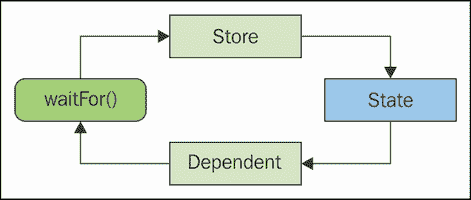
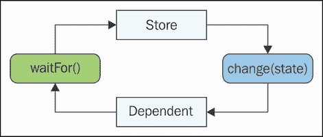
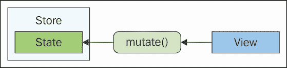
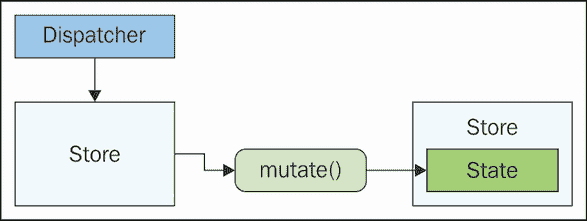
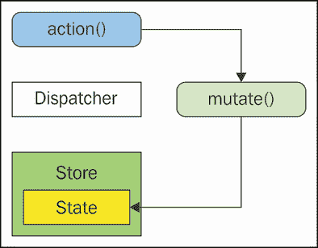
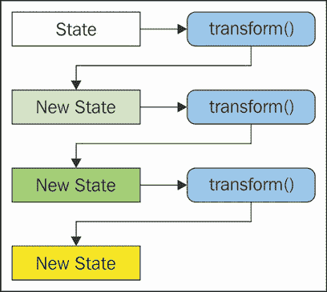
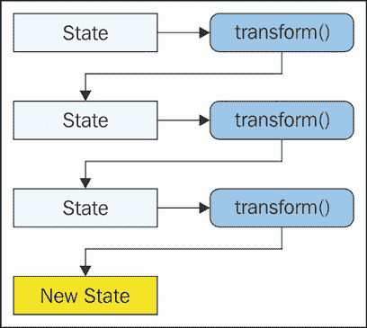

# 第九章。不可变存储

在本章中，我们将探讨 Flux 存储中的不可变数据。不可变性是一个经常与函数式编程相关的术语。不可变数据是在创建后不会改变（突变）的数据。关键好处是你可以预测应用程序中数据变化的根本原因，因为数据不能被副作用意外更改。不可变性和 Flux 之间相处得很好，因为它们都关于明确性和可预测性。

我们将从讨论隐藏的更新或副作用开始。Flux 本身就阻止了这类事情的发生，不可变数据有助于强化这一理念。然后，我们将探讨这些副作用对我们 Flux 架构完整性的影响。由突变存储数据引起的副作用最严重的后果是破坏了 Flux 的单向数据流。接下来，我们将看看不可变性的隐藏成本——这些成本大多与所需的额外资源相关，可能导致性能明显下降。最后，我们将探讨 `Immutable.js` 库，以帮助对不可变数据进行转换。

# 摒弃隐藏的更新

Flux 的单向特性使其与其他现代前端架构区分开来。单向数据流之所以有效，是因为动作创建者是唯一能让新数据进入系统的方式。然而，Flux 并没有强制执行这一点，这意味着一些错误的代码片段有可能完全破坏我们的架构。

在本节中，我们将探讨在 Flux 中如何实现类似这种情况。然后我们将探讨视图通常如何从存储中获取数据，以及是否有更好的方法。最后，我们将思考我们 Flux 架构中的其他组件，看看是否除了存储数据外，还可以使其他内容不可变。

## 如何打破 Flux

打破 Flux 最简单的方法是在没有经过适当渠道的情况下突变存储状态。动作分发者是新数据进入系统的入口，它还协调我们存储的动作处理器。例如，一个动作可能会触发几个存储的处理程序，以不同的方式使用动作负载。如果直接突变存储的状态，这种情况就不会发生。我们可能会幸运地发现我们做的更改没有任何副作用。但这不正是我们明确动作以避免不可预测的复杂副作用的前提吗？

如果我们降低门槛，开始直接在这里和那里操作状态，我们还能阻止自己更频繁地这样做吗？最可能的情况是视图事件处理器突变存储数据。这是因为视图通常有直接引用存储，而其他 Flux 组件通常没有。所以当用户点击按钮，我们的处理器只是改变存储的状态而不是分发动作时，我们可能会陷入麻烦。

让我们通过一个例子来了解一下在 Flux 领域外操作是多么危险。我们首先检查按钮商店：

```js
import { EventEmitter } from 'events';
import dispatcher from '../dispatcher';
import { TOGGLE } from '../actions/toggle';

class Button extends EventEmitter {
  constructor() {
    super();

    // The default state is to show the button
    // as enabled and to process click events.
    this.state = {
      text: 'Enabled',
      disabled: false
    };

    this.id = dispatcher.register((e) => {
      let { state } = this;

      switch(e.type) {

        // When the "TOGGLE" action is dispatched,
        // the next state of the button depends on
        // the current state of the "disabled"
        // property.
        case TOGGLE:
          state.text = state.disabled ?
            'Enabled' : 'Disabled';
          state.disabled = !state.disabled;

          this.emit('change', state);
          break;
      }
    });
  }
}

export default new Button();
```

看起来很简单——控制文本和按钮的`disabled`状态。这很简单，但前提是我们遵守 Flux 规则并派发动作来改变商店的状态。现在，让我们看看一个使用此商店来渲染自己的视图组件：

```js
import React from 'react';
import button from '../stores/button';
import { toggle } from '../actions/toggle';

function onClick() {

  // Oh snap! This just totally broke Flux...
  button.state.disabled = !button.state.disabled;

  // Call the action creator as we should...
  toggle();
}

// Renders your typical HTML button, complete
// with properties and a callback handler for
// click events.
export default ({ text, disabled }) => (
  <button
    onClick={onClick}
    disabled={disabled}>{text}</button>
);
```

这里本应发生的事情是，当按钮被点击时，它应该变为禁用状态，因为当`TOGGLE`动作被派发时，按钮商店将相应地改变状态。这部分工作如预期那样。然而，由于调用`toggle()`之前的这一行，结果将永远不会如预期那样工作。在这里，我们直接操作商店的状态。这阻止了在派发`TOGGLE`动作时预期的行为发生，因为状态已经被改变，所以现在它会恢复原状。

这些小技巧如果不小心，可能会在将来造成大麻烦。当你查看这个视图模块时，有问题的代码会跳出来。想象一下，在一个真实的项目中，有更多这样的视图，每个都比这个大得多——你能在事情变得太晚之前发现这个问题吗？

## 获取商店数据

由于引用商店状态是一件危险的事情，也许我们可以完全避免它？这样会大大减少错误的可能性，正如我们在上一节中看到的。例如，当两个商店相互依赖时，它们使用调度器的`waitFor()`方法来确保我们依赖的商店首先更新。然后我们就可以直接访问商店，知道其状态已经更新。这种方法如图所示：



依赖的商店直接引用了它所依赖的商店的状态，如果我们不小心，这可能会导致大问题。另一种方法是有依赖的商店监听它所依赖的商店的更改事件。回调函数可以使用作为参数传递给它的新状态。当然，我们仍然需要使用`waitFor()`或类似的方法来确保商店按正确的顺序更新。这种方法如下所示：



这开始看起来像是一个视图组件——视图会监听存储的变化事件，以便它们可以渲染 UI 更新来反映状态的变化。视图还需要执行存储数据的初始渲染，这也是为什么它们通常会引用存储状态。这些想法的问题在于，它们实际上并没有阻止我们直接访问存储状态——谁知道这些回调参数中会传递哪种类型的引用。另一个问题是，在可能直接读取值的地方引入回调函数，从设计角度来看是一种过度复杂化。必须有一种更好的方法。使我们的存储状态数据不可变是朝着正确方向迈出的一步。

### 备注

在下一章，我们将实现自己的分发器组件。在这样做的时候，我们会考虑实现一些防止在更新轮次发生时从存储中访问状态数据的保障措施，但存储尚未更新。这将有助于更容易地处理依赖项的故障排除。

## 一切都是不可变的

在讨论如何强制执行不可变性之前，让我们谈谈 Flux 架构中一切事物都应该是不可变性的观点。从理论上讲，这不应该很难做到，因为 Flux 将状态限制在存储内部，不允许其存在于其他任何地方。所以，让我们从存储开始。

我们的所有存储都应该是不可变的，或者可能只是其中一些？只有一些不可变的存储不是一个好主意，因为它会促进不一致性。那么，在所有地方都实现不可变性，这是否是必要的？这是一个非常重要的问题，我们必须对我们的架构提出这个问题，因为这里没有一刀切的答案。当我们需要额外的保证，即以后不会有存储状态上的惊喜时，不可变性的论点就有效了。反论是，我们作为程序员足够自律，不可变性的机制只是增加了开销。

我们将在本章的剩余部分论证不可变数据的好处，因为几乎在所有情况下，其优点都超过了缺点。无论你对不可变性的看法如何，了解它在 Flux 架构中的优势都是有益的——即使你不会使用它。

那么视图组件呢——它们实际上可以是不可变的吗？好吧，实际上它们不能，因为 DOM API 不允许这样做。我们的视图组件实际上必须操纵页面上的元素状态。然而，如果我们使用像 React 这样的视图技术，那么我们会得到一层不可变的面纱，因为其理念是始终重新渲染组件。所以，当我们实际上在用 React 处理 DOM 操作的同时，我们似乎是在用新元素替换旧元素。这促进了这样一个观点，即状态在 Flux 视图中没有位置。

# 强制单向数据流

如果新数据只通过调度器派发的动作有效载荷进入系统，并且我们的存储数据是不可变的，那么我们就有一个单向数据流。这是我们的目标，所以问题是，我们如何强制执行这一点？我们能否简单地声明我们的存储数据是不可变的，然后就此结束？嗯，那绝对是一个值得追求的目标，但还有更多的事情要做。

在本节中，我们将讨论数据以非预期方向流动的概念，以及是什么导致了这种情况。然后，我们将考虑拥有太多存储和太少动作作为导致数据流功能障碍的贡献因素。最后，我们将检查一些我们可以利用的技术，以使我们的存储数据不可变。

## 反向、横向和泄漏的数据流

Flux 架构有一个单向数据流——数据从左侧进入，从右侧退出。这很容易想象成一个向前移动的流程。那么，这种流程可能会出错的地方有哪些呢？以反向流为例。如果一个视图实例持有存储实例的引用，并继续修改其状态，那么流程就是从视图流向存储。这与预期的流程方向完全相反，因此它是向后的。以下是这种外观的说明：



这显然不是我们在使用 Flux 系统时预期的。但除非我们通过让存储的状态返回不可变数据结构给任何想要与之交互的其他组件来排除这种可能性，否则这是一个很可能会发生的情况。那么，存储——它们能否修改另一个存储的状态呢？它们不应该这样做，如果它们这样做，那看起来就像是一个横向数据流。

### 注意

**ProTip**: 任何横向移动的东西都是不好的。

下面是一个 Flux 存储之间横向数据流的例子：



这和直接修改存储状态的观点组件一样糟糕，因为我们刚刚改变的状态可能会影响下一个计算出的状态。这正是我们在本章第一个代码示例中看到的情况。

那么，关于动作，它们能否直接操作存储的状态呢？这可能是最不可能的情况，因为动作创建函数应该在协调任何异步行为后仅仅派发动作。然而，动作创建函数可能在 AJAX 回调处理程序中错误地修改存储状态，例如。我们称之为*泄漏流*，因为它们绕过了调度器。因此，我们在没有任何可追踪的动作来显示它们来源的情况下泄漏了修改。以下是这个想法的说明：



## 存储太多？

总是有可能我们的架构中存在太多的 Flux 商店。也许应用的功能已经超出了我们最初的设计。现在，仅仅将商店映射到功能上是不够的，因为已经有几十个商店了。

如果我们无法控制商店的数量，一个可能的结果是其他组件将直接进行状态突变。这仅仅是一个便利性的问题，如果有很多商店需要考虑，那就意味着每次我们想要做些什么时，我们都必须处理几个与调度器相关的开发活动。当有大量商店时，就有直接操作它们状态的冲动。移除商店可以减少这种冲动。

## 动作不足

我们的 Flux 架构可能没有足够的动作吗？例如，我们正在工作的视图需要改变商店的状态。没有动作来处理这个问题，所以我们不是构建一个新的动作创建器并更新商店以处理逻辑，而是直接突变商店。这听起来像是一项足够简单的任务——构建一个动作创建器函数并添加必要的商店更新逻辑。但如果我们必须不断实现这些一次性动作创建器函数，最终我们可能就不再关心了。解决这个问题有两种方法。第一种是实现更通用的动作，这些动作不仅适用于特定的情况，还可以接受参数。第二种是在你需要它们之前，构建一些与你在工作的功能相关的动作创建器函数。当你知道这些函数存在时，在潜意识里，你更有可能使用它们。

## 强制不可变性

让我们探索一些保持商店状态不可变的不同方法。目标是当某个外部实体引用商店的状态时，该实体对状态所做的任何更改实际上都不会影响商店，因为数据是不可变的。我们将首先实现一个不实际返回其状态引用的商店——它使用`Object.assign()`返回状态的副本：

```js
import { EventEmitter } from 'events';
import dispatcher from '../dispatcher';
import { MY_ACTION } from '../actions/my-action';

// The state of this store is encapsulated
// within the module.
var state = {
  first: 1,
  second: 2,
};

class Copy extends EventEmitter {
  constructor() {
    super();

    this.id = dispatcher.register((e) => {
      switch(e.type) {

        case MY_ACTION:

          // Mutates "state" with new properties...
          Object.assign(state, e.payload);
          this.emit('change', state);
          break;
      }
    });
  }

  // Returns a new copy of "state", not a reference
  // to the original.
  get state() {
    return Object.assign({}, state);
  }
}

export default new Copy();
```

在这里，你可以看到实际的商店状态位于模块级别的`state`变量中。这意味着它不能被外部世界直接访问，因为它没有被导出。我们希望状态以这种方式封装，这样其他组件就难以突变它。如果其他组件需要读取商店状态属性，它们可以读取商店的`state`属性。由于这是一个 getter 方法，它可以计算返回的值。在这种情况下，我们将动态创建一个新的对象。现在让我们看看一个将状态存储在常量中的商店：

```js
import { EventEmitter } from 'events';
import dispatcher from '../dispatcher';
import { MY_ACTION } from '../actions/my-action';

// The state of this store is encapsulated
// within this module. It's also stored as
// a constant.
const state = {
  first: 1,
  second: 2,
};

class Constant extends EventEmitter {
  constructor() {
    super();

    this.id = dispatcher.register((e) => {
      switch(e.type) {

        case MY_ACTION:
          // Mutates "state" with new properties...
          Object.assign(state, e.payload);
          this.emit('change', state);
          break;
      }
    });
  }

  // Returns a reference to the "state" constant...
  get state() {
    return state;
  }
}

export default new Constant();
```

这个存储结构与`Copy`存储相同，模式也一致。不同之处在于`state`不是一个变量——它是一个常量。这意味着我们不应该能够修改它，对吧？嗯，并不完全是这样——我们只是不能给它赋新值。因此，这种方法的价值有限，因为`state()`获取器返回的是常量的直接引用。我们将在其他组件使用存储时，稍后看到这种方法是如何工作的。让我们再看看另一种方法，它使用`Object.frozen()`使对象不可变：

```js
import { EventEmitter } from 'events';
import dispatcher from '../dispatcher';
import { MY_ACTION } from '../actions/my-action';

// The store state is encapsulated within
// this module...
var state;

// Merges new values with current values, freezes
// the new state, and assigns it to "state".
function change(newState) {
  let changedState = Object.assign({}, state, newState);
  state = Object.freeze(changedState);
}

// Sets the initial state and freezes it...
change({
  first: 1,
  second: 2,
});

class Frozen extends EventEmitter {
  constructor() {
    super();

    this.id = dispatcher.register((e) => {
      switch(e.type) {

        case MY_ACTION:

          // Calls "change()" to update the "state"
          // value and re-freeze it.
          change(e.payload);
          this.emit('change', state);
          break;
      }
    });
  }

  // Returns a reference to the frozen "state"...
  get state() {
    return state;
  }
}

export default new Frozen();
```

`state()`获取器实际上返回的是冻结的`state`变量的引用。这个方法有趣的地方在于，我们不一定需要创建数据的新副本，因为我们的`change()`函数已经使其不可变。而当存储本身需要更新其状态时，状态就会被重新冻结。

让我们看看这些方法现在是如何比较的。首先，我们将导入存储并获取它们状态的引用：

```js
import copy from './stores/copy';
import constant from './stores/constant';
import frozen from './stores/frozen';

var copyState = copy.state;
var constantState = constant.state;
var frozenState = frozen.state;

copyState.second++;
constantState.second++;

try {
  frozenState.second++;
} catch (err) {
  console.error(err);
  // →
  // TypeError: Cannot assign to read only property
  // 'second' of object
}

console.assert(
  copy.state.second !== copyState.second,
  'copy.second mutated'
);

console.assert(
  constant.state.second !== constantState.second,
  'constant.second mutated'
);
// → Assertion failed: constant.second mutated
```

看起来我们能够成功改变`copyState`的状态。这在某种程度上是正确的——我们改变了一个副本的状态，而这个副本实际上并不反映存储的状态。另一方面，`constantState`的改变确实有副作用，因为任何从常量存储读取状态的组件都会看到这个变化。

当我们尝试更改`frozenState`时，会抛出一个`TypeError`。这实际上可能是我们想要的结果，因为它明确指出我们尝试对`fronzenState`所做的事情是不允许的。当我们向存储状态添加新属性时，也会发生类似的事情——复制会静默失败，常量会失败，而冻结会明确失败：

```js
copyState.third = 3;
constantState.third = 3;

try {
  frozenState.third = 3;
} catch (err) {
  console.error(err);
  // →
  // TypeError: Can't add property third, object is
  // not extensible
}
```

最后，让我们看看在更改事件发出时发送的状态数据：

```js
copy.on('change', (state) => {
  console.assert(state !== copyState, 'copy same');
  console.assert(state.fourth, 'copy missing fourth');
});

constant.on('change', (state) => {
  console.assert(state !== constantState, 'constant same');
  // → Assertion failed: constant same

  console.assert(state.fourth, 'constant missing fourth');
});

frozen.on('change', (state) => {
  console.assert(state !== frozenState, 'frozen same');
  console.assert(state.fourth, 'frozen missing fourth');
});

myAction({ fourth: 4 });
```

`myAction()`函数将使用新数据扩展存储状态。正如我们再次看到的，常量方法失败了，因为它返回了被修改的相同引用。一般来说，这些方法在实践中都不太容易实现。这也是我们想要认真考虑使用像`Immutable.js`这样的库的另一个原因，在那里不可变性是默认模式，并且大部分隐藏在我们的代码中。

# 不可变数据的成本

到现在为止，你已经非常清楚不可变数据给 Flux 架构带来的优势——关于我们单向数据流的保证。这个安全网是有代价的。在本节中，我们将讨论不可变性可能带来的高昂成本以及我们可以采取的措施。

我们将从覆盖最大的不可变性问题——瞬态内存分配和垃圾回收开始。这些因素对我们 Flux 架构的性能构成了重大威胁。接下来，我们将考虑通过批量处理不可变数据上的转换来减少内存分配的数量。最后，我们将探讨不可变数据消除仅用于处理数据可变场景的代码的方式。

## 垃圾回收成本高昂

可变数据结构的一个好处是，一旦它们被分配，它们通常会持续一段时间。也就是说，我们不需要将现有结构的属性复制到一个新结构中，然后在需要更新时销毁旧结构。这是软件，所以我们将进行很多更新。

使用不可变数据时，我们面临着内存消耗的挑战。每次我们修改一个对象时，都必须为该对象分配一个新的副本。想象一下，我们处于一个循环中，在一个集合中对不可变对象进行修改——这会在短时间内产生大量的内存分配——可以说是峰值。此外，被新对象取代的旧对象并不会立即从内存中删除。它们必须等待垃圾回收器来清理。

当我们的应用程序使用的内存超过其需求时，性能会受到影响。当垃圾回收器因为我们的内存分配而频繁运行时，性能会受到影响。正是垃圾回收器，而不是其他任何东西，触发了卡顿的用户体验，因为我们的 JavaScript 代码在运行时无法响应任何挂起的事件。

可能有一种处理不可变数据的方法，比在只需要简单更新时替换大型对象更节省内存。

## 批量修改

幸运的是，存储会修改自己的状态。这意味着存储分发回调封装了状态转换期间发生的所有操作。所以如果我们的存储有不可变状态数据，那么外部世界就不需要知道存储在内部为了减少内存分配数量而采取的任何捷径。

假设一个存储接收一个动作，并且它必须在它的状态上执行三个单独的转换：进行一个转换以生成一个新对象，然后在这个新对象上执行另一个转换，依此类推。这是为中间数据进行的许多短暂的内存分配，而这些中间数据其他组件永远不会触及。以下是对正在发生的事情的说明：



我们希望最终结果是新的状态引用，但中间创建的新状态是浪费的。让我们看看我们是否可以在返回最终不可变值之前将这些状态转换批量处理：



现在，尽管我们进行了三次状态转换，但我们只分配了一个新的对象。我们在 Flux 存储中进行的修改对系统中的任何其他组件来说都是微不足道的，但我们仍然保持了任何其他想要访问和读取此状态的组件的不变性。

## 转移成本

可变数据的痛苦之处在于，使用这些数据的组件必须考虑副作用。它们并不一定知道这些数据何时以及如何会发生变化。因此，它们需要处理副作用的代码。虽然处理意外副作用的代码通常不会占用更多内存，但它也不是免费运行的。当我们的源代码中到处都有处理边缘情况的代码时，性能下降会累积。使用不可变数据，我们可以移除大部分，如果不是全部的话，这些检查状态的额外代码，因为我们能更好地预测它将会是什么。这有助于抵消额外内存分配和垃圾回收运行的代价。即使我们不在我们的商店中使用不可变数据，Flux 架构也使得副作用处理代码的需求几乎变得过时。单向数据流使得 Flux 非常可预测。

# 使用 Immutable.js

来自 Facebook 的 `Immutable.js` 库提供了不可变的 JavaScript 数据结构。这听起来可能很平凡，但幕后有很多事情发生以确保这一点，即尽可能高效地从转换中创建新实例。

在本节中，我们将探讨不可变列表和映射。这些可以在我们的 Flux 商店数据中分别作为数组和普通对象的可行替代品。然后，我们将看看 `Immutable.js` 如何在不需要中间表示的情况下组合复杂的转换。最后，我们将看到 `Immutable.js` 在经过转换后没有突变时返回相同的实例，从而允许高效的变更检测。

## 不可变列表和映射

我们将从查看列表和映射开始，因为这些都是我们将在商店中实现的一些常见结构。列表有点像数组，映射有点像普通的 JavaScript 对象。让我们实现一个使用列表的商店：

```js
import { EventEmitter } from 'events';
import Immutable from 'Immutable';

import dispatcher from '../dispatcher';
import { LIST_PUSH, LIST_CAPS } from '../actions/list';

// The state of this store is an "Immutable.List"
// instance...
var state = Immutable.List();

class List extends EventEmitter {
  constructor() {
    super();

    this.id = dispatcher.register((e) => {
      switch(e.type) {

        // When the "LIST_PUSH" action is dispatched,
        // we create a new List instance by calling
        // "push()". The new list is assigned to "state".
        case LIST_PUSH:
          this.emit('change',
            (state = state.push(...e.payload)));
          break;

        // When the "LIST_CAPS" action is dispatched,
        // we created a new List instance by calling
        // "map()". The new list is assigned to "state".
        case LIST_CAPS:
          this.emit('change',
            (state = state.map(x => x.toUpperCase())));
          break;
      }
    });
  }

  get state() {
    return state;
  }
}

export default new List();
```

您可以看到，`state` 变量被初始化为一个空的 `Immutable.List()` 实例（`new` 关键字不是必需的，因为这些是返回新实例的函数）。每当我们在列表实例上调用一个方法时，就会返回一个新的实例。这就是为什么我们必须将调用 `push()` 和 `map()` 的结果赋值给 `state` 的原因。

现在让我们实现一个映射商店：

```js
import { EventEmitter } from 'events';
import Immutable from 'Immutable';

import dispatcher from '../dispatcher';
import { MAP_MERGE, MAP_INCR } from '../actions/map';

// The state of this store is an "Immutable.Map"
// instance...
var state = Immutable.Map();

class MapStore extends EventEmitter {
  constructor() {
    super();

    this.id = dispatcher.register((e) => {
      switch(e.type) {

        // When the "MAP_MERGE" action is dispatched,
        // we create a new Map instance by calling
        // "merge()". The new map is assigned to "state".
        case MAP_MERGE:
          this.emit('change',
            (state = state.merge(e.payload)));
          break;

        // When the "MAP_INCR" action is dispatched,
        // we create a new Map instance by calling
        // "map()". The new map is assigned to "state".
        case MAP_INCR:
          this.emit('change',
            (state = state.map(x => x + 1)));
      }
    });
  }

  get state() {
    return state;
  }
}

export default new MapStore();
```

如您所见，映射遵循与列表相同的不可变模式。主要区别在于它们是按键而不是按索引来组织的。现在让我们看看这两个存储是如何使用的：

```js
import list from './stores/list';
import map from './stores/map';
import { listPush, listCaps } from './actions/list';
import { mapMerge, mapIncr } from './actions/map';

// Logs the items in the "list" store when
// it's state changes.
list.on('change', (state) => {
  for (let item of state) {
    console.log('  list item', item);
  }
});

// Logs the items in the "map" store when
// it's state changes.
map.on('change', (state) => {
  for (let [key, item] of state) {
    console.log(`  ${key}`, item);
  }
});

console.log('List push...');
listPush('First', 'Second', 'Third');
// → List push...
//     list item First
//     list item Second
//     list item Third

console.log('List caps...');
listCaps();
// → List caps...
//     list item FIRST
//     list item SECOND
//     list item THIRD

console.log('Map merge...');
mapMerge({ first: 1, second: 2 });
// → Map merge...
//     first 1
//     second 2

console.log('Map increment...');
mapIncr();
// → Map increment...
//     first 2
//     second 3
```

## 不可变转换

现在，是时候在 Flux 商店内部实现一个更复杂的转换了。这意味着将 `Immutable.js` 结构上的操作链式化以创建一个新的结构。但是，关于中间内存分配——我们肯定想关注这些，对吧？这里有一个尝试在转换商店状态时使用更少内存的商店：

```js
import { EventEmitter } from 'events';
import Immutable from 'Immutable';

import dispatcher from '../dispatcher';
import { SORT_NAMES } from '../actions/sort-names';

// The state is an object with two immutable
// list instances. The first is a list of user
// maps. The second is a list of user names and
// is empty by default.
const state = {
  users: Immutable.List([
    Immutable.Map({ id: 33, name: 'tHiRd' }),
    Immutable.Map({ id: 22, name: 'sEcoNd' }),
    Immutable.Map({ id: 11, name: 'firsT' })
  ]),
  names: Immutable.List()
};

class Users extends EventEmitter {
  constructor() {
    super();

    this.id = dispatcher.register((e) => {
      switch(e.type) {

        // The "SORT_NAMES" action was dispatched...
        case SORT_NAMES:

          // Determines the "sort" multiplier that's passed
          // to "sortBy()" to sort in ascending or
          // descending direction.
          let sort = e.payload === 'desc' ? -1 : 1;

          // Assigns the sorted list to "users" after
          // performing a series of transforms. The
          // "toSeq()" and "toList()" calls aren't strictly
          // necessary. Any calls in between them, however,
          // don't result in new structures being created.
          state.names = state.users
            .sortBy(x => x.get('id') * sort)
            .toSeq()
            .map(x => x.get('name'))
            .map(x => `${x[0].toUpperCase()}${x.slice(1)}`)
            .map(x => `${x[0]}${x.slice(1).toLowerCase()}`)
            .toList();

          this.emit('change', state);
          break;
      }
    });
  }

  get state() {
    return state;
  }
}

export default new Users();
```

`SORT_NAMES`动作导致我们对不可变列表进行了一些有趣的转换。想法是将它映射到一个按用户`id`排序的大写用户名列表。这里使用的技术涉及在排序后使用`toSeq()`将列表转换为序列，这样做是为了防止`map()`调用分配新的结构，因为我们实际上不需要一个具体结构直到映射完成。为此，我们只需调用`toList()`，这将调用我们在序列上设置的所有映射并创建列表。这意味着我们在这里创建的唯一结构是来自`sortBy()`的新列表、来自`toSeq()`的新序列和来自`toList()`的新列表。

在这个特定的例子中，这可能是过度杀鸡用牛刀，仅仅是因为我们在一个包含三个元素的列表上执行了三个操作。所以，我们只需从我们的代码中移除`toSeq()`和`toList()`来简化事情。然而，当我们扩展到更大的集合和更复杂的转换时，了解这种技术以减少我们架构的内存占用是有益的。现在让我们看看这个存储的实际应用效果：

```js
import users from './stores/users';
import { sortNames } from './actions/sort-names';

// Logs the user names...
users.on('change', ({names}) => {
  for (let item of names) {
    console.log('  name', item);
  }
});

console.log('Ascending...');
sortNames();
// → Ascending...
//     name First
//     name Second
//     name Third

console.log('Descending...');
sortNames(true);
// → Descending...
//     name Third
//     name Second
//     name First
```

## 变化检测

在本章的最后一个例子中，我们将看到是否可以使用`Immutable.js`结构在我们的 Flux 存储中实现高效的变化检测。实际上，检测本身将在 React 视图中进行，但这依赖于存储状态使用`Immutable.js`对象。我们为什么要这样做——React 在计算 diff 时不是已经足够高效了吗？React 在这里确实很出色，但它仍然需要做相当多的工作来确定不需要重新渲染。我们可以通过提供存储状态实际上没有变化的提示来帮助我们的 React 组件。所以，不拖泥带水，这是我们将会使用的存储：

```js
import { EventEmitter } from 'events';
import Immutable from 'Immutable';

import dispatcher from '../dispatcher';
import { MY_ACTION } from '../actions/my-action';

// The store state is an Immutable.js Map instance.
var state = Immutable.Map({
  text: 'off'
});

class MyStore extends EventEmitter {
  constructor() {
    super();

    this.id = dispatcher.register((e) => {
      switch(e.type) {

        // When "MY_ACTION" is dispatched, we set
        // the "text" property of "state" as the
        // "payload". If the value has change, "state"
        // "set()" returns a new instance. If there's
        // no change, it returns the same instance.
        case MY_ACTION:
          this.emit('change',
            (state = state.set('text', e.payload)));
          break;
      }
    });
  }

  get state() {
    return state;
  }
}

export default new MyStore();
```

在我们这边没有做任何花哨的事情；我们只是使用`Immutable.js Map`作为我们的存储状态。当调用`set()`时，我们将新的`Map`实例分配给状态，因为返回的是一个新实例。这里是我们感兴趣的启发式方法——如果没有变化，返回相同的实例。让我们看看我们如何在我们视图中使用`Immutable.js`数据的这个属性：

```js
import { default as React, Component } from 'react';

export default class MyView extendsComponent {

  render() {

    // Logs the fact that we're rendering because
    // "shouldComponentUpdate()" will prevent it
    // if the store state hasn't changed.
    console.log('Rendering...');

    let { state } = this.props;

    return (
      <p>{state.get('text')}</p>
    );
  }

  // Since we're using an Immutable.js Map as
  // the store state, we know that if the
  // instances are equal, nothing has changed
  // and there's no need to render.
  shouldComponentUpdate(nextProps) {
    return nextProps.state !== this.props.state;
  }
}
```

这个组件的关键部分是`shouldComponentUpdate()`方法，它通过进行严格的不等式比较来确定存储是否已更改。在这种情况下，如果这个组件被渲染很多次但不需要更改任何内容，这将避免大量的虚拟 DOM 树检查。现在，让我们看看我们如何使用这个视图：

```js
import React from 'react';
import { render } from 'react-dom';

import myStore from './stores/my-store';
import MyView from './views/my-view';
import { myAction } from './actions/my-action';

// The container DOM element for our React component.
const container = document.getElementById('app');

// The payload that's sent to "myAction()"...
var payload = 'off';

// Renders the React components using the
// "myStore" state...
function renderApp(state=myStore.state) {
  render(
    <MyView state={myStore.state} />,
    container
  );
}

// Re-render the app when the store changes...
myStore.on('change', renderApp);

// Performs the initial rendering...
renderApp();

// Dispatches "MY_ACTION" every 0.5 seconds. This
// causes the store to change state and the app
// to re-render.
setInterval(() => {
  myAction(payload);
}, 500);

// After 5 seconds, change the payload that's
// dispatched with "MY_ACTION" so that the store
// state is actually different.
setTimeout(() => {
  payload = 'on';
}, 5000);
```

正如你所见，那些导致我们视图重新渲染的操作是持续不断地被派发的。然而，由于我们存储库中的`set()`调用在没有任何变化时返回相同的实例，视图本身实际上并没有做多少工作。然后，一旦我们在 5 秒后更改了有效载荷值，`Immutable.js`映射实例就会改变，视图也会更新。这个视图总共渲染了两次——初始渲染和存储数据实际发生变化时的渲染。

你可能已经注意到，这种实现本可以走向另一个方向，其中一个存储库不会在没有任何变化时发出更改。这完全取决于个人品味和权衡。我们选择的方法确实要求视图在优化渲染工作流程中扮演一个积极的角色。这对于 React 组件来说很容易做到，并且简化了我们的存储逻辑。另一方面，我们可能更喜欢保持我们的视图完全无逻辑，包括`shouldComponentUpdate()`检查。如果是这样，我们只需将这个逻辑移回存储库，并且如果两个`Immutable.js`实例相同，则不会发出更改事件。

# 摘要

本章向你介绍了不可变性——既从术语的一般意义上，也从事务流架构的角度来看。我们本章开始时讨论了可变数据如何破坏 Flux 的多种方式。特别是，这破坏了任何 Flux 架构的皇冠宝石——单向数据流。接下来，我们研究了当我们开始在存储之外修改数据时出现的不同类型的数据流，因为这些是在调试 Flux 架构时值得寻找的好东西。

我们有几种方法可以在我们的 Flux 存储中强制执行不可变数据，我们已经探索了许多方法。不可变数据是有代价的——因为垃圾收集器需要不断运行，阻止其他 JavaScript 代码运行，以收集所有这些额外的对象副本。我们探讨了如何最小化这些额外的内存分配，以及如何抵消使用不可变数据的总体成本。

我们通过实现几个使用`Immutable.js`数据结构的存储库来结束本章。这个库默认为我们提供了不可变性、附加功能和高效的中间内存分配。在下一章中，我们将实现我们自己的派发组件。
