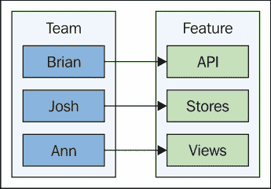

# 第十四章. Flux 与软件开发生命周期

Flux 首先关注的是信息架构。这就是为什么 Flux 是一组模式而不是框架实现的原因。当我们设计可扩展的前端架构时，相对于整体系统的设计，具体的实现几乎无关紧要。单向数据流和同步更新轮次等因素对系统的可扩展性有着持久的影响。事实上，Flux 的影响足以改变我们开发软件的方式。

在本章中，我们将通过 Flux 的视角来审视软件开发生命周期。我们将以对 Flux 实现开放可能性的讨论开始本章。然后，我们将比较在新 Flux 项目开始时发生的开发活动类型与成熟 Flux 项目发生的情况。

我们还将思考使 Flux 一开始就具有吸引力的概念，以及如何提取这些想法并将它们应用于其他软件系统。最后，我们将以创建单体 Flux 系统与打包 Flux 组件的比较来结束本章。

# Flux 具有开放性

JavaScript 框架的一个问题是，它们只是可能解决方案全谱中的一种实例化。一种解决方案并不像我们希望的那样通用。即使是只包含少量模式的 Flux 这样的规范也是开放的，可以解释。它们只是模式的事实使得一个群体可以按照自己的方式实现软件，而另一个群体则使用相同的模式以他们认为合适的方式实现软件。

在本节中，我们将重申 Flux 只是一组要遵循的模式的事实。我们将回顾使用 Flux 库的可能性，每个库都对实现 Flux 模式有不同的看法。然后，我们将考虑实现我们自己的 Flux 组件的权衡。

## 实现选项 1 – 只遵循模式

对于我们来说，Flux 只是一组要遵循的模式。我们甚至可能不会完全遵循它们。模式的有效性并不重要——重要的是我们从设计中获得了 Flux 的基本价值。例如，动作描述了已经发生的事情，并携带新数据的有效载荷进入系统。一旦新数据被分发，它就会沿着一个方向继续，直到被渲染。Flux 恰好使用了分发器和存储的概念。如果我们愿意，我们可以把我们的 Flux 实现称为传送带。如果数据流是单向且可预测的，那么我们就达到了 Flux 的一个目标。

同样，我们可以根据喜好实现调度器和 store 组件。我们可能对 store 组件进行一些调整，以更好地服务于我们的应用程序。这些调整可能是出于性能原因，也可能是为了方便开发者。只要数据流保持单向和同步，引入这些是完全可以接受的。

单向数据流和同步更新轮次的想法并不仅限于 Flux。我们可以在其他架构的约束下工作，如 MVC，并实现相同的原则。Flux 的独特之处在于它起源于挫败感。Facebook 的工程师们决定他们需要一个工具来明确地表达如何正确地实现这些设计原则。

## 实现选项 2 – 使用 Flux 库

我们当然不必自己实现每个 Flux 组件。在 Flux 库方面有很多选择。有趣的是，这个 Flux 库生态系统强化了 Flux 可以被解释的断言。也许最好的例子就是 Redux。这个库并不是 Flux 文档中概述的概念的实现。相反，Redux 采取了不同的路线来实现 Flux 原则。

例如，在 Redux 中没有调度器，我们只能创建一个包含还原函数的 store。重要的是我们仍然获得了单向数据流和同步的更新轮次。然后是 `Alt.js`，它在实现 Flux 方面采取了更传统的做法，因为它具有与 Flux 文档中概述的相同抽象。但 `Alt.js` 还在这些概念之上构建了自己的想法，使得实现 Flux 更加容易和愉快。

当我们决定利用 Flux 库时，是不是必须全盘接受？不一定。这种全有或全无的恐惧源于那些规定做事方式的单体框架，而且没有简单的方法来绕过这些问题。使用库的想法是能够挑选和选择你需要的部分来组合更大的行为。以 Flux 架构中的视图层为例——这通常由 React 组件组成。然而，Redux 或 `Alt.js` 并不要求我们使用 React。Redux 足够小，我们可以直接使用其 store 组件来处理我们的应用程序状态，而 `Alt.js` 有几个较小的模块供我们选择——可能有一些我们永远不会使用。

## 自行实现 Flux

考虑到有这么多实现 Flux 系统的方法，我们自己实现是否有任何实用性？换句话说，如果我们不依赖众多 Flux 库之一，而是自己实现 Flux 组件，是否会重蹈覆辙？根本不会。有很大可能性，没有任何 Flux 库能满足我们试图达成的目标。或者，可能有几个关于 Flux 组件的问题我们想要定制，这样依赖一个我们打算完全更改的实现就不再有意义。

本书中的大部分代码都是基于我们自己的 Flux 组件实现。我们依赖 Flux 派发器的参考实现，但后来我们实现了自己的版本，并没有遇到太多困难。自己实现 Flux 组件的积极方面是我们有自由调整组件以满足我们应用发展的需求。当我们依赖他人的实现时，这样做会更困难。

一种可能性是，我们使用像`Alt.js`这样的库来获取灵感，以实现我们自己的版本。这样，我们可以在修改它们的同时实现该库中的酷炫功能。另一方面，我们可能更倾向于直接使用现成的 Flux 库。最好的办法是在构建 Flux 架构框架时考虑这类事情。一开始不要依赖任何库，但尽早决定是否要使用像 Redux 这样的库，这样你就不必丢弃太多组件。

# 开发方法论

在本节中，我们将探讨在 Flux 项目不同阶段发生的开发方法论。请记住，这些只是指导方针，因为方法论可以从一个团队到另一个团队有相当大的差异。如果两个不同的团队正在实现 Flux 系统，无疑会有一些共同点。

首先，我们将思考在一个新的 Flux 项目初始阶段会发生什么。然后，我们将思考那些已经成熟起来的 Flux 项目，以及向系统中添加新功能的过程可能是什么样子。

## 预先 Flux 活动

许多软件开发方法论都不赞成大范围的预先设计。原因很简单——我们在编写和测试任何软件之前花费了太多时间进行设计。逐步交付软件片段给我们提供了一个机会来验证我们在编写代码时可能做出的任何假设。问题是，Flux 是否需要大范围的预先设计，或者我们能否逐步实现 Flux 系统的各个部分？

正如你在本书前面看到的，设计 Flux 架构的第一步是编写代码。起初，我们只对产生骨架架构感兴趣，以便我们可以了解组件将需要哪些类型的信息。我们最初不花时间实现 UI 组件，因为这很可能是时间陷阱，并且会分散我们对其他 Flux 组件（如存储和动作）的思考。

问题是，构建骨架架构能否融入软件开发常规流程中，而不需要过多的前期设计？我认为可以。

我们不想在骨架架构上花费太多时间，因为这只会导致无谓的讨论。然而，我们可以为构建骨架架构的各个部分设定冲刺目标，并与更大的团队进行审查。实际上，冲刺演示可能是一个理想的论坛，以决定我们是否已经构建了足够的骨架架构，并且我们对它是否满意。然后就是开始认真构建功能的时候了。

## 成熟化 Flux 应用程序

一旦我们远远超出骨架架构阶段，我们希望有一个稳固的产品，其中包含客户会喜欢的功能。理想情况下，这意味着我们已经找到了 Flux 架构的甜蜜点——它具有良好的可扩展性，易于维护，并且我们能够通过交付新功能来保持客户的满意度。换句话说，应用程序已经成熟。那么我们是如何达到这个阶段的，又是如何保持其发展的？

让我们考虑一个我们被要求构建的功能。我们有一个全能型程序员团队来构建它。我们应该如何将这个功能分解为实施任务？Flux 使得这一点相对容易理解，因为组件类型有限。所以如果我们能组织一个小团队来交付一个功能，那么一个人可以专注于实现视图，另一个人专注于存储和动作，还有一个人来构建后端数据服务。以下是一个团队和他们构建的 Flux 组件以实现应用程序功能的示例：



另一种方法是有团队专注于相同类型的组件。例如，一个存储团队可能会跨越多个功能，但每个成员在任何给定时间都会工作在一个存储组件上。这种方法较差，因为专注于同一可交付成果的 Flux 程序员团队对如何使功能提供最大客户价值有集体见解。

# 从 Flux 中借鉴想法

Flux 迫使我们以新的有趣方式思考应用的信息架构。采用这种新方法很少是在真空中发生的。这些想法往往会传播到技术栈的其他部分。在 Flux 中，数据流方向和以功能驱动的信息架构的架构原则脱颖而出，显示出积极的影响。如果这些事情可以对前端代码产生积极影响，为什么不能影响整个系统的设计呢？

## 单向数据流

通过 Flux 架构中数据单向流动可能是它能够扩展的关键方面。单从数据流的角度来看，我们编写的代码更容易理解。在某些地方，这种方法可能稍微有点冗长，但这是我们为了提高可预测性而有意做出的权衡。例如，在一些框架中发现的双向数据绑定功能，我们可以通过编写更少的代码来完成任务。然而，这却是以牺牲可预测性为代价的开发者便利性。

这实际上是从 Flux 中学到的一种可能适用于我们技术栈其他领域的教训。例如，是否有难以理解的代码片段，因为通过它们流动的数据在多个方向上移动？我们能改变这种情况吗？

可能很难像 Flux 那样强制执行单向数据流，但我们可以至少思考这给应用前端带来的好处，并尝试将相同的原理应用到其他代码中。例如，我们可能无法实现单向数据流，但我们可以通过移除特别难以预测的流来简化组件。

## 信息设计为王

Flux 架构从用户交互的信息开始，逆向工作，直至 API。这种方法与其他前端架构不同，在其他架构中，你有 API 实体，然后创建前端模型，视图（或视图模型）确定创建与用户相关的信息的必要转换。将信息放在首位的一个挑战是，我们可能会提出一些从 API 角度来看根本不可行的方案。

然而，如果情况确实如此，那么我们可能一开始就有一个功能失调的团队结构，因为很容易孤立于自己的技术泡沫（后端、网络、前端等），但在以功能驱动的产品中这根本行不通。所有贡献者都需要了解堆栈每一层的状况。

如果我们能够整理好团队，让每个贡献者都完全了解代码库的各个部分正在发生的事情，那么我们就可以在功能开发中采取“信息为王”的态度。Flux 在这方面表现良好，而且实际上这是为我们的客户服务的最佳方式。如果我们知道需要什么信息，我们就可以想出如何获取它。

另一方面，我们对什么可以做和什么不可以做有所偏见，因为我们已经有一个可以工作的 API。然而，这永远不应该成为我们何时以及如何实现功能的决定因素。就像 Flux 一样，我们应该围绕功能所需的信息来设计我们的抽象，而不是反过来。

# 打包 Flux 组件

在本节的最后部分，我们将从包的角度来思考大型 Flux 应用程序的组成。首先，我们将论证 Flux 应用程序的单一分布，以及这种做法变得不可行的时候。然后，我们将讨论包以及它们如何帮助我们扩展 Flux 应用程序的开发工作。最后，我们将通过一个例子来展示这可能如何运作。

## 单一 Flux 的案例

任何陷入依赖地狱的人都知道那是一个令人不愉快的地方。一般来说，我们通过过度依赖第三方包来引发这些问题。例如，我们可能从一个庞大的库中使用了几个组件，或者我们可能使用了一个极其简单的库来完成我们自己可以编写的事情。无论如何，我们最终拥有的依赖项比我们项目的大小和范围所证明的要多。

就因为我们正在为我们的应用程序实现 Flux 架构，并不意味着我们必须为了扩展而扩展。换句话说，我们仍然可以使用 Flux 来处理简单的应用程序，并承认目前还没有必要对其进行扩展。在这种情况下，我们可能最好尽可能避免依赖项。

我们简单的 Flux 应用程序的组成也可以是单一的。通过这种方式，我并不是说把所有东西都放入几个模块中。一个单一的 Flux 应用程序将以单个 NPM 包的形式分发。我们可能可以这样做相当长一段时间。例如，我们可以成功地将软件发布多年而不会出现任何问题。然而，当可扩展性成为一个问题时，我们必须重新思考最佳的方式来组合和打包我们的 Flux 应用程序。

## 包实现规模

应用程序最终会成为其自身成功的受害者。如果一个应用程序能够长时间存在并从客户那里获得足够的关注，它最终会拥有比它实际能够处理的更多功能。这并不是说我们的 Flux 架构不能处理很多功能——它可以。但从客户的角度来看，他们可能不需要或不需要使用其他客户使用的一切。

这要求我们认真思考我们的 Flux 架构的组成，因为我们可以肯定我们需要对功能进行更精细的管理。换句话说，可安装的功能。但是，这些组件以及我们通过它们安装的包需要多精细呢？我认为顶级功能可能是一个很好的度量单位。

例如，我们通常在一个单独的存储中模拟我们应用程序的给定顶级功能的状态。其他功能有自己的存储，我们可以依赖它们，依此类推。这意味着我们的应用程序需要考虑这样一个事实，即某个特定的功能组件可能没有安装在系统上。例如，如果我们创建一个实现用户管理功能的 Flux 组件，加载这些组件的应用程序将需要这个功能，就像它需要任何其他第三方包一样。

## 可安装的 Flux 组件

在本节中，我们将通过一个示例应用程序——尽管它很简单——来展示我们如何安装应用程序组件的主要部分。能够从我们的核心应用程序中移除主要部分是有益的，因为这将它们与应用程序解耦，并使得在其他地方使用这些包变得更容易。

让我们先看看应用程序的主要模块，这将有助于为构成两个主要功能的另外两个 NPM 包设定上下文：

```js
// The React components we need...
import React from 'react';
import { render } from 'react-dom';

// The stores and views from our "feature packages".
import { Users, ListUsers } from 'my-users';
import { Groups, ListGroups } from 'my-groups';

// The components that are core to the application...
import dispatcher from './dispatcher';
import AppData from './stores/app';
import App from './views/app';
import { init } from './actions/init';

// Constructs the Flux stores, passing in the
// dispatcher as an argument. This is how we're
// able to get third-party Flux components to
// talk to our application and vice-versa.
const app = new AppData(dispatcher);
const users = new Users(dispatcher);
const groups = new Groups(dispatcher);

// Re-render the application when the store
// changes state.
app.on('change', renderApp);
users.on('change', renderApp);
groups.on('change', renderApp);

// Renders the "App" React component, and it's
// child components. The dispatcher is passed
// to the "ListUsers" and the "ListGroups"
// components since they come from different
// packages.
function renderApp() {
  render(
    <App {...app.state}>
      <ListUsers
        dispatcher={dispatcher}
        {...users.state}
      />
      <ListGroups
        dispatcher={dispatcher}
        {...groups.state}
      />
    </App>,
    document.getElementById('app')
  );
}

// Dispatches the "INIT" action, so that the
// "App" store will populate it's state.
init();
```

我们将从顶部开始——在这里，我们从 `my-users` 和 `my-groups` 包中导入存储和视图。这是我们的应用程序代码，但请注意，我们没有使用相对导入路径。这是因为它们作为 NPM 包安装。这意味着另一个应用程序可以轻松共享这些组件，并且它们可以独立于使用它们的那些应用程序进行更新。在这些导入之后，我们有应用程序的其他组件。

### 注意

苹果的法律团队会很高兴看到我命名存储为 *AppData* 而不是 *AppStore*。

接下来，我们创建存储实例。你可以看到每个存储都有一个引用传递给它。这是我们与依赖于它们来组合更大应用程序的 Flux 组件进行通信的方式。我们稍后会查看存储。

`renderApp()` 函数随后渲染主要的 `App` React 组件，以及来自我们的 NPM 包的两个组件作为子组件。正是这个函数我们在每个存储实例上进行了注册，所以当任何这些存储改变状态时，UI 将重新渲染。最后，调用 `init()` 动作创建函数，它填充了主要导航。

这个主模块对于能够将较小的、可单独安装的 Flux 包组合成较大的应用程序至关重要。我们在这里导入并配置它们。分发器是主要的通信机制——它被传递给存储和视图。我们不需要修改超过一个文件就能导入并使用大型应用程序的功能，这对于扩大开发工作非常重要。

现在我们将查看应用程序存储（不是苹果的）以了解导航数据是如何驱动的：

```js
import { EventEmitter } from 'events';
import { INIT } from '../actions/init';

// The initial state of the "App" store has
// some header text and a collection of
// navigation links.
const initialState = {
  header: [ 'Home' ],
  links: [
    { title: 'Users', action: 'LOAD_USERS' },
    { title: 'Groups', action: 'LOAD_GROUPS' }
  ]
};

// The actual state is empty by default, meaning
// that nothing gets rendered.
var state = {
  header: [],
  links:[]
};

export default class App extends EventEmitter{
  constructor(dispatcher) {
    super();

    this.id = dispatcher.register((action) => {
      switch(action.type) {

        // When the "INIT" action is dispatched,
        // we assign the initial state to the empty
        // state, which triggers a re-render.
        case INIT:
          state = Object.assign({}, initialState);
          break;

        // By default, we empty out the store's state.
        default:
          state = Object.assign({}, state, {
            header: [],
            links: []
          });
          break;
      }

      // We always emit the change event.
      this.emit('change', state);
    });
  }

  get state() {
    return Object.assign({}, state);
  }
}
```

在这里，你可以看到这个存储有两个状态集——一个是存储的初始状态，另一个是传递给视图组件进行渲染的实际状态。状态默认有空的属性，这样使用这个存储的视图实际上不会渲染任何内容。《INIT》动作将导致状态从`initialState`填充，这导致视图被更新。

现在我们来看看这个视图：

```js
import React from 'react';
import dispatcher from '../dispatcher';

// The "onClick()" click handler will dispatch
// the given action. This argument is bound when
// the link is rendered. Actions that are dispatched
// from this function can be handled by other packages
// that are sharing this same dispatcher.
function onClick(type, e) {
  e.preventDefault();
  dispatcher.dispatch({ type });
}

// Renders the main navigation links, and
// any child elements. Nothing is rendered
// if the store state is empty.
export default ({ header, links, children }) => (
  <div>
    {header.map(title => <h1 key={title}>{title}</h1>)}
    <ul>{
      links.map(({ title, action }) =>
        <li key={action}>
          <a
            href="#"
            onClick={onClick.bind(null, action)}>{title}
          </a>
        </li>
      )
    }</ul>
    {children}
  </div>
);
```

当存储状态为空时，默认情况下，渲染的只是一个空的`div`和一个空的`ul`。这足以完全从屏幕上移除视图。点击事件很有趣。它使用分发器来分发动作。动作类型来自存储数据，默认情况下，这个应用程序实际上并没有对`LOAD_USERS`或`LOAD_GROUPS`动作做任何事情。但是我们在主模块中导入并设置的两个包确实会监听这些动作。这是使这种方法可扩展的一个重要部分——不同的 NPM Flux 包可以分发或响应动作——但这并不意味着任何动作都会实际发生。

这就是我们的应用程序的核心。现在我们将逐步介绍`my-users`包。`my-groups`包几乎相同，所以我们在这里不会列出那个代码。首先我们有存储：

```js
import { EventEmitter } from 'events';
import { LOAD_USERS } from '../actions/load-users';
import { LOAD_USER } from '../actions/load-user';

// The initial state of the store has some header
// text and a collection of user objects.
const initialState = {
  header: [ 'Users' ],
  users: [
    { id: 1, name: 'First User' },
    { id: 2, name: 'Second User' },
    { id: 3, name: 'Third User' }
  ]
};

// The state of the store that gets rendered by
// views. Initially this is empty so nothing is
// rendered by the view.
var state = {
  header: [],
  users: []
};

export default class Users extends EventEmitter{
  constructor(dispatcher) {
    super();

    this.id = dispatcher.register((action) => {
      switch(action.type) {

        // When the "LOAD_USERS" action is dispatched,
        // we populate the store state using the initial
        // state object. This causes the view to render.
        case LOAD_USERS:
          state = Object.assign({}, initialState);
          break;

        // When the "LOAD_USER" action is dispatched,
        // we update the header text by finding the user
        // that corresponds to the "payload" id, and using
        // it's "name" property.
        case LOAD_USER:
          state = Object.assign({}, state, {
            header: [ state.users.find(
              x => x.id === action.payload).name ]
          });
          break;

        // By default, we want to empty the store state.
        default:
          state = Object.assign({}, state, {
            header: [],
            users: []
          });
          break;
      }

      // Always emit the change event.
      this.emit('change', state);
    });
  }

  get state() {
    return Object.assign({}, state);
  }
}
```

该存储处理两个关键动作。第一个是`LOAD_USERS`，它接受初始状态并使用它来填充存储状态。`LOAD_USER`动作改变头部状态的内容，并且当点击用户链接时触发这个动作。默认情况下，存储状态会被清除。现在让我们看看渲染存储数据的 React 组件：

```js
import React from 'react';
import { LOAD_USER } from '../actions/load-user';

// The "click" event handler for items in the users
// list. The dispatcher is passed in as an argument
// because this Flux package doesn't have a dispatcher,
// it relies on the one from the application.
//
// The "id" of the user that was clicked is also passed
// in as an argument. Then the "LOAD_USER" action
// is dispatched.
function onClick(dispatcher, id, e) {
  e.preventDefault();

  dispatcher.dispatch({
    type: LOAD_USER,
    payload: id
  });
}

// Renders the component using data from the store
// state that was passed in as props.
export default ({ header, users, dispatcher }) => (
  <div>
    {header.map(h => <h1 key={h}>{h}</h1>)}
    <ul>{users.map(({ id, name }) =>
      <li key={id}>
        <a
          href="#"
          onClick={
            onClick.bind(null, dispatcher, id)
          }>{name}
        </a>
      </li>
    )}</ul>
  </div>
)
```

与你典型的 Flux 视图相比，这个视图的关键区别在于分发器本身被作为属性传递。然后，随着链接的渲染，分发器实例被绑定到处理函数的第一个参数。

我强烈建议下载并尝试使用这个示例中的代码。安装的两个包非常简单，仅足够说明我们如何将基本机制放在适当的位置，从而能够将主要功能从应用程序中分离出来，并作为可安装的包。

# 摘要

本章在软件开发生命周期的更大背景下探讨了 Flux。由于 Flux 是一套我们遵循的架构模式，因此在实现方面它们在很大程度上是开放的。在 Flux 项目的开始阶段，重点在于迭代交付骨架架构的各个部分。一旦我们拥有了一个具有多个功能的成熟应用程序，焦点就转向了复杂性管理。

我们讨论了其他技术栈领域可能希望从 Flux 中借鉴想法的可能性。例如，单向数据流意味着副作用的可能性更小，整个系统也更加可预测。最后，我们以探讨如何可能地使用由 Flux 组件构成的独立可安装特性来组合更大的应用程序来结束这一章节。

我希望这本书对 Flux 架构的阅读能有所启发。目标并不是一定要确定 *理想* 的 Flux 实现——我认为没有这样的事情。相反，我想要传达与 Flux 的重要原则相伴随的思考方式。如果你发现自己正在实现某些东西，并开始思考单向数据流和可预测性，那么我可能已经成功了。
