# 第二章。添加栅格层

在本章中，我们将涵盖：

+   谷歌基础地图的样式

+   使用不同的瓦片源作为基础地图

+   向地图添加瓦片叠加

+   向地图添加图像叠加

+   更改叠加的透明度

+   创建热图

+   添加交通图层

+   添加公交图层

+   添加自行车图层

+   添加天气和云层

+   添加 Panoramio 图层

# 简介

本章将涵盖关于使用栅格层的所有内容。食谱集合由在谷歌地图 JavaScript API 中处理栅格层的最常见用例组成。

**栅格**是**GIS**世界中的主要数据类型之一。谷歌地图 JavaScript API 提供了一套广泛的工具，用于集成外部图像源。此外，API 还允许应用程序开发者使用几乎无限的选择范围更改其基础地图的样式。

本章将向您介绍如何更改基础地图的样式，然后继续介绍如何显示栅格数据，重点关注外部**TMS**（**瓦片地图服务**），其中栅格层由地图显示中的组织化瓦片组成（例如，OpenStreetMap）。最后，还有许多栅格层（交通、公交、天气、自行车和 Panoramio），可以通过与谷歌地图 JavaScript API 集成在地图上展示。

# 谷歌基础地图的样式

**谷歌基础地图**显示了各种细节，如水体（海洋、海域、河流、湖泊等）、道路、公园和建成区（住宅、工业等）。正如您在第一章中观察到的，所有这些都在预定义的制图参数中显示。通过基础地图的样式功能，您在基础地图的制图表示方面几乎有无限的选择。

在您的 Web 或移动应用程序中，拥有多样化的表示（使用不同的色彩方案和不同的强调）非常有益，这样可以保持您的观众更加投入；地图可以完美地融入您的网站设计。

本食谱将指导您通过更改基础地图的样式。

## 准备工作

我们可以从第一章中的*在自定义 DIV 元素中创建简单地图*食谱继续，因为我们不需要回顾创建地图的基本知识。

## 如何操作…

如果您按照给定的步骤操作，本食谱的最终产品将类似于蓝色的谷歌地图：

1.  创建如下样式数组：

    ```js
    var bluishStyle = [
        {
            stylers: [
                { hue: "#009999" },
                { saturation: -5 },
                { lightness: -40 }
            ]
         }
        {
            featureType: "road",
            elementType: "geometry",
            stylers: [
                { lightness: 100 },
                { visibility: "simplified" }
            ]
        },
        {
            featureType: "water",
            elementType: "geometry",
            stylers: [
                { hue: "#0000FF" },
                {saturation:-40}
            ]
        },
        {
            featureType: "administrative.neighborhood",
            elementType: "labels.text.stroke",
            stylers: [
                { color: "#E80000" },
                {weight: 1}
            ]
         },
         {
            featureType: "road",
            elementType: "labels.text",
            stylers: [
                { visibility: "off" }
            ]
        },
        {
            featureType: "road.highway",
            elementType: "geometry.fill",
            stylers: [
                { color: "#FF00FF" },
                {weight: 2}
            ]
        }
    ]
    ```

1.  将您的`style`数组添加到`initMap()`函数中。

1.  在`initMap()`函数中，创建一个`styledMapType`对象，并使用其名称引用它，与`style`数组相关联：

    ```js
    var bluishStyledMap = new google.maps.StyledMapType(bluishStyle,
        {name: "Bluish Google Base Maps with Pink Highways"});
    ```

1.  将具有`mapTypeIds`属性的`mapTypeControlOptions`对象添加到您的原始`mapOptions`对象中：

    ```js
    var mapOptions = {
        center: new google.maps.LatLng(39.9078, 32.8252),
        zoom: 10,
        mapTypeControlOptions: {mapTypeIds: 
            [google.maps.MapTypeId.ROADMAP, 'new_bluish_style']}
    };
    ```

1.  将新的`mapTypeId`属性与您的`styledMapType`对象相关联：

    ```js
    map.mapTypes.set('new_bluish_style', bluishStyledMap);
    ```

1.  最后，将此新的`mapTypeId`属性设置为显示：

    ```js
    map.setMapTypeId('new_bluish_style');
    ```

1.  您现在可以观察以下截图中的蓝色风格的 Google 基础地图：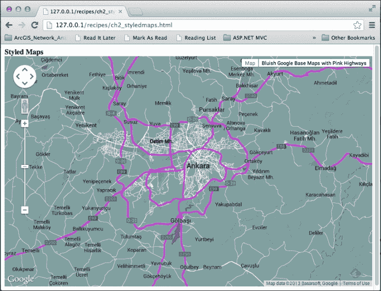

## 它是如何工作的...

首先，让我们看看由一个或多个 `google.maps.MapTypeStyle` 对象组成的 `bluishStyle` 数组，这些对象按照以下代码所示排列：

```js
var bluishStyle = [
  {
    featureType: '',
    elementType: '',
    stylers: [
      {hue: ''},
      {saturation: ''},
      {lightness: ''},
            ...
    ]
  },
  {
    featureType: '',
        ...
  }
]
```

在此数组中，您可以包括针对不同地图特征及其相应元素（如几何形状、标签等）的几种样式（所有这些都在 `google.maps.MapTypeStyleElementType` 中指定）。

地图特征包括在基础地图中找到的地理表示类型。行政区域、景观特征、兴趣点、道路和水体是地图特征的例子。

除了这些地图特征的通用定义之外，Google Maps JavaScript API 允许您指定这些特征的子类型。例如，您可能希望通过给它们指定 `featureType` 属性来更改特定 `poi` 类型的默认样式，如下所示：

```js
featureType: 'poi.school'
```

或者，您可以对景观地图功能进行更具体的说明：

```js
featureType: 'landscape.man_made'
```

### 小贴士

**关于 google.maps.MapTypeStyleFeatureType 对象的更多信息**

`MapTypeStyleFeatureType` 对象的完整列表可以在[`developers.google.com/maps/documentation/javascript/reference#MapTypeStyleFeatureType`](https://developers.google.com/maps/documentation/javascript/reference#MapTypeStyleFeatureType)找到。

请注意，我们的 `bluishstyle` 数组的第一个元素不包含任何 `featureType` 属性，这使得样式选项对整个基础地图有效，如下面的代码所示：

```js
{
    stylers: [
        { hue: "#009999" },
        { saturation: -5 },
        { lightness: -40 }
    ]
}
```

除了 `google.maps.MapTypeStyleFeatureType` 及其常量之外，您还可以详细说明其地图的每个功能，例如几何形状、几何形状的描边和填充、标签、标签文本（也包括文本填充和描边）以及标签图标。利用这个机会，您可以为与相关图标不同的设置中的道路几何形状进行样式设计。

在我们的配方中，我们已禁用了所有道路标签文本的可见性，没有触及它们的几何形状或标签图标，如下面的代码所示：

```js
{
     featureType: "road",
     elementType: "labels.text",
     stylers: [
        { visibility: "off" }
     ]
}
```

### 小贴士

**关于 google.maps.MapTypeStyleElementType 对象的更多信息**

`MapTypeStyleElementType` 对象的完整列表可以在[`developers.google.com/maps/documentation/javascript/reference#MapTypeStyleElementType`](https://developers.google.com/maps/documentation/javascript/reference#MapTypeStyleElementType)找到。

对于每个特征类型及其元素类型，您可以指定一个 `google.maps.MapTypeStyler` 对象，该对象覆盖了 `hue`、`lightness`、`saturation`、`gamma`、`inverse_lightness`、`visibility` 和 `weight` 作为数组。在我们的配方中，使高速公路道路以粉色出现的样式选项如下：

```js
{
    featureType: "road.highway",
    elementType: "geometry.fill",
    stylers: [
        { color: "#FF00FF" },
        {weight: 2}
    ]
}
```

在这里，`stylers` 数组中的 `color` 选项是一个粉色调的 RGB Hex 字符串，而 `weight` 定义了该特征在像素中的权重。

### 小贴士

**关于 google.maps.MapTypeStyler 对象的更多信息**

`MapTypeStyler` 对象的完整规范列表可以在[`developers.google.com/maps/documentation/javascript/reference#MapTypeStyler`](https://developers.google.com/maps/documentation/javascript/reference#MapTypeStyler)找到。

在我们的 `initMap()` 函数中定义 `style` 数组后，我们创建了一个 `StyledMapType` 对象：

```js
var bluishStyledMap = new google.maps.StyledMapType(bluishStyle,
    {name: "Bluish Google Base Maps with Pink Highways"});
```

此对象接受两个参数——第一个是 `style` 数组，第二个是 `google.maps.StyledMapTypeOptions` 对象。在这里，我们只包括了 `name` 属性；然而，您还可以包括 `maxZoom` 和 `minZoom` 属性，在这些属性之间将显示 `StyledMapType` 对象。在本配方截图中，您可以看到我们分配给 `name` 属性的值在界面中显示。

在我们创建了 `StyledMapType` 对象后，我们添加了一个额外的对象，称为 `mapTypeControlOptions`，它接受 `mapOptions` 对象中的 `mapTypeIds` 数组，替换了 `mapTypeId` 属性：

```js
var mapOptions = {
    center: new google.maps.LatLng(39.9078, 32.8252),
    zoom: 10,
    mapTypeControlOptions: {mapTypeIds: 
        [google.maps.MapTypeId.ROADMAP, 'new_bluish_style']}
};
```

这使我们能够除了标准的 `ROADMAP` 地图类型外，添加多种样式。

接下来是步骤，将我们在 `mapTypeIds` 数组中指定的 `mapTypeId ('new_bluish_style')` 属性与 `StyledMapType` 对象（`bluishStyledMap`）链接：

```js
map.mapTypes.set('new_bluish_style', bluishStyledMap);
```

在将 `mapTypeId` 属性与 `StyledMapType` 对象链接后，我们可以使用以下代码行结束，以便地图界面以我们意图的样式打开基础地图：

```js
map.setMapTypeId('new_bluish_style');
```

在我们的配方中，我们介绍了如何根据我们的喜好来样式化基础地图。我们使用了 `google.maps.MapTypeStyle` 对象来选择特征类型（`google.maps.MapTypeStyleFeatureType`）和相关元素（`google.maps.MapTypeStyleElementType`），并使用 `google.maps.MapTypeStyler` 对象来样式化它们。然后，我们将我们的 `StyledMapType` 对象添加到地图中，展示了我们对谷歌地图基础地图的自定义样式。

## 还有更多...

使用 `StyledMapType` 对象只是处理 Google Maps Javascript API 中用户定义的样式化基础地图的多种方法之一。

另一种更简单的用法是在 `mapOptions` 对象的 `styles` 属性中指定 `style` 数组：

```js
var mapOptions = {
    center: new google.maps.LatLng(39.9078, 32.8252),
    zoom: 10,
    mapTypeId: google.maps.MapTypeId.ROADMAP,
    styles: bluishStyle
};
```

另一种选择是在定义我们的 `mapOptions` 对象后，可以使用以下代码稍后添加 `styles` 属性：

```js
map.setOptions({styles: bluishStyle });
```

使用 `StyledMapType` 对象与 `mapOptions` 对象的 `style` 属性之间存在一个重要的区别。使用 `StyledMapType` 对象使我们能够定义许多（实际上无限）样式作为地图类型。此外，这些地图类型可以在地图界面的地图类型控制中看到，因此用户很容易在地图类型之间切换。

然而，如果样式是通过`mapOptions`对象的`style`属性附加到地图上的，用户将无法更改多个样式。实际上，在地图类型控制中，将有一个选项供您选择新的样式，因为样式没有附加到`StyledMapType`对象上，因此不能被识别为地图类型。

### 注意

您可以在[`gmaps-samples-v3.googlecode.com/svn/trunk/styledmaps/wizard/index.html`](http://gmaps-samples-v3.googlecode.com/svn/trunk/styledmaps/wizard/index.html)上获取有关如何使用样式地图向导的信息。

准备`style`数组是一项包含许多制图细节的工作。在样式化器中找到每个特征和元素类型的正确组合将花费太多时间，尤其是在只有通过文本编辑器进行编辑的情况下。谷歌通过创建样式地图向导来简化这项耗时的工作，做得非常出色。它允许您在界面中执行所有样式化任务，因此您可以实时查看您正在更改的内容。完成工作后，您可以导出您的样式作为 JSON，以便在您的应用程序中用作`style`数组。

# 使用不同的瓦片源作为基本地图

谷歌基本地图显示大量内容（本地 POI 信息、道路等级、驾驶方向等）和大量的样式调色板。此外，它在其 JavaScript API 中提供了更改基本地图样式的工具。

此外，您还可以在谷歌地图界面中将其他地图瓦片源显示为基本地图。此功能使您能够在谷歌地图界面中显示您的瓦片地图，利用大多数谷歌地图 JavaScript API 的工具。

在这个菜谱中，我们将通过使用 JavaScript API 在谷歌地图界面中显示 OpenStreetMap 瓦片作为基本地图来操作。

## 准备工作

我们可以继续从第一章的*在自定义 DIV 元素中创建简单地图*菜谱，因为我们不需要重复介绍将地图显示在屏幕上的基础知识。

## 如何操作…

通过这个菜谱，您将在完成给定的步骤后看到 OpenStreetMap 瓦片覆盖在谷歌地图瓦片之上：

1.  在您的`initMap()`函数中，使用以下代码创建一个`ImageMapType`对象：

    ```js
    var osmMapType = new google.maps.ImageMapType({
        getTileUrl: function(coord, zoom) {
            return "http://tile.openstreetmap.org/" + zoom + 
            "/" + coord.x + "/" + coord.y + ".png";
        },
        tileSize: new google.maps.Size(256, 256),
        name: "OpenStreetMap",
        maxZoom: 18
    });
    ```

1.  将具有`mapTypeIds`属性的`google.maps.mapTypeControlOptions`对象添加到您的原始`google.maps.MapTypeId`对象和`ImageMapType`对象中：

    ```js
    var mapOptions = {
        center: new google.maps.LatLng(39.9078, 32.8252),
        zoom: 10,
        {mapTypeIds: [google.maps.MapTypeId.ROADMAP,  
        'OSM']}
    };
    ```

1.  将新的`mapTypeId`数组关联到您的`ImageMapType`对象：

    ```js
    map.mapTypes.set('OSM', osmMapType);
    ```

1.  最后，设置这个新的`google.maps.mapTypeId`对象以显示：

    ```js
    map.setMapTypeId('OSM');
    ```

1.  您可以在以下屏幕截图中看到 OpenStreetMap 瓦片覆盖在谷歌基本地图瓦片之上：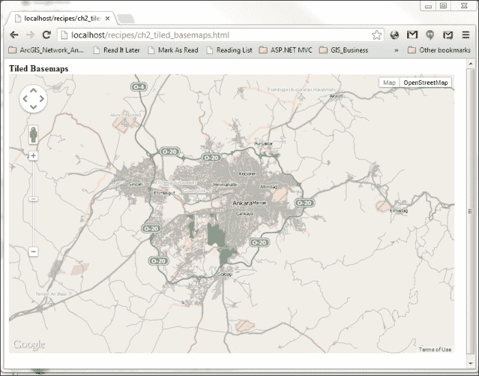

## 它是如何工作的...

你可能已经观察到，*Google 基础地图样式* 配方的代码摘录结构与这个配方几乎没有区别。在前者中，我们使用了 `StyledMapType` 对象来更改原始基础地图的样式，而在这个配方中，我们使用了 `ImageMapType` 对象。

这是因为 `StyledMapType` 和 `ImageMapType` 对象都是 `MapType` 对象（`google.maps.MapType`）的特殊类型，除了在上一章中介绍的原生基础地图类型，如路线图、卫星图、混合图和地形图。

让我们一步一步来：

```js
var osmMapType = new google.maps.ImageMapType({
    getTileUrl: function(coord, zoom) {
        return "http://tile.openstreetmap.org/" + zoom + "/" + 
        coord.x + "/" + coord.y + ".png";
     },
    tileSize: new google.maps.Size(256, 256),
    name: "OpenStreetMap",
    maxZoom: 18
});
```

这部分配方创建了一个 `osmMapType` 对象，它是 `ImageMapType` 类型。要创建一个 `ImageMapType` 对象，我们必须提供两个必需的属性：`getTileUrl` 和 `tileSize`。

在填写这两个参数之前，我们必须确保我们有一个可以使用的瓦片地图服务。OpenStreetMap ([`www.openstreetmap.org/`](http://www.openstreetmap.org/)) 是一种地图服务，它是由全球社区的努力建立和存在的。

瓦片地图服务以这种方式组织，即对于每个预定的缩放级别，将地图图像分割成部分（瓦片）。这些瓦片应位于 x 和 y 轴旁边，以便瓦片地图服务消费者（如 Google Maps API）可以识别它们在以下图中所示的位置：

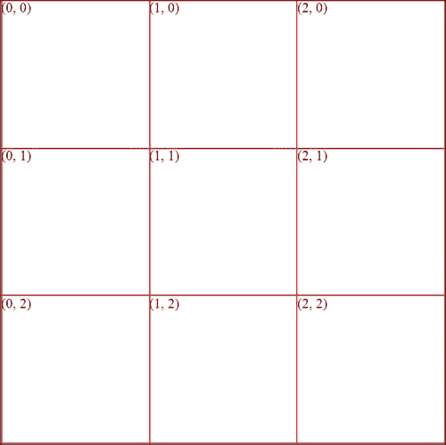

左上角的瓦片坐标是 (0,0)，它被称为原点瓦片。在 Google Maps 中，原点位于地图界面的左上角（西北角）。

记住，对于 `getTileUrl` 属性，我们提供了一个具有两个参数的函数：`coord` 和 `zoom`：

```js
getTileUrl: function(coord, zoom) {
    return "http://tile.openstreetmap.org/" + zoom + "/" + 
    coord.x + "/" + coord.y + ".png";
}
```

`coord` 参数正是前面截图中所介绍的瓦片坐标值所对应的坐标对。换句话说，在左上角，`coord.x` 应该是 0，而 `coord.y` 应该是 0。

假设我们处于缩放级别 0，我们可以尝试从为 `getTileUrl` 属性提供的 Openstreetmap URL 中获取一个瓦片：

```js
"http://tile.openstreetmap.org/" + zoom + "/" + coord.x + "/" + 
coord.y + ".png"
```

这将给出以下输出：

```js
"http://tile.openstreetmap.org/0/0/0.png"
```

如果你将此 URL 复制到浏览器的地址栏，你将得到以下截图所示的输出：

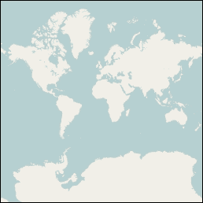

这张图像是 Openstreetmap 在缩放级别 0 的单个瓦片。理解到单个 OpenStreetMap 瓦片在缩放级别 0 时覆盖整个世界。

现在，让我们继续缩放级别 1：

[`tile.openstreetmap.org/1/0/0.png`](http://tile.openstreetmap.org/1/0/0.png)

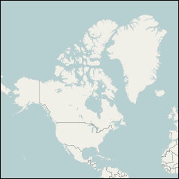

你可能已经注意到，随着缩放级别从 0 增加到 1，细节级别有所提高。此外，每个瓦片的覆盖区域已经大幅减少（在这个例子中是四分之一）。

你可以在以下截图中看到缩放级别 1 的完整瓦片布局：

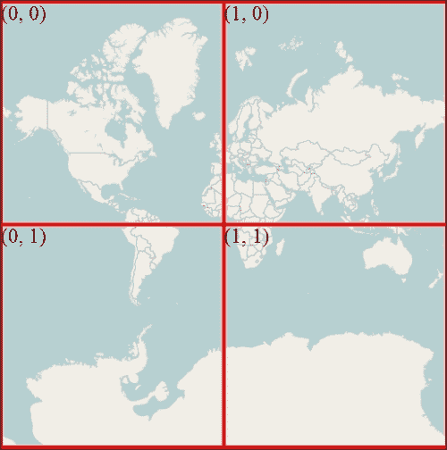

瓦片地图服务的一个重要特性是，在每一个缩放级别，前一个缩放级别的每个瓦片都会再次瓦片化，以拥有当前缩放级别所需的细节级别。

返回到我们的 `osmMapType` 创建，`getTileUrl` 属性的函数用于放置外部源（在我们的菜谱中是 OpenStreetMap）的瓦片。名为 `coord` 和 `zoom` 的两个参数由 Google Maps API 本身处理。API 检测地图的边界框并为每个缩放级别构建瓦片布局。因此，API 识别出在哪个缩放级别应该请求哪个瓦片坐标。剩下要做的就是向您提供外部瓦片地图源瓦片的 URL，这正是您在 `getTileUrl` 属性中所做的。

第二个属性是 `tileSize` 属性，它接受一个 `google.maps.Size` 对象。正如其名称所暗示的，该属性以像素值定义了每个瓦片的宽度和高度。Google Maps 的瓦片布局为 256 像素乘以 256 像素的瓦片；因此我们提供 `google.maps.Size(256,256)`，其中第一个参数代表宽度，第二个参数代表高度。

`maxZoom` 属性设置了瓦片地图服务的最大显示缩放级别。在此菜谱中，由于 `maxZoom` 设置为 `18`，外部基础地图在缩放级别 19 时将不会显示。

`name` 属性用于设置瓦片地图服务的名称。它直接显示在地图界面右上角的 `mapTypeControl` 对象中。

最后两行与上一菜谱中的相同；第一行与 `mapOptions` 属性中 `mapTypeControlOptions` 指定的 `mapTypeID` 对象设置为 `OSM` 的 `ImageMapType` 对象的 `osmMapType` 相关：

```js
map.mapTypes.set('OSM', osmMapType);
map.setMapTypeId('OSM');
```

## 参见

在接下来的章节中，将涵盖与投影细节相结合的瓦片坐标、像素坐标和世界坐标的详细解释。

此外，下一菜谱将涵盖将瓦片地图服务作为基础地图的叠加层使用。

# 向地图添加瓦片叠加

Google Maps 提供了一系列基础地图，包括街道地图和卫星图像，我们已在上一章中讨论过；现在我们将讨论如何将额外的基础地图引入 Google Maps 界面。

我们还可以将瓦片地图服务用作基础地图的叠加层。通过叠加，你可以想象在基础地图上放置一张单独的地图瓦片。你可以观察叠加层的细节以及基础地图。叠加层的例子可能包括感兴趣区域的边界、在 Google Maps 基础地图中找不到的特殊 POI、以空中或点样式展示的统计结果等等。

作为基础地图使用的瓦片地图服务在技术上可以用作叠加层在 Google Maps JavaScript API 中。然而，使用这些瓦片地图服务（如 OpenStreetMaps）作为叠加层会导致阻塞 Google Maps 的原有基础地图，因为叠加的瓦片地图服务（原本旨在作为基础地图）的地图上不会有空白空间。这是因为 Google Maps 的基础地图和叠加的瓦片地图服务都被设计成基础地图。因此，不建议使用旨在作为基础地图的另一个瓦片地图服务作为 Google Maps 基础地图上的叠加层。

在这个菜谱中，我们将介绍如何在 Google Maps 界面中使用 JavaScript API 将 OpenStreetMap 瓦片显示为叠加层。

## 准备工作

我们可以使用前一个菜谱的代码，并对其进行一些修改，以便消除重写`osmMapType`对象细节的需要。

## 如何做到这一点...

在这个菜谱中，如果您按照给定的步骤操作，您将看到 OpenStreetMap 瓦片作为叠加层：

1.  在您的`initMap()`函数中，将`osmMapType`对象保持原样：

    ```js
    var osmMapType = new google.maps.ImageMapType({
        getTileUrl: function(coord, zoom) {
            return "http://tile.openstreetmap.org/" + 
            zoom + "/" + coord.x + "/" + coord.y + ".png";
        },
        tileSize: new google.maps.Size(256, 256),
        name: "OpenStreetMap",
        maxZoom: 18
    });
    ```

1.  在您的`mapOptions`对象中更改具有`mapTypeIds`的`google.maps.MapTypeId.ROADMAP`和`google.maps.MapTypeId.SATELLITE`的`google.maps.mapTypeControlOptions`对象：

    ```js
    var mapOptions = {
        center: new google.maps.LatLng(39.9078, 32.8252),
        zoom: 10,
        mapTypeControlOptions:
            {mapTypeIds: [google.maps.MapTypeId.ROADMAP, 
            google.maps.MapTypeId.SATELLITE]}
    };
    ```

1.  删除以下代码行（因为在上一个步骤中没有指定其他基础地图）：

    ```js
    map.mapTypes.set('OSM', osmMapType);
    ```

1.  将`ROADMAP`地图类型设置为要显示的基础地图：

    ```js
    map.setMapTypeId(google.maps.MapTypeId.ROADMAP);
    ```

1.  在基础地图上叠加`osmMapType`地图类型：

    ```js
    map.overlayMapTypes.insertAt(0, osmMapType);
    ```

    

1.  您现在已经有了 OpenStreetMap 瓦片作为叠加层，如图中所示的前一个屏幕截图。

## 它是如何工作的...

如您可能已经注意到的，前一个菜谱和这个菜谱之间几乎没有区别。我们使用了相同的自定义`osmMapType`对象，即`google.maps.imageMapType`。我们使用了另一个瓦片地图服务，但结构保持不变。

修改从`mapOptions`对象的`mapTypeControlOptions`属性中使用的`mapTypes`对象开始：

```js
mapTypeControlOptions:
{mapTypeIds: [google.maps.MapTypeId.ROADMAP, google.maps.MapTypeId.SATELLITE]}
```

我们已经包括了`ROADMAP`和`SATELLITE`地图类型，以便作为基础地图进行选择。

第 3 步很重要；我们删除以下行：

```js
map.mapTypes.set('OSM', osmMapType);
```

我们正在删除它，因为我们不希望`osmMapType`对象被视为基础地图。我们只将其用作叠加。

在下一个步骤中，我们正在选择默认的基础地图为`ROADMAP`。您可以更改`SATELLITE`的代码行，或者您可以从地图界面中的`mapTypeControl`对象进行切换。

最后一行是我们叠加操作发生的行：

```js
map.overlayMapTypes.insertAt(0, osmMapType);
```

在这里，`overlayMapTypes`属性是一个数组（`google.maps.MVCArray`）。`MVCArray`的`insertAt`方法在指定的索引处插入对象，并且我们在索引 0 处插入了我们的`imageMapType`对象。

### 小贴士

**关于 google.maps.MVCArray 的更多内容**

`google.maps.MVCArray` 数组是 Google 对普通 JavaScript 数组的实现。您可以从一个数组中构建一个 MVC 数组。更多详细信息可以在[`developers.google.com/maps/documentation/javascript/reference#MVCArray`](https://developers.google.com/maps/documentation/javascript/reference#MVCArray)找到。

您可以在 Google 地图基础地图上拥有多个叠加层。您必须使用 `overlayMapTypes` 属性通过 `insertAt` 方法的第一个参数设置叠加地图的关联顺序，如下所示：

```js
map.overlayMapTypes.insertAt(1, anotherMapType1);
map.overlayMapTypes.insertAt(2, anotherMapType2);
```

## 还有更多...

叠加层放置在基础地图之上，打开和关闭它们以查看基础地图是一个好习惯。如果您需要关闭叠加层，需要包含以下代码：

```js
map.overlayMapTypes.setAt(0, null);
```

这使得叠加层从地图界面消失，但请记住，`overlayMapTypes` 数组中的槽位已经被 `insertAt` 方法分配。因此，如果您想给用户提供切换叠加层打开和关闭的机会（通过复选框等方式），您可以遵循以下步骤（在继续之前复制您当前菜谱的代码）： 

1.  在您的 HTML 代码的 `<body>` 标签中添加一个复选框：

    ```js
    <input type="checkbox" id="OSM" class="overlayMaps" onclick="toggleOverlayMaps()" />
    <label 
        for="OSM">OpenStreetMap Layer</label>
    ```

1.  在 `initMap()` 函数外部将 `osmMaptype` 设为全局变量：

    ```js
       var osmMapType;
    ```

1.  将 `initMap()` 函数中的 `osmMapType` 声明更改为分配新的全局变量：

    ```js
    osmMapType = new google.maps.ImageMapType({
        getTileUrl: function(coord, zoom) {
            return "http://tile.openstreetmap.org/" + zoom + 
            "/" + coord.x + "/" + coord.y + ".png";
        },
        tileSize: new google.maps.Size(256, 256),
        name: "OpenStreetMap",
        maxZoom: 18
    });
    ```

1.  将 `insertAt` 方法替换为 `pull(null)` 方法：

    ```js
    map.overlayMapTypes.push(null);
    ```

1.  添加叠加层切换功能：

    ```js
    function toggleOverlayMaps() {
        var OSMLayer = document.getElementById("OSM");
        if (OSMLayer.checked)
        {
            map.overlayMapTypes.setAt(0, osmMapType);
        }
        else
        {
            map.overlayMapTypes.setAt(0, null);
        }
    }
    ```

1.  上述代码片段的主要技巧是首先在 `initMap()` 函数的 `overlayMapTypes` 数组中打开一个空间。之后，您可以调用 `setAt()` 方法来打开或关闭叠加层。

# 向地图添加图像叠加

叠加瓦片地图服务是一个强大的功能。它通过 Google Maps API 使各种瓦片地图服务进入场景。现有的瓦片地图服务通常是全球地图服务，这意味着它们覆盖整个世界或至少某些大陆/国家。

例如，我们可能对叠加一个大学校园的地图感兴趣，手头有该校园的大致规划。或者，我们可能找到了一些历史地图，并希望利用它。或者，我们可能有一个特定建筑的内部建筑规划，并希望在 Google 地图上查看这个建筑规划。

是否可以在 Google 地图上叠加这些微尺度图像？当然可以！实际上，在技术上，使用校园规划或建筑规划而不是瓦片地图服务作为叠加层，两者之间没有区别。需要注意的是，这些规划图应该与基础地图上的瓦片地图服务对齐。

在这个菜谱中，我们不会详细介绍准备瓦片的过程，而是通过 Google Maps JavaScript API 来使用它们。为了方便，我们将使用 2010 年 Google I/O 在旧金山 Moscone 中心的场地规划。

### 注意

有工具可以准备图像瓦片，这些瓦片可以用作叠加层。最突出的是 MapTiler ([www.maptiler.org](http://www.maptiler.org)) 和 GDAL2Tiles ([`www.klokan.cz/projects/gdal2tiles/`](http://www.klokan.cz/projects/gdal2tiles/))。使用这些工具，您可以为您选择的缩放级别对图像进行地理参照、正射和瓦片化。

## 准备工作

我们可以使用 *使用不同的瓦片源作为基础地图* 菜谱中的代码，因为需要的修改很少。

## 如何做到这一点…

如果您遵循以下步骤，您将在 Google Maps 基础地图上有一个叠加层——一座建筑：

1.  插入一个 `bounds` 对象：

    ```js
    var bounds = {
        17: [[20969, 20970], [50657, 50658]],
        18: [[41939, 41940], [101315, 101317]],
        19: [[83878, 83881], [202631, 202634]],
        20: [[167757, 167763], [405263, 405269]]
    };
    ```

1.  将 `osmMapType` 对象替换为 `buildPlanMapType` 对象：

    ```js
    var buildPlanMapType = new google.maps.ImageMapType({
        getTileUrl: function(coord, zoom) {
            if (zoom < 17 || zoom > 20 ||
                bounds[zoom][0][0] > coord.x ||
                coord.x > bounds[zoom][0][1] ||
                bounds[zoom][1][0] > coord.y ||
                coord.y > bounds[zoom][1][1]) {
                    return null;
            }
            return ['http://www.gstatic.com/io2010maps/tiles/5/L2_', zoom, '_', coord.x, '_', coord.y, '.png'].join('');
        },
        tileSize: new google.maps.Size(256, 256),
        name: "Google IO Building Plan",
        maxZoom: 20
    });
    ```

1.  将最后一行更改为：

    ```js
    map.overlayMapTypes.insertAt(0, buildPlanMapType);
    ```

1.  将地图中心定位在 Moscone Center：

    ```js
    map.setCenter(new google.maps.LatLng(37.78320, -122.40421));
    ```

    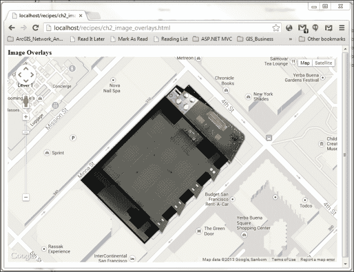

您可以在先前的屏幕截图中看到，在 Google Maps 基础地图上叠加了作为图像提供的建筑平面图，该图像按瓦片组织。

## 如何工作…

您可能已经注意到，主要结构与先前的菜谱相同。首先，您定义一个 `google.maps.ImageMapType` 对象，然后使用 `map` 对象的 `overlayMapTypes.insertAt` 数组将其叠加在基础地图上。

在这个菜谱中引入的唯一更改是由于示例建筑计划的边界（边界框）。在先前的菜谱中，叠加瓦片地图服务的边界是全球的，而在这个菜谱中，我们将其限制在建筑上，相当于在一个更高的比例尺上。

因此，我们包括了定义每个缩放级别边界的 `bounds` 对象。我们将缩放级别限制在 17 到 20 之间，因为较低的缩放级别（<17）不会以合理的方式显示建筑。在缩放级别 16 和 15 中，建筑将只是一个小的矩形，并且它不会在低于 14 的缩放级别中显示。

在 `bounds` 对象的每个缩放级别属性中，我们都有一个 x 和 y 瓦片坐标的数组，x 是第一个，y 是第二个。在这些数组内部，可以找到瓦片坐标的下限和上限。

在这一点上，您可能想知道这些特定数字是如何找到的：

```js
var bounds = {
var bounds = {
    17: [[20969, 20970], [50657, 50658]],
     ...
}
```

这些数字实际上是与以下截图所示的 Moscone Center 边界相交的瓦片坐标：

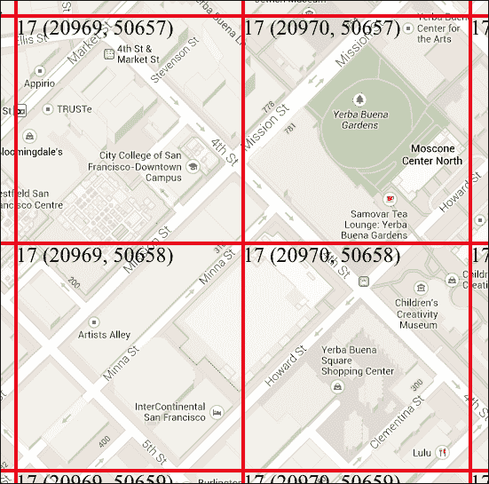

您可以观察到在第 17 个缩放级别中，x 坐标必须在 20969 和 20970 之间，y 坐标必须在 50657 和 50658 之间，以实现我们的图像叠加。

`bounds` 对象用于在 `buildPlanMapType` 对象的 `getTileUrl` 函数定义中创建限制特定缩放级别的约束，以便获取瓦片。`getTileUrl` 属性的函数会检查每个瓦片坐标与 `bounds` 对象的项目，这样 API 就不会尝试获取与建筑计划边界不交叉的瓦片。

# 改变叠加层的透明度

Google Maps JavaScript API 支持第三方瓦片地图服务或图像叠加在基础地图之上。然而，覆盖层存在一个问题；它们叠加在基础地图之上，使其变得不可见。当然，你可以根据你的选择打开或关闭它们；然而，如果你想要同时看到基础地图和覆盖层，这并不是一个解决方案。

实际上，你只需修改覆盖层的透明度，就可以看到基础地图和覆盖层。

本食谱专注于更改最后两个食谱中引入的覆盖层的透明度。

## 准备工作

我们可以使用本章“向地图添加瓦片覆盖”食谱中引入的代码，稍作修改以实现所需的结果。请务必首先复制食谱中的代码。

## 如何操作…

完成以下代码中展示的单步操作后，你将能够使你的覆盖层变得透明：

1.  只需更改`osmMapType`对象：

    ```js
    var osmMapType = new google.maps.ImageMapType({
        getTileUrl: function(coord, zoom) {
            return "http://tile.openstreetmap.org/" + zoom + 
            "/" +coord.x + "/" + coord.y + ".png";},
        tileSize: new google.maps.Size(256, 256),
        name: "OpenStreetMap",
        maxZoom: 18,
        opacity:0.6
    });
    ```

1.  你可以调整你的覆盖层透明度，如以下截图所示：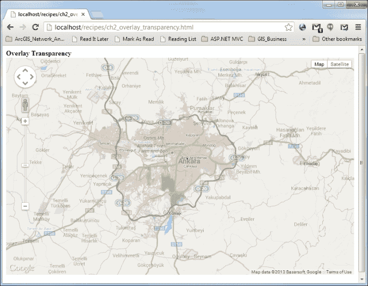

## 它是如何工作的...

改变覆盖层的透明度非常简单。将以下代码添加到`imageMapType`对象中即可完成任务：

```js
opacity:0.6
```

`imageMapType`对象的透明度属性根据提供的值使传入的瓦片透明。透明度属性的值必须在 1 和 0 之间，其中 1.0 表示完全不透明的覆盖层，而 0 表示完全不透明的覆盖层。

# 创建热力图

Google Maps API 为包括热力图在内的基于地图的分析奠定了基础。热力图是一种通过渐变颜色刻度显示点浓度的可视化形式。

在这方面，点可能是任何地理上表示的项目（如医院、房屋、学校）、带有坐标的海污染测量值、垃圾收集箱的位置等等的表示。这个列表实际上几乎是无限的。

热力图是地理统计学非常重要的输入。在地图显示中，你捕捉到的是某一时刻的强度，与仅显示点位置的情况相比：

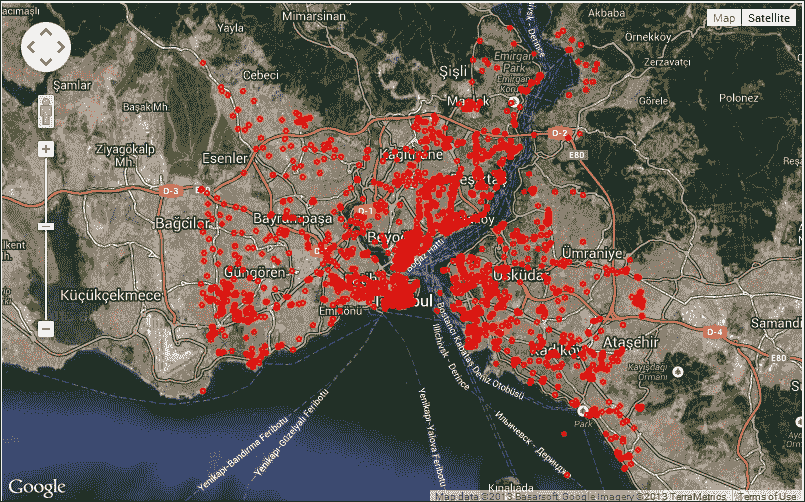

上述截图展示了截至 7 月的土耳其伊斯坦布尔的 OpenStreetMap 点层位置。你可能只是从上述截图中得到关于点浓度的一个大致概念，但以下截图显示了更清晰的情况。最密集的地点用红色标出，而浓度较低的地点用黄色标出。而且，正如你可能已经猜到的，绿色标出的地点是浓度最低的。

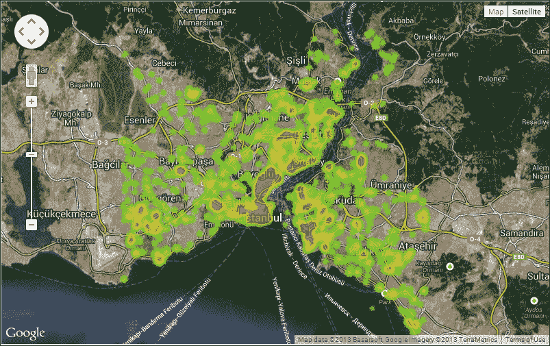

在这个食谱中，我们将使用 Google Maps JavaScript API 从一组点创建热力图。值得注意的是，这个功能在标准的 Google Maps API 中不可用；你需要将可视化库加载到 API 中，如本食谱所示。

## 准备工作

我们可以使用第一章的第一部分，*Google Maps JavaScript API 基础*，作为基础，因为我们不需要重复编写地图显示的代码。请记住，在编辑此食谱之前，从原始食谱中复制代码。

## 如何操作…

如果你遵循给定的步骤，你将使用你使用的点集创建热力图覆盖层：

1.  在引用 Google Maps API 的地方引用`visualization`库：

    ```js
        <script type="text/javascript"
            src="img/js? sensor=false&libraries=visualization">
        </script>
    ```

1.  在包含我们的 HTML 文件的同一目录下打开一个新的文本文件，并将其命名为`ch2_heatMapPoints.js`。

1.  在上一步骤中创建的新的 JavaScript 文件中创建一个`google.maps.LatLng`对象的数组（完整的数组由 217 个对象组成，你可以从下载的代码中获得）：

    ```js
    var heatmapPoints = [
    new google.maps.LatLng(41.0182827999113,28.973224999734),
    new google.maps.LatLng(41.0150707003526,28.9764445996386),
    new google.maps.LatLng(41.01140130003,28.9831846001892),
    new google.maps.LatLng(41.0148609002104,28.9764469999292),
    new google.maps.LatLng(41.0149687001455,28.9764550002981),
    new google.maps.LatLng(41.0148247996249,28.9757389996552),
    new google.maps.LatLng(41.0020956002318,28.9736237995987),
    ];
    ```

1.  在你的 HTML 代码中引用`ch2_heatMapPoints.js`文件：

    ```js
        <script type="text/javascript" src="img/ch2_heatMapPoints.js"></script>
    ```

1.  创建热力图层：

    ```js
        var heatmap = new google.maps.visualization.HeatmapLayer({
            data: heatmapPoints
        });
    ```

1.  将热力图层添加到地图：

    ```js
        heatmap.setMap(map);
    ```

1.  现在你应该已经从你的点集中创建出了热力图覆盖层，如下面的截图所示：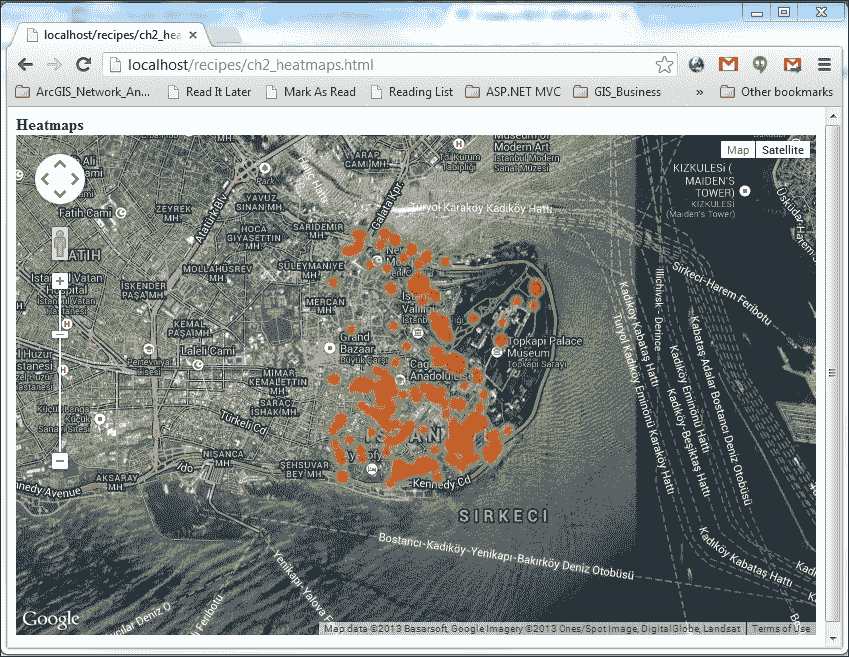

## 它是如何工作的...

首先，在 Google Maps JavaScript API 中创建热力图层需要将 API 的`visualization`库添加到引用 Google Maps JavaScript API 的部分：

```js
    &libraries=visualization
```

通过这个添加，你可以使用`google.maps.visualization.HeatmapLayer`对象来创建热力图层。

`google.maps.visualization.HeatmapLayer`对象需要一个 JavaScript 数组或`google.maps.MVCArray`对象（一个数组），其中其元素是`google.maps.LatLng`对象：

```js
    var heatmap = new google.maps.visualization.HeatmapLayer({
        data: heatmapPoints
    });
```

使用经纬度坐标对构造`google.maps.LatLng`对象，以提及一个点：

```js
    new google.maps.LatLng(41.0182827999113,28.973224999734)
```

我们在另一个 JavaScript 文件中创建了包含 217 个点的数组对象及其内容，因为它们在我们的原始 HTML 文件中会占用太多空间。此外，将我们的数据和相关的对象放在另一个文件中是一种良好的实践，以避免潜在的架构问题。

最后，我们可以使用以下代码将我们的热力图层添加到当前地图中：

```js
    heatmap.setMap(map);
```

正如你可以切换之前食谱中引入的覆盖层一样，你也可以使用以下方法切换热力图层：

```js
    heatmap.setMap(null);
```

## 更多内容...

热力图是由一组点创建的，这些点可以位于不同的地方，也可以位于相同的地方。换句话说，多个`google.maps.LatLng`对象可以放置在同一个地方。以下代码是一个示例：

```js
    new google.maps.LatLng(41.0182827999113,28.973224999734),
    new google.maps.LatLng(41.0182827999113,28.973224999734),
    new google.maps.LatLng(41.0182827999113,28.973224999734)
```

这将增加这个点的强度；它很可能会在热力图中以红色显示。

但如果共享相同坐标对的 `google.maps.LatLng` 对象实例增加呢？一种方法是复制前面代码中显示的行。然而，还有一种更智能的方法：

```js
    {location: new  
        google.maps.LatLng41.0182827999113,28.973224999734), 
        weight: 3
    },
```

此对象是 `google.maps.visualization.WeightedLocation`，它接受两个属性：一个是 `google.maps.LatLng` 对象，另一个是 `weight`。此 `weight` 参数接受任何表示点发生次数的数值。

默认情况下，`LatLng` 对象本身具有权重 1。因此，具有 `weight` 属性设置为 `3` 的 `WeightedLocation` 对象等同于具有相同的 `LatLng` 对象。

可以在为热力图层的 `data` 属性提供的数组中一起使用 `WeightedLocation` 和 `LatLng` 对象。

热力图层对象具有包括 `gradient`、`radius`、`opacity`、`maxIntensity` 和 `dissipating` 在内的多种选项。

`gradient` 选项接受一个颜色数组：

```js
    var gradientScheme = [
        'rgba(0, 0, 255, 0)',
        'rgba(0, 60, 200, 1)',
        'rgba(0, 120, 120, 1)',
        'rgba(125, 125, 125, 0)',
        'rgba(125, 120, 60, 0)',
        'rgba(200, 60, 0, 0)',
        'rgba(255, 0, 0, 1)'
    ];
```

你可以通过向 `HeatmapLayer` 构造函数添加属性来设置渐变属性：

```js
    var heatmap = new google.maps.visualization.HeatmapLayer({
        data: heatmapPoints,
        gradient: gradientScheme
    });
```

或者，你可以稍后设置选项：

```js
    heatmap.setOptions({
        gradient: gradientScheme
    });
```

`dissipating` 选项用于调整显示不同缩放级别强度所需的像素数。其默认值为 `false`，这允许在缩放级别增加时每个点有更多的像素用于强度着色。

通过使用 `maxIntensity` 属性，你可以滚动热力图层：

```js
    heatmap.setOptions({
        maxIntensity: 2
    });
```

之前的代码使本食谱的输出呈绿色，因为强度增加了。在相同位置需要更多的点来使热力图看起来呈红色。

你可以调整 `radius` 属性来调整每个点的强度半径。单位是像素。

## 参见

你可以使用云端的 Fusion Tables 创建热力图，这将在本书的后续部分介绍。在浏览器或云端创建热力图各有优缺点；这将在本书的后续部分详细讨论。

关于 `LatLng` 对象及其用于创建点矢量覆盖的使用将在下一章中介绍。

# 添加交通层

在当今世界，交通状况是城市中非常重要的信息。如果路上发生事故或近期有施工阻碍了重要街道，这会影响你一整天。在地图上直接获取实时交通信息会有多有用？

Google Maps JavaScript API 具有一个非常实用的功能，允许你在基础地图上实时获取交通信息。

在本食谱中，我们将介绍如何在 Google Maps 上显示交通信息。

## 准备工作

我们可以使用 第一章 的第一个食谱，*Google Maps JavaScript API 基础*，作为基本地图显示的基础。在复制原始食谱的代码后，你可以继续前进。

## 如何实现...

下面是显示交通层的步骤：

1.  首先，将地图中心更改为提供交通层的服务位置（详细信息将在*如何工作...*部分中提供）。例如，对于西班牙巴塞罗那，使用以下值：

    ```js
        center: new google.maps.LatLng(41.3854, 2.1822),
    ```

1.  构建一个`TrafficLayer`对象：

    ```js
        var trafficLayer = new google.maps.TrafficLayer();
    ```

1.  将`TrafficLayer`对象添加到地图中：

    ```js
        trafficLayer.setMap(map);
    ```

1.  您可以在以下屏幕截图中看到根据实时交通状况密度着色的交通层：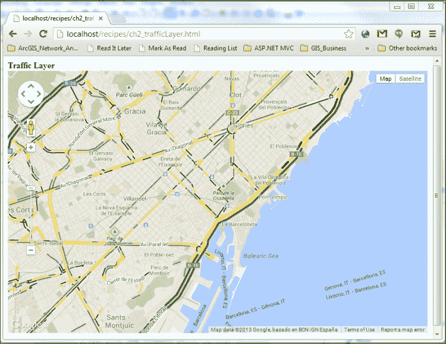

## 它是如何工作的...

在第一步中，您可能已经注意到我们切换到了西班牙巴塞罗那，因为在一些国家，交通层不可用。要查看具有交通层可用性的国家列表，您必须查看[`gmaps-samples.googlecode.com/svn/trunk/mapcoverage_filtered.html`](http://gmaps-samples.googlecode.com/svn/trunk/mapcoverage_filtered.html)上的电子表格。您可以通过筛选**交通**列来查看所有具有交通层的国家。

`TrafficLayer`对象的构建及其添加到地图中非常直接。在构建`TrafficLayer`对象的过程中不涉及任何属性。

您可以使用以下代码关闭`TrafficLayer`对象：

```js
        trafficLayer.setMap(null);
```

# 添加交通层

公共交通线路在城市中具有极其重要的地位，尤其是对于城市中的游客和外国人。将这些交通线路（公共汽车、地铁等）映射到几个城市的基图中是一项繁琐的任务，这正是 Google Maps JavaScript API 通过其特殊对象提供的。

在本菜谱中，我们将向 Google Maps 地图界面添加交通层。

## 准备工作

从上一个菜谱“添加交通层”继续，这将简化我们的工作，因为我们只需将`TrafficLayer`对象替换为`TransitLayer`类。请记住复制原始菜谱中的代码。

## 如何操作…

下面是显示公共交通线路作为叠加层的步骤：

1.  删除与`TrafficLayer`相关的行（最后两行）。

1.  不要使用`TrafficLayer`对象，而是使用`TransitLayer`对象：

    ```js
        var transitLayer = new google.maps.TransitLayer();
    ```

1.  将`TransitLayer`对象添加到地图中：

    ```js
        transitLayer.setMap(map);
    ```

1.  您可以在您偏好的区域看到 Google Maps 上的公共交通线路叠加，如下面的屏幕截图所示：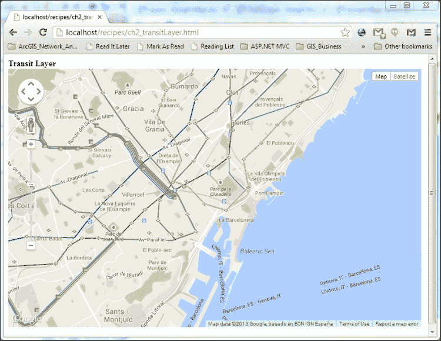

## 它是如何工作的...

交通层在世界某些城市的某些地区提供，您可以在[`www.google.com/intl/en/landing/transit/`](http://www.google.com/intl/en/landing/transit/)上找到这些城市的完整列表。

`TransitLayer`对象可以带来多种颜色的公共交通线路。颜色选择并非随机；它们是根据不同的交通线路运营商选择的。

`TransitLayer`对象的构建和显示与`TrafficLayer`对象相同。

# 添加自行车层

在基础地图上显示自行车路径和常用路线的信息是很有用的；Google Maps 提供此叠加层。

在本配方中，我们将介绍自行车图层及其在 Google Maps JavaScript API 中作为覆盖层的用法。

## 准备工作

从之前的配方*添加交通图层*继续，将简化我们的工作，因为我们只需将`TransitLayer`对象替换为`BicyclingLayer`类。请记住复制原始配方的代码。

## 如何操作…

显示自行车路径和路线所需的步骤如下所示：

1.  将包含`TransitLayer`的两行代码替换为包含`BicyclingLayer`对象的代码：

    ```js
        var bicyclingLayer = new google.maps.BicyclingLayer ();
        bicyclingLayer.setMap(map);
    ```

1.  您可以在以下屏幕截图中观察 Google Maps 基础地图上的自行车路径和路线：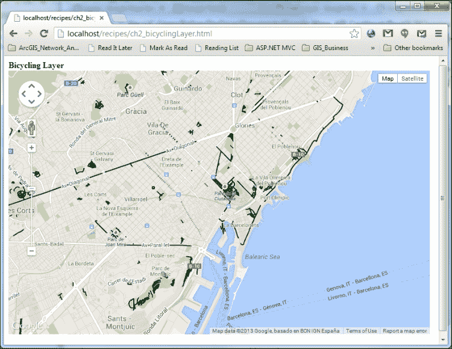

## 它是如何工作的…

自行车图层在其样式中有自己的细分；深绿色路线代表专门用于骑行的路径，而浅绿色路线代表有自行车道的街道。最后，虚线路线代表推荐使用但不是专门为自行车设计的路径和街道。

显示自行车图层的步骤与交通或交通图层完全相同，因此没有关于自行车图层具体细节的额外说明。

# 添加天气和云图层

温度和天气状况的信息与地图显示结合在一起，在电视上的天气预报中非常常见；Google 在其 API 中添加了一个功能，这样我们就可以在我们的地图中拥有这些信息。

在本配方中，我们将学习如何在基础地图上作为覆盖层显示与天气相关的信息。

## 准备工作

我们可以继续从第一章中的*在自定义 DIV 元素中创建简单地图*配方开始，因为对于基本地图显示我们不需要深入了解。

## 如何操作…

下面是显示您地图中相应温度和云状况的步骤：

1.  将天气库添加到 Google Maps JavaScript API 引用的末尾：

    ```js
        <script type="text/javascript"
         src="img/js? sensor=false&libraries=weather">
        </script>
    ```

1.  在`mapOptions`对象中更改地图的中心和缩放，以便我们可以使用相关的图层：

    ```js
        center: new google.maps.LatLng(38.0, 20.4),
        zoom: 5,
    ```

1.  构造一个名为`weatherLayer`的`google.maps.weatherLayer`对象实例：

    ```js
        var weatherLayer = new google.maps.weather.WeatherLayer
        ({
           temperatureUnits: 
           google.maps.weather.TemperatureUnit.CELCIUS
        });
    ```

1.  将`weatherLayer`添加到地图中：

    ```js
        weatherLayer.setMap(map);
    ```

1.  构造一个名为`cloudLayer`的`google.maps.weather.cloudLayer`实例：

    ```js
        var cloudLayer = new google.maps.weather.CloudLayer();
    ```

1.  将`cloudLayer`添加到地图中：

    ```js
        cloudLayer.setMap(map);
    ```

1.  您可以在以下屏幕截图中看到您的 Google Maps 应用程序中的相应温度和云状况：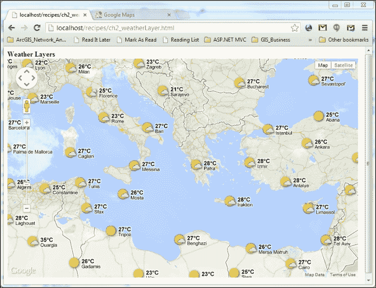

## 它是如何工作的…

为了看到天气特定的图层，我们必须以与引用热力图覆盖的`visualization`库相同的方式精确引用`weather`库。

我们更改了地图的中心和缩放是为了某个目的。缩放设置为 5，因为云层仅在 0 到 6 的缩放级别之间可见。此外，我们将地图中心定位在地中海，以便查看几个大城市的天气信息。

重要的是要注意，与天气层一起，街道和城市名称等行政标签不会显示。此外，天气层适用于 0 到 12 的缩放级别之间。

在构建`google.maps.weather.weatherLayer`对象时，你可以通过`temperatureUnits`属性指定温度单位。可能的值在`google.maps.weather.TemperatureUnit`中定义：

```js
google.maps.weather.TemperatureUnit.CELCIUS
google.maps.weather.TemperatureUnit.FAHRENHEIT
```

你可以通过调用各自的`setMap()`方法并将`map`对象作为唯一参数来将`weatherLayer`和`cloudLayer`层添加到地图中。

显示天气层，你可以通过[`www.weather.com`](http://www.weather.com)提供的温度信息查看城市的天气状况。显示在城市的图标将根据实时天气变化，无论是太阳、云还是雨。此外，点击图标将打开一个详细弹出窗口，显示未来四天的天气状况。

## 还有更多...

你可以为`weatherLayer`对象调整除了`temperatureUnits`以外的其他属性。你可以抑制详细弹出窗口，或者你可以设置风速的单位等等。

### 小贴士

**关于 WeatherLayerOptions 的更多信息**

`WeatherLayerOptions`的完整列表可以在[`developers.google.com/maps/documentation/javascript/reference#WeatherLayerOptions`](https://developers.google.com/maps/documentation/javascript/reference#WeatherLayerOptions)找到。

# 添加 Panoramio 层

Panoramio 是一个带有地理标签的图片分享网站。这意味着只要你对这些图片进行地理标签（地理参考），你就可以上传它们。地理标签涉及将一对坐标附加到目标对象上，无论它是照片、视频还是任何其他资源。你可以在[`www.panoramio.com/`](http://www.panoramio.com/)找到有关如何使用 Panoramio 的详细信息。

你可以在 Google Maps 上查看 Panoramio 照片，本食谱将涵盖如何做到这一点的基础知识。

## 准备工作

我们可以从第一章的“在自定义 DIV 元素中创建简单地图”食谱继续，因为地图显示的基本知识已经在这里介绍。

和往常一样，请在继续之前复制原始食谱。

## 如何操作...

如果你遵循所提供的步骤，你可以在 Google Maps 上叠加各种 Panoramio 图像库存：

1.  将 Panoramio 库添加到引用库中：

    ```js
        <script type="text/javascript"
         src="https://maps.googleapis.com/maps/api/js? 
         sensor=false&libraries=panoramio">
        </script>
    ```

1.  在创建地图对象后，创建一个名为`panoramioLayer`的新`google.maps.panoramio.PanoramioLayer()`对象：

    ```js
        var panoramioLayer = new google.maps.panoramio.PanoramioLayer();
    ```

1.  将`panoramioLayer`对象添加到地图中：

    ```js
        panoramioLayer.setMap(map);
    ```

1.  现在您可以将 Panoramio 图像叠加到 Google Maps 上，如下面的截图所示：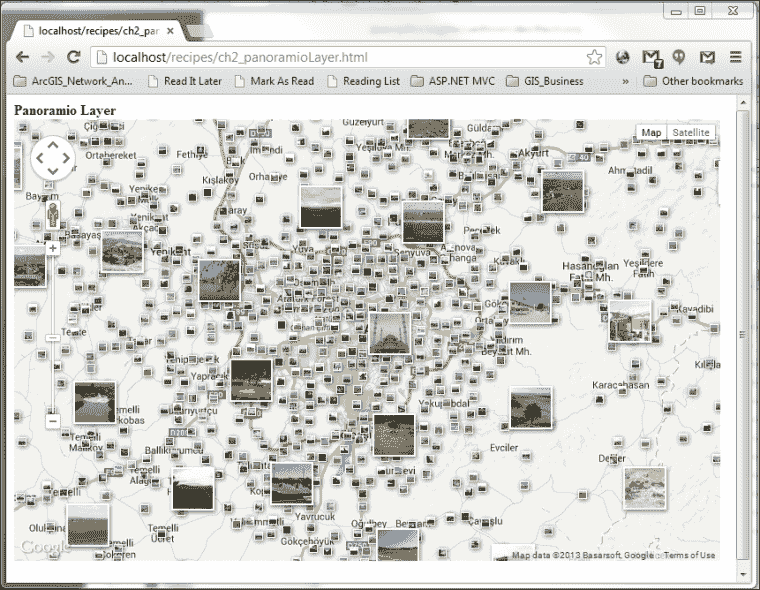

## 它是如何工作的...

在技术上，添加 Panoramio 层与我们之前所做的没有区别。我们添加相关的参考库，构建层，并以相同的方式将其添加到地图中。

您可以点击缩略图照片，将打开一个详细弹出窗口。在这个弹出窗口中，您可以查看照片的更大尺寸，以及上传照片的人的用户名。

## 还有更多...

Panoramio 层提供了额外的能力来自定义叠加层。例如，您可以使用 `setTag()` 方法通过过滤标签来限制照片：

```js
    panoramioLayer.setTag("Eiffel");
```

这将过滤显示的缩略图，只显示标签中包含 `Eiffel` 关键词的照片。

此外，您还可以通过调用 `setUserId()` 方法并根据用户 ID 进行过滤，将 `userId` 字符串作为参数提供。

您还可以通过使用 `PanoramioLayer` 对象的 `suppressInfoWindows` 属性来抑制打开的详细弹出窗口：

```js
    var panoramioLayer = new google.maps.panoramio.PanoramioLayer({
        suppressInfoWindows:true
    });
```

### 小贴士

**关于 PanoramioLayer 的更多信息**

`PanoramioLayer` 的完整列表可以在 [`developers.google.com/maps/documentation/javascript/reference#PanoramioLayerOptions`](https://developers.google.com/maps/documentation/javascript/reference#PanoramioLayerOptions) 找到。
