# 第三章。添加矢量图层

在本章中，我们将涵盖：

+   向地图添加标记

+   向标记或地图添加弹出窗口

+   向地图添加线条

+   向地图添加多边形

+   向地图添加圆形/矩形

+   向地图添加动画线条

+   添加 KML/GeoRSS 图层

+   将 GeoJSON 添加到 Google Maps JavaScript API

+   将 WKT 添加到 Google Maps JavaScript API

# 简介

本章是关于矢量图层，它与栅格图层完全不同。本章为你提供了在使用 Google Maps JavaScript API 时可能需要的最常见和最重要的食谱。

在 GIS 世界中，矢量和栅格图层在不同情况下都会被使用。矢量通常用于表示地球的特征。例如，**兴趣点**（**POI**），如咖啡店或餐厅，以点表示；河流或道路以折线表示；公园或建筑物以多边形表示。正如你所看到的，这里有三种不同的矢量类型：点、折线和多边形。请记住，所有矢量都由点组成，点是矢量的基本构建块。

在 Google Maps JavaScript API 中，所有类型的矢量都称为 **覆盖层**。除了矢量之外，弹出窗口和符号也包含在覆盖层中。所有与它们相关的食谱都包含在本章中。

地图主要用于可视化，因此在某些情况下静态地图是不够的。一些添加到折线上的动画可以产生差异。例如，用河流显示流向对科学家来说是非常显著的。Google Maps JavaScript API 也支持动画折线，这是本章中的一个食谱。

Google Maps JavaScript API 是一个功能强大的 API，支持 KML 和 GeoRSS，但一些行业事实标准不支持默认设置，例如 GeoJSON 和 WKT。GeoJSON 和 WKT 是行业中最常用的矢量发布格式，尤其是在开源库中。这些格式将由额外的库支持，这些库也包含在本章中。

让我们开始探索这些食谱。

# 向地图添加标记

地图在网站中有许多用途，但最常用的用途是显示公司或企业的位置。在 LBS 或 GIS 领域，公司或企业的位置可以称为 POI，这是矢量图层的一种点类型。在 Google Maps JavaScript API 中，POI 或点以 **标记** 的形式显示。

本食谱展示了如何使用 `google.maps.LatLng` 和 `google.maps.Marker` 类将标记添加到地图中。

## 准备工作

在第一章《Google Maps JavaScript API 基础》中，你学习了如何创建地图。因此，本食谱只涵盖将标记添加到地图所需的附加代码行。

你可以在 `Chapter 3/ch03_adding_markers.html` 找到源代码。

## 如何做到这一点...

以下是我们需要添加标准和图标标记到地图的步骤：

1.  让我们添加**边界框**（**BBOX**）的纬度和经度的最小和最大值，以限制随机标记的区域。这个边界框几乎定义了**土耳其**覆盖的区域。同时定义了`markerId`来命名随机标记。所有变量都必须在函数外部定义：

    ```js
    var minLat = 36,
        maxLat = 42,
        minLng = 25,
        maxLng = 44,
        markerId = 1;
    ```

1.  在`initMap()`函数之后添加以下函数。这个函数开始监听按钮的点击事件：

    ```js
    function startButtonEvents() {document.getElementById('addStandardMarker').addEventListener('click', function(){
          addStandardMarker();
      });

      document.getElementById('addIconMarker' ).addEventListener('click', function(){
          addIconMarker();
      });
    }
    ```

1.  在`startButtonEvents()`函数之后添加以下函数。这个函数根据本节开头给出的值创建一个随机纬度和经度，并返回`google.maps.LatLng`对象。

    ```js
    function createRandomLatLng() {
      var deltaLat = maxLat - minLat;
      var deltaLng = maxLng - minLng;
      var rndNumLat = Math.random();
      var newLat = minLat + rndNumLat * deltaLat;
      var rndNumLng = Math.random();
      var newLng = minLng + rndNumLng * deltaLng;
      return new google.maps.LatLng(newLat, newLng);
    }
    ```

1.  然后，添加了`addStandardMarker()`函数。这个函数创建了一个标准的谷歌地图红色标记。它从前面步骤中创建的函数中获取随机的`LatLng`对象值。代码块中有一行注释，稍后会进行解释：

    ```js
    function addStandardMarker() {
      var coordinate = createRandomLatLng();
      var marker = new google.maps.Marker({
        position: coordinate,
        map: map,
        title: 'Random Marker - ' + markerId
      });
    // If you don't specify a Map during the initialization //of the Marker you can add it later using the line //below
    //marker.setMap(map);
      markerId++;
    }
    ```

1.  在这个步骤中，还有一个名为`addIconMarker()`的另一个函数进行了描述。这个函数用于添加带有随机图像的随机标记：

    ```js
    function addIconMarker() {
      var markerIcons = ['coffee', 'restaurant_fish', 'walkingtour', 'postal', 'airport'];
      var rndMarkerId = Math.floor(Math.random() * markerIcons.length);
      var coordinate = createRandomLatLng();
      var marker = new google.maps.Marker({
        position: coordinate,
        map: map,
        icon: 'img/' + markerIcons[rndMarkerId] + '.png',
        title: 'Random Marker - ' + markerId
      });
      markerId++;
    }
    ```

1.  最后，我们将添加 HTML 标签来完成代码。这些链接将帮助触发事件监听器中定义的函数：

    ```js
    <a id="addStandardMarker" href="#">Add Standard Marker</a>
    <a id="addIconMarker" href="#">Add Icon Marker</a>
    ```

1.  在您最喜欢的浏览器中转到您本地存储 HTML 文件的 URL，查看结果。最初，您将看到一个空地图。然后点击地图上的链接以添加随机标记。最终地图可以参考以下截图：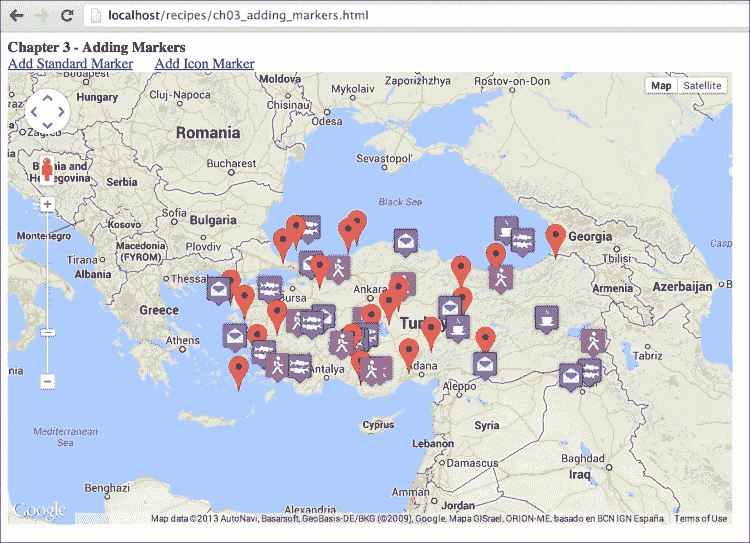

如前一个截图所示，我们创建了一个包含标准和图标标记的地图。

## 它是如何工作的...

谷歌地图使用 Web Mercator 投影系统为其瓦片系统，但坐标仍然是基于 WGS 84 基准的 GPS 坐标。坐标基于介于-90 到 90 和-180 到 180 度之间的纬度和经度。纬度和经度的组合定义了地球上的一个点。谷歌地图 JavaScript API 使用`google.maps.LatLng`类来创建一个点。这个类也在第一章，*谷歌地图 JavaScript API 基础*中用于设置地图的中心。以下行定义了**伊斯坦布尔**，**土耳其**的坐标：

```js
var istanbul = new google.maps.LatLng(41.038627, 28.986933);
```

`google.maps.Marker` 类使用一个必需的参数 `google.maps.MarkerOptions` 创建标记。`MarkerOptions` 类还有一个名为 `position` 的必需参数。此参数获取 `google.maps.LatLng` 对象以定义标记的坐标。在代码中，还有 `map` 和 `title` 参数，它们不是必需的，但它们是显示标记在地图上和设置标记标题所必需的。如果你想立即在创建标记后显示标记，你应该使用 `map` 参数。但在某些情况下，你可能想创建标记并在稍后将其显示在地图上。在这种情况下，你应该使用 `marker` 的 `setMap` 方法与你的地图引用。

```js
var marker = new google.maps.Marker({
  position: new google.maps.LatLng(41.038627, 28.986933)
});
marker.setMap(map);
```

如果你想要从地图中删除标记，你必须将地图值设置为 null。不要忘记保留你的标记引用，以便从地图中删除它们：

```js
marker.setMap(null);
```

默认的带有红色图标的标记并不适用于所有情况。Google Maps JavaScript API 允许你自定义标记的图标。基本上，你应该将 `icon` 参数添加到 `google.maps.MarkerOptions` 中来自定义标记图标。此参数接受三种不同类型：`String`、`google.maps.Icon` 对象或 `google.maps.Symbol` 对象。如果你有一个简单的图标图像，你将使用字符串类型并指定图像的路径。否则，你需要创建图标或符号对象来为标记设置复杂的可视化效果。通过 `String` 参数显示图标可以按照以下方式完成：

```js
var marker = new google.maps.Marker({
  position: coordinate,
  icon: 'img/coffeeshop.png',
  title: 'My Coffee Shop'
});
```

## 还有更多...

在这个菜谱中，使用随机坐标来显示标记。如果你有一个包含坐标的数据源，你可以很容易地使用 JavaScript 技术将其添加到地图上，而无需在创建标记时进行任何更改。请确保在从外部源添加标记到地图时了解 JavaScript 的异步行为，因为由于异步行为，你的数据在你需要时可能不可用。

## 参见

+   在 第一章 的 *在自定义 DIV 元素中创建简单地图* 菜谱中，*Google Maps JavaScript API 基础*

# 向标记或地图添加弹出窗口

几乎每个地图应用都有显示与显示在地图上的功能相关的信息的能力。同时显示所有相关信息对于开发者来说是一项不可能完成的任务，对于用户来说也是无用的。因此，开发者不是在地图上显示所有信息，而是通过弹出窗口或信息窗口等技术，将相关信息的显示添加到点、折线或多边形上。

弹出窗口或信息窗口可以包含任何可以用 HTML 标签编写的元素，例如图片、视频或标准文本。

如果你成功完成菜谱的整个过程，你会看到以下类似的截图：

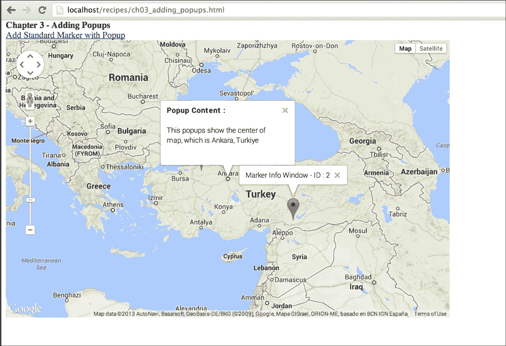

## 准备工作

这个食谱是之前名为 *添加标记到地图* 的食谱的修改版本。

你可以在 `Chapter 3/ch03_adding_popups.html` 找到源代码。

## 如何做到这一点...

你可以通过以下步骤轻松地将弹出窗口添加到标记或地图上：

1.  首先，通过在创建 `map` 对象后添加以下代码行修改 `initMap()` 函数。这将使地图在首次初始化时在地图中心打开一个信息窗口或弹出窗口：

    ```js
    var infowindow = new google.maps.InfoWindow({
      content: '<div style="width:200px; height:100px; "><b>Popup Content :</b><br><br>This popups show the center of map, which is Ankara, Turkiye</div>',
      position: new google.maps.LatLng(39.9078, 32.8252)
    });

    infowindow.open(map);
    ```

1.  接下来，将以下函数添加到监听 HTML 中定义的按钮的点击事件：

    ```js
    function startButtonEvents() {document.getElementById('addStandardMarker').addEventListener('click', function(){
          addStandardMarker();
      });
    }
    ```

1.  在初始化地图时必须调用 `startButtonEvents()` 函数，因此，在 `map` 初始化后，向 `initMap()` 函数中添加以下行：

    ```js
    startButtonEvents();
    ```

1.  然后，通过在标记创建后添加以下代码行修改 `addStandardMarker()` 函数：

    ```js
    var infowindow = new google.maps.InfoWindow({
      content: 'Marker Info Window – ID : ' + markerId
    });

    google.maps.event.addListener(marker, 'click', function() {
      infowindow.open(map, marker);
    });
    ```

1.  前往你喜欢的浏览器中存储 HTML 文件的本地 URL，查看结果。你将看到地图开始处有一个信息窗口。你还可以点击地图上的链接来添加随机标记，但与之前的标记不同，因为当用户点击它们时，它们将打开一个弹出窗口。

## 它是如何工作的...

Google Maps JavaScript API 有一个默认的 `InfoWindow` 类来创建信息窗口或弹出窗口。这个类可以通过两种方式初始化。一种方式是在信息窗口选项中提供一个位置，使用 `LatLng` 对象。通过这种方式，你可以在地图上的任何位置打开一个弹出窗口。这可以附加到一个函数或事件。例如，你可以将 `click` 事件附加到地图上，从服务器查询某些内容，并在弹出窗口中显示结果。这在 Google Maps JavaScript API 中很常见。以下代码在 39.9078（纬度）和 32.8252（经度）的位置创建了一个信息窗口，并带有 HTML 内容。它的 `open` 方法使用 `map` 输入显示了附加到给定地图引用的信息窗口：

```js
var infowindow = new google.maps.InfoWindow({
content: '<div style="width:200px; height:100px; "><b>Popup Content :</b><br><br>This popups show the center of map, which is Ankara, Turkiye</div>',
  position: new google.maps.LatLng(39.9078, 32.8252)
});
infowindow.open(map);
```

使用弹出窗口的另一种方法是将其绑定到标记上。而不是给出一个位置，信息窗口将锚定到一个 `marker` 对象。以下代码中给出的 `infoWindow` 对象没有 `position` 属性，这意味着它将锚定到一个 `marker` 对象。记住，`marker` 对象是 Google Maps JavaScript API 中 `MVCObject` 类的子类。它们是 `InfoWindow` 类 `open` 方法的一种锚定参数：

```js
var infowindow = new google.maps.InfoWindow({
  content: 'Marker Info Window – ID : ' + markerId
});
google.maps.event.addListener(marker, 'click', function() {
  infowindow.open(map, marker);
});
```

在前面的代码中，`marker` 对象关联了一个事件，这是 第五章，*理解 Google Maps JavaScript API 事件* 的主题。因此，按照代码原样使用；这将在稍后详细解释，但基本上这个代码片段监听 `marker` 对象，并在 `click` 事件上打开创建的 `infowindow` 对象。

如本菜谱所示，您可以在信息窗口中使用简单的字符串和复杂的 HTML 内容。这意味着您甚至可以在信息窗口中添加 YouTube 视频或 Flash 内容。

## 相关内容

+   在 第一章 的 *在自定义 DIV 元素中创建简单地图* 菜谱中，*Google Maps JavaScript API 基础*，

+   *向地图添加标记* 菜谱

# 向地图添加线条

在 GIS 中，线条或多边形是一系列相互连接的点，用于在地球上显示诸如道路、路径或河流等特征。地图上多边形的属性与地球上表示的特征的属性相似。例如，地球上的道路通过其颜色和宽度来区分。相同的属性也在 Google Maps JavaScript API 中定义，以精确地表示地图上的道路。

本菜谱的重点是展示地图上的线条/多边形，以显示从 **伊斯坦布尔** 到 **安卡拉** 的路线。

## 准备工作

本菜谱使用与 第一章 中定义的相同地图创建过程，*Google Maps JavaScript API 基础*，但在 `zoom` 级别和中心坐标上有些细微的变化，以详细显示路线。

您可以在 `Chapter 3/ch03_adding_lines.html` 找到源代码。

## 如何操作…

如果您想向地图添加线型几何形状，您应执行以下步骤：

1.  让我们打开 第一章 中提到的第一个菜谱的源代码，并将其保存为 `adding_lines.html`。

1.  然后，在代码的 JavaScript 部分定义 `map` 对象之后添加以下代码行。本步骤中定义的数组是从 **伊斯坦布尔** 到 **安卡拉** 的经纬度路线坐标：

    ```js
    var lineCoordinates = [
      [41.01306,29.14672],[40.8096,29.4818],
      [40.7971,29.9761],[40.7181,30.4980],
      [40.8429,31.0253],[40.7430,31.6241],
      [40.7472,32.1899],[39.9097,32.8216]
    ];
    ```

1.  然后，创建 `addPolyline` 函数：

    ```js
    function addPolyline () {

    }
    ```

1.  我们需要创建一个新的数组，由函数开头定义的 `LatLng` 对象组成：

    ```js
    //First we iterate over the coordinates array to create a 
    // new array which includes objects of LatLng class.
    var pointCount = lineCoordinates.length;
    var linePath = [];
    for (var i=0; i < pointCount; i++) {
      var tempLatLng = new google.maps.LatLng( lineCoordinates[i][0] , lineCoordinates[i][1]
      );
      linePath.push(tempLatLng);
    }
    ```

1.  然后，我们需要创建 `polyline` 对象，如下所示：

    ```js
    //Polyline properties are defined below
    var lineOptions = {
      path: linePath,
      strokeWeight: 7,
      strokeColor: '#FF0000',
      strokeOpacity: 0.8
    }
    var polyline = new google.maps.Polyline(lineOptions);
    ```

1.  让我们将 `polyline` 对象添加到 `map` 中：

    ```js
    //Polyline is set to current map.
    polyline.setMap(map);
    ```

1.  现在，在 `initMap()` 函数的末尾调用 `addPolyline()` 函数，如下所示：

    ```js
    addPolyline();
    ```

1.  前往您在最喜欢的浏览器中存储 HTML 文件的本地 URL，查看结果。您将在地图上看到从 **伊斯坦布尔** 到 **安卡拉** 的红色路线，如下面的截图所示：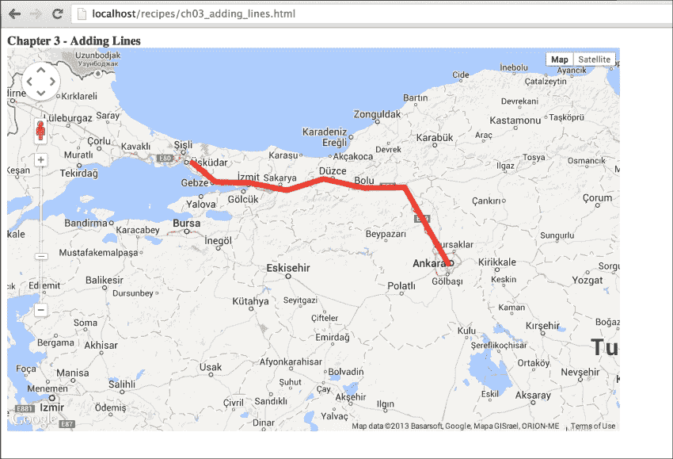

因此，我们成功创建了一个带有线型几何形状的地图，在这个例子中，它表示从一个地方到另一个地方的路线。

## 工作原理...

如前所述，多边形由点组成。点由 Google Maps JavaScript API 中的 `LatLng` 类定义，因此应将经纬度数组转换为 `LatLng` 数组。以下代码块创建了一个由 `LatLng` 对象组成的新数组。为此，使用以下循环遍历数组的经典方法：

```js
var pointCount = lineCoordinates.length;
var linePath = [];
for (var i=0; i < pointCount; i++) {
  var tempLatLng = new google.maps.LatLng(lineCoordinates[i][0], lineCoordinates[i][1]);
  linePath.push(tempLatLng);
}
```

通过将`PolylineOptions`类的实例作为参数的`Polyline`类将创建一个路线。`PolylineOptions`类有许多属性，但我们只添加了最常用的。

定义路线特征的`path`属性包含一个`LatLng`对象的数组。`strokeWeight`属性用于定义线的宽度（以像素为单位）。`strokeColor`属性定义线的颜色，以`String`类型表示，采用带前导`#`符号的`HEX`格式。

`strokeOpacity`属性的用法是可选的，但在显示多个图层时可能很有用。此参数的值从 0.0 到 1.0。0.0 表示你的线是不可见的，1.0 表示你的线不是透明的。如果你有多个图层，你应该定义你线条的不透明度以显示其他特征或图层。

此配方显示了在 HTML 中定义的静态路线；但在某些情况下，你可以从远程源加载数据。在这种情况下，你应该通过`Polyline`类的`setPath()`方法更改路径数组。此方法获取与`PolylineOptions`类中定义的相同的数组。例如，你创建一个名为`newRoute`的新路径数组。要将坐标更改为新路线，你应该调用以下代码：

```js
polyline.setPath(newRoute);
```

如果你想要完全从地图中移除`polyline`，那么你应该将`map`属性设置为 null 或调用`Polyline`类的`setMap(null)`方法。

## 相关内容

+   第一章中的*在自定义 DIV 元素中创建简单地图*配方

+   *添加多边形到地图*配方

# 将多边形添加到地图中

多边形类似于多段线，多段线是一系列相互连接的点。然而，多边形是封闭的环路，用于显示地球上的特征，如公园、地块或区域。除了多段线的属性外，多边形内部还有一个填充区域。

此配方专注于在地图上显示多边形以显示**安卡拉**周围的区域。

## 准备工作

此配方使用在第一章中定义的相同的地图创建过程，*Google Maps JavaScript API 基础知识*，但在`zoom`级别和中心坐标上有些小的变化，以详细显示区域。

你可以在`Chapter 3/ch03_adding_polygons.html`找到源代码。

## 如何操作…

如果你执行以下步骤，你可以将多边形类型的几何形状添加到你的地图中：

1.  让我们打开在第一章中提到的第一个配方的源代码，*Google Maps JavaScript API 基础知识*，并将其保存为`adding_polygons.html`。

1.  然后，在 JavaScript 部分的开始处定义地图对象后，添加以下代码行。在此步骤中定义的数组是围绕**安卡拉**的经纬度随机区域的区域坐标：

    ```js
    var areaCoordinates = [
      [40.0192,32.6953],[39.9434,32.5854],
      [39.7536,32.6898],[39.8465,32.8106],
      [39.9139,33.0084],[40.0318,32.9260],
      [40.0402,32.7832],[40.0192,32.6953]
    ];
    ```

1.  然后创建`addPolygon`函数：

    ```js
    function addPolygon () {

    }
    ```

1.  我们需要创建一个新的数组，该数组由函数开头定义的数组中的 `LatLng` 对象组成：

    ```js
    //First we iterate over the coordinates array to create a 
    // new array which includes objects of LatLng class.
    var pointCount = areaCoordinates.length;
    var areaPath = [];
    for (var i=0; i < pointCount; i++) {
      var tempLatLng = new google.maps.LatLng(areaCoordinates[i][0] , areaCoordinates[i][1]);
      areaPath.push(tempLatLng);
    }
    ```

1.  然后，我们需要按照以下方式创建 `polygon` 对象：

    ```js
    //Polygon properties are defined below
    var polygonOptions = {
      paths: areaPath,
      strokeColor: '#FF0000 ,
      strokeOpacity: 0.9,
      strokeWeight: 3,
      fillColor: '#FFFF00',
      fillOpacity: 0.25
    }
    var polygon = new google.maps.Polygon(polygonOptions);
    ```

1.  让我们将 `polygon` 对象添加到 `map` 中：

    ```js
    //Polygon is set to current map.
    polygon.setMap(map);
    ```

1.  现在，在 `initMap()` 函数的末尾调用 `addPolygon()` 函数，如下所示：

    ```js
    addPolygon();
    ```

1.  在您最喜欢的浏览器中转到存储 HTML 文件的本地 URL，并查看结果。您将看到一个由红色边界围绕的黄色区域，该区域位于 **安卡拉** 附近，如下面的截图所示：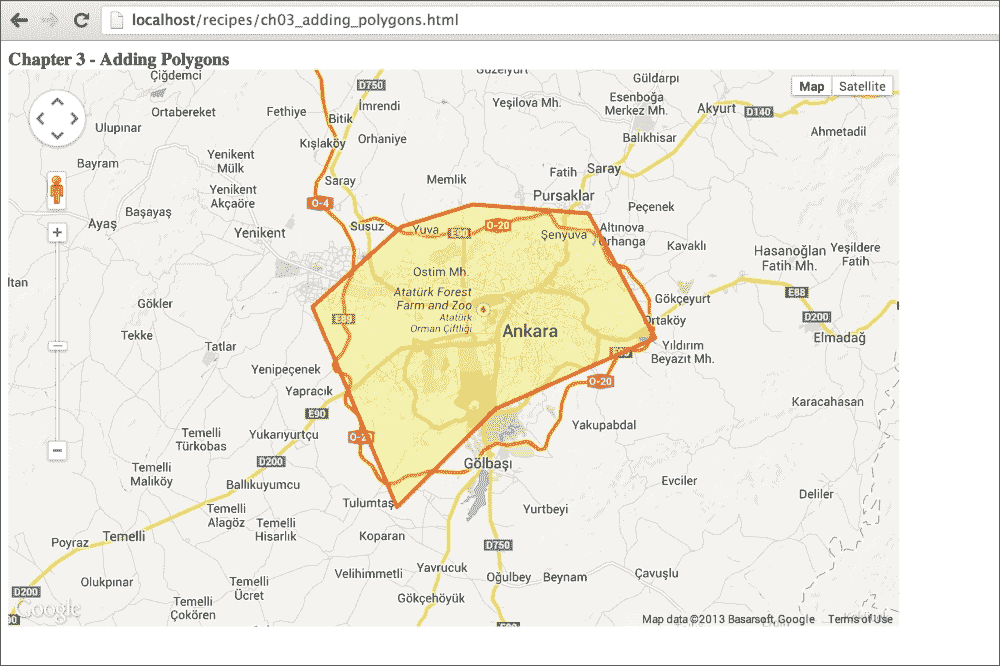

1.  这就是我们在地图上添加多边形类型几何形状的方法。

## 工作原理...

`Polygon` 类在 Google Maps JavaScript API 中与 `Polyline` 类非常相似。`Polyline` 和 `Polygon` 类之间有一些细微的差异，所以我们只在这个菜谱中详细介绍这些差异。请参考之前的菜谱以获取更多详细信息。

如前一个菜谱所述，`Polygon` 类通过包含许多多边形参数的 `PolygonOptions` 类来创建对象。`path`、`strokeWeight`、`strokeColor` 和 `strokeOpacity` 参数与 `PolylineOptions` 类共享。这些参数的用法和目的对多边形和折线都是相同的。主要区别在于多边形填充一个区域。必须有一些新参数来定义多边形的填充。

`fillColor` 属性以 `String` 类型定义填充区域的颜色，格式为带前缀 `#` 的 `HEX` 格式。`fillOpacity` 属性的使用可以是可选的，但在同时显示多个图层时也可能很有用。此参数的值从 0.0 到 1.0。0.0 表示您的多边形不可见，1.0 表示您的多边形不透明。此参数在多边形中比在折线中更重要，因为多边形填充区域，这可能会成为某些标记或折线的障碍。

添加或删除多边形与折线的 API 使用方式相同，因此在这里无需讨论。

最后要提到的一点是，多边形是折线的封闭版本，因此我们在开始和结束处添加相同的坐标。这是一个好的用法，但不是必需的。即使您没有添加与起始坐标相同的结束坐标，Google Maps JavaScript API 也会无错误地关闭多边形。

## 参见

+   在 第一章 的 *在自定义 DIV 元素中创建简单地图* 菜谱中，*Google Maps JavaScript API 基础*

+   *在地图上添加线条* 菜谱

# 在地图上添加圆形/矩形

圆形和矩形在具有描边和填充颜色、权重和透明度方面与多边形相似。它们与多边形的主要区别在于定义几何形状。如前几个菜谱所示，`PolygonOptions` 类有一个 `path` 参数，该参数由 `LatLng` 对象数组组成。另一方面，`CircleOptions` 类有 `center` 和 `radius` 参数，而 `RectangleOptions` 类有用于定义 `Circle` 和 `Rectangle` 类几何形状的边界参数。

在这个菜谱中，我们将根据城市的人口添加圆形，并添加一个矩形以将地图边界映射到**土耳其**。结果地图将显示**土耳其**的边界框和主要城市的人口图。

## 准备工作

在这个菜谱中，我们将使用 第一章 中定义的第一个菜谱作为模板，以跳过地图创建。

您可以在 `Chapter 3/ch03_circle_rectangle.html` 找到源代码。

## 如何做到这一点...

如果您执行以下步骤，将圆形或矩形添加到地图上相当简单：

1.  让我们从创建一个名为 `circles_rectangles.html` 的新空文件开始。然后，复制在 第一章 中介绍的 HTML 文件中的所有代码，该代码位于 *在自定义 DIV 元素中创建简单地图* 菜谱中，*Google Maps JavaScript API 基础*，并将其粘贴到新文件中。

1.  添加以下行以定义函数中使用的全局变量：

    ```js
    // Defining coordinates and populations of major cities in // Turkey as Ankara, Istanbul and Izmir
    var cities = [{
      center: new google.maps.LatLng(39.926588, 32.854614), 
      population : 4630000
    },
    {
      center: new google.maps.LatLng(41.013066, 28.976440), 
      population : 13710000
    },
    {
      center: new google.maps.LatLng(38.427774, 27.130737),  
      population : 3401000
    }
    ];

    // Defining the corner coordinates for bounding box of 
    // Turkey
    var bboxSouthWest = new google.maps.LatLng(35.817813, 26.047461);
    var bboxNorthEast = new google.maps.LatLng(42.149293, 44.774902);
    ```

1.  然后，在 `initMap()` 函数之前添加 `addCircle()` 和 `addRectangle()` 函数：

    ```js
    function addCircle() {

    }

    function addRectangle() {

    }
    ```

1.  现在，将以下代码块添加到 `addCircle()` 函数中以初始化圆形：

    ```js
    // Iterating over the cities array to add each of them to // map
    for (var i=0; i < cities.length; i++) {
      var circleOptions = {
        fillColor: '#FFFF00',
        fillOpacity: 0.55,
        strokeColor: '#FF0000',          
        strokeOpacity: 0.7,
        strokeWeight: 1,
        center: cities[i].center,
        radius: cities[i].population / 100
      };
      cityCircle = new google.maps.Circle(circleOptions);
      cityCircle.setMap(map);
    }
    ```

1.  接下来，向 `addRectangle()` 函数添加以下行以初始化矩形：

    ```js
    var bounds = new google.maps.LatLngBounds(bboxSouthWest, bboxNorthEast);
    var rectOptions = {
      fillColor: '#A19E98',
      fillOpacity: 0.45,
      strokeColor: '#FF0000',
      strokeOpacity: 0.0,
      strokeWeight: 1,
      map: map,
      bounds: bounds
    };

    var rectangle = new google.maps.Rectangle(rectOptions);
    ```

1.  然后，在 `initMap()` 函数中根据您的需求更改地图的 `zoom` 级别和 `center`。本例使用以下参数：

    ```js
    var mapOptions = {
      center: new google.maps.LatLng(39.9046, 32.75926),
      zoom: 5,
      mapTypeId: google.maps.MapTypeId.ROADMAP
    };
    ```

1.  最后，在 `initMap()` 函数的末尾添加 `addRectangle()` 和 `addCircle()` 函数，如下所示：

    ```js
    addRectangle();
    addCircle();
    ```

1.  前往您最喜欢的浏览器中存储 `circles_rectangles.html` 文件的本地 URL，并查看结果。您将看到地图上有三个圆形和一个灰色的矩形，如下面的截图所示：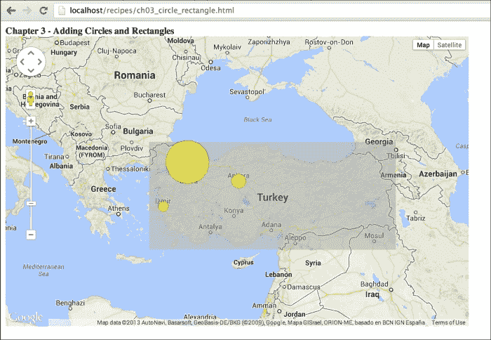

这是该菜谱的结果，它同时在地图上显示了圆形和矩形。这可以是一个很好的例子，用于可视化你在地图上的表格数据。

## 它是如何工作的...

首先，让我们谈谈圆形。圆形是多边形的一种类型，但它们由 `LatLng` 对象中的中心和一个以米为单位的半径定义，而不是路径。其他参数与 `PolygonOptions` 类相同。

在这个菜谱中，首先选择了**安卡拉**、**伊斯坦布尔**和**伊兹密尔**这三个城市。这些城市的中心和人口使用数组中的 JSON 对象定义。城市的中心使用`LatLng`对象定义，因此不需要额外的转换。下面的代码块遍历城市数组，并使用在 JSON 对象中定义的`center`参数创建一个圆：

```js
  var citiesLen = cities.length;
  for (var i=0; i < citiesLen; i++) {
      var circleOptions = {
        fillColor: '#FFFF00',
        fillOpacity: 0.55,
        strokeColor: '#FF0000',
        strokeOpacity: 0.7,
        strokeWeight: 1,
        center: cities[i].center,
        radius: cities[i].population / 100
      };
      cityCircle = new google.maps.Circle(circleOptions);
      cityCircle.setMap(map);
    }
```

`radius`参数被定义为人口的一个参数，即人口除以`100`；它显示了人口的规模。如图所示，人口越高，圆就越大。这可以用来表示人口分布，而无需知道确切的数字。如图所示，其他参数，如`fillColor`、`fillOpacity`、`strokeColor`、`strokeOpacity`和`strokeWeight`，与`PolygonOptions`类的使用方式相同。`setMap()`函数也像在多边形或折线菜谱中使用的那样使用。

另一个元素，矩形，也是一种多边形，只不过其几何形状是由`LatLngBounds`对象定义的。在理论上，`LatLngBounds`对象由两个`LatLng`对象组成，分别定义为矩形的西南和东北坐标。这些坐标也可以定义为纬度和经度的最小和最大点。在这个菜谱中，定义的矩形显示了**土耳其**的边界框。BBOX 可用于简单的几何计算，如“点在多边形内”或“交集”。由于几何形状简单，使用 BBOX 进行计算可以给出快速的结果，但这个计算总是存在误差。如图所示，一些区域不在**土耳其**的边界上，但它们在边界框内。如果您想使用 BBOX 方法获取与**土耳其**相交的几何形状，可以轻松地获取其他位于**土耳其**真实几何对象之外的几何形状。如图所示，使用 BBOX 方法得到的某些几何形状在 BBOX 的交点处可能位于真实区域的之外。`Rectangle`类的使用方法如下：

```js
var bounds = new google.maps.LatLngBounds(bboxSouthWest, bboxNorthEast);

var rectOptions = {
  fillColor: '#A19E98',
  fillOpacity: 0.45,
  strokeColor: '#FF0000',
  strokeOpacity: 0.0,
  strokeWeight: 1,
  map: map,
  bounds: bounds
};
var rectangle = new google.maps.Rectangle(rectOptions);
```

Google Maps JavaScript API 为开发者提供了许多机会，可以使他们的生活更加轻松。圆和矩形都可以用于应用程序中的几何形状或其他可视化技术。

## 更多内容...

在这个菜谱中，我们无序地添加圆和矩形。在先前的地图中显示的是最近添加的一个。在这个例子中，首先添加矩形是为了更好地显示圆。如果您想改变标记、信息窗口、折线、多边形、圆或矩形的显示顺序，应该更改选项类的`zIndex`参数，或者通过`setZIndex(3)`或`setOptions({ zIndex: 3 })`方法进行更改。

## 参见

+   第一章中的*在自定义 DIV 元素中创建简单地图的配方*，*Google Maps JavaScript API 基础*

+   *将线条添加到地图中的配方*

+   *将多边形添加到地图中的配方*

# 将动画线条添加到地图中

折线是地球特征在地球上的表示，但有时它们不足以展示地球特征的移动性。例如，河流可以通过折线来显示，但河流的流向不能仅通过折线来展示。动画折线可以作为一个展示地球特征移动性的解决方案。河流的流向可以通过动画折线来展示。

Google Maps JavaScript API 具有符号功能，可以将基于矢量的图像以符号的形式添加到折线中。您可以使用 `Symbol` 类创建自己的符号，或者您也可以使用从 `SymbolPath` 类访问的预定义符号。

在这个配方中，我们将从上一个配方创建一个动画折线。这个动画显示一辆车从 **伊斯坦布尔** 移动到 **安卡拉**。

## 准备工作

在这个配方中，我们将使用本章的第四个配方作为模板。

您可以在 `第三章/ch03_animating_line.html` 找到源代码。

## 如何操作...

以下是将动画线条型几何图形添加到您的地图中所需的步骤：

1.  首先，将 `ch03_adding_lines.html` 的内容复制到您的新 HTML 文件中。

1.  然后，在 `map` 对象之后添加以下行以使其全局。这在动画线条时使用：

    ```js
    var polyline;
    ```

1.  将函数名称从 `addPolyline()` 更改为 `addAnimatedPolyline()` 并添加以下代码块来定义您的符号：

    ```js
    // Defining arrow symbol
    var arrowSymbol = {
      strokeColor: '#000',
      scale: 3,
      path: google.maps.SymbolPath.FORWARD_CLOSED_ARROW
    };
    ```

1.  接下来，按照以下方式更改折线选项：

    ```js
    var lineOptions = {
      path: linePath,
      icons: [{
        icon: arrowSymbol,
        offset: '100%'
      }],
      strokeWeight: 3,
      strokeColor: '#FF0000',
      strokeOpacity: 0.8
    }
    ```

1.  现在，在以下步骤之后添加以下函数调用以启动动画，该动画将在以下步骤之后定义：

    ```js
    // Calling the arrow animation function
    animateArrow();
    ```

1.  在 `initMap()` 函数之前添加以下函数块：

    ```js
    function animateArrow() {
      var counter = 0;
      var accessVar = window.setInterval(function() {
        counter = (counter + 1) % 200;
        var arrows = polyline.get('icons');
        arrows[0].offset = (counter / 2) + '%';
        polyline.set('icons', arrows);
      }, 50);
    }
    ```

1.  最后，在 `initMap()` 函数中将函数调用从 `addPolyline()` 更改为 `addAnimatedPolyline()` 以添加新的动画折线：

    ```js
    addAnimatedPolyline();
    ```

1.  前往您在最喜欢的浏览器中存储 HTML 文件的本地 URL，并查看结果。您将看到箭头在地图上从 **伊斯坦布尔** 到 **安卡拉** 的路线上进行动画，如下面的截图所示：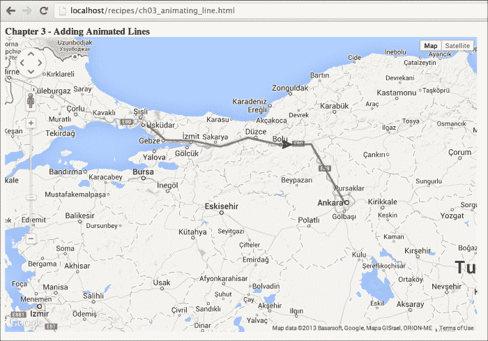

通过这个配方，我们可以将动画线条型几何图形添加到我们的地图中，显示车辆在路线上的移动。

## 如何工作...

动画折线包括使用 JavaScript `setInterval` 方法和 Google Maps JavaScript API 的 `PolylineOptions` 类的图标属性的一个技巧。正如所述，您可以创建自己的符号或使用预定义的符号。

预定义的符号可以通过 `SymbolPath` 类访问，如下面的截图所示，就像在 Google Maps JavaScript API 文档中一样：

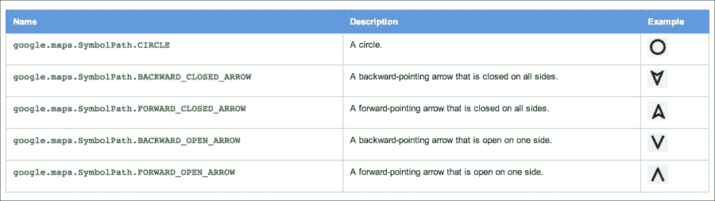

在这个食谱中，我们将使用 `FORWARD_CLOSED_ARROW` 类型。这个符号定义如下：

```js
  var arrowSymbol = {              
    strokeColor: '#000',
    scale: 3,
    path: google.maps.SymbolPath.FORWARD_CLOSED_ARROW
  };
```

`strokeColor` 属性用于定义符号的颜色。`path` 属性用于定义符号类型，而 `scale` 属性用于定义符号的大小。你还可以更改预定义符号（如多边形）的 `fillColor` 和 `fillOpacity` 属性。

如前一个截图所示，预定义的符号是有限的。如果你需要更多类型的符号，你应该在 `Symbol` 类中自己定义它们。你需要通过 `Symbol` 类的 `path` 属性使用 **SVG 路径符号**来定义自定义符号。

SVG 路径符号是 SVG 命令（如 `moveto` (`M`)、`lineto` (`L`) 或 `closepath` (`Z`)）中形状的定义。例如，以下路径符号定义了一个三角形：

```js
var triangle = 'M 100 100 L 300 100 L 200 300 Z';               
```

路径符号的解释如下：移动到点 (`100`,`100`)，从 `100`,`100` 到 `300`,`100` 绘制一条水平线，然后从 (`300`,`100`) 到 (`200`, `300`) 绘制第二条线。这个形状看起来像一个三角形。最后，使用 `Z` 命令关闭路径。你可以使用这种符号绘制任何形状，但你应该注意可用于地图的区域。Google Maps JavaScript API 允许一个 22 x 22 px 的正方形区域显示定义的形状。如果形状大于这个区域，你应该使用 `scale` 参数将形状调整到该区域。以下代码块将预定义的箭头形状更改为在同一路线上移动的黄色三角形：

```js
  var arrowSymbol = {                
    path : 'M 100 100 L 300 100 L 200 300 Z',
    anchor: new google.maps.Point(175,175),
    scale: 0.15,
    fillColor: '#FFFF00',
    fillOpacity: 0.8,
    strokeColor: '#000000',
    strokeWeight: 3
  };
```

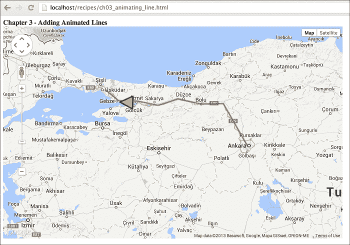

如果你注意到了，这里有一个额外的参数名为 `anchor`。这个参数用于定义符号相对于折线的位置。如果你不添加这个参数，你的符号将默认从 (0,0) 点固定到折线上。一般来说，使用符号的中心作为 `anchor` 点可以得到最佳结果。`anchor` 参数接受 `Point` 类。它也以像素为单位获取其 x 和 y 参数。

这个食谱中最棘手的部分是动画。在 `animateArrow()` 函数中，我们定义了一个触发器，通过 `window.setInterval` 方法每 50 毫秒动画化之前定义的符号。在这个触发器中定义了一个匿名函数如下：

```js
  function() {
    counter = (counter + 1) % 200;
    var arrows = polyline.get('icons');
    arrows[0].offset = (counter / 2) + '%';
    polyline.set('icons', arrows);
  }
```

这个函数获取图标数组中的第一个对象，并根据 `counter` 变量更改定义的图标中 `offset` 参数的动态参数。每 50 毫秒运行此函数将符号移动到折线上。

在匿名函数中，你可能已经注意到折线对象有 `get()` 和 `set()` 方法，这些方法在文档中并未定义。由于 `Polyline` 类扩展了 `MVCObject` 类，我们也可以使用 `MVCObject` 类的方法。因此，我们可以使用父类的 `get()` 和 `set()` 方法。

使用符号和计时器可以在不添加额外库的情况下，通过 Google Maps JavaScript API 实现不同的可视化。

## 更多内容...

**SVG**是**可缩放矢量图形**的缩写。它是一种基于 XML 的二维矢量图像格式，支持交互性和动画。SVG 被所有现代浏览器支持。在某些情况下，如本例，它可以是地图平台的良好解决方案。SVG 是一个完全不同的主题，超出了本书的范围。

### 注意

**关于 SVG 路径表示法的更多信息**

更多详细信息可以在 W3C 网站上找到([`www.w3.org/TR/SVG/paths.html#PathData`](http://www.w3.org/TR/SVG/paths.html#PathData))。还有一些编辑软件可以在不学习语言的情况下获取路径表示法。以下地址可用于创建 SVG 和获取路径表示法：[`svg-edit.googlecode.com/svn/branches/2.6/editor/svg-editor.html`](http://svg-edit.googlecode.com/svn/branches/2.6/editor/svg-editor.html)。

## 参考信息

+   在第一章的“在自定义 DIV 元素中创建简单地图”菜谱中，*Google Maps JavaScript API 基础知识*

+   *向地图添加线条*菜谱

# 添加 KML/GeoRSS 图层

**关键孔标记语言** (**KML**) 已在 Google Earth 中引入，在 Google 收购之前原名为 Keyhole Earth Viewer。KML 于 2008 年成为 OGC 标准。它是一种 XML 表示法，用于在地理启用查看器中显示特征。**GeoRSS**也是一种用于在地理启用查看器中共享地球特征的新兴标准，主要用于 Web 订阅或服务。这两个标准都可以通过 Google Maps JavaScript API 进行消费。

在本菜谱中，将通过 Google Maps JavaScript API 消耗动态服务。我们将使用**美国地质调查局**(**USGS**)的 Web 服务在地图上显示最近的地震。这些服务定期更新以反映最近的事件。

## 准备工作

在本菜谱中，我们将使用在第一章中介绍的简单地图菜谱，*Google Maps JavaScript API 基础知识*，作为模板。

该菜谱的源代码位于`第三章/ch03_kml_georss.html`。

## 如何操作…

如果您执行以下步骤，可以将您的 KML/GeoRSS 文件添加到地图中：

1.  首先，将`ch01_simple_map.html`的内容复制到我们的新 HTML 文件中。

1.  接下来，将以下变量定义为全局变量：

    ```js
    var georssLayer, kmlLayer;
    ```

1.  在定义全局变量后，添加以下函数。此函数触发将 GeoRSS 数据添加到地图中：

    ```js
    function addGeoRSSLayer() {
      georssLayer = new google.maps.KmlLayer( 'http://earthquake.usgs.gov/earthquakes/feed/v1.0/summary/4.5_month.atom');
      georssLayer.setMap(map);
    }
    ```

1.  然后，在之前的函数之后添加其他函数。此函数也会触发将 KML 数据添加到地图中：

    ```js
    function addKMLLayer() {
      kmlLayer = new google.maps.KmlLayer(' http://earthquake.usgs.gov/earthquakes/feed/v1.0/summary/2.5_month_depth.kml');
      kmlLayer.setMap(map);
    }
    ```

1.  现在，在`initMap()`函数之前添加以下函数，`clearMap()`：

    ```js
    function clearMap() {
      if (georssLayer != undefined) {
        georssLayer.setMap(null);
        georssLayer = null;
      }

      if (kmlLayer != undefined) {
        kmlLayer.setMap(null);
        kmlLayer = null;
      }
    }
    ```

1.  接下来，添加以下函数以监听第 8 步中定义的 HTML 按钮的点击事件：

    ```js
    function startButtonEvents () {
      document.getElementById('linkGeoRSS' ).addEventListener('click', function(){
            addGeoRSSLayer();
      });
      document.getElementById('linkKML' ).addEventListener('click', function(){
            addKMLLayer();
      });
      document.getElementById('linkClearMap' ).addEventListener('click', function(){
            clearMap();
      });
    }
    ```

1.  `startButtonEvents`函数必须在初始化地图时调用，因此以下行在地图初始化后添加到 HTML 文件中：

    ```js
    startButtonEvents();
    ```

1.  最后，将以下行添加到 HTML body 标签中，以便在点击链接时触发函数：

    ```js
    <a id="linkGeoRSS" href="#">Add GeoRSS Layer</a>
    <a id="linkKML" href="#">Add KML Layer</a>
    <a id="linkClearMap" href="#">Clear Map</a>
    ```

1.  前往您在最喜欢的浏览器中存储 HTML 文件的本地 URL，查看结果。您将看到开始时是一个空地图。当您点击地图上的链接时，您将看到地图上有两个不同的图层，如下所示：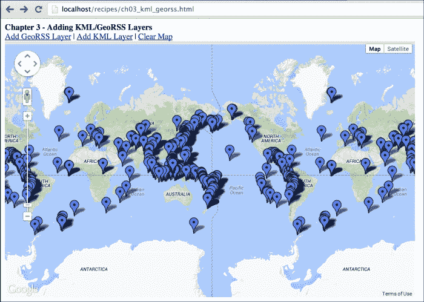

如前一张截图所示，您可以使用 Google Maps JavaScript API 轻松地将您的 GeoRSS 文件或服务添加到地图中。

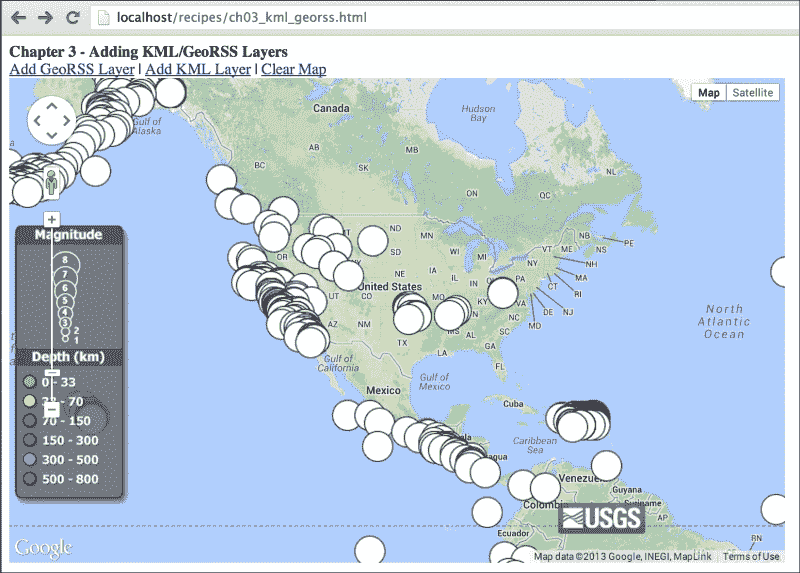

这是将 KML 图层添加到您的地图中的结果。使用 Google Maps JavaScript API，您可以轻松地将您的 KML 文件或服务添加到地图中。

## 它是如何工作的...

添加 KML/GeoRSS 图层是最简单的一种。添加这两个图层只有一个类，名为`KmlLayer`。这个类从本地或远程位置读取 KML 或 GeoRSS 源，并决定要渲染的内容。类的使用非常简单：

```js
var vectorLayer = new google.maps.KmlLayer('URL_TO_FEED');
```

在创建图层后，您必须使用`setMap(map)`方法设置地图，以便在地图上显示图层。如果您想从地图中移除图层，必须使用前面章节中描述的`setMap(null)`方法。

请记住，Google Maps JavaScript API v3 没有像 v2 那样的清除所有图层或覆盖物的功能。处理图层状态的所有责任都在您的肩上。在实际应用中，Google Maps JavaScript API 文档建议您将所有图层保存在一个数组中，并通过`setMap()`方法自行管理添加/移除函数。正如我们在`clearMap()`函数中所做的那样，我们检查图层是否已定义。如果是，我们将其移除；如果不是，我们不做任何事情，这样我们就不会得到错误。

## 参见

+   在第一章的*在自定义 DIV 元素中创建简单地图*配方中，*Google Maps JavaScript API 基础知识*

# 将 GeoJSON 添加到 Google Maps JavaScript API

XML 是 Web 2.0 区域中服务的第一个英雄。借助 XML 的帮助，服务或机器可以轻松地相互通信。XML 也可以被人类阅读。但是，随着浏览器的演变，JSON 由于其 JavaScript 的原生可读性和与 XML 相比的轻量级，变得更加流行。GeoJSON 是一种包含简单特征集合的 JSON 形式，如点、折线或多边形。GeoJSON 不是 OGC 的标准，但它是一种被大多数 GIS 软件或服务使用的新事实标准。

Google Maps JavaScript API 本身不支持 GeoJSON，但可以通过几行代码或使用一些额外的库来添加 GeoJSON 支持。通过编码，我们将遍历 JSON 格式并逐个读取坐标。然后，我们将根据其类型（可以是点、折线或多边形）在地图上显示特征。

在这个菜谱中，我们将通过 jQuery 函数从本地文件读取 GeoJSON，并在地图上显示它们。这个 GeoJSON 文件由安卡拉省边界的简化版本、一条示例河流和一些 POI 组成。

## 准备工作

在这个菜谱中，我们将使用在第一章中介绍的简单地图菜谱作为模板。

你可以在`Chapter 3/ch03_adding_geojson.html`找到源代码。

## 如何操作…

如果你执行以下步骤，你可以将你的 GeoJSON 文件添加到你的地图中：

1.  首先，将`ch01_simple_map.html`的内容复制到我们新的 HTML 文件中。

1.  接下来，我们将添加一个 jQuery JavaScript 库，以便轻松访问本地或远程的 GeoJSON 文件。在这个菜谱中，我们将从 Google CDN 添加库。这个代码块将添加在`<head>`部分，在 Google Maps JavaScript API 之前。

    ```js
    <script src="img/jquery.min.js"></script>
    ```

1.  然后，在定义全局`map`变量后添加以下`drawGeometry()`函数。这个函数绘制从 GeoJSON 文件中读取的每个几何形状。我们有三种类型的几何形状，所以我们将为每种类型添加代码块：

    ```js
    function drawGeometry(geom) {

    }
    ```

1.  现在，在新的函数中添加以下`if`块。这个块将在几何形状的类型为`Point`时添加几何形状：

    ```js
    if (geom.type == 'Point') {
      var coordinate = new google.maps.LatLng(geom.coordinates[1], geom.coordinates[0]);
      var marker = new google.maps.Marker({
        position: coordinate,
        map: map,
        title: 'Marker'
      });
    }
    ```

1.  接下来，`if`块用于显示地图上的`LineString`折线：

    ```js
    else if (geom.type == 'LineString') {
      var pointCount = geom.coordinates.length;
      var linePath = [];
      for (var i=0; i < pointCount; i++) {
        var tempLatLng = new google.maps.LatLng(geom.coordinates[i][1], geom.coordinates[i][0]);
        linePath.push(tempLatLng);
      }

      var lineOptions = {
        path: linePath,
        strokeWeight: 7,
        strokeColor: '#19A3FF',
        strokeOpacity: 0.8,
        map: map
      };
      var polyline = new google.maps.Polyline(lineOptions);
    }
    ```

1.  最后，使用`if`块显示多边形如下：

    ```js
    else if (geom.type == 'Polygon') {
      var pointCount = geom.coordinates[0].length;
      var areaPath = [];
      for (var i=0; i < pointCount; i++) {
        var tempLatLng = new google.maps.LatLng( geom.coordinates[0][i][1], geom.coordinates[0][i][0]);
        areaPath.push(tempLatLng);
      }

      var polygonOptions = {
        paths: areaPath,
        strokeColor: '#FF0000',
        strokeOpacity: 0.9,
        strokeWeight: 3,
        fillColor: '#FFFF00',
        fillOpacity: 0.25,
        map: map
      };

      var polygon = new google.maps.Polygon(polygonOptions);
    }
    ```

1.  然后，添加以下函数来读取 GeoJSON 文件并遍历几何形状：

    ```js
    function parseGeoJSON() {
      $.getJSON('geojson.js', function(data) {
        $.each(data.features, function(key, val) {
          drawGeometry(val.geometry);
        });
      });
    }
    ```

1.  最后，在`initMap()`函数的末尾调用`parseGeoJSON()`函数：

    ```js
    parseGeoJSON();
    ```

1.  前往您在最喜欢的浏览器中存储 HTML 文件的本地 URL，查看结果。您将在地图上看到三种不同类型的几何形状及其样式如下：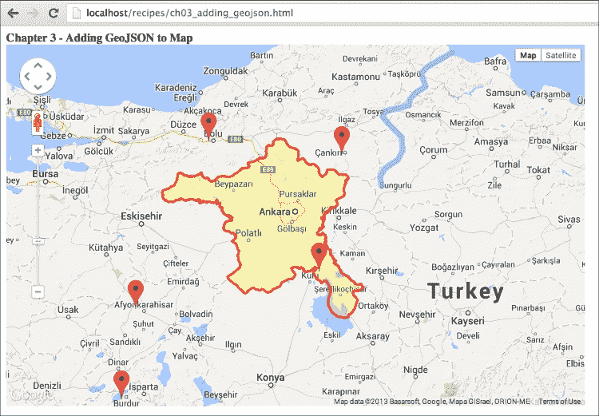

因此，我们已经成功地将包含多种几何形状的 GeoJSON 文件添加到地图中。

## 工作原理...

GeoJSON 是我们之前描述的矢量格式。它是一种 JSON 形式。GeoJSON 格式可以由同一文件中的不同类型组成，如下所示：

```js
{ "type": "FeatureCollection",
  "features": [
    { "type": "Feature",
      "geometry": {"type": "Point", "coordinates": [102.0, 0.5]},
      "properties": {"prop0": "value0"}
    },
    { "type": "Feature",
      "geometry": {
        "type": "LineString",
        "coordinates": [
          [102.0, 0.0], [103.0, 1.0], [104.0, 0.0], [105.0, 1.0]
        ]
      },
      "properties": {
        "prop0": "value0",
        "prop1": 0.0
      }
    },
    { "type": "Feature",
      "geometry": {
        "type": "Polygon",
        "coordinates": [
          [ [100.0, 0.0], [101.0, 0.0], [101.0, 1.0],
            [100.0, 1.0], [100.0, 0.0] ]
          ]
      },
      "properties": {
        "prop0": "value0",
        "prop1": {"this": "that"}
      }
    }
  ]
}
```

从[www.geojson.org](http://www.geojson.org)网站获取的示例 GeoJSON。从代码中可以看出，它由同一文件中的点、折线和多边形组成，这些元素通过`feature`关键字分隔。每个`feature`都有一个名为`geometry`和`properties`的 JavaScript 对象。`geometry`部分存储对象的几何形状，而`properties`部分存储相关联的信息。`geometry`部分基于使用 WGS84 基准的地理坐标参考系统，默认情况下坐标以十进制度数表示，直到在`crs`对象中定义。`type`对象存储几何形状的类型，如`Point`、`Polyline`或`Polygon`。`coordinates`数组是实际存储点坐标数组的部分。GeoJSON 中坐标的顺序与 Google Maps JavaScript API 在经纬度方面不同。

### 注意

**更多关于 GeoJSON**

更多详细信息可以从 GeoJSON 的非官方网站 ([`www.geojson.org`](http://www.geojson.org)) 获取。还有一些工具可以查看或编辑 GeoJSON 而无需任何编码。GitHub ([`www.github.com`](http://www.github.com)) 可以轻松地在地图上显示您的 GeoJSON 文件。[`www.geojson.io`](http://www.geojson.io) 网站也是 MapBox 的一个工具，可以在浏览器上显示和编辑您的 GeoJSON 文件，无需任何软件或编码。请检查这些网站以详细了解 GeoJSON。

在这个配方中，我们将借助 jQuery 的 `getJSON()` 方法读取本地 GeoJSON 文件。使用 jQuery 是为了专注于 Google Maps JavaScript API 的编码。否则，我们将在多个浏览器平台上处理远程文件读取。

此方法获取 `geojson.js` 本地文件的内容，并将它们放入 `data` 变量中。然后，我们将使用 jQuery 的 `each()` 方法遍历 GeoJSON 特征。最后，我们获取每个特征的 `geometry` 部分，并将其发送到稍后将要检查的 `drawGeometry()` 函数：

```js
$.getJSON('geojson.js', function(data) {
  $.each(data.features, function(key, val) {
    drawGeometry(val.geometry);
  });
});
```

在 `drawGeometry()` 函数中编写的代码可能看起来很复杂，但这并不是因为我们将使用本章中为添加标记、线条和多边形编写的所有代码。此函数首先检查几何类型，然后为点、折线或多边形准备适当的选项和坐标。

在折线或多边形中，需要遍历 `geometry` 字段的 `coordinates` 数组，以创建 `PolylineOptions` 或 `PolygonOptions` 类的路径或路径。

```js
var pointCount = geom.coordinates.length;
var linePath = [];
for (var i=0; i < pointCount; i++) {
  var tempLatLng = new google.maps.LatLng( geom.coordinates[i][1], geom.coordinates[i][0]);
  linePath.push(tempLatLng);
}
```

在这个配方中，我们将使用我们的函数处理 GeoJSON，这些函数不能绘制所有类型的 GeoJSON 几何形状。我们只处理简单的形状，以向您展示如何自己处理 GeoJSON。如果您需要进行更复杂的 GeoJSON 处理，有两种方法。一种方法是通过阅读 GeoJSON 的完整规范并将其添加到您的函数中。另一种方法，也很简单，是使用一个专门为此目的编写的库。有一个名为 **GeoJSON to Google Maps** 的库，由 *Jason Sanford* 在 GitHub ([`github.com/JasonSanford/geojson-google-maps`](https://github.com/JasonSanford/geojson-google-maps)) 上编写。借助这个库，您无需处理 GeoJSON 规范。您只需使用自己的样式添加几何形状即可。

## 参见

+   在 第一章 *Google Maps JavaScript API 基础* 中，*在自定义 DIV 元素中创建简单地图* 的配方

+   *添加标记到地图* 的配方

+   *添加线条到地图* 的配方

+   *将多边形添加到地图* 的配方

+   *将 WKT 添加到 Google Maps JavaScript API* 的配方

# 将 WKT 添加到 Google Maps JavaScript API

**已知文本**（**WKT**）是根据维基百科，在地图上表示矢量几何对象的一种文本标记语言。此格式最初由**开放地理空间联盟**（**OGC**）定义，它也是一个标准。

除了 XML 或 JSON 之外，WKT 是一种定义的文本格式，它只定义几何形状而不定义属性，与 GeoJSON 相比。这是一个过时且陈旧的格式，但仍有软件或服务支持此格式。有 18 种不同的几何对象代表地球特征，但在这个菜谱中只观察到简单的几何形状。

Google Maps JavaScript API 本身不支持 WKT，但可以通过几行代码或使用一些额外的库来添加 WKT 支持。通过编码，我们将遍历 WKT 格式，将它们拆分为数组，并逐个读取坐标。然后，我们将根据其类型（可以是点、多段线或多边形）在地图上显示特征。

在这个菜谱中，我们将通过 jQuery 函数从本地文件中读取 WKT，并在地图上显示它们。WKT 几何形状位于 JSON 属性中，以便于迭代。此 WKT 文件由**安卡拉**省边界的一个简化版本、一条示例河流和一些 POI 组成。

## 准备工作

在这个菜谱中，我们将使用在第一章中介绍的简单地图菜谱作为模板。

您可以在`Chapter 3/ch03_adding_wkt.html`中找到源代码。

## 如何操作…

在执行以下步骤后，您可以轻松地将 WKT 几何形状添加到地图中：

1.  首先，将`ch01_simple_map.html`的内容复制到我们的新 HTML 文件中。

1.  接下来，我们将添加一个 jQuery JavaScript 库，以便轻松访问带有 WKT 几何形状的本地或远程 JSON 文件。在这个菜谱中，我们将从 Google CDN 添加库。此代码块将在 Google Maps JavaScript API 之前的`<head>`部分添加：

    ```js
    <script src="img/jquery.min.js"></script>
    ```

1.  然后，在定义全局`map`变量之后添加以下`drawGeometry()`函数。此函数绘制从 JSON 文件中读取的每个 WKT 几何形状。我们有三种类型的几何形状，因此我们将为每种类型切换代码块：

    ```js
    function drawGeometry(geom) {
      var slices = geom.split('(');
      var geomType = slices[0];
    }
    ```

1.  现在，在新的函数中添加以下`if`代码块。此代码块将在几何形状的类型为`POINT`时添加几何形状：

    ```js
    if (geomType == 'POINT') {
      var coords = slices[1].split(')')[0].split(',');
      var finalCoords = coords[0].split(' ');
      var coordinate = new google.maps.LatLng(finalCoords[1], finalCoords[0]);
      var marker = new google.maps.Marker({
        position: coordinate,
        map: map,
        title: 'Marker'
      });
    }
    ```

1.  接下来，添加用于在地图上显示多段线的`if`代码块`LINESTRING`：

    ```js
    else if (geomType == 'LINESTRING') {
      var coords = slices[1].split(')')[0].split(',');
      var pointCount = coords.length;
      var linePath = [];
      for (var i=0; i < pointCount; i++) {
        if (coords[i].substring(0,1) == ' ') {
          coords[i] = coords[i].substring(1);
        }
        var finalCoords = coords[i].split(' ');
        var tempLatLng = new google.maps.LatLng(finalCoords[1], finalCoords[0]);
        linePath.push(tempLatLng);
      }

      var lineOptions = {
        path: linePath,
        strokeWeight: 7,
        strokeColor: '#19A3FF',
        strokeOpacity: 0.8,
        map: map
      }
      var polyline = new google.maps.Polyline(lineOptions);
    }
    ```

1.  最后，使用以下方式使用`if`代码块显示多边形：

    ```js
    else if (geomType == 'POLYGON') {
      var coords = slices[2].split(')')[0].split(',');
      var pointCount = coords.length;
      for (var i=0; i < pointCount; i++) {
        if (coords[i].substring(0,1) == ' ') {
          coords[i] = coords[i].substring(1);
        }
        var finalCoords = coords[i].split(' ');
        var tempLatLng = new google.maps.LatLng(finalCoords[1], finalCoords[0]);
        areaPath.push(tempLatLng);
      }

      var polygonOptions = {
        paths: areaPath,
        strokeColor: '#FF0000',
        strokeOpacity: 0.9,
        strokeWeight: 3,
        fillColor: '#FFFF00',
        fillOpacity: 0.25,
        map: map
      }

      var polygon = new google.maps.Polygon(polygonOptions);
    }
    ```

1.  然后，添加以下函数以读取 JSON 文件并遍历 WKT 几何形状：

    ```js
    function parseWKT() {
      $.getJSON('wkt.js', function(data) {
        $.each(data.objects, function(key, val) {
          drawGeometry(val.geom);
        });
      });
    }
    ```

1.  最后，在`initMap()`函数的末尾调用`parseWKT()`函数：

    ```js
    parseWKT();
    ```

1.  前往您在最喜欢的浏览器中存储 HTML 文件的本地 URL，查看结果。您将在地图上看到三种不同类型的几何形状及其样式，如下面的截图所示：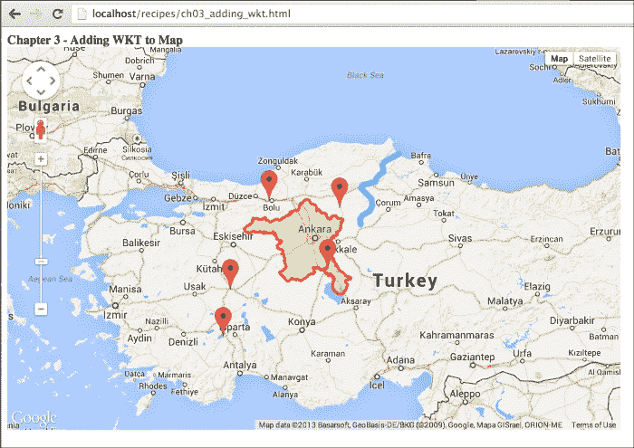

这就是我们将多种类型的几何形状添加到地图中的方法。

## 它是如何工作的...

WKT 是我们之前定义的矢量格式，与 GeoJSON 不同。GeoJSON 定义了地球特征的几何和属性，但 WKT 仅用于定义几何。以下表格展示了 WKT 的简单类型示例：

| 几何类型 | WKT 示例 |
| --- | --- |
| POINT | POINT(31.541742 40.730608) |
| POLYLINE | LINESTRING(35.24414 41.742627, 34.859619 41.586688, 34.7717285 41.508577, 34.832153 41.364441) |
| POLYGON | POLYGON((33.759299 38.779907, 33.73552 38.758208, 33.73187 38.748987, 33.703537 38.723535, 33.677514 33.800384 38.876017, 33.783532 38.842548, 33.759299 38.779907)) |

WKT 几何与在*将 GeoJSON 添加到 Google Maps JavaScript API*配方中使用的几何完全相同，但它们是以 WKT 几何格式进行格式化的。由于它们的文本格式，WKT 几何并不是孤立的。因此，我们将它们放入一个带有`geom`属性的 JSON 文件中。这样做是为了便于解析。如果你有包含 WKT 几何的不同类型的格式，你应该用 JavaScript 解析它们。

首先，我们将读取 JSON 文件以获取 WKT 几何。我们将使用 jQuery 方法`getJSON()`读取本地 JSON 文件。jQuery 用于专注于 Google Maps JavaScript API，而不是为每个浏览器编写和修复 JavaScript 代码。否则，我们将在多个浏览器平台上处理远程文件读取。此方法获取`wkt.js`本地文件的内容，并将它们放入`data`变量中。然后，我们将使用 jQuery 方法`each()`遍历 JSON 对象。最后，我们获取每个对象的`geom`部分，并将其发送到稍后将要讨论的`drawGeometry()`函数：

```js
$.getJSON('wkt.js', function(data) {
  $.each(data.objects, function(key, val) {
    drawGeometry(val.geom);
  });
});
```

WKT 的解析比 GeoJSON 要困难得多，因为我们需要处理文本解析。使用`drawGeometry()`函数，我们将 WKT 文本分割成更小的数组并使它们变得有意义。在解析每种类型之前，我们需要获取它们的几何类型。由于它们没有单独的属性来定义类型，我们需要从 WKT 文本中提取类型。从示例中可以看出，类型是用`(`字符与坐标分开的。如果我们从`(`字符开始切片字符串，第一个数组元素就是几何类型的类型。这是按照以下方式完成的：

```js
var slices = geom.split('(');
var geomType = slices[0]; 
```

`geomType`的内容可以是`POINT`、`LINESTRING`或`POLYGON`。然后，我们将检查不同块中的每种几何类型。让我们从点类型开始逐一介绍每种几何类型。

点是使用 JavaScript 解析的最简单的 WKT 几何形状。首先，我们获取`slice`数组的第二个元素，并从`)`字符开始切片，只获取由逗号分隔的坐标。然后，我们将结果文本按逗号分割成一个数组。这个数组只有一个元素，因此我们可以轻松访问坐标。要访问坐标，我们必须使用空格字符切片最终文本。这个最终数组包含纬度和经度。Google Maps JavaScript API 使用纬度和经度来定义一个点，但 WKT 使用经度和纬度的顺序来定义一个点。如*将 GeoJSON 添加到 Google Maps JavaScript API*菜谱中所述，坐标的顺序对于 WKT 也是相同的，它是与 Google Maps JavaScript API 相反的顺序，即经度和纬度：

```js
var coords = slices[1].split(')')[0].split(',');
var finalCoords = coords[0].split(' ');
var coordinate = new google.maps.LatLng(finalCoords[1], finalCoords[0]);
```

第二种类型是 WKT 中定义为`LINESTRING`的折线。解析折线比解析点要复杂得多。首先，我们通过分割`)`和逗号来获取坐标数组，如前所述。然后，我们将在这个数组中迭代以获取每个坐标。在用空格分割文本之前，我们必须检查文本开头是否有空格。如果有空格，我们将获取文本的其余部分以获取有效的纬度和经度的数字。

```js
var coords = slices[1].split(')')[0].split(',');
var pointCount = coords.length;
var linePath = [];
for (var i=0; i < pointCount; i++) {
  if (coords[i].substring(0,1) == ' ') {
    coords[i] = coords[i].substring(1);
  }
  var finalCoords = coords[i].split(' ');
  var tempLatLng = new google.maps.LatLng(finalCoords[1], finalCoords[0]);
  linePath.push(tempLatLng);
}
```

最后，简单类型是多边形，在 WKT 中也定义为`POLYGON`。解析多边形与解析折线非常相似，除了多边形定义有两个括号，比折线多一个。我们将获取数组的第三个元素而不是第二个，因为 WKT 可以包含多个多边形几何形状，所以在这种情况下我们只有一个。如果您有多个几何形状，那么您应该遍历这些几何形状。唯一的区别如下：

```js
var coords = slices[2].split(')')[0].split(',');
```

在`drawGeometry()`函数中编写的代码块可能看起来很复杂，但它们并不复杂，因为我们将在本章中使用为添加标记、线和多边形编写的所有代码。这个菜谱的结果与*将 GeoJSON 添加到*Google Maps JavaScript API 的菜谱完全相同，这是预期的结果。我们并不想象在改变矢量格式时我们会得到不同的输出。

在这个菜谱中，我们将使用我们自己的函数处理 WKT，而这些函数无法绘制其标准中定义的所有 WKT 几何形状。我们只处理简单的几何形状，以向您展示如何自行处理 WKT。如果您需要处理更复杂的 WKT 几何形状，那么有两种方法。一种方法是通过阅读 WKT 的完整规范并将其添加到您的函数中。另一种，更简单的方法是使用为此工作而专门编写的库。有一个名为**Wicket**的库，由*K. Arthur Endsley*在 GitHub 上编写([`github.com/arthur-e/Wicket`](https://github.com/arthur-e/Wicket))。借助这个库，您无需处理 WKT 规范。您只需添加具有您自己风格的几何形状即可。

## 参见

+   在 第一章 的 *在自定义 DIV 元素中创建简单地图* 配方，*Google Maps JavaScript API 基础*

+   向地图添加 *标记* 的配方

+   向地图添加 *线条* 的配方

+   向地图添加 *多边形* 的配方

+   将 *GeoJSON 添加到* *Google Maps JavaScript API* 的配方
