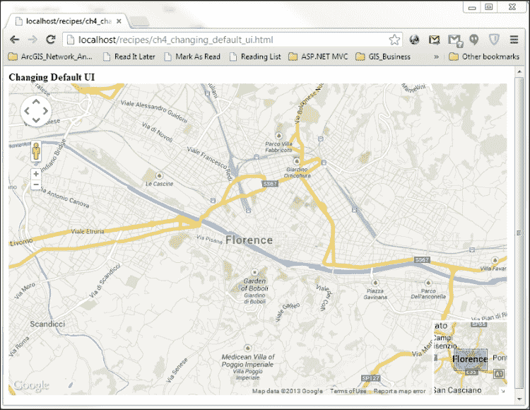
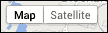
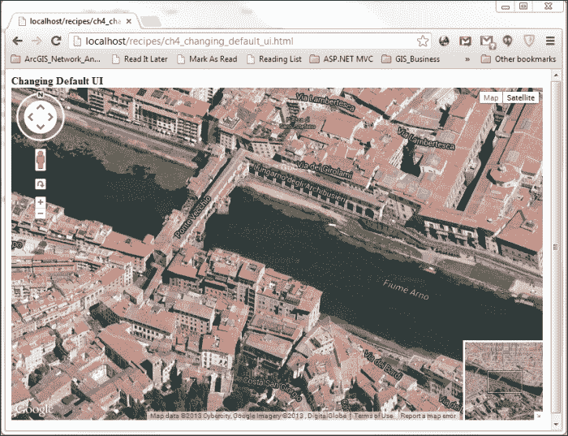
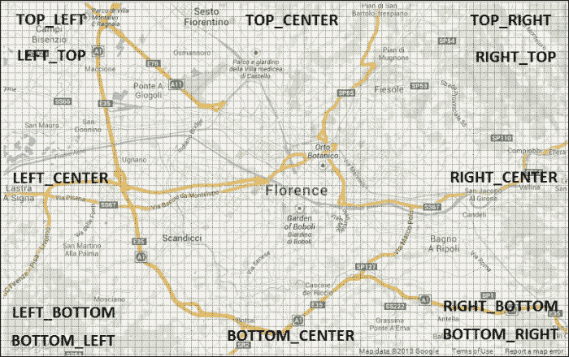
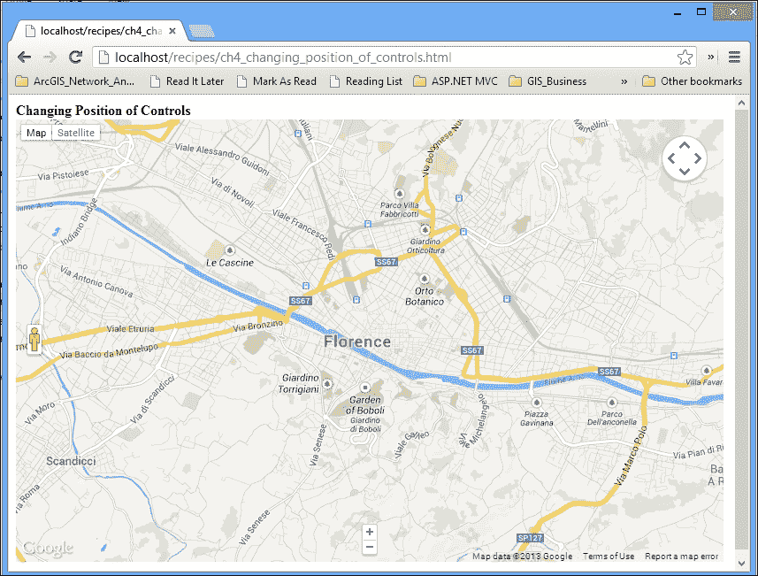
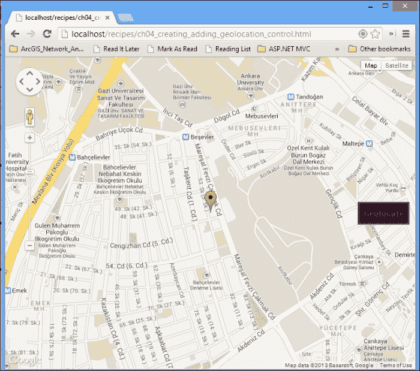
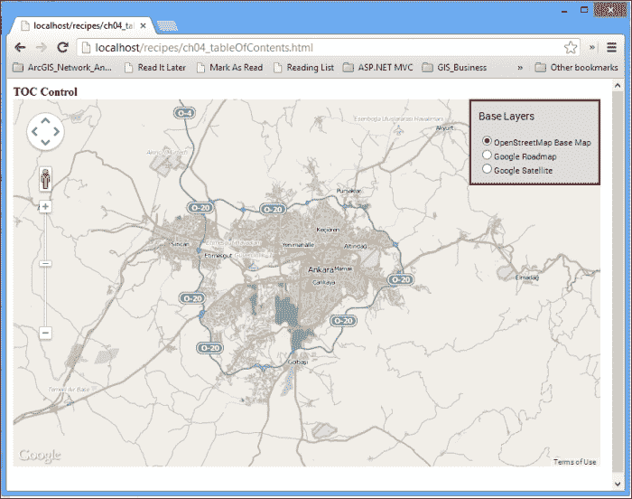
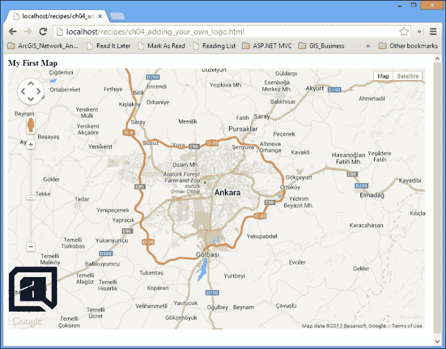

# 第四章 使用控件

在本章中，我们将涵盖：

+   添加和删除控件

+   改变控件的位置

+   创建并添加地理位置控件

+   为图层创建目录控件

+   添加自己的标志作为控件

# 简介

本章涵盖了 Google Maps JavaScript API 中找到的控件。一般来说，控件是与用户交互的 UI 元素。在非常基本的层面上，它们由简单的 HTML 元素或它们的组合组成。

控件使用户能够平移地图、放大或缩小、测量距离或面积等。复杂的控件涉及以目录控件（**目录**）或绘图矢量特征编辑工具栏的形式管理多个叠加层（在第二章，*添加栅格图层*）。

Google Maps JavaScript API 为开发者提供了使用和自定义内置控件的机会，以及从头开始构建自定义控件。

本章将首先详细讨论处理内置控件及其配置，包括 UI 的自定义。然后，从非常基础的控件到复杂的控件（如目录）的创建将被涵盖。

# 添加和删除控件

Google Maps 默认 UI 包含一些默认显示或满足某些条件时显示的控件。这些包括：

+   缩放控制

+   平移控制

+   地图类型控制

+   规模控制

+   街景控制

+   旋转控制

+   概览地图控制

Google Maps JavaScript API 为开发者提供了选择加入或退出这些控件或根据功能或外观进行自定义的机会。

在这个菜谱中，我们将介绍通过添加或删除内置控件来改变 UI 的方法，以及如何通过提供的选项更改它们的属性。

## 准备工作

第一章的第一道菜谱，*Google Maps JavaScript API 基础知识*，将完成我们的工作。我们将为此菜谱进行修改。

## 如何操作…

如果您执行以下步骤，您将选择内置控件的外观：

1.  按照以下方式修改`mapOptions`对象：

    ```js
    var mapOptions = {
      center: new google.maps.LatLng(43.771094,11.25033),
      zoom: 13,
      mapTypeId: google.maps.MapTypeId.ROADMAP,
      panControl: true,
      scaleControl: false,
      zoomControl: true,
      zoomControlOptions: {
        style: google.maps.ZoomControlStyle.SMALL
      },
      overviewMapControl: true,
      overviewMapControlOptions: {
        opened: true
      },
      mapTypeControl: false
    }
    ```

    

您可以根据前一个截图显示的样式，根据您的喜好将内置控件设置为开启或关闭。

## 它是如何工作的...

您可能已经注意到，我们在`mapOptions`对象中添加了很多内容。这是因为您可以在`google.maps.mapOptions`对象中使控件可见或不可见：

```js
panControl: true,
scaleControl: false,
zoomControl: true,
mapTypeControl: false,
overviewMapControl: true
```

通过分配布尔值（true/false），您可以显示`panControl`、`zoomControl`和`overviewMapControl`，而`scaleControl`和`mapTypeControl`则被隐藏。

一些控件默认显示。例如，我们未在`mapOptions`对象中提及`streetViewControl`；然而，由于默认存在，它在界面中显示。内置控件及其在 UI 中的默认存在如下：

| 控件名称 | 默认存在 |
| --- | --- |
| 缩放控件 | 是 |
| 平移控件 | 是 |
| 比例尺控件 | 否 |
| 地图类型控件 | 是 |
| 街景控件 | 是 |
| 旋转控件 | 是（用于斜视图像） |
| 概览地图控件 | 否 |

虽然 `rotateControl` 默认显示，但您可能已经注意到它未出现在界面中，因为它仅在显示斜视图像时出现。按照以下方式调整 `mapOptions` 对象，我们可以查看控件：

1.  启用 `mapTypeControl` 以在 UI 中选择卫星图像，如图中所示：

    ```js
      mapTypeControl: true
    ```

    

您可以在前面的截图中看到 `mapTypeControl`。

在某些位置提供斜视图像（45 度图像），并且无论何时存在，`mapTypeControl` 都会更新自身，包括用于显示斜视图像的下拉菜单切换。

`RotateControl` 控件位于平移和缩放控件之间。它允许用户以 90 度间隔旋转斜视图像。此外，平移控件也被修改为带有环形，以便在显示斜视图像时更改其航向：



## 还有更多...

Google Maps JavaScript API 允许我们不仅可以在开和关之间切换内置控件，还可以自定义它们的属性和样式。例如：

```js
overviewMapControlOptions: {
  opened: true
}
```

这将概述地图控件设置为 `打开` 状态。请记住，概述地图控件的默认状态是折叠的，并且此设置在您应用程序开始时将控件设置为 `打开`。您可以通过按控件右下角的小箭头来随时折叠或打开控件。

对于缩放控件，菜谱中提供的选项如下：

```js
zoomControlOptions: {
  style: google.maps.ZoomControlStyle.SMALL
}
```

此选项将缩放控件样式设置为小，包含两个小按钮，一个用于放大，另一个用于缩小。`zoomControlOptions` 的 `style` 属性的其他选项如下：

```js
google.maps.ZoomControlStyle.LARGE
google.maps.ZoomControlStyle.DEFAULT
```

`LARGE` 选项将缩放控件显示为长棒状，您可以在不同的缩放级别之间进行切换。`DEFAULT` 选项根据屏幕大小决定显示大缩放控件还是小缩放控件。

您可能已经注意到，控件的选项由带有 `Options` 后缀的对象处理。同样，`mapTypeControl` 也有 `MapTypeControlOptions` 对象中的选项。在代码中添加以下行将进行一些修改：

```js
mapTypeControl: true,
mapTypeControlOptions: {
  mapTypeIds: [google.maps.MapTypeId.ROADMAP, google.maps.MapTypeId.HYBRID],
  style: google.maps.MapTypeControlStyle.DROPDOWN_MENU
}
```

`mapTypeControlOptions`属性中的设置使得`mapTypeControl`只提供`ROADMAP`和`HYBRID`地图类型，因此你将无法选择`SATELLITE`和`TERRAIN`地图类型。正如你从第二章中回忆的那样，*添加栅格图层*，`mapTypeIds`属性不仅接受内置地图类型，还可以通过`StyledMapType`对象接受样式化地图类型，以及通过`ImageMapType`对象接受任何瓦片图像源——无论是作为基础地图还是叠加地图。

第二个属性`style`将`mapTypeControl`设置为以下拉菜单的形式显示，而不是标准水平栏。`mapTypeControlOptions`的`style`属性的其它选项包括：

```js
google.maps.MapTypeControlStyle.HORIZONTAL_BAR
google.maps.MapTypeControlStyle.DEFAULT
```

`DEFAULT`选项是动态选择缩放控制，根据屏幕大小以水平栏或下拉菜单的形式显示。

### 注意

**控制选项的完整列表**

控制选项的完整列表可以在 Google Maps JavaScript API 参考文档的 URL 中找到 [`developers.google.com/maps/documentation/javascript/reference`](https://developers.google.com/maps/documentation/javascript/reference)。

# 更改控制的位置

Google Maps 的控制有它们默认的位置，Google Maps JavaScript API 提供了改变这些默认位置的一定灵活性。你还可以根据 UI 中提供的以下截图中的位置来放置你的自定义控制：



前面的截图显示了你可以放置控制的可能位置。值得注意的是，**TOP_LEFT**不等于**LEFT_TOP**，其中**TOP_LEFT**是顶部第一个。

在这个菜谱中，我们将描述如何在 Google Maps UI 中指定控制的位置。

## 准备工作

这个菜谱基于上一个菜谱的代码；因此，拥有那个代码将完成我们的大部分工作。

## 如何做到这一点...

你可以使用以下步骤来刷新控制的位置：

1.  完全更新`mapOptions`对象如下：

    ```js
    var mapOptions = {
      center: new google.maps.LatLng(43.771094,11.25033),
      zoom: 13,
      mapTypeId: google.maps.MapTypeId.ROADMAP,
      panControl: true,
      panControlOptions: {
        position:google.maps.ControlPosition.TOP_RIGHT
      },
      zoomControl: true,
      zoomControlOptions: {
        style: google.maps.ZoomControlStyle.SMALL,
        position: google.maps.ControlPosition.BOTTOM_CENTER
      },
      mapTypeControl: true,
      mapTypeControlOptions: {
        position: google.maps.ControlPosition.LEFT_TOP
      },
      streetViewControlOptions: {
        position: google.maps.ControlPosition.LEFT_CENTER
      }
    };
    ```

    

你可以根据自己的喜好在地图 UI 中更改控制的位置，就像你在前面的截图中所观察到的。

## 它是如何工作的...

在`mapOptions`对象中，我们通过每个控制在其自己的选项中指定的`position`属性来指定每个控制的位置，就像你在以下代码片段中看到的那样：

```js
mapTypeControlOptions: {
  position: google.maps.ControlPosition.LEFT_TOP
}
```

以下代码将`mapTypeControl`放置在地图`div`元素的左上角，而`panControl`放置在右上角：

```js
panControlOptions:{
  position: google.maps.ControlPosition.TOP_RIGHT
},
```

### 注意

**控制位置的完整列表**

控制位置的完整列表可以在 Google Maps JavaScript API 参考文档的 URL 中找到（[`developers.google.com/maps/documentation/javascript/reference#ControlPosition`](https://developers.google.com/maps/documentation/javascript/reference#ControlPosition)）。

# 创建并添加地理位置控制

Google Maps UI 在之前的菜谱中引入了许多内置控制。这些控制满足了许多需求，如平移、缩放和更改地图类型。然而，用户的需求是无限的，用户可能非常具有创造性。不可能为每个需求提供内置控制。

相反，Google Maps JavaScript API 为满足每个特定需求提供了创建自定义控制的路径。自定义控制基本上是简单 HTML 元素包裹在一个单一元素中，通常是 `<div>` 元素。

在本菜谱中，我们将介绍创建自定义控制、将其放置在 Google Maps UI 上以及通过事件处理程序使用它的基础知识。

## 准备工作

本菜谱将基于在 第一章 中介绍的 *从 Web 移动到移动设备* 菜谱，*Google Maps JavaScript API 基础*。我们的菜谱将利用此菜谱中的地理位置代码片段；因此，回顾此菜谱将很有帮助。

## 如何做到这一点…

如果你执行以下步骤，你将拥有一个全新的自定义地理位置控制：

1.  首先，创建一个 JavaScript 对象，它将成为我们最终的自定义控制（构造函数将接受两个参数，将在后续步骤中解释）：

    ```js
    function GeoLocationControl(geoLocControlDiv, map){
    }
    ```

1.  在 `GeoLocationControl` 类内部，将 `class` 属性设置为包含构造函数中作为第一个参数引用的 `div` 元素：

    ```js
    geoLocControlDiv.className = 'controlContainer';
    ```

1.  在 `GeoLocationControl` 类内部，设置内部 HTML `div` 元素的详细信息，包括其 `class` 属性，以便此元素看起来像一个按钮：

    ```js
    var controlButton = document.createElement('div');
    controlButton.className = 'controlButton';
    controlButton.innerHTML = 'Geolocate';
    ```

1.  按如下方式将此内部 `div` 元素（`controlButton`）添加到容器 `div` 元素中：

    ```js
    geoLocControlDiv.appendChild(controlButton);
    ```

1.  在 `GeoLocationControl` 类内部为 `controlButton` 添加 `click` 事件监听器：

    ```js
    google.maps.event.addDomListener(controlButton, 'click', function() {
      if (navigator.geolocation) {
        navigator.geolocation.getCurrentPosition(function(position) {
            var lat = position.coords.latitude;
            var lng = position.coords.longitude;
            var devCenter = new google.maps.LatLng(lat, lng);
            map.setCenter(devCenter);
            map.setZoom(15);

            var marker = new google.maps.Marker({
              position: devCenter,
              map: map,
            });

        });
      }
    });
    ```

1.  现在，在所有菜谱中使用的普通 `initMap()` 函数中，除了标准的 `map` 和 `mapOptions` 对象的定义外，还需要添加容器 HTML `div` 元素：

    ```js
    var geoLocationControlDiv = document.createElement('div');
    ```

1.  在 `initMap()` 中实例化自定义控制类，即 `GeoLocationControl` 类，提供两个参数：前一步骤中创建的容器 `div` 元素和 `map` 对象本身：

    ```js
    var geoLocationControl = new GeoLocationControl(geoLocationControlDiv, map);
    ```

1.  将自定义控制放置在地图 UI 中的其他控制之间：

    ```js
    map.controls[google.maps.ControlPosition.RIGHT_CENTER].push(geoLocationControlDiv);
    ```



你应该有一个像前面截图所示的功能齐全的自定义地理位置控制。

## 它是如何工作的…

与之前的菜谱相比，这个菜谱可能看起来有些复杂，但本质上，在 Google Maps JavaScript API 中创建自定义控制只有一个重要点；你可以利用任何 HTML 元素作为自定义控制。实际上，以下简单的代码片段就足以创建一个自定义控制：

```js
var controlDiv = document.createElement('div');
map.controls[google.maps.ControlPosition.RIGHT_CENTER].push(controlDiv);
```

此代码创建了一个 HTML `div`元素，并将其添加到`map`对象的控件数组中。控件数组是一个二维数组，第一维是`google.maps.ControlPosition`类中定义的可用位置，第二维是控件。这个没有标签的透明控件将执行任何操作，因为没有为`div`元素编写事件处理代码；然而，这一现实并不改变这是一个自定义控件的事实。

其他细节，如 CSS 样式、填充属性和事件处理，对于专业自定义控件在地图 UI 用户中的应用是必要的。

在我们的示例中，我们选择创建一个 JavaScript 类来封装所有这些细节，以便于结构化：

```js
function GeoLocationControl(geoLocControlDiv, map)
{
}
```

我们的类构造函数使用了两个元素：容器`div`元素和`map`对象。它需要容器`div`元素的引用，以便将子元素`controlButton`添加到其中：

```js
geoLocControlDiv.appendChild(controlButton);
```

`controlButton`对象（一个 HTML `div`元素）必须响应用户发起的一些事件，以便自定义控件有用且有意义：

```js
google.maps.event.addDomListener(controlButton, 'click', 
function() {

});
```

`google.maps.event.addDomListener`方法充当事件处理程序注册，它在每个浏览器上都以相同的方式工作。这些方法和事件相关主题将在第五章*理解 Google Maps JavaScript API 事件*中介绍。现在，了解`click`事件，该事件将由`controlButton`对象监听，就足够了。

从第一章中提取的地理位置代码，*Google Maps JavaScript API 基础知识*，位于`addDomListener`方法内部，利用了浏览器的地理位置 API。如果支持地理位置 API 并且成功获取了位置，就会在地图上为该位置添加一个标记：

```js
var marker = new google.maps.Marker({
  position: devCenter,
  map: map,
});
```

整个创建子元素和事件处理逻辑的过程都被封装在一个 JavaScript 类构造函数中，该构造函数如下所示：

```js
var geoLocationControl = new GeoLocationControl(geoLocationControlDiv, map);
```

以下是需要完成此任务所需的唯一其他代码片段：

```js
map.controls[google.maps.ControlPosition.RIGHT_CENTER].push(geoLocationControlDiv);
```

值得注意的是，`controls`数组将容器`div`元素作为自定义控件。同时，请记住，`controls[google.maps.ControlPosition.RIGHT_CENTER]`在其他场景中可能已经包含其他控件。我们使用`push`是为了不替换现有的控件。

# 为图层创建目录控件

在桌面 GIS 软件中，如 ArcGIS 桌面、Mapinfo 和 Geomedia，表目录（ToC）控件以及 UI 元素非常常见。同样，它们的 Web 对应版本也在 UI 中大量使用 ToC，包括 ArcGIS 和.Net Web 组件。

目录的主要用途是打开和关闭各种栅格或矢量图层，以便叠加和查看数据的多个层次。对于矢量图层，选项可以通过允许用户根据目录更改矢量图层的符号来丰富。

Google Maps UI 没有内置的目录控制；然而，通过构建自定义控制的灵活性，实际上有无限的可能性。

Google Maps JavaScript API 允许开发者利用第三方基础地图，如 OpenStreetMaps，或在基础地图上显示覆盖的栅格图层（在第二章*添加栅格图层*中详细讨论）。此外，在第三章*添加矢量图层*中，各种类型的矢量数据已在相应的菜谱中叠加。

在这个菜谱中，我们只将基础地图添加到我们的目录中，以便了解结构，包括保持控制的状态和为多个 HTML 元素（这些元素被一个控制包裹）提供多个事件处理程序。当然，这种结构可以通过添加覆盖和矢量图层来丰富。

## 准备工作

本菜谱将使用第二章中*使用不同的瓦片源作为基础地图*的菜谱，*添加栅格图层*。在开始当前菜谱之前回顾这个菜谱将非常有帮助。此外，为了理解如何创建一个简单的自定义控制，前一个菜谱将是关键。

## 如何操作…

以下是在 Google Maps UI 中创建一个工作目录控制的步骤：

1.  创建一个 JavaScript 类，该类将包含所有我们的子控件和事件处理程序（直到步骤 12，所有代码都将嵌入到这个类构造函数中）：

    ```js
    function TableOfContentsControl(tocControlDiv, map){
    }
    ```

1.  将`this`作为一个变量，因为它在事件处理程序中将超出作用域：

    ```js
    var tocControl = this;
    ```

1.  在类构造函数中设置容器`div`元素的 CSS 属性：

    ```js
    tocControlDiv.className ='tocControl';
    ```

1.  设置目录标题：

    ```js
    var tocLabel = document.createElement('label');
    tocLabel.appendChild(document.createTextNode('Base Layers'));
    tocControlDiv.appendChild(tocLabel);
    ```

1.  创建一个单选按钮用于**OpenStreetMap 基础地图**：

    ```js
    var osmStuffDiv = document.createElement('div');

    var osmRadioButton = document.createElement('input');
    osmRadioButton.type = 'radio';
    osmRadioButton.name = 'BaseMaps';
    osmRadioButton.id = 'OSM';
    osmRadioButton.checked = false;

    var osmLabel = document.createElement('label');
    osmLabel.htmlFor = osmRadioButton.id;
    osmLabel.appendChild(document.createTextNode('OpenStreetMap Base Map'));

    osmStuffDiv.appendChild(osmRadioButton);
    osmStuffDiv.appendChild(osmLabel);
    ```

1.  创建一个单选按钮用于**Google Roadmap**基础地图：

    ```js
    var roadmapStuffDiv = document.createElement('div');

    var roadmapRadioButton = document.createElement('input');
    roadmapRadioButton.type = 'radio';
    roadmapRadioButton.name = 'BaseMaps';
    roadmapRadioButton.id = 'Roadmap';
    roadmapRadioButton.checked = true;

    var roadmapLabel = document.createElement('label');
    roadmapLabel.htmlFor = roadmapRadioButton.id;
    roadmapLabel.appendChild(document.createTextNode('Google Roadmap'));

    roadmapStuffDiv.appendChild(roadmapRadioButton);
    roadmapStuffDiv.appendChild(roadmapLabel);
    ```

1.  创建一个单选按钮用于**Google 卫星地图**基础地图：

    ```js
    var satelliteStuffDiv = document.createElement('div');

    var satelliteRadioButton = document.createElement('input');
    satelliteRadioButton.type = 'radio';
    satelliteRadioButton.name = 'BaseMaps';
    satelliteRadioButton.id = 'Satellite';
    satelliteRadioButton.checked = false;

    var satelliteLabel = document.createElement('label');
    satelliteLabel.htmlFor = roadmapRadioButton.id;
    satelliteLabel.appendChild(document.createTextNode('Google Satellite'));

    satelliteStuffDiv.appendChild(satelliteRadioButton);
    satelliteStuffDiv.appendChild(satelliteLabel);
    ```

1.  将所有单选按钮及其标签放入父`div`元素中：

    ```js
    tocControlDiv.appendChild(osmStuffDiv);
    tocControlDiv.appendChild(roadmapStuffDiv);
    tocControlDiv.appendChild(satelliteStuffDiv);
    ```

1.  创建`osmRadioButton`的`click`事件处理程序（`setActiveBasemap`和`getActiveBasemap`方法将在以下代码中阐明）：

    ```js
    google.maps.event.addDomListener(osmRadioButton, 'click', 
    function() {
         if (osmRadioButton.checked) {
             tocControl.setActiveBasemap('OSM');
             map.setMapTypeId(tocControl.getActiveBasemap());
          }
    });
    ```

1.  创建`roadmapRadioButton`的`click`事件处理程序如下：

    ```js
    google.maps.event.addDomListener(roadmapRadioButton, 
    'click', function() {
        if (roadmapRadioButton.checked){
            tocControl.setActiveBasemap
    (google.maps.MapTypeId.ROADMAP);
            map.setMapTypeId(tocControl.getActiveBasemap());
         }
    });
    ```

1.  创建`satelliteRadioButton`的`click`事件处理程序：

    ```js
    google.maps.event.addDomListener(satelliteRadioButton, 
    'click', function() {
         if (satelliteRadioButton.checked) {
              tocControl.setActiveBasemap
    (google.maps.MapTypeId.SATELLITE);
              map.setMapTypeId(tocControl.getActiveBasemap());
           }
    });
    ```

1.  在`TableOfContentsControl`类构造函数外部，定义一个用于保持活动基础地图的属性：

    ```js
    TableOfContentsControl.prototype._activeBasemap = null;
    ```

1.  定义`_activeBasemap`属性的获取器和设置器方法：

    ```js
    TableOfContentsControl.prototype.getActiveBasemap = 
    function() {
      return this._activeBasemap;
    };

    TableOfContentsControl.prototype.setActiveBasemap = 
    function(basemap) {
      this._activeBasemap = basemap;
    };
    ```

1.  在`initMap()`函数中，定义`mapOptions`对象如下：

    ```js
    var mapOptions = {
      center: new google.maps.LatLng(39.9078, 32.8252),
      zoom: 10,
      mapTypeControlOptions: {
        mapTypeIds: [google.maps.MapTypeId.ROADMAP, google.maps.MapTypeId.SATELLITE, 'OSM']
      },
      mapTypeControl: false
    };
    ```

1.  将`osmMapType`对象定义为`ImageMapType`：

    ```js
    var osmMapType = new google.maps.ImageMapType({
      getTileUrl: function(coord, zoom) {
        return 'http://tile.openstreetmap.org/' + zoom + '/' + coord.x + '/' + coord.y + '.png';
      },
      tileSize: new google.maps.Size(256, 256),
      name: 'OpenStreetMap',
      maxZoom: 18
    });
    ```

1.  将`'OSM' mapTypeId`对象关联到`osmMapType`对象：

    ```js
    map.mapTypes.set('OSM', osmMapType);
    ```

1.  设置启动时的`mapTypeId`：

    ```js
    map.setMapTypeId(google.maps.MapTypeId.ROADMAP);
    ```

1.  创建容器 `div` 元素，实例化 `TableOfContentsControl` 类，并将容器 `div` 元素定位为自定义控件：

    ```js
    var tableOfContentsControlDiv = document.createElement('div');

    var tableOfContentsControl = new TableOfContentsControl(tableOfContentsControlDiv, map);

    map.controls[google.maps.ControlPosition.TOP_RIGHT].push(tableOfContentsControlDiv);
    ```

    

你应该在地图的 UI 中拥有自己的目录控件作为自定义控件，如前一个屏幕截图所示。

## 它是如何工作的...

这个配方实际上与之前的配方具有相同的结构；然而，自定义控件中有 HTML 元素使其看起来更复杂。我们将逐步查看细节，以便事情变得清晰。与之前的配方一样，我们首先创建了一个 JavaScript 类构造函数，它嵌入所有细节，包括必要的单选按钮及其事件处理程序：

```js
function TableOfContentsControl(tocControlDiv, map){
}
```

嵌入在 `TableOfContentsControl` 中的 `osmRadioButton` 单选按钮部分如下：

```js
var osmRadioButton = document.createElement('input');
osmRadioButton.type = 'radio';
osmRadioButton.name = 'BaseMaps';
osmRadioButton.id = 'OSM';
osmRadioButton.checked = false;

var osmLabel = document.createElement('label');
osmLabel.htmlFor = osmRadioButton.id;
osmLabel.appendChild(document.createTextNode('OpenStreetMap Base Map'));

tocControlDiv.appendChild(osmRadioButton);
tocControlDiv.appendChild(osmLabel);

google.maps.event.addDomListener(osmRadioButton, 'click', 
function() {
    if (osmRadioButton.checked) {
        tocControl.setActiveBasemap('OSM');
        map.setMapTypeId(tocControl.getActiveBasemap());
    }
});
```

之前为 `osmRadioButton` 的代码与 `roadmapRadioButton` 和 `satelliteRadioButton` 相同。该代码创建单选按钮及其关联的标签，将其添加到容器 `div` 元素（这是构造函数的第一个参数引用），然后为单选按钮注册 `click` 事件。

`click` 事件检查单选按钮是否被选中，然后——如果被选中——它将活动基础地图设置为 OSM 基础地图。然后，它使用活动基础地图信息来设置地图的 `mapTypeId`；这作为构造函数的第二个参数引用。

要设置和获取活动基础地图信息，使用了两种方法：

```js
setActiveBasemap('OSM')
getActiveBasemap()
```

这些方法在构造函数外部定义如下：

```js
TableOfContentsControl.prototype.getActiveBasemap = function() {
  return this._activeBasemap;
};

TableOfContentsControl.prototype.setActiveBasemap = 
function(basemap) {
     this._activeBasemap = basemap;
};
```

在这里，定义了 `_activeBasemap` 局部变量：

```js
TableOfContentsControl.prototype._activeBasemap = null;
```

这里有一个微小但重要的细节。为了使 `click` 事件处理程序能够看到 `TableOfContentsControl` 对象的获取器和设置器方法，我们添加了一行代码：

```js
var tocControl = this;
```

在这里，`this` 在事件处理程序内部将超出作用域。

OpenStreetMap 基础地图部分位于 `initMap()` 函数中。如何显示外部基础地图的详细信息在 第二章 *添加栅格图层* 中有介绍，因此无需详细说明。

最后一件工作实际上是在 UI 中运行控件。因为我们没有调用 `TableOfContentsControl` 的构造函数，所以不会显示为自定义目录控件。但在拥有目录控件之前，我们必须在 `mapOptions` 对象中预留一些空间：

```js
mapTypeControlOptions: {
  mapTypeIds: [google.maps.MapTypeId.ROADMAP, google.maps.MapTypeId.SATELLITE, 'OSM']
},
mapTypeControl:false
```

在 `mapTypeControlOptions` 中，我们在 `mapTypeIds` 属性中列出地图的可能地图类型 ID。

然而，我们不再需要 `maptypeControl`，因为我们会有目录控件；因此，我们将 `mapTypeControl` 属性设置为 `false`。

然后是最后一个阶段：放置自定义的目录控件：

```js
var tableOfContentsControlDiv = document.createElement('div');

var tableOfContentsControl = new TableOfContentsControl(tableOfContentsControlDiv, map);

map.controls[google.maps.ControlPosition.TOP_RIGHT].push(tableOfContentsControlDiv);
```

首先，我们创建一个任意的`div`，它将作为自定义控件的容器`div`元素。然后，我们调用`TableOfContentsControl`类的构造函数，将容器`div`元素和`map`对象作为参数传递。之后，通过将容器`div`元素添加到控制`map`对象的二维控件数组中，即`mapTypeControl`中的默认位置，帷幕落下；也就是说，`google.maps.ControlPosition.TOP_RIGHT`。

# 添加自定义标志作为控件

Google Maps JavaScript API 以非常灵活的方式设计了自定义控件的添加，这样你可以在一个 HTML `div`元素中拥有不同类型的 HTML 元素。

添加你选择的标志，例如在你的应用程序的地图 UI 上添加你公司的标志，是自定义化的好迹象，也展示了你的工作。

在本食谱中，我们将使用 Google Maps JavaScript API 在地图 UI 中显示一个标志作为控件。

## 准备工作

本食谱将使用第一章的第一个食谱，即*Google Maps JavaScript API 基础*，因为我们只需要基础知识来开发这个食谱。

## 如何操作…

以下是在 Google Maps UI 中显示标志作为自定义控件的步骤：

1.  在`initMap()`函数中创建`map`对象后，创建容器`div`元素：

    ```js
    var logoDiv = document.createElement("div");
    ```

1.  然后，创建包含你首选标志的 HTML `img`元素：

    ```js
    var logoPic = document.createElement("img");
    logoPic.src = "ch04_logo.PNG";
    logoPic.id = "CompanyLogo";
    ```

1.  将`img`元素插入到容器`div`元素中：

    ```js
    logoDiv.appendChild(logoPic);
    ```

1.  将容器`div`元素添加到`map`对象的`controls`数组中：

    ```js
    map.controls[google.maps.ControlPosition.LEFT_BOTTOM].push(logoDiv);
    ```

    

你可以在地图的 UI 中以自定义控件的形式拥有你喜欢的标志，如前一个截图所示。

## 工作原理...

本食谱的代码实际上是 Google Maps JavaScript API 中自定义控件的最简单形式。没有为控件设置事件处理器，也没有与控件相关的状态信息。唯一存在的是控件本身，即容器 div `logoDiv`元素。

`logoPic`元素和`img`元素保持对标志文件的引用，并嵌入到`logoDiv`中：

```js
var logoPic = document.createElement("img");
logoPic.src = "ch04_logo.PNG";
logoDiv.appendChild(logoPic);
```

最后，将`logoDiv`添加到`controls`数组中的**LEFT_BOTTOM**位置。当你打开应用程序时，你可以在地图 UI 中指定位置看到你的标志。
