# 第二章：构建一个世界

本章将详细解释 Three.js 场景的组成部分，包括不同的渲染器、几何体、材质和照明。我们还将构建一个程序生成的城市。

# 几何体

几何体是 `THREE.Geometry` 的实例，用于定义场景中对象的形状。它们由顶点和面（这些面本身也是对象，可以通过 `vertices` 和 `faces` 数组属性访问）组成。顶点是表示三维空间中点的 `THREE.Vector3` 对象，而面是表示三角形表面的 `THREE.Face3` 对象。（所有更复杂的形状都细分成三角形面以进行渲染。）

幸运的是，直接处理顶点和面通常是不必要的，因为 `THREE.Geometry` 有许多子类可以帮助创建常用的形状。

## 3D 基本形状

Three.js 提供了生成常见形状的多个类。每个类型的官方文档可在 [`threejs.org/docs/`](http://threejs.org/docs/) 找到，但以下表格显示了常见类型的摘要（省略了一些不常见、可选的构造函数参数）：

| 类型 | 构造函数 | 描述 |
| --- | --- | --- |
| 立方体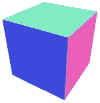 |

```js
THREE.CubeGeometry(width, height, depth, widthSegments = 1, heightSegments = 1,
depthSegments = 1)
```

| 它是一个具有指定尺寸的矩形盒子。`segments` 参数将侧面分割成更小的矩形。 |
| --- |
| 球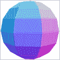 |

```js
THREE.Sphere(radius, horizontalSegments = 8, verticalSegments = 6)
```

| 它是通过计算段来创建的球面近似。 |
| --- |
| 多面体（球状体）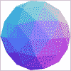 |

```js
THREE.Icosahedron(radius, detail = 0); 
THREE.Octahedron(radius, detail = 0);
THREE.Tetrahedron(radius, detail = 0);
```

| 它是基于具有 20、8 或 4 个边的形状的球面近似；`detail` 参数指定将每个边分割多少次以创建更多面，使形状更加球形。 |
| --- |
| 圆柱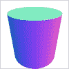 |

```js
THREE.CylinderGeometry(radiusTop, radiusBottom, height, radiusSegments = 8, heightSegments = 1, openEnded = false)
```

| `radiusSegments` 是连接顶部和底部面的边的数量，沿着曲面向下；`heightSegments` 是围绕曲面周围的面的环数，如果 `openEnded` 为 `true`，则圆柱的末端将不会渲染。 |
| --- |
| 环面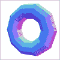 |

```js
THREE.TorusGeometry(radius, tubeWidth = 40, radialSegments = 8, tubularSegments = 6)
```

| 它是一个甜甜圈形状。 |
| --- |
| 环面结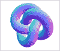 |

```js
THREE.TorusKnotGeometry(radius, tubeWidth = 40, radialSegments, tubularSegments, p = 2, q = 3, heightScale = 1)
```

| 它是一个类似结的形状，有点像椒盐卷饼。`p` 和 `q` 是影响结中扭曲数量的整数。 |
| --- |

您可以尝试将上一章中构建的旋转二十面体示例更改为使用不同的几何体，通过将 `IcosahedronGeometry` 构造函数更改为前面表格中的选项之一来实现。还有一个几何体查看器，位于 [`threejsplaygnd.brangerbriz.net/gui/`](http://threejsplaygnd.brangerbriz.net/gui/)，允许您调整构造函数参数以查看结果，还可以复制生成您正在查看的形状所需的代码。

## 2D 基本形状

Three.js 还提供了以下表格所示默认的二维形状几何体：

| 类型 | 构造函数 | 说明 |
| --- | --- | --- |
| 平面 |

```js
THREE.PlaneGeometry(width, height, widthSegments = 1, heightSegments = 1)
```

| 它是一个具有指定尺寸的矩形。`segments`参数将平面细分为更小的矩形。 |
| --- |
| 圆 |

```js
THREE.CircleGeometry(radius, numberOfSides = 8)
```

| 它是一个正多边形。 |
| --- |
| 环 |

```js
THREE.RingGeometry(innerRadius, outerRadius, radialSegments = 8, ringSegments = 8)
```

| 它是一个中间有孔的圆。 |
| --- |

这些形状默认沿 x 和 y 轴创建。

此外，Three.js 可以创建线条。你通常会在场景中放置的所有对象几乎都是网格，但线条是例外。考虑以下代码，它创建了一个网格：

```js
geometry = new THREE.IcosahedronGeometry(200, 2);
material = new THREE.MeshBasicMaterial({color: 0x000000});
mesh = new THREE.Mesh(geometry, material);
```

而不是使用前面的代码，你可以使用以下代码片段来创建一条线：

```js
geometry = new THREE.IcosahedronGeometry(200, 2);
material = new THREE.LineBasicMaterial({color: 0x000000});
mesh = new THREE.Line(geometry, material);
```

这可能会为标准几何体（如`IcosahedronGeometry`）产生一些奇怪的结果，因为线条将以意想不到的顺序连接点。相反，你通常会想创建一个自定义几何体，这样你就可以按照你想要的顺序添加顶点。

### 提示

使用`LineDashedMaterial`而不是`LineBasicMaterial`来创建虚线。

## 自定义几何体

几种默认的几何体类型允许根据开发者特别创建的顶点或路径创建形状。（你还可以导入在外部程序中创建的几何体，这是第四章添加细节中讨论的主题。）最基本类型是`THREE.Geometry`类本身。例如，你可以使用以下代码片段创建一个三角形：

```js
var geo = new THREE.Geometry();
geo.vertices = [
  new THREE.Vector3(0, 0, 0),
  new THREE.Vector3(0, 100, 0),
  new THREE.Vector3(0, 0, 100)
];
geo.faces.push(new THREE.Face3(0, 1, 2));
geo.computeBoundingSphere();
```

首先，这段代码创建了一个没有任何顶点或面的几何对象。然后，它添加了特定的顶点，其中每个顶点由一个表示在 x、y 和 z 轴上空间坐标的`THREE.Vector3`表示。接下来，将一个`THREE.Face3`添加到`faces`数组中。`Face3`构造函数的参数指示在几何体的`vertices`数组中使用的顶点索引，用于构成面的角。最后，计算边界球体，这会触发 Three.js 需要跟踪的内部计算，例如形状是否在视图中。如果你在自定义材质上正确显示纹理有困难，你可能还需要调用`geo.computeFaceNormals()`和`geo.computeVertexNormals()`。这些函数计算关于几何体视觉布局的附加信息。

手动创建由单个顶点组成的形状会很快变得令人疲倦；然而，一些实用工具存在以帮助使这个过程更快，如下表所示：

| 几何体 | 描述 |
| --- | --- |
| `THREE.LatheGeometry` | 它在一个圆内旋转一个形状 |
| `THREE.PolyhedronGeometry` | 这是一个椭球体；例如包括`IcosahedronGeometry`、`TetrahedronGeometry`等等 |
| `THREE.ExtrudeGeometry` | 它从 2D 形状开始并将其拉伸到 3D 空间 |
| `THREE.ShapeGeometry` | 它是一个 2D 形状 |
| `THREE.TubeGeometry` | 它是一个空心圆柱 |
| `THREE.ParametricGeometry` | 这些是弯曲的管子 |

以拉伸为例，这是一个相对常见的操作：

```js
var triangle = new THREE.Shape([
  new THREE.Vector2 (0,  50),
  new THREE.Vector2 (50, 50),
  new THREE.Vector2 (50,  0)
]);
var geometry = new THREE.ExtrudeGeometry(triangle, {
  bevelEnabled: false,
  amount: 30
});
```

这里的方法是创建一个由 (x, y) 坐标组成的 2D 形状 (`THREE.Shape`)，然后沿着 z 轴拉伸它。`ExtrudeGeometry` 的第二个参数是一个选项映射。其中最重要的一个选项是 `amount`，它控制形状拉伸的距离。`bevelEnabled` 控制拉伸的边缘是否为圆角。你可以在下面的屏幕截图中看到结果：

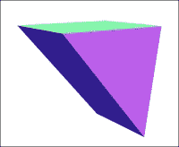

扩展三角形

其他自定义几何体的用例在游戏中不常见，因为通常如果你想要创建一个复杂形状，你可以在 3D 建模程序中创建一个模型，然后将其导入到 Three.js 中（这个过程在 第四章，*添加细节* 中有介绍）。

### 提示

有一个仅适用于 WebGL 的类 `THREE.BufferGeometry`，它的速度比 `THREE.Geometry` 快，但使用起来要困难得多，因为它存储的是 WebGL 缓冲区而不是 Three.js 的顶点和面。然而，Three.js 的未来发展中，默认的几何体将更类似于 `THREE.BufferGeometry`，这样你就不必考虑它们之间的差异。

## 文本

Three.js 可以使用几何体来渲染 3D 文本。要使用此功能，必须在 Three.js 库之后、自己的代码之前包含字体文件。例如，使用以下代码包含 Helvetiker 字体：

```js
<script src="img/helvetiker_bold.typeface.js"></script>
<script src="img/helvetiker_regular.typeface.js"></script>
```

（在生产项目中，你应该下载你想要使用的字体并将它们本地包含。）

Three.js 在 `examples/fonts` 目录中包含几个字体。自定义字体必须以 `typeface.js` 格式（你可以在 [`typeface.neocracy.org/fonts.html`](http://typeface.neocracy.org/fonts.html) 将 OpenType 和 TrueType 字体转换为 Typeface 格式）。使用以下代码创建文本几何体：

```js
new THREE.TextGeometry("Text message goes here", {
  size: 30,
  height: 20, // extrude thickness
  font: "helvetiker", // font family in lower case
  weight: "normal", // or e.g. bold
  style: "normal", // or e.g. italics
  bevelEnabled: false
});
```

`THREE.TextGeometry` 构造函数创建一个代表 2D 文本的形状，然后像我们的三角形一样将其拉伸。你可以在下面的屏幕截图中看到结果：


3D 文本

# 材质

材质是 `THREE.Material` 的实例，它定义了对象的外观。有几个常见的材质子类：

| 构造函数 | 说明 |
| --- | --- |
| `MeshBasicMaterial`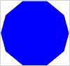 | 它不受光照影响（称为 **不发光** 的特性），因此通常用于显示纯色或线框。相邻的两个相同颜色的不发光表面很难区分。 |
| `MeshNormalMaterial`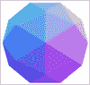 | 此材质显示的颜色（红/绿/蓝）基于面法线向量的 x/y/z 值的大小。（一个 *法线* 向量垂直于一个表面。）这种材质是不发光的，因此它适用于快速区分物体的形状。 |
| `MeshDepthMaterial`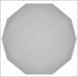 | 它是一种未照明的材料，显示不同灰度的阴影，亮度取决于与摄像机的距离。在应用更逼真的纹理之前设计场景时很有用。 |
| `MeshLambertMaterial`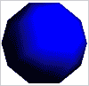 | 面受到光照的影响，但不会发光。具体来说，光照是按顶点计算的，并在面上进行插值。如果没有灯光在场景中，它将显示为黑色。 |
| `MeshPhongMaterial`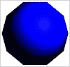 | 面受到光照的影响，并且可以发光。具体来说，光照是按每个-*texel*（纹理像素）计算的，因此当光源靠近相关对象时，这比 Lambert 材料更准确。如果没有灯光在场景中，它将显示为黑色。 |

| `MeshFaceMaterial`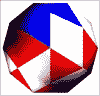 | 它本质上是一个材料数组，用于将不同的材料映射到不同的表面。这种材料是独一无二的，因为它与其他材料实例化的方式不同，如下面的代码所示：

```js
var mat1 = new THREE.MeshPhongMaterial({ color: 0x0000ff  });
var mat2 = new THREE.MeshPhongMaterial({ color: 0xff0000 });
var mat3 = new THREE.MeshPhongMaterial({ color: 0xffffff });
var materials = [mat1, mat2, mat3];
material = new THREE.MeshFaceMaterial(materials);
for (var i = 0, l = geometry.faces.length; i < l; i++) {
  geometry.faces[i].materialIndex = i % l;
}
```

在这里，我们创建了三个我们想要使用的新材料，将它们作为一个数组传递给`MeshFaceMaterial`，然后设置我们几何形状上的每个面，使其对应于`materials`数组中我们想要用于该面的材料索引。|

| `ShaderMaterial`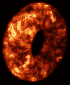 | 它显示一个**GLSL**（**开放图形库着色语言**）纹理。GLSL 是一种基于 C 的编程语言，由 WebGL 和 OpenGL 使用，为开发者提供了一种高级、平台无关的方式来控制图形。它非常强大，将在第四章中更多地进行讨论，*添加细节*。 |
| --- | --- |

除了`MeshFaceMaterial`之外的所有材料构造函数都只接受一个选项映射作为它们的唯一参数。我们已经从我们的二十面体示例中遇到了三个选项：`color`、`wireframe`和`wireframeLinewidth`。此外，将`transparency`选项设置为`true`允许使用`opacity`选项，这是一个介于零和一之间的值，表示材料应该有多透明（零为不可见，一为不透明）。对于不使用图像的材料，可能相关的另一个选项是`shading`，其值为`THREE.SmoothShading`或`THREE.FlatShading`，表示是否混合每个面的颜色，如下一张截图所示：

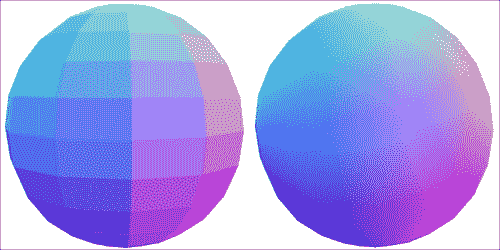

左，THREE.MeshNormalMaterial({shading: THREE.FlatShading}); 右，THREE.MeshNormalMaterial({shading: THREE.SmoothShading});

有几个其他属性，其中最重要的也是最实用的就是`map`。这个属性定义了用于包裹几何形状的纹理。通常，使用这个属性看起来像以下代码片段：

```js
var image = THREE.ImageUtils.loadTexture('image.jpg');
new THREE.MeshBasicMaterial({map: image});
```

### 注意

在加载图像时有两个需要注意的问题。首先，如果你是在本地运行你的应用程序（通过双击文件，你会看到一个 `file:///` URL），出于安全原因，Chrome 默认会阻止加载图像（以防止恶意 JavaScript 访问你电脑上的本地文件）。你可以通过更改浏览器的安全设置或使用本地 HTTP 服务器运行文件来解决这个问题，具体方法请参阅 [`github.com/mrdoob/three.js/wiki/How-to-run-things-locally`](https://github.com/mrdoob/three.js/wiki/How-to-run-things-locally)。第二个问题是，你不能在 WebGL 中渲染从另一个域加载的图像，这也是出于安全原因。你可以通过将图像与 `Access-Control-Allow-Origin` 标头设置为 `null` 来解决这个问题，具体方法请参阅 [`hacks.mozilla.org/2011/11/using-cors-to-load-webgl-textures-from-cross-domain-images/`](https://hacks.mozilla.org/2011/11/using-cors-to-load-webgl-textures-from-cross-domain-images/)。

`ImageUtils.loadTexture()` 函数用于加载图像。让我们使用一个稍微高级一点的版本来渲染 `earth` 图像：

```js
THREE.ImageUtils.loadTexture('earth.jpg', undefined, function(texture) {
  geometry = new THREE.SphereGeometry(280, 20, 20);
  material = new THREE.MeshBasicMaterial({map: texture, overdraw: true});
  mesh = new THREE.Mesh(geometry, material);
  mesh.rotation.x = 30 * Math.PI / 180;
  scene.add(mesh);
});
```

`loadTexture` 的第二个参数目前未使用，第三个参数是一个在图像成功加载时被调用的回调函数。（还接受一个错误回调函数的第四个参数。）我们之前已经看到了除 `overdraw` 选项之外的所有代码，`overdraw` 选项消除了由于 canvas API 的限制而在网格面之间产生的小间隙。（`WebGLRenderer` 不需要这个属性；它可以更完美地对齐面。）你可以在下面的屏幕截图中看到结果：

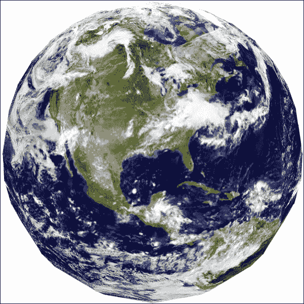

地球作为一个带有纹理映射的球体

在此示例中使用的图像可在 Three.js 包的 `examples/textures/planets/land_ocean_ice_cloud_2048.jpg` 中找到。

对于空间复杂度较高、我们无法在此处详细说明的其他材料类型，有几种其他选项。你可以在不同材料的文档中了解更多信息。例如，`MeshPhongMaterial` 文档（[`threejs.org/docs/#Reference/Materials/MeshPhongMaterial`](http://threejs.org/docs/#Reference/Materials/MeshPhongMaterial)）中包含了关于产生反射表面的说明。

# 一个城市场景

我们已经用 Three.js API 覆盖了很多内容。让我们通过一个项目将这些关于几何和材料的知识点综合起来。

到目前为止，我们一直在我们的世界中处理单个对象。如果我们想移动它，我们就必须更改它的 `position` 向量。我们可以通过添加多个对象并手动定位它们来创建一个完整的场景。然而，对于包含多个对象的场景，这可能会很快变得相当繁琐。有几个替代方案：

+   **矩形布局**：这种方法涉及将地图存储在某种简单格式中，如字符串或图像，其中每个字符或像素颜色代表一种对象类型

+   **程序生成**: 此方法涉及使用算法半随机地定位对象

+   **编辑者**: 此方法涉及使用外部工具构建场景，然后导出结果（例如，JSON 格式），并在应用程序执行时导入

矩阵格式对于简单的游戏关卡来说是最容易的，我们将在第三章 *探索和交互*中使用它。第五章设计和发展详细讨论了编辑器方法。现在，让我们尝试根据由*Ricardo Cabello*（Three.js 的原始作者）创建的示例程序生成一个城市，[请参阅这里](http://www.mrdoob.com/lab/javascript/webgl/city/01/)。

首先，让我们创建一个立方体和材料，我们将将其作为我们城市建筑的基础。我们将为每个新建筑复制我们的几何形状和材料，并适当地缩放几何形状：

```js
var geo = new THREE.CubeGeometry(1, 1, 1);
geo.applyMatrix(new THREE.Matrix4().makeTranslation(0, 0.5, 0));
var material = new THREE.MeshDepthMaterial({overdraw: true});
```

上一代码片段的第二行将几何形状的原点（围绕该点缩放和旋转几何形状的点）移动到底部，这样当我们放大建筑时，所有建筑的楼层都将处于相同的高度。这是通过使用表示垂直平移的矩阵将每个顶点和面的 y 坐标向上移动 0.5 个单位来完成的。

### 注意

矩阵可以被视为具有行和列的矩形数组或表格。具有四行四列的矩阵特别适用于存储关于 3D 空间中对象的信息，因为单个 4 x 4 矩阵可以表示位置、旋转和缩放。本书中唯一提到矩阵的地方就是这里，所以如果你不理解背后的数学原理也没有关系；使用 Three.js 的一个原因就是避免手动进行线性代数。我们在这里进行的转换只是将所有顶点和面的几何形状一次性移动，而不移动其原点的一种简短方式。

接下来，我们将创建所有我们的建筑：

```js
for (var i = 0; i < 300; i++) {
  var building = new THREE.Mesh(geo.clone(), material.clone());
  building.position.x = Math.floor(Math.random() * 200 - 100) * 4;
  building.position.z = Math.floor(Math.random() * 200 - 100) * 4;
  building.scale.x = Math.random() * 50 + 10;
  building.scale.y = Math.random() * building.scale.x * 8 + 8;
  building.scale.z = building.scale.x;
  scene.add(building);
}
```

这里唯一的新事物是`clone()`方法。几乎所有的 Three.js 对象都可以被克隆以创建一个副本，可以修改而不改变原始对象。我们正在利用这一点，根据我们的原始实例创建新的几何形状和材料实例。

让我们将相机放置在一个可以更好地观察的位置：

```js
camera.position.y = 400;
camera.position.z = 400;
camera.rotation.x = -45 * Math.PI / 180;
```

我们已经看到旋转几次了，但重要的是要记住旋转是以弧度来衡量的。我们在这里进行的转换使相机向下倾斜 45 度。你也可以使用方便的`lookAt`方法。例如，`camera.lookAt(new THREE.Vector3(0, 0, 0))`使相机转向默认场景原点。

最后，我们还将添加一个地板：

```js
var geo = new THREE.PlaneGeometry(2000, 2000, 20, 20);
var mat = new THREE.MeshBasicMaterial({color: 0x9db3b5, overdraw: true});
var mesh = new THREE.Mesh(geo, mat);
mesh.rotation.x = -90 * Math.PI / 180;
scene.add(mesh);
```

`PlaneGeometry()` 的最后两个参数将平面分割成 20 x 20 的网格。这可以防止 Three.js 在认为所有顶点都太远而无法看到时优化掉地板。此外，平面最初是沿着 x 和 y 轴创建的，因此我们需要将其旋转 -90 度，使其在建筑下方平铺。

现在我们将所有这些放在一起：

```js
var camera, scene, renderer;

function setup() {
  document.body.style.backgroundColor = '#d7f0f7';
  setupThreeJS();
  setupWorld();

  requestAnimationFrame(function animate() {
    renderer.render(scene, camera);
    requestAnimationFrame(animate);
  });
}

function setupThreeJS() {
  scene = new THREE.Scene();

  camera = new THREE.PerspectiveCamera(75, window.innerWidth / window.innerHeight, 1, 10000);
  camera.position.y = 400;
  camera.position.z = 400;
  camera.rotation.x = -45 * Math.PI / 180;

  renderer = new THREE.CanvasRenderer();
  renderer.setSize(window.innerWidth, window.innerHeight);
  document.body.appendChild(renderer.domElement);
}

function setupWorld() {
  // Floor
  var geo = new THREE.PlaneGeometry(2000, 2000, 20, 20);
  var mat = new THREE.MeshBasicMaterial({color: 0x9db3b5, overdraw: true});
  var floor = new THREE.Mesh(geo, mat);
  floor.rotation.x = -90 * Math.PI / 180;
  scene.add(floor);

  // Original building
  var geometry = new THREE.CubeGeometry(1, 1, 1);
  geometry.applyMatrix(new THREE.Matrix4().makeTranslation(0, 0.5, 0));
  var material = new THREE.MeshDepthMaterial({overdraw: true});

  // Cloned buildings
  for (var i = 0; i < 300; i++) {
    var building = new THREE.Mesh(geometry.clone(), material.clone());
    building.position.x = Math.floor(Math.random() * 200 - 100) * 4;
    building.position.z = Math.floor(Math.random() * 200 - 100) * 4;
    building.scale.x  = Math.random() * 50 + 10;
    building.scale.y  = Math.random() * building.scale.x * 8 + 8;
    building.scale.z  = building.scale.x;
    scene.add(building);
  }
}

// Run it!
setup();
```

让我们看看结果，如下面的截图所示：

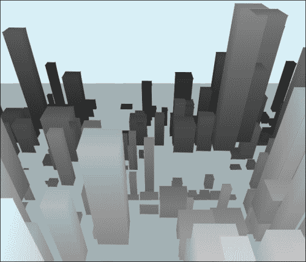

程序生成的城市景观

让我们通过合并所有建筑的几何形状来优化场景。为此，我们将调整生成我们许多建筑的代码：

```js
var cityGeometry = new THREE.Geometry();
for (var i = 0; i < 300; i++) {
 var building = new THREE.Mesh(geometry.clone());
  building.position.x = Math.floor(Math.random() * 200 - 100) * 4;
  building.position.z = Math.floor(Math.random() * 200 - 100) * 4;
  building.scale.x  = Math.random() * 50 + 10;
  building.scale.y  = Math.random() * building.scale.x * 8 + 8;
  building.scale.z  = building.scale.x;
 THREE.GeometryUtils.merge(cityGeometry, building);
}
var city = new THREE.Mesh(cityGeometry, material);
scene.add(city);

```

关键在于我们现在正在使用 `GeometryUtils.merge()` 将所有建筑网格合并成一个单一的 `cityGeometry`。这对于具有大量几何形状且不独立移动的场景是一个重要的优化，因为渲染器可以更智能地批量处理绘图调用，如果它一次知道所有顶点和面，而不是一次绘制一个网格。

# 光照

灯光是 `THREE.Light` 的实例，它影响 `MeshLambertMaterial` 和 `MeshPhongMaterial` 表面的光照效果。大多数灯光都有颜色（以十六进制表示法指定，类似于 CSS 颜色）和强度（一个十进制值，通常在零到一之间，表示光线的亮度）。以下表格显示了不同类型的灯光：

| 类型 | 构造函数 | 描述 |
| --- | --- | --- |
| 环境光 |

```js
THREE.AmbientLight(color)
```

| 它以相同的方式影响场景中所有被照亮的对象。 |
| --- |
| 方向性 |

```js
THREE.DirectionalLight(color, intensity = 1)
```

| 对于这种类型，所有光线都是平行的，并且来自一个特定的方向，就像光源非常遥远一样。 |
| --- |
| 半球 |

```js
THREE.HemisphereLight(skyColor, groundColor, intensity = 1)
```

| 它模拟了来自太阳的折射光线，有点像两个相对的方向光源。 |
| --- |
| 点 |

```js
THREE.PointLight(color, intensity = 1, radius = 0)
```

| 它从一个特定的空间点发出，就像一个灯泡。它只照亮 `radius` 范围内的对象。 |
| --- |
| 聚焦 |

```js
THREE.SpotLight(color, intensity, radius = 0, coneAngle = Math.PI / 3, falloff = 10)
```

| 它从一个特定的空间点以特定的方向发出。它照亮指向其旋转方向的圆锥形对象，在 `radius` 范围内指数衰减。 |
| --- |

要更新我们的程序化城市场景并添加光照，我们首先需要将建筑的材质更改为对光线做出反应：

```js
var material = new THREE.MeshPhongMaterial({overdraw: true, color: 0xcccccc});
```

然后我们将光源添加到场景中：

```js
var light = new THREE.DirectionalLight(0xf6e86d, 1);
light.position.set(1, 3, 2);
scene.add(light);
```

对于方向性光源，光线的方向是从 `light.position` 到 `light.target.position` 的方向；这两个都是可以改变的向量，目标默认是世界原点。

让我们也把我们的渲染器改为 WebGL，因为 `CanvasRenderer` 不支持高级光照功能，如阴影和雾，这是我们即将添加的：

```js
renderer = new THREE.WebGLRenderer();
```

现在我们场景已经添加了光照，让我们再添加一些雾气来营造一点氛围：

```js
scene.fog = new THREE.FogExp2(0x9db3b5, 0.002);
```

实际上有两种雾。`FoxExp2` 随距离的增加而指数级变密，其参数是颜色和密度指数（一个你需要根据你世界的规模进行调整的小数）。另一种雾是 `THREE.Fog`，它线性变密；其参数是颜色、雾开始出现的最小距离以及物体将被雾遮挡的最大距离。例如：

```js
scene.fog = new THREE.Fog(0x9db3b5, 0, 800);
```

两种雾之间的区别在静态图像中难以捕捉，但接下来的两个截图显示了指数衰减和快速线性衰减之间的对比。以下截图显示了 `FogExp2` 的低密度：

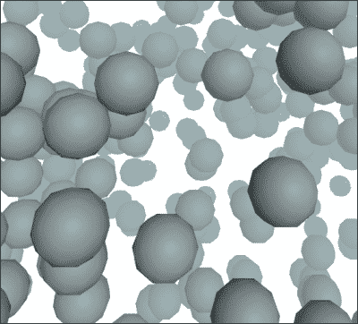

以下截图显示了具有短衰减效果的 `Fog`：

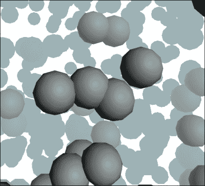

## 阴影

只有 `DirectionalLight` 和 `PointLight` 对象可以投射阴影。首先投射阴影需要我们在渲染器上启用阴影：

```js
renderer.shadowMapEnabled = true;
```

如果你想，你还可以设置 `renderer.shadowMapSoft = true`，这将使阴影的边缘稍微平滑一些。

然后，每个将投射或接收阴影的对象必须明确设置为这样做。（阴影默认是禁用的，因为计算阴影可能会很慢。）对于我们的城市场景，我们将为地板启用阴影接收，并为建筑启用投射和接收：

```js
floor.receiveShadow = true;
city.castShadow = true;
city.receiveShadow = true;
```

`castShadow` 和 `receiveShadow` 属性基本上就是它们听起来那样——启用投射和接收阴影。

最后，我们配置 `DirectionalLight` 对象以使用阴影：

```js
light.castShadow = true;
light.shadowDarkness = 0.5;
light.shadowMapWidth = 2048;
light.shadowMapHeight = 2048;
light.position.set(500, 1500, 1000); 
light.shadowCameraFar = 2500; 
// DirectionalLight only; not necessary for PointLight
light.shadowCameraLeft = -1000;
light.shadowCameraRight = 1000;
light.shadowCameraTop = 1000;
light.shadowCameraBottom = -1000;
```

我们设置了光线以投射阴影，并设置了阴影的深浅。阴影的深浅通常从`0`（无阴影）到`1`（深阴影），但也可以有其他值；小于`0`的值会导致一种反阴影效果，即原本应该处于阴影中的物体反而被照亮，而大于`1`的值会使阴影显得非常黑。然后我们使用`shadowMapWidth`和`shadowMapHeight`属性设置阴影的分辨率，这些属性影响阴影边缘的清晰度；值越高，阴影看起来越清晰，但计算成本也越高。接下来，我们描述将要用于投射阴影的**阴影相机**。实际上，当涉及到阴影时，`DirectionalLight`和`PointLight`对象类似于`OrthographicCamera`和`PerspectiveCamera`对象，前者使用平行投影，而后者使用透视投影。因此，为了设置我们的相机，我们将光线移动到一个足够远的位置，以便能够*看到*我们想要投射阴影的所有内容。然后我们使用`shadowCamera`属性描述锥体的形状；左、右、上、下值是锥体末端对应边的长度，而`Far`值是锥体末端的距离。（回想一下第一章中的*你好，Three.js*，锥体是包含相机所能*看到*的形状。）如果这很难想象，你可以这样显示锥体：

```js
light.shadowCameraVisible = true;
```

结果是一个表示阴影投影的线框形状，如下一张截图所示：

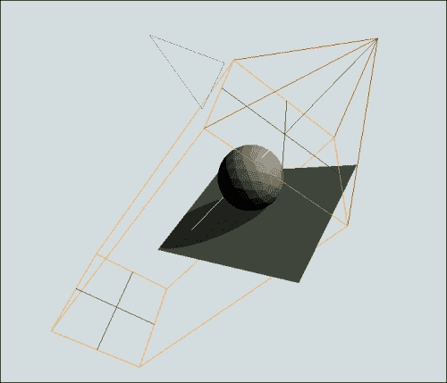

阴影相机

`DirectionalLight`对象位于红色圆锥的顶点，黄色盒子的末端位于`shadowCameraNear`和`shadowCameraFar`距离处，盒子的边缘是锥体的尺寸。对于`PointLights`，整个锥体是一个圆锥。

# 渲染器

早期，我们为了支持阴影和雾效，将渲染器从`CanvasRenderer`切换到了`WebGLRenderer`。一般来说，`WebGLRenderer`速度更快，功能也更全面，而`CanvasRenderer`功能较少，但浏览器支持范围更广。`WebGLRenderer`的一个特别好的功能是它支持抗锯齿，可以平滑处理锯齿边缘。我们可以通过将选项传递给渲染器构造函数来为我们的城市景观启用此功能：

```js
renderer = new THREE.WebGLRenderer({antialias: true});
```

如此一来，我们的城市景观终于完成了，如下一张截图所示：

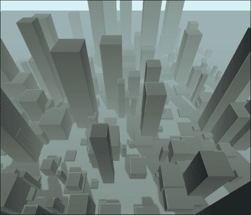

一个完成的城市

Three.js 还有其他几种渲染器，最著名的是 CSS 和 SVG。这些可以在`examples/js/renderers`文件夹中找到，如果它们对应的文件被包含在您的 HTML 文档中，它们分别可用作`THREE.CSS3DRenderer`和`THREE.SVGRenderer`。这些渲染器支持的特性集较小，并且使用并不广泛，因此它们没有被包含在主库中，但它们对于具有有限原始几何形状且没有光照的场景可能很有用。

在本书的剩余部分，我们将使用 `WebGLRenderer`，所以如果你使用的是 Internet Explorer 11 之前的版本，你应该切换到 Chrome 或 Firefox。

### 小贴士

如果 WebGL 不可用，你的游戏可以回退到 `CanvasRenderer` 或只是显示一个错误信息。这样做最简单的方式是使用 `examples/js/Detector.js` 中的脚本。一旦脚本被包含在你的页面中，你只需简单地检查 `Detector.webgl` 布尔值，以查看当前系统是否支持 WebGL。如果不支持，你可以调用 `Detector.addGetWebGLMessage()` 来向用户解释为什么你的游戏在他们的设备上无法运行，以及如何切换到一个支持 WebGL 的浏览器。

# 摘要

在本章中，我们学习了如何处理不同类型的几何形状、材质和光照。我们还了解了渲染器和场景，并完成了一个通过程序构建城市的项目。在下一章中，我们将学习用户如何与 Three.js 交互，添加一些物理效果，并构建一个基本的单人第一人称射击游戏。
