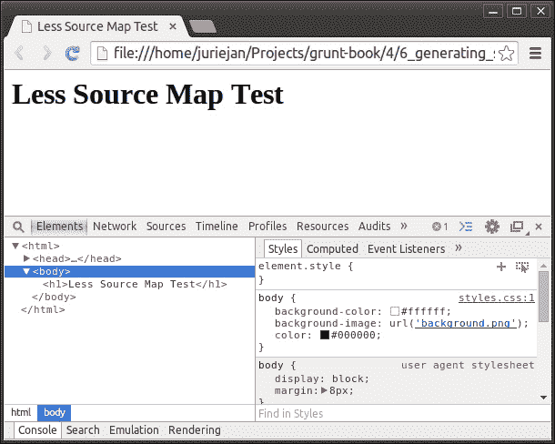
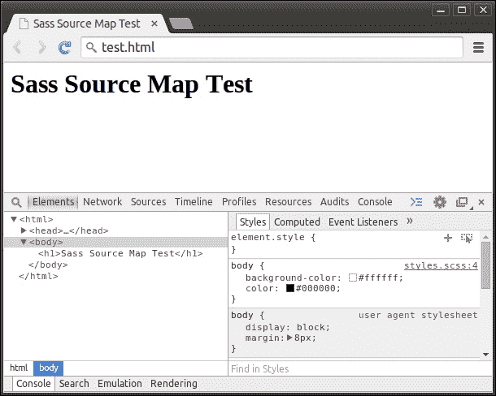
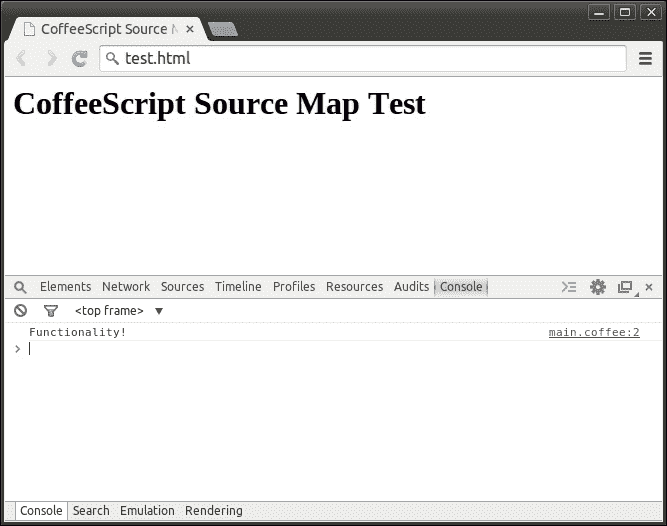

# 第四章。生成 CSS 和 JavaScript

在本章中，我们将涵盖以下菜谱：

+   编译 LESS 到 CSS

+   编译 Sass 到 CSS

+   编译 Stylus 到 CSS

+   编译 CoffeeScript 到 JavaScript

+   编译 LiveScript 到 JavaScript

+   为 LESS 生成源映射

+   为 Sass 生成源映射

+   为 CoffeeScript 生成源映射

+   使用 LESS 定义自定义函数

+   使用 Stylus 插件

# 简介

由于今天使用的多数技术都是基于标准的，尤其是由 W3C 维护的标准，而标准的演变相当缓慢，因此一直存在一个开发者社区，他们旨在通过在现有陈旧技术之上构建工具来推动演变。

生成**CSS**和**JavaScript**代码已经存在一段时间了，并且已经成为某种行业标准。使用最新的工具生成代码使我们能够比以往任何时候都更快地管理和构建我们的 Web 应用程序。现在，我们可以在代码中使用更多现代语言特性，并且我们终于可以利用我们的编程技能来生成我们的 CSS 样式表。

# 编译 LESS 到 CSS

在这个菜谱中，我们将使用`contrib-less (0.11.4)`插件来编译我们的**LESS**样式表到**CSS**样式表，这些样式表可以被我们的 Web 应用程序使用。

## 准备中

在这个例子中，我们将使用我们在第一章中创建的基本项目结构，即在项目中安装 Grunt 菜谱中的*使用 Grunt 入门*。如果您还不熟悉其内容，请务必参考。

## 如何做到...

以下步骤将引导我们创建一个简单的 LESS 样式表并将其编译为 CSS：

1.  我们将按照第一章中提供的*安装插件*菜谱中的说明，首先安装包含`contrib-less`插件的包。

1.  让我们在项目目录中创建一个简单的 LESS 文件，名为`styles.less`，其内容如下：

    ```js
    @first: #ffffff;
    @second: #000000;

    body {
      background-color: @first;
      background-image: url('../background.png');
      color: @second;
    }
    ```

1.  现在，我们可以在配置中添加以下`less`任务，它将编译项目目录中的`styles.less`文件到`styles.css`文件：

    ```js
    less: {
      styles: {
        src: 'styles.less',
        dest: 'styles.css'
      }
    }
    ```

1.  然后，我们可以使用`grunt less`命令来运行任务，这将产生类似于以下内容的输出：

    ```js
    Running "less:styles" (less) task
    File styles.css created: 0 B → 56 B

    ```

1.  如果我们现在查看我们的项目目录，我们应该会看到新的`styles.css`文件，其内容如下：

    ```js
    body {
      background-color: #ffffff;
      background-image: url('background.png');
      color: #000000;
    }
    ```

## 更多...

`less`任务为我们提供了几个有用的选项，可以与它的基本编译功能一起使用。我们将探讨如何指定资源根路径、最小化输出结果、重写 URL 为相对路径、强制评估导入、指定额外的导入路径以及向输出结果添加横幅。

### 指定资源根路径

如果我们想在 L 文件中的所有 URL 资源前添加路径，我们可以使用`rootpath`选项，如以下示例所示：

```js
less: {
  styles: {
    options: {
      rootpath: '../'
    },
    src: 'styles.less',
    dest: 'styles.css'
  }
}
```

### 最小化输出结果

由于我们始终致力于减小我们的 Web 应用的下载大小，我们最终会达到想要通过最小化样式表来减小样式表大小的点。可以使用`cleancss`选项来指示应该使用**clean-css**实用程序来压缩编译结果，如以下示例所示：

```js
less: {
  styles: {
    options: {
      cleancss: true
    },
    src: 'styles.less',
    dest: 'styles.css'
  }
}
```

### 重写 URL 为相对路径

如果我们将一个 LESS 样式表导入到另一个中，对资产的 URL 引用可能会变得有些令人困惑，因为我们必须使用相对于可能想要导入它的任何样式表的 URL 来引用资源。当然，如果我们将相同的样式表导入到两个不同的样式表中，每个样式表的位置都不同，这也会导致问题。

通过启用`rewriteUrls`选项，我们不必担心在导入样式表时出现不正确的资源引用。编译器将检查正在导入的样式表中引用的所有资源的 URL，并将它们更改为相对于它们新位置的路由。

假设我们有一个以下目录结构，其中包含一个主`style.less`文件，它导入`body.less`文件，该文件在项目根目录中引用了`background.png`图像：

```js
project/
├── background.png
├── styles.less
└── lib
 └── body.less

```

当`rewriteUrls`选项设置为`false`时，`body.less`文件中的`url('../background.png')`引用在生成的`style.css`文件中将保持不变。

当`rewriteUrls`设置为`true`时，如以下示例所示，它将被更改为`url('background.png')`，因为这将是`style.css`文件到`background.png`文件的新正确相对路径：

```js
less: {
  styles: {
    options: {
      relativeUrls: true
    },
    src: 'styles.less',
    dest: 'styles.css'
  }
}
```

### 强制评估导入

为了接收缺失导入依赖项的错误消息，我们可以将`strictImports`选项设置为`true`，如以下示例所示：

```js
less: {
  styles: {
    options: {
      strictImports: true
    },
    src: 'styles.less',
    dest: 'styles.css'
  }
}
```

### 指定额外的导入路径

如果我们希望允许我们的 LESS 样式表导入除了通过简单相对路径可用的样式表之外的样式表，我们可以通过使用`paths`选项来指示在导入文件时应扫描的额外目录。以下示例指示在扫描导入时应该包含项目根目录中的`lib`目录：

```js
less: {
  styles: {
    options: {
      paths: ['lib']
    },
    src: 'styles.less',
    dest: 'styles.css'
  }
}
```

### 向输出结果添加横幅

如果我们想在编译后的样式表开头添加一些额外信息，我们可以使用`banner`选项。以下示例添加了一个包含有关我们正在生成的文件信息的横幅：

```js
less: {
  styles: {
    options: {
      banner: '/* Name: style.css */\n' +
 '/* Author: Grunt Wiz */\n' +
 '/* License: MIT */\n\n'

    },
    src: 'styles.less',
    dest: 'styles.css'
  }
}
```

# 编译 Sass 到 CSS

在这个菜谱中，我们将使用`sass (0.12.1)`插件将我们的**Sass**样式表编译成**CSS**样式表，这些样式表可以被我们的 Web 应用使用。

### 小贴士

contrib-sass 插件比 sass 插件更受欢迎、更成熟，但需要安装 Sass **Ruby**库，这似乎是本配方中不必要的步骤。

请注意，在撰写本文时，Sass 插件与 Node.js 的`0.11.*`版本不兼容，但针对此问题的解决方案正在开发中。在下面的配方中，使用了`0.10.*`版本。

## 准备工作

在本例中，我们将使用我们在第一章中“在项目中安装 Grunt”配方中创建的基本项目结构，即*使用 Grunt 入门*。如果您还不熟悉其内容，请务必参考。

## 如何操作...

以下步骤将指导我们创建一个简单的 Sass 样式表并将其编译为 CSS：

1.  我们将按照第一章中“安装插件”配方中的说明安装包含`sass`插件的包。

1.  让我们在项目目录中创建一个名为`styles.scss`的简单 Sass 文件，其内容如下：

    ```js
    $first: #ffffff;
    $second: #000000;

    body {
      background-color: $first;
      background-image: url('background.png');
      color: $second;
    }
    ```

1.  现在，我们可以将以下`sass`任务添加到我们的配置中，该任务将编译项目目录中的`styles.scss`文件到`styles.css`文件：

    ```js
    sass: {
      styles: {
        src: 'styles.scss',
        dest: 'styles.css'
      }
    }
    ```

1.  然后，我们可以使用`grunt sass`命令运行任务，这将产生类似于以下内容的输出：

    ```js
    Running "sass:styles" (sass) task
    File styles.css created.

    ```

1.  如果我们现在查看我们的项目目录，我们应该看到包含以下内容的新的`styles.css`文件：

    ```js
    body {
      background-color: #ffffff;
      background-image: url('background.png');
      color: #000000;
    }
    ```

## 还有更多...

`sass`任务为我们提供了几个有用的选项，可以与基本编译功能一起使用。我们将探讨如何更改输出样式、指定图像路径以及指定额外的导入路径。

### 改变输出样式

在编译 Sass 样式表时，有两种输出样式可用，每种都提供不同级别的可读性。默认情况下，`outputStyle`选项设置为`nested`，这会产生更易读的输出。要删除输出中的所有空白，您可以将其设置为`compressed`，如下例所示：

```js
sass: {
  styles: {
    options: {
      outputStyle: 'compressed'
    },
    src: 'styles.scss',
    dest: 'styles.css'
  }
}
```

### 指定图像路径

如果您想轻松更改 Sass 样式表中引用的所有图像的路径，`sass`插件提供了`image-url`函数。以下示例使用`imagePath`选项来指示`img`字符串应添加到指定的每个 URL 之前，使用`image-url`函数：

```js
sass: {
  styles: {
    options: {
      imagePath: 'img'
    },
    src: 'styles.scss',
    dest: 'styles.css'
  }
}
```

### 指定额外的导入路径

如果我们希望允许我们的 Sass 样式表导入除简单相对路径之外的其他样式表，我们可以通过使用`includePaths`选项来指示在导入文件时应扫描的额外目录。以下示例指示在扫描导入时，应包含项目根目录中的`lib`目录：

```js
sass: {
  styles: {
    options: {
      includePaths: ['lib']
    },
    src: 'styles.scss',
    dest: 'styles.css'
  }
}
```

# 将 Stylus 编译为 CSS

在这个菜谱中，我们将使用`contrib-stylus (0.18.0)`插件将我们的**Stylus**样式表编译成**CSS**样式表，这些样式表可以被我们的 Web 应用程序使用。

## 准备工作

在这个例子中，我们将使用我们在第一章中创建的基本项目结构，即第一章的*在项目中安装 Grunt*菜谱中创建的结构。如果您还不熟悉其内容，请务必参考。

## 如何操作...

以下步骤将指导我们创建一个简单的 Stylus 样式表并将其编译成 CSS：

1.  我们将首先按照第一章中*安装插件*菜谱中提供的说明安装包含`contrib-stylus`插件的包。

1.  让我们在项目目录中创建一个名为`styles.styl`的简单 Stylus 文件，其内容如下：

    ```js
    first = #ffffff
    second = #000000

    body
      background-color: first
      background-image: url('background.png')
      color: second
    ```

1.  现在，我们可以在配置中添加以下`stylus`任务，该任务将编译项目目录中的`styles.styl`文件到`styles.css`文件：

    ```js
    stylus: {
      styles: {
        src: 'styles.styl',
        dest: 'styles.css'
      }
    }
    ```

1.  然后，我们可以使用`grunt stylus`命令来运行任务，这应该会产生类似于以下内容的输出：

    ```js
    Running "stylus:styles" (stylus) task
    File styles.css created.

    ```

1.  如果我们现在查看我们的项目目录，我们应该看到新创建的`styles.css`文件，其内容如下：

    ```js
    body {

    ```

    ```js
      background-color: #fff;
      background-image: url("background.png");
      color: #000;
    }
    ```

    ### 小贴士

    注意，由于`stylus`任务默认会压缩输出，因此此文件的内容可能处于压缩状态。这里以未压缩的形式展示，以便于阅读。

## 更多内容...

`stylus`任务为我们提供了几个有用的选项，这些选项可以与其基本的编译功能结合使用。我们将探讨如何禁用结果的 CSS 压缩、指定额外的导入路径、定义全局变量、启用导入 CSS 文件的功能以及向输出添加横幅。

### 禁用结果的 CSS 压缩

默认情况下，`stylus`任务会通过删除所有空白来压缩结果的 CSS。这种行为可以通过将`compress`选项设置为`false`来禁用，如下例所示：

```js
stylus: {
  styles: {
    options: {
      compress: false
    },
    src: 'styles.styl',
    dest: 'styles.css'
  }
}
```

### 指定额外的导入路径

如果我们希望允许我们的 Stylus 样式表导入除简单相对路径之外的其他样式表，我们可以通过使用`paths`选项来指示在导入文件时应扫描的额外目录。以下示例指示在扫描导入时应该包含项目根目录中的`lib`目录：

```js
stylus: {
  styles: {
    options: {
      paths: ['lib']
    },
    src: 'styles.styl',
    dest: 'styles.css'
  }
}
```

### 定义全局变量

通过使用`define`选项，我们可以定义应该对所有目标 LESS 样式表可用的变量。以下示例定义了一个全局可用的`keyColor`变量：

```js
stylus: {
  styles: {
    options: {
      define: {
 keyColor: '#000000'
 }
    },
    src: 'styles.styl',
    dest: 'styles.css'
  }
}
```

### 启用导入 CSS 文件的功能

当在 Stylus 样式表中使用`@import`语句导入常规 CSS 文件时，编译器的默认行为是生成一个标准的 CSS `@import`指令，该指令引用文件。通过将`'include css'`选项设置为`true`，如下例所示，我们可以指导编译器将指定的文件实际包含到最终结果中：

```js
stylus: {
  styles: {
    options: {
      'include css': true
    },
    src: 'styles.styl',
    dest: 'styles.css'
  }
}
```

### 添加横幅到输出结果

如果我们想在编译后的样式表中添加一些额外信息到开头，我们可以使用`banner`选项。以下示例添加了一个包含我们生成文件信息的横幅：

```js
stylus: {
  styles: {
    options: {
      banner: '/* Name: style.css */\n' +
 '/* Author: Grunt Wiz */\n' +
 '/* License: MIT */\n\n'
    },
    src: 'styles.styl',
    dest: 'styles.css'
  }
}
```

# 将 CoffeeScript 编译成 JavaScript

在本配方中，我们将使用`contrib-coffee (0.11.0)`插件将**CoffeeScript**源文件编译成**JavaScript**。

## 准备工作

在本例中，我们将使用第一章中“在项目中安装 Grunt”配方中创建的基本项目结构。如果您还不熟悉其内容，请务必参考。

## 如何做到...

以下步骤将指导我们创建一个简单的 CoffeeScript 源文件并将其编译成 JavaScript：

1.  我们将首先按照第一章中“安装插件”配方提供的说明安装包含`contrib-coffee`插件的包，*使用 Grunt 入门*。

1.  让我们在项目目录中创建一个名为`main.coffee`的简单 CoffeeScript 文件，其内容如下：

    ```js
    logic = (message) ->
      console.log(message)

    message = 'Functionality!'

    logic(message)
    ```

1.  现在，我们可以在配置中添加以下`coffee`任务，它将编译项目目录中的`main.coffee`文件到`main.js`文件：

    ```js
    coffee: {
      main: {
        src: 'main.coffee',
        dest: 'main.js'
      }
    }
    ```

1.  然后，我们可以通过使用`grunt coffee`命令来运行任务，这应该会产生类似于以下内容的输出：

    ```js
    Running "coffee:main" (coffee) task
    >> 1 files created.

    ```

1.  如果我们现在查看我们的项目目录，我们应该看到包含以下内容的新的`main.js`文件：

    ```js
    (function() {
      var logic, message;

      logic = function(message) {
        return console.log(message);
      };

      message = 'Functionality!';

      logic(message);

    }).call(this);
    ```

## 更多...

`coffee`任务为我们提供了几个有用的选项，这些选项可以与基本编译功能一起使用。我们将探讨如何在没有顶级安全包装器的情况下编译，并在编译前连接多个目标。

### 在没有顶级安全包装器的情况下编译

默认情况下，CoffeeScript 编译器将生成的编译代码包裹在一个匿名 JavaScript 函数中。这种做法可以防止生成的代码污染全局命名空间，从而避免一系列问题。可以通过使用`bare`选项来禁用此行为，如下例所示：

```js
coffee: {
  main: {
    options: {
      bare: true
    },
    src: 'main.coffee',
    dest: 'main.js'
  }
}
```

### 在编译前连接多个目标

当指定多个目标应编译到一个结果文件中时，默认行为是在每个文件单独编译后将其合并在一起。启用顶级安全包装后，这将导致一个包含每个编译文件代码的文件，每个文件都包裹在其自己的顶级函数中。

为了在编译前合并文件并使所有编译内容都在一个顶级包装函数中，我们可以使用`join`选项，如下例所示：

```js
coffee: {
  main: {
    options: {
      join: true
    },
    src: ['main.coffee', 'more.coffee'],
    dest: 'main.js'
  }
}
```

# 将 LiveScript 编译成 JavaScript

在这个配方中，我们将使用`livescript (0.5.1)`插件将**LiveScript**源文件编译到**JavaScript**。

## 准备工作

在这个例子中，我们将使用我们在第一章中*在项目中安装 Grunt*配方中创建的基本项目结构。如果您还不熟悉其内容，请务必参考它。

## 如何操作...

以下步骤将引导我们创建一个简单的 LiveScript 源文件并将其编译成 JavaScript：

1.  我们将按照第一章中*安装插件*配方提供的说明来安装包含`contrib-livescript`插件的包，*使用 Grunt 入门*。

1.  让我们在项目目录中创建一个名为`main.ls`的简单 LiveScript 文件，其内容如下：

    ```js
    logic = (msg) -> console.log(msg)
    message = 'Functionality!'
    logic message
    ```

1.  现在，我们可以在配置中添加以下`livescript`任务，它将编译项目目录中的`main.ls`文件到`main.js`文件：

    ```js
    livescript: {
      main: {
        src: 'main.ls',
        dest: 'main.js'
      }
    }
    ```

1.  然后，我们可以通过使用`grunt livescript`命令来运行任务，它应该产生类似以下内容的输出：

    ```js
    Running "livescript:main" (livescript) task
    File main.js created.

    ```

1.  如果我们现在查看我们的项目目录，我们应该看到包含以下内容的新的`main.js`文件：

    ```js
    (function(){
      var logic, message;
      logic = function(msg){
        return console.log(msg);
      };
      message = 'Functionality!';
      logic(message);
    }).call(this);
    ```

# 为 LESS 生成源映射

在这个配方中，我们将使用`contrib-less (0.11.4)`插件在将我们的**LESS**样式表编译到**CSS**时生成**源映射**。

## 准备工作

在这个例子中，我们将使用本章中*将 LESS 编译成 CSS*配方中创建的基本项目结构。如果您还不熟悉其内容，请务必参考它。

## 如何操作...

以下步骤将引导我们将我们的 LESS 样式表编译到一个 CSS 文件中，该文件包含我们的源映射和源样式表：

1.  首先，我们将通过在`less`任务的配置中将`sourceMap`选项设置为`true`来指示我们希望生成源映射：

    ```js
    less: {
      styles: {
        options: {
          sourceMap: true
        },
        src: 'styles.less',
        dest: 'styles.css'
      }
    }
    ```

1.  接下来，我们将通过在任务的配置中将`outputSourceFiles`选项设置为`true`来指示我们希望在生成的文件中包含生成的 CSS 的来源：

    ```js
    less: {
      styles: {
        options: {
          sourceMap: true,
          outputSourceFiles: true
        },
        src: 'styles.less',
        dest: 'styles.css'
      }
    }
    ```

1.  然后，我们可以通过使用`grunt less`命令来运行任务，它应该产生类似以下内容的输出：

    ```js
    Running "less:styles" (less) task
    File styles.css created: 99 B → 296 B

    ```

1.  如果我们现在查看生成的`styles.css`文件，我们应该在文件末尾看到嵌入的源映射和源样式表。

## 还有更多...

如我们在主要配方中看到的那样，`less`任务的默认行为是将源映射嵌入到生成的 CSS 文件中。这是生成和消费源映射的最简单方法，但这种方法会增加所有用户的生成文件的大小，从而增加 Web 应用的加载时间。

大多数开发者更喜欢将源映射和 CSS 结果分开，这样普通用户就不需要下载源映射及其引用的源文件。然而，由于需要将源映射和源文件提供给将使用 CSS 文件产生的浏览器，这种设置稍微复杂一些。

以下步骤将指导我们修改配置，以指示源映射和源文件不应包含在生成的 CSS 文件中。

1.  首先，我们将通过在`less`任务的配置中将`sourceMap`选项设置为`true`来指示我们想要生成源映射。

    ```js
    less: {
      styles: {
        options: {
          sourceMap: true
        },
        src: 'styles.less',
        dest: 'styles.css'
      }
    }
    ```

1.  然后，我们将修改任务以指示应生成外部源映射。这是通过使用`sourceMapFilename`选项指定源映射文件名称来完成的：

    ```js
    less: {
      styles: {
        options: {
          sourceMap: true,
          sourceMapFilename: 'styles.css.map'
        },
        src: 'styles.less',
        dest: 'styles.css'
      }
    }
    ```

1.  然后，我们可以通过使用`grunt less`命令来运行任务，它应该产生类似于以下内容的输出：

    ```js
    Running "less:styles" (less) task
    File styles.css.map created.
    File styles.css created: 99 B → 137 B

    ```

1.  如果我们现在查看我们的项目目录，我们应该能看到`styles.css`和`styles.css.map`文件。现在生成的样式表也应该包含对源映射文件的引用，现在源映射也应该引用`styles.less`源文件。

## 它是如何工作的...

利用生成的源映射就像在示例 HTML 文件中包含生成的 CSS 文件一样简单。然而，我们必须确保所有必要的文件都可以被打开 HTML 文件的浏览器访问，在我们的当前例子中，由于所有文件都位于同一目录中，这一点已经得到解决。我们还必须确保我们用来打开 HTML 文件的浏览器支持源映射的使用。

以下步骤将指导我们创建一个包含生成的 CSS 文件的示例 HTML 文件，并在支持源映射的浏览器中打开它。

1.  让我们创建一个示例 HTML 文件，它将包括生成的 JavaScript 源文件。让我们在项目目录中创建一个名为`test.html`的文件，其内容如下：

    ```js
    <html>
      <head>
        <title>Less Source Map Test</title>
        <link rel="stylesheet" type="text/css" href="styles.css">
      </head>
      <body>
        <h1>Less Source Map Test</h1>
      </body>
    </html>
    ```

1.  在我们的示例 HTML 文件准备就绪后，我们可以使用支持源映射的浏览器打开它。在我们的例子中，我们将使用 Google Chrome 版本 36。以下图像显示了浏览器窗口，开发者工具已打开，并选择了`body`元素进行检查。

1.  如果我们查看位于开发者工具中的样式检查器，我们会看到 `styles.less:4` 正在显示为从该位置派生 `body` 元素样式的位置。这表明我们的源映射正在正确工作。

# 为 Sass 生成源映射

在这个菜谱中，我们将使用 `sass (0.12.1)` 插件在将我们的 **Sass** 样式表编译为 **CSS** 时生成 **源映射**。

## 准备工作

在这个例子中，我们将使用我们在本章中 *编译 Sass 为 CSS* 菜谱中创建的基本项目结构。如果你还不熟悉其内容，请务必参考它。

## 如何操作...

以下步骤将指导我们修改配置，以便在将 Sass 样式表编译为 CSS 时生成源映射：

1.  首先，我们将通过在 `sass` 任务的配置中将 `sourceMap` 选项设置为 `true` 来指示我们想要生成源映射：

    ```js
    sass: {
      styles: {
        options: {
          sourceMap: true
        },
        src: 'styles.scss',
        dest: 'styles.css'
      }
    }
    ```

1.  然后，我们可以通过使用 `grunt sass` 命令来运行任务，它应该产生类似于以下内容的输出：

    ```js
    Running "sass:styles" (sass) task
    File styles.css created.
    File styles.css.map created.

    ```

1.  如果我们现在查看我们的项目目录，我们应该看到 `styles.css` 和 `styles.css.map` 文件。生成的样式表现在也应该包含对源映射文件的引用，并且源映射现在也应该引用 `styles.scss` 源文件。

## 工作原理...

利用生成的源映射文件就像在示例 HTML 文件中包含生成的 CSS 文件一样简单。然而，我们必须确保所有必要的文件都能被打开 HTML 文件的浏览器访问，在我们的当前示例中，由于所有文件都位于同一目录下，这一点已经得到处理。我们还必须确保我们用来打开 HTML 文件的浏览器支持源映射的使用。

以下步骤将指导我们创建一个包含生成的 CSS 文件并在支持源映射的浏览器中打开的示例 HTML 文件：

1.  让我们创建一个名为 `test.html` 的示例 HTML 文件，它将包含生成的 JavaScript 源文件，并提供以下内容：

    ```js
    <html>
      <head>
        <title>Sass Source Map Test</title>
        <link rel="stylesheet" type="text/css" href="styles.css">
      </head>
      <body>
        <h1>Sass Source Map Test</h1>
      </body>
    </html>
    ```

1.  在我们的示例 HTML 文件准备就绪后，我们可以使用支持源映射的浏览器打开它。在我们的例子中，我们将使用 Google Chrome 版本 36。以下图片显示了开发者工具已打开的浏览器窗口，并选中了用于检查的 `body` 元素。

1.  如果我们查看位于开发者工具中的样式检查器，我们会看到 `styles.scss:4` 正在显示为从该位置派生 `body` 元素样式的位置。这表明我们的源映射正在正确工作。

# 为 CoffeeScript 生成源映射

在这个菜谱中，我们将使用 `contrib-coffee (0.11.0)` 插件在将我们的 **CoffeeScript** 源文件编译为 **JavaScript** 时生成 **源映射**。

## 准备工作

在本例中，我们将使用本章“将 CoffeeScript 编译为 JavaScript”配方中创建的基本项目结构。如果您还不熟悉其内容，请务必参考它。

## 如何操作...

以下步骤将引导我们修改配置以在将 CoffeeScript 源文件编译为 JavaScript 时生成源映射：

1.  首先，我们将通过在 `coffee` 任务的配置中将 `sourceMap` 选项设置为 `true` 来指示我们想要生成源映射：

    ```js
    sass: {
      styles: {
        options: {
          sourceMap: true
        },
        src: 'styles.scss',
        dest: 'styles.css'
      }
    }
    ```

1.  然后，我们可以通过使用 `grunt coffee` 命令来运行任务，它应该产生类似于以下内容的输出：

    ```js
    Running "coffee:main" (coffee) task
    >> 1 files created.
    >> 1 source map files created.

    ```

1.  如果我们现在查看我们的项目目录，我们应该能看到 `main.js` 和 `main.js.map` 文件。生成的 JavaScript 源文件现在也应包含对源映射文件的引用，并且源映射现在也应引用 `main.coffee` 源文件。

## 它是如何工作的...

利用生成的源映射就像在示例 HTML 文件中包含生成的 CSS 文件一样简单。然而，我们必须确保所有必要的文件都可以被打开 HTML 文件的浏览器访问，在我们的当前例子中，由于所有文件都位于同一目录，这一点已经得到解决。我们还必须确保我们用来打开 HTML 文件的浏览器支持源映射的使用。

以下步骤将引导我们创建一个包含生成的 JavaScript 文件的示例 HTML 文件，并在支持源映射的浏览器中打开该 HTML 文件：

1.  让我们创建一个名为 `test.html` 的示例 HTML 文件，它将包含生成的 JavaScript 源文件，并提供以下内容：

    ```js
    <html>
      <head>
        <title>CoffeeScript Source Map Test</title>
        <script type="text/javascript" src="img/main.js"></script>
      </head>
      <body>
        <h1>CoffeeScript Source Map Test</h1>
      </body>
    </html>
    ```

1.  在准备好我们的示例 HTML 文件后，我们可以使用支持源映射的浏览器打开它。在我们的例子中，我们将使用 Google Chrome 版本 36。以下图片显示了开发者工具已打开的浏览器窗口：

    ### 小贴士

    在打开开发者工具后，您可能需要刷新浏览器才能看到下一步骤中讨论的适当控制台输出。

1.  如果我们查看开发者工具中控制台的输出，我们会看到 `main.coffee:2` 正被显示为 `'Functionality!'` 字符串记录的位置。这表明我们的源映射正在正确工作。

# 使用 LESS 定义自定义函数

在本配方中，我们将使用 `contrib-less (0.11.4)` 插件来定义可以在我们的 **LESS** 样式表中使用的自定义函数。

在我们的例子中，我们将创建一个名为 `halfDarken` 的自定义函数，该函数将使提供的任何颜色变暗 50%。它将使用 LESS 库的内置 `darken` 函数。

## 准备工作

在本例中，我们将使用本章“将 LESS 编译为 CSS”配方中创建的基本项目结构。如果您还不熟悉其内容，请务必参考它。

## 如何操作...

以下步骤将引导我们修改配置以定义一个自定义函数，并修改我们的 LESS 样式表以使用它：

1.  首先，我们将通过添加`customFunctions`选项并定义`halfDarker`函数的占位符来修改我们的`less`任务配置：

    ```js
    less: {
      styles: {
        options: {
          customFunctions: {
            halfDarken: function (less, color) {
     return color;
     }
          }
        },
        src: 'styles.less',
        dest: 'styles.css'
      }
    }
    ```

1.  然后，我们可以为`halfDarken`函数添加一些逻辑，该函数将提供的颜色变暗 50%，并返回结果：

    ```js
    halfDarken: function (less, color) {
      functions = less.tree.functions;
      return functions.darken(color, {value:50});
    }
    ```

1.  一旦我们定义了函数，我们就可以修改我们的`styles.less`文件以使用它：

    ```js
    @first: #ffffff;
    @second: #000000;

    body {
      background-color: halfDarken(@first);
      color: @second;
    }
    ```

1.  我们现在可以通过使用`grunt less`命令来运行我们的任务，该命令应该产生以下输出：

    ```js
    Running "less:styles" (less) task
    File styles.css created: 0 B → 56 B
    ```

1.  如果我们现在查看生成的`styles.css`文件，我们可以看到`halfDarken`函数已经将提供的颜色变暗了 50%：

    ```js
    body {
      background-color: #808080;
      color: #000000;
    }
    ```

# 使用 Stylus 插件

在这个菜谱中，我们将使用`contrib-stylus (0.18.0)`插件来编译**Stylus**样式表，这些样式表使用了开发者社区提供的 Stylus 库之一。

### 小贴士

可以在以下 URL 找到 Stylus 框架可用的插件的部分列表：

[`github.com/LearnBoost/stylus/wiki`](https://github.com/LearnBoost/stylus/wiki)

对于我们的示例，我们将使用**Roots**平台打包的**axis**库。它提供了一系列有用的函数、混合和其他实用工具，您肯定会在日常样式表开发中使用到。

## 准备工作

在这个例子中，我们将使用本章中“将 Stylus 编译为 CSS”菜谱中创建的基本项目结构。如果您还不熟悉其内容，请务必参考它。

## 如何操作...

以下步骤将引导我们修改配置，以便我们的样式表能够访问轴库：

1.  首先，我们需要使用`npm install --save axis-css`命令在我们的本地项目路径上安装`axis-css`包。这将产生包含以下内容的输出：

    ```js
    axis-css@0.1.8 node_modules/axis-css
    ```

1.  现在库已经安装，我们可以修改`stylus`任务的配置，以便在编译目标样式表之前加载库。这是通过接受一个数组作为选项`use`来完成的，该数组包含准备用作 Stylus 插件的导入库。以下配置使用此选项来加载`axis-css`插件：

    ```js
    stylus: {
      styles: {
        options: {
          use: [
     require('axis-css')
     ]
        },
        src: 'styles.styl',
        dest: 'styles.css'
      }
    }
    ```

1.  作为测试，我们还可以在我们的示例样式表中使用轴库提供的一个功能。让我们修改`main.styl`的内容，以包含库提供的特殊`absolute`属性：

    ```js
    first = #ffffff
    second = #000000

    body
      absolute: top left
      background-color: first
      color: second
    ```

1.  我们现在可以通过运行`grunt stylus`命令来测试我们的设置，该命令应该产生类似于以下内容的输出：

    ```js
    Running "stylus:styles" (stylus) task
    File styles.css created.
    ```

1.  如果我们查看生成的`main.css`文件，现在我们会看到它包含由轴库的`absolute`属性生成的位置属性：

    ```js
    body {
      position: absolute;
     top: 0;
     left: 0;
      background-color: #fff;
      color: #000;
    }
    ```

    ### 小贴士

    注意，由于触笔任务默认压缩其输出，此文件的内容可能处于压缩状态。为了便于阅读，此处以未压缩的形式呈现内容。
