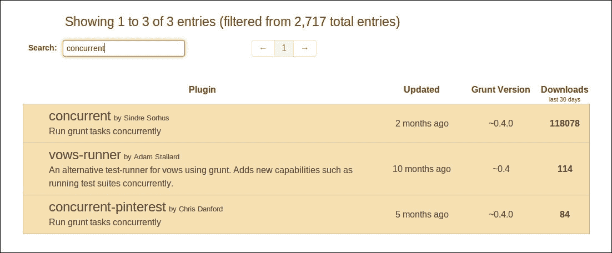
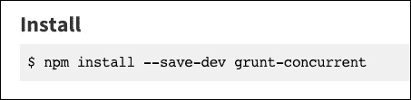

# 第九章. 插件编写

在本章中，我们将涵盖以下内容：

+   寻找插件

+   为插件做出贡献

+   设置基本的插件项目

+   创建插件的任务

+   为插件任务编写测试

+   为插件添加文档

+   发布插件

# 简介

在很大程度上，Grunt 是一个框架，它允许开发者以统一的方式打包和配置提供给网络应用开发者的各种工具。在 Grunt 领域，工具被打包成被称为插件的包，这些插件包都符合 Grunt 的操作和配置约定。

一些更受欢迎的插件是由 Grunt 核心团队提供的，但所有其他插件都是由使用 Grunt 的项目开发者社区贡献的。现在我们正在我们的项目中使用 Grunt，我们成为了这个社区的一部分，我们可以承担起协助创建和维护这些插件的职责。

# 寻找插件

在我们考虑创建自己的插件之前，我们首先应该确定是否已经存在一个能够满足我们需求的插件。在大多数情况下，你会发现其他人已经尝试解决你现在面临的问题，并且已经为你做了大部分甚至全部的工作。

## 准备工作

寻找插件最明显的地方是互联网。因此，我们首先需要做的是打开我们喜欢的网页浏览器并准备导航。

## 如何操作...

以下步骤将引导我们导航到 Grunt 项目的网站，并使用它来搜索我们可以用来运行并发任务的插件。

1.  首先，我们将通过在我们的网页浏览器中输入以下 URL 来导航到官方 Grunt 插件列表页面：[`gruntjs.com/plugins`](http://gruntjs.com/plugins)。

1.  接下来，我们将选择搜索输入文本框，它应该看起来像以下这样：

1.  在文本框被选中后，我们现在可以开始输入我们想要搜索的术语；在这种情况下，我们将输入`concurrent`作为我们的搜索词：

1.  一旦我们完成输入，我们应该看到列表自动加载一段时间，然后显示搜索结果：

1.  现在我们看到的一个插件列表看起来可能就是我们要找的，我们可以点击列表项来查看其文档。插件的安装说明通常应该在文档页面的顶部附近。

# 为插件做出贡献

一旦你找到一个与你的需求非常接近的插件，你可能会发现它的某些方面可能是有缺陷的、不完整的或缺失的。这就是你可以介入并为项目做出各种贡献的地方。

贡献插件项目可以为您提供从项目中获得您所需内容的优势，而无需自己创建整个项目。这对其他人，包括您自己，也有好处，因为他们遇到了您面临的问题或需要相同的附加功能。

## 入门

1.  要进行本食谱中提到的任何贡献，需要一个 **GitHub** 账户。如果您还没有账户，创建一个账户就像访问 GitHub 主页并填写注册表单一样简单，请访问 [`github.com/`](https://github.com/)。

    ### 小贴士

    以下网址提供了对 Git 和 GitHub 的全面介绍：

    [`guides.github.com/activities/hello-world/`](https://guides.github.com/activities/hello-world/)

1.  熟悉在 GitHub 问题部分创建 **问题** 的实践。创建和管理问题的机制相当简单，但在使用时应用良好的实践非常重要。良好的问题编写将产生重大差异，并有助于您在更短的时间内获得所需内容。您可以在以下位置了解更多关于良好问题编写实践的信息：

    [`wiredcraft.com/posts/2014/01/08/how-we-write-our-github-issues.html`](http://wiredcraft.com/posts/2014/01/08/how-we-write-our-github-issues.html)

1.  为了检索任何插件项目的代码和文档，您需要安装 Git 版本控制软件。您可以在以下网址了解有关 Git 的各种安装选项：

    [`git-scm.com/book/en/v1/Getting-Started-Installing-Git`](http://git-scm.com/book/en/v1/Getting-Started-Installing-Git)

1.  如果您想将您对托管在 GitHub 上的项目所做的代码或文档更改贡献出来，您需要熟悉拉取请求（pull request）的工作流程。有关拉取请求工作流程的更多信息，请参阅以下网址：

    [`help.github.com/articles/using-pull-requests/`](https://help.github.com/articles/using-pull-requests/)

1.  为了从您对 Grunt 项目及其插件的贡献中获得最佳效果，请确保您熟悉 Grunt 贡献指南，该指南可在以下网址找到：

    [`gruntjs.com/contributing`](http://gruntjs.com/contributing)

1.  在您考虑贡献的项目中，务必仔细研究项目文档，以确保您正确使用它，并且您正在寻找的功能尚未提供。Grunt 插件项目的文档应始终位于项目仓库根目录下的 `README.md` 文件中。

    ### 小贴士

    GitHub 默认会将位于仓库根目录的 `README.md` 文档显示为仓库的主页。

1.  每个项目可能都有自己的特定贡献指南，需要遵循。这些通常可以在`README.md`的末尾或项目存储库根目录下的`CONTRIBUTING.md`文档中找到。

## 如何操作...

有许多方式可以为现有插件做出贡献。让我们根据其难度进行列表，从最简单的一个开始：

1.  通过评论其内容、重现其错误或提供对所述问题的解决方案来帮助现有问题。

1.  在遇到问题时添加问题。请注意，只有当您清楚地说明上下文和问题时，新问题才有帮助。如果您能想到一个潜在解决方案，那么提供该解决方案将更有帮助。

    ### 小贴士

    一定要检查具有类似主题的现有问题。如果问题关注的是相同主题，通常最好是添加到它。然而，如果它与现有问题略有不同，那么在新的问题中引用它可能是个好主意。

    在提交问题之前，也建议审查插件的文档。这是为了确保您遇到的问题或行为不是预期的，并且您实际上正在按照作者的意图使用插件。

1.  添加可能改进的问题。始终，清楚地说明上下文和改进的概念很重要。

    ### 小贴士

    一定要检查问题和 pull request，看看是否尚未请求或开发该功能。此外，审查文档以确保它尚未以其他形式可用。

1.  提交对插件文档的更新和改进。这需要分支插件项目并提交包含更改的 pull request。

1.  解决问题并将更改提交到代码库。这需要分支项目并提交一个 pull request。如果报告的问题尚未破坏测试，则添加一个针对特定用例的测试是至关重要的，该用例导致了错误。

1.  实现新功能并将更改提交到代码库。这需要分支插件项目并提交一个 pull request。请注意，添加功能需要更新项目的文档并创建测试来确保新功能的行为符合文档描述。

# 设置基本插件项目

每个 Grunt 插件的基础都是一个包含其目的、版本、依赖等信息 Node.js 项目。由于所有 Grunt 插件的基项目结构几乎相同，我们将利用项目生成器为我们提供一个起点。

在这个菜谱中，我们将使用**Yeoman**项目的脚手架工具来生成我们的基本 Grunt 插件项目。它提供了一系列项目设置的生成器，所有这些项目都以 Grunt 作为其核心自动化工具。

### 小贴士

您可以在以下 URL 了解更多关于 Yeoman 项目的信息：

[`yeoman.io/`](http://yeoman.io/)

## 入门

此食谱的唯一要求是在全局安装 Node.js，并按照 第一章 中 *安装 Grunt CLI* 食谱的说明安装 Grunt。如果您还不熟悉其内容，请务必参考它。

## 如何操作...

以下步骤将指导您安装 Yeoman 工具并使用它生成一个基本的 Grunt 插件项目。

1.  首先，我们需要使用 **npm** 工具全局安装 Yeoman 工具。这是通过输入以下命令完成的：

    ```js
    $ npm install --global yo

    ```

1.  我们还需要安装专门针对生成 Grunt 插件项目的 Yeoman 生成器。这是通过输入以下命令完成的：

    ```js
    $ npm install --global generator-gruntplugin

    ```

1.  接下来，我们将创建一个名为 `grunt-myplugin` 的目录，它将包含我们的插件项目，并使用类似以下命令导航到它：

    ```js
    $ mkdir grunt-myplugin && cd grunt-myplugin

    ```

1.  在安装了 Yeoman 和所需的生成器之后，我们现在可以通过运行以下命令来使用它生成我们的插件项目：

    ```js
    $ yo gruntplugin

    ```

1.  运行上一个命令后，您将看到一系列问题，这些问题将帮助生成器创建项目。这种交互应该类似于以下内容：

    ```js
    ? Plugin Name: grunt-myplugin
    ? Description: The best Grunt plugin ever.
    ? Version: 0.0.1
    ? Project git repository: git://github.com/me/grunt-myplugin
    ? Project homepage: http://github.com/me/grunt-myplugin
    ? License: MIT
    ? Author name: Me
    ? Author email: me@example.com
    ? Author url: http://me.example.com/
    ? What versions of node does it run on? >= 0.8.0
    ? What version of grunt does it need? ~0.4.2

    ```

    ### 小贴士

    在上一个示例中所有关于 '我' 的引用处，您应该输入您自己的姓名、账户名称和凭证。

1.  在回答完所有问题后，生成器将创建一个简单插件所需的所有文件，具有一个功能任务。输出，类似于以下内容，将通知我们这些操作：

    ```js
     create tasks/myplugin.js
     create test/expected/custom_options
     create test/expected/default_options
     create test/fixtures/123
     create test/fixtures/testing
     create test/myplugin_test.js
     create .jshintrc
     create .gitignore
     create .editorconfig
     create README.md
     create Gruntfile.js

    ```

1.  在创建了所有必要的文件之后，我们现在需要安装项目运行所需的依赖。这些依赖项列在生成的 `package.json` 文件中，可以使用以下命令安装：

    ```js
    $ npm install

    ```

    ### 小贴士

    此命令使用当前目录中找到的 `package.json` 文件，因此请确保您已经导航到我们之前创建的 `grunt-myplugin` 目录，如果您还没有这样做的话。

1.  确认项目已成功设置的最佳方式（除了在 Grunt 项目中实际使用它之外）是运行生成的测试。这可以通过以下命令完成：

    ```js
    $ npm test

    ```

1.  成功运行测试应该产生类似于以下内容的输出：

    ```js
    > grunt-myplugin@0.0.1 test /home/me/projects/grunt-myplugin
    > grunt test

    Running "clean:tests" (clean) task

    Running "myplugin:default_options" (myplugin) task
    File "tmp/default_options" created.

    Running "myplugin:custom_options" (myplugin) task
    File "tmp/custom_options" created.

    Running "nodeunit:tests" (nodeunit) task
    Testing myplugin_test.js..OK
    >> 2 assertions passed (18ms)

    ```

# 创建插件任务

Grunt 插件的功能主要包含在它们提供的任务中。Yeoman 工具提供的插件项目脚手架为我们提供了一个这样的任务，我们可以从中工作或作为创建我们自己的参考。

## 入门

在这个食谱中，我们将使用本章前面 *设置基本插件项目* 食谱中创建的基本项目结构。如果您还不熟悉其内容，请务必参考它。

此配方还包含在第八章的“创建多任务”、“在任务中使用选项”和“在任务中使用文件”配方中介绍的概念，这些配方可以在“创建自定义任务”部分的末尾找到。如果您想深入了解这些概念，请务必参考这些配方。

## 如何做到...

以下步骤将引导我们创建一个任务，该任务将连接所有指定的源文件，并在结果前添加包含时间戳和位置的注释。

1.  我们将首先在`tasks`目录中创建一个名为`timestamp.js`的新文件，该文件将包含我们的任务代码。将包含任务的文件命名为任务本身是一种良好的做法。

1.  接下来，我们将设置包含我们的任务代码的代码模块，并通过填充以下代码来在模块内部注册新任务：

    ```js
    module.exports = function (grunt) {
      grunt.registerMultiTask(
        'timestamp',
        'Perpends a files contents with a timestamp.',
        function () {
        }
      );
    };
    ```

    ### 小贴士

    Node.js 自动为每个文件提供`module.exports`对象。将其分配给它的任何内容都将在文件被导入到另一个文件时可用。您可以在以下 URL 中了解更多关于`module.exports`的信息：

    [`nodejs.org/api/modules.html#modules_module_exports`](https://nodejs.org/api/modules.html#modules_module_exports)

1.  在我们的任务内部，我们首先需要做的是检索任务目标的选项，并将其存储在`options`变量中。我们还将为可用的选项提供一些默认值，以确保即使没有提供任何选项，我们的任务也能正常工作。以下代码负责此操作，并可以添加到任务函数的顶部：

    ```js
    var options = this.options({
      datetime: new Date(0),
      location: 'London'
    });
    ```

    ### 小贴士

    `datetime`选项的默认值是 Unix 时间范围内可用的最早值。此值是通过创建一个标准的 JavaScript `Date`对象并为其提供`0`作为唯一参数来确定的。

1.  接下来，我们将创建一个包含空字符串的`comment`变量，然后逐步将我们的注释内容添加到其中。以下代码为我们执行此操作：

    ```js
    var comment = '';
    comment += '// ' + options.datetime.toGMTString();
    comment += ' at ' + options.location + '\n';
    ```

1.  在准备好我们的注释字符串后，我们现在可以连接所有源文件，并将注释和结果写入指定的目标文件。以下代码为任务配置中指示的所有文件执行此操作：

    ```js
    this.files.forEach(function(file) {
      var src = file.src.map(function (path) {
        return grunt.file.read(path);
      }).join('');
      grunt.file.write(file.dest, comment + src);
    });
    ```

1.  现在我们已经注册并使任务功能化，我们可以添加一些配置，以便我们可以通过它们来测试任务。让我们添加两个目标：一个名为`default_options`的目标，它测试没有提供任何选项的任务，另一个名为`custom_options`的目标，它测试提供了所有可能选项的任务。我们可以在我们的 Gruntfile 中添加以下配置来实现这一点：

    ```js
    timestamp: {
      default_options: {
        options: {}
      },
      custom_options: {
        options: {
          datetime: new Date(Date.UTC(2014, 0, 1)),
          location: 'New York'
        }
      }
    }
    ```

    ### 小贴士

    我们在这里使用`Date.UTC`函数来确保此代码在不同时区之间的行为不会有所不同。以这种方式设置日期将始终等于 GMT 时区中的日期和时间值。

1.  为了使这些任务目标能够工作，它们还必须指明它们想要从中读取的源文件以及它们想要将结果写入的目标文件。在我们的测试中，我们将使用在`test/fixtures`目录中由项目生成器创建的文件作为源文件，并将结果写入`tmp/timestamp`目录。这可以通过添加以下`files`配置来完成：

    ```js
    default_options: {
      options: {},
      files: {
     'tmp/timestamp/default_options': [
     'test/fixtures/testing',
     'test/fixtures/123'
     ]
     }
    },
    custom_options: {
      options: {
        datetime: new Date(Date.UTC(2014, 0, 1)),
        location: 'New York'
      },
      files: {
     'tmp/timestamp/custom_options': [
     'test/fixtures/testing',
     'test/fixtures/123'
     ]
     }
    }
    ```

1.  最后，我们可以使用`grunt timestamp`命令来运行我们的任务，它应该产生类似于以下内容的输出：

    ```js
    Running "timestamp:default_options" (timestamp) task
    Running "timestamp:custom_options" (timestamp) task
    ```

1.  为了确认任务运行正确，我们可以检查在`tmp/timestamp`目录中创建的文件内容。例如，`custom_options`文件应该包含类似于以下内容：

    ```js
    // Wed Jan 01 2014 00:00:00 GMT (SAST) at New York
    Testing1 2 3
    ```

# 为插件任务编写测试

测试的创建是所有编程模块开发的一个基本部分，包括 Grunt 插件。测试为我们提供了一种方式，以确认我们的任务在多种情况下都能按预期工作并保持工作。

## 开始

在这个菜谱中，我们将继续在本章前面“创建插件任务”菜谱中创建的项目进行工作。如果你还不熟悉其内容，请务必参考它。

## 如何做...

以下步骤将引导我们创建预期的输出文件和一个测试套件，以检查实际输出文件是否与它们匹配。

1.  在我们开始创建实际的测试套件之前，我们将在`test/expected/timestamp`目录中创建一个名为`default_options`的文件，该文件包含使用`default_options`目标运行任务时预期的输出：

    ```js
    // Thu, 01 Jan 1970 00:00:00 GMT at London
    Testing1 2 3
    ```

1.  接下来，我们将在同一目录中创建另一个名为`custom_options`的文件，该文件包含使用`custom_options`目标运行文件时预期的输出：

    ```js
    // Wed, 01 Jan 2014 00:00:00 GMT at New York
    Testing1 2 3
    ```

1.  现在我们已经准备好了包含预期输出的文件，我们可以开始设置实际的测试套件，该套件将比较它们的与任务结果的差异。我们将在`test`目录中创建一个名为`timestamp_test.js`的文件，并填充以下代码：

    ```js
    var grunt = require('grunt');

    module.exports.timestamp = {
    };
    ```

    ### 小贴士

    在文件开始处将 Grunt 库导入并分配给`grunt`变量，以便在测试中使用。

    我们还在`module.exports`对象中为任务分配了一个以任务命名的空对象。我们将把我们的测试函数添加到这个对象中。

1.  在我们的测试套件的基本框架就绪后，我们现在可以为每个预期的结果添加一个测试。我们将按照之前创建的预期结果文件命名测试，将测试添加到`timestamp_test.js`文件中导出的对象中：

    ```js
    module.exports.timestamp = {
      default_options: function (test) {
     test.expect(1);
     var actual = grunt.file.read(
     'tmp/timestamp/default_options'
     );
     var expected = grunt.file.read(
     'test/expected/timestamp/default_options'
     );
     test.equal(
     actual,
     expected,
     'should work without specifying options.'
     );
     test.done();
     },
     custom_options: function (test) {
     test.expect(1);
     var actual = grunt.file.read(
     'tmp/timestamp/custom_options'
     );
     var expected = grunt.file.read(
     'test/expected/timestamp/custom_options'
     );
     test.equal(
     actual,
     expected,
     'should work with custom options.'
     );
     test.done();
     }
    };
    ```

    ### 小贴士

    测试的格式通常由运行它们的框架决定。在我们的例子中，它基于生成的 Grunt 插件项目，我们使用**nodeunit**框架。你可以在以下 URL 了解更多关于该框架的信息：

    [nodeunit](https://github.com/caolan/nodeunit)

1.  现在我们已经设置了测试套件，我们需要指示 `test` 别名任务在运行测试之前应该运行时间戳任务。这会导致任务生成可以与已设置为预期结果的文件进行测试的结果文件。这是通过在运行测试的 `nodeunit` 任务之前将 `timestamp` 任务添加到 `test` 别名任务中实现的：

    ```js
    grunt.registerTask('test', [
      'clean',
      'myplugin',
      'timestamp',
      'nodeunit'
    ]);
    ```

1.  最后，我们可以使用 `npm test` 或 `grunt test` 命令来运行测试，这应该会产生类似于以下内容的输出：

    ```js
    Running "clean:tests" (clean) task
    Cleaning tmp...OK

    Running "myplugin:default_options" (myplugin) task
    File "tmp/default_options" created.

    Running "myplugin:custom_options" (myplugin) task
    File "tmp/custom_options" created.

    Running "timestamp:default_options" (timestamp) task

    Running "timestamp:custom_options" (timestamp) task

    Running "nodeunit:tests" (nodeunit) task
    Testing myplugin_test.js..OK
    Testing timestamp_test.js..OK
    >> 4 assertions passed (73ms)

    ```

1.  我们现在可以通过接近结尾的输出看到，我们的测试已经成功运行，我们可以在开发过程中继续运行它们，以确保我们没有因为最新的更改而破坏任何东西。

# 为插件添加文档

高质量的文档对于大多数软件开发项目的成功至关重要。在 Grunt 插件的上下文中，其主要目的是提供有关插件及其任务的使用说明和信息。与 GitHub 上托管的大多数项目一样，插件的文档位于 `README.md` 文件中，并使用 **Markdown** 格式编写。

### 小贴士

关于 Markdown 通用格式的更多信息，您可以访问以下网址：

[Markdown](http://daringfireball.net/projects/markdown/)

[GitHub flavored Markdown](https://help.github.com/articles/github-flavored-markdown/)

## 入门

在这个菜谱中，我们将继续在本章前面“创建插件任务”菜谱中创建的项目上工作。如果你还不熟悉其内容，请务必参考它。

## 如何做到这一点...

以下步骤将引导我们审查和添加由 Yeoman 和之前使用的 `gruntplugin` 生成器生成的文档。

1.  让我们首先使用我们最喜欢的编辑器打开位于项目根目录中的 `README.md` 文件。

1.  首先，我们将在文档文件的开始部分检查标题和描述。根据我们项目的初始生成，标题 `grunt-myplugin` 可能对我们来说仍然适用。然而，我们在这个插件中有一个新的任务，我们可能需要在描述中提到它。让我们将其更改为以下内容：

    ```js
    > Our very first plugin with our very first "timestamp" task.
    ```

1.  接下来，我们可以回顾“入门”部分，以确保它仍然适合我们的项目。在这种情况下，生成的说明应该仍然足够。

1.  在文档中进一步深入，我们现在应该看到插件中包含的任务列表。目前列出的第一个也是唯一一个任务是我们在项目中生成的 `myplugin` 任务。让我们在 `myplugin` 任务部分之后添加以下标题，开始编写我们的 `timestamp` 任务文档：

    ```js
    ## The "timestamp" task
    ```

1.  我们将添加到我们新任务部分的第一个部分将是概述。这应该提供对任务目标和操作的基本解释。以下内容对于我们的新任务应该是足够的：

    ```js
    ### Overview
    The `timestamp` task can be used to concatenate files and prepend the result with the a comment containing the provided time and location.
    ```

1.  现在我们可能需要提供有关可调整任务的选项的说明。让我们添加以下内容来解释`datetime`和`location`选项：

    ```js
    ### Options

    #### options.datetime
    Type: 'Date'
    Default value: Minimum Unix time value

    A Date object that contains the date and time you'd like to print out in the prepended comment.

    #### options.location
    Type: 'String'
    Default: 'London'

    A string value that contains the location that you'd like to print out in the prepended comment.
    ```

1.  接下来，我们将为我们的任务添加一些使用示例。以下示例说明了使用默认选项和使用所有可用选项设置的任务：

    ```js
    ### Usage Examples

    #### Default Options
    In this example we make use of all the default values of the options. This should concatenate the provided files and prepend the result with a comment containing the minimum Unix time, along with the location as 'Earth'.

    ```js

    grunt.initConfig({

    timestamp: {

        options: {},

        files: {

        'dest/default_options': [

            'src/foo',

            'src/bar'

        ]

        },

    },

    })

    ```js

    #### Custom Options
    In this example we set all possible options. The `datetime` options is set to the first day in 2014 and the location is set to 'New York'.

    ```js

    grunt.initConfig({

    timestamp: {

        options: {

        datetime: new Date(2014, 0, 1),

        location: 'New York'

        },

        files: {

        'dest/default_options': [

            'src/foo',

            'src/bar'

        ]

        },

    },

    })

    ```js

    This should produce a comment of the following form:
    ```js

    // Wed, 01 Jan 2014 00:00:00 GMT at New York

    ```js
    ```

1.  最后，我们可以回顾一下`Contributing`、`Release History`和`License`部分的内容，以确保项目中没有我们想要更改或添加的内容。

# 发布插件

发布一个插件可能就是您进入开源开发和协作世界的入门。随着项目在社区中获得关注并变得对他人有用，您可能会开始看到对项目的贡献；这些贡献可能包括修复问题和实现您可能或可能没有在路线图中列出的功能。

## 入门

在这个菜谱中，我们将发布我们在本章中创建的项目，最终以*为插件添加文档*菜谱中的项目结束。如果您想了解我们是如何到达这个阶段的，请务必参考它及其前面的菜谱。

在我们能够将任何内容发布到**node 包管理器**注册表之前，我们需要在包托管服务中以用户身份进行注册。这可以在[`www.npmjs.com/signup`](https://www.npmjs.com/signup)完成。

## 如何操作...

以下步骤将指导我们如何将插件项目发布到 node 包管理器注册表：

1.  首先，我们需要通过在命令行中输入`npm adduser`命令并向 NPM 服务确认我们，然后输入我们在[www.npmjs.com](http://www.npmjs.com)网站上注册的用户凭据。

1.  接下来，我们应该确保我们处于我们想要发布的插件项目的根目录中。如果我们还没有在那里，我们应该在继续之前导航到那里。

1.  一旦我们处于适当的目录中，发布我们的插件就像运行`npm publish`命令一样简单，这应该会产生类似于以下内容的输出：

    ```js
    + grunt-myplugin@0.0.1

    ```

1.  为了这个示例，我们还将使用`npm unpublish --force`命令从注册表中删除我们的插件，这应该会产生类似于以下内容的输出：

    ```js
    npm WARN using --force I sure hope you know what you are doing.
    - grunt-myplugin@0.0.1

    ```
