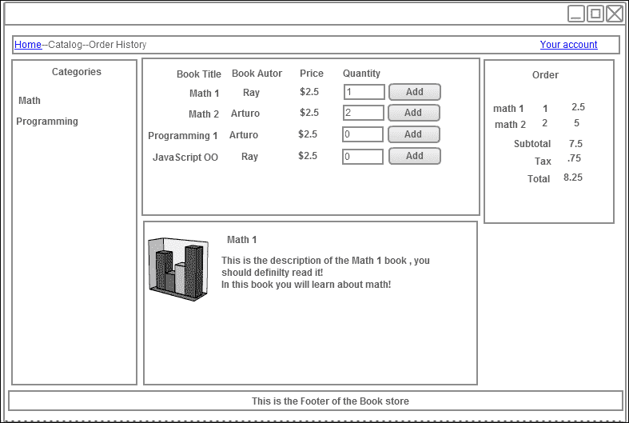
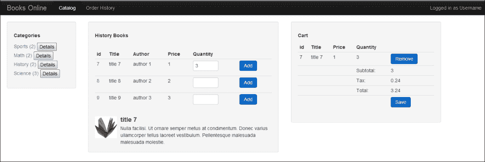
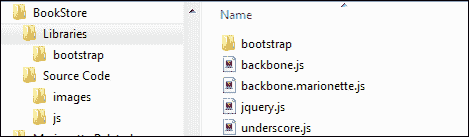
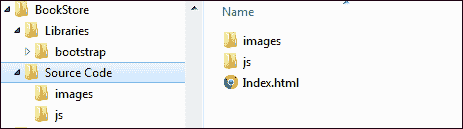
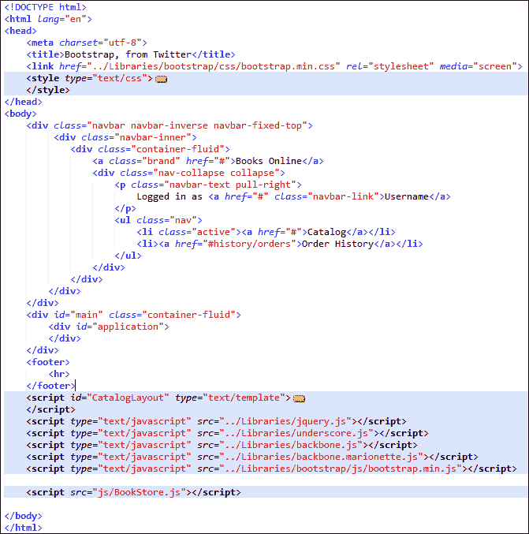

# 第二章 我们的第一个应用

在上一章中，我们学习了 Marionette 是什么，在哪里可以找到源代码和文档，以及其他有助于我们学习 Marionette 的有用资源。但我们认为，学习最好的方式是将所学应用于实践。因此，在本书中，我们将构建一个具有适度复杂性的应用，即复杂到足以突破 Hello World!的障碍，使我们能够发现 Marionette 提供的优势，但简单到足以在本书中完成。我们将展示一些独立的代码片段来介绍每个新概念；然而，大多数时候我们将坚持应用代码。

在本章中，我们将回顾如何设置开发环境以构建我们的第一个应用。我们还将学习`Marionette.js`的三个重要部分：Marionette 路由器、Marionette 控制器和 Marionette 应用。

# 我们正在构建的简介

本书我们将构建的应用是一个书店网站。我们应能够在网站上执行以下操作：

+   显示书籍类别列表

+   选择一个类别并显示相关书籍

+   展示书籍的描述、价格和其他重要细节

+   将书籍添加到购物车

+   显示购物车中的商品

我们将要构建的网站只是一个示例应用。必须遵循本书中提出的结构，因为每个应用都有不同的需求。尽管如此，它是一个良好的起点，我们的想法是展示 Marionette 的每个组件是如何解决问题以及如何使这些组件协同工作的。

此外，请记住，我们将关注代码的 Marionette 组件，详细解释它们的优点，以及如何将它们添加到应用中。然而，我们不会深入探讨 Backbone 的细节，如`Backbone.Model`和`Backbone.Collection`，这些是 Backbone 的核心组件，因为假设读者已经了解这些内容。

Marionette 为 Backbone 添加的一个概念是应用对象——`Backbone.Marionette.Application`。我们将从本书的这个主题开始，因为这个对象将是所有 Backbone 视图和模型的容器。其一个职责是在用户开始与网站交互之前，必须初始化一些组件，例如将监听应用路由（URL）变化的`Backbone.Router`组件。这个对象提供了一些方便的方法来执行这个初始化。但在我们深入细节之前，让我们首先看看我们正在构建的内容。

以下截图有助于我们展示我们将要构建的书店应用的结构：



我们有一个导航部分，提供书籍的分类。然后在中间，我们有两个部分。顶部的是按名称、作者和价格列出的书籍列表。此部分还允许用户订购书籍。

屏幕中央的第二部分将在用户从顶部列表中选择时显示每本书的描述。最后，屏幕右侧是我们的订单部分，它将包含有关我们订单的详细信息。

在本书的结尾，应用程序应如下截图所示：



本章的目标是构建书店网站的基础，其中一部分基础是让 `Backbone.Marionette.Application` 对象具有足够的功能，以便我们可以称之为应用程序。我们的理念是一步一步地前进，然后检查我们的位置。那么，让我们开始吧！

# 设置我们的开发环境

由于我们将一起构建应用程序，我们需要设置我们的开发环境。以下是为此执行此操作的步骤：

1.  创建一个文件夹，并将其命名为 `Bookstore`。

1.  在此文件夹内，创建两个新的文件夹——一个命名为 `源代码`，另一个命名为 `库`。

1.  在 `库` 文件夹中，放置以下四个库：

    +   `Underscore.js`

    +   `jQuery.js`

    +   `Backbone.js`

    +   `Backbone.Marionette.js`

    为了样式化目的，我们将使用 Twitter bootstrap v2。下载默认包，解压它，并将整个解压的 bootstrap 文件夹放置在 `库` 文件夹中的 `.js` 文件旁边。

1.  在 `源代码` 文件夹中，创建一个名为 `js` 的新文件夹，因为这是我们保存所有 JavaScript 文件的位置。

1.  在 `源代码` 文件夹下，创建一个 HTML 文件，并将其命名为 `Index.html`。它应放置在 `js` 文件夹同一级别。

1.  确保您的文件夹结构如下截图所示，并且在 `库` 文件夹中包含正确的库文件。

    您的 `源代码` 文件夹应如下截图所示：

    

    我们正在构建一个单页应用程序，在本节中，我们将为我们的应用程序构建初始的 HTML 页面结构。这是服务器首次渲染用户输入网站 URL 时将渲染的 HTML 文件。

1.  在您偏好的代码编辑器中打开 `Index.html` 文件。

1.  为了避免手动编写本章的 HTML 文件这一繁琐的任务，我们已将其提供给您，请访问 [`jsfiddle.net/`](http://jsfiddle.net/)。代码可在 [`jsfiddle.net/rayweb_on/hsrv7/11/`](http://jsfiddle.net/rayweb_on/hsrv7/11/) 获取。

    ### 注意

    [jsfiddle.net](http://jsfiddle.net/)——如果您还不知道，这是一个测试您 JavaScript 代码小部分并轻松分享代码片段的优秀工具。

    我确信如果你正在阅读一本 Marionette 书，那是因为你已经有足够的经验将 CSS 和 JS 标签放在正确的位置。所以请随意跳过以下步骤。

1.  复制 **CSS** 部分，并将其粘贴到 HTML 文件的 `<head>` 部分。

1.  复制 **HTML** 部分，并将其粘贴到 HTML 文件的 `<body>` 部分。

1.  在 [`jsfiddle.net/`](http://jsfiddle.net/)，脚本已经为你准备好了。但在我们的本地环境中，我们必须添加它们。我们将在 `<html>` 标签的底部进行操作，但仍然在 `<body>` 标签内。

1.  当你完成复制初始结构后，你的 HTML 文件应该看起来像下面的截图（截图中的样式脚本和模板脚本已折叠）。在本章中，我们将使用你浏览器的控制台，并且目前我们不会与 HTML 文件进行交互，但你的 `Index.html` 文件遵循以下截图所示的结构是很重要的：

    ### 注意

    引导和样式化你的页面超出了本书的范围。但这是一个非常方便的库，它允许我们为这个演示应用程序设置一个看起来不错的 HTML 文件。

    但是等等……最后一个脚本 `js/BookStore.js` 指的是什么？嗯，那是我们在下一步将要创建的 JavaScript 代码。

# Backbone.Marionette.Application 对象

在 `js` 文件夹内创建一个新文件，并将其命名为 `BookStore.js`。要创建一个新的应用程序，我们只需要在 `Bookstore.js` 中输入以下行：

```js
var bookStoreApp = new Backbone.Marionette.Application();
```

我们将命名应用程序为 `BookStoreApp`，并将开始将我们的 Backbone 组件附加到这个应用程序上。但是，我们已经提到过 Marionette 引入了应用程序对象的概念，并且从文档中我们也可以知道，这是一个将帮助我们协调应用程序各个组件的对象。你可能想知道，哪些组件；例如，一个 `Marionette.Router` 对象和一个 `Marionette.Controller` 对象。

## Backbone 已经有一个路由器了！

是的，Backbone 已经有一个路由器对象。那么 `Marionette.Router` 对象有什么不同之处呢？嗯，新的路由器增加了将你的路由器简化为仅包含应用程序路由的小文件的能力，而不会包含一旦路由匹配就会响应和采取行动的方法。这些方法属于控制器——Marionette 为 Backbone 添加的另一个新概念。

让我们构建一个 `Marionette.Router` 对象和一个 `Marionette.Controller` 对象，以便更好地理解它们：

```js
var BookStoreController = Backbone.Marionette.Controller.extend({displayBooks : function (){
    console.log("I will display books...");
  }
});
var BookStoreRouter = Backbone.Marionette.AppRouter.extend({
  controller :  BookStoreController,
  appRoutes: {
    "": "displayBooks"
  }
});
```

在前面的代码片段中，我们创建了 `BookStoreController` 对象，它只是一个包含将匹配路由器中定义的方法名称的函数的 JavaScript 对象。在这种情况下，空的路由器将调用 `displayBooks` 方法或控制器。这种关注点的分离将使我们能够拥有一个更干净的代码库，因为路由器只知道关于路由的信息。我们通过将路由器的控制器属性设置为 `BookStoreController` 来声明哪个控制器将处理路由。代码片段的其余部分只是路由的声明。

使用控制器并不强制要求有一个路由器。Marionette 控制器可以在不需要路由器的情况下实例化。您可能不会通过 URL 的变化来处理您网站的交互，而是通过事件。在这种情况下，控制器仍然具有价值，因为它可以成为您视图的容器。

建议根据您应用程序的目的将路由器和控制器分成小的部分，而不是一个包含所有路由和函数的巨大单一路由器文件。

虽然这两部分是应用程序基础的一部分，但我们仍然需要在其中使它们工作。但是，我们还需要做更多的事情才能实现一个功能性的应用程序。让我们一步一步来。让我们首先检查我们是否能在浏览器控制台中看到消息日志。

要做到这一点，我们需要将所有代码放在一起，并添加缺失的部分以使其工作。

到目前为止，我们只定义了应用程序、控制器和路由器。但我们应该在何处实例化它们？`Backbone.Marionette.Application` 对象提供了在启动我们的应用程序时运行初始化方法的可能。

是的，您读得正确！如果您想保持初始化器的逻辑分离，您可以添加任意多的方法。

在这个初始化方法内部，我们将实例化路由器和控制器，并且为了好玩，添加另一个日志消息以查看执行顺序。

使用以下代码来完成此操作：

```js
BookStoreApp.addInitializer(function () {
  var bookStoreController = new BookStoreController({
    var bookStoreRouter = new BookStoreRouter({controller:controller});
  console.log('Message from the addInitializer Method');
..});
})
```

应用程序的另一个有用功能是触发 `initialize:before`、`initialize:after` 和 `start` 函数的事件。这些函数的名称相当描述性。正如其名称所暗示的，`initialize:before` 函数将在初始化之前执行，`initialize:after` 函数将在初始化之后执行，而 `start` 函数负责启动应用程序，然后启动初始化器。

在我们的应用程序中，我们将使用 `initialize:after`。这个函数对我们很有帮助，因为我们最不想做的是在实例化路由器后启动 `Backbone.history`。

```js
BookStoreApp.on('initialize:after', function () {
  if (Backbone.history) {
    Backbone.history.start();
  }
  console.log('Mesagge from initialize:after method');
});
```

完成我们的应用程序的基础设施或基础结构的最后一步是调用以下函数：

```js
BookStoreApp.start();
```

现在，让我们将所有代码片段组合如下：

```js
var BookStoreApp = new Backbone.Marionette.Application();
var BookStoreController = Backbone.Marionette.Controller.extend({
  displayBooks : function (){
    console.log("I will display books...");
  }
});
var BookStoreRouter = Backbone.Marionette.AppRouter.extend({
  controller :  BookStoreController,
  appRoutes: {
    "": "displayBooks"
  }
});
BookStoreApp.addInitializer(function () {
  var controller = new BookStoreController();
  var router = new BookStoreRouter({controller:controller});
  console.log("hello from the addInitializer.");
});
BookStoreApp.on('initialize:after', function () {
  if (Backbone.history) {
    Backbone.history.start();}
  console.log("hello from the initialize:after.");
});
BookStoreApp.start();
```

### 小贴士

**下载示例代码**

您可以从您在[`www.packtpub.com`](http://www.packtpub.com)的账户下载您购买的所有 Packt 书籍的示例代码文件。如果您在其他地方购买了这本书，您可以访问[`www.packtpub.com/support`](http://www.packtpub.com/support)并注册，以便将文件直接通过电子邮件发送给您。

现在，您可以继续在浏览器中打开`Index.html`文件，并在控制台查看结果。

# 摘要

在本章中，我们学习了应用、控制器和路由功能的应用，以及如何使它们协同工作以获得一个简单的应用程序骨架，这将是我们的书店应用程序的基础。

在下一章中，我们将熟悉 Marionette 为 Backbone 开发添加的不同视图。
