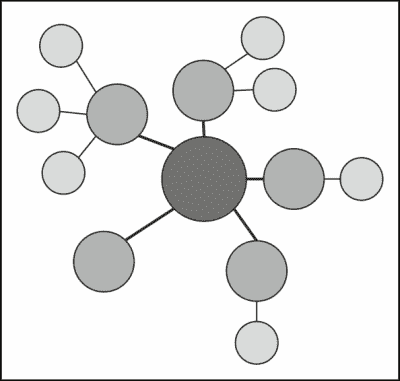
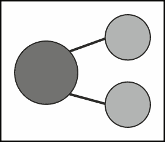

# 第五章。分而治之——模块化一切

在第四章中详细解释了如何实现`Marionette.js`中的区域来管理视图后，现在是时候了解如何处理复杂的 JavaScript 项目，并学习如何创建一个在子应用中可扩展且应需要最小努力来扩展的框架。

以下列表包含我们将在本章中涵盖的主要主题，以及我们在使用`Marionette.js`构建模块化和可扩展的单页应用时应考虑的主题：

+   分而治之

+   模块

+   子应用

+   内存管理

# 应用分而治之原则

复杂性是软件的敌人，构建复杂的 JavaScript 应用很容易失控。有多种处理复杂性的方法，但最有效的方法是使用分而治之的原则。

通过其模块定义，`Marionette.js`允许我们将代码拆分成更小、责任更单一的块。如果我们不将代码拆分成更小的部分，我们将减慢开发速度，并使我们的应用难以维护。结构化代码的最简单起点是`Marionette.Application`。应用的主要职责是启动和停止子应用，并在必要时调解跨子应用通信。以下图像显示了我们可以从应用对象开始，如何将我们的解决方案模块化到子应用和模块中：



对于我们正在构建的**单页应用**（SPA）示例，我们可能从一开始就不需要很多子应用。但真正重要的是要知道如何使用这个强大的功能，它有助于将应用拆分成更小、责任单一的单元。子应用模块是我们应用中的独立部分，它们可以包括路由器、控制器、模型、布局和视图。

所有模块都可以按需加载，因此它们不需要从一开始就创建。例如，我们可以在子应用路由匹配特定模式时启动它们。

# 模块化单页应用

设计单页应用程序的基础架构并非易事。SPAs 与经常有完整页面重新加载的传统 Web 应用程序相反。它们是运行在一个页面上的动态页面应用程序，通常需要花费一些时间来设计基础。由于我们在客户端存储应用程序状态，因此它们更像桌面应用程序，但管理它很快就会成为一个问题。正如我们从分而治之原则中学到的，一个问题可以被分成几个部分，这样每个部分就可以独立处理。话虽如此，让我们探索如何实现一个应用程序，该应用程序将根据需要加载具有单个职责的子应用程序，每个子应用程序都有停止和启动模块的能力。

# 从模块开始

|   | "风格、和谐、优雅和良好节奏之美取决于简单。" |   |
| --- | --- | --- |
|   | -- 柏拉图 |

通过理解分而治之的概念，我们应该同意代码模块化非常重要。模块是小型、简单且封装良好的包，具有单一的关注点以及定义良好的函数；它们可以与其他模块结合使用，以创建整个系统。在`Marionette.js`中，一个模块提供高级功能，并管理提供实现细节的对象。

让我们定义一个没有功能的模块，以便继续从书店的例子中进行示例，我们将创建包含购物车和订单历史子应用程序的模块：

```js
var MyApp = new Backbone.Marionette.Application();
var myModule = MyApp.module("MyModule");
```

`Marionette.js`的模块在`app.start()`调用之后加载和定义，并且它们是完全实例化的对象。正如你所看到的，Marionette 的模块悬挂在我们的应用程序上。现在让我们定义一个真实的模块定义：

```js
Books.module('HistoryApp', {
  startWithParent: false,
  define: 
  function (HistoryApp, App, Backbone, Marionette,$, _) {

  }
});
```

以下是对前面代码片段的解释：

+   `Books`: 这是主要的应用程序对象。

+   `HistoryApp`: 这是命名模块。

+   `startWithParent`: 如果我们希望手动启动模块而不是让应用程序启动它，则此值应为`false`。我们必须告诉模块定义不要与父对象一起启动，这正是我们的场景，因为我们不希望从开始就启动所有子应用程序。这个概念将在本章的*与子应用程序一起工作*部分详细解释。

函数参数的解释如下：

+   `App`: 这是管理模块生命周期的应用程序中心对象

+   `Backbone`: 这是`Backbone`库的引用

+   `Marionette`: 这是`Backbone.Marionette`库的引用

+   `$`: 这是 DOM 库的引用，在这种情况下是 jQuery。

+   `_`: 这是下划线的引用

除了解释过的参数外，你还可以向这个函数定义传递自定义参数。现在我们有一个非常简单的模块，准备封装一些所需的功能。

# 将模块拆分为多个文件

有时候，一个模块太长，不适合放在单个文件中，我们希望将定义分散到多个文件中。但是，子应用模块通常包含控制器、路由器和视图等，所以我们不想将它们全部放在一个文件中。`Marionette.js`模块使这一点变得非常简单，所以让我们看看。

以下是一个控制器文件的示例代码：

```js
Books.module('HistoryApp', function (HistoryApp, App) {    
    HistoryApp.Controller = Marionette.Controller.extend({

    });
});
```

以下是一个路由器文件的示例代码：

```js
Books.module('HistoryApp', {
    startWithParent: false,
    define: 
  function (HistoryApp, App, Backbone, Marionette, $, _) {
    var Router = Backbone.Router.extend({

    });
  }
});
```

我们创建了两个文件，一个用于控制器，另一个用于路由器，这两个文件都包含在同一个模块 HistoryApp 中，但位于不同的文件中。

# 实现初始化器和终结器

模块具有类似于应用对象的初始化器和终结器。初始化器在模块启动时运行，终结器在模块停止时运行。

让我们在现有的模块中添加一个初始化器和终结器：

```js
Books.module('HistoryApp', function (HistoryApp, App) {
    'use strict';

    HistoryApp.Controller = Marionette.Controller.extend({

});

    HistoryApp.addInitializer(function (args) {
        HistoryApp.controller = new HistoryApp.Controller();
    });

    HistoryApp.addFinalizer(function () {
        if (HistoryApp.controller) {
            HistoryApp.controller.close();
            delete HistoryApp.controller;
        }
    });

});
```

这个例子展示了我们如何在模块内部创建定义。在这种情况下，我们添加了一个控制器，实际上并没有创建任何对象——只是定义——然后我们让初始化器在模块加载时创建对象并设置它们。

# 与子应用一起工作

我们这本书的示例应用是一个可以包含几个较小应用的单个应用，例如购物车和订单历史。每个应用都是独立的，但由同一个应用管理，并在必要时能够与其他模块交互。下图中描述了由中央应用管理的两个子应用的概念。



每个子应用通常与 SPA 中的一个屏幕相关联。它们负责使用控制器来执行屏幕更改所需的工作，控制器负责启动和停止模块以及处理它们的通信。它们还管理布局，操纵区域以显示或隐藏视图。查看与图表相关的代码。

现在我们来探索如何定义两个子应用，每个子应用都位于不同的文件中，正如我们在上一节中学到的。

以下是我们第一个应用：

```js
Books.module('HistoryApp', function (HistoryApp, App) {
    'use strict';

    HistoryApp.Controller = Marionette.Controller.extend({

    });
});
```

我们的第二个应用如下：

```js
Books.module('CartApp', function (CartApp, App) {
    'use strict';

    CartApp.Controller = Marionette.Controller.extend({

    });
});
```

这些应用由中央应用（`App`）管理，该应用作为参数传递。这两个模块都包含一个控制器定义作为示例。

下面的代码片段演示了主应用能够启动和停止子应用：

```js
Books = (function (Backbone, Marionette) {
    'use strict';

    var App = new Marionette.Application();

    App.on('initialize:after', function () {
        if (Backbone.history) {
            Backbone.history.start();
        }
    });

    App.startSubApp = function (appName, args) {
        var currentApp = App.module(appName);
        if (App.currentApp === currentApp) { return; }

        if (App.currentApp) {
            App.currentApp.stop();
        }

        App.currentApp = currentApp;
        currentApp.start(args);
    };

    return App;

})(Backbone, Backbone.Marionette); 
```

如我们所见，主应用定义在一个自调用函数中。当我们创建它时，它会自动/立即运行，请注意，调用该函数会返回主要的`App`对象。

函数`startSubApp`提供了启动和停止模块的能力。这个函数可能在用户点击按钮打开历史记录或用户直接导航到这个特定路由时被调用。下一步是了解如何调用这个函数。

# 使用路由过滤器

我们已经了解了如何将应用划分为子应用；然而，我们仍需要决定何时以及如何通知主应用我们需要启动特定的子应用。为了实现这一点，每个模块都应该与一个特定的路由器关联，该路由器需要从一开始就处于活动状态。这与当路由匹配时可以懒加载的模块不同。`Marionette.js`的创建者通过我们之前提到的`BBCloneMail`示例应用完美地解决了这个场景。为此，他包含了一个名为`routefilter.js`的库。与任何其他库一样，这个库通过在我们的项目中添加路径引用来安装。

路由过滤器可以在[`github.com/boazsender/backbone.routefilter`](https://github.com/boazsender/backbone.routefilter)找到。

通常，当我们使用由子应用组成的 SPA 时，同一时间只有一个子应用处于活动状态，我们的示例应用也不例外。这一点很重要，以便理解接下来的代码。

以下代码是针对`cart`路由器的：

```js
Books.module('CartApp', {
    startWithParent: false,

    define: function (CartApp, App, Backbone, Marionette, $, _) {
        'use strict';

        var Router = Backbone.Router.extend({
            routes: {
                   "(:category)(/:id)": "init"
            },

            before: function () {
                App.startSubApp('CartApp');
            },

            init: function (category,id) {
                //call cart app controller function
            }
        });

        App.addInitializer(function () {
            var router = new Router();
        });
    }
});
```

如我们之前提到的，每个子应用通常都关联着一个路由器。这个路由器将成为该应用的入口点，并负责懒加载它。

让我们来解释一下代码的各个部分。在这里，`before`是一个使用`routefilter.js`的魔法定义的函数。这个函数在映射特定路由的任何函数之前执行。这意味着路由器将知道我们正在尝试访问特定的子应用，并通过调用我们之前访问的函数来启动它，该函数位于主应用中（`App.startSubApp('CartApp')`）。我们已熟悉的其它部分包括模块初始化器和路由定义。

那么，如果我们现在想启动历史应用会怎样？很简单，只需创建一个与该子应用关联的路由器，定义该路由器，我们就完成了。

以下代码将这个概念付诸实践：

```js
Books.module('HistoryApp', {
    startWithParent: false,

    define: 
      function (HistoryApp, App, Backbone, Marionette, $, _) {
        'use strict';

        var Router = Backbone.Router.extend({
            routes: {
                "history/orders": "showHistory",
            },
            before: function () {
                App.startSubApp('HistoryApp');
            },

            showHistory: function () {
                // call history app controller
            }
        });

        App.addInitializer(function () {
            var router = new Router();
        });
    }
});
```

# 内存考虑事项

单页应用中的一个主要挑战是消除内存泄漏。主要问题是我们从未进行过完整的页面重新加载以刷新内存。因此，当放置新的子应用以模拟页面加载时，应用需要处理关闭子应用，从而解除所有与其相关的事件和对象。

但是，如果我们没有正确清理引用，我们仍然可以通过僵尸进程搞乱内存。因此，就像主应用一样，所有子应用都应该关闭旧视图，这就是 Marionette 的 Region 发挥作用的地方。这特别确保了在对象被销毁或我们在区域中切换视图时解除所有事件。

在子应用程序的情况下，有多种清理内存的方法。为了说明这一点，让我们回顾一下“与子应用程序一起工作”部分的一些代码。此函数旨在根据需要停止和启动子应用程序。我们使用这项技术以确保同时只有一个子应用程序运行；一旦子应用程序停止，所有其对象和事件都将被销毁。

```js
    App.startSubApp = function (appName, args) {
        var currentApp = App.module(appName);
        if (App.currentApp === currentApp) { return; }

        if (App.currentApp) {
            App.currentApp.stop();
        }
        App.currentApp = currentApp;
        currentApp.start(args);
    };
```

在我们的例子中，如果应用程序停止了，路由器提供了调用此函数以在需要时再次启动子应用程序的功能。下面的代码来自本章的“使用路由过滤器”部分。

```js
    before: function () {
      App.startSubApp('HistoryApp')
    },
```

作为一个重要的注意事项，我们需要培养纪律性，记住每次我们创建对象时，都应该编写适当的代码来删除它们，始终利用`Marionette.js`的能力。

# 摘要

到目前为止，我们在创建软件时遇到的主要问题是复杂性。`Backbone.js`提供了一个易于开始的模型视图结构起点，但它主要提供低级模式。在更复杂的应用程序的情况下，我们可以利用一些其他框架在`Backbone.js`之上提供缺失的部分。对于你系统中的每个部分，找到解决问题的方法，并将各部分的解决方案组合起来以获得原始问题的解决方案。在实现你的模块时，始终追求可读性和可维护性，并尝试封装行为，而不仅仅是无理由的状态代码。

模块解决了封装的大规模需求，而控制器、视图、路由器和区域则处理问题的更详细方面。

分而治之是一个多年来一直被使用的原则，当处理大型和复杂系统结构时，这是最有用的概念之一。继续掌握我们所学到的所有最佳实践，并尝试将它们作为你应用程序的有机组成部分。下一步是学习使用`Marionette.js`进行消息传递。
