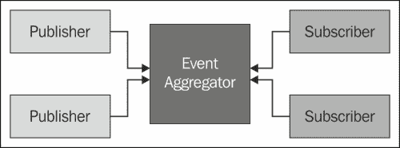
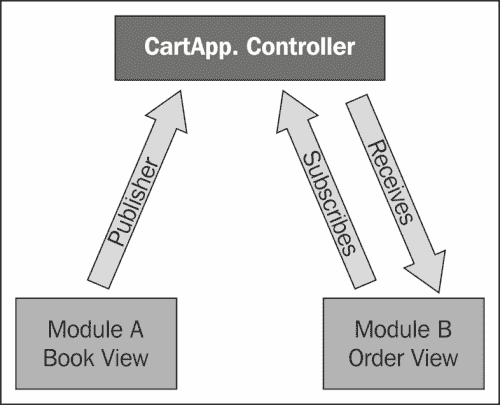

# 第六章. 消息传递

上一章提出了一种架构，允许将整个应用程序划分为子应用程序和模块。子应用程序只是应用程序的独立部分，它们的功能完全独立。

设计模块和子应用程序的目标是创建一个既集成又松散耦合的整个系统，这正是非常著名的技术出现的地方：消息传递。消息传递的概念，就像分而治之的方法一样，已经存在很长时间了，开发者每天都在使用这些类型的工具和模式。这个模式试图提供一个组件通过消息相互交流的方式，从而允许模块在公共消息总线上订阅和发布事件。

本章将涵盖以下主题：

+   理解事件聚合器

+   使用`Marionette.js`的事件聚合器

+   使用事件聚合器扩展应用程序

+   开始使用`Commands`

+   设置`RequestResponse`对象

# 理解事件聚合器

根据*Martin Fowler*的说法，事件聚合器执行以下操作：

> “将多个对象的事件通道到一个单一对象中，以简化客户端的注册。”

模块化、可扩展和复杂 JavaScript 应用程序中最有用的模式之一是事件聚合。事件聚合器功能位于事件容器中，允许这些事件的发布者和订阅者有一个通信渠道；然而，同时，它还允许它们独立工作，无需它们之间的代码引用，因此它们可以更新或删除而不会影响其他组件。话虽如此，请注意这种解耦在模块化应用程序中的有用性，因为可以添加新的子应用程序和模块，只需利用当前的架构。在我们的复合应用程序设计中，事件聚合器是实现`Marionette.js`对象之间通信的一种强大方式，我们将看到如何在当前代码中集成它。

以下是对事件聚合器的图形解释：



# 使用 Marionette.js 的事件聚合器

事件聚合器模式的 Marionette 实现已经从 Marionette 核心构建中分离出来，现在可以在名为`backbone.wreqr.js`的独立可分发文件中找到。这个实现扩展自`backbone.events`对象。以下是如何实例化事件聚合器的一个示例：

```js
var vent = new Backbone.Wreqr.EventAggregator();
```

你可以开始添加监听器，它们将对触发的事件做出反应：

```js
vent.on("do something", function(){
  console.log("im logging a message");
});
```

现在，你有一个监听器，它将等待一个事件的触发。

让我们触发`do something`方法：

```js
vent.trigger("do something");
```

这就是所有需要记录消息的内容。好吧，但我们在应用级别如何做到这一点呢？`Marionette. An application`对象附带了一个`Backbone.Wreqr.EventAggregator`的实例。因此，通过实例化 Marionette 应用程序对象，您可以在不需要实例化`EventAggregator`对象的情况下开始注册事件监听器。

```js
var myApp = new Backbone.Marionette.Application();
```

以下是如何在应用级别注册事件监听器的示例：

```js
myApp.vent.on("helloWorld", function(){
  alert("Hello World");
});
```

事件发布者现在可以在应用程序的任何地方使用以下代码触发事件：

```js
myApp.vent.trigger("helloWorld"); 
```

如您所见，我们不需要请求应用程序执行某些工作。在这种情况下，为了显示一个警告，我们应该告诉应用程序对象，当工作将要执行时我们需要被通知`MyApp.vent.trigger("helloWorld ")`，这将显示消息。

## 使用事件聚合器扩展应用程序

为了使这个模式更容易理解，我们可以使用购物车应用的隐喻。用户从书籍视图中选择要购买的商品。当新商品添加到订单视图中时，需要通知订单视图以显示它并计算总价。

例如，我们有多种方法来完成这个功能，最明显的方法是在书籍视图中引用订单视图，这样我们就可以调用方法或触发事件。但这样，我们将有一个高度耦合的设计，您不能删除订单视图而不影响书籍视图。因此，现在是时候将事件聚合器引入我们的应用程序并解决这个问题了。

我们需要一个中央对象来管理事件及其订阅者。在这个例子中，我们将使用控制器。有了这个控制器和事件聚合器，视图之间将解耦。这意味着书籍视图不会包含订单视图的引用，并且可以修改而不会出现设计问题。

以下是为添加控制器编写的代码：

```js
var cartApp.Controller = App.Controller.extend({
        initialize: function (options) {
            var self = this;
            App.vent.on("itemAdded", function (model) {
                self.addProduct(model);
            });
        },
        addProduct: function (model) {
        //call orders view
        }
});
```

当控制器初始化时，我们注册了添加项目的监听器。它期望从发布者事件接收参数，然后调用本地函数。下一步是创建触发事件的视图。

以下是为添加视图编写的代码：

```js
CartApp.BookItemView = Backbone.Marionette.ItemView.extend({
        template: "#catalogRow",
        tagName: "tr",
        events: {
            'click .btn-primary': 'addItem',
        },

        addItem: function () {
            if (this.$('input').val() > 0) {
               this.model.set({ qty: this.$('input').).).val() });
            App.vent.trigger("itemAdded", this.model);
          }
        },
    });
```

这包含一个声明了事件的视图；当执行`addItem`函数时，此事件将由视图中的按钮调用。它还触发了`App.vent.trigger("itemAdded", this.model)`事件；此事件将由中央对象，即控制器，处理并调用订单视图。很简单，对吧？这样，我们这里没有订单视图的引用，允许两个视图独立发展。

以下是对我们刚才解释的代码的图形说明。如你所见，我们有一个中心对象，即控制器；它包含监听器，在图书视图中的按钮被点击后，将事件提升以刷新订单视图。你也可以根据你的业务流程更新多个模块。



这种设计还允许控制器拥有多个视图或模块，它们监听事件并相应地做出反应。事件聚合器是一个强大的模式，它能够在模块之间发送消息，使应用程序彼此之间更加解耦。

# 开始使用命令

当使用纯 Backbone 构建应用程序时，你将只有四个组件：模型、集合、视图和路由器。到目前为止，我们已经回顾了 Marionette 添加的一些对象，例如控制器和应用程序，当然还有不同类型的视图。这些对象中的每一个都旨在减少样板代码并简化将应用程序结构化的过程，以在代码中实现相关的分离，因为并非所有内容都属于视图或路由器。我们现在知道控制器是协调我们的视图的完美地方，但那些不属于视图的代码片段怎么办？显然，将这些代码放入路由器或模型中是没有意义的，因为它们旨在跨所有应用程序使用；对于这些场景，Marionette 有 `Commands` 组件。

为了实例化它，我们只需要以下这一行：

```js
var commands = new Backbone.Wreqr.Commands();
```

如你所见，它也是 `Wreqr` 对象的一部分，所以你可以单独使用它。现在，我们需要设置处理程序，一旦你通过 `execute` 关键字调用它们，它们就会执行动作。

```js

commands.setHandler("logMessage", function(){
  console.log("Im logging an important message");
});
```

`setHandler` 函数接受命令名称和它将执行的函数。

以下代码行展示了使用命令名称作为 `execute` 函数参数来执行命令的示例：

```js
commands.execute("logMessage");
```

要设置命令并执行它，你只需要做这些。了解你可以像在事件聚合器中一样将这些命令传递参数是很好的。

在以下示例中，我们将传递要记录的消息：

```js
var commands = new Backbone.Wreqr.Commands();
commands.setHandler("logMessage", function(message){
  console.log(message);
});
commands.execute("logMessage","I am the message to be logged ");
```

如你所见，函数接收执行调用传递的消息。当然，这个参数可以是你要传递给处理程序的你需要的任何对象。

现在，让我们在我们的 BookStore 应用程序中使用一个命令，但我们不会实例化 `Wrerq` 组件，因为 Marionette 应用程序对象已经有一个实例。所以，你可以将命令的处理程序设置到应用程序对象中。

以下代码演示了如何将处理程序设置到应用程序对象中：

```js
var App = new Marionette.Application();

App.commands.setHandler("deleteLocalStorage", function(){
  // code todelete the local storage of the application
});
App.execute("deleteLocalStorage");
```

注意，你可以调用 `App.command.execute` 或只是 `App.execute` 加上命令名称，结果将是相同的。

上一个代码中创建的处理程序是用来删除浏览器本地存储中存储的值，以从网站之前的访问中删除旧条目。这段代码不属于任何视图或控制器，因为那些对象的责任与这段代码所做的不一样。我们认为清理浏览器本地存储以防止代码中的旧和无效条目是很有用的，并且为此有一个命令是非常方便的。

我们可以从应用程序的任何部分执行它，但代码放置得很好，以便保持您的关注点分离。我们确信您会发现使用 Backbone 和 Marionette 时使用命令的场景是有意义的。

最后，如果您想删除处理程序，可以使用以下代码行：

```js
App.commands.removeHandler("deleteLocalStorage");
```

要一次性删除所有已注册的处理程序，使用指令 `App.commands.removeAllHandlers()`。

# 设置 RequestResponse 对象

最后，`Wreqr` 对象的最后一部分是 `RequestResponse`，在我们看来，这绝对是 Backbone 开发中的一个很好的补充。我们刚刚看到，我们可以如何通过事件的帮助使不同的组件协同工作以相互通信。我们还了解到，并非所有代码都属于视图或控制器的路由器，对于这些情况，Marionette 命令无疑是保持我们关注点分离的一个很好的选择。类似于 `Commands`，`RequestResponse` 对象可以帮助我们在应用程序中分割更多的代码责任。

从概念上讲，`RequestResponse` 对象与事件和 `Commands` 的工作方式相同，其中一个对象发出调用，另一个对象响应它。与 `Commands` 的区别在于，在这种情况下，会返回一个响应给调用者。

要设置 `RequestResponse` 对象，我们需要以下代码行：

```js
var reqres = new Backbone.Wreqr.RequestResponse();
```

处理程序的设置与命令处理程序类似，正如我们可以在以下代码片段中看到的那样：

```js
reqres.setHandler("getUserName", function(userId){
  //code to get the user name goes here
  return Username;  ///this will be the response
});
```

为了获取那个响应值，我们需要按照以下方式发出请求：

```js
var username = reqres.request("getUserName", userId);
```

在上一个示例中，我们请求了一个用户名和处理程序，名为 `getUserName` 的处理程序仅仅是一个函数，它将为我们返回该值。此外，请注意，您可以为此请求传递参数。

我们认为 `RequestResponse` 对象对于分离关注点、从服务器获取值、过滤这些值并再次执行数据操作任务非常有用；这些不是迄今为止审查的 Backbone 或 Marionette 的其他组件的责任。将 `RequestRepsonse` 视为一个服务层，它将在一个地方调用服务器并返回一个集合或模型。而不是在视图级别执行此操作，您的视图应该显示传递给它们的 数据。但它们将承担太多责任，因为它们还负责从服务器检索这些数据，如果您的 API 发生变化怎么办？您将需要更改所有已进行调用的视图或控制器中的服务器调用。

使用`RequestResponse`对象将使您能够在同一位置执行与服务器的同步，并从不同的地方调用它，始终获得相同的返回值。但最重要的是，它允许您解耦应用程序，并保持其他组件的责任和职责简短且有意义。

让我们看看这个例子，但同样，我们将使用 Marionette 应用程序对象中的默认`Wreqr`实例：

```js
 App.reqres.setHandler("GetBooksByCategory", function(category){
  //code to fetch the books by category goes here.
  return collection;
 });
```

在控制器的方法内部，我们可以通过执行请求并将集合传递给视图来调用处理器，如下面的代码片段所示：

```js
     var BooksController = Marionette.Controller.extend({

      initialize: function(options){
          this.region = options.region;
      },

      showBooksinCategory: function(category){
       var books = App.request("GetBooksByCategory ", category); 
       this.region.show(new CategoryView({collection:books}));
      }
    });
```

这种方法的优点在于控制器充当了视图和`RequestResponse`对象之间的调解者，而视图负责获取要删除的数据，因为控制器将集合传递给它。

# 摘要

在本章中，我们学习了如何借助`Wreqr`对象解耦我们的应用程序，同时在不同的子组件如`事件聚合器`、`命令`和`RequestRespone`之间分配责任。

在下一章中，我们将学习如何使用`Require.js`帮助我们在单个文件中使这些组件工作，并保持我们的文件结构有序。
