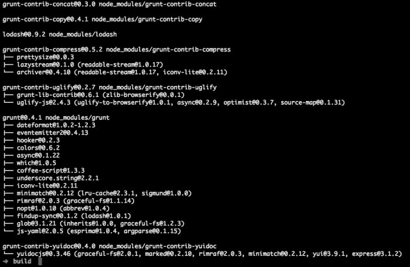

# 第一章。安装 CreateJS

正确安装和使用客户端库非常重要。错误地使用大型客户端库可能会导致真正的问题；一个明显的问题是网页加载缓慢。在本章中，我们将探讨如何为开发和生产环境设置和使用 CreateJS。

在本章中，您将了解以下主题：

+   要求

+   下载

+   安装和设置

# 理解 CreateJS 和子集

CreateJS 包含不同的库，如 **SoundJS**、**TweenJS**、**EaselJS** 和 **PreloadJS**。每个库在浏览器中运行都有不同的要求。

TweenJS 应该在所有浏览器及其旧版本中运行。SoundJS 需要 **HTMLAudio**、**Flash** 或 **WebAudio**，这些功能需要现代浏览器。SoundJS 应该与以下浏览器完美兼容：

+   Google Chrome 31+

+   Mozilla Firefox 25+

+   Internet Explorer 9+

+   Opera 18+

在移动浏览器中，它应该与以下浏览器兼容：

+   iOS Safari 4.0+

+   Android 浏览器 2.3+

+   BlackBerry 浏览器 7.0+

PreloadJS 应该与所有浏览器兼容，甚至包括 Internet Explorer 6。

EaselJS 依赖于 HTML5 canvas，因此您的观众应该拥有以下浏览器之一才能使用 EaselJS：

+   Google Chrome 31+

+   Mozilla Firefox 25+

+   Internet Explorer 9+

+   Opera 18+

对于移动设备，需要以下浏览器之一：

+   iOS Safari 3.2+

+   Opera Mini 5.0-7.0

+   Android 浏览器 2.1+

+   BlackBerry 浏览器 7.0+

## 下载 CreateJS

在以下章节中讨论了将 CreateJS 文件下载并包含到您的项目中的几种方法。

## GitHub

您可以从 GitHub 下载 CreateJS 的最新版本及其所有子集，如下面的截图所示：[`github.com/CreateJS/`](https://github.com/CreateJS/)：


在访问每个仓库后，您可以选择下载最新更改的 ZIP 文件，或者使用 Git 克隆命令从 GitHub 获取源代码，如下面的截图所示：


您可以在每个仓库页面的右侧找到此框，它有助于您获取代码。

## 理解内容分发网络

CreateJS 拥有一个优秀的 **内容分发网络** (**CDN**)，其中包含所有版本和所有子集库。您可以通过 [`code.createjs.com/`](http://code.createjs.com/) 访问 CDN 服务器。

### 注意

在项目中使用托管在 CDN 上的 CreateJS 库的版本可以快速下载并在不同站点上使用相同版本的库进行缓存。这可以减少带宽成本和页面加载时间。

您可以在 [`code.createjs.com/`](http://code.createjs.com/) 找到所有版本，如下面的截图所示：

.jpg)

您还可以使用包含所有库（包括 EaselJS、TweenJS、SoundJS 和 PreloadJS）最新稳定版本的组合版本。

## 设置库

在选择下载源之后，您需要设置库以使其工作。在本节中，我们将了解如何为生产环境和开发环境设置库。

### 生产环境

如果您想在生产环境中使用 CreateJS，事情将会简单得多。您只需要使用单个编译后的源文件。为此，您可以使用 CreateJS CDN 上的托管文件，或者本地构建然后本地链接。

#### 使用 CDN

在这种情况下，您需要做的只是将 `<script…>` 链接到 CreateJS CDN 服务器上文件的源（见本章的 *下载 CreateJS* 部分）；之后，一切应该都能正常工作。

### 开发环境

如果您想调试、使用 CreateJS 进行开发或查看 CreateJS 内部的情况，您需要使用未编译的源文件。

对于每个库，您可以在 `/src/` 中找到未编译的源文件。所有依赖项和源代码都将在这里。

要使用未编译的源文件，重要的是要注意所有文件都应该按照正确的顺序调用；否则，您将遇到一些错误。幸运的是，每个项目中都有一个文件会为您提供有关如何按正确顺序包含文件的提示。此配置文件位于 `build/config.json`。

您可以在以下屏幕截图中看到 EaselJS 的此配置示例：


因此，您必须按照以下顺序放置 `<script…>` 和加载文件。您也可以在其他项目的相同位置找到相同的配置文件。

在加载所有 JS 文件后，您可以使用库，并且也可以在源代码上设置断点以进行跟踪或调试。

# 构建源代码

所有 CreateJS 库都使用 Grunt 来创建和构建文件，因此您需要安装 NodeJS 和 Grunt 模块（需要 0.10.2 或更高版本）。

首先，从 [www.nodejs.org](http://www.nodejs.org) 获取 NodeJS 的最新版本并安装它。然后转到库（例如 EaselJS）的 `/build` 文件夹，并在您的命令环境中运行以下命令：

```js
# Install the grunt command line utility globally 
npm install grunt-cli -g 

# Install all the dependencies from package.json
npm install

```

执行这些命令后，您应该获得以下屏幕截图所示的结果：



在安装所有依赖项后，您只需剩下最后一步来构建库。转到库文件夹并运行以下命令：

```js
grunt build

```

您应该在命令环境中看到以下结果：


当您看到“完成，无错误”的消息时，您可以在库的 `/lib` 文件夹中找到您的编译文件，文件名为 `{PROJECT_NAME}-{VERSION}.min.js`，例如 `easeljs-0.7.0.min.js`。这与 CDN 服务器上的文件完全相同。您可以将本地 `script` 标签链接到该文件并使用它。

如需了解更多关于选项及其使用方法的信息，您可以阅读每个库的 `/build` 文件夹中的 `README.md` 文件。

# 摘要

在本章中，我们学习了如何为不同的环境设置和准备 CreateJS，因为作为一名程序员，您可能希望修改 CreateJS 或为其进行自定义。我们还讨论了在生产环境中使用 CreateJS、使用 CDN 服务器以及构建源代码。

在下一章中，我们将讨论如何使用 CreateJS 编写第一个工作示例以及如何使用 API。
