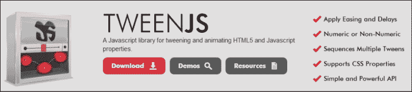
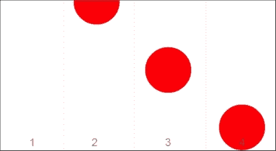
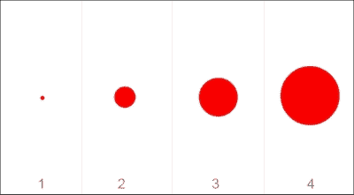
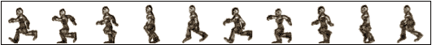
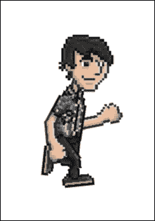

# 第四章：执行动画和变换功能

现在您已经在前一章学习了如何处理事件和回调，现在是时候继续前进并处理动画和变换功能了。本章预计比前一章更具互动性，因为我们将要讨论并使用 CreateJS 的动画和变换功能。在本章中，我们使用 *TweenJS* 和 *EaselJS* 在浏览器中创建基本动画。然后您可以使用这些功能创建更创新的动画。

在本章中，我们将涵盖以下主题：

+   使用 CreateJS 创建动画

+   理解 TweenJS

+   理解 TweenJS API

+   创建简单动画

+   变换形状

+   理解精灵表单

+   使用精灵表单开发动画

# 使用 CreateJS 创建动画

如您可能已经知道，在网页开发过程中在网页浏览器中创建动画是一项困难的工作，因为您必须编写必须在所有浏览器中工作的代码；这被称为 *浏览器兼容性*。好消息是 CreateJS 提供了模块来在网页浏览器中编写和开发动画，而无需考虑浏览器兼容性。CreateJS 模块可以很好地完成这项工作，您需要做的就是与 *CreateJS API* 一起工作。

# 理解 TweenJS

TweenJS 是 CreateJS 的模块之一，它帮助您在网页浏览器中开发动画。我们现在将介绍 TweenJS。

> TweenJS JavaScript 库提供了一个简单但强大的缓动接口。它支持数字对象属性和 CSS 样式属性的缓动，并允许您将缓动和动作链接在一起以创建复杂的序列。——TweenJS API 文档

如需更多关于 TweenJS 的信息，请参阅官方文档：

[`www.createjs.com/Docs/TweenJS/modules/TweenJS.html`](http://www.createjs.com/Docs/TweenJS/modules/TweenJS.html)

## 什么是缓动？

让我们精确地了解什么是缓动：

> 中间帧或缓动是生成两个图像之间中间帧的过程，以使第一个图像看起来平滑地演变到第二个图像。——维基百科

如需更多关于缓动的信息，请访问：

[`en.wikipedia.org/wiki/Tweening`](http://en.wikipedia.org/wiki/Tweening)



与其他 CreateJS 子集一样，TweenJS 包含许多函数和方法；然而，我们将使用并创建特定基本方法的示例，基于这些示例，您可以阅读 TweenJS 的其余文档以创建更复杂的动画。

# 理解 TweenJS 的 API 和方法

为了在 TweenJS 中创建动画，您不需要处理很多方法。有一些函数可以帮助您创建动画。以下都是带有简要描述的方法：

+   `get`: 它返回一个新的缓动实例。

+   `to`: 它从当前值到目标属性排队一个缓动。

+   `set`：它排队一个动作来设置指定目标上的指定属性。

+   `wait`：它排队等待（本质上是一个空的补间动画）。

+   `call`：它排队一个动作来调用指定的函数。

+   `play`：它排队一个动作来播放（暂停）指定的补间。

+   `pause`：它排队一个动作来暂停指定的补间。

以下是一个使用补间 API 的示例：

```js
var tween = createjs.Tween.get(myTarget).to({x:300},400).set({label:"hello!"}).wait(500).to({alpha:0,visible:false},1000).call(onComplete);
```

之前的示例将创建一个补间，它：

+   将目标补间到 `x` 值为 `300`，持续时间为 `400` 毫秒，并将其 `label` 设置为 `hello!`。

+   等待 `500` 毫秒。

+   将目标的 `alpha` 属性补间到 `0`，持续时间为 `1` 秒，并将 `visible` 属性设置为 `false`。

+   最后，调用 `onCom` 完成函数。

# 创建简单动画

现在，是时候使用 TweenJS 创建我们最简单的动画了。它是一个简单但功能强大的 API，它赋予你使用 *方法链式调用* 开发动画的能力。

## 场景

动画有一个从 `Canvas` 元素顶部开始并落下的红色球。



在前面的屏幕截图中，你可以看到我们简单动画的所有步骤；因此，你可以预测我们需要做什么来准备这个动画。在我们的动画中，我们将使用两种方法：`get` 和 `to`。

以下是我们动画的完整源代码：

```js
var canvas = document.getElementById("canvas");
var stage = new createjs.Stage(canvas);

var ball = new createjs.Shape();
ball.graphics.beginFill("#FF0000").drawCircle(0, 0, 50);

ball.x = 200;
ball.y = -50;

var tween = createjs.Tween.get(ball) to({
  y: 300
}, 1500, createjs.Ease.bounceOut);

stage.addChild(ball);
createjs.Ticker.addEventListener("tick", stage);
```

在 JavaScript 代码片段的第二行和第三行中，声明了两个变量，即 `canvas` 和 `stage` 对象。在下一行中，声明了 `ball` 变量，它包含我们的 `shape` 对象。在接下来的行中，我们使用 `drawCircle` 方法（我们已在上一章讨论过 `drawCircle` 方法）绘制了一个红色圆圈。然后，为了将我们的形状对象坐标设置在视口外，我们将 `x` 轴设置为 `-50` 像素。

之后，我们创建了一个 `tween` 变量，它包含 `Tween` 对象；然后，使用 TweenJS 方法链，调用 `to` 方法，持续时间为 `1500` 毫秒，并将 `y` 属性设置为 `300` 像素。`to` 方法的第三个参数代表 `tween` 的 `ease` 函数，在这个例子中我们将其设置为 `bounceOut`。

在以下行中，将 `ball` 变量添加到 `Stage`，并将 `tick` 事件添加到 `Ticker` 类，以在动画播放时保持 `Stage` 更新。你还可以在 30 行找到 `Canvas` 元素，使用它渲染所有动画和形状。

# 变换形状

CreateJS 提供了一些函数，可以在 `Stage` 上轻松变换形状。每个 `DisplayObject` 都有一个 `setTransform` 方法，允许变换 `DisplayObject`（如圆形）。

以下是一个快捷方法，用于快速设置显示对象的变换属性。所有参数都是可选的。省略的参数将使用默认值设置。

```js
setTransform([x=0] [y=0] [scaleX=1] [scaleY=1] [rotation=0] [skewX=0] [skewY=0] [regX=0] [regY=0])
```

这是从：

[`www.createjs.com/Docs/EaselJS/classes/Shape.html#method_setTransform`](http://www.createjs.com/Docs/EaselJS/classes/Shape.html#method_setTransform)

此外，你可以通过`DisplayObject`直接更改所有属性（如`scaleY`和`scaleX`），如下例所示：

```js
displayObject.setTransform(100, 100, 2, 2);
```

## Transforming 函数的示例

作为使用 CreateJS 的形状转换功能的实例，我们将扩展我们之前的示例：

```js
var angle = 0;
window.ball;
var canvas = document.getElementById("canvas");
var stage = new createjs.Stage(canvas);

ball = new createjs.Shape();
ball.graphics.beginFill("#FF0000").drawCircle(0, 0, 50);

ball.x = 200;
ball.y = 300;

stage.addChild(ball);

function tick(event) {
  angle += 0.025;
  var scale = Math.cos(angle);

  ball.setTransform(ball.x, ball.y, scale, scale);
  stage.update(event);
}

createjs.Ticker.addEventListener("tick", tick);
```

在这个例子中，我们有一个红色圆圈，类似于之前的缓动示例。我们将圆圈的坐标设置为`200`和`300`，并将其添加到`stage`对象中。在下一行，我们有一个`tick`函数，它转换圆圈的形状。在这个函数内部，我们有一个`angle`变量，它在每次调用时增加。然后我们将`ballX`和`ballY`坐标设置为`angle`变量的余弦值。所进行的转换类似于以下截图：



这是在 CreateJS 中转换形状的基本示例，但显然你可以通过调整形状的属性和值来开发更好的转换。

# 理解精灵图集

在本节中，我们将讨论使用一系列图像制作动画的 EaselJS 功能。这个功能称为**精灵图集**。精灵图集将一系列图像或动画帧组合成一个 2D 或 3D 动画。例如，如果你想为一个正在行走的英雄制作动画，我们可以将行走角色的所有帧组合成单个图像，然后使用 EaselJS 的精灵图集功能制作动画。

以下是一系列图像（动画帧）的组合成单个图像：



在下一节中，你将学习如何使用精灵图集功能开发动画。

## 使用精灵图集开发动画

让我们先了解`SpriteSheet`类。这个类用于初始化精灵图集功能并封装其属性和配置。创建`SpriteSheet`类后，我们可以使用其方法来控制动画。

这个类的基本配置有三个强制属性：

+   用于动画帧的图像或图像。

+   每个图像的位置，可以使用单个值定义所有帧，甚至可以为每个帧定义单独的配置。

+   动画的表现，可以通过起始帧和结束帧定义，或者为每个帧定义单独的值。

以下是一个定义`SpriteSheet`类配置的代码片段：

```js
data = {
  // list of images or image URIs to use. SpriteSheet can handle preloading.
  // the order dictates their index value for frame definition.
images: [image1, "path/to/image2.png"],

  // the simple way to define frames, only requires frame size because frames are consecutive:
  // define frame width/height, and optionally the frame count and registration point x/y.
  // if count is omitted, it will be calculated automatically based on image dimensions.
frames: {width:64, height:64, count:20, regX: 32, regY:64},

// OR, the complex way that defines individual rects for frames.
  // The 5th value is the image index per the list defined in "images" (defaults to 0).
frames: [
  // x, y, width, height, imageIndex, regX, regY
  [0,0,64,64,0,32,64],
  [64,0,96,64,0]
],

  // simple animation definitions. Define a consecutive range of frames (begin to end inclusive).
  // optionally define a "next" animation to sequence to (or false to stop) and a playback "speed".
animations: {
  // start, end, next, speed
run: [0,8],
jump: [9,12,"run",2]
}

// the complex approach which specifies every frame in the animation by index.
animations: {
  run: {
  frames: [1,2,3,3,2,1]
  },
  jump: {
    frames: [1,4,5,6,1],
    next: "run",
    speed: 2
  },
stand: { frames: [7] }
  }
}
```

以下是为`SpriteSheet`类提供的示例配置：

```js
var data = {
  images: ["sprites.jpg"],
  frames: { width:50, height:20 },
  animations: { 
    run:[0,4], 
    jump:[5,8,"run"]
  }
};
```

这在[`www.createjs.com/Docs/EaselJS/classes/SpriteSheet.html`](http://www.createjs.com/Docs/EaselJS/classes/SpriteSheet.html)中有更详细的解释。

现在，我们将使用精灵图集开发一个简单的行走动画。以下是我们将用于动画帧的精灵图像：


精灵图像

下一步是配置我们的 `SpriteSheet` 类。以下是其配置：

```js
var data = {
  "animations":
  {
    "run": [0, 15]
  },
  "images": ["running.png"],
  "frames": {
    "height": 70,
    "width": 51,
    "regX": 0,
    "regY": 0,
    "count": 16
  }
};
```

我们动画总共有 16 帧；因此，定义动画帧的 *run* 帧集从 `0` 开始，扩展到 `15`。我们定义了精灵图像的路径。然后我们定义了帧的配置，高度为 `70`，宽度为 `51`（这是每个单独图像的宽度），以及一个表示帧数的 `16`。

以下是为动画提供的完整源代码：

```js
stage = new createjs.Stage(document.getElementById("canvas"));

varss = new createjs.SpriteSheet({
  "animations":
  {
    "run": [0, 15]
  },
  "images": ["running.png"],
  "frames": {
    "height": 70,
    "width": 51,
    "regX": 0,
    "regY": 0,
    "count": 16
  }
});

var grant = new createjs.Sprite(ss, "run");

stage.addChild(grant);
createjs.Ticker.setFPS(40);
createjs.Ticker.addEventListener("tick", stage);
```

如前文示例所示，首先我们使用 `Stage` 类定义了舞台。之后，使用配置信息初始化了 `SpriteSheet` 类，然后将对象传递给 `Sprite` 类以开始动画。`Sprite` 类的第二个参数定义了动画的起始帧集。最后，我们使用 `addChild` 方法将 `Sprite` 对象添加到舞台中。

向 `Ticker` 类添加 `tick` 事件并将 `Stage` 对象传递给它以启动动画是很重要的；否则，你将看到一个空白的屏幕。此外，使用 `Ticker` 类和 `setFPS` 方法，我们可以控制动画渲染的比率。

以下图像展示了我们的精灵图集示例的预览：



# 摘要

在本章中，我们学习了如何使用 TweenJS 和 EaselJS 开发和创建动画。我们详细讨论了在 TweenJS 中使用链式方法、动画中的回调函数，以及如何使用 TweenJS 函数更改形状的属性。然后我们学习了如何使用 EaselJS 进行变换，以更改形状的属性，如旋转或缩放。接着我们学习了如何利用精灵图集功能来创建动画角色。

在下一章中，我们将讨论 CreateJS 中的缓存技术以及如何通过缓存来提高应用程序的性能。
