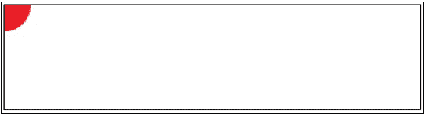
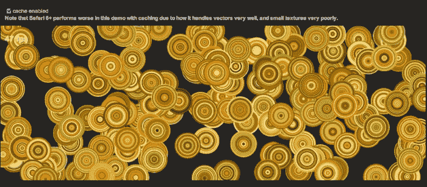
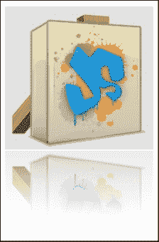

# 第五章：在 EaselJS 中利用缓存

正如你所知，在开发动画后，解决性能问题以使其平滑运行非常重要。渲染动画的性能在不同浏览器之间有所不同，但有一些技术，如缓存，可以简单地提高性能。在本章中，我们将学习如何使用 `DisplayObject` 的 *EaselJS* 缓存系统制作更好、更平滑的动画或绘图。

在本章中，我们将涵盖以下主题：

+   探索 EaselJS 的缓存功能

+   理解缓存方法

+   缓存使用示例

+   在动画中使用缓存

+   使用位图缓存

# 探索 EaselJS 的缓存功能

在 EaselJS 中，当你有一个形状，或者更好的是，一个不经常改变的 `DisplayObject` 实例时，最好使用 *缓存* 函数将其缓存到一个不同的 `Canvas` 元素中。这种技术将帮助你使用 EaselJS 在绘图过程中平滑地动画化和渲染动画或绘图，因为形状不需要在每一帧中重新渲染。

这基本上是使用 `DisplayObject` 类中的 `cache` 方法的核心思想。你所需要做的就是更多地了解如何在 EaselJS 中使用缓存方法。在接下来的章节中，我们将介绍方法、它们的用法以及如何使用缓存创建动画。

# 理解缓存方法

为了理解在 EaselJS 中缓存 `DisplayObject` 的工作原理，我们以一个假想的画布区域为例，这样缓存的元素就会被渲染到其中，每次你需要更新目标形状时，你再次调用 `cache` 方法。

你可以在以下代码片段中看到 `DisplayObject` 类中 `cache` 方法的定义：

```js
cache (x, y, width, height, [scale=1])
```

> 将显示对象绘制到一个新的画布上，然后用于后续的绘制。对于不经常改变的内容（例如，一个包含许多不移动的子项的容器，或一个复杂的矢量形状），这可以提供更快的渲染速度，因为内容不需要在每一帧中重新渲染。缓存的显示对象可以自由移动、旋转、淡入淡出等，然而如果其内容发生变化，你必须手动通过调用 `updateCache()` 或再次调用 `cache()` 来更新缓存。你必须通过 x、y、w 和 h 参数指定缓存区域。这定义了将使用此显示对象的坐标渲染和缓存的矩形。

这是从以下内容摘录的：

[`www.createjs.com/Docs/EaselJS/classes/DisplayObject.html#method_cache`](http://www.createjs.com/Docs/EaselJS/classes/DisplayObject.html#method_cache)

如你所见，`cache` 方法接受四个强制参数和一个可选参数。第一个和第二个参数定义了缓存区域的 *坐标*；第三个和第四个参数定义了缓存区域的 *宽度* 和 *高度*。使用最后一个参数，你可以在缓存区域内定义形状的 *缩放比例*。默认设置为 `1`，但你也可以更改它。

## 缓存使用示例

现在是时候看看在 EaselJS 中使用`cache`方法的示例了。以下代码片段使用`cache`方法将一个圆渲染到画布元素中：

```js
var shape = new createjs.Shape(); 
shape.graphics.beginFill("#ff0000").drawCircle(0, 0, 25); 
shape.cache(-25, -25, 50, 50);
```

在第一行中，我们使用`Shape`类创建了一个形状，用红色填充，然后在`(0, 0)`位置以`25`的半径渲染它。在第三行中，你会注意到`cache`方法的使用。在这一行中，创建了一个位于`-25`，`-25`的*缓存区域*，宽度和高度为`50`。

### 注意

为了更新目标形状（如上述示例中的形状变量），你需要再次调用`cache`或`updateCache`方法，并带上所有新的参数。

完整的源代码和结果如下：

```js
<!DOCTYPE html>
<html>
<head>
<meta http-equiv="content-type" content="text/html;charset=UTF-8">
<title>Cache method in EaselJS</title>
<script type='text/javascript' src='createjs.js'></script>

<script type='text/javascript'>
window.onload=function() {
  var canvas = document.getElementById("testCanvas");
  var stage = new createjs.Stage(canvas);

  var shape = new createjs.Shape();
  shape.graphics.beginFill("#ff0000").drawCircle(0, 0, 25); 
  shape.cache(-25, -25, 50, 50);

  stage.addChild(shape);
  stage.update();
}
</script>

</head>
<body>
<canvas id="testCanvas" width="400" height="100" style="border: 1px solid black;"></canvas>
</body>
</html>
```

上述源代码是使用 EaselJS 中缓存方法完成的示例。此源代码的结果如下面的截图所示：



# 在复杂形状和动画中使用缓存

在 EaselJS 中，当你画布中有复杂形状或动画时，缓存非常有用。在大多数情况下，带有细节的复杂形状不应该在每个 tick 中渲染。因此，你可以简单地使用缓存方法来缓存它，以防止渲染开销。

现在我们将看到一个来自 EaselJS 库的复杂示例（来源：[`github.com/CreateJS/EaselJS/blob/master/examples/Cache.html`](https://github.com/CreateJS/EaselJS/blob/master/examples/Cache.html)）以及使用缓存技术在其中的效果。在这个动画中，我们将创建大约*200*个复杂的圆圈并在每个 tick 上移动它们。页面上有一个复选框，用于通过`cache`和`uncache`方法启用或禁用画布区域内所有形状的缓存。

以下截图展示了我们动画的预览（注意复选框）：



有三个主要函数处理这个动画和所有逻辑；`init`、`tick`和`toggleCache`。我们将分别讨论每一个。

在代码的第一行中，我们将使用以下变量：

```js
var canvas;
var stage;
var shape;
varcircleRadius= 30;
var rings = 30;
```

第一个变量持有画布元素，第二个用于`Stage`对象，`shape`变量用于在舞台上绘制形状，而`circleRadius`和`rings`用于圆的基本设置。`circleRadius`用于定义每个圆的半径，而`rings`用于定义每个圆内环的数量。

以下代码展示了绘制所有形状并准备舞台的基本`init`方法：

```js
Function init() {
  // create a new stage and point it at our canvas:
  canvas = document.getElementById("testCanvas");
  stage = new createjs.Stage(canvas);

  // create a large number of slightly complex vector shapes, and give them random positions and velocities:

  var colors = ["#828b20", "#b0ac31", "#cbc53d", "#fad779", "#f9e4ad", "#faf2db", "#563512", "#9b4a0b", "#d36600", "#fe8a00", "#f9a71f"];

  for(var i= 0; i< 200; i++) {
    shape = new createjs.Shape();
      for(var j = rings; j > 0; j--) {
        shape.graphics.beginFill(colors[Math.random() * colors.length | 0]).drawCircle(0, 0, circleRadius * j / rings);
    }
    shape.x = Math.random() * canvas.width;
    shape.y = Math.random() * canvas.height;
    shape.velX = Math.random() * 10 - 5;
    shape.velY = Math.random() * 10 - 5;

    stage.addChild(shape);
  }

  // add a text object to output the current FPS:
  fpsLabel = new createjs.Text("-- fps", "bold 18px Arial", "#FFF");
  stage.addChild(fpsLabel);
  fpsLabel.x = 10;
  fpsLabel.y = 20;

  // start the tick and point it at the window so we can do some work before updating the stage:
  createjs.Ticker.addEventListener("tick", tick);
  createjs.Ticker.setFPS(50);
}
```

这段代码用于创建舞台和所有形状对象。在第 3 和第 4 行中，创建了`Stage`对象。在第 8 行中，我们为圆环定义了随机颜色。之后，我们使用了一个*for 循环*，在舞台上绘制了 200 个不同位置的随机圆圈。在第 12 行中，我们还有一个 for 循环来绘制圆圈内部的环。

在我们的动画中，有一个标签指示每次 tick 的**每秒帧数**（**FPS**）。因此，在第 28 到 31 行，我们定义了我们的标签属性。在第 34 行，创建了`Ticker`类，在第 36 行，动画的 FPS 被设置为`50`。

在`init`函数之后，我们有一个 tick 函数，它将由 EaselJS 在每次 tick 时调用：

```js
function tick(event) {
  var w = canvas.width;
  var h = canvas.height;
  var l = stage.getNumChildren() - 1;

  // iterate through all the children and move them according to their velocity:
  for(var i= 1; i< l; i++) {
    var shape = stage.getChildAt(i);
    shape.x = (shape.x + shape.velX + w) % w;
    shape.y = (shape.y + shape.velY + h) % h;
  }
  fpsLabel.text = Math.round(createjs.Ticker.getMeasuredFPS()) + " fps";
  // draw the updates to stage:
  stage.update(event);
}
```

上面的`init`函数的主要任务是每次 tick 时改变舞台上的所有圆的位置，将当前 FPS 速率设置为标签，然后更新舞台。第 4 行中的`-1`的原因是排除标签对象从`children`中；请记住，我们只需要改变所有圆的位置。

最后一个函数是`toggleCache`函数。此方法为所有圆形启用或禁用缓存：

```js
function toggleCache(value) {
  // iterate all the children except the fpsLabel, and set up the cache:
  var l = stage.getNumChildren() - 1;
  for(var i= 0; i< l; i++) {
    var shape = stage.getChildAt(i);
    if (value) {
      shape.cache(-circleRadius, -circleRadius, circleRadius * 2,circleRadius * 2);
    } else {
      shape.uncache();
    }
  }
}
```

这个函数仅在你在页面上勾选或取消勾选复选框时被调用，因此它为`stage`上所有圆形对象启用或禁用缓存。有一个 for 循环遍历所有圆形形状，并根据复选框的状态调用`cache`或`uncache`方法。因此，圆形形状的缓存将被启用或禁用。

通过点击复选框，你可以明显看到当启用缓存时，动画渲染变得更加平滑。

最后，你可以在 Packt 网站上找到我们动画的完整源代码。

# 缓存位图

在本节中，我们将利用`cache`方法和`AlphaMaskFilter`在 EaselJS 中开发反射效果。目标是加载一个图像并创建一个`Bitmap`类来绘制图像。然后，克隆`Bitmap`图像，改变旋转并添加渐变背景，并使用`AlphaMaskFilter`创建反射效果。

下面的截图是结果的预览：



下面的代码是这个示例的源代码：

```js
function init() {
  var canvas = document.getElementById("canvas");
  var stage = new createjs.Stage(canvas);

  var image = new Image();
  image.src = "easeljs.png";

  //wait to load the image
  image.onload = function(evt) {
    var bitmap = new createjs.Bitmap(evt.target);
    var width = bitmap.image.width;
    var height = bitmap.image.height;

    //clone the existing bitmap to use as reflection
    var reflectBitmap = bitmap.clone();
    reflectBitmap.regY = height;
    reflectBitmap.rotation = 180;

    //to add a padding from the main bitmap
    reflectBitmap.y = height + 2;
    reflectBitmap.scaleX = -1;

    var maskShape = new createjs.Shape();
    var graphics = maskShape.graphics;
    //add reflection effect
    graphics.beginLinearGradientFill(["rgba(255, 255, 255, 0)", "rgba(255, 255, 255, 0.6)"], [0.5, 1], 0, 10, 0, height);
    graphics.drawRect(0, 0, width, height);
    graphics.endFill();

    maskShape.cache(0, 0, width, height);

    reflectBitmap.filters = [new createjs.AlphaMaskFilter(maskShape.cacheCanvas)];
    reflectBitmap.cache(0, 0, width, height);

    //add both pictures
    stage.addChild(bitmap);
    stage.addChild(reflectBitmap);
    stage.update();
  }
}
```

如前例所示，首先我们创建了`Stage`类。然后，为了加载图像，我们使用了`Image`类并将图像的地址传递给`src`属性。`Image`类有一个`onload`事件，这有助于开发人员知道图像是否已完全加载。我们使用此事件来正确执行应用程序的其他部分。

之后，我们使用`Bitmap`类并将`Image`类的图像参数传递给它。因为我们需要图片的宽度和高度，我们将它们保存到两个不同的变量中，分别称为`width`和`height`。此时，我们已经有了一幅图片，但我们还需要另一幅图片来创建反射效果。因此，我们使用了`clone`函数来复制图像。为了改变第二幅图像的旋转、缩放和坐标，我们改变了`regY`、`rotation`、`y`和`scaleX`属性。

之后，使用 `Shape` 类创建了一个新的形状。这是将要用于 `AlphaMaskFilter` 的遮罩层。然后，我们向其添加了线性背景以创建反射效果，并使用 `cache` 函数进行了缓存。最后，将 `AlphaMaskFilter` 添加到第二张图片（一个克隆的 `Bitmap` 类）上，并将此形状用作遮罩层。第二张图片也再次进行了缓存。这两张图片都通过 `addChild` 函数添加到 `Stage` 中，并且 `Stage` 也通过 `update` 函数进行了更新。

# 摘要

在本章中，我们学习了如何在 EaselJS 中使用 `cache` 方法来创建更好的画布绘制和动画。我们在 EaselJS 中使用缓存的原因是为了在浏览器中提供更好的动画渲染速度，同时在渲染动画或绘图时使用更少的资源。在下一节中，我们讨论了如何使用 `cache` 方法与 `Bitmap` 类结合来创建反射效果。

在下一章中，我们将讨论如何在 EaselJS 中应用滤镜于画布，这是 EaselJS 的最佳特性之一，你可以利用这个特性制作出令人惊叹的作品。
