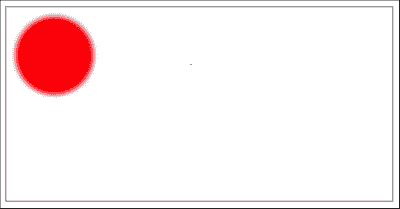
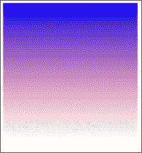
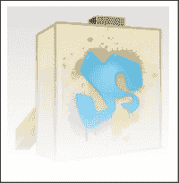
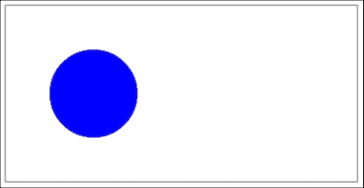
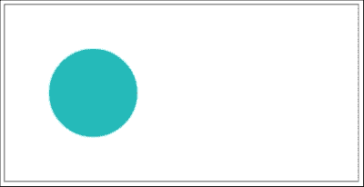

# 第六章。在 EaselJS 中使用过滤器

CreateJS 的一个伟大功能是能够轻松地玩转过滤器并将各种过滤器应用于图片和形状。CreateJS 通过提供`Filter`类和`DisplayObject`的`filters`属性来实现这一点；因此，我们可以简单地创建`Filter`类的实例并将它们应用于对象。在本章中，我们将查看 CreateJS 过滤器以及与`Filter`类一起工作的基本示例。

在本章中，我们将涵盖以下主题：

+   理解`Filter`类

+   如何使用内置的 EaselJS 过滤器

# 理解过滤器类

EaselJS 提供了一个`Filter`类，这是所有其他过滤器的基类，其他过滤器类应该从这个类继承。过滤器需要应用于使用`cache`方法缓存的对象；之后，如果对象再次更改，我们应该使用`cache`或`updateCache`方法来更新形状。

以下是将过滤器应用于对象的示例：

```js
  /* Add canvas and stage */
  var canvas = document.getElementById("canvas");
  var stage = new createjs.Stage(canvas);

/* create and draw the shape */
var circle = new createjs.Shape();
circle.graphics.beginFill("red").drawCircle(50, 50, 40);

/* add the blur filter to filters property */
circle.filters = [new createjs.BlurFilter(5, 5, 10)];
/* cache the shape to apply the filter */
circle.cache(0, 0, 100, 100);
/* add shape to stage and update */
stage.addChild(circle);
stage.update();
```

在第一行，我们创建了一个形状对象；在下一行，我们创建了一个红色的圆形。下一行包含过滤器配置，而在最后一行我们使用`cache`函数缓存了对象。

在带有过滤器的示例中使用`cache`方法不仅可以提高性能，还可以将过滤器应用于形状并使其工作。



EaselJS 包含几个基本过滤器，如`blur`或`color`过滤器，您可以使用它们。以下是一个内置过滤器的列表：

+   `AlphaMapFilter`：这个用于将灰度图像映射到显示对象的 alpha 通道。

+   `AlphaMaskFilter`：这个用于将图像的 alpha 通道映射到显示对象的 alpha 通道。

+   `BlurFilter`：对显示对象应用垂直和水平模糊。

+   `ColorFilter`：这个颜色转换显示对象。

+   `ColorMatrixFilter`：使用`ColorMatrix`转换图像。

在下一节中，我们将详细讨论所有这些过滤器。

# 使用 AlphaMapFilter 类

`AlphaMapFilter`是一个内置过滤器，用于将灰度 alpha 映射图像（或画布）应用于目标。为了更清晰，结果图像的 alpha 通道将从映射的红通道复制，而 RGB 通道将从目标对象复制。

> 通常，建议您使用`AlphaMaskFilter`，因为它具有更好的性能。

这是从：[`www.createjs.com/Docs/EaselJS/classes/AlphaMapFilter.html`](http://www.createjs.com/Docs/EaselJS/classes/AlphaMapFilter.html)中摘取的。

以下代码片段是该类的定义：

```js
AlphaMapFilter (alphaMap)
```

参数如下：

`alphaMap` | `Image` | `HTMLCanvasElement`

我们已经使用了灰度图像或画布作为 alpha 通道。它应该与目标具有相同的尺寸。

以下是一个使用`AlphaMapFilter`类的示例代码：

```js
/* Add canvas and stage */
var canvas = document.getElementById("canvas");
var stage = new createjs.Stage(canvas);

/* Create filter */
var box = new createjs.Shape();
box.graphics.beginLinearGradientFill(["#0000ff", "#ff0000"], [1, 0], 0, 0, 0, 300)
box.graphics.drawRect(0, 0, 300, 300);
box.cache(0, 0, 300, 300);

/* create the second shape */
var box2 = new createjs.Shape();
box2.graphics.beginLinearGradientFill(["#0000ff", "#ff0000"], [0, 1], 0, 0, 0, 300);
box2.graphics.drawRect(0, 0, 300, 300);

/* Add filter to box2 */
box2.filters = [
  new createjs.AlphaMapFilter(box.cacheCanvas)
];
/* and finally, cache the shape to apply changes */
box2.cache(0, 0, 300, 300);

/* Add bitmap to stage and update stage */ 
stage.addChild(box2);
stage.update();
```

在代码的第一行中，我们创建了一个具有线性渐变的矩形，然后使用`cache`方法缓存了对象。缓存对象的原因是将其用于滤镜参数。

然后，我们创建了`box2`变量；它是我们的父形状。这个形状与第一个相同，但渐变颜色不同。我们改变了线性渐变的起始和结束颜色。之后，我们将`AlphaMapFilter`添加到`box2`的滤镜中，并将`box`变量作为滤镜的参数。然后，为了将滤镜应用于形状，我们使用`cache`方法缓存了形状并将其添加到舞台中。

以下图像显示了上一个示例的预览：



# 使用 AlphaMaskFilter 类

此滤镜的使用方式与`AlphaMapFilter`类相似，但我们将简要讨论此滤镜。根据 CreateJS 文档，建议您使用此滤镜而不是`AlphaMapFilter`，因为它具有更好的性能。

`AlphaMaskFilter`将来自遮罩图像（或画布）的 alpha 遮罩应用于目标。结果的 alpha 通道将来自遮罩，而 RGB 通道将复制自目标对象。

这里是我们如何定义`AlphaMaskFilter`类的：

```js
AlphaMaskFilter (mask)
```

代码片段中的参数如下：

`mask` | `Image`

这个类是`Image`类的一个实例。

下面是一个使用此滤镜的示例：

```js
/* Declare variables */
var canvas, stage, img;

function init() {
  /* Add canvas and stage */
  canvas = document.getElementById("canvas");
  stage = new createjs.Stage(canvas);

  /* Load image */
  img = new Image();
  img.onload = handleimg;   //function that's called once image has loaded
  img.src = "targetImg.png";  //image url
}

function handleimg() {
  /* Create mask layer */
  var box = new createjs.Shape();
  box.graphics.beginLinearGradientFill(["#000000", "rgba(0, 0, 0, 0)"], [0, 1], 0, 0, 0, 200)
  box.graphics.drawRect(0, 0, 200, 200);
  box.cache(0, 0, 200, 200);

  /* Create bitmap */
  var bmp = new createjs.Bitmap(img); 

  /* Add filter to bitmap */
  bmp.filters = [
     new createjs.AlphaMaskFilter(box.cacheCanvas)
  ];
    bmp.cache(0, 0, 200, 200);

  /* Add bitmap to stage and update stage */ 
  stage.addChild(bmp);
  stage.update();
}
```

如您所见，此滤镜的使用几乎与`AlphaMapFilter`相同。

示例源代码分为两个函数，`init`和`handleimg`。为了正确加载图像，我们使用了`Image`类和`onload`事件。然后，我们使用`handleimg`函数作为`onload`事件的回调函数。

在`init`函数内部，创建了`stage`类。我们还配置了`Image`类，并将`handleimg`函数分配给`onload`事件。示例源代码的大部分内容都在`handleimg`函数中。在第一行代码中，我们创建了一个具有线性渐变背景的矩形。使用`rgba`函数定义颜色的原因是为了改变渐变的 alpha 通道，以便滤镜可以为最终结果提取这个 alpha 通道。最后，我们使用`cache`方法缓存了形状。

然后，我们使用`Bitmap`函数加载了一张图片，并将其应用于`bmp`变量的`filters`属性。我们还缓存了这张图片以便应用滤镜变化。

以下截图显示了我们的示例结果：



# 实现 BlurFilter 类

模糊滤镜是用于创建创新动画和绘图的可用滤镜之一。在本节中，我们将讨论使用`BlurFilter`类。

此滤镜将一个**模糊框**应用于`DisplayObject`。

### 注意

此过滤器是 CPU 密集型的，尤其是当质量设置为大于 1 时。

下面是`BlurFilter`类及其参数的定义：

```js
BlurFilter ([blurX=0] [blurY=0] [quality=1])
```

代码片段中包含的参数如下：

+   `[blurX=0]` | `数值`：这是一个可选参数。它用于设置以像素为单位的水平模糊半径。

+   `[blurY=0]` | `数值`：这是一个可选参数。它用于设置以像素为单位的垂直模糊半径。

+   `[quality=1]` | `数值`：这是一个可选参数。它用于设置模糊迭代的次数。

下面是使用红色圆形应用模糊过滤器的示例：

```js
/* Add canvas and stage */
var canvas = document.getElementById("canvas");
var stage = new createjs.Stage(canvas);

/* create circle shape */
var shape = new createjs.Shape().set({x:100,y:100});
shape.graphics.beginFill("#ff0000").drawCircle(0,0,50);

/* create blur filter and add to shape */
var blurFilter = new createjs.BlurFilter(5, 5, 1);
shape.filters = [blurFilter];

/* add getbounds to give spread effect to blur */
var bounds = blurFilter.getBounds();
shape.cache(-50+bounds.x, -50+bounds.y, 100+bounds.width, 100+bounds.height);

/* add shape to stage and update */
stage.addChild(shape);
stage.update();
```

在第一行，我们有`shape`变量，这是我们形状的变量，一个圆形。在下一行，我们用红色填充了圆形，并使用`drawCircle`函数完成了形状的绘制。

然后，我们使用三个参数创建了模糊过滤器，并将其应用于具有`filters`属性的`shape`对象。为了找到缓存区域的尺寸，我们使用了`getBounds`函数，因为你知道，在应用`getBounds`函数之后，模糊过滤器会有一些额外的填充。


# 使用`ColorFilter`类

此过滤器将颜色转换应用于`DisplayObject`。当你需要在 EaselJS 中玩转颜色时，此过滤器非常有用。

在以下代码片段中，你可以看到此过滤器的定义：

```js
ColorFilter ([redMultiplier=1] [greenMultiplier=1][blueMultiplier=1] [alphaMultiplier=1] [redOffset=0][greenOffset=0] [blueOffset=0] [alphaOffset=0])
```

代码片段中的各种参数如下：

+   `[redMultiplier=1]`– `数值`：这是一个可选参数。它设置与红色通道相乘的值。该值应在 0 和 1 之间。

+   `[greenMultiplier=1]`– `数值`：这是一个可选参数。它设置与绿色通道相乘的值。该值应在 0 和 1 之间。

+   `[blueMultiplier=1]`– `数值`：这是一个可选参数。它设置与蓝色通道相乘的值。该值应在 0 和 1 之间。

+   `[alphaMultiplier=1]`– `数值`：这是一个可选参数。它设置与 alpha 通道相乘的值。该值应在 0 和 1 之间。

+   `[redOffset=0]`– `数值`：这是一个可选参数。它设置在红色通道乘以之后要添加的值。该值应在-255 和 255 之间。

+   `[greenOffset=0]`– `数值`：这是一个可选参数。它设置在绿色通道乘以之后要添加的值。该值应在-255 和 255 之间。

+   `[blueOffset=0]`– `数值`：这是一个可选参数。它设置在蓝色通道乘以之后要添加的值。该值应在-255 和 255 之间。

+   `[alphaOffset=0]`– `数值`：这是一个可选参数。它设置在 alpha 通道乘以之后要添加的值。该值应在-255 和 255 之间。

下面是使用此过滤器的示例：

```js
/* Add canvas and stage */
var canvas = document.getElementById("canvas");
var stage = new createjs.Stage(canvas);

var shape = new createjs.Shape().set({x:100,y:100});
shape.graphics.beginFill("#ff0000").drawCircle(0,0,50);

shape.filters = [
  new createjs.ColorFilter(0,0,0,1, 0,0,255,0)
];
shape.cache(-50, -50, 100, 100);
/* add shape to stage and update */
stage.addChild(shape);
stage.update();
```

在这个例子中，我们创建了一个红色圆圈，然后使用`ColorFilter`将其颜色改为蓝色。这是通过将所有通道乘以 0（除了 alpha 通道，设置为 1）然后向蓝色通道添加 255，向其他通道添加 0 来完成的。



# 使用 ColorMatrixFilter 类

使用这个过滤器，你可以玩转复杂的颜色操作，例如饱和度、亮度或反转。这个过滤器使用`ColorMatrix`类来执行操作。

以下代码片段定义了这个类：

```js
ColorMatrixFilter (matrix)
```

代码片段中存在的参数如下：

+   `matrix– 数组`：一个 4x5 的矩阵，描述了使用`ColorMatrix`类要执行的颜色操作。

下面是使用这个过滤器的例子：

```js
/* Add canvas and stage */
var canvas = document.getElementById("canvas");
var stage = new createjs.Stage(canvas);

var shape = new createjs.Shape().set({x:100,y:100});
shape.graphics.beginFill("#ff0000").drawCircle(0,0,50);

var matrix = new createjs.ColorMatrix().adjustHue(180).adjustSaturation(100);
shape.filters = [
 new createjs.ColorMatrixFilter(matrix)
];

shape.cache(-50, -50, 100, 100);
/* add shape to stage and update */
stage.addChild(shape);
stage.update();
```

在前面的例子中，我们创建了一个红色圆圈，然后反转了色调并将饱和度改为 100。我们首先在第一行创建了`stage`类。然后，我们使用`drawCircle`函数创建了一个圆。为了将圆放置在`canvas`元素的视口中，我们使用`set`函数更改了`x`和`y`的值。

然后，我们使用`ColorMatrix`类初始化了`matrix`变量。我们使用了`adjustHue`和`adjustSaturation`函数来改变圆的色调和饱和度。`adjustHue`的可接受值在-180 到 180 之间。`adjustSaturation`的值在-100 到 100 之间。在我们的例子中，我们将色调值设置为 180，饱和度值设置为 100，以便更好地观察差异。

我们应用了`shape`变量的`filter`属性的所有功能。最后，我们使用`cache`方法缓存了形状，并使用`update`方法更新阶段以应用这些更改。



# 摘要

在这一章中，我们学习了如何使用 EaselJS 的内置过滤器来更改`DisplayObject`属性，如颜色、色调、饱和度等。我们还通过交互式示例和截图讨论了过滤器的定义和基本用法。

在下一章中，我们将讨论如何使用我们迄今为止所学到的所有方法和函数创建一个基于网页的绘画应用程序。
