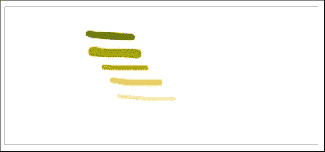
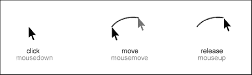

# 第七章. 开发绘画应用程序

在本章中，我们将创建一个简单的绘画应用程序，使用几乎我们在前几章中已经讨论过的所有 EaselJS 功能。本章将更加互动和具有挑战性，因为我们需要总结我们已经学到的所有内容。所以，让我们开始吧。

在本章中，我们将涵盖以下主题：

+   准备舞台

+   理解 `mousemove`、`mouseup` 和 `mousedown` 事件

+   实现每个回调函数

# 准备舞台

此应用程序的整体功能几乎与拖放应用程序相同；我们将使用 `mousedown`、`mouseup` 和 `mousemove` 事件来处理绘画逻辑。首先，我们将创建一个 `stage` 对象，然后是一个用于画笔颜色的颜色数组。我们将启用 Web 浏览器和支持触摸事件的设备的 *触摸功能*。最后，我们为 `mousedown`、`mouseup` 和 `mousemove` 事件设置回调函数来处理绘图功能和绘制线条。

以下截图显示了我们的绘画应用程序的预览：



最终的源代码由以下函数组成：

+   `init`: 它用于创建舞台并准备其他对象。

+   `handleMouseDown`: 它用于处理 `mousedown` 事件并绑定 `mousemove` 事件。

+   `handleMouseMove`: 它用于处理 `mousemove` 事件并绘制线条。

+   `handleMouseUp`: 它用于处理 `mouseup` 事件并解绑 `mousemove` 事件以停止绘图。

以下图像说明了事件如何协同工作以绘制线条：



在接下来的章节中，我们将更详细地讨论源代码及其创建方式。

# 理解初始化函数

在 `init` 函数内部，我们将设置舞台，声明基本变量，并将函数附加到主要事件，如 `mousedown` 事件。

以下代码是 `init` 函数的源代码：

```js
function init() {
  var canvas = document.getElementById("cvs");
  var index = 0;
  var colors = ["#828b20", "#b0ac31", "#cbc53d", "#fad779", "#f9e4ad", "#faf2db", "#563512", "#9b4a0b", "#d36600", "#fe8a00", "#f9a71f"];

  var stage = new createjs.Stage(canvas);
  stage.autoClear = false;
  stage.enableDOMEvents(true);

  createjs.Touch.enable(stage);
  createjs.Ticker.setFPS(24);
  drawingCanvas = new createjs.Shape();

  stage.addEventListener("stagemousedown", handleMouseDown);
  stage.addEventListener("stagemouseup", handleMouseUp);

  stage.addChild(drawingCanvas);
  stage.update();
}
```

在函数体的第一行，我们有一个全局的 `canvas` 变量，它指向页面中的 `Canvas` 元素。我们有一个 `index` 变量，它持有计数器以在绘画时选择画笔颜色，下一行包含一个颜色数组。我们使用 `index` 变量从这个数组中随机选择一个值。之后，如前例所示，我们必须创建一个 `stage` 对象；这也是一个全局变量。

之后，我们将 `stage` 的 `autoClear` 属性设置为 `false`。此属性表示舞台是否应自动清除画布上的渲染元素。通过将此值设置为 `false`，我们可以手动控制清除。

然后，我们使用 `enableDOMEvents` 方法启用了 **DOM**（**文档对象模型**）事件。此方法实际上启用了或禁用了 `stage` 添加到 DOM 元素（如窗口、文档和画布）的事件监听器。

在下面的行中，配置了触摸事件和**每秒帧数**（**FPS**）。`setFPS`函数设置了目标帧率（以每秒帧数计）。这个函数是`Ticker`类的一个成员。`Ticker`类是 EaselJS 的主要功能之一，它提供了一个集中的计时器或心跳，监听器可以订阅计时器事件，以便在时间流逝时得到通知。

然后，全局变量`drawingCanvas`使用一个`Shape`对象初始化，它将成为我们的绘画形状。在以下事件中，我们将使用这个变量来完成绘制过程。

此外，`mousedown`和`mouseup`事件被分配给适当的函数，然后一个绘画形状被添加到`stage`中。添加事件监听器有多种方法，其中之一是使用`addEventListener`函数。将事件名称和函数传递给它。在这个例子中，我们使用了`addEventListener`函数。

与前面的例子类似，我们必须将形状添加到`stage`中，并使用`update`函数更新它。在下面的行中，我们将形状添加到`stage`中并更新了它。

这是对`init`函数的定义。实际上，这个函数是一个引导函数，用于启动绘画应用程序。在这个函数内部，所有用于绘画和绘制的相关事件都进行了配置。在接下来的章节中，我们将讨论事件回调函数。

# 实现 handleMouseDown 函数

以下代码是`handleMouseDown`函数的源代码，该函数用于处理`mousedown`事件：

```js
function handleMouseDown(event) {
  color = colors[(index++) % colors.length];
  stroke = Math.round(Math.random() * 30 + 10);
  oldPt = new createjs.Point(stage.mouseX, stage.mouseY);
  oldMidPt = oldPt;
  stage.addEventListener("stagemousemove", handleMouseMove);
}
```

这个函数用于处理`mousedown`事件，并在按下鼠标按钮后被调用。在这个函数内部，我们设置了笔触的颜色和大小，并保存当前的鼠标位置以供下一次函数调用使用。

所有变量都是全局的，因此你不会在它们前面看到任何`var`关键字，以便在后续的函数调用和其他作用域中拥有这些变量。在最后一行，一个函数还设置了`mousemove`事件，以便管理绘制线条。实际上，`mousemove`事件会在鼠标光标在`stage`中移动时触发。

笔刷的颜色是从`init`函数中定义的`colors`数组中依次选择的，使用`index`变量。我们为了从数组中选择下一个颜色所做的是增加`index`变量，然后计算除法的余数。通过这个简单的技巧，我们可以选择一个介于零和数组长度之间的值。

笔刷的大小是通过使用`random`函数来选择的。JavaScript 中的`Math`类中的`random`函数返回一个介于 0 和 1 之间的值（但不包括 1）。通过将这个值乘以 30，我们可以得到一个介于 0 和 30 之间的值（但不包括 30）。JavaScript 中的`round`函数也会向上取整一个数字。

那段代码的重要部分是 `stage.mouseX` 和 `stage.mouseY` 返回 Canvas 元素上的当前鼠标坐标。我们使用这些变量来获取鼠标位置并将其保存在全局变量中。这些值将用于绘制线条，我们之所以将它们保存在全局变量中，是为了在其他作用域和函数中提供可访问性。正如你所见，我们使用了 `Point` 类来收集鼠标光标的坐标。`Point` 类代表 EaselJS 中的二维坐标系，我们使用这个类来保存光标指针。

# 使用 `handleMouseMove` 函数

这个函数实际上绘制线条，并用于处理 `mousemove` 事件。这是我们处理绘制的主体函数。

`mousemove` 函数的源代码如下：

```js
function handleMouseMove(event) {
  var midPt = new createjs.Point(oldPt.x + stage.mouseX>> 1,oldPt.y + stage.mouseY>> 1);

  drawingCanvas.graphics.clear().setStrokeStyle(stroke, 'round', 'round').beginStroke(color).moveTo(midPt.x, midPt.y).curveTo(oldPt.x, oldPt.y,oldMidPt.x, oldMidPt.y);

  oldPt.x = stage.mouseX;
  oldPt.y = stage.mouseY;

  oldMidPt.x = midPt.x;
  oldMidPt.y = midPt.y;

  stage.update();
}
```

当鼠标光标在 `stage` 上拖动时，这个函数会持续被调用。在这个函数中，我们使用 `beginStroke` 函数绘制线条，并再次保存当前的鼠标位置以便在后续的函数调用中使用；实际上，是下一次鼠标移动。随着鼠标光标的每次移动，这个函数都会再次被调用，因此我们将得到线条。

### 注意

在第一行中，你可以看到右移操作符（`>>` 操作符）。我们使用这个函数来简化 `Math.floor(num / 2)` 操作。

实际上，`num>> 1` 和 `Math.floor(num / 2)` 有相同的结果。

之后，我们使用 `update` 函数更新 `stage`，以将更改应用到 `stage` 并将一切渲染到画布上。

# 使用 `handleMouseUp` 函数

当用户释放鼠标点击时，这个函数会被调用，并用于结束绘制线条并从 `stage` 中移除事件。其源代码如下：

```js
function handleMouseUp(event) {
  stage.removeEventListener("stagemousemove", handleMouseMove);
}
```

在这个函数中，我们只调用 `removeEventListener` 来移除 `mousemove` 事件，并防止再次调用该函数。在从 `stage` 中移除此事件后，`handleMouseMove` 函数将不再被调用。因此，通过移动鼠标光标，EaselJS 不会在下一个 `mousedown` 事件之前调用我们的函数。这正是我们在绘画逻辑中想要处理的。

在下面的屏幕截图，你可以看到这个应用的预览：


# 下载源代码

这个绘画示例是 EaselJS 的基本示例之一。你可以从 EaselJS 的 GitHub 下载项目的完整源代码：

[`github.com/CreateJS/EaselJS/blob/master/examples/CurveTo.html`](https://github.com/CreateJS/EaselJS/blob/master/examples/CurveTo.html)

# 摘要

在本章中，我们讨论了如何从头开始使用 `mousemove`、`mousedown` 和 `mouseup` 事件创建一个简单的绘画应用，这是理解这些事件概念的良好练习。然后，我们学习了如何管理内部鼠标事件以绘制线条。我们使用了 `addEventListener` 和 `removeEventListener` 函数来添加和移除对象中的事件。

此外，我们还学习了如何使用 EaselJS 中的描边功能来绘制具有特定颜色和大小的线条。我们使用了`beginStroke`、`curveTo`和`moveTo`函数来绘制线条并处理绘图逻辑。

在下一章中，我们将讨论*矢量蒙版*以及如何在 CreateJS 中创建蒙版层。
