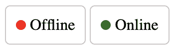
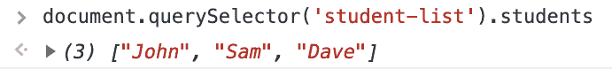
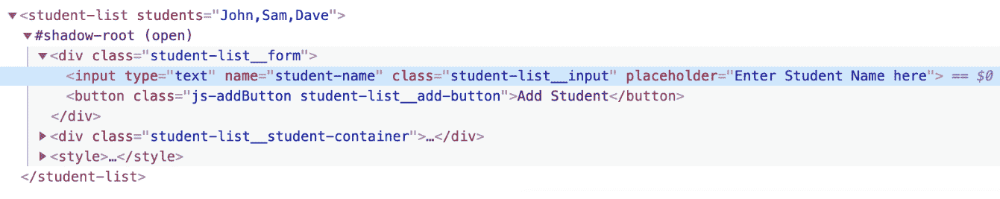

# 第五章：管理状态和属性

在上一章中，我们讨论了可重用性和如何将应用程序发布到互联网上。我们还探讨了插槽以及它们如何有助于扩展我们的 Web 组件。

在本章中，我们将探讨状态管理。状态管理让您能够跟踪 Web 组件所处的状态。这是一个非常有用的技术。我们还将探讨属性，以创建更好的 Web 组件。我们自从 第二章，“Web 组件生命周期回调方法”以来一直在使用属性。但在本章中，我们将从状态管理的角度来探讨它。然后我们将探讨事件和事件管理，以及这些事件如何用来通知用户 Web 组件的状态。

在本章中，我们将涵盖以下主题：

+   状态管理的介绍

+   管理属性和属性

+   事件处理

# 状态管理的介绍

任何可以用来管理用户界面（**UI**）状态的东西都可以被认为是状态管理。我们在我们每天使用的几乎每个网站上都能看到状态管理的例子。你使用 Gmail 或任何其他电子邮件服务。电子邮件有“已读”或“未读”的状态。如果你在 Spotify 上播放歌曲，你正在听的歌曲有“喜欢”或“不喜欢”的状态。基于这些状态，UI 可以以不同的方式显示。

Web 组件采用类似的方法。我们可以在 Web 组件内部使用一个变量来跟踪状态。假设我们想要创建一个 Web 组件，用来告诉用户他们所使用的设备是否在线。那么，这里的状态将是 `isOnline`，其值可以是 `online` 或 `offline`。那么，让我们开始吧。

让我们称这个组件为 `<online-checker>`，并且假设它的状态由一个内部变量 `_isOnline` 管理。这个组件的定义可能看起来像这样：

```js
export default class OnlineChecker extends HTMLElement {
  constructor() {

    // We are not even going to touch this.
    super();

    this._isOnline = false;

    // lets create our shadow root
    this.shadowObj = this.attachShadow({mode: 'open'});
  }
}
```

在这里，我们将 `_isOnline` 的初始值设置为 `false`，因为我们不知道我们是否在线。

```js
render() {
  this.shadowObj.innerHTML = this.getTemplate();
}

getTemplate() {
  return `
    <span class="online-status online-${this._isOnline ? 'true' : 'false'}"></span>
    <span>${this._isOnline ? 'Online' : 'Offline'}</span>
    ${this.getStyle()}
  `;
}
```

`render()` 方法与我们的前例相同，没有什么特别之处。特别之处在于 `getTemplate()` 方法。在这里，我们根据 `_isOnline` 变量添加一个类 `online-true` 或 `online-false`。我们也在相同的基础上添加文本 `online` 或 `offline`。

`getStyle()` 方法看起来像这样：

```js
getStyle() {
  return `
    <style>
      :host {
        display: inline-block;
        border: 1px solid #cac6c6;
        padding: 10px;
        border-radius: 5px;
      }
      .online-status {
        height: 10px;
        width: 10px;
        border-radius: 50%;
        display: inline-block;
      }
      .online-true {
        background-color: green;
      }
      .online-false {
        background-color: red;
      }
    </style>
  `;
}
```

类 `.online-true` 显示一个绿色圆圈，而 `.online-false` 显示红色。

我们还没有添加检查浏览器是否在线的代码。所以，让我们添加它：

```js
connectedCallback() {
  this.isOnline = navigator.onLine;
  this.render();
}

set isOnline(value) {
  if(value !== this._isOnline) {
    this._isOnline = value;
    this.render();
  }
}

get isOnline(){
  return this._isOnline;
}
```

在这里，我们使用 `connectedCallback()` 来查看我们是否在线。我们使用 `connectedCallback()` 是因为我们想要确保这段代码在 Web 组件在页面上时触发。

`get isOnline()` 和 `set isOnline()` 方法为组件创建了一个属性，可以在组件外部使用。所以，假设你有这样的代码：

```js
document.querySelector('online-checker').isOnline;
```

这将根据`isOnline`属性返回`true`或`false`。

因此，我们在`_isOnline`变量中跟踪浏览器的在线或离线状态，并通过`isOnline`属性提供这个值：



这是对 Web 组件内部属性的一个非常简单的介绍。我们将在接下来的章节中查看更多示例。

# 属性和属性

我们从第一章开始就在玩弄属性了。我们也简要概述了属性以及它们如何与状态管理一起工作，以提供更完整的 Web 组件。

但这两者之间究竟有什么确切的区别呢？如果你是一名前端开发者，在你的职业生涯中一定创建过表单。我们将通过一个例子来查看一个`<input>`标签：

```js
<input type="text" value="default value" />
```

如果你仔细看，我们会发现有一个名为`value`的属性给它赋予了一些默认值。所以如果你想获取这个`<input>`标签的值，你可以使用以下代码来获取它：

```js
document.querySelector('input').getAttribute('value');
```

因此，你直接引用这个`<input>`标签的属性来获取值。但还有一种方法可以获取这个值。如下所示：

```js
document.querySelector('input').value;
```

这次，我们从`<input>`标签的`value`属性中获取值。

现在的问题是，区别在哪里？区别在于是否将其显示为属性。总会有一些你可能不希望显示在 HTML 代码中的值。它可能太长了，比如音乐播放器 Web 组件中的播放列表，其中列表包含歌曲名称和 URL 的 JSON 风格数据结构，或者像税务注册组件中的税务 ID 号（如 SSN），其中数据过于敏感，不适合作为属性。

让我们通过一个例子来尝试理解这一点。假设我们有一个名为`<student-list>`的 Web 组件，其中包含一个用于输入学生姓名的输入字段和一个允许你将学生添加到学生列表中的按钮。这个组件看起来是这样的：

```js
constructor() {

  // We are not even going to touch this.
  super();

  // Initially, the list is empty
  this._list = [];

  // lets create our shadow root
  this.shadowObj = this.attachShadow({mode: 'open'});
  this.render();
}
```

在这里，我们正在`_list`变量中管理学生列表。其余的与平常一样：

```js
render() {
  this.shadowObj.innerHTML = this.getTemplate();
}

getTemplate() {
  return `
    <div class="student-list__form">
      <input type="text" name="student-name"
        class="student-list__input"
        placeholder="Enter Student Name here"/>
      <button class="js-addButton student-list__add-button">Add Student</button>
    </div>
    <div class="student-list__student-container">
      <div class="student-list__student-container-heading">Student List</div>
      <div class="student-list__student-list">
        ${this.getStudents()}
      </div>
    </div>
    ${this.getStyle()}
  `;
}
```

如你所见，我们有一个输入字段、一个按钮，以及一个`div student-list__student-list`来将我们的学生以列表的形式放入表单中：

```js
getStudents() {
  return this._list.map((item, num) => {
    return `<div class="student-list__student">${num + 1}. ${item}</div>`;
  }).join('');
}
```

这个`getStudents()`方法通过运行我们在`constructor()`方法中声明的`_list`变量来显示学生。在我们继续这个 Web 组件的其他部分之前，让我们看看我们的样式：

```js
getStyle() {
  return `
    <style>
      :host {
        display: block;
      }
      .student-list__form {
        display: flex;
        align-items: center;
      }
      .student-list__input {
        height: 44px;
        margin: 0 25px;
        width: 300px;
        border-radius: 10px;
        border-width: 1px;
        font-size: 18px;
        padding: 0 20px;
      }
      .student-list__add-button {
        height: 50px;
        width: 200px;
        border-radius: 5px;
        display: inline-block;
        border: 1px solid #cac6c6;
      }
      .student-list__student-container {
        margin-top: 50px;
        border-top: 1px solid black;
        padding-top: 50px;
        font-size: 25px;
      }
      .student-list__student-container-heading {
        margin-bottom: 20px;
      }
      .student-list__student {
        padding: 10px;
        margin-bottom: 10px;
        border-bottom: 1px solid #bfbfbf;
      }
    </style>
  `;
}
```

这只是基本的 CSS，没有什么复杂的。现在，让我们给我们的按钮添加一个事件监听器，以便它可以将学生添加到我们的`_list`变量中：

```js
connectedCallback() {

  // what should happen when the button is clicked
  this.shadowObj.querySelector('.js-addButton')
    .addEventListener("click", (e) => {
      this.handleAdd(e);
    });
}

handleAdd() {
  let value = this.shadowObj.querySelector('input[name=student-name]').value;
  this._list.push(value);
  this.renderList();
}

renderList() {
  this.shadowObj.querySelector('.student-list__student-list').innerHTML 
    = this.getStudents();
}
```

这里，我们给 `.js-addButton` 按钮添加了一个点击事件监听器。当用户点击按钮时，它会获取输入字段的值，并将其推送到我们的 `_list` 变量。之后，我们只是重新渲染列表；换句话说，我们不是从头开始设置组件的内部 HTML，而是简单地更改需要更新的部分的 HTML。

但如果用户想查看学生列表或从组件中获取它呢？为此，让我们为我们的用户添加一个名为 `students` 的属性：

```js
set students (value) {
  this._list = value;
  this.renderList();
}

get students (){
  return this._list;
}
```

这样，用户可以通过以下代码获取学生列表：

```js
document.querySelector('student-list').students;
```

这将使用数组的形式向用户展示所有已添加的学生：



但现在你可能正在想，如果我们想将这个功能放在属性中会怎样？答案是肯定的，我们可以做到。我们可以更新我们的 `handleAdd()` 方法，使其类似于以下内容：

```js
handleAdd() {
  let value = this.shadowObj.querySelector('input[name=student-name]').value;
  this._list.push(value);
  this.setAttribute("students", this._list);
  this.renderList();
}
```

这将使列表在名为 `students` 的属性中可用。但这个属性看起来是这样的：



你真的想让用户手动解析字符串来获取一个数组吗？如果这个数据更复杂一点呢？用户知道需要解析什么吗？为了解决这些复杂问题，我们使用属性。

希望这个用例能帮助你决定在属性中放置什么，在属性中放置什么。

# 事件处理

到目前为止，我们只关注了 Web 组件内部的按钮点击事件。本节从不同的角度处理事件处理器。

假设我们有一个 Web 组件 `<custom-clicker>`，它有一个按钮和一个显示按钮被点击次数的数字。让我们看看这个 Web 组件的定义：

```js
constructor() {

  // We are not even going to touch this.
  super();

  // Initially, the list is empty
  this._num = 0;

  // lets create our shadow root
  this.shadowObj = this.attachShadow({mode: 'open'});
  this.render();
}
```

我们将 `_num` 的值设置为 `0`。其余的与平常一样：

```js
render() {
  this.shadowObj.innerHTML = this.getTemplate();
}

getTemplate() {
  return `
    <div class="custom-clicker__container">
      <div class="custom-clicker_num">${this.getTimesClicked()}</div>
      <button class="js-button custom-clicker__button">Click Me</button>
    </div>
    ${this.getStyle()}
  `;
}
```

`render()` 和 `getTemplate()` 方法几乎相同。我们只是展示了通过 `getTimesClicked()` 方法获取的文本以及一个写着 **点击我** 的按钮：

```js
getTimesClicked() {
  return `${this._num} times clicked.`;
}
```

这里，我们只是获取 `_num` 的值并添加一些信息性文本。`getStyle()` 方法看起来像这样：

```js
getStyle() {
  return `
    <style>
      :host {
        display: block;
      }
      .custom-clicker__button {
        height: 50px;
        width: 200px;
        border-radius: 5px;
        display: inline-block;
        border: 1px solid #cac6c6;
      }
    </style>
  `;
}
```

我们还希望当用户点击按钮时增加 `_num` 的值：

```js
connectedCallback() {

  // what should happen when the button is clicked
  this.shadowObj.querySelector('.js-button')
    .addEventListener("click", (e) => {
      this.handleClick(e);
    });
}

handleClick() {
  this._num++;
  this.shadowObj.querySelector('.custom-clicker_num').innerHTML 
        = this.getTimesClicked();
}
```

当用户点击按钮时，我们只是调用 `handleClick()` 方法。然后我们简单地将 `_num` 变量加 1 并更新 `.custom-clicker__num` `div`。

现在，我们想让用户知道按钮被点击时的值。我们可以通过自定义事件来实现这一点，使用 `dispatchEvent()`：

```js
handleClick() {
  this._num++;
  this.shadowObj.querySelector('.custom-clicker__num').innerHTML 
        = this.getTimesClicked();

  this.dispatchEvent(new CustomEvent('change', {
    detail: {
      num: this._num,
    },
    bubbles: true,
  }));
}
```

这会通知监听器 `num` 变量的变化，并且可以通过以下代码进行监听：

```js
<custom-clicker onchange="handleChange(event.detail)"></custom-clicker>

<script type="text/javascript">
  function handleChange(e) {
    console.log(e);
  }
</script>
```

或者，我们可以使用以下代码：

```js
<custom-clicker></custom-clicker>

<script type="text/javascript">
  document.querySelector('custom-clicker').addEventListener('change', (e) => {
    console.log(e.detail);
  });
</script>
```

我们可以用 `e.detail.num` 变量做任何我们想做的事情。

这样，我们可以添加任意数量的自定义事件来通知用户 Web 组件的任何变化。需要传递的信息可以放在`detail`对象中。

# 摘要

在本章中，我们探讨了状态管理的各个方面。我们讨论了如何使用属性和属性来增强 Web 组件。最后，我们为我们的 Web 组件创建了自定义事件。

在下一章中，我们将使用到目前为止所学到的所有概念创建一个完整的单页 Web 应用。我们将创建页面级别的 Web 组件，实现路由以及更多功能。
