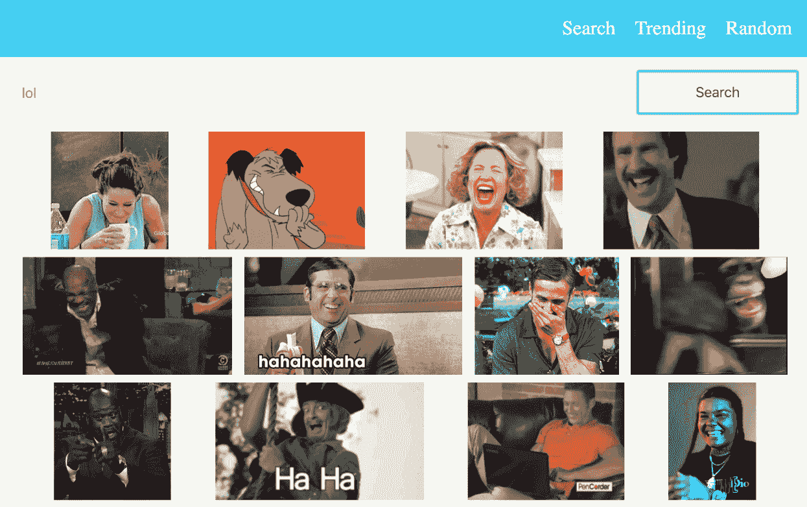
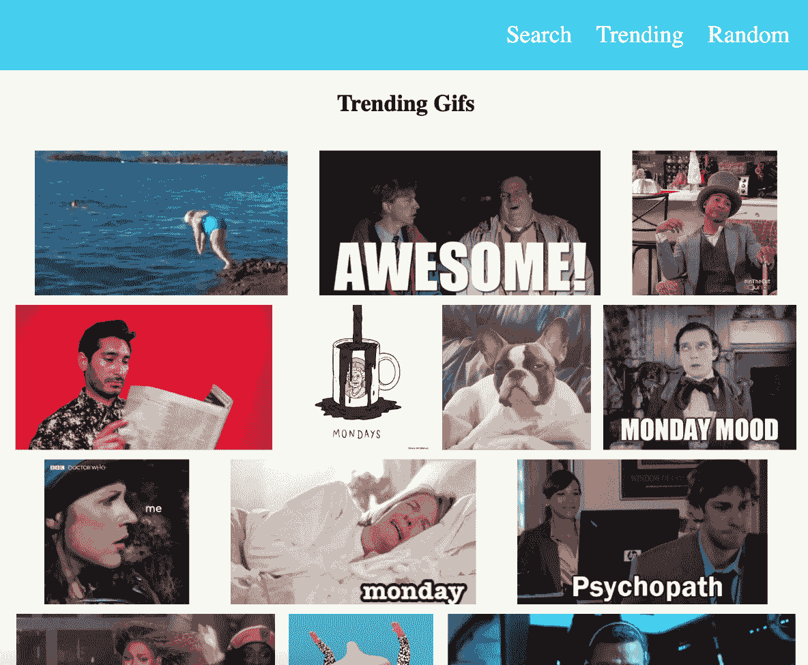
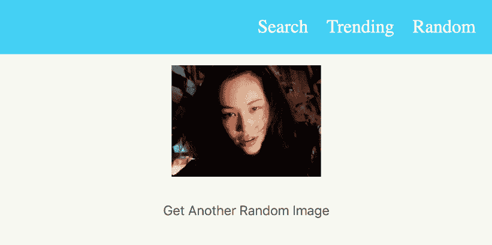
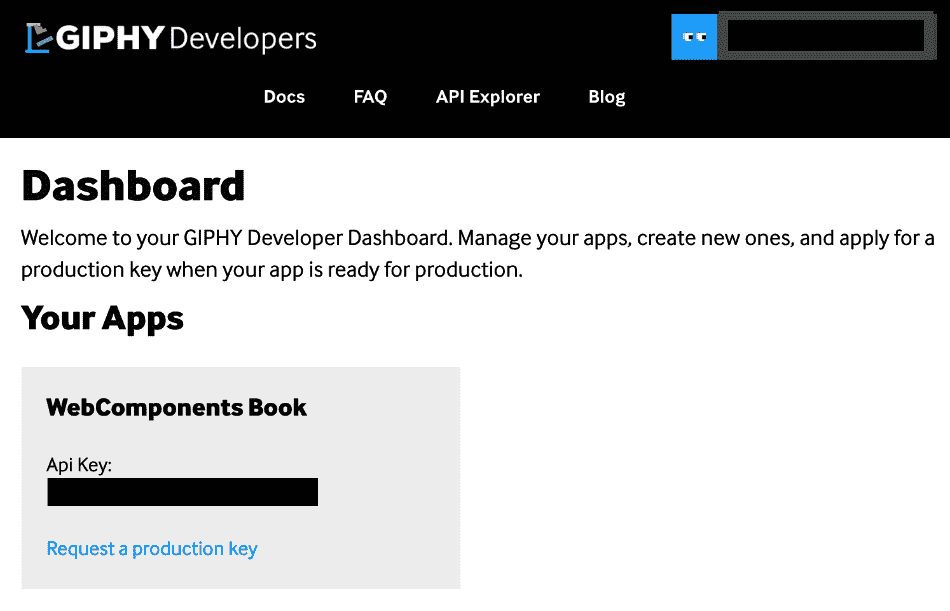
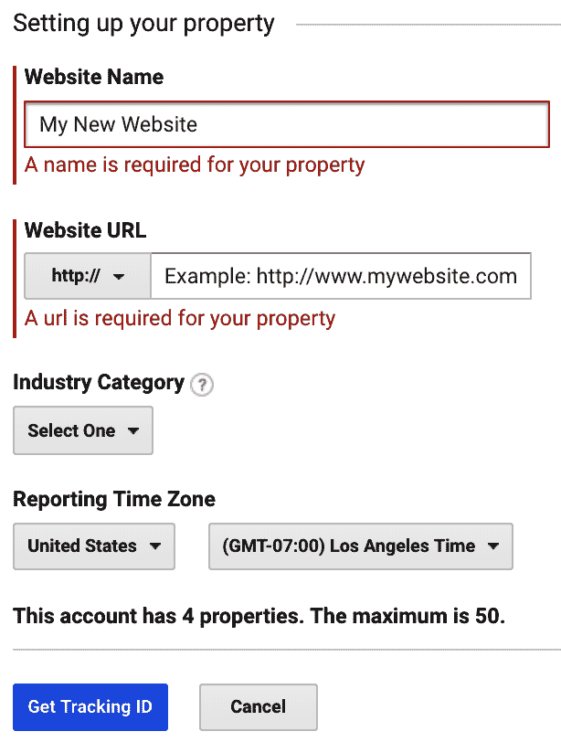
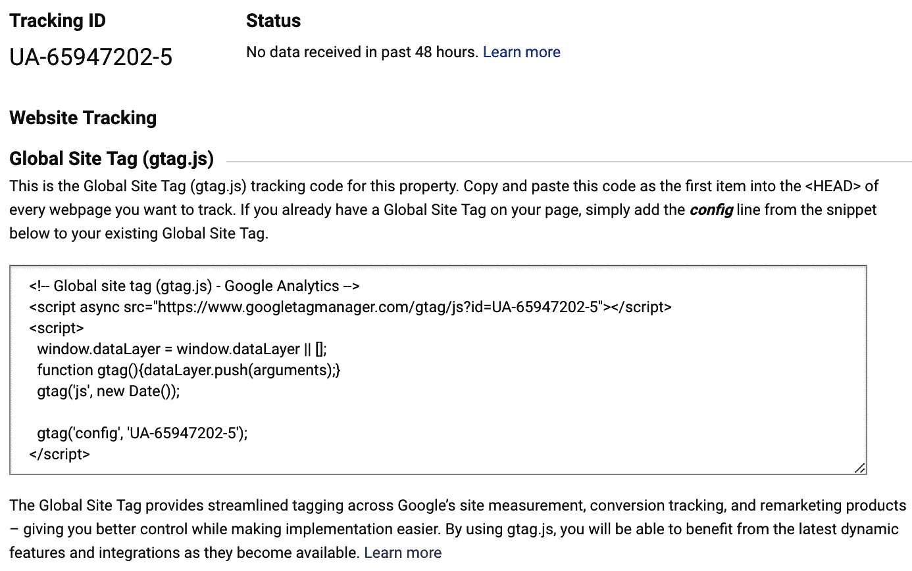
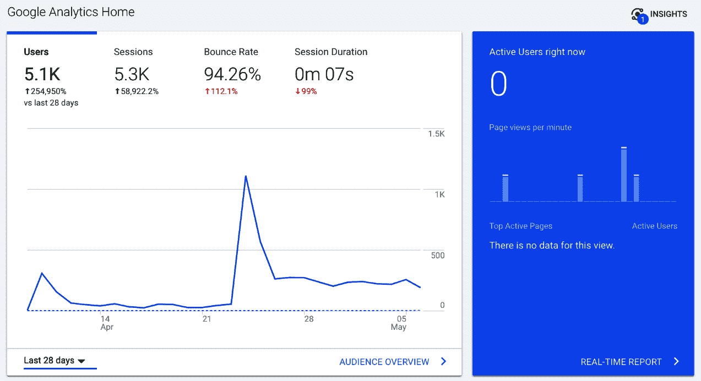

# 第六章：使用 Web Components 构建单页应用

到目前为止，我们一直将 Web Components 作为一个独立实体来使用。但 Web Components 可以用来构建更复杂的东西。在本章中，我们将使用 Web Components 来构建一个单页网络应用。

在本章中，我们将涵盖以下主题：

+   理解项目需求

+   确定可重用 Web 组件

+   配置启动项目和 API

+   应用组件

+   其他组件

+   实现路由

+   启用分析

# 理解项目需求

当涉及到单页网络应用时，它可以是从一页到一千页，你可以在网络应用上显示的内容。但为了这个网络应用的简单性，我们将将其限制在最多三页。我们将尝试创建的项目是一个 GIF 收藏网络应用。

我们都上网过，见过梗图和 GIF 是如何传播的。在这个网络应用中，我们将构建一个类似 GIF 库的东西。这个网络应用的目的让用户看到一系列热门 GIF，搜索特定主题，或者随机查看一个 GIF。

我们还将使用 GIPHY API 来获取 GIF。这样，我们就不必担心手动在网上扫描 GIF 了。

现在我们对我们网络应用及其背后的目的有了基本了解，让我们看看我们如何将这个需求转换成一组可重用的 Web Components。

# 确定可重用 Web 组件

我们旨在创建的 Web 应用的首页可能看起来像这样：



本页展示了顶部有一个标题栏，一个输入字段和一个按钮，可以用来搜索字符串，以及一组结果。当我们把这个页面分解成一组组件时，组件列表看起来可能像这样：

+   **标题组件**：一个可以在所有页面上使用的标题栏。它需要固定在顶部，点击链接应该改变 URL。

+   **GIF 封面组件**：一个组件，它接受一个 URL 作为属性并显示它。它还可以有一个高度限制。

+   **搜索栏组件**：一个负责从用户那里获取输入并使用 API 搜索字符串的组件。搜索完成后，它通过自定义事件返回结果。

+   **搜索容器**：一个包含搜索栏组件的组件，并将根据搜索栏得到的结果显示 GIF 封面组件。

让我们看看热门页面。这个页面应该做的事情，就像搜索页面一样，是展示一系列 GIF，但不是让用户搜索特定的字符串，而是需要展示热门 GIF。你应该能在 Giphy 网站上找到类似的东西：[`giphy.com/trending-gifs`](https://giphy.com/trending-gifs)。

这就是它的样子：



如你所见，它与搜索页面看起来并没有太大的不同。让我们将页面分解为 Web Components：

+   **标题组件**：与之前相同

+   **GIF 封面**：与上一个页面中用来显示 GIF 的相同组件

+   **显示趋势组件**：容器组件，将调用 API 获取趋势 GIF 并创建 GIF 封面组件集合

总的来说，我们将在这个页面上使用三个组件。

让我们看看最后一页。这个页面负责显示随机生成的 GIF，它看起来是这样的：



如你所见，页面顶部有一个标题，一个随机的 GIF，以及一个获取另一个随机 GIF 的按钮。让我们将其分解为 Web Components：

+   **标题组件**：与之前相同。

+   **GIF 封面**：与上一个相同，但我们不会看到很多。

+   **显示随机组件**：一个负责调用 API 获取随机 GIF 的组件。它还需要有一个按钮，当点击时需要再次触发 API。

现在我们知道了该项目所需的 Web Components，让我们开始工作。

# 配置入门项目和 API

入门项目是最简约的项目，它为单页网页应用进行了配置。你可以从 `Starter Project` 目录下载它，并通过以下链接将其放置在电脑上的任何位置：[`github.com/PacktPublishing/Getting-Started-with-Web-Components/tree/master/Chapter06`](https://github.com/PacktPublishing/Getting-Started-with-Web-Components/tree/master/Chapter06)

# 预先条件

在开始使用此项目之前，请确保你的电脑上已安装 Node.js。你可以从 Node.js 网站（[`nodejs.org/en/`](https://nodejs.org/en/)）安装它，或者如果你想的话，可以使用 Homebrew（[`brew.sh/`](https://brew.sh/)）来安装它。

# 设置项目

一旦安装完 Node.js，你将需要安装一些使项目能够正常工作而无需在我们这一端进行大量手动配置的包。所有包都已经指定在 `package.json` 文件中。如果你想的话，可以随意查看这个文件的内容。最重要的包是 `webpack`，它将被用来打包我们的代码，以便在服务器上提供服务。另一个重要的包是 `node-sass`。它将帮助我们用 SCSS 编写代码。

我假设你稍微了解一些 SCSS。它主要是 CSS，但如果你有疑问，可以随意查看 SCSS 文档（[`sass-lang.com/documentation/synta`](https://sass-lang.com/documentation/syntax)[x](https://sass-lang.com/documentation/syntax)）。

你可以通过在终端中输入以下步骤来安装相关的包：

```js
cd Chapter\ 06/Starter\ Project/
npm install
```

这将安装该项目所需的所有包。不过，根据你的网络连接速度，可能需要几分钟。

# 运行启动项目

现在我们已经安装了所有依赖项，是时候运行启动项目并看看它的样子了。

要启动项目，请在终端中运行以下命令：

```js
npm start
```

这将显示以下输出：

```js
> node webpack.dev.server

Hash: ecc08467bc66f8944b6b
Version: webpack 3.12.0
Time: 1284ms
 Asset Size Chunks Chunk Names
bundle.js 19.3 kB 0 [emitted] main
 [0] ./src/index.js 131 bytes {0} [built]
 [1] ./src/styles.scss 1.13 kB {0} [built]
 [2] ./node_modules/css-loader!./node_modules/sass-loader/lib/loader.js!./src/styles.scss 225 bytes {0} [built]
 [3] ./node_modules/css-loader/lib/css-base.js 2.26 kB {0} [built]
 [4] ./node_modules/style-loader/lib/addStyles.js 8.7 kB {0} [built]
 [5] ./node_modules/style-loader/lib/urls.js 3.01 kB {0} [built]
 [6] ./src/components/my-app/index.js 541 bytes {0} [built]
webpack: Compiled successfully.
```

这意味着 webpack 已经从六个列出的文件中创建了一个 `bundle.js` 文件。然后，你只需打开浏览器并访问以下 URL：`http://localhost:3000`。

这将显示带有文本“我的应用”的启动项目。

# API 调用的先决条件

作为用户，你需要注册一个 API 密钥，这可以通过遵循以下步骤完成：

1.  前往以下网址并注册一个免费账户：[`developers.giphy.com`](https://developers.giphy.com)

1.  一旦你完成了账户的创建，可以通过点击顶部的“创建新应用”按钮来创建一个应用，如下所示：


1.  一旦你完成了应用的创建，你将被带到仪表板页面，在那里你可以看到你注册的应用以及所需的 API 密钥，如下面的截图所示：



如果你方便的话，可以查看 API 文档：[`developers.giphy.com/docs/`](https://developers.giphy.com/docs/)。

但你不必过分担心 API；当我们谈到组件时，我们会讨论这个问题。

# 应用组件

在我们查看 `<my-app>` 组件之前，让我们看看当你访问 `localhost:3000` 时会发生什么。`index.html` 文件会运行。`index.html` 的内容看起来像这样：

```js
<html>
  <head>
    <title>My App</title>
  </head>
  <body>
    <my-app></my-app>
    <script src="img/bundle.js"></script>
  </body>
</html>
```

如你所见，它正在尝试渲染 `<my-app>` 组件。但它试图从 `bundle.js` 文件中获取 `MyApp` 的定义。正如之前讨论的，这个 `bundle.js` 文件是页面所需的所有组件的集合，将被 `<my-app>` 组件所需要。这个 `bundle.js` 文件是由 webpack 创建的。而 `bundle.js` 文件的配置可以在 `webpack.config.js` 文件中找到，看起来像这样：

```js
entry: './src/index.js',
```

被选中的入口文件是 `/src/index.js` 文件。但再次问一下，`bundle.js` 部分是从哪里来的？如果你查看 `webpack.config.js` 文件的最底部，你会看到类似以下的内容：

```js
output: {
  filename: 'bundle.js',
  path: path.resolve(__dirname, 'dist')
},
```

在这里，我们确保入口文件 `/src/index.js` 中的一切都被写入到 `bundle.js` 文件中。如果你有 webpack 的经验，你当然可以修改这个文件。但为了简单起见，我们将保持原样。

让我们看看 `/src/index.js` 文件：

```js
import './styles.scss';

import MyApp from './components/my-app';
customElements.define('my-app', MyApp);
```

我们在这里看到的是，它正在导入一个 `styles.scss` 文件，这个文件可以用来存储我们的全局样式，然后它从 `/components/my-app` 文件夹中导入我们的 `MyApp` 类。然后，它定义了自定义元素。这是我们已经在 第一章 中探讨过的内容，*Web Components 基础和规范*。

如果我们查看 `MyApp` 类，我们会发现其中没有什么比之前章节学到的内容更复杂。

`constructor()` 方法并无不同：

```js
constructor() {

  // We are not even going to touch this.
  super();

  // lets create our shadow root
  this.shadowObj = this.attachShadow({mode: 'open'});
  this.render();
}
```

`render()` 方法同样很简单：

```js
render() {
  this.shadowObj.innerHTML = this.getTemplate();
}
```

`getStyle()` 和 `getTemplate()` 方法也是一样的；与之前学到的没有区别：

```js
getTemplate() {
  return `
    <div>
      My App
    </div>
    ${this.getStyle()}
  `;
}

getStyle() {
  return `
    <style>
      :host {
        display: block;
      }
    </style>
  `;
}
```

通过这里的代码，我们可以理解应用组件是如何工作的，以及它为什么是使我们的单页 Web 应用工作的最重要的 Web 组件。

# 函数式组件

现在我们已经知道了 `<my-app>` 组件的样貌以及它需要什么来工作，让我们开始编写本章开头讨论的组件。

# `<gif-cover>` 网页组件

如前所述，这个网页组件的目的是显示一个 GIF。从截图来看，它是项目中可重用性最高的组件之一。所以，让我们开始编写它的代码：

```js
export default class GifCover extends HTMLElement {
  constructor() {

    // We are not even going to touch this.
    super();

    // lets get the url from attribute
    this.url = this.getAttribute('url');

    // lets create our shadow root
    this.shadowObj = this.attachShadow({mode: 'open'});

    this.render();
  }

  ...
}
```

在 `constructor()` 中，我们使用 `this.url` 从属性中获取 URL。我们将使用这个 URL 作为图像的源，如下面的代码所示：

```js
render() {
  this.shadowObj.innerHTML = this.getTemplate();
}

getTemplate() {
  return `
    <div>
      
    </div>
    ${this.getStyle()}
  `;
}
```

我们还需要为这个组件添加样式；我们可以通过添加以下内容来实现：

```js
getStyle() {
  return `
    <style>
      :host {
        display: block;
      }
      .gif-cover__image {
        height: 150px;
      }
    </style>
  `;
}
```

如你所见，我们对这个组件施加的唯一限制是图像高度。如果你不喜欢，完全可以去掉它。

当我们的 `<gif-cover>` 网页组件完成时，我们可以继续编写另一个网页组件。

# `<search-bar>` 网页组件

如果我们查看搜索页面，我们会看到一个搜索栏。输入字段和搜索按钮是这个 `<search-bar>` 组件的一部分，并负责发起 API 调用。

我们将使用的是 GIPHY 搜索端点 API，`https://api.giphy.com/v1/gifs/search`。

前面的链接是一个 API 链接。你不能直接访问它，但如果你有一个密钥，你可以用它来获取数据。

你需要提供你的密钥，这可以从你的仪表板中获取。你可能还想看看这里的文档：[`developers.giphy.com/docs/#operation--gifs-search-get`](https://developers.giphy.com/docs/#operation--gifs-search-get)。

当你调用这个 API 时，它将返回一个对象数组，每个对象代表一个 GIF 及其元数据。

现在我们知道了要使用哪个 API，让我们看看代码：

```js
export default class SearchBar extends HTMLElement {

  constructor() {

    // We are not even going to touch this.
    super();

    this.key = 'YOUR-KEY';
    this.searchUrl = 'https://api.giphy.com/v1/gifs/search';
    this.showlimit = 20;

    // lets create our shadow root
    this.shadowObj = this.attachShadow({mode: 'open'});

    this.render();
  }

  ...
  ...

}
```

`constructor()` 方法包含了你的密钥（你将在 GIPHY 仪表板中获取），搜索 URL，即 API URL，以及每次调用显示的限制或数量。让我们看看 `render()` 方法：

```js
render() {
  this.shadowObj.innerHTML = this.getTemplate();
}

getTemplate() {
  return `
    <div class="search-bar__container">
      <input type="text"
        class="search-bar__search-field"
        placeholder="Enter Search Text Here">
      <button class="search-bar__button">Search</button>
    </div>
    ${this.getStyle()}
  `;
}
```

这没有什么不寻常的。我们只有一个文本字段和一个按钮。样式看起来大致如下：

```js
getStyle() {
  return `
    <style>
      :host {
        display: block;
      }
      .search-bar__container {
        display: flex;
      }
      .search-bar__search-field {
        flex: 1;
        margin: 10px;
        height: 50px;
        font-size: 18px;
        padding: 10px;
        border-radius: 5px;
        border: none;
        color: #8e8e8e;
      }
      .search-bar__button {
        margin: 10px;
        width: 200px;
        border: none;
        font-size: 18px;
        color: #5f5f5f;
        cursor: pointer;
      }
      .search-bar__button:hover {
        background: #68f583;
      }
    </style>
  `;
}
```

除了基本的渲染外，我们还需要为按钮添加一个点击事件，以便它可以调用 API：

```js
connectedCallback() {
  this.shadowObj.querySelector('button')
    .addEventListener('click', (e) => {
      this.handleSearch();
    });
}
```

这样，当用户点击按钮时，它将触发 `handleSearch()` 方法，其代码如下：

```js
handleSearch() {
  let value = this.shadowObj.querySelector('input').value;

  fetch(`${this.searchUrl}?api_key=${this.key}&q=${value}&limit=${this.showlimit}`)
  .then(response => response.json())
  .then((jsonResponse) => {
    this.dispatchDataInEvent(jsonResponse.data);
  });

}
```

在这里，在 `handleSearch()` 函数中，我们首先获取输入字段的值。这是用户输入的值。然后，我们通过连接 API URL 来调用 API。URL 看起来如下：

```js
`${this.searchUrl}?api_key=${this.key}&q=${value}&limit=${this.showlimit}`
```

这将从 `searchUrl` 变量获取 URL，从 `key` 变量获取键。`value` 从输入字段获取。`limit` 从 `showlimit` 变量获取。

一旦调用完成，并且承诺解决，它将调用 `dispatchDataInEvent()` 方法：

```js
dispatchDataInEvent(data) {
  this.dispatchEvent(new CustomEvent('search-complete', {
    detail: {
      data: data,
    },
    bubbles: true,
  }));
}
```

这个 `dispatchDataInEvent()` 方法将负责通知父 Web 组件在调用后获得的新数据。

现在我们已经创建了可以在 `<search-container>` 组件中重用的 Web 组件，让我们看看 `<search-container>`。

# `<search-container>` Web 组件

由于 `<search-container>` 组件将使用 `<gif-cover>` 和 `<search-bar>` 组件，我们的组件轮廓看起来大致如下：

```js
import SearchBar from '../search-bar';
import GifCover from '../gif-cover';

export default class SearchContainer extends HTMLElement {
    ...
    ...
    ...
}
```

我们只是导入在这个组件中将使用的 Web 组件的类。这基本上和我们在 `index.html` 文件中使用的是完全相同的事情。

让我们看看 `constructor()` 方法：

```js
constructor() {

  // We are not even going to touch this.
  super();

  // lets create our shadow root
  this.shadowObj = this.attachShadow({mode: 'open'});

  this.registerOtherComponents();
  this.render();
}
```

这里，我们有一个 `registerOtherComponents()` 方法，我们在调用 `render()` 方法之前调用它。这也是我们第一次在另一个自定义元素内部注册自定义元素：

```js
registerOtherComponents() {
  if (typeof customElements.get('search-bar') === 'undefined') {
    customElements.define('search-bar', SearchBar);
  }

  if (typeof customElements.get('gif-cover') === 'undefined') {
    customElements.define('gif-cover', GifCover);
  }
}
```

在这里，我们首先检查组件是否已经被注册。如果尚未注册，那么就进行注册。通常，如果浏览器尝试两次注册一个自定义元素，它会抛出一个错误信息。这个检查是为了解决这个问题。

一旦我们完成 Web 组件的注册，就到了渲染的时候：

```js
render() {
  this.shadowObj.innerHTML = this.getTemplate();
}

getTemplate() {
  return `
    <div class="search-container__container">
      <search-bar></search-bar>
      <div class="search-container__images">
        <p>Try Searching for a tag in the search bar</p>
      </div>
    </div>
    ${this.getStyle()}
  `;
}
```

这里，我们正在渲染 `<search-bar>` 组件，但我们没有看到 `<gif-cover>` 组件。这是因为 `<gif-cover>` 组件只有在从 `<search-bar>` 组件检索数据时才显示，这是在 `<search-bar>` 组件派发 `search-complete` 事件时完成的。让我们看看 `connectedCallback()` 回调以添加此事件处理器：

```js
connectedCallback() {
  this.shadowObj.querySelector('search-bar')
    .addEventListener('search-complete', (e) => {
      this.handleSearchData(e.detail.data);
    });
}
```

这里，我们正在寻找 `<search-bar>` 元素并添加一个事件监听器。当该事件发生时，它将触发 `handleSearchData()` 方法并将相关数据传递给它：

```js
handleSearchData(data) {
  data = data.map((val, index) => {
    return `
      <gif-cover url=${val.images.downsized_medium.url}></gif-cover>
    `;
  }).join('');
  this.shadowObj.querySelector('.search-container__images')
    .innerHTML = data;
}
```

就像前几章中的学生名单示例一样，这里我们正在创建一个 HTML 集合，包含从`data`数组中获取的`<gif-cover>` Web Components 的 URL，然后将这个 HTML 附加到`search-container__images` `div`中。这也会确保当用户搜索其他内容时，用新数据替换`<gif-cover>`。

此外，`getStyles()`方法也很重要。它看起来是这样的：

```js
getStyle() {
  return `
    <style>
      :host {
        display: block;
      }
      .search-container__container {
        display: block;
        padding: 10px;
      }
      .search-container__images {
        display: flex;
        padding: 10px;
        flex-wrap: wrap;
        box-sizing: border-box;
        justify-content: space-evenly;
      }
      gif-cover {
        flex-basis: 10%;
        padding: 5px;
      }
    </style>
  `;
}
```

现在我们已经将`<search-container>` Web Component 设置好了，让我们将其添加到`<my-app>`组件中，如下所示：

```js
getTemplate() {
  return `
    <search-container></search-container>
    ${this.getStyle()}
  `;
}
```

此外，别忘了按照以下方式注册组件：

```js
if (typeof customElements.get('search-container') === 'undefined') {
  customElements.define('search-container', SearchContainer);
}
```

这样，我们可以确保`SearchContainer`只初始化一次。

随意运行代码，看看你是否能看到搜索栏；点击搜索按钮将返回一些结果。

让我们来看看`<show-trending>`组件。

# `<show-trending>` Web Component

`<show-trending>` Web Component 的目的首先是对 API 进行调用，然后显示最热门的 GIF。对于这个组件，我们将使用的 API 是，`https://api.giphy.com/v1/gifs/trending`。

就像之前的 API 一样，这个 API 也返回一个包含 URL 和其他元数据的对象数组。要查看此 API 的文档，请访问此链接：[`developers.giphy.com/docs/#operation--gifs-trending-get`](https://developers.giphy.com/docs/#operation--gifs-trending-get)。

既然我们已经知道了 API 的工作方式，让我们来看看`<show-trending>` Web Component 的代码：

```js
export default class ShowTrending extends HTMLElement {

  constructor() {

    // We are not even going to touch this.
    super();

    this.key = 'YOUR_KEY';
    this.url = 'https://api.giphy.com/v1/gifs/trending';
    this.showlimit = 20;

    // lets create our shadow root
    this.shadowObj = this.attachShadow({mode: 'open'});

    this.registerOtherComponents();
    this.render();

  }

  ...
  ...

}
```

这里，就像`<search-bar>`组件一样，我们有一个`key`变量用于`YOUR_KEY`，这是存储 API 调用的 URL，以及`showlimit`变量用于设置从 API 调用中可以获取的最大数据量。

我们已经看到了`registerOtherComponents()`方法应该如何工作，如下所示：

```js
registerOtherComponents() {
  if (typeof customElements.get('gif-cover') === 'undefined') {
    customElements.define('gif-cover', GifCover);
  }
}
```

此外，别忘了导入`GifCover`组件：

```js
import GifCover from '../gif-cover';
```

让我们来看看`render()`方法：

```js
render() {
  this.shadowObj.innerHTML = this.getTemplate();
}

getTemplate() {
  return `
    <div class="show-trending__container">
      <h2 class="show-trending__heading">Trending Gifs</h2>
      <div class="show-trending__images"></div>
    </div>
    ${this.getStyle()}
  `;
}
```

这里，我们只有一个`show-trending__images` div，一旦进行 API 调用，它将包含`<gif-cover>` Web Components。

`getStyles()`方法看起来像这样：

```js
getStyle() {
  return `
    <style>
      :host {
        display: block;
      }
      .show-trending__heading {
        text-align: center;
      }
      .show-trending__images {
        display: flex;
        padding: 10px;
        flex-wrap: wrap;
        box-sizing: border-box;
        justify-content: space-evenly;
      }

      gif-cover {
        flex-basis: 10%;
        padding: 5px;
      }
    </style>
  `;
}
```

现在我们已经设置了组件，是时候确保组件能够进行 API 调用了：

```js
connectedCallback() {
  this.makeApiCall();
}

makeApiCall() {
  fetch(`${this.url}?api_key=${this.key}&limit=${this.showlimit}`)
  .then(response => response.json())
  .then((jsonResponse) => {
    this.handleTrendingData(jsonResponse.data);
  });

}
```

我们所做的是在组件连接和 DOM 添加到页面时进行调用。一旦我们从`fetch`调用中获取了数据，我们就将此数据传递给`handleTrendingData()`方法：

```js
handleTrendingData(data) {

  data = data.map((val, index) => {
    return `
      <gif-cover url=${val.images.downsized_medium.url}></gif-cover>
    `;
  }).join('');

  this.shadowObj.querySelector('.show-trending__images')
    .innerHTML = data;
}
```

如您所见，这个`handleTrendingData()`方法负责创建`<gif-cover>` Web Components，为它们提供 GIF URL，并将它们添加到`show-trending__images` div 中。

就像`<search-container>`组件一样，你可以在`<my-app>`组件内部测试`<show-trending>`组件。

# `<show-random>` Web Component

就像`<show-trending>` Web Component 一样，这是一个容器 Web Component。这意味着它将以嵌套的方式使用其他组件。它将使用的组件是`<gif-cover>`。让我们看看它的结构：

```js
import GifCover from '../gif-cover';

export default class ShowRandom extends HTMLElement {
    ...
    ...
    ...
}
```

而 `constructor()` 方法看起来像这样：

```js
constructor() {

  // We are not even going to touch this.
  super();

  // the key required for api
  this.key = 'YOUR_KEY';

  // the url used to get the random gif
  this.url = 'https://api.giphy.com/v1/gifs/random';

  // lets create our shadow root
  this.shadowObj = this.attachShadow({mode: 'open'});

  this.registerOtherComponents();
  this.render();
}
```

这里，我们使用的 API 是，`https://api.giphy.com/v1/gifs/random`。

与之前的 API 不同，这个 API 每次只输出一个对象。这个对象将包含与 GIF 相关的 URL 和其他元数据。如果您需要更多关于它的信息，请随时参考文档：[`developers.giphy.com/docs/#operation--gifs-random-get`](https://developers.giphy.com/docs/#operation--gifs-random-get)

`registerOtherComponents()` 方法与之前的一个完全相同：

```js
registerOtherComponents() {
  // lets register other components used 
  if (typeof customElements.get('gif-cover') === 'undefined') {
    customElements.define('gif-cover', GifCover);
  }
}
```

此外，`render()` 方法看起来像这样：

```js
render() {
  this.shadowObj.innerHTML = this.getTemplate();
}

getTemplate() {
  return `
    <div class="show-random__container">
      <div class="show-random__images"></div>
      <button class="show-random__button">Get Another Random 
      Image</button>
    </div>
    ${this.getStyle()}
  `;
}
```

在这里，我们看到有一个用于显示随机图片的 div，`show-random__images`，以及在其下方的一个按钮。`getStyle()` 方法看起来像这样：

```js
getStyle() {
  return `
    <style>
      :host {
        display: block;
      }
      .show-random__container {
        text-align: center;
      }
      .show-random__images {
        display: flex;
        padding: 10px;
        flex-wrap: wrap;
        box-sizing: border-box;
        justify-content: space-evenly;
      }

      .show-random__button {
        margin: 10px;
        border: none;
        font-size: 18px;
        color: #5f5f5f;
        cursor: pointer;
        padding: 10px;
      }

      gif-cover {
        flex-basis: 10%;
        padding: 5px;
      }
    </style>
  `;
}
```

现在组件已经设置好了，让我们发起 API 调用：

```js
connectedCallback() {
  this.handleRandom();
}

handleRandom() {
  fetch(`${this.url}?api_key=${this.key}`)
  .then(response => response.json())
  .then((jsonResponse) => {
    this.handleTrendingData(jsonResponse.data);
  });

}
```

这个 `handleRandom()` 函数负责进行 API 调用，当数据被检索时，它将数据传递给 `handleTrendingData()` 方法：

```js
handleTrendingData(data) {

  this.shadowObj.querySelector('.show-random__images')
    .innerHTML = `
      <gif-cover url=${data.image_url}></gif-cover>
    `;
}
```

我们还需要确保当按钮被点击时图片会刷新。因此，我们可以在 `connectedCallback()` 方法内添加此事件监听器以使其工作：

```js
connectedCallback() {
  this.handleRandom();

  this.shadowObj.querySelector('button')
    .addEventListener('click', (e) => {
      this.handleRandom();
    });
}
```

这样，每次按钮被点击时，它都会再次触发 `handleRandom()` 方法。

# `<my-app>` 组件

就像 `<show-trending>` 和 `<search-container>` 组件一样，您可以通过在 `<my-app>` 组件内添加 `<show-random>` 组件来测试 `<show-random>` Web 组件。但如果你想要集成所有这些，我有一个更好的选择。

让我们看看 `<my-app>` 组件。如果我们想包含这三个组件，我们首先需要引入它：

```js
import SearchContainer from '../search-container';
import ShowTrending from '../show-trending';
import ShowRandom from '../show-random';

export default class MyApp extends HTMLElement {
    ...
    ...
    ...   
}
```

现在我们已经引入了这些组件，让我们注册这些自定义元素：

```js
registerOtherComponents() {
  if (typeof customElements.get('search-container') === 'undefined') {
    customElements.define('search-container', SearchContainer);
  }

  if (typeof customElements.get('show-trending') === 'undefined') {
    customElements.define('show-trending', ShowTrending);
  }

  if (typeof customElements.get('show-random') === 'undefined') {
    customElements.define('show-random', ShowRandom);
  }
}
```

我们还可以添加一个 `showSection` 变量来跟踪在什么时间显示哪个组件：

```js
constructor() {
  ...

  // to show what section
  this.shownSection = 1;

  ...
}
```

我们最初将其设置为 `1` 的值，这样就可以默认显示 `<search-container>`。

为了让它工作，我们将稍微修改一下 `getTemplate()` 方法，使其看起来像这样：

```js
getTemplate() {
  return `
    <div class="app-section">
      ${this.getSection(this.shownSection)}
    </div>
    ${this.getStyle()}
  `;
}

getSection(section) {
  switch(section) {
    case 1:
      return `
        <search-container></search-container>
      `;
    case 2:
      return `
        <show-trending></show-trending>
      `;
    case 3:
      return `
        <show-random></show-random>
      `;
  }
}
```

这样，您可以通过更改 `showSection` 的值来手动测试页面。

现在我们已经创建了一种方法，可以通过更改变量 `showSections` 的值来显示不同的页面级组件，我们现在可以专注于这些页面级组件的路由方面。而不是手动更改页面编号，现在是时候通过实现路由来自动化页面更改的概念了。

# 实现路由

到目前为止，我们一直在手动更改代码来查看单页 Web 应用程序的不同页面。此外，我们还没有讨论过头部组件。在本节中，我们将查看头部组件，根据链接更新 URL，并确保我们的页面视图根据点击的链接进行更改。

因此，让我们看看 `<custom-header>` 组件：

```js
constructor() {

  // We are not even going to touch this.
  super();

  // lets create our shadow root
  this.shadowObj = this.attachShadow({mode: 'open'});

  this.render();
}
```

`constructor()` 方法很简单。让我们看看 `render()` 方法：

```js
render() {
  this.shadowObj.innerHTML = this.getTemplate();
}

getTemplate() {
  return `
    <ul class="custom-header__ul">
      <li class="custom-header__li">
        <a href="#search">Search</a>
      </li>
      <li class="custom-header__li">
        <a href="#trending">Trending</a>
      </li>
      <li class="custom-header__li">
        <a href="#random">Random</a>
      </li>
    </ul>
    ${this.getStyle()}
  `;
}
```

如您所见，我们有三个链接：**搜索**、**趋势**和**随机**。点击这些链接也会改变 URL 的 hash 值：

```js
getStyle() {
  return `
    <style>
      :host {
        display: block;
        top: 0;
        background: #46cff3;
        position: sticky;
        height: 75px;
      }
      .custom-header__ul {
        display: flex;
        margin: 0;
        justify-content: flex-end;
        height: 100%;

      }
      .custom-header__li {
        align-self: center;
        list-style-type: none;
        margin-right: 25px;
      }

      .custom-header__li a {
        text-decoration: none;
        color: white;
        font-size: 25px;
      }
    </style>
  `;
}
```

样式也很简单。

让我们看看点击事件的处理器。对于路由，我们需要通知`<my-app>`Web 组件（这个`custom-header`组件将要被使用的地方）关于点击事件或用户点击了哪个链接：

```js
connectedCallback() {
  this.shadowObj.querySelectorAll('.custom-header__li a')
    .forEach((aTag, index) => {
      aTag.addEventListener('click', (e) => {
        this.handleClick(index);
      });
    });
}
```

在这里，我们只是将点击事件绑定到所有链接上，并确保触发`handleClick()`方法，以及链接的`index`：

```js
handleClick(index) {
  this.dispatchEvent(new CustomEvent('custom-header-clicked', {
    detail: {
      data: index + 1,
    },
    bubbles: true,
  }));
}
```

这个`handleClick()`方法只是将这个索引值传递给父组件，尝试监听`custom-header-clicked`事件。

在`<my-app>`组件内部，定义也会相应更新。例如，我们需要导入`CustomHeader`类：

```js
import CustomHeader from '../custom-header';
```

我们还需要通过添加以下行来更新`registerOtherComponents()`方法：

```js
if (typeof customElements.get('custom-header') === 'undefined') {
  customElements.define('custom-header', CustomHeader);
}
```

这也将更新`getTemplate()`方法，使其看起来像这样：

```js
getTemplate() {
  return `
    <custom-header></custom-header>
    <div class="app-section">
      ${this.getSection(this.shownSection)}
    </div>
    ${this.getStyle()}
  `;
}
```

在这里，我们只是添加了`<custom-header>`元素。我们还需要通过这个元素捕获事件发射器：

```js
connectedCallback() {
  this.shadowObj.querySelector('custom-header')
    .addEventListener('custom-header-clicked', (e) => {
      let newShownSection = e.detail.data;
      if(newShownSection !== this.shownSection) {
        this.shownSection = newShownSection;
        this.reRenderAppSection();
      }
    })
}
```

我们正在向`custom-header`元素添加事件监听器，并确保`showSection`的最后一个值不等于新值。如果不是，则更新值并调用`reRenderAppSection()`方法：

```js
reRenderAppSection() {
  this.shadowObj.querySelector('.app-section').innerHTML = 
    this.getSection(this.shownSection);
}
```

这个`reRenderAppSection()`方法只是根据`showSection`变量更新视图。

现在，您可以通过点击页眉链接在浏览器中测试它，并观察页面如何变化。您还可以看到地址栏中的 URL 变化。尽管这一切听起来都很完整，但我还想添加一个额外的功能到路由中。

注意地址栏中显示的 URL。如果您将带有趋势 hash 的 URL 发送给某人，它会打开趋势页面吗？答案是不会。对于带有随机 hash 的 URL 也是如此。它不会工作。我们需要添加额外的代码：

```js
handleURL() {
  switch(window.location.hash) {
    case '#search':
      this.shownSection = 1;
      break;
    case '#trending':
      this.shownSection = 2;
      break;
    case '#random':
      this.shownSection = 3;
      break;
    default:
      this.shownSection = 1;
      break;
  }

  this.render();
}
```

你可以在`constructor()`方法中调用这个`handleURL()`方法，并观察其工作过程。它会更新`showSection`变量的值，这样`getTemplate()`中的`getSection()`方法就知道要渲染哪一页。

现在应用已经构建完成，让我们尝试添加一些额外的功能，使我们的单页 Web 应用更加有用。

# 启用分析

分析在了解用户访问您的网站以及他们在特定页面上停留了多长时间方面发挥着重要作用。在本节中，我们将使用 Google Analytics 来跟踪网站上的用户交互。这是那些即使在 Web 组件之外也能轻松完成的事情之一。

为了开始使用分析工具，我们需要做以下几步：

1.  前往[`analytics.google.com/`](https://analytics.google.com/)，然后点击管理员按钮创建一个新的属性。你将被带到“新建属性”页面。

1.  然后，您就可以开始填写页面上的表单：



1.  一旦您填写了详细信息，并点击了获取跟踪 ID 按钮，您将被带到下一页：



1.  您可以将文本区域中的代码复制并粘贴到您的`index.html`文件中。

1.  就这些了。现在，您可以直接访问以下 URL，查看用户是如何访问您的网站的：[`analytics.google.com`](https://analytics.google.com)。

1.  您将被带到一页，您可以查看用户是如何访问您的页面的：



然后，您可以使用这些数据来了解用户在您的页面上做了什么，以及他们在网站上停留了多长时间。

# 摘要

在本章中，我们仅使用 Web Components 创建了一个单页 Web 应用。我们学习了如何将页面分解为原子和容器 Web 组件。我们学习了如何以战略性的方式包含原子组件，以便它们可以以高效的方式重用。我们还探讨了路由以及如何用它来跟踪用户所在的页面。最后，我们讨论了如何将分析集成到我们的单页 Web 应用中，以及它是如何用来理解不同类型用户的。现在，您应该能够根据上述概念创建任何单页 Web 应用而不会遇到任何问题。

在下一章中，我们将探讨 Polymer 和 Stencil JS，这些是使用 Web Components 的库，以及代码与我们迄今为止所学的内容有何不同。
