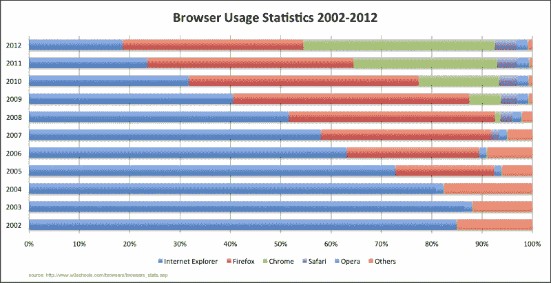
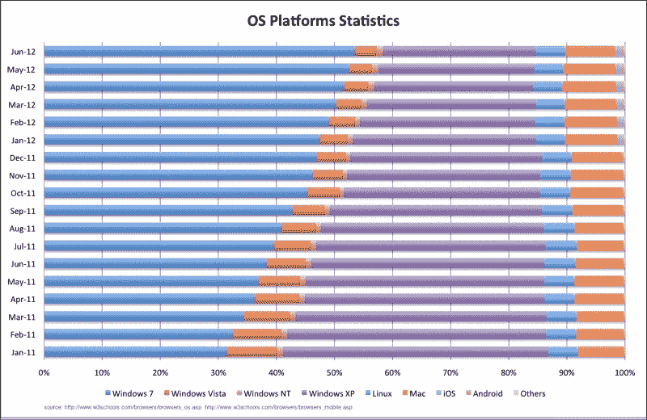
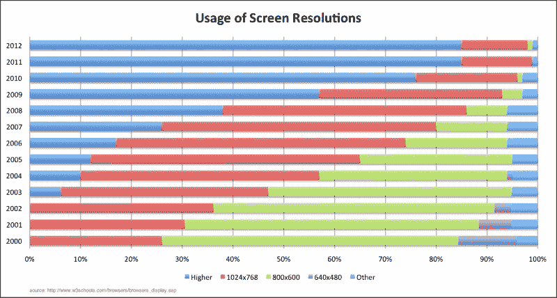

# 第一章. HTML5 入门套件：兼容性

在**序言**中，我们介绍了 HTML5 文档的一般结构，但在开始开发之前，我们首先必须谈谈解决跨浏览器和平台兼容性问题这一耗时的问题。在本章中，我们将介绍浏览器的工作原理以及支持多个浏览器和设备的 HTML5 策略。到本章结束时，你将能够遵循一个初步的行动计划，以持续支持你的企业应用的功能、界面和用户体验。

我们将涵盖以下主题：

+   兼容性的真正含义

+   浏览器

+   操作系统平台

+   显示分辨率

+   兼容性的重要性

+   补丁差异 - 兼容库

# 兼容性的真正含义

在一个理想的世界里，HTML、CSS 和 JavaScript 应该在所有浏览器和平台上以相同的方式被解释。虽然**万维网联盟**（**W3C**）为这些技术制定了标准，但浏览器制造商以自己的方式实现了它们。这意味着虽然你可以使用 W3C 标准来开发企业应用，但不同浏览器和平台之间可能存在不一致性。

兼容性并不意味着用户在每一个客户端都应该有相同的体验，但它需要保持一定的连贯性。例如，如果我们有一个应用程序中的用户列表，根据平台的不同，有不同的输入方式是好的做法。我们可以在任何桌面客户端使用滚动条来导航列表。对于触摸设备，手势可能更受欢迎。

另一方面，我们需要注意平台限制，因为有时在每台设备或客户端上支持相同的功能在技术上是不可能的。一个说明这一点的特定实例是 iOS 设备中的音频和视频音量管理（直到版本 5.1.1）。在 iOS 的 Safari 中使用 JavaScript 无法控制音量。在这种情况下，隐藏 iOS 设备的音量控制更可取。

为了更好地理解兼容性问题，了解万维网相对于渲染最终产品的客户端能力、操作系统或平台以及屏幕分辨率的演变是很重要的。

# 浏览器

自从万维网发布以来，浏览器市场一直存在竞争，争夺市场份额的主导地位。到 2001 年，随着网景公司停止成为主要竞争者，Internet Explorer 控制了超过 90%的浏览器市场，但在 2004 年 11 月 Mozilla Firefox 1.0 版本和 2008 年 9 月 Google Chrome 发布后，它开始看到新一代的竞争。



然而，截至 2012 年 6 月，Google Chrome 已成为市场份额仅为 32.76%的最常用浏览器。它现在与 Mozilla Firefox、Internet Explorer、Safari 和 Opera（包括移动版本）共享一个越来越拥挤的空间。此外，每个浏览器都有自己的版本列表，在知道新版本总是即将到来之后，在某些情况下，我们需要决定我们的应用程序需要支持哪个版本。

让我们稍微了解一下浏览器和版本多样性的复杂性。每个浏览器都有两个主要的软件组件：渲染引擎和 JavaScript 引擎。

## 渲染引擎

也称为**布局引擎**或**网页浏览器引擎**，渲染引擎负责解析标记内容（HTML）和样式信息（CSS、XSL 等），并生成格式化内容的视觉表示，包括引用的媒体文件（图像、音频、视频、字体等）。了解许多渲染引擎很重要，因为它可以帮助你识别某些行为，并根据它们的渲染引擎推断出哪些浏览器将以某种方式表现。

虽然 Chrome 和 Safari 使用 WebKit（由苹果、KDE、诺基亚、谷歌和其他公司开发），Firefox 使用 Gecko（由 Netscape/Mozilla 基金会开发），Internet Explorer 使用 Trident（由微软拥有），而 Opera 使用 Presto。

使用 CSS，可以通过前缀来识别一些专有的渲染引擎功能（称为 CSS 扩展）。WebKit 特有的功能以`-webkit-`开头，Gecko 特有的功能以`-moz-`开头。Opera 包括`-o-`前缀，而 Internet Explorer 8 及以上版本识别`-ms-`。

Trident 采用不同的方法。它识别以`*`或`–`为前缀的常见 CSS 属性以覆盖之前的定义（例如，`*color:#ccc;`和`_color:#ccc;`除了 Trident 以外的其他渲染引擎都不会识别）。

## JavaScript 引擎

JavaScript 引擎是浏览器中解释和执行 JavaScript 代码的软件组件。虽然渲染引擎负责使用 CSS 样式呈现 HTML 内容的视觉表现，但 JavaScript 引擎将解释和执行 JavaScript 代码。

Chrome 使用 V8 引擎，Firefox 现在使用 Jägermonkey，Internet Explorer 9 使用 Chakra，Safari 使用 Nitro，而 Opera 在 2010 年用 Carakan 替换了 SunSpider。

### 注意

许多人认为的当前浏览器战争的排名很大程度上是由 JavaScript 引擎的速度驱动的。虽然其他引擎依赖于解释和编译，但 V8 没有中间解析器，它使用自己的运行时环境生成汇编器。换句话说，它有一个虚拟机。这使得 Chrome 成为最快的浏览器之一。

作为一般规则（有一些例外），最好是先加载 HTML 和 CSS，然后才是 JavaScript。这可以通过在关闭`<body>`标签之前包含导入 JavaScript 的`<script>`标签来实现。这样做的原因是渲染 HTML 和 CSS 比解释和执行 JavaScript 要快。因此，网页看起来会更快地加载。

当无法在主体中包含`<script>`标签时，`<script>`标签上有两个属性可以用来向浏览器指示脚本何时下载。这些是`async`，它在 HTML5 中引入，以及`defer`。`defer`属性确实做了它声称的事情；它将脚本执行推迟到页面渲染完毕。这样，DOM 就为你的脚本准备好了。`async`属性指示浏览器异步下载脚本，而不阻塞渲染引擎，并在准备好时执行它。两者都在`DOMContentLoaded`事件之前执行。关键区别在于`defer`按顺序执行每个脚本，而`async`则在脚本准备好时执行。通常，为了支持不支持`async`属性的老旧浏览器，这些属性会一起使用，这样不支持异步的浏览器可以回退到`defer`。

虽然浏览器之间存在许多差异，但重要的是要意识到，在同一个浏览器类别中存在多个版本，它们的 HTML5 和 CSS3 支持差异很大。这对于 Internet Explorer 来说尤其如此。对 HTML5 和 CSS3 的正确支持直到 Internet Explorer 9 才出现。

### 注意

微软已经开始了一项活动，旨在全球范围内废弃和减少 Internet Explorer 6 的市场份额。有关更多详情，请参阅[`www.ie6countdown.com`](http://www.ie6countdown.com)。Aten 设计集团将这一举措推向了另一个层次，通过纪念[`/www.ie6funeral.com`](http:///www.ie6funeral.com)上的 IE6 葬礼来纪念这一事件。

大多数 HTML5 和 CSS3 功能在以下浏览器和版本中得到支持：

+   Internet Explorer 9 及以上版本

+   Firefox 7 及以上版本

+   Chrome 14 及以上版本

+   Safari 5 及以上版本

+   Safari Mobile 3.2 及以上版本

+   Opera 11 及以上版本

+   Opera Mobile 5 及以上版本

即使如此，仍然有一些功能不受支持，并且实现之间存在不一致。一个有趣的案例研究揭示了浏览器之间标准缺失的情况，那就是 HTML5 中的视频使用。为了使用 HTML5 的本地视频功能，视频文件必须使用特定的编解码器进行压缩。存在三种主要的编解码器：**Ogg Theora**（免费），**H.264**（对最终消费者免费，但编码和解码产品涉及版税），和**WebM**（免费）。由于 Firefox 倾向于使用开源技术，它最初只支持 Ogg 和 WebM。Chrome 目前支持所有三种编解码器，但出于与 Firefox 对 H.264 支持相同的原因，将在后续版本中移除（尽管可能在移动设备上继续支持）。Safari、Safari Mobile 和 Internet Explorer 9 及以上版本默认只支持 H.264，但您可以安装插件以支持 Ogg 和 WebM（Safari Mobile 除外）。

### 注意

以下网站提供了有关不同浏览器对 HTML5 功能支持以及行为差异的详细信息：

+   [`caniuse.com/`](http://caniuse.com/)

+   [`html5please.com/`](http://html5please.com/)

# 操作系统平台

任何运行在操作系统（OS）上的网络应用程序都会受到影响。最明显的区别是浏览器用户界面元素的外观，包括滚动条、提交按钮、复选框等。这是一个重要的考虑因素，因为这些元素的大小和形状在不同的操作系统中可能会有所不同——即使使用相同的浏览器。实际上，一些操作系统限制了某些功能，例如 `<input type="file">` 在 iOS6 之前并未在 iOS 上得到支持。



操作系统平台统计显示，Windows 是目前网络使用最广泛的操作系统。然而，考虑到平板设备和智能手机技术的不断改进，移动平台在未来几年可能会更加突出。

# 显示分辨率

随着市场上设备的增多，屏幕分辨率在规划网络应用程序时正迅速成为一个重要的考虑因素。Android 拥有多种尺寸和密度的设备。根据屏幕分辨率的用法，新硬件技术的进步使得现代屏幕上的像素数量得以增加：



尽管现在大多数桌面系统都具有高于 1024 x 768 的分辨率，但移动技术的兴起创造了一个悖论，即低分辨率显示屏正在重新夺回失去的地盘。企业应用程序提供的服务体验不需要，实际上也不应该是所有设备的相同。在 1920 x 1200 分辨率的桌面屏幕上查看页面可能与 960 x 540 分辨率的手机屏幕大相径庭，这不仅因为分辨率，还因为设备的尺寸和可读性（文本的可读性和理解程度）。有时检测分辨率以适应用户体验是很重要的。毫无疑问，新的技术如**响应式网页设计**正在被采纳来解决这些问题。

### 注意

就像游戏场上的变量已经足够多一样，苹果公司在 2010 年 6 月推出了搭载 Retina 显示屏的 iPhone 4，其原生分辨率为 960 x 640。这项技术基于更高的像素密度，超出了人类眼睛在典型观看距离下看到屏幕上图像像素化的能力。尽管在 iPhone 4 上的网页图像中并不那么明显，但 2012 年推出的配备 Retina 显示屏的新 iPad 和新的 MacBook Pro 系列对网络应用提出了新的要求。

首先，有一些网络开发技术通过使用 CSS 检测设备分辨率来确定客户端是否为移动设备。随着新 iPad 的出现，2048 x 1536 px 的分辨率变得不可能或至少不是直观的。新 iPad 的分辨率高于市场上大多数台式机和笔记本电脑。其次，为了避免在新 iPad 或新 MacBook Pro 上查看的任何应用程序中出现像素化效果，有必要为这些苹果设备包含更高分辨率的图像，并为与所有其他设备的向后兼容性包含正常分辨率的图像。

# 兼容性的重要性

在这一点上，如果只需要开发用于组织内部使用的企业应用程序，并且可以强制指定特定的浏览器，那么关心兼容性的重要性似乎是自然的。这种态度有两个危险的原因。首先，企业正在迅速向移动交付转变，控制平台变得越来越难以维持。其次，以这种方式限制组织会阻碍其更新应用程序支持能力，因为它将企业应用程序与桌面支持的选择过于紧密地耦合。如果公司想要升级到较新的操作系统或默认网络浏览器，通过要求支持特定版本的浏览器来限制它可能会产生不希望的结果。

# 补丁差异 - 兼容库

通常情况下，我们希望支持尽可能多的浏览器，因此我们需要一种方法来实现向后兼容性，通过实现浏览器上不可用的功能，通知用户该功能不可用，或者根据浏览器的功能修改用户体验。为此，有许多 JavaScript 库可以帮助我们。

### 提示

对于这一章，样式和脚本将直接包含在 HTML 文件中，以简化理解，尽管将样式和脚本放在单独的文件中是一个好习惯。

## HTML5 Shiv

如前所述，Internet Explorer 从版本 9 开始支持 HTML5 标签。**HTML5 Shiv**允许在早期版本中提供支持。也称为**HTML5 Shim**，它是一个开源 JavaScript 库，可以在 IE 9 之前的 Internet Explorer 版本中为 HTML5 元素提供样式。它是通过使用`document.createElement("element")`来告诉浏览器这些标签存在来实现的。

假设我们在测试 Internet Explorer 8，并且我们有以下代码：

```js
<!DOCTYPE HTML>
<html>
<head>
<style>
header{
  color:#ff0000;
  font-size:40px;
}
</style>
</head>
<body>
  <header>Hello HTML5!</header>
</body>
</html>
```

### 提示

**下载示例代码**

您可以从您在[`www.PacktPub.com`](http://www.PacktPub.com)的账户中下载您购买的所有 Packt 书籍的示例代码文件。如果您在其他地方购买了这本书，您可以访问[`www.PacktPub.com/support`](http://www.PacktPub.com/support)并注册，以便将文件直接通过电子邮件发送给您。

在 Internet Explorer 8 中，文本将不会显示样式。可以使用 HTML5 Shiv 来实现这一功能。

### 提示

在使用库之前深入了解它们是一个好习惯。我们鼓励您查看以下位置的 HTML5 Shiv 代码：[`github.com/aFarkas/html5shiv/blob/master/src/html5shiv.js`](https://github.com/aFarkas/html5shiv/blob/master/src/html5shiv.js)。

要安装这个库，你需要执行以下步骤：

1.  从以下位置下载库：[`github.com/aFarkas/html5shiv/zipball/master`](https://github.com/aFarkas/html5shiv/zipball/master)。

1.  解压文件。

1.  将`html5shiv.js`从`dist`文件夹复制到你的 JavaScript 文件夹（在我们的例子中是`js`）。

1.  在`head`标签内插入以下代码：

    ```js
    <!--[if lt IE 9]>
    <script src="img/html5shiv.js"></script>
    <![endif]-->
    ```

    因此，我们的代码应该如下所示：

    ```js
    <!DOCTYPE HTML>
    <html>
    <head>
    <!--[if lt IE 9]>
      <script src="img/html5shiv.js"></script>
    <![endif]-->
    <style>
    header{
      color:#ff0000;
      font-size:40px;
    }
    </style>
    </head>
    <body>
    <header>Hello HTML5!</header>
    </body>
    </html>
    ```

### 提示

注意，`<!--[if lt IE 9]>`条件注释仅在浏览器版本低于版本 9 的 Internet Explorer 中包含 JavaScript 库。

如果你在这个代码中运行 Internet Explorer 8，它将以红色显示更大的字体**Hello HTML5**！这是一个例外，我们需要在`<head>`内部加载 JavaScript 库，因为我们需要在开始样式化之前给浏览器提供识别 HTML5 元素的能力。


## Modernizr

由于即使是最新版本的网页浏览器也无法支持所有的 HTML5 和 CSS3 功能，因此在不支持某个功能时显示通知或更改页面行为是有用的。一种旧的策略是查看 `navigator.userAgent` 属性以检测浏览器的用户代理，并根据相关案例编写代码。随着用户代理的变化，保持同步并修改应用程序变得困难。用户代理检测的另一种方法是 **特性检测**，其中应用程序检测特定功能是否受支持，并相应地做出反应。以下是一个特性检测的示例：

```js
function supports_video() {
  return !!document.createElement('video').canPlayType;
}
```

**Modernizr** 是一个开源的 JavaScript 库，它允许根据每个浏览器的功能支持不同级别的体验，使用简单的特性检测模型。此外，Modernizr 使用 HTML5 Shiv，增加了在版本 9 之前的 Internet Explorer 上样式化 HTML5 元素的能力。

回到我们之前的例子：

```js
<!DOCTYPE HTML>
<html>
<head>
<style>
header{
  color:#ff0000;
  font-size:40px;
}
</style>
</head>
<body>
  <header>Hello HTML5!</header>
</body>
</html>
```

假设我们想要使用 HTML5 实现地理位置功能，以获取用户的地理位置，并检测它是否可用。为此，我们开始使用 Modernizr：

1.  前往 [`modernizr.com/download/`](http://modernizr.com/download/)。

1.  选择您想要验证的功能和 **html5shiv**。在这种情况下，我们将选择 **Misc.** 下的 **Geolocation API** 功能，以及 **Extra** 下的 **html5shiv v3.4** 和 **Add CSS Classes**。

1.  点击 **GENERATE!** 按钮。

1.  复制生成的源代码。

1.  创建一个新的 JavaScript 文件（命名为 `modernizr.js`），粘贴源代码，并将其保存在您的 JavaScript 文件夹中。

1.  在 `<head>` 中导入 Modernizr 库 `<script src="img/modernizr.js" type="text/javascript"></script>`。此时代码应如下所示：

    ```js
    <!DOCTYPE HTML>
    <html>
    <head>
    <script src="img/modernizr.js" type="text/javascript"></script>
    <style>
    header{
      color:#ff0000;
      font-size:40px;
    }
    </style>
    </head>
    <body>
    <header>Hello HTML5!</header>
    </body>
    </html>
    ```

    从这里我们有两个可能的解决方案；使用 JavaScript 或使用 CSS 来检测回退。

为了显示消息或显示不同的样式，我们可以按照以下步骤使用 CSS：

1.  将一个名为 `no-js` 的类添加到 `<html>` 标签中。如果 JavaScript 不受支持，这将作为默认选项。如果 JavaScript 受支持，Modernizr 将用名为 `js` 的类替换 `no-js`，并在不支持的情况下为所有功能添加以 `no-` 为前缀的类。例如，如果您的浏览器支持地理位置，`html` 标签将类似于以下行代码：

    ```js
    <html class="js geolocation">  
    ```

    否则，它将看起来像以下代码：

    ```js
    <html class="js no-geolocation">
    ```

1.  在 `<body>` 标签中，添加两个 `div` 标签，分别包含当地理位置支持时的消息和当不支持时的消息：

    ```js
    <div class="geolocation-available">
      Congrats! Your browser supports Geolocation!
    </div>
      <div class="no-geolocation">
    Your browser doesn't support Geolocation :(
    </div>
    ```

1.  添加 CSS 样式以显示和隐藏消息。默认情况下，隐藏两个消息，并使用检测类在 `<html>` 标签中创建的类来相应地隐藏或显示类：

    ```js
    div.geolocation-available, div.no-geolocation{
      display: none;
    }
    .no-geolocation div.no-geolocation, .geolocation div.geolocation-available {
      display: block;
    }
    ```

    最后，完整的代码应如下所示：

    ```js
    <!DOCTYPE HTML>
    <html class="no-js">
    <head>
      <script src="img/modernizr.js" type="text/javascript"></script>
      <style>
      header{
        color:#ff0000;
        font-size:40px;
      }
      div.geolocation-available, div.no-geolocation{
        display: none;
      }
      .no-geolocation div.no-geolocation, .geolocation div.geolocation-available {
        display: block;
      }
    </style>
    </head>
    <body>
      <header>Hello HTML5!</header>
      <div class="geolocation-available">
        Congrats! Your browser supports Geolocation!
      </div>
      <div class="no-geolocation">
        Your browser doesn't support Geolocation :(
      </div>
    </body>
    </html>
    ```

如果我们想要实现 JavaScript 回退，我们需要使用 Modernizr 创建一个条件语句。在我们的情况下，由于 Modernizr 是一个具有方法的 JavaScript 对象，我们可以使用`Modernizr.geolocation`来测试地理定位是否受支持。条件语句应该是这样的：

```js
if (Modernizr.geolocation){
  alert("Congrats! Your browser supports Geolocation!");
}else{
  alert("Your browser doesn't support Geolocation :(");
}
```

完整的代码应该如下所示：

```js
<!DOCTYPE HTML>
<html>
<head>
  <script src="img/modernizr.js" type="text/javascript"></script>
  <style>
  header{
    color:#ff0000;
    font-size:40px;
  }
  </style>
</head>
<body>
  <header>Hello HTML5!</header>
  <script type="text/javascript">
  if (Modernizr.geolocation){
       alert("Congrats! Your browser supports Geolocation!"); 
     }
else{
       alert("Your browser doesn't support Geolocation :("); 
     }
  </script>
</body>
</html>
```

尽管名为 Modernizr，但它实际上并没有为浏览器添加缺失的功能，除了 HTML5 标签的样式支持。在你需要为旧浏览器中的功能创建回退时，Modernizr 是一个不错的选择。然而，如果只需要使用 HTML5 和 CSS3 进行简单的样式设计，HTML5 Shiv 就足够了。

## Explorer Canvas

早期版本的 Internet Explorer（版本 9 之前）不支持 HTML5 Canvas，它允许基于 2D 命令的绘图，但**Explorer Canvas**使这个功能成为可能。

要使用 Explorer Canvas，你可以执行以下步骤：

1.  访问[`code.google.com/p/explorercanvas/downloads/list`](http://code.google.com/p/explorercanvas/downloads/list)。

1.  下载 Explorer Canvas 的最新版本。

1.  将`excanvas.compiled.js`复制到你的 JavaScript 文件夹中。

1.  在`<head>`中导入库，验证 Internet Explorer 的版本：

    ```js
    <!--[if lt IE 9]>
        <script type="text/javascript" src="img/excanvas.compiled.js"></script>
      <![endif]-->
    ```

1.  现在，你可以在旧版本的 Internet Explorer 中使用 HTML5 Canvas API。

由于它是一个 JavaScript 库，这意味着它需要在页面加载时被解释和执行，因此它的性能将比现代浏览器低得多。它也不支持几个功能，并且相当有缺陷。

## HTML5 模板文件

设置一个项目，包括 Modernizr 和基本配置的一个非常简单直接的方法是使用一个启动包，例如**HTML5 模板文件**。HTML5 模板文件是一个包含 HTML、CSS 和 JavaScript 文件的集合，包括 Modernizr、jQuery 和 CSS Reset2（一组 CSS 规则，以创建一个共同基线的方式覆盖了不同浏览器中的默认和不一致的渲染）。即使兼容性是兴趣最远的话题，这个模板也可以用作初始化 CSS 并将必要的 JavaScript 库放置到位，从而使兼容性成为一个非问题。

你可以通过选择以下选项之一从[`html5boilerplate.com/`](http://html5boilerplate.com/)下载 HTML5 模板文件：

+   **模板文件**: 文件集合未最小化和注释

+   **精简模板**: 文件集合已最小化且未注释

+   **自定义模板**: 你可以配置哪些文件将进入你的基础项目

虽然最后一种情况可能足够，但有时需要包含更多的自定义。幸运的是，有一个名为**Initializr**的工具，它可以从我们的 HTML5 模板文件项目中删除不需要的文件。此外，你还可以使用 Initializr 提供的模板根据窗口大小/屏幕分辨率修改视觉表现。

要下载 Initializr，请访问[`www.initializr.com/`](http://www.initializr.com/)并选择：

+   **经典 H5BP**：这是一个基本项目

+   **响应式**：这是一个基于屏幕分辨率的响应式项目

+   **Bootstrap**：这是一个使用 Twitter 的 Bootstrap 模板（[`twitter.github.com/bootstrap/`](http://twitter.github.com/bootstrap/)）的响应式项目，使用 Less（[`verekia.com/less-css/`](http://verekia.com/less-css/）），这是一种动态样式表语言，它使用 JavaScript 编译器在编译时生成 CSS

在此之后，你可以选择或修改包含的文件。

# 在开始应用开发之前

在接下来的章节中构建 MovieNow 应用时，我们将从头开始，这样我们可以一步一步地看到这个过程。但请记住，你可以使用模板来构建你的企业应用。唯一的注意事项是，你总是需要了解项目内部的内容；有时未知的 JavaScript 或 CSS 文件可能会引起严重的性能问题。

虽然所有这些可能听起来像是一场噩梦，但你只需要遵循一个简单的策略就可以开始兼容性的神奇之旅：

1.  遵循 W3C 的 HTML、CSS 和 JavaScript 标准（[http://www.w3schools.com](http://www.w3schools.com)）。

1.  选择 JavaScript 库或 CSS 以支持旧浏览器的向后兼容性。一般来说，不包含 JavaScript 的兼容性解决方案比包含 JavaScript 的方案更好，但有时仅使用 CSS 是无法实现的。

1.  为允许任何用户代理的访问性定义一个行动方案。有几个值得注意的策略：**优雅降级**或**渐进增强**。优雅降级意味着你首先为现代浏览器开发，然后为功能较弱的设备添加处理程序。另一方面，渐进增强意味着从基本功能开始，构建到浏览器功能的最低公共分母，然后为功能更强的浏览器添加增强。

1.  为了多个原因，支持移动设备的不同**用户体验**（UX）是一个好的实践：在手机等移动设备上，键盘可能会很麻烦，在触摸屏设备上更是如此；在较小的分辨率上查看相同的布局可能会迫使用户不断放大和缩小，或者使得点击某些按钮或链接变得困难，有时在技术上也不可能实现某些功能。例如，在 iOS 设备（iPhone、iPad 等）上使用 JavaScript 进行视频自动播放或音量控制是不可能的。

1.  制定针对多个浏览器的测试计划。有一些服务允许你在多个浏览器和平台上测试你的企业应用。当然，使用快照的服务可能不是最优的，因为它们不测试 JavaScript 执行。始终在测试机器上安装你系统将支持的浏览器总是好的，而且有一些工具允许你动态更改浏览器版本。

1.  使用官方浏览器文档以及社区论坛来了解浏览器制造商的最新动态。

# 摘要

在本章中，我们了解了不同浏览器之间的差异以及它们不一致的行为方式。我们讨论了兼容性的重要性以及你可以使用的策略来平衡竞争。一般来说，网络开发者必须尝试覆盖大多数情况以确保兼容性，但与此同时，理解项目和目标受众非常重要，我们首先需要将我们的解决方案适应他们，然后才是全球场景。

作为最后的思考，我们需要站在用户的角度考虑。用户最不想看到的是一条要求下载另一个浏览器来使用应用程序的消息。记住，作为开发者，我们的目标不仅仅是将一整套需求实现，还要创造引人入胜的用户体验，将应用程序定义为一个促进最终目标的媒介，而不是一个将用户与最终目标隔离开来的障碍。

在开始建造房屋之前，你需要了解你需要哪些工具以及如何使用它们。在下一章中，我们将探讨如何设置你的机器以及我们可以用来构建我们的 HTML5 企业应用的可用的工具，包括对这些工具选择中涉及到的商业决策的全面评估。
