# 第二章：HTML5 入门套件：实用工具

构建 HTML5 企业级应用需要合适的工具来完成这项工作。幸运的是，市场上有很多工具可以支持网络应用开发的各个方面。本章介绍了众多对网络开发有用的工具，包括编辑器、**集成开发环境（IDEs**）、网络服务器、网络浏览器、浏览器工具，甚至还有 HTTP 代理。

我们将涵盖以下主题：

+   选择编辑器和 IDE

+   选择网络服务器

+   预装堆栈

+   网络浏览器和插件

+   HTTP 代理

# 选择编辑器和 IDE

编辑器和集成开发环境的健壮性差异很大，它们通常是为了满足最终用户的各种需求而构建的。它们可以从非常简单的文本编辑器，如 Windows 的记事本（Notepad）和 Mac 的 TextEdit，到复杂的 IDEs，如 Eclipse。更有趣的是，还有各种新的基于网络的编辑器和 IDEs，允许您从几乎任何机器上开发，并与其他人在网络项目上进行最小化设置的合作。

选择哪个将主要基于您的需求。如果您的需求简单，您的工具可能也很简单。如果您的需求复杂，您的工具将更复杂。尽管您几乎可以使用任何东西来编写代码，但我们将在此介绍专门针对 HTML5 开发的工具。

以下是对您在开发 HTML5 企业级应用时可用选项的简要讨论。当然，这并不是一个详尽的列表，因为随着时间的推移，软件更新将极大地改变这一领域。

## Adobe Dreamweaver CS6

这适用于 Windows XP SP3 及以上版本和 Mac OS X 10.6.8 及以上版本。Adobe 的旗舰网站开发产品在 Adobe Creative Suite 6 中进行了重大升级。Adobe 在 CS5 的 11.0.3 更新中引入了该产品，内置了 HTML5 和 CSS3 支持，包括 HTML5 模板、WebKit 引擎的更新以及编码提示以简化 HTML5 开发：

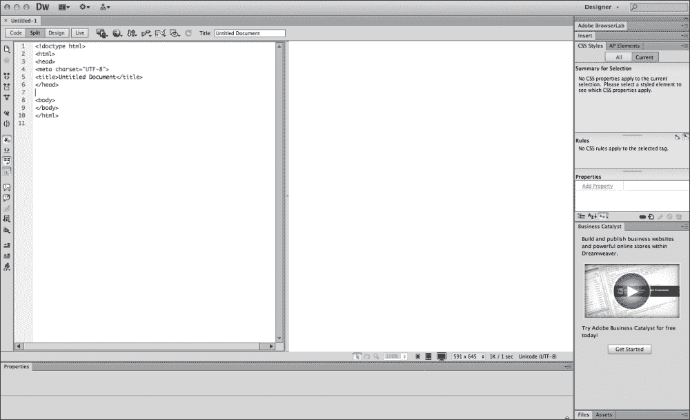

在 Dreamweaver 的 HTML5 功能中，您可以使用多屏幕预览功能同时查看不同尺寸的屏幕上的网页。这包括音频和视频内容的动态渲染。

在创建新文档时，请确保在“新建文档”对话框中选中**HTML5**作为**文档类型**，如下截图所示：

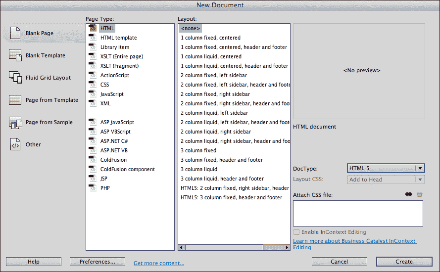

关于 Adobe Dreamweaver 的更多信息，包括如何购买，可以在[`www.adobe.com/products/dreamweaver.html`](http://www.adobe.com/products/dreamweaver.html)找到。

## Aptana Studio 3

该软件适用于 Windows XP 及以上版本、Mac OS X 10.5 及以上版本、Linux Ubuntu 9 及以上版本和 Linux Fedora 12 及以上版本。Aptana Studio 3 是 Eclipse 引擎的衍生产品 ([`www.eclipse.org/`](http://www.eclipse.org/))，它是一个功能强大、商业友好的开源集成开发环境。它支持多种语言，包括 Java、Ruby 和 PHP，以及 HTML、CSS 和 JavaScript。它还提供了一系列插件，用于源代码管理、部署和其他许多自定义功能。

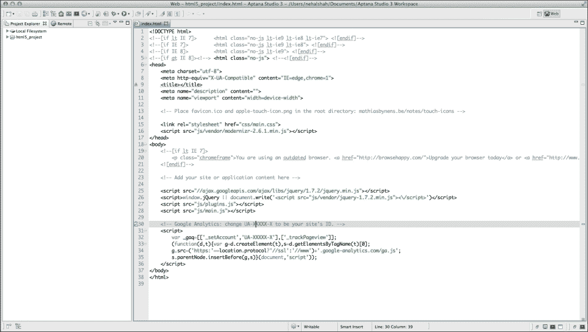

HTML5 兼容性支持是 Aptana Studio 3 的一个主要特性。在其代码辅助功能中，它显示每个元素支持哪些浏览器以及支持级别。此外，它将 **HTML5 Boilerplate** 作为网页项目模板内置，因此您可以立即使用所有构建跨浏览器兼容的 HTML5 企业应用程序所需的工具开始工作。

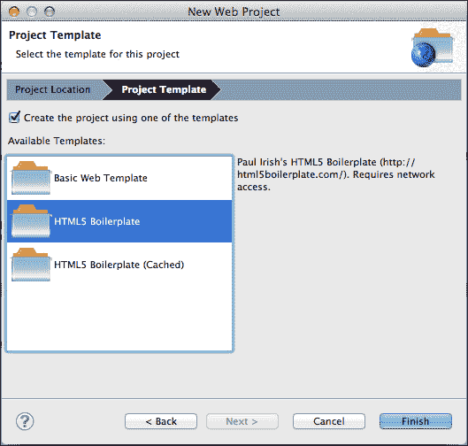

关于 Aptana Studio 3 的更多信息，包括下载地址，可以在 [`www.aptana.com/products/studio3`](http://www.aptana.com/products/studio3) 找到。

## BlueGriffon 1.5.2

该软件适用于 Windows XP 及以上版本、Mac OS X 10.5 及以上版本、Linux Ubuntu 11.10 及以上版本和 Linux Fedora 16 及以上版本。BlueGriffon 是一个基于 Gecko 渲染引擎（Mozilla Firefox 使用的渲染引擎）的免费 WYSIWYG 编辑器。它包括用于开发 HTML5 页面的工具，如 DOM 探索器和直接嵌入音频和视频文件的支持。它还通过其样式编辑器抽象出许多 CSS3 特效。

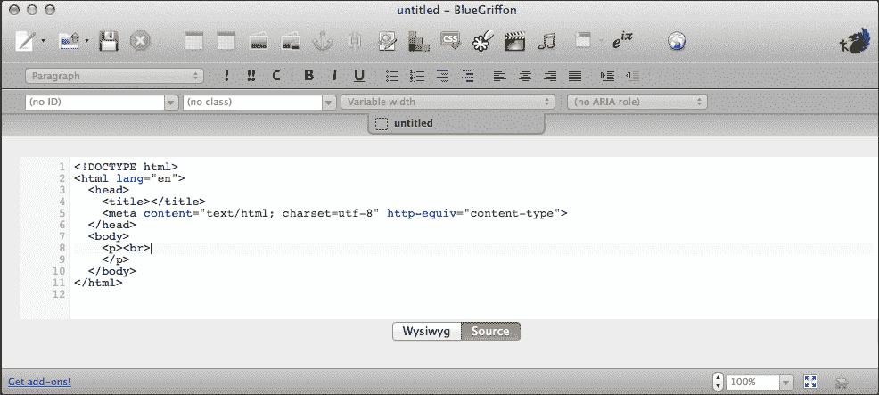

在创建新文档时，只需下拉新文档工具栏（位于新文档图标旁边）并点击 **更多选项…**。确保已选择 **HTML 5**，语言已设置，然后点击 **确定**。

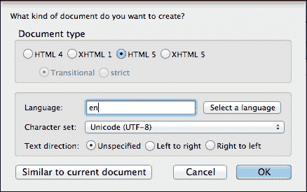

关于 BlueGriffon 的更多信息可以在 [`bluegriffon.org/`](http://bluegriffon.org/) 找到。

## Maqetta

Maqetta 是 Dojo 基金会的一个开源项目，旨在通过 WYSIWYG 用户界面构建一个基于 HTML5 的编辑器，面向视觉设计师。目前作为托管产品提供（尽管这可能在将来发生变化），它处于技术预览状态，希望不久后发布 1.0 版本。以下截图显示了 Maqetta 为使用 iPhone 设备并在 Google Chrome 上运行的移动应用程序提供的界面。

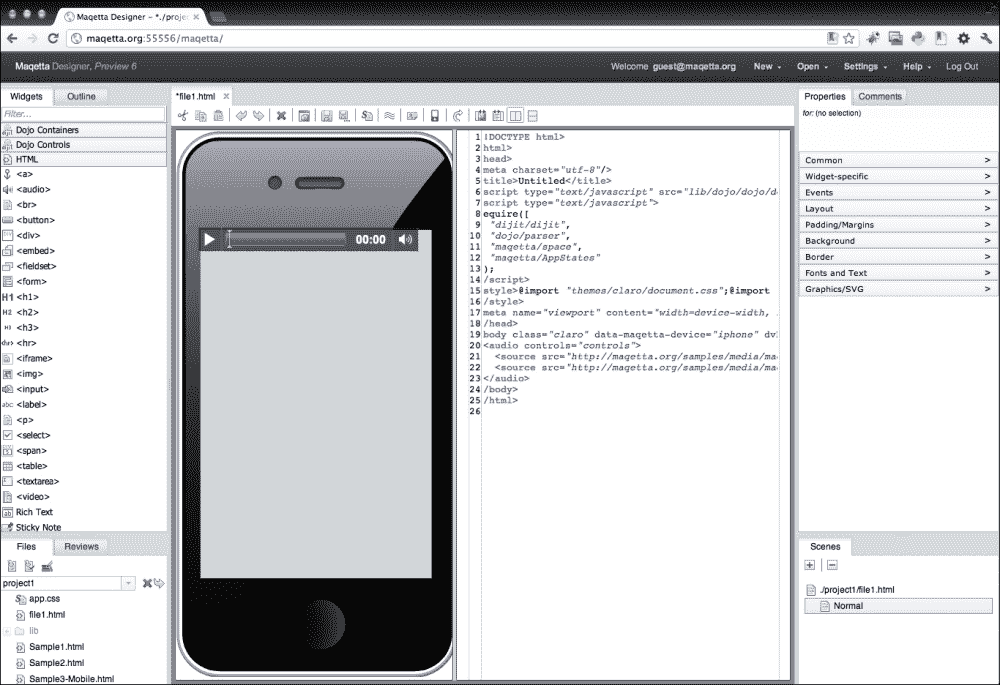

除了视觉编辑外，Maqetta 还提供了审查和评论、开发线框以及以易于开发者理解设计意图的方式捕捉交互状态的功能。

关于 Maqetta 的更多信息可以在 [`maqetta.org/`](http://maqetta.org/) 找到。

## eXo

eXo 提供了一个免费、基于云的 IDE，它提供了协作和部署功能。除了 HTML5 和 JavaScript，它还支持 Java、Ruby 和 Python 应用程序的开发。它还集成了 **平台即服务 (PaaS)** 提供商，如 CloudBees 和 Heroku。它基于 eXo Platform 3.5，这是一个企业级 Java 门户和用户体验平台，提供内容和管理以及社交活动流。

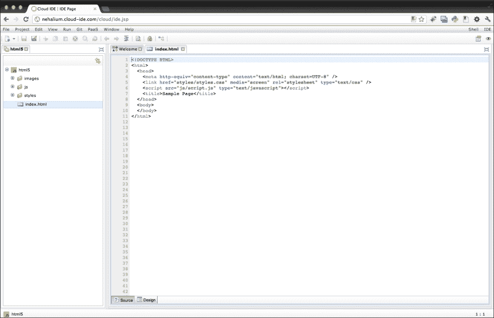

在 [`www.cloud-ide.com/`](http://www.cloud-ide.com/) 可以找到有关 eXo 的更多信息。

## Cloud9

Cloud9 是另一个基于云的 IDE，除了 HTML5 和 JavaScript，它还支持多种语言。它因其与 GitHub 和 Bit Bucket 认证集成以及实时协作而受到特别关注。它还允许 SSH 和 FTP 访问，并具有离线工作的能力。Cloud9 一直在将自己定位为 Node.js 开发的主要 IDE。

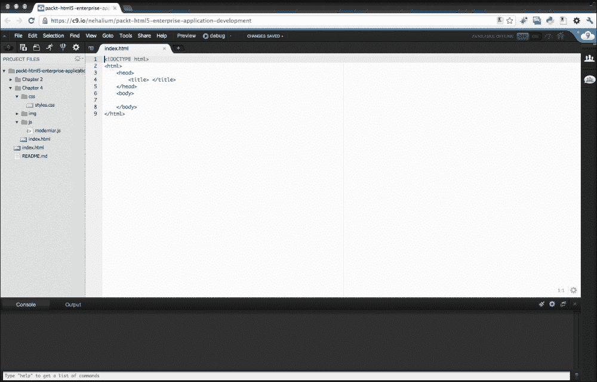

尽管 Cloud9 提供了有限的免费订阅，但它还提供了一种高级订阅，该订阅提供额外的私有工作空间和完整的 shell 访问。

在 [`c9.io/`](https://c9.io/) 可以找到有关 Cloud9 的更多信息。

# 选择网络服务器

如果您正在管理自己的网络集群或在本地机器上进行开发，了解可用的网络服务器软件包会有所帮助。在您的机器上安装和运行网络服务器，以更好地了解您的 HTML5 企业应用程序在没有上传和与远程主机同步开销的情况下将如何运行，这尤其有帮助。以下是对市场上一些最知名网络服务器的简要介绍。

## Apache

更广泛使用的 HTTP 服务器之一是 Apache。它是一个始于 1996 年的开源项目，可以在 Unix 和 Windows 操作系统上安装。

在 [`httpd.apache.org/docs/2.4/install.html`](http://httpd.apache.org/docs/2.4/install.html) 可以找到有关安装 Apache 网络服务器的信息。

## Apache Tomcat

Tomcat 是一个开源网络服务器，提供 servlet 容器，允许您运行 Java 代码。它主要用于 Windows 和 Unix，但可以通过下载适当的 Unix 软件包安装在 Mac 上。

要在 Windows 或 Unix 上安装 Tomcat，您可以遵循此网站上的说明：

[`tomcat.apache.org/tomcat-6.0-doc/setup.html`](http://tomcat.apache.org/tomcat-6.0-doc/setup.html)

对于 Mac 用户，您可以参考此链接：

[`www.malisphoto.com/tips/tomcatonosx.html`](http://www.malisphoto.com/tips/tomcatonosx.html)

## Jetty

Jetty 是由 Eclipse 基金会托管的一个 HTTP 服务器，它被集成到 Eclipse IDE 中。它以其小巧的体积而闻名。

要使用 Jetty，您只需要使用 Eclipse IDE（Aptana Studio 3，因为它源自 Eclipse，也包含 Jetty）。否则，您可以在[`wiki.eclipse.org/Jetty/`](http://wiki.eclipse.org/Jetty/)找到有关下载和安装的信息。

## Tornado

Tornado 是一个相对较新的开源 Web 服务器，基于 FriendFeed（一个实时聚合器，整合了多个社交网络的更新）所使用的服务器。它特别以其快速和非阻塞而闻名，因此推荐用于开发 Web 服务。

关于 Tornado 的信息可以在[`www.tornadoweb.org/`](http://www.tornadoweb.org/)找到。

## nginx

发音为“engine x”的 nginx 最初运行了一些俄罗斯网站。现在它为 Netflix 和 Hulu 等企业供电。由 Igor Sysoev 于 2002 年开发，它依赖于异步架构，这使得它能够快速扩展而不影响系统资源。

关于下载和安装 nginx 的信息可以在[`nginx.org/en/download.html`](http://nginx.org/en/download.html)找到。

## LightTPD

LighTPD 发音为“lighty”，是一个开源的 Web 服务器，设计和优化用于高性能环境。它被 YouTube、Wikipedia 和 Meebo 等网站使用。它是由 Jan Kneschke 开发的，作为一个概念验证，用于在同一个服务器上并行处理 10,000 个连接（被称为 c10k 问题）。

关于下载和安装过程的信息可以在[`www.lighttpd.net/`](http://www.lighttpd.net/)找到。

## Node.js

虽然技术上不是一个 Web 服务器本身，但 Node.js 是一个可以编写简单 Web 服务器的平台。它以 Google Chrome 为其核心的 V8 JavaScript 运行时为基础，可以轻松地使用 Node.js 开发企业级 Web 应用程序，因为 HTTP 协议已经集成到平台中。它使用与 Tornado 和 nginx 中相同的非阻塞原则构建，因此比其他 Web 服务器更容易扩展，在某些场景下对系统资源的影响也较小。

关于 Node.js 的更多信息可以在[`nodejs.org/`](http://nodejs.org/)找到。

# 预包装堆栈

为了使环境设置更加简单，有一些易于安装的预包装服务器堆栈，它们内置了 Web 服务器、数据库和脚本平台（通常是 PHP）。您只需安装包，就可以拥有一个完整的沙盒环境，随时可以使用。一些流行的解决方案包括为 Mac OS 构建的 MAMP([`www.mamp.info/`](http://www.mamp.info/))，为 Windows 构建的 WAMP([`www.wampserver.com/en/`](http://www.wampserver.com/en/))，以及适用于 Mac OS、Windows、Linux 和 Solaris 的 XAMPP([`www.apachefriends.org/en/xampp.html`](http://www.apachefriends.org/en/xampp.html))。

# 网络浏览器和插件

现在我们有了编写和运行我们的 HTML5 企业应用程序的工具，讨论可用于查看它们的网络浏览器是必要的。然而，我们将更进一步，并介绍一些可用的开发附加组件。由于工具的丰富性，无论是内置在网络浏览器中还是可插拔的，了解您随时可用的工具对于确保您的 HTML5 企业应用程序是最优的非常重要。以下是最常见现代网络浏览器的介绍。

## Mozilla Firefox

直到最近几年，Mozilla Firefox 一直是迄今为止最友好的开发者网络浏览器；多亏了它，许多其他网络浏览器都包括了针对开发者的最强大的工具集。实际上，许多网络开发者首先为 Firefox 开发，然后才适应其他浏览器。它内置了强大的网络开发者工具。然而，除此之外，您还可以通过附加组件来增强它，这些附加组件为您提供了开发企业应用程序的更强大的工具集。

Firebug ([`getfirebug.com/`](http://getfirebug.com/)) 允许您检查渲染的 HTML 标记，调整 CSS，并自动在页面上看到更新，监控和配置网络活动，以及调试 JavaScript。在下面的屏幕截图中，您可以看到 Firebug HTML 代码检查器：

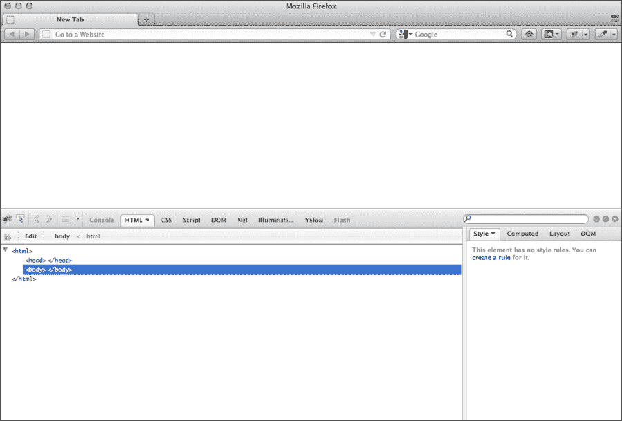

它不仅是一个扩展，还是一个可以自身扩展的附加组件。它拥有包括 FireCookie、FireUnit、FireQuery 和 PageSpeed 在内的众多扩展，这些扩展增加了更多功能。您可以在[`getfirebug.com/wiki/index.php/Firebug_Extensions`](http://getfirebug.com/wiki/index.php/Firebug_Extensions)找到 Firebug 扩展的完整列表。

另一个有用的附加组件是 FireStorage 和 HTML5toggle。FireStorage 允许您查看和管理 Firefox 的 HTML5 本地存储，而 HTML5toggle 允许您在测试回退时打开和关闭 HTML5 支持。

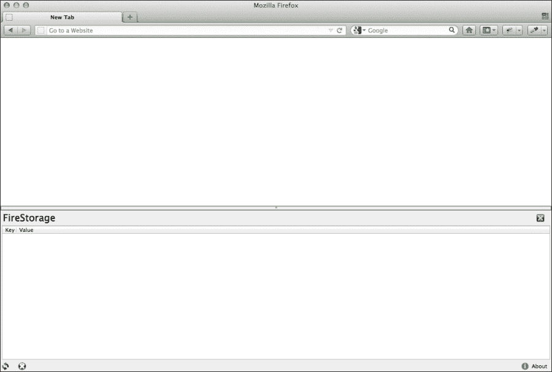

### 注意

如果您想在最终发布之前测试新功能，Mozilla 提供了下载 Firefox 预发布和发布版本的渠道，请访问[`www.mozilla.org/en-US/firefox/channel/`](http://www.mozilla.org/en-US/firefox/channel/)。

您可以找到三个渠道：

+   **Firefox**: 这是最终发布版本，经过测试和验证

+   **Firefox Beta**: 这提供了一个相当稳定的较新功能环境

+   **Firefox Aurora**: 这个渠道是一个带有新功能的实验性发布版本，但不够稳定

## Google Chrome

截至 2012 年 6 月，Google Chrome 已经成为世界上使用最广泛的网络浏览器，这是有充分理由的。除了拥有干净简单的用户界面外，它支持一系列扩展和附加组件，内置了多项开发者工具，并且拥有自己的任务管理器，允许您查看和管理您的内存和 CPU 使用情况。这对于调试企业应用程序和开发最佳性能非常有用。

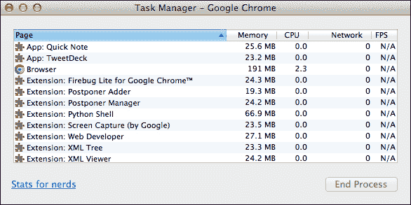

它内置了开发者工具。只需在网页上右键单击，然后点击**检查元素**。同样，您也可以点击**查看**菜单，然后选择**开发者**，再选择**开发者工具**。这将打开浏览器窗口底部的部分，其中包含许多工具，包括 DOM 和 CSS 编辑器、HTML5 本地存储视图、JavaScript 分析器和性能审计器，如下面的截图所示：

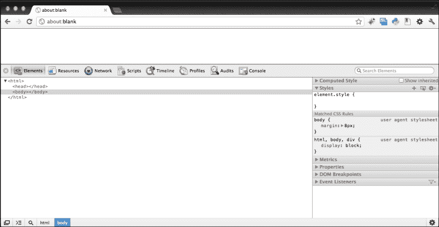

### 注意

如果您想在最终发布之前尝试新功能，您可以通过以下链接下载 Chrome 的不同发布渠道版本：

[`www.chromium.org/getting-involved/dev-channel`](http://www.chromium.org/getting-involved/
dev-channel)

在这里，您将找到四个不同的频道：

+   **稳定**频道：这是已经测试过的最终版本。

+   **Beta**频道：此频道每周更新一次，每六周进行主要更新。

+   **Dev**频道：此频道每周更新一两次，已测试但可能存在错误。

+   **Canary**构建：此频道每日更新，尚未测试或使用，可能存在错误，甚至可能无法运行。此版本可以与其他任何频道并行运行。

## Safari

苹果公司的 Safari 浏览器既可扩展，又内置了一些开发者工具。然而，开发者工具默认是隐藏的。要启用它们，请转到**高级**首选项，并勾选**在菜单栏中显示开发菜单**，如下面的截图所示：

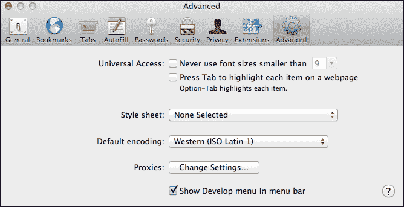

与使用相同 WebKit 引擎的 Google Chrome（Safari）和 Firefox 类似，您可以在网页上的任何位置右键单击并点击**检查元素**来查看网页检查器。您还可以点击**开发**菜单并点击**显示网页检查器**。Safari 的网页检查器提供了几乎与 Chrome 开发者工具相同的工具，包括 DOM 编辑器（在此称为**片段编辑器**）、分析器和本地存储视图。

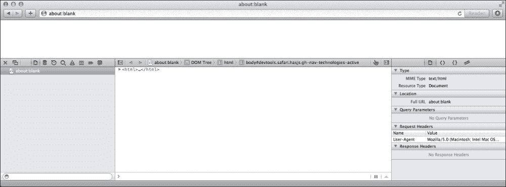

此外，Safari 可以通过扩展来增强，尽管其选择不如 Firefox 丰富。Safari 扩展可以在[`extensions.apple.com`](https://extensions.apple.com)找到。

## Internet Explorer

在企业应用开发开发者工具的背景下，我们在此仅涵盖 Internet Explorer 9。Internet Explorer 9 内置了开发者工具来检查 DOM 并进行基本编辑。它还包括验证标记的工具、分析器和 HTTP 嗅探器。要查看开发者工具，请点击**工具**然后点击**F12 开发者工具**。开发者工具应出现在窗口底部，如下面的截图所示：

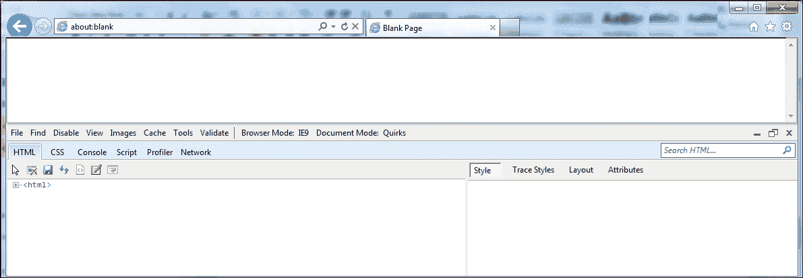

开发者工具还包括两个额外功能：**浏览器模式**和**文档模式**。**浏览器模式**功能允许您选择 Internet Explorer 的版本，而**文档模式**允许您选择在渲染页面时使用哪种渲染引擎模式。这里的区别在于**浏览器模式**设置默认的**文档模式**以及网络浏览器如何向服务器标识自己，而**文档模式**可以通过设置 X-UA-Compatible `meta` 标签来更改；例如，要模拟 Internet Explorer 8 的行为，我们可以使用以下标签：

```js
<meta http-equiv="X-UA-Compatible" content="IE=8">
```

## Opera

Opera 作为一个研究项目始于 1994 年，于 1996 年首次发布，版本号为 2.0。从那时起，它在多年中稳步增长，尽管它没有像 Google Chrome 那样经历爆炸性增长。尽管如此，它在乌克兰和白俄罗斯等国家被广泛使用，并被认为是市场上的主要网络浏览器之一。

Opera 使用自己的渲染引擎，称为 Vega，以及自己的 JavaScript 引擎，称为 Carakan。它还自带开发者工具，称为 Opera Dragonfly。Dragonfly 包含 DOM 和 CSS 检查器以及 JavaScript 控制台和性能分析器。要查看 Dragonfly，请右键单击网页上的任何位置，然后单击**检查元素**，或者单击**查看**，然后导航到**开发者工具** | **Opera** **Dragonfly**；我们应该会看到一个类似于以下截图中的代码检查器：

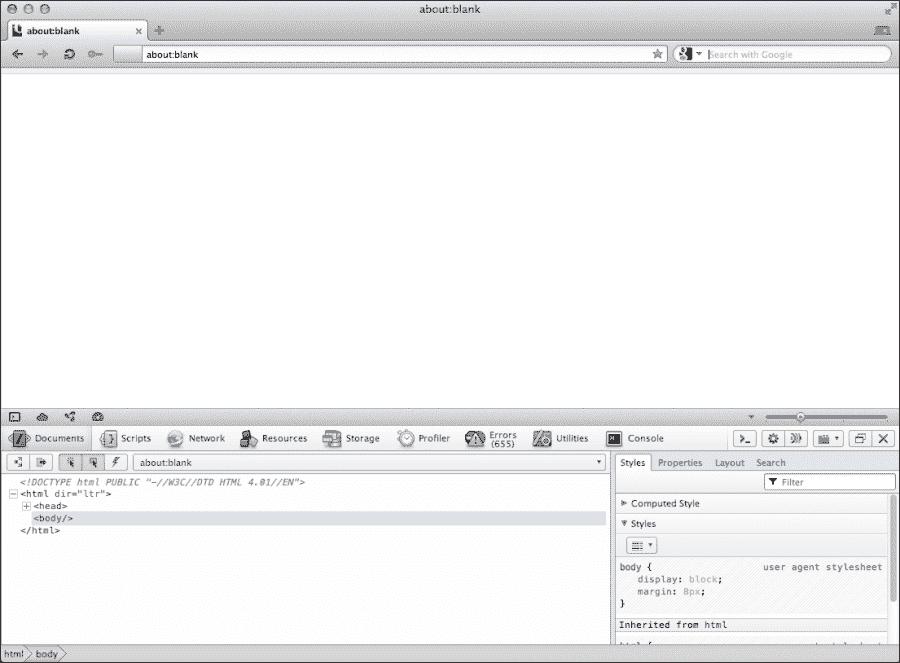

# HTTP 代理

网页代理可以用来捕获从您的网络浏览器到服务器的 HTTP 流量，以低级别地查看与服务器通信的方式以及返回的数据。尽管 HTTP 代理的使用将在我们讨论调试时更深入地介绍，但熟悉这些工具是有用的。

## Charles

Charles 是一个广泛使用的网页代理，拥有 Windows、Mac OS 和 Linux 版本。它包括许多有用的功能，如带宽限制，您可以通过模拟较低带宽的连接来查看您的应用程序在有限连接性下的性能。它还可以用作反向代理，其中它充当中间人并重定向它捕获的流量。这对于调试不支持使用网页代理的设备（如苹果 iPad）上的网页应用程序非常有用。

更多关于 Charles 的信息可以在 [`www.charlesproxy.com/`](http://www.charlesproxy.com/) 找到。

## Fiddler

Fiddler 是一个专门为 Windows 系统构建的网页代理，需要 .NET Framework 版本 2.0 或更高版本。它包含多个插件，允许您扩展其功能，包括语法高亮和流量差异，后者可以比较两个流量配置文件。

更多关于 Fiddler 的信息可以在 [`www.fiddler2.com/`](http://www.fiddler2.com/) 找到。

# 摘要

在本章中，我们介绍了任何企业级应用网络开发所需的各类工具，包括编辑器、集成开发环境（IDE）、网络服务器、网络浏览器和 HTTP 代理。

虽然市面上有许多工具可以帮助您开始 HTML5 企业级应用开发，但了解它们的使用方法非常重要。此外，了解您的需求并找到符合这些需求的工具也同样重要。正如他们所说，“责怪工具的工匠是拙劣的”。

在下一章中，我们将一头扎进我们的 MovieNow 应用，从结构和语义开始。我们将讨论页面的整体布局、所需的语义标签，并介绍如响应式网页设计等技术，这些技术将决定我们的应用在不同设备上的外观。
