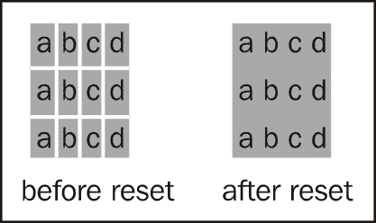
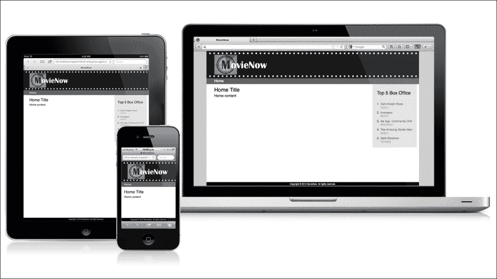

# 第三章. 应用：结构和语义

现在我们已经介绍了一些有用的工具和关键思想，我们可以开始我们的企业应用案例研究：MovieNow。

本章将涵盖 HTML 页面结构的主要方面，应用 HTML5 语义标签的正确使用。此外，我们还将介绍微数据的使用以及**搜索引擎优化**（**SEO**）的最佳实践。最后，我们将介绍**响应式网页设计**（**RWD**）的概念，作为一种支持移动开发的技巧，讨论其中的优缺点以及替代方案。到本章结束时，我们将拥有一个具有基本样式的 HTML 页面，但其布局可以很容易地被任何具有基本 HTML 理解能力的网络开发者阅读。

本章涵盖的主要内容包括：

+   理解页面结构

+   元数据

+   微数据

+   网站图标和图标

+   CSS3 重置

+   固定底部

+   通用样式

+   响应式网页设计和自适应网页设计

# 理解页面结构

由于我们在**前言**中已经向您介绍了语义标签和页面元素，我们现在将把那些知识付诸实践，并深入探讨每个标签的意义和使用，同时遵循我们 HTML5 企业应用构建的自然顺序。

网络应用的一个常见布局如下：


任何 HTML 文件的核心结构包括一个`DOCTYPE`声明，一个`html`根节点，以及`body`和`head`标签：

```js
<!DOCTYPE html>
<html lang="en">
<head>
</head>
<body>
</body>
</html>
```

从这一点开始，我们可以以任何我们想要的方式定义布局。通常，但并非总是，一个页面将包含一个指定公司或产品标志和一些文本的页眉部分，一个包含版权信息和一些链接到更多信息的页脚部分（如条款和条件），一个包含链接到每个部分的导航区域，以及内容区域。在 HTML5 之前，我们通常会使用`class`属性或通用 HTML 标签（如`div`和`span`标签）的`id`属性来定义部分。然而，HTML5 通过提供预定义标签来简化了这一点，用于这些标准部分。现在，我们可以使用`<header>`来包含主要导航和/或初始内容，使用`<footer>`来包含版权信息和替代导航内容，使用`<nav>`来定义导航区域，以及使用`<section>`来定义其他内容容器。这使我们能够从站点到站点标准化我们的内容。

以下是我们可以使用 HTML5 标签定义页面语义的一种方法：

```js
<!DOCTYPE html>
<html lang="en">
<head>
  <title>MovieNow</title>
</head>
<body>
  <header>MovieNow</header>
  <nav></nav>
  <section><section>
  <footer>
    Copyright &copy; 2012 MovieNow. All rights reserved.
  </footer>
</body>
</html>
```

### 提示

我们可以在一个 HTML 页面中拥有任意数量的`header`和`footer`标签，只要它们位于不同的容器中。这听起来可能不太直观，但当你将每个容器视为一个独立于兄弟内容的相关内容逻辑组时，它就有意义了。

作为一般规则，当我们有多个`header`和`footer`标签时，它们应该包含在`body`、`article`和`section`标签中。尽管在语义标签的位置上没有技术限制，但我们应保持一种便于网络开发人员和搜索引擎爬虫阅读的结构。

为了添加主要内容，我们可以在我们的`section`标签中放置一个`article`标签。在其中，我们可以放置一个`h1`标签作为主要标题，以及一个`p`标签作为每个段落。生成的 HTML 看起来如下：

```js
<section>
  <article>
    <h1>Home Title</h1>
    <p>Home content</p>
  </article>
</section>
```

## 导航列表

无序列表通常是表示网站导航的接受方式，因为它们具有一致的语义结构。因此，在我们的主要`nav`标签中，我们可以使用一个嵌入了列表元素（`li`）的无序列表`ul`：

```js
<ul>
  <li><a href="index.html">Home</a></li>
</ul>
```

## 二级内容

为了最终确定我们的主结构，我们需要一个侧边栏，该侧边栏将显示前五部票房电影。由于这个部分将作为主要内容的辅助内容，我们将使用`aside`标签。在`aside`标签内部，我们将放置一个带有`h2`标签的标题。我们使用`h2`而不是`h1`，因为这代表了页面内容整体大纲的下一级。为了表示电影列表，数字顺序很重要，这意味着最好的结构是使用有序列表。

结果应该看起来像以下代码：

```js
<aside>
  <h2>Top 5 Box Office</h2>
  <ol>
    <li
      <h3>Dark Knight Rises</h3>
      <p>Action</p>
    </li>
    <li>
      <h3>Avengers</h3>
      <p>Action</p>
     </li>
     <li>
       <h3>Ice Age: Continental Drift</h3>
       <p>Animation</p>
     </li>
     <li>
       <h3>The Amazing Spider-Man</h3>
       <p>Action</p>
     </li>
     <li>
       <h3>Dark Shadows</h3>
       <p>Comedy</p>
    </li>
  </ol>
</aside>
```

目前不必担心内容。现在，我们将使用示例数据来演示页面结构。在后面的章节中，我们将用来自网络服务的数据填充这个部分。

# 元数据

到目前为止，我们一直在使用 HTML5 语义标签构建 MovieNow 应用程序的主结构；然而，关于语义标签在 SEO 中效果的一个常见误解是，使用语义标签并不一定意味着更高的搜索引擎排名。尽管如此，它们简化了网络爬虫对内容的分析，这些爬虫会将流量带到你的应用程序，以进行与语义内容相关的特定搜索。本质上，它们使你的应用程序更像一本开放的书。

作为理论上的例子，如果内容被包含在一个具有语义意义的`article`标签中，那么网络爬虫将更容易确定特定页面中最重要内容，而不是被包含在一个没有语义意义的`div`标签中。

为了提供搜索引擎数据，将页面内容与将不可避免地带来人们访问你的网站或应用程序的搜索查询相连接，元标签是一个完美的解决方案。元标签存储有关网页的信息——称为*元数据*——这些信息对最终用户来说不一定可见（除非你揭示了页面源代码）。我们可以指定尽可能多的元标签。搜索引擎的网络爬虫通常会查看这些元标签以获取有关页面内容的更多信息，这些信息无法通过显示内容本身确定。

Meta 标签包含在`head`标签中，其内容类型由属性`name`定义，内容由属性`content`定义。以下是一些最常见的元标签：

```js
<head>
  <title>MovieNow</title>
 <!-- Charset Encoding -->
  <meta charset="utf-8" />
 <!-- Description of MovieNow -->
  <meta name="description" content="Your movie theater finder" />
  <!-- Author or Authors of MovieNow -->
  <meta name="author" content="Me" />
  <!-- Keywords (recognized by certain search engines -->
  <meta name="keywords" content="movie, hollywood" />
  <!-- Copyright information -->
  <meta name="copyright" content="Copyright &copy; 2012 MovieNow. All rights reserved." />
</head>
```

通常，搜索引擎结果将显示来自`title`标签的主要链接文本和出现在`meta`标签下方的描述，该标签具有`name="description"`属性。例如，当我们搜索“电影”这个词时，我们将在搜索结果中找到[fandango.com](http://fandango.com)：


如果我们通过查看源代码来检查[fandango.com](http://fandango.com)上的代码，我们可以在`head`标签中看到以下内容：

```js
<meta http-equiv="X-UA-Compatible" content="IE=Edge;chrome=1" >  <meta name="viewport" content="width=980">
<title>Movie Tickets &amp; Movie Times - Fandango.com</title>   
<meta name="robots" content="noydir,noodp" id="MetaRobot" />
<meta name="description" content="Buy movie tickets in advance, find movie times, watch trailers, read movie reviews, and more at Fandango." />

```

您甚至可以定义自己的元标签。搜索引擎可能会忽略它们，因为它们可能不知道它们，但它们可能对提供特定数据给其他开发者或您可能想要编写的其他应用程序非常有用。

### 注意

根据 http://googlewebmastercentral.blogspot.com/2009/09/google-does-not-use-keywords-meta-tag.html，谷歌不将`keywords`元标签考虑在内；相反，它使用`description`和其他标签，结合一系列特定的谷歌搜索引擎元标签。SEO 专家建议将关键词放在`title`标签、URL 和`H1`标签中。

Meta 标签还通过允许网页开发者向网页浏览器告知网页的某些特性，提供额外的功能。

要防止页面自动翻译成客户端语言，您可以指定以下代码：

```js
<meta name="google" content="notranslate" /> 
```

要指导谷歌网络爬虫（也称为 Googlebots）的行为，指定以下代码：

```js
<meta name="googlebot" content="..., ..." /> 
```

要告诉搜索引擎爬虫是否检查页面的内容，指定以下代码：

```js
<meta name="robots" content="..., ..." />
```

使用`robots`元标签，您可以包含以下列表中的任何或所有内容，用逗号分隔：

+   **noindex**: 这将完全防止页面被索引

+   **nofollow**: 这可以防止搜索引擎跟踪页面内的链接

+   **noarchive**: 这可以防止搜索引擎显示页面的缓存链接

例如，以下元标签建议搜索引擎不要索引页面，并跟踪页面上的链接以进行进一步索引：

```js
<meta name="robots" content="noindex, nofollow" />
```

### 小贴士

根据每个搜索引擎的实现，元标签上声明的建议可能会被忽略。

如果您的企业应用在 Twitter 上被提及，您可以为 Twitter 添加新的元标签，这些标签将在有人通过 Twitter 分享（发布）指向您页面的链接时被 Twitter 解释以在 Twitter 流中显示。

要在通过推文引用您的页面时包含标题、描述和缩略图图像，您可以添加以下代码：

```js
<meta name="twitter:card" value="summary" />
```

对于与网站关联的 Twitter 账户，您可以添加以下代码：

```js
<meta name="twitter:site" value="@username" />
```

这些元标签为 Twitter 定义了某些数据，Twitter 可以使用这些数据来更详细地表达它提到的网页。有关元标签的更多信息，请参阅以下页面：

[`dev.twitter.com/docs/cards`](https://dev.twitter.com/docs/cards)

Facebook 也有它定义的元标签，用于表达关于网页资源的链接的元数据。有关 Facebook 元标签的更多信息，请参阅以下页面：

[`developers.facebook.com/docs/opengraphprotocol/`](http://developers.facebook.com/docs/opengraphprotocol/)

# 微数据

我们可以在页面级别定义元数据，但页面上的特定元素上的元数据怎么办？**微数据**为我们提供了答案。微数据是用于向 HTML 标签添加更多信息的 HTML 规范。

### 小贴士

一篇有趣的阅读材料，可以了解谷歌如何管理元数据和微数据，可以在[`support.google.com/webmasters/bin/answer.py?hl=en&answer=99170`](http://support.google.com/webmasters/bin/answer.py?hl=en&answer=99170)找到。

我们之前定义了 HTML5 语法用于电影列表。现在我们可以指定定义电影的每个标签的含义。首先，我们需要使用`itemscope`属性来识别项目或容器：

```js
<li itemscope>
  <h3>Dark Knight Rises</h3>
  <p>Action</p>
</li>
```

现在我们可以使用`itemprop`属性和定义内容类型的单词来指定内容类型，在这个例子中是`name`和`genre`：

```js
<li itemscope>
  <h3 itemprop="name">Dark Knight Rises</h3>
  <p itemprop="genre">Action</p>
</li>
```

在这里，我们需要依赖标准的重要性；虽然您可以按您喜欢的任何方式定义微数据，但目标是创建一种统一的方式来定义数据，以便任何网络爬虫或读取器实现都可以读取它。

假设我们决定以易于分析的方式定义 MovieNow 的微数据。我们需要与其他应用程序共享一个共同的模式。一个可能的解决方案是[schema.org](http://schema.org)：

> Schema.org 提供了一系列的方案，即 html 标签，网站管理员可以使用这些标签来标记他们的页面，以便主要搜索引擎识别。包括 Bing、Google、Yahoo!和 Yandex 在内的搜索引擎依赖于这种标记来改善搜索结果的显示，使人们更容易找到正确的网页。

使用此网站，我们只需要搜索所需的数据类型。搜索`movie`，我们得到一个包含电影模式的页面：[`schema.org/Movie`](http://schema.org/Movie)。


如您所见，列表中包括**name**和**genre**属性，因此我们只需要使用`itemtype`属性将模式添加到我们的容器标签中：

```js
<li itemscope itemtype="http://schema.org/Movie">
  <h3 itemprop="name">Dark Knight Rises</h3>
  <p itemprop="genre">Action</p>
</li>
```

任何使用此模式的系统都将识别我们的项目为电影以及相应的名称和类型。

### 小贴士

Google 提供了一个在线工具来测试网站的微数据。这个工具可以在[`www.google.com/webmasters/tools/richsnippets`](http://www.google.com/webmasters/tools/richsnippets)找到。

# Favicon 和图标

现在我们来谈谈描述性属性 `link` 的用途。随着我们开发应用程序，我们需要图标来代表我们的产品。这些图标不仅可以在我们的 HTML 内部显示，还可以在 iOS 浏览器标签、书签列表以及某些 Android 设备的首页图标中显示。

### 小贴士

所需的所有图像都位于我们示例文件中的 `img` 文件夹中。

favicon，或称收藏夹图标，是浏览器用来识别网站或网络应用程序的图像。通常，favicon 的大小为 16 x 16 像素，格式为 `.png`、`.gif`（包括动画 GIF）或 `.ico` – 最后一个是支持最广泛的文件格式。

### 小贴士

`ico` 文件格式是由微软 Windows 引入的，用于包含一个或多个不同大小和颜色深度的图像，这样它们可以根据应用程序的要求进行适当的缩放。其他非微软浏览器后来也采用了这种格式以保持兼容性。

要创建 favicon，我们可以使用市场上的任何图形编辑程序，例如 Adobe Photoshop 或 Fireworks。其他可能的解决方案包括网络工具，如**favicon.cc** ([`www.favicon.cc/`](http://www.favicon.cc/))。Favicon.cc 允许你上传一个图像并使用像素工具进行编辑；这将在下面的屏幕截图中展示：


虽然这是一个很好的工具，但它也有一些缺点，包括缺少图层和撤销/重做功能。

### 小贴士

当可能时，尽量将 favicon 导出为 `ico` 格式，除非你想要使用动画 GIF。请注意，`ico` 是一种文件格式本身，因此你需要使用图像编辑器并将其导出为 `ico` 格式。仅仅更改扩展名为 `ico` 是不起作用的。

要让应用程序知道你的 favicon，请在 `head` 标签内的 `link` 标签中指定名称、位置和/或格式，如下所示：

```js
<head>
  <title>MovieNow</title>
  <!-- Charset Encoding -->
  <meta charset="utf-8" />
  <!-- Description of MovieNow -->
  <meta name="description" content="Your movie theater finder" />
  <!-- Author or Authors of MovieNow -->
  <meta name="author" content="Me" />
  <!-- Keywords (recognized by certain search engines -->
  <meta name="keywords" content="movie, hollywood" />
  <!-- Copyright information -->
  <meta name="copyright" content="Copyright &copy; 2012 MovieNow. All rights reserved." />
  <!-- favico -->
 <link rel="shortcut icon" href="img/favicon.ico" type="image/x-icon" />
</head>
```

注意到 `rel` 属性的使用，用于识别图像与网页之间的关系，以及 `href` 属性的使用，用于指示图像的位置，以及 `type` 属性用于指定图像的 MIME 类型。结果你将在浏览器标签、地址栏和收藏夹/书签列表中看到一个图像。在 Mac 上的 Firefox 浏览器中，你将看到如下类似的屏幕截图：


### 注意

默认情况下，如果没有带有 `rel="shortcut icon"` 的 `link` 标签，网络浏览器将会在服务器根目录中寻找一个名为 `favicon.ico` 的文件作为你的 favicon。

自从版本 1.1.3 以来，iOS 设备允许您添加一个主屏幕图标作为移动网站或应用的快捷方式。为了为我们的企业应用添加图标，我们需要考虑这样一个事实：根据设备的不同，图标的大小有多种。对于在 Retina 显示技术之前的 iPhone/iPod，图标应该是 57 x 57 像素，而具有 Retina 显示技术的 iPhone/iPod 应该有 114 x 114 像素的图标。对于在 Retina 显示技术之前的 iPad，图标应该是 72 x 72 像素，而具有 Retina 显示技术的 iPad 应该是 144 x 144 像素。

这里我们可以看到常规显示（左）和 Retina 显示（右）之间的区别：


如果在 `head` 中没有指定图标，iOS 设备将尝试查找图标。否则，图标将是应用屏幕截图的一部分。

例如，如果您有一个没有 Retina 显示的 iPod，它将尝试在根目录中查找一个具有以下文件名的图标，按照以下列表向下查找：

1.  `apple-touch-icon-57x57-precomposed.png`.

1.  `apple-touch-icon-57x57.png`.

1.  `apple-touch-icon-precomposed.png`.

1.  `apple-touch-icon.png`.

1.  通过截取屏幕截图并使用其一部分来生成图标。

Retina 显示设备可以使用与非 Retina 显示设备相同大小的图像，但质量会差得多，在某些情况下，您可能会注意到一些像素化。

在我们的企业应用中，我们将使用 `head` 标签内的 `link` 标签为每种情况指定图标。在 `link` 中声明 iOS 图标的做法是使用 `rel` 属性中的 `apple-touch-icon`，`href` 属性中的图标路径，最后在 `sizes` 属性中指定大小：

```js
<link rel="apple-touch-icon" href="img/touch-icon-iphone-rd.png" sizes="114x114" />
```

考虑到所有设备，我们应该有一个类似以下代码的样式：

```js
<head>
  <title>MovieNow</title>
  <!-- Charset Encoding -->
  <meta charset="utf-8" />
  <!-- Description of MovieNow -->
  <meta name="description" content="Your movie theater finder" />
  <!-- Author or Authors of MovieNow -->
  <meta name="author" content="Me" />
  <!-- Keywords (recognized by certain search engines -->
  <meta name="keywords" content="movie, hollywood" />
  <!-- Copyright information -->
  <meta name="copyright" content="Copyright &copy; 2012 MovieNow. All rights reserved." />
  <!-- favico -->
  <link rel="shortcut icon" href="img/favicon.ico" type="image/x-icon" />
  <!-- Apple iOS icons -->
 <!—- iPhone 57x57 -->
 <link rel="apple-touch-icon" href="img/touch-icon-iphone.png" />
 <!—- iPad 72x72 -->
 <link rel="apple-touch-icon" href="img/touch-icon-ipad.png" sizes="72x72" />
 <!—- iPhone Retina Display 114x114 -->
 <link rel="apple-touch-icon" href="img/touch-icon-iphone-rd.png" sizes="114x114" />
 <!—- iPad Retina Display 144x144 -->
 <link rel="apple-touch-icon" href="img/touch-icon-ipad-rd.png" sizes="144x144" />
</head>
```

默认情况下，iOS 会为图标添加圆角和反射光泽效果，但我们可以使用 `apple-touch-icon-precomposed` 而不是 `apple-touch-icon` 作为 `rel` 值来移除反射光泽。


上一张图片显示了我们的原始图像、默认的反射光泽效果图标以及没有反射光泽效果的图标之间的区别。在我们的示例文件中，我们使用了一个非反射版本，因为我们想更详细地展示原始图像。然而，这通常只是一个设计细节。

# CSS3 重置

现在我们已经有了整体页面结构，我们准备开始为我们的企业应用添加一些样式。在用 CSS 进行样式设计之前，将默认样式重置为在所有浏览器中具有相同的初始条件是一个好习惯。如果您已经知道如何声明 CSS 重置样式，您可以跳过这一部分，继续到 *响应式网页设计和适应性网页设计* 部分。

CSS 重置定义了一组初始样式，用于移除或标准化浏览器默认值的一些属性，例如边距、填充等。CSS 重置有几种版本；最常见的是**Yahoo 用户界面**（**YUI**）CSS 重置（[`developer.yahoo.com/yui/reset/`](http://developer.yahoo.com/yui/reset/)）、HTML5 Doctor 重置（[`html5doctor.com/html-5-reset-stylesheet/`](http://html5doctor.com/html-5-reset-stylesheet/)）、Nicolas Gallagher 的 normalize.css（[`necolas.github.com/normalize.css/`](http://necolas.github.com/normalize.css/)）和 Eric Mayer 的重置（[`meyerweb.com/eric/thoughts/2011/01/03/reset-revisited/`](http://meyerweb.com/eric/thoughts/2011/01/03/reset-revisited/)）。

我们将借鉴 Eric Mayer 的重置和 YUI 的重置来构建我们自己的。首先，我们需要创建一个 CSS 文件。将其命名为`styles.css`，并将其保存在应用程序根目录下的`css`文件夹中。

为了让 HTML 文件识别并应用，我们必须使用带有属性`rel="stylesheet"`、`type="text/css"`和`href`指向我们的 CSS 文件的`link`标签来导入文件：

```js
<link rel="stylesheet" href="css/styles.css" type="text/css" />

```

我们还将导入`modernizr`，为旧浏览器添加 HTML5 标签支持并检测浏览器功能。`head`标签应如下所示：

```js
<head>
  <title>MovieNow</title>
  <!-- Charset Encoding -->
  <meta charset="utf-8" />
  <!-- Description of MovieNow -->
  <meta name="description" content="Your movie theater finder" />
  <!-- Author or Authors of MovieNow -->
  <meta name="author" content="Me" />
  <!-- Keywords (recognized by certain search engines -->
  <meta name="keywords" content="movie, hollywood" />
  <!-- Copyright information -->
  <meta name="copyright" content="Copyright &copy; 2012 MovieNow. All rights reserved." />
  <!-- favico -->
  <link rel="shortcut icon" href="img/favicon.ico" type="image/x-icon" />
  <!-- Apple iOS icons -->
  <!—- iPhone 57x57 -->
  <link rel=" apple-touch-icon-precomposed" href="img/touch-icon-iphone.png" />
  <!—- iPad 72x72 -->
  <link rel=" apple-touch-icon-precomposed" href="img/touch-icon-ipad.png" sizes="72x72" />
  <!—- iPhone Retina Display 114x114 -->
  <link rel=" apple-touch-icon-precomposed" href="img/touch-icon-iphone-rd.png" sizes="114x114" />
  <!—- iPad Retina Display 144x144 -->
  <link rel=" apple-touch-icon-precomposed" href="img/touch-icon-ipad-rd.png" sizes="144x144" />
  <!-- Cascade Style Sheet import -->
  <link rel="stylesheet" href="css/styles.css" type="text/css" />
 <script src="img/modernizr.js" type="text/javascript"></script>
</head>
```

在`styles.css`中，我们将开始重置空间和字体样式。基本的间距涉及`margin`和`padding`属性，正如您在图中看到的：


对于这些属性（以及`border`属性），我们可以以几种方式设置样式。

## 单个边

您可以将上、右、下、左的`margin`设置为`0`，如下所示：

```js
margin-top:0;
margin-right:0;
margin-bottom:0;
margin-left:0;
```

由于我们使用的是`0`作为值，所以我们不需要指定单位（%或 px）。您可以将相同的做法应用于填充和边框。

## 缩写

一种最佳实践是将`margin`属性声明在一个块中。这被称为**缩写**。`margin`和`padding`的缩写语法从`top`属性开始，然后以顺时针方向跟随其他属性：

```js
margin:top right bottom left;
```

我们可以指定仅两个值：

```js
margin:value-1 value-2;
```

这与以下相同：

```js
margin:value-1 value-2 value-1 value-2;
```

或者只使用一个值：

```js
margin:value-1;
```

这等同于：

```js
margin:value-1 value-1 value-1 value-1;
```

我们还需要重置`outline`和`border`，所以把所有这些都放在一起，我们应该有以下内容：

```js
margin:0;
padding:0;
border:0;
outline:0;
```

### 小贴士

边框的缩写可以包括颜色和样式。例如，`border:5px solid blue;`。

此外，我们还需要确保在浏览器中保持文本处理的标准化。一个避免在 Internet Explorer 中过度调整文本大小的修复方法是`font-size:100%;`。为了强制从父元素继承字体，我们可以使用缩写`font:inherit`。然而，为了避免与 Internet Explorer 6 和 7 的问题，我们必须使用 CSS 属性`font-weight`、`font-style`和`font-family`。

要使用元素与其父元素的基线设置垂直对齐，我们声明`vertical-align:baseline`。

到目前为止，我们的重置如下所示：

```js
html, body, div, span, applet, object, iframe,
h1, h2, h3, h4, h5, h6, p, blockquote, pre,
a, abbr, acronym, address, big, cite, code,
del, dfn, em, img, ins, kbd, q, s, samp,
small, strike, strong, sub, sup, tt, var,
b, u, i, center,
dl, dt, dd, ol, ul, li,
fieldset, form, label, legend,
table, caption, tbody, tfoot, thead, tr, th, td,
article, aside, canvas, details, figcaption, figure, 
footer, header, hgroup, menu, nav, section, summary,
time, mark, audio, video{
   margin:0;
   padding:0;
   border:0;
   outline:0;
   font-size:100%;
   font-weight: inherit;
   font-style: inherit;
   font-family: inherit;
   vertical-align:baseline;
}
```

默认情况下，表格单元格之间有分隔。为了避免这种情况，我们可以使用 `border-collapse:collapse` 和 `border-spacing:0` 重置 `table` 样式。



重置样式应如下所示：

```js
table{
   border-collapse:collapse;
   border-spacing:0;
}
```

我们需要清除 `font` 样式和权重，因为在某些浏览器中，一些标签会应用特殊的样式，例如粗体和斜体：

```js
address,caption,cite,code,dfn,em,strong,th,var{
   font-style:normal;
   font-weight:normal;
}
```

为了从有序（`ol`）和无序列表（`ul`）中移除标记，我们可以将 `list-style` 属性设置为 `none`：

```js
ol, ul{
   list-style:none;
}
```

为了将主 HTML5 标签设置为块级框并避免浏览器之间的不一致：

```js
article, aside, details, figcaption, figure, 
footer, header, hgroup, menu, nav, section{
    display:block;
}
```

要从标签中移除引号，对于长引用（`blockquote`）和短引用（`q`）：

```js
blockquote, q{
   quotes:none;
}
```

为了确保引号在所有浏览器中都能真正消失：

```js
blockquote:before, blockquote:after,
q:before, q:after {
  content:'';
  content:none;
}
```

记住，`outline` 在元素获得焦点时使用，因此我们需要使用 `:focus` 选择器重新定义或取消它，使用 `0`。在这种情况下，我们重新定义了一条 1 像素的虚线灰色线：

```js
:focus{
  outline:1px dotted #666;
}
```

看起来这是一个简单的重置需要很多代码，但其中大部分是浏览器实现不一致的结果。重置提供了一个公平的竞技场，我们可以在此基础上构建我们的应用程序。

# 粘性页脚

CSS 粘性页脚布局允许即使在没有足够内容将其推下时，也能将页脚保持在页面底部。如果内容超过了页面高度，我们的页脚将移动到滚动末尾。

到目前为止，我们的企业应用程序应如下截图所示：


我们希望页脚固定在页面底部。为了实现这一点，有几种实现方式。我们将遵循最常见的一种实现方式，它包括两个容器和一个为我们的 `footer` 预留空间的 `.push` 元素：


首先，我们将向当前结构添加一些标签：一个带有 `wrapper` 类的 `section` 标签，以将所有标签与页脚分开，一个带有 `main` 类的 `div` 标签，以包含同一级别的页面标签，最后是一个带有 `push` 类的 `div` 标签，在包装部分内部创建空间，允许 `footer` 在 `wrapper` 类之上：

```js
<body class="no-js">
  <section class="wrapper">
 <div class="main">
      <header>MovieNow</header>
      <nav>
        <ul>
          <li><a href="index.html">Home</a></li>
        </ul>
      </nav>
      <aside>
        <h2>Top 5 Box Office</h2>
        <ol>
          <li itemscope itemtype="http://schema.org/Movie">
            <h3 itemprop="name">Dark Knight Rises</h3>
            <p itemprop="genre">Action</p>
          </li>
          <li itemscope itemtype="http://schema.org/Movie">
            <h3 itemprop="name">Avengers</h3>
            <p itemprop="genre">Action</p>
          </li>
          <li itemscope itemtype="http://schema.org/Movie">
            <h3 itemprop="name">Ice Age: Continental Drift</h3>
            <p itemprop="genre">Animation</p>
          </li>
          <li itemscope itemtype="http://schema.org/Movie">
            <h3 itemprop="name">The Amazing Spider-Man</h3>
            <p itemprop="genre">Action</p>
          </li>
          <li itemscope itemtype="http://schema.org/Movie">
            <h3 itemprop="name">Dark Shadows</h3>
            <p itemprop="genre">Comedy</p>
          </li>
        </ol>
      </aside>
      <section>
        <article>
          <h1>Home Title</h1>
          <p>Home content</p>
        </article>
      </section>
    <div>
 <div class="push"></div>
 </section>
  <footer>Copyright &copy; 2012 MovieNow. All rights reserved.</footer>
</body>
```

现在我们来设置我们的结构样式。

我们需要扩展 `html`、`body` 和 `.wrapper` 的高度。

```js
html, body, .wrapper {
  height: 100%;
}
```

然后，我们需要为了兼容性原因添加 `height:auto` 和 `min-height`，以及 `overflow:hidden` 以在内容内部（可以浮动）增长时扩展 `.wrapper` 容器：

```js
body > .wrapper{
  height:auto;
  min-height:100%;
  overflow:hidden;
}
```

我们可以将 `overflow` 应用于 `.main` 以扩展它：

```js
.main{
  overflow:hidden;
}
```

### 小贴士

应谨慎使用 `overflow:hidden` 技术来包围内容。它的最大缺点是隐藏了绝对定位且位于框外的绝对定位内容。一个替代方案是 Clearfix。在这种情况下，我们就不需要在 `.main` 和 `body > .wrapper` 中使用 `overflow:hidden`：

```js
body > .wrapper:after, .main:after {
  content:".";
  display:block;
  height:0;
  clear:both;
  visibility:hidden;
}
```

然后，我们可以将相同的高度分配给 `footer` 和 `.push`。两者将对齐，并且如果需要添加浮动元素，我们可以使用 `clear`：

```js
footer,.push{
  height:2.0em;
  clear:both
}
```

作为最后一步，我们为 `footer` 标签分配与 `height` 相同的负 `margin` 值，并出于兼容性原因设置 `position:relative`：

```js
footer{
  position:relative;
  margin-top:-2.0em;
}
```

# 通用样式

使用我们的粘性页脚，我们可以继续进行一些基本样式设置。我们可以设置整体字体家族：

```js
html,*{
  font-family:Helvetica,Arial, sans-serif; 
}
```

### 注意

关于通用选择器 `*` 的性能影响存在争议。虽然一些作者反对使用它，但其他人说 CSS 选择器在网页性能方面无关紧要。

为了将我们的前五名票房电影定位到右侧并设置其 `width` 属性：

```js
aside{
  float:right;
  width:200px;
}
```

让我们为我们的主要导航菜单添加背景颜色：

```js
nav{
  background-color:#666;
}
```

### 提示

注意，我们正在使用十六进制颜色的简写版本。

作为装饰，我们可以为 `header` 添加背景图像。默认情况下，它将平铺图像，除非我们指定 `no-repeat` 到我们的 `background` 属性。然后我们可以设置 `color` 和 `height`：

```js
header{
  color:#fff;
  height:122px;
  background:#1A1A1A url(../img/logo_back.png);
}
```

我们可以定义我们的 `footer` 的颜色，以及 `font`、`font-size`、`line-height`（以垂直居中文本）和 `text-align` 以水平居中文本：

```js
footer{
  background-color:#000;
  color:#fff;
  font-size:.6em;
  line-height:2em;
  text-align:center;
}
```

设置我们的 `wrapper` 背景颜色：

```js
.wrapper{
  background-color:#fff;
}
```

我们可以为我们的内容定义一个固定的 `width`，并使用 `auto` 为侧边距以居中容器标签：

```js
.wrapper,footer{
  width:960px;
  margin:0 auto;
}
```

我们在 `header` 标签内添加一个 `div` 标签来包含应用程序名称和标志：

```js
<header><div>MovieNow</div></header>
```

我们使用 `text-indent` 属性定义 `width`、`height` 和我们的标志图像，以隐藏 `div` 内的文字内容：

```js
header div{
  width:320px;
  height:122px;
  background:url(../img/logo.png);
  text-indent:-9999px;
}
```

使用 `-9999px` 在 `text-indent` 中将我们的文本移出可见区域。

### 提示

为了提高可访问性和 SEO 考虑，保持应用程序名称为文本是一种良好的实践。其他技术可以在[`css-tricks.com/css-image-replacement/`](http://css-tricks.com/css-image-replacement/)中查看。

设置每侧列的颜色：

```js
html,body{
  background-color:#ccc;
}
```

定义包装器填充：

```js
.wrapper section,nav{
  padding:5px 35px;
}
```

我们随后移除链接下划线，并将导航栏内所有链接的颜色设置为白色：

```js
nav a{
  color:#fff;
  text-decoration:none;
}
```

鼠标悬停时添加下划线：

```js
nav a:hover{
  text-decoration:underline;
}
```

改变标题的字体大小：

```js
article h1{
  font-size:1.5em;
  margin:10px 0 5px;
}
```

为我们的前五名列表添加颜色：

```js
aside{
  padding:30px 0 10px 0;
  margin:0 10px;
  background-color:#E4E4E4;
}
```

### 注意

内容属性允许您定义和增加一个变量：

+   `counter-reset:variable;` 将 `variable` 重置为 1

+   `counter-increment:variable;` 将 1 增加到 `variable`

+   `content:counter(variable);` 显示标签内 `variable` 的值

我们可以添加 `padding` 和一个 `counter` 变量来设置我们前五部电影上的数字：

```js
aside ol{
  padding:0 0 0 36px;
  counter-reset:counter;
}
```

我们可以使用我们的计数器 `content:counter(counter)`，使用 `counter-reset:counter;` 重置它，并使用 `counter-increment:counter` 增加它。然后我们可以添加一些间距并设置字体颜色：

```js
aside ol li:before {
  counter-increment:counter;
  content:counter(counter) ". ";
  margin-right:5px;
  color: #333;
  position:absolute;
  top:0;
  left:-16px;
}
```

### 提示

计数器属性在 Internet Explorer 7 中不受支持。Internet Explorer 8 仅在指定 `!DOCTYPE` 时支持它们。

您可以为 IE7 及之前版本包括条件 CSS 导入分配默认的有序列表管理：

```js
<!--[if lte IE 7]> 
  <link rel="stylesheet" href="css/ie7.css" type="text/css" />
<![endif]-->
```

其中 `ie7.css` 包含：

```js
ol{
  list-style:decimal;
}
```

添加更多间距，设置字体大小，并添加装饰性的虚线边框：

```js
aside h2{
  padding:0 20px 10px;
  margin:0 0 20px;
  border-bottom:1px dashed #fff;
  font-size:1.3em;
}
```

为电影类型设置不同的颜色：

```js
aside li p{
  color:#999;
}
```

最后，为电影标题添加 `color`：

```js
aside li{
  color:#666;
  font-size:.8em;
  line-height:1.2em;
  margin:0 0 8px 0;
  position:relative;
}
```

我们的应用程序现在结构化，看起来如下截图所示：


# 响应式网页设计和适应性网页设计

我们的应用正在成形，但是面对如此多的设备和屏幕分辨率，我们如何支持所有这些设备呢？

响应式网页设计是对这个问题的相当现代的回答。响应式网页设计是通过应用流体网格和媒体查询来适应观看环境而产生的。[`mediaqueri.es/`](http://mediaqueri.es/) 是一个关于如何在现实世界案例中应用响应式网页设计的说明性指南。

使用响应式网页设计，我们可以解决与环境多样性相关的大量问题。

例如，考虑以下我们可以解决可能出现的问题的方法：

+   控制在移动设备上访问网站时网站的大小

+   为视网膜显示屏设备提供高分辨率图像

+   根据使用的设备改变用户体验

在响应式网页设计中，媒体查询检测屏幕分辨率等条件，基于这些条件我们可以应用不同的样式。

媒体查询由指定媒体类型（`screen`、`print` 等）和一系列特性（`max-width`、`min-width`、`min-device-pixel-ratio` 等）组成。

例如：

```js
@media screen and (min-device-pixel-ratio: 2) and (max-device-width: 480px) {}
```

### 小贴士

对于语法的更详细解释，您可以访问 [`www.w3.org/TR/css3-mediaqueries/`](http://www.w3.org/TR/css3-mediaqueries/)。

以下是三种使用媒体查询的方法：

## 使用媒体查询导入 CSS 文件

可以使用媒体查询和 `head` 标签中的 `link` 标签来指定要导入的 CSS 文件。在以下示例中，当检测到视网膜显示屏并且设备屏幕宽度小于或等于 480 px 时，我们加载 `iphone4.css`：

```js
<link rel="stylesheet" type="text/css" href="iphone4.css" media=" screen and (-webkit-min-device-pixel-ratio: 2) and (max-device-width: 480px)" />
```

## 使用媒体查询从我们的主 CSS 中导入其他 CSS

我们可以使用 `@import` 在其他 CSS 文件中导入 CSS 文件。在这里，当检测到视网膜显示屏并且设备屏幕 `width` 小于或等于 480 px 时，我们可以加载 `iphone4.css`：

```js
@import url(iphone4.css) screen and (-webkit-min-device-pixel-ratio: 2) and (max-device-width: 480px);
```

## 在我们的主 CSS 中将媒体查询作为条件使用

这是使用最广泛的技术，它由 CSS 中的媒体查询作为条件组成。我们将使用这项技术为我们的应用程序定义一些媒体查询。

首先，我们为 `width` 在 738 px 和 1024 px 之间的设备定义特殊样式。这适用于今天市场上许多平板电脑。在这里，我们将移除空格并使用设备的完整宽度，将 `width` 设置为 `wrapper` 和 `footer` 的 `100%`：

```js
/** TABLETS **/
@media only screen and (min-width: 738px) and (max-width: 1024px){
  .wrapper,footer{
    width:100%;
  }
}
```

定义小于 737 px 宽度的设备案例：

```js
/** PHONES AND SMALL TABLETS **/
@media only screen and (max-width: 737px){
  aside{
    display:none
  }
  .wrapper,footer{
    width:100%;
  }
  .wrapper section,nav{
    padding:5px 15px;
  }
  header div{
    background-position:-50px 0px
  }
}
```

我们可以为像素比超过 2 的设备添加一个特殊案例，这是苹果视网膜显示屏设备的情况。在样式表中，我们使用我们标志的高清版本：

```js
/** RETINA DISPLAY IMAGES **/
@media only screen and (-webkit-min-device-pixel-ratio:2),
only screen and (min-device-pixel-ratio: 2){
  header div{
    background:url(../img/logo2x.png);
    -webkit-background-size: 320px 122px; 
  }
}
```

### 小贴士

虽然这种技术不会在需要 Retina 显示图像的 Safari 移动设备上下载我们的标志图像两次，但我们需要考虑其他情况。最好为每种情况定义一个媒体查询，而不是依赖于级联覆盖，这样我们可以避免加载相同的资产多次。您可以在以下链接中看到其他技术：

[`timkadlec.com/2012/04/media-query-asset-downloading-results/`](http://timkadlec.com/2012/04/media-query-asset-downloading-results/)

我们可以通过定义一些额外的样式来为 iPhone 和 iPad Retina 显示添加情况：

```js
/** IPAD RETINA DISPLAY SPECIFIC **/
@media only screen and (-webkit-min-device-pixel-ratio:2) and (min-device-width: 768px) and (max-device-width: 1024px),
only screen and (min-device-pixel-ratio: 2) and (min-device-width: 768px) and (max-device-width: 1024px){
 .wrapper,footer{
    width:100%;
  }
}
/** IPHONE RETINA DISPLAY SPECIFIC **/
@media only screen and (-webkit-min-device-pixel-ratio:2) and (max-device-width: 480px),
only screen and (min-device-pixel-ratio: 2) and (max-device-width: 480px){
}
```

在 iOS 设备中，缩放值从 100%以上的值开始。因此，我们需要在我们的`head`标签中添加一行来设置初始缩放为 100%：

```js
<meta name="viewport" content="width=device-width, initial-scale=1" />
```

### 小贴士

很遗憾，在切换横屏和竖屏方向时，存在一个缩放错误。多亏了 Scott Jehl，我们可以通过包含一个位于[`github.com/scottjehl/iOS-Orientationchange-Fix`](https://github.com/scottjehl/iOS-Orientationchange-Fix)的 JavaScript 库来解决此问题。

如果我们在移动设备上查看我们的应用程序，我们可以看到以下截图：


我们现在可以在多个设备和分辨率上拥有不同的视图：



使用媒体查询的这种方式的副作用之一是，如果您调整浏览器窗口的大小，您将看到不同的视图。另一种方法是使用 JavaScript 检测设备，并根据每种情况导入不同的 CSS 和 JavaScript 文件。这可能很麻烦。然而，您必须确定地考虑所有变体。

响应式网页设计是一种良好的自适应网页设计方法，其中应用程序的行为由设备的性能决定。

# 摘要

我们涵盖了应用程序的主要结构和基本样式，以及元数据和微数据。我们介绍了图标的使用和常见的 CSS 技术，如固定页脚。最后，我们通过实际应用，涵盖了响应式和自适应网页设计概念，这些应用可以适用于任何企业应用程序。

在下一章中，我们将介绍 HTML5 地理位置功能、AJAX 调用和 API 使用的应用。
