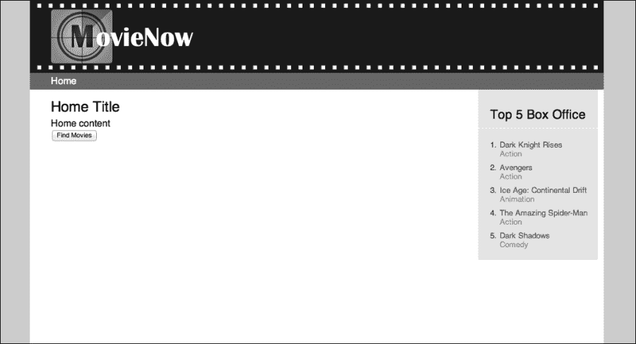
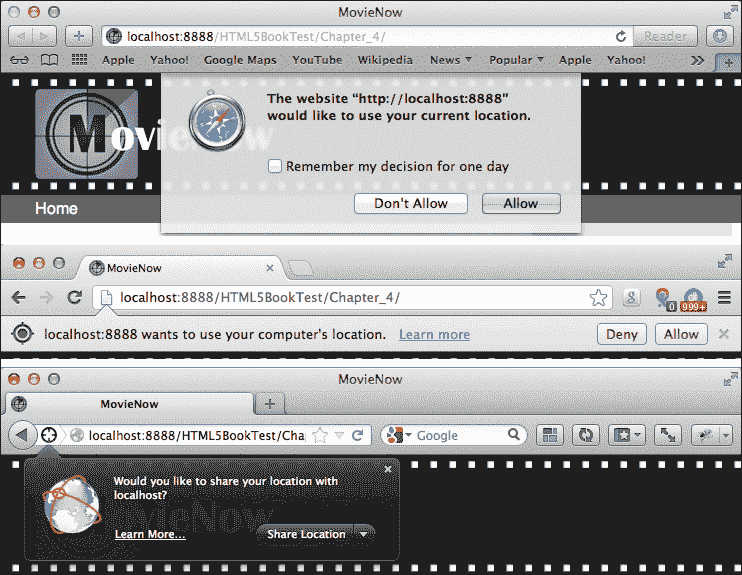
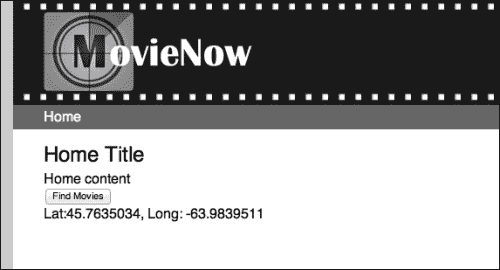
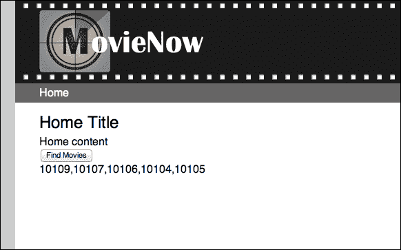
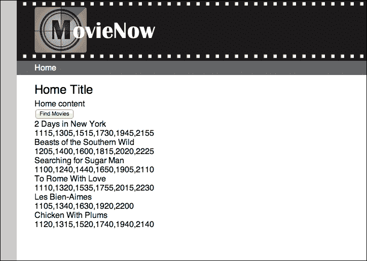

# 第四章：应用：通过地理位置获取电影

HTML5 引入了一种内置的能力，可以确定用户的位置。地理位置 API 定义了一个规范，用于使用 JavaScript 访问用于企业应用程序的位置数据。了解用户的位置对于显示与用户位置相关的新闻和服务非常有用。

我们 MovieNow 应用程序的第一个主要功能是根据地理位置数据找到用户附近的电影列表。我们将介绍地理位置 API 的工作原理，并介绍此功能的实现。由于这是我们第一个功能，我们还将介绍如何使用**异步 JavaScript 和 XML**（**AJAX**）进行请求。

我们将介绍以下主题：

+   如何工作

+   API

+   简单请求

+   附近的电影

# 如何工作

W3C 地理位置 API 规范仅定义了一个接口，通过该接口我们可以获取数据。地理位置数据从何而来以及如何到达则更多是实现的细节。在大多数移动设备上，GPS 通常内置，并通过卫星数据、WiFi 和 GSM/CDMA 基站位置的组合来收集。在桌面设备上，可以使用基于 IP 地址的 Wi-Fi 和地理位置。最后，Google 提供了一个由其 StreetView 数据驱动的地理位置服务。不用说，底层的实现细节不必让我们担心，但了解魔法是如何真正发生的总是好的。

支持以下浏览器：

+   Firefox 3.5+

+   Chrome 5.0+

+   Safari 5.0+

+   Opera 10.60+

+   Internet Explorer 9.0+

支持以下移动设备：

+   Android 2.0+

+   iPhone 3.0+

+   Opera Mobile 10.1+

+   Blackberry OS 6

# API

地理位置 API 相当简单，只提供了两种方法：`getCurrentPosition()` 和 `watchPosition()`。这些方法在 `navigator.geolocation` 命名空间下可用，非常相似，但以不同的方式提供设备位置的数据。`getCurrentPosition` 是一个一次性调用以获取地理位置数据，而 `watchPosition` 返回地理位置数据，并在设备位置改变时继续重新调用其回调，直到调用 `clearWatch` 方法。

两种方法都接受相同的三个参数：一个 `successCallback` 函数，一个 `errorCallback` 函数，以及一个包含以下属性的 `PositionOptions` 函数：

+   `boolean enableHighAccuracy`：这表示应检索最准确的数据，这可能会导致响应时间较慢。

+   `long timeout`：这表示在请求应该超时之前的最长毫秒数。

+   `long maximumAge`：这表示应返回不超过指定毫秒数的缓存内容。如果设置为 `0`，则始终返回新的位置数据。

两种方法也向 `successCallback` 函数返回一个 `Position` 对象，该对象包含以下属性：

+   `coords.latitude`：这表示十进制度数形式的纬度

+   `coords.longitude`: 这表示经度，以十进制度为单位

+   `coords.altitude`: 这表示相对于参考椭球的高度，以米为单位

+   `coords.accuracy`: 这表示纬度和经度的精度，以米为单位

+   `coords.altitudeAccuracy`: 这表示海拔的精度，以米为单位

+   `coords.heading`: 这表示设备相对于真北方向顺时针的行进方向，以度为单位

+   `coords.speed`: 这表示当前地面速度，以米/秒为单位

+   `timestamp`: 这表示获取位置时的日期和时间

最后，当调用`errorCallback`参数时，它将接收一个`PositionError`对象，该对象包括以下属性：

+   `code`: 这表示错误类型。这可以是以下值之一：`PERMISSION_DENIED`（`1`）、`POSITION_UNAVAILABLE`（`2`）和`TIMEOUT`（`3`）。

+   `message`: 这显示了错误的详细信息。

# 一个简单的请求

现在我们已经了解了地理位置 API 的机制，让我们来讨论一个实际请求。看看下面的代码片段：

```js
if (navigator.geolocation) {
    navigator.geolocation.getCurrentPosition(successCallback);
}
```

这是我们可以做的最基本调用。首先，由于地理位置信息不是所有设备都支持，我们必须小心避免由于不支持而导致的意外错误，这需要检查是否支持，这就是`if`语句的作用所在。其次，我们调用`getCurrentPosition`方法，传入一个`successCallback`函数。`successCallback`可以是我们在位置返回时想要调用的任何函数。注意缺少的`errorCallback`函数和选项参数。这些参数是严格可选的，尽管实现它们以应对意外错误条件是一种良好的实践。

# 你附近的电影

要开始将地理位置信息添加到我们的 MovieNow 企业应用程序中，我们首先需要对我们的页面进行一些调整，该页面我们在第三章中设置，即*应用：结构和语义*。在`article`标签中，我们将添加一个`button`标签和一个`div`标签：

```js
<article>
    <h1>Home Title</h1>
    <p>Home content</p>
    <button id="find-movies">Find Movies</button>
 <div id="movies-near-me">
 </div>
</article>
```

`button`标签将用于调用获取电影数据的行为，而`div`标签则是数据将显示的位置。如果一切顺利，你的屏幕应该显示一个标签为**查找电影**的按钮，如下面的截图所示：



接下来，你可能还记得在`index.html`底部包含的一些 JavaScript 引用。让我们再添加三个 JavaScript 引用。看看下面的代码片段：

```js
    <footer>Copyright &copy; 2012 MovieNow. All rights reserved.</footer>
    <script src="img/ios-orientationchange-fix.js"></script>
    <script src="img/jquery-1.8.0.min.js"></script>
    <script src="img/jquery.xdomainajax.js"></script>
 <script src="img/movienow.js"></script>
 <script src="img/movienow.geolocation.js"></script>
</body>
```

你可能已经注意到了`jquery.xdomainajax.js`的包含。这是 jQuery 库的一个扩展，允许进行跨域 AJAX GET 请求。回到 Netscape Navigator 2.0，浏览器已经实现了同源策略，这是一种安全预防措施，限制了来自一个站点的页面无法访问另一个站点的页面属性和方法。在当时这是有意义的，但随着日益流动的万维网，许多站点的内容可以“混合”成一个统一体验，这些边界已经不可避免地被绕过了。有许多解决方案，包括**带有填充的 JavaScript 对象表示法**（**JSONP**），它允许通过传递回调参数进行跨域 AJAX 请求，因此被调用的服务可以将结果 JSON 对象包装在作为回调传递的函数中。

### 小贴士

可以在[`github.com/padolsey/jQuery-Plugins/tree/master/cross-domain-ajax/`](https://github.com/padolsey/jQuery-Plugins/tree/master/cross-domain-ajax/)找到跨域 Ajax 库。这个库的所有功劳都归功于 James Padolsey。

接下来，我们将把跨域 Ajax 库添加到`js`文件夹中，然后在`js`文件夹中创建两个新文件：`movienow.js`和`movienow.geolocation.js`。在`movienow.js`中，我们将建立我们的根命名空间`movienow`。这将位于`global`或`window`作用域，这意味着它可以在任何地方访问。这就是我们可以根据需要向我们的企业应用程序添加核心功能的地方。一开始，我们这里需要的只有以下这一行，它设置了根命名空间：

```js
var movienow = {};
```

在`movienow.geolocation.js`中，我们将添加我们的地理位置特定功能。我们这样做的原因是为了确保我们在企业应用程序开发中遵循模块化方法。模块化迫使我们把功能分解成离散的、高度内聚的、松散耦合的部分。模块化允许我们改变企业应用程序的某些部分，而不会影响整体。这就像可拆卸电池的手机和电池焊接在手机里的手机之间的区别。如果电池坏了，模块化意味着更换损坏的部分与更换整个设备之间的区别。

## 自调用

我们将首先获取对我们已建立的命名空间的引用。这是一种良好的防御性做法，以防你的核心命名空间 JavaScript 文件发生任何问题。

```js
var movienow = movienow || {};
```

### 小贴士

注意，拥有这个声明并不是必须的，以包含我们的命名空间初始定义时所需的`movienow.js`文件。

接下来，我们将建立我们的地理位置命名空间：

```js
movienow.geolocation = (function(){})();
```

注意第二个括号。这种结构被称为立即调用的函数表达式（**IIFE**）。这是一种方便的简写方式，可以以模块化的方式注册和立即调用 JavaScript 代码。所有关于地理位置的属性和方法都将被封装在 `movienow.geolocation` 命名空间中，这使得在全局命名空间中的占用更小，代码更干净、更模块化。

## 那就变成了这个

在我们新建立的命名空间声明中，我们将做几件事情。首先，我们需要捕获对对象的引用。我们将通过添加以下行来实现：

```js
var that = this;
```

这可能看起来像一条有趣的话，但它的重要性将变得明显。JavaScript 中的 `this` 关键字是一个方便的函数，用于引用执行函数的所有者或函数是方法的对象。没有它，我们就需要在命名空间内的所有属性和方法前加上命名空间本身，当你想要更改命名空间时，这会变得很复杂。

以下说明了 `this` 关键字的价值：

```js
var myNamespace = {
  firstFunction: function() {
    document.write('firstFunction invoked.');
    myNamespace.secondFunction();
  },
  secondFunction: function() {
    document.write('secondFunction invoked.');
  }
};
myNamespace.firstFunction();
```

注意使用 `myNamespace` 来引用对象内的其他方法。我们可以用 `this` 来替换它，以便以更无差别的引用方式引用对象内的其他成员：

```js
var myNamespace = {
  firstFunction: function() {
    document.write('firstFunction invoked.');
    this.secondFunction();
  },
  secondFunction: function() {
    document.write('secondFunction invoked.');
  }
};
myNamespace.firstFunction();
```

不幸的是，当上下文改变时，`this` 也会改变。当我们在一个函数内部添加一个函数时，上下文将是外部函数的上下文：

```js
var myNamespace = {
  firstFunction: function() {
    document.write('firstFunction invoked.');
    var innerFunction = (function() {
 this.secondFunction();
 })();
  },
  secondFunction: function() {
    document.write('secondFunction invoked.');
  }
};
myNamespace.firstFunction();
```

在这里我们添加了 `innerFunction`，它调用了 `secondFunction`（注意立即调用的函数表达式）。然而，`secondFunction` 从未被调用。这是因为 `this` 的上下文已经改变为 `firstFunction` 的上下文。为了保持对 `myNamespace` 上下文的引用，我们只需声明一个变量并保留它：

```js
var myNamespace = {
  firstFunction: function() {
    document.write('firstFunction invoked.');
    var that = this;
    var innerFunction = (function() {
      that.secondFunction();
    })();
  },
  secondFunction: function() {
    document.write('secondFunction invoked.');
  }
};
myNamespace.firstFunction();
```

而这就是 `that` 变成 `this` 的地方。

## 获取位置

到目前为止，我们放在页面上的 **查找电影** 按钮是非功能的。点击它，什么也不会发生。我们将为该按钮添加一个事件处理程序，以便当你点击它时会发生一些事情。在 `movienow.geolocation` 对象内部添加以下内容：

```js
jQuery(document).ready(function(){  
    jQuery('#find-movies').click(function(){
       alert('Button clicked!');
    });
});
```

`movienow.geolocation.js` 文件现在应该看起来像以下代码：

```js
var movienow = movienow || {};
movienow.geolocation = (function(){
    var that = this;
    jQuery(document).ready(function(){  
        jQuery('#find-movies').click(function(){alert('Button clicked!');});
    });
})();
```

现在点击 **查找电影**。你应该会得到以下提示框：


这可能看起来很好，但我们的目标要高得多。我们想要获取一些位置数据。我们通过添加几个方法来实现：`getLocation` 和 `locationCallback`：

```js
this.getLocation = function(){
  if (navigator.geolocation) {
  navigator.geolocation.getCurrentPosition(this.locationCallback);
  }
};
this.locationCallback = function(loc){ 
  jQuery('#movies-near-me').html('Lat:' + loc.coords.latitude + ', Long: ' + loc.coords.longitude);
};
```

第一个函数当然是调用前面讨论过的 `getCurrentPosition` 方法的地方。第二个函数是 `successCallback`。我们现在可以移除 **查找电影** 按钮的事件处理程序中的提示框，并替换为以下内容：

```js
that.getLocation();
```

`movienow.geolocation.js` 文件现在应该看起来像以下代码：

```js
var movienow = movienow || {};
movienow.geolocation = (function(){
    var that = this;
    jQuery(document).ready(function(){  
        jQuery('#find-movies').click(function(){that.getLocation();});
    });
    this.getLocation = function(){
        if (navigator.geolocation) {
            navigator.geolocation.getCurrentPosition(this.locationCallback);
        }
    };
    this.locationCallback = function(loc){
      jQuery('#movies-near-me').html('Lat:' + loc.coords.latitude + ', Long: ' + loc.coords.longitude);
    };
})();
```

现在当你点击 **查找电影** 按钮时，将通过地理位置 API 发出位置数据请求。

网络浏览器通常会提示您允许跟踪您的物理位置。以下截图显示了 Safari、Chrome 和 Firefox 的示例。



这只会发生一次。当您点击**允许**时，浏览器将为指定的域名保存此设置。



您现在应该能在页面上看到纬度和经度。恭喜！您的企业应用程序现在知道您的位置了。

## 获取邮政编码

现在我们有了地理坐标，下一步是将它们映射到邮政编码。一旦我们有了邮政编码，我们就可以获取电影列表。为了获取邮政编码，我们需要向网络服务发送一个 AJAX 请求，发送纬度和经度，然后接收邮政编码。有许多网络服务提供这些数据。对于我们的 MovieNow 企业应用程序，我们将使用来自 [geonames.org](http://geonames.org) 的服务。

### 注意

GeoNames 地理数据库覆盖所有国家，包含超过八百万个可免费下载的地名。它采用 Creative Commons Attribution 3.0 许可。

[Geonames.org](http://Geonames.org) 提供了一个方便的名为 `findNearbyPostalCodesJSON` 的网络服务，用于获取邮政编码数据。此服务接受以下参数：

+   `lat`: 这指定了十进制度数形式的纬度

+   `lng`: 这指定了十进制度数形式的经度

+   `radius`: 这指定了半径（千米）

+   `maxRows`: 这指定了要返回的最大行数

+   `style`: 这指定了响应的详细程度（`SHORT`, `MEDIUM`, `LONG`, `FULL`）

+   `country`: 这指定了要查找的国家

+   `localCountry`: 当此参数设置为`true`时，只返回国家内的代码

+   `username`: 这是您访问数据的账户

以下是一个示例服务调用：

[`api.geonames.org/findNearbyPostalCodesJSON?lat=45&lng=-66.7&username=demo`](http://api.geonames.org/findNearbyPostalCodesJSON?lat=45&lng=-66.7&username=demo)

它返回以下 JSON 输出：

```js
{
  "postalCodes": [
    {
      "distance": "10.13582",
      "adminCode1": "NB",
      "postalCode": "E5H",
      "countryCode": "CA",
      "lng": -66.769962,
      "placeName": "Pennfield",
      "lat": 45.076588,
      "adminName1": "New Brunswick"
    }
  ]
}
```

您可以将此 URL 复制/粘贴到网络浏览器中，亲自查看。

### 小贴士

网络服务受到限制，意味着对于给定的用户名，每天只能服务一定数量的请求。这就是为什么您在继续之前应该在 [geonames.org](http://geonames.org) 上注册自己的账户。一旦这样做，就用您的用户名替换 `demo`。

现在我们有了将坐标映射到邮政编码的能力，我们需要发送一个 AJAX 请求来调用并检索数据。我们将使用 jQuery 来帮助我们进行请求。

## AJAX 不仅仅是一种清洁产品

代表异步 JavaScript 和 XML（Asynchronous JavaScript and XML），AJAX 是一种技术，通过使用 `XMLHttpRequest` 对象调用服务器以获取额外内容、保存状态、轮询资源等。这是一种在不刷新页面的情况下扩展页面功能的有用方式。

jQuery 库（[`jquery.com`](http://jquery.com)）使得在跨浏览器兼容的方式下进行 AJAX 请求变得相当简单直接。看看以下代码：

```js
jQuery.ajax({
  url: 'http://some-domain.com/some-web-service',
  data: 'q=something'
  success: function(payload){
    alert(payload);
  },
  error: function(error){
    alert(error.responseText);
  }
});
```

您只需设置 URL 和参数。您可以定义一个成功事件处理程序和一个错误事件处理程序。当 AJAX 请求成功完成并传递有效负载作为参数时，将调用成功处理程序。当 AJAX 请求返回除 200 状态码之外的内容时，将调用错误处理程序。

将以下代码片段添加到您的 `movienow.geolocation` 对象中：

```js
this.reverseGeocode = function(loc){
  jQuery.ajax({
    url: 'http://api.geonames.org/findNearbyPostalCodesJSON',
    data: 'lat=' + loc.coords.latitude + '&lng=' + loc.coords.longitude + '&username=demo', //Swap in with your geonames.org username
    success: function(payload){
      var data = that.objectifyJSON(payload);
      var postalCodes = [];
      for (var i=0; i<data.postalCodes.length; ++i) {
        postalCodes.push(data.postalCodes[i].postalCode);
      }
      jQuery('#movies-near-me').html(postalCodes.join(','));
    }
  });
};
this.objectifyJSON = function(json) {
  if (typeof(json) == "object") {
    return json;
  }
  else {
    return jQuery.parseJSON(json);
  }
};
```

### 小贴士

我们正在使用 `alert` 弹出窗口显示错误，但对于最终应用程序，我们应该定义一个 CSS 样式的 DOM 来显示通知和错误。

将 `locationCallback` 的内容替换为以下内容：

```js
that.reverseGeocode(loc);
```

当调用 `successCallback` 函数时，我们将获取 `Positon` 对象并将其传递给我们的 `reverseGeocode` 方法，该方法通过向 `geonames.org` 网络服务发出 AJAX 请求来检索设备的邮政编码。在 AJAX 请求的成功处理程序中，我们从 JSON 对象中提取邮政编码并将它们放入一个数组中。然后我们在页面上显示这个数组。注意 `objectifyJSON` 方法。我们这样做是因为一些浏览器会自动将有效负载数据打包成一个对象，而其他浏览器则将其视为一个字符串。

`movienow.geolocation.js` 文件现在应该看起来像以下代码：

```js
var movienow = movienow || {};
movienow.geolocation = (function(){
    var that = this;
    jQuery(document).ready(function(){  
        jQuery('#find-movies').click(function(){that.getLocation();});
    });
    this.getLocation = function(){
        if (navigator.geolocation) {
            navigator.geolocation.getCurrentPosition(this.locationCallback);
        }
    };
    this.locationCallback = function(loc){
        that.reverseGeocode(loc);
    };
    this.reverseGeocode = function(loc){
        jQuery.ajax({
            url: 'http://api.geonames.org/findNearbyPostalCodesJSON',
            data: 'lat=' + loc.coords.latitude + '&lng=' + loc.coords.longitude + '&username=demo', //Swap in with your geonames.org username
            success: function(payload){
                var data = that.objectifyJSON(payload);
                var postalCodes = [];
                for (var i=0; i<data.postalCodes.length; ++i) {
                    postalCodes.push(data.postalCodes[i].postalCode);
                }
                jQuery('#movies-near-me').html(postalCodes.join(','));
            },
            error: function(error){
                alert(error.responseText);
            }
        });
    };
    this.objectifyJSON = function(json) {
        if (typeof(json) == "object") {
            return json;
        }
        else {
            return jQuery.parseJSON(json);
        }
    };
})();
```

当您点击 **查找电影** 时，您应该看到以下内容，如截图所示：



## 从邮政编码到放映时间

现在我们有了邮政编码，我们可以将这些映射到电影放映时间。不幸的是，没有免费的网络服务可以从那里获取这类数据。然而，并非全无希望。[Moviefone.com](http://Moviefone.com) 提供基于邮政编码的馈送。但是有一个问题，由于跨域限制，我们无法轻松地通过 JavaScript 获取馈送数据。跨域 Ajax 库仅适用于返回 JSON 的服务。为了解决这个问题，我们可以创建一个代理。

创建一个名为 `movielistings.php` 的文件。将以下内容添加到您新创建的文件中：

```js
<?php 
   $zips = $_GET['zip'];
   $zips = explode(',', $zips);
   $listings = array();
   for ($i=0; $i<count($zips); $i++) {
        $listings[$i] = file_get_contents('http://gateway.moviefone.com/movies/pox/closesttheaters.xml?zip=' . $zips[$i]); 
       $listings[$i] = simplexml_load_string($listings[$i]);
   }
    echo json_encode($listings);
?>
```

这是一个简单的 PHP 文件，它根据查询字符串中传递的邮政编码字符串向 Moviefone.com 的最近影院馈送发出请求，并将输出转换为 JSON。要运行此文件，您需要确保您的机器上已安装 PHP。否则，我们可以轻松地使用 JSP、ASP.NET 或 Node.js 等编写类似的内容。

一旦我们有了我们的电影列表代理服务，我们可以在 `movienow.geolocation` 中添加以下内容：

```js
this.getShowtimes = function(postalCodes) {
    jQuery.ajax({
        url: 'movielistings.php',
        data: 'zip=' + postalCodes.join(','),
        success: function(payload){
            var data = that.objectifyJSON(payload);
            that.displayShowtimes(that.constructMoviesArray(data));
        },
        error: function(error){
            alert(error.responseText);
        }
    });
};
this.constructMoviesArray = function(data) {
    var key, movie, theater = null;
    var movies = {};
    movies.items = {};
    movies.length = 0;
    for (var j=0; j<data.length; ++j) {
        if (data[j].movie) {
            theater = data[j].theater;
            for (var i=0; i<data[j].movie.length; ++i) {
                movie = data[j].movie[i];
                key = movie.movieId + '|'+ theater.theaterId;
                if (!movies.items[key]) {
                    movie.theater = theater;
                    movies.items[key] = movie;
                    movies.length++;
                }
            }
        }
    }
    return movies;
};
this.displayShowtimes = function(movies) {
    var movie = null;
    var html = '';
    for (var item in movies.items) {
        movie = movies.items[item];
        html += '<p><strong>' + movie.title + '</strong><br />' + movie.showtime.join(',') + '</p>'; 
    }
    jQuery('#movies-near-me').html(html);
};
```

完成后，将 `reverseGeocode` 方法中填充 `#movies-near-me` 的那一行替换为以下代码：

```js
that.getShowtimes(postalCodes);
```

因此，我们增加了三个新方法：`getShowtimes`、`constructMoviesArray` 和 `displayShowtimes`。`getShowtimes` 方法向电影列表代理发送 AJAX 请求，获取返回的 JSON 数据，并调用 `constructMoviesArray` 提取相关数据并删除重复项，然后调用 `displayShowtimes` 显示数据。

最终的 `movienow.geolocation.js` 文件现在应该看起来像以下代码：

```js
var movienow = movienow || {};
movienow.geolocation = (function(){
    var that = this;
    jQuery(document).ready(function(){  
        jQuery('#find-movies').click(function(){that.getLocation();});
    });
    this.getLocation = function(){
        if (navigator.geolocation) {
            navigator.geolocation.getCurrentPosition(this.locationCallback);
        }
    };
    this.locationCallback = function(loc){
        that.reverseGeocode(loc);
    };
    this.reverseGeocode = function(loc){
        jQuery.ajax({
            url: 'http://api.geonames.org/findNearbyPostalCodesJSON',
            data: 'lat=' + loc.coords.latitude + '&lng=' + loc.coords.longitude + '&username=demo',
            success: function(payload){
                var data = that.objectifyJSON(payload);
                var postalCodes = [];
                for (var i=0; i<data.postalCodes.length; ++i) {
                    postalCodes.push(data.postalCodes[i].postalCode);
                }
                that.getShowtimes(postalCodes);
            },
            error: function(error){
                alert(error.responseText);
            }
        });
    };
    this.objectifyJSON = function(json) {
        if (typeof(json) == "object") {
            return json;
        }
        else {
            return jQuery.parseJSON(json);
        }
    };
    this.getShowtimes = function(postalCodes) {
        jQuery.ajax({
            url: 'movielistings.php',
            data: 'zip=' + postalCodes.join(','),
            success: function(payload){
                var data = that.objectifyJSON(payload);
                that.displayShowtimes(that.constructMoviesArray(data));
            }
        });
    };
    this.constructMoviesArray = function(data) {
        var key, movie, theater = null;
        var movies = {};
        movies.items = {};
        movies.length = 0;
        for (var j=0; j<data.length; ++j) {
            if (data[j].movie) {
                theater = data[j].theater;
                for (var i=0; i<data[j].movie.length; ++i) {
                    movie = data[j].movie[i];
                    key = movie.movieId + '|'+ theater.theaterId;
                    if (!movies.items[key]) {
                        movie.theater = theater;
                        movies.items[key] = movie;
                        movies.length++;
                    }
                }
            }
        }
        return movies;
    };
    this.displayShowtimes = function(movies) {
        var movie = null;
        var html = '';
        for (var item in movies.items) {
            movie = movies.items[item];
            html += '<p><strong>' + movie.title + '</strong><br />' + movie.showtime.join(',') + '</p>'; 
        }
        jQuery('#movies-near-me').html(html);
    };
})();
```

当你点击 **查找电影** 按钮时，你应该看到以下截图：



当然，我们还有更多数据要展示，但将在后面的章节中介绍。

# 摘要

在本章中，我们介绍了地理位置 API 的工作原理以及如何使用它。我们在企业应用中添加了一个按钮，并将其连接到地理位置 API 以发送请求。我们使用返回的 `Position` 对象的坐标向一个网络服务发送 AJAX 请求以获取这些坐标的邮政编码。使用邮政编码，我们向一个源请求电影放映时间数据，并在页面上显示这些数据。

在下一章中，我们将介绍在本章中为我们自己提供的大量数据。我们将更深入地介绍 CSS，并讨论 CSS3 中的新特性。我们甚至将构建一些巧妙的 CSS3 特效，使我们的企业应用看起来更有趣、更有吸引力。
