# 第五章。应用：通过 CSS3 显示电影数据

我们已经在第三章中添加了一些使用 CSS 的企业应用样式，*应用：结构和语义*，但我们还没有介绍使 CSS3 成为变革者的属性。在本章中，我们将遍历一些有用的 CSS3 属性和针对我们应用的实用实现，解释它们在任何 Web 应用中的范围。

每个示例都将展示对市场上最受欢迎的 Web 浏览器的支持（以及当需要时的回退）。

本章涵盖的主要主题如下：

+   回到浏览器的 babel 塔

+   CSS 魔法：为 MovieNow 添加更多样式（圆角、颜色、渐变、阴影、文本阴影）

+   电影和样式（过渡和动画）

+   在过渡和动画之间选择

+   使用媒体查询

+   应用 CSS3 选择器

# 回到浏览器的 babel 塔

每当你开始使用一个新的 CSS 属性时，检查支持该属性的浏览器列表是必要的。如果它被支持，你需要验证如何实现它，以及是否需要前缀或特殊形式，例如在 Internet Explorer 中的 `filter`。

以下是最常见的 CSS 属性前缀：

+   `-moz-` Firefox

+   `-webkit-` Safari、Safari iOS 和 Chrome

+   `-o-` Opera

+   `-ms-` Internet Explorer

当你没有任何属性的支持时，解决方案包括使用图像和移除一些视觉元素（遵循优雅降级并尽量避免移除功能）。

### 小贴士

我们可以使用像 Lea Verou 的 -prefix-free ([`leaverou.github.com/prefixfree/`](http://leaverou.github.com/prefixfree/)) 这样的 JavaScript 库来避免使用多个供应商前缀，但这可能会影响我们应用的性能。作为一般规则，CSS 几乎总是比 JavaScript（执行时间）更快，所以在性能方面，在样式表中多几行代码是值得的。

正如我们在第三章中看到的，*应用：结构和语义*，添加条件 CSS 导入是可能的。这项技术仅适用于 Internet Explorer，你可以使用以下语法来比较版本：

+   `lt`（小于）

+   `lte`（小于或等于）

+   `gt`（大于）

+   `gte`（大于或等于）

例如，如果你想为 Internet Explorer 7 及之前版本添加特定的 CSS 文件，可以使用以下声明：

```js
<!--[if lte IE 7]> 
  <link rel="stylesheet" href="css/ie7.css" type="text/css" />
<![endif]-->
```

将针对 Internet Explorer 的特定黑客和回退放在单独的样式表中是一种良好的实践，以实现清晰的编码并避免在其他浏览器中增加额外的加载时间。

### 小贴士

要添加对常见的 CSS3 功能，如 `border-radius` 和 `box-shadow` 的支持，你可以包含 CSS3 Pie ([`css3pie.com`](http://css3pie.com))，这是一个 JavaScript 库，它为 Internet Explorer 6 到 9 添加了这些功能的支持。

# CSS3 魔法 – 为 MovieNow 添加更多样式

让我们继续我们的电影应用程序开发。作为一个一般规则，您应该提前规划，换句话说，在开始与样式纠缠之前，应该有一个视觉设计。遵循此规则（并且最好有一个样式指南）的好处是，您的应用程序将反映统一的视觉身份。让我们开始为我们的企业应用程序中已知的一些元素添加样式。

我们移除了我们的**查找电影**按钮，以便稍后进行自动调用。

## 添加圆角

如果您必须使用 CSS1 和 CSS2 创建圆角，您应该知道可能的圆角解决方案有多么复杂。通常，它们涉及图像或影响企业应用程序性能的重量级 JavaScript 处理。

在 CSS3 中，我们有`border-radius`属性，允许我们指定元素的四个边框的圆角形状。

这个属性的语法如下：

```js
border-radius:top-left-radius top-right-radius bottom-right-radius top-left-radius;
```

您可以为每个角落指定`%`、`em`和`px`作为单位。

假设我们需要为我们的**Top 5 Box Office**部分的底部添加圆角。我们可以使用`border-radius`属性（以及每个浏览器的带前缀的等效属性），对于`top left`和`right`使用`0`，对于`bottom left`和`right`使用`8px`。

```js
aside{
  float:right;
  width:200px;
  padding:30px 0 10px 0;
  margin:0 10px;
  background-color:#E4E4E4;
 /** TOP 5 ROUNDED BORDER **/
 border-radius:0 0 8px 8px;
 -moz-border-radius:0 0 8px 8px;
 -webkit-border-radius:0 0 8px 8px;
 -o-border-radius:0 0 8px 8px;
}
```

应用此方法，我们可以看到原始 Box Office（左侧）和`border-radius`效果（右侧）之间的区别。

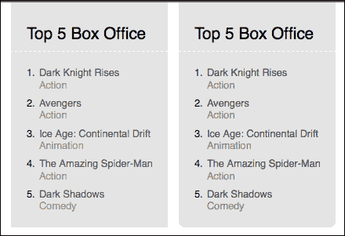

### 小贴士

注意，如果我们使用简写`border-radius:0 8px`，它只为右上角和左下角添加圆角。

这个属性是`border-top-left-radius`、`border-top-right-radius`、`border-bottom-left-radius`和`border-bottom-right-radius`属性的简写。

很遗憾，在 Internet Explorer 的情况下，该属性仅从 IE9 开始支持。

### 小贴士

作为替代方案，您可以使用 CSS3 Pie ([`css3pie.com`](http://css3pie.com)) 或 Curved Corner ([`code.google.com/p/curved-corner/)`](http://code.google.com/p/curved-corner/)) 为旧版本的 Internet Explorer 提供支持。

## 设置颜色

在我们的样式表中描述颜色的方法有多种；最常见的是十六进制`#rrggbb`，其中第一对表示红色的数值，第二对表示绿色，最后一对表示蓝色。此外，我们可以使用简写表示法`#rgb`，它将我们的值转换为`#rrggbb`，例如，如果我们使用`#123`，它将被识别为`#112233`。

让我们来看看描述颜色的其他方法：

### 红色、绿色和蓝色

您可以使用语法`rgb(R,G,B)`定义颜色，其中 R、G 和 B 表示红色、绿色和蓝色的强度，可以是：

+   一个从 0（无颜色）到 255（最大强度）的整数

+   从 0.0%（无颜色）到 100.0%（最大强度）的浮点数

您必须在声明中使用相同的单位。它在所有现代浏览器中都受支持。这里有一个使用红色字体的`title`类：

```js
.title{
  color:rgb(255,0,0);
}
```

### 红色、绿色、蓝色和透明度

一个扩展的 `rgb` 规范，在末尾添加一个用于 alpha 透明度的值，其值从 `0.0`（不可见）到 `1.0`（完全可见）。它被所有现代浏览器和从版本 9 开始的 Internet Explorer 支持。我们可以在类 `title` 中定义带有 50% alpha 透明度的红色字体：

```js
.title{
  color:rgba(255,0,0, .5);
}
```

### 色调、饱和度和亮度

HSL 是颜色的圆柱坐标表示。`vHue` 是角度的浮点表示；这个值定义了将应用饱和度和亮度的颜色，其值范围从 `0` 到 `360`。饱和度是一个百分比，从 `0`（白色）到 `100%`（全色）定义了颜色的鲜艳度。最后，亮度定义了光的量，从 `0%`（无光，全黑）到 `100%`（全色）。语法是 `hsl(H,S,L)`。它被所有现代浏览器和从版本 9 开始的 Internet Explorer 支持。如果我们想在类 `title` 中应用红色字体，我们可以这样做：

```js
.title{
  color:hsl(0,100%,100%);
}
```

### 色调、饱和度、亮度和透明度

这是一个扩展的 `hsl` 规范，它以与 `rgba` 对 `rgb` 的方式相同的方式在末尾添加一个用于 alpha 透明度的值。它被所有现代浏览器和从版本 9 开始的 Internet Explorer 支持。我们可以如下定义类 `title` 中带有 50% alpha 透明度的红色字体：

```js
.title{
  color:hsla(0,100%,100%, .5);
}
```

你可以使用条件 CSS 导入为旧版本的 Internet Explorer 应用透明度和 alpha 过滤器以获得相同的效果：

```js
.title{
  color:#f00;
  opacity: 0.5;
  filter: alpha(opacity=50);
}
```

## 添加渐变

市场上的新应用采用了简洁的设计，这并非因为技术限制，而是为了简化。尽管有时有必要添加一些样式来模拟深度，但渐变使这个过程变得容易得多。

CSS3 引入了 `linear-gradient` 和 `radial-gradient` 到 `background` 值。你可以将 `渐变` 应用到 `background` 或 `background-image` 属性。

这种可能的语法如下：

```js
background-image:linear-gradient(angle, color position, color position);
```

你可以添加任意多的 `颜色位置` 对。尽管可以使用十六进制颜色，但在这个例子中我们将使用 `rgb`。

首先，我们在导航栏中添加一个从 `top` 到 `bottom` 的渐变。它从浅灰色开始，以浅灰色结束，所以我们只需要两个点：`0%` 和 `100%`。初始颜色将是 `rgb(102,102,102)`，最终颜色将是 `rgb(70,70,70)`。将此添加到带有相关前缀的 `nav` 中，我们有：

```js
nav{
background-color:#666;
 background-image:linear-gradient(top, rgb(102,102,102) 0%, rgb(70,70,70) 100%);
 background-image:-moz-linear-gradient(top, rgb(102,102,102) 0%, rgb(70,70,70) 100%);
 background-image:-webkit-linear-gradient(top, rgb(102,102,102) 0%, rgb(70,70,70) 100%);
 background-image:-o-linear-gradient(top, rgb(102,102,102) 0%, rgb(70,70,70) 100%);
 background-image:-ms-linear-gradient(top, rgb(102,102,102) 0%, rgb(70,70,70) 100%);
}
```

结果我们可以看到与左侧原始图像相比的正确图像：

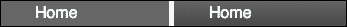

### 提示

如果你不想处理每个供应商的前缀，一个选择是使用生成器，例如 Colorzilla 渐变生成器（[`www.colorzilla.com/gradient-editor/`](http://www.colorzilla.com/gradient-editor/)）。你只需要使用可视化工具定义你的渐变，然后将生成的代码复制到你的 CSS 中。

为了说明我们可以添加多个点，让我们给我们的 **Top 5 Box Office** 区域应用一个更复杂的效果。在这种情况下，我们从 `bottom` 到 `top` 应用效果：

```js
aside{
  float:right;
  width:200px;
  padding:30px 0 10px 0;
  margin:0 10px;
  background-color:#E4E4E4;
  /** TOP 5 ROUNDED BORDER **/ 
  border-radius:0 0 8px 8px;
  -moz-border-radius:0 0 8px 8px;
  -webkit-border-radius:0 0 8px 8px;
  -o-border-radius:0 0 8px 8px;
  /** BOX OFFICE GRADIENT **/
 background:linear-gradient(bottom, rgb(200,200,200) 35%, rgb(210,210,210) 68%, rgb(220,220,220) 98%, rgb(80,80,80) 100%);
 background:-o-linear-gradient(bottom, rgb(200,200,200) 35%, rgb(210,210,210) 68%, rgb(220,220,220) 98%, rgb(80,80,80) 100%);
 background:-moz-linear-gradient(bottom, rgb(200,200,200) 35%, rgb(210,210,210) 68%, rgb(220,220,220) 98%, rgb(80,80,80) 100%);
 background:-webkit-linear-gradient(bottom, rgb(200,200,200) 35%, rgb(210,210,210) 68%, rgb(220,220,220) 98%, rgb(80,80,80) 100%);
 background:-ms-linear-gradient(bottom, rgb(200,200,200) 35%, rgb(210,210,210) 68%, rgb(220,220,220) 98%, rgb(80,80,80) 100%);
}
```

如同我们之前的例子，我们使用百分比来定义位置。在这种情况下，我们使用 `35%`、`68%` 和 `98%`。

最后，我们可以比较原始区域（左侧）与最终区域（右侧），如下面的截图所示：

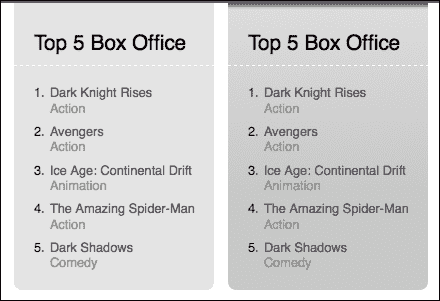

我们可以将相同的原理应用到我们的页眉上：

```js
header{
  color:#fff;
  height:122px;
  /** HEADER GRADIENT **/
  background-color:#1A1A1A;
  background-image:url(../img/logo_back.png), linear-gradient(right, rgb(26,26,26) 35%, rgb(40,40,40) 68%, rgb(61,61,61) 85%);
 background-image:url(../img/logo_back.png), -moz-linear-gradient(right, rgb(26,26,26) 35%, rgb(40,40,40) 68%, rgb(61,61,61) 85%);
 background-image:url(../img/logo_back.png), -webkit-linear-gradient(right, rgb(26,26,26) 35%, rgb(40,40,40) 68%, rgb(61,61,61) 85%);
 background-image:url(../img/logo_back.png), -o-linear-gradient(right, rgb(26,26,26) 35%, rgb(40,40,40) 68%, rgb(61,61,61) 85%);
 background-image:url(../img/logo_back.png), -ms-linear-gradient(right, rgb(26,26,26) 35%, rgb(40,40,40) 68%, rgb(61,61,61) 85%);
}
```

与原始的（顶部）相比，我们得到了一个更有趣的标题（底部）：

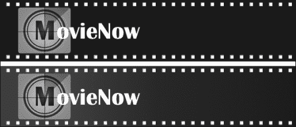

### 小贴士

为 Internet Explorer 中的渐变指定的 `-ms-` 前缀已被微软弃用。请参阅以下链接：[`msdn.microsoft.com/en-us/library/windows/apps/hh453527.aspx`](http://msdn.microsoft.com/en-us/library/windows/apps/hh453527.aspx)。

总是可以通过使用平铺图像和 `background-image` 属性来回退渐变。

## 添加框阴影

我们可以使用阴影来模拟深度，产生嵌入和突出显示的视觉效果。`box-shadow` 属性允许我们根据元素的边框创建阴影。

`box-shadow` 的语法如下：

```js
box-shadow:horizontal-shadow vertical-shadow blur spread color inset;
```

只需要 `horizontal-shadow` 和 `vertical-shadow`。`inset` 指定阴影是否应用于元素内部。

让我们在 `nav` 上添加一个底部的阴影。我们可以将 `horizontal-shadow` 指定为 `0`，将 `vertical-shadow` 指定为 `1px` 以显示元素下的阴影，将 `3px` 用于模糊，颜色为 `#999`：

```js
nav{
  background-color:#666;
  background-image:linear-gradient(top, rgb(102,102,102) 0%, rgb(70,70,70) 100%);
  background-image:-moz-linear-gradient(top, rgb(102,102,102) 0%, rgb(70,70,70) 100%);
  background-image:-webkit-linear-gradient(top, rgb(102,102,102) 0%, rgb(70,70,70) 100%);
  background-image:-o-linear-gradient(top, rgb(102,102,102) 0%, rgb(70,70,70) 100%);
  background-image:-ms-linear-gradient(top, rgb(102,102,102) 0%, rgb(70,70,70) 100%);
  /** NAVIGATION SHADOW **/
 box-shadow: 0 1px 3px #999;
 -moz-box-shadow: 0 1px 3px #999;
 -webkit-box-shadow: 0 1px 3px #999;
 -o-box-shadow: 0 1px 3px #999;
}
```

我们可以将没有阴影的 `nav` 菜单（左侧）和有阴影的菜单（右侧）进行比较：

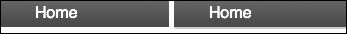

为了演示 `inset`，我们可以在我们的 **Top 5 Box Office** 区域添加一个内部阴影。在这里，我们为 `vertical-shadow` 应用负定位 `-1px` 以在底部显示阴影的一部分，`1px` 用于模糊，`1px` 用于扩散（因为我们想修改阴影的大小），颜色为 `#aaa`，最后使用 `inset` 以获得内部阴影：

```js
aside{
  float:right;
  width:200px;
  padding:30px 0 10px 0;
  margin:0 10px;
  background-color:#E4E4E4;
  /** TOP 5 ROUNDED BORDER **/ 
  border-radius:0 0 8px 8px;
  -moz-border-radius:0 0 8px 8px;
  -webkit-border-radius:0 0 8px 8px;
  -o-border-radius:0 0 8px 8px;
  /** BOX OFFICE GRADIENT **/
  background:linear-gradient(bottom, rgb(200,200,200) 35%, rgb(210,210,210) 68%, rgb(220,220,220) 98%, rgb(80,80,80) 100%);
  background:-o-linear-gradient(bottom, rgb(200,200,200) 35%, rgb(210,210,210) 68%, rgb(220,220,220) 98%, rgb(80,80,80) 100%);
  background:-moz-linear-gradient(bottom, rgb(200,200,200) 35%, rgb(210,210,210) 68%, rgb(220,220,220) 98%, rgb(80,80,80) 100%);
  background:-webkit-linear-gradient(bottom, rgb(200,200,200) 35%, rgb(210,210,210) 68%, rgb(220,220,220) 98%, rgb(80,80,80) 100%);
  background:-ms-linear-gradient(bottom, rgb(200,200,200) 35%, rgb(210,210,210) 68%, rgb(220,220,220) 98%, rgb(80,80,80) 100%);
  /** BOX OFFICE INNER SHADOW **/
 box-shadow:0 -1px 1px 1px #aaa inset;
 -moz-box-shadow:0 -1px 1px 1px #aaa inset;
 -webkit-box-shadow:0 -1px 1px 1px #aaa inset;
 -o-box-shadow:0 -1px 1px 1px #aaa inset; 
}
```

因此，我们的 **Top 5 Box Office** 区域看起来比以前更深：

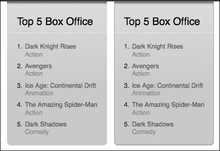

我们可以将此应用到我们的包装器上，以便在左右边框上产生阴影：

```js
.wrapper{
  background-color:#fff;
  /** PAGE SIDES SHADOWS **/
 box-shadow: 1px 0 2px 1px #aaa;
 -moz-box-shadow: 0 -1px 1px 1px #aaa;
 -webkit-box-shadow: 0 -1px 1px 1px #aaa;
 -o-box-shadow: 0 -1px 1px 1px #aaa;
}
```

虽然很难注意到，这些小细节的总和有助于反映企业应用的视觉丰富性：


`box-shadow` 被所有现代浏览器支持，除了 Internet Explorer，它只从 IE9 开始支持。

### 小贴士

不幸的是，创建假灵活的阴影很困难或成本很高，因为有时在旧浏览器中不使用阴影是更好的选择，遵循优雅降级的原理。

## 添加文字阴影

要添加文字阴影，我们不能使用 `box-shadow`，因为它应用于一个方形容器。如果我们想给任何文字添加阴影，我们应该使用 `text-shadow` 属性。

`text-shadow` 的语法如下：

```js
text-shadow: horizontal-shadow vertical-shadow blur color;
```

`text-shadow` 不被 Internet Explorer 支持，但在此情况下可以使用 `filter:dropshadow` 代替。唯一的缺点（除了兼容性之外）是无法指定模糊效果。

`filter:dropshadow` 的语法如下：

```js
filter: dropshadow(color=color, offx=horizontal-shadow, offy= vertical-shadow);
```

甚至阴影效果也被视为突出文本的一种方式。我们可以更改 `color` 属性并伪造 `inset` 元素。我们在 **Top 5 Box Office** 标题中使用浅灰色和水平垂直方向上 1px 的位移，没有模糊效果：

```js
aside h2{
  padding:0 20px 10px;
  margin:0 0 0;
  font-size:1.3em;
 text-shadow: 1px 1px 0px #f2f2f2;
 filter: dropshadow(color=#f2f2f2, offx=1, offy=1);
}
```

你可以检查 `inset` 元素（右侧）：

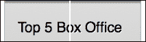

我们将在我们的导航栏中使用更传统的方法，包括 `hover` 时的 `blur`：

```js
nav a{
  color:#ccc;
  text-decoration:none;  
}
nav a:hover{
  color:#fff;
 text-shadow: 2px 2px 1px #222;
 filter: dropshadow(color=#222222, offx=2, offy=2);
}
```

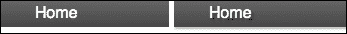

## 一些伪造 3D 的技巧

通过使用 CSS 3 之前的版本可以模拟一些深度效果。例如，我们可以通过在浅色上放置深色边框来模拟深度：

```js
aside ol{
  padding:20px 0 0 36px;
  margin:0;
  counter-reset:counter;
  border-top:1px dashed #f8f8f8;
}
aside h2{
  padding:0 20px 10px;
  margin:0 0 0;
  font-size:1.3em;
  text-shadow: 1px 1px 0px #f2f2f2;
  filter: dropshadow(color=#f2f2f2, offx=1, offy=1);
 border-bottom:1px dashed #bbb;
}
```

我们可以通过将此应用到我们的 **Top 5 Box Office** 区域来实现：

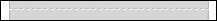

在某些情况下，效果可能不明显，但作为其他效果的一部分有助于提供深度：

```js
header{
  …
  border-bottom:1px solid #222;
}
nav{
  …
  border-top:1px solid #777;
  font-size:.9em;

}
```

将此应用到导航菜单的顶部，我们得到以下结果：

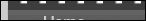

将所有效果应用到我们的初始布局中：

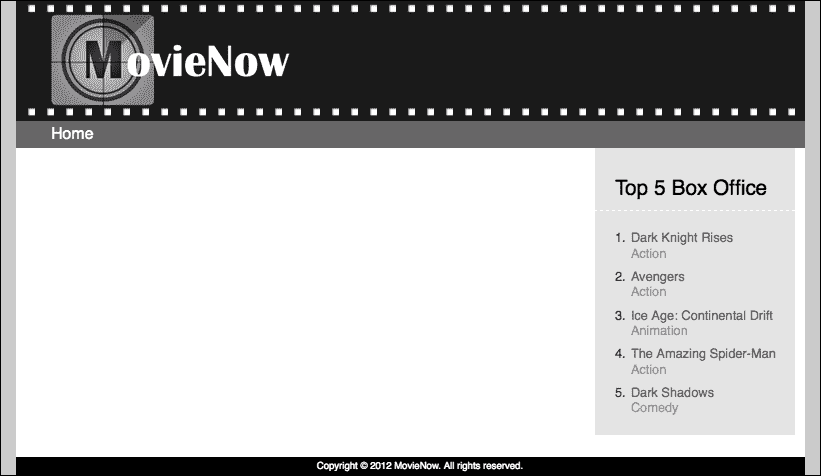

我们看到如下内容：


# 电影和风格

假设我们需要创建一个包含简单信息的电影列表，其中每个元素在点击时显示更多详细信息。由于时间紧迫，客户决定采用简单实现，因此需求交给了网页设计师，结果我们得到了一个初始设计：

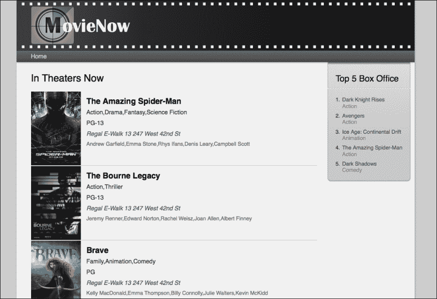

在与我们的网页设计师和最终客户的会议中，我们决定在点击电影海报时显示电影简介。基于此，让我们构建我们结构的第一种方法。

对于一个顺序无关紧要的列表，我们可以使用无序列表 `ul`。我们首先添加电影海报来轻松识别每个元素（使用 `img`），然后使用 `main-info`（默认显示）和 `description`（点击时显示）部分定义两个区块。在 `main-info` 中，我们添加标题为 `h3`，类型和评分作为 `p` 并带有 `details` 类，电影院使用标签 `p` 和 `theater` 类，以及演员作为 `p` 并带有 `actors` 类。在详情中，我们添加标题为 `h3` 和描述为 `p`。现在，我们的结构看起来像以下代码：

```js
<div id="movies-near-me">
  <ul>
    <li itemtype="http://schema.org/Movie" itemscope="" class="">
      
      <section class="main-info">
      <h3 itemprop="name">The Amazing Spider-Man</h3>
      <p itemprop="genre" class="details genre">Action,Drama,Fantasy,Science Fiction</p>
      <p class="details">PG-13</p>
      <p class="theater">Regal E-Walk 13 247 West 42nd St</p>
      <p class="actors">Andrew Garfield,Emma Stone,Rhys Ifans,Denis Leary,Campbell Scott</p>
    </section>
    <section class="description">
      <h3 itemprop="name">The Amazing Spider-Man</h3>
      <p>Typical teenager Peter Parker (Andrew Garfield) embraces his incredible destiny after uncovering one of his father's most carefully guarded secrets as Columbia Pictures reboots the Spider-Man franchis...</p>
      </section>
    </li>
…
  </ul>
</div>
```

首先，我们在 `movienow.geolocation.js` 的末尾添加 AJAX 调用：

```js
this.getLocation();
```

然后，我们使用我们的结构修改 AJAX 回调的结构：

```js
this.displayShowtimes = function(movies) {
  var movie = null;
  var html = '<ul>';
  for (var item in movies.items) {
    movie = movies.items[item];
    var movieDesc=(movie.synopsis.length>200)?movie.synopsis.substr(0,200)+"...": movie.synopsis;
 var movieHTML='<li itemscope itemtype="http://schema.org/Movie">'; 
 movieHTML+='';
 movieHTML+='<section class="main-info">';
 movieHTML+='<h3 itemprop="name">'+movie.title+'</h3>';
 movieHTML+='<p class="details genre" itemprop="genre">'+Array(movie.genre).join(', ')+'</p>';
 movieHTML+='<p class="details">'+movie.mpaaRating+'</p>';
 movieHTML+='<p class="theater">'+movie.theater.title+" "+movie.theater.address+'</p>';
 movieHTML+='<p class="actors">'+Array(movie.selectedStar).join(', ')+'</p>';
 movieHTML+='</section>';
 movieHTML+='<section class="description">';
 movieHTML+='<h3 itemprop="name">'+movie.title+'</h3>';
 movieHTML+='</section>';
 movieHTML+='</li>';
 html+=movieHTML;
  }
  html+= '</ul>';
  $('#movies-near-me').html(html);
  $("#movies-near-me li").click(function(){$(this).toggleClass("open")});
};
```

我们正在通过连接字符串来创建我们的 DOM 结构，但如果你想要一个更优雅的解决方案，你可以使用客户端模板库，如 jQuery tmpl ([`api.jquery.com/category/plugins/templates/`](http://api.jquery.com/category/plugins/templates/))、Mustache ([`mustache.github.com/`](http://mustache.github.com/))、Underscore ([`documentcloud.github.com/underscore/`](http://documentcloud.github.com/underscore/))) 或 Pure ([`beebole.com/pure/`](http://beebole.com/pure/))。模板库允许你将 DOM 结构从数据中分离出来。其中一些，如 Underscore，包括逻辑。

### 注意

注意，我们使用`substr`限制了`movie.synopsys`的大小。

由于我们想在白色中添加一些高亮，因此我们应该将`wrapper`和`main-info`的`background-color`结构更改为与原始设计中的浅灰色相同，这样我们就可以使用：

```js
.wrapper, #movies-near-me li section.main-info{
  background-color:#f1f1f1;
}
```

我们的前 5 个盒子向右浮动，因此我们可以为我们的电影容器添加一些`margin`以允许更灵活的设计。我们将更改`wrapper`结构的原始宽度：

```js
#movies-near-me{
  margin-right:200px;
}
```

## 为我们的列表添加样式

我们想在稍后应用一些动画，因此我们将添加`position:relative`来移动内部绝对定位的元素，使用`li`作为我们的参考点。我们添加`overflow:hidden`以处理任何超出`li`区域的元素。我们使用带有浅色和深色颜色的`borders top`和`bottom`来增加深度感。最后，我们添加深灰色作为`background-color`（原始设计中没有，但将被`main-info`和`img`覆盖），并将鼠标`cursor`属性设置为`pointer`以指示该元素是可点击的：

```js
#movies-near-me li{
  position:relative;
  overflow:hidden;
  border-top:1px solid #fff;
  border-bottom:1px solid #ccc;
  background-color: #202125;
  cursor:pointer;
}
```

让我们浮动`img`以在旁边显示`main-info`而不是在下面。哦，还要一些`margin`来在`img`和描述文本之间留出空间（目前将隐藏）：

```js
#movies-near-me li img{
  float:left;
  margin-right:10px;
}
```

我们将如下定义标题的大小、粗细和间距：

```js
#movies-near-me li h3{
  font-size:1.2em;
  font-weight:bold;
  padding:10px 0 3px 14px;  
}
```

我们将为`p`标签内的每个信息添加填充：

```js
#movies-near-me li p{
  padding:5px 14px;
}
```

为一些细节添加不同的文本颜色和大小：

```js
#movies-near-me li .details{
  color:#333;
  font-size:.9em;
}
```

我们将使用以下声明定义电影院的不同的文本颜色和大小以及斜体样式：

```js
#movies-near-me li .theater{
  color:#555;
  font-style:italic;
  font-size:.9em;
}
```

为演员应用新的样式：

```js
#movies-near-me li .actors{
  color:#666;
  font-size:.8em;
}
```

我们定义一个静态高度，与每个电影海报图像相同：

```js
#movies-near-me li,#movies-near-me li section.main-info,#movies-near-me li section.description{
  height:178px;
}
```

我们对`main-info`应用了绝对定位（以便稍后进行动画）。我们添加与我们的电影海报图像的`width`属性相等的`margin`以及我们文本内部的填充：

```js
#movies-near-me li section.main-info{
  position:absolute;
  top:0;
  left:0;
  right:0;
  margin-left:120px;
  padding: 5px 0;
}
```

最后，我们将为我们的隐藏描述添加一些样式，包括一个模拟深度的`inset box-shadow`属性：

```js
#movies-near-me li section.description{
  color:#f1f1f1;
  font-size:.9em;
  line-height:1.4em;
  box-shadow:1px -8px 3px 4px #000 inset;
  -moz-box-shadow:1px -8px 3px 4px #000 inset;
  -webkit-box-shadow:1px -8px 3px 4px #000 inset;
  -o-box-shadow:1px -8px 3px 4px #000 inset;  
}
```

到目前为止，我们的设计看起来与我们的网页设计师提供的图像相同，但我们仍然看不到电影详情。在我们满足这一要求之前，让我们谈谈转换和动画。

## 转换

通常，我们根据交互更改 HTML 元素的类。例如，悬停时的链接样式，点击时显示和隐藏用于选项卡的文本块等。在 CSS3 之前，如果我们想对这些更改进行动画处理，唯一的方法是使用 JavaScript。有了 CSS3，一个简单的方法是使用`transition`。有一个初始类和一个在交互上触发的伪类，我们可以添加一个具有在类和伪类之间改变属性的`transition`元素来动画化它们。

简写`transition`的语法如下：

```js
transition: transition-property transition-duration transition-timing-function transition-delay
```

`transition-timing-function`指定转换发生速度。此属性的值可以是：`linear`、`ease`、`ease-in`、`ease-out`、`ease-in-out`和`cubic-bezier(n,n,n,n)`。

如果我们想在初始状态（0s）之外的其他时间点开始动画，则使用`transition-delay`。

我们可以同时使用多个转换：

```js
transition: property1 duration1 easing1 start-point1,..., propertyN durationN easingN start-pointN
```

### 提示

转换由交互触发，并且只有两种状态：初始状态和最终状态。

## 动画

如果我们要实现涉及多个状态复杂动作，无法使用转换。为此，我们使用动画。此外，您不需要触发交互来启动动画（但我们应将其保密，以避免在这个时代出现新的动画 GIF 热潮）。

动画依赖于`@keyframes`。类似于动画工具（包括 Adobe Flash）中的对应物，关键帧允许您定义状态及其中的属性值。

例如，我们可以使用：

```js
@keyframes animation-name
{
  from {width:0}
  to {width:50px}
}
```

或者使用百分比和多个属性的更复杂结构：

```js
@keyframes animation-name
{
  0%{width:0;height:0}
  20%{width:5px;height:2px}
  60%{width:7px;height:10px}
  100%{width:50px;height:12px}
}
```

我们可以指定我们想要的步骤数量。`animation-name`稍后用于调用我们的关键帧。

用于动画的语法如下：

```js
animation: animation-name animation-duration animation-timing-function animation-delay animation-iteration-count animation-direction;
```

大多数属性的含义与转换相同。`animation-iteration-count`指定动画将重复的次数（或如果它永不停止，则为`infinite`），`animation-direction`允许动画正常运行（`normal`），或交替前后（`alternate`）。

此外，我们还有`animation-play-state`属性，它不在简写模式中。此属性允许我们停止（`paused`）并重新开始（`running`）我们的动画。

# 在转换和动画之间进行选择

在我们的案例中，我们只有两种状态，一种是显示电影的一般细节，另一种是显示电影描述的伪类状态。这应该在点击时触发，因此最简单的解决方案是使用转换。

### 提示

虽然在每种情况下都可以使用`animation`，但对于与常见交互相关的简单需求，最好依赖于`transition`。

在我们的案例中，我们想要动画化`main-info`的`left`和`right`属性。初始状态为两者都是`0`：

```js
#movies-near-me li section.main-info{
  top:0;
 left:0%;
 right:0%;
  margin-left:120px;
  padding: 5px 0;
}
#movies-near-me li.open section.main-info{
  left:100%;
 right:-100%;
}
```

最终状态将是`left:100%`（`li`的右侧）和`right:-100%`（从`li`的右侧向右`100%`）。我们为`li`创建一个具有类`open`的伪状态：

要在点击时更改类，我们为每个`li`使用 jQuery 在`movienow.js`中添加一个`toggleClass`调用。`toggleClass`添加和删除`open`类：

```js
$("#movies-near-me li").click(function(){$(this).toggleClass("open")});
```

如果你点击每个元素，你会注意到显示和隐藏每个描述的变化。

要添加我们的`transition`，我们指定`left`和`right`属性，以及每个的`.3`秒持续时间。使用多个浏览器前缀，我们得到以下代码：

```js
#movies-near-me li section.main-info{
  top:0;
 left:0%;
 right:0%;
  margin-left:120px;
  padding: 5px 0;
  transition: right .3s, left .3s;
 -moz-transition: right .3s, left .3s;
 -webkit-transition: right .3s, left .3s;
 -o-transition: right .3s, left .3s;
}
```

再次测试，我们应该看到一个从一种状态到另一种状态的流畅运动。

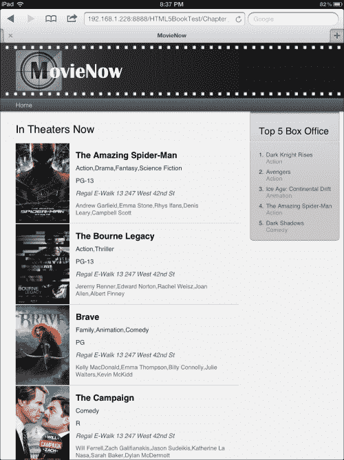

如果我们点击**Brave**，我们会看到一个动画，然后是电影简介，部分如图下截图所示。

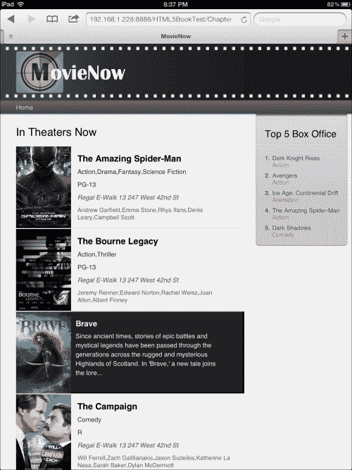

让我们在标题中添加一个动画来测试`animation`属性。我们的标题显示一个电影卷轴装饰。如果我们想滚动卷轴，我们需要定义一些关键帧。在这种情况下，我们只指定两种状态：`from`和`to`。由于我们的设计，我们将卷轴水平从 0 移动到-19px（白色矩形之间的空间，以创建相同的初始和结束状态以供循环使用）。我们将使用相应的浏览器前缀，并将我们的`keyframe`命名为`movierolling`：

```js
@keyframes movierolling{
  from {background-position: 0 0;}
  to {background-position: -19px 0;}
}
/* Firefox */
@-moz-keyframes movierolling{
  from {background-position: 0 0;}
  to {background-position: -19px 0;}
}
/* Safari and Chrome */
@-webkit-keyframes movierolling{
  from {background-position: 0 0;}
  to {background-position: -19px 0;}
}
/* Opera */
@-o-keyframes movierolling{
  from {background-position: 0 0;}
  to {background-position: -19px 0;}
}
```

我们在标题中添加`movierolling`作为`animation`，指定`.5 segs` `animation:movierolling .5s`，一个无限循环`animation-iteration-count:infinite`，以及线性缓动以创建流畅的循环`animation-timing-function:linear`。因此，我们得到以下代码：

```js
header{
  color:#fff;
  height:122px;
  /** HEADER GRADIENT **/
  background-color:#1A1A1A;
  background-image:url(../img/logo_back.png), linear-gradient(right, rgb(26,26,26) 35%, rgb(40,40,40) 68%, rgb(61,61,61) 85%);
  background-image:url(../img/logo_back.png), -moz-linear-gradient(right, rgb(26,26,26) 35%, rgb(40,40,40) 68%, rgb(61,61,61) 85%);
  background-image:url(../img/logo_back.png), -webkit-linear-gradient(right, rgb(26,26,26) 35%, rgb(40,40,40) 68%, rgb(61,61,61) 85%);
  background-image:url(../img/logo_back.png), -o-linear-gradient(right, rgb(26,26,26) 35%, rgb(40,40,40) 68%, rgb(61,61,61) 85%);
  background-image:url(../img/logo_back.png), -ms-linear-gradient(right, rgb(26,26,26) 35%, rgb(40,40,40) 68%, rgb(61,61,61) 85%);
  border-bottom:1px solid #222;
  animation:movierolling .5s;
 -moz-animation:movierolling .5s;
 -webkit-animation:movierolling .5s;
 -o-animation:movierolling .5s;
 animation-iteration-count:infinite;
 -moz-animation-iteration-count:infinite;
 -webkit-animation-iteration-count:infinite;
 -o-animation-iteration-count:infinite; 
 animation-timing-function:linear;
 -moz-animation-timing-function:linear;
 -webkit-animation-timing-function:linear;
 -o-animation-timing-function:linear;
}
```

轮播开始了！

让我们先注释掉这个动画代码，然后回到我们的应用中。

# 使用媒体查询

我们添加的用于可视化简介的过渡效果很好，但在移动设备上我们没有足够的空间显示每部电影的完整简介。一个可能的解决方案是隐藏移动设备的电影海报图像，这应该至少给我们额外的 120 px。

正如我们在前面的章节中看到的，我们可以使用媒体查询为不同的屏幕尺寸指定不同的行为。我们可以为 737 px 以下的设备添加一个案例：

```js
@media only screen and (max-width: 737px){ … }
```

让我们应用一个与`main-info`相同时间的过渡，但在这个情况下只为`margin-left`：

```js
  #movies-near-me li img{
    transition: margin-left .3s;
 -moz-transition: margin-left .3s;
 -webkit-transition: margin-left .3s;
 -o-transition: margin-left .3s; 
  }
```

最终位置应该有一个负的`margin`值，以便将我们的图像移动到`li`区域之外：

```js
  #movies-near-me li.open img{
    margin-left:-120px;
  }
```

此外，让我们隐藏演员和类型，以便在`main-info`内部有更多空间：

```js
  #movies-near-me li .actors, #movies-near-me li .genre{
    display:none;
  } 
```

现在，我们可以看到小设备上的不同交互，允许我们看到完整的描述：

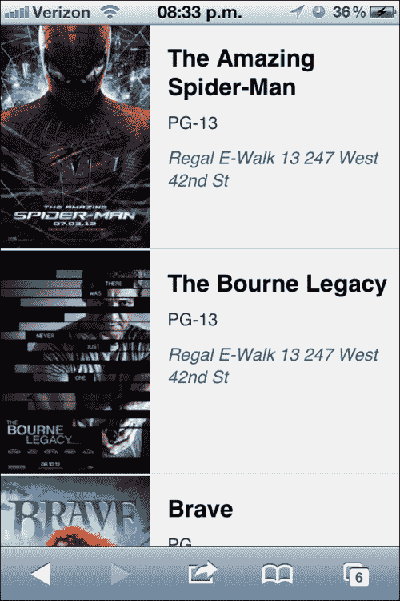

如果我们点击**The Bourne Legacy**，我们会看到一个动画，然后是电影简介。

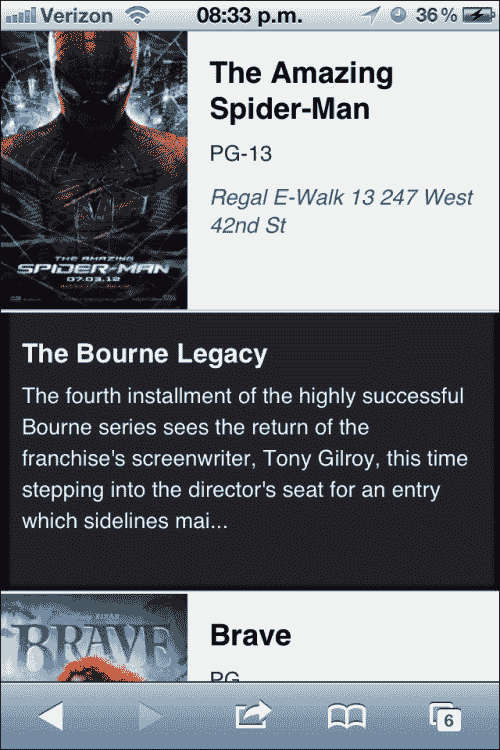

# 应用 CSS3 选择器

我们一直在使用通用选择器，但 CSS3 引入了一个新的集合，为样式化打开了新的可能性。

大多数这些选择器在 Internet Explorer 8 或更早版本中不受支持；您可以使用以下链接中提到的兼容性表格来验证支持：[`www.quirksmode.org/css/contents.html#CSS3`](http://www.quirksmode.org/css/contents.html#CSS3)。您始终可以用 CSS 中的类声明替换这些选择器，并在您的 HTML 中使用代码中的条件添加这些类。

我们不会将此代码作为我们项目的一部分，但您可以使用`3.- selectors`文件夹中的`styles.css`（代码已注释）来测试它，以可视化结果。

+   `:first-of-type`：这个选择器用于选择具有选择器类型的第一个元素。假设我们想为电影列表中的第一个元素应用不同的`background-color`。我们可以选择`li`的第一个出现，然后是表示哪个元素必须更改其背景颜色的选择器：

    ```js
    #movies-near-me li:first-of-type section.main-info{
      background-color:#ccc;
    }
    ```

+   `:last-of-type`：这个选择器与前面的选择器类似，但它选择最后一个元素。应用之前的相同案例：

    ```js
    #movies-near-me li:last-of-type section.main-info{
      background-color:#ccc;
    }
    ```

+   `:only-of-type`：这个选择器只选择指定类型的唯一元素。使用我们电影的详细信息，如果我们应用以下：

    ```js
    #movies-near-me li section.main-info h3:only-of-type{
      background-color:#ccc;
    }
    ```

    我们可以为`h3`添加`background-color`属性，因为它只被其父元素包含，但如果使用以下方法，则没有任何内容被选中，因为其中包含多个`p`元素：

    ```js
    #movies-near-me li section.main-info p:only-of-type{
      background-color:#ccc;
    }
    ```

+   `:only-child`：这个选择器用于选择其父元素只包含它们的元素。例如，使用这个选择器我们可以改变`article`的`background-color`，因为它是其父元素中唯一包含的元素。

    ```js
    article:only-child{
      background-color:#ccc;
    }
    ```

    但如果我们选择`section`，则不会选择任何内容，因为其父元素中有多个子元素。

    ```js
    section:only-child{
      background-color:#ccc;
    }
    ```

+   `:nth-child(n)`：这个选择器允许我们通过位置指定要选择的元素。如果我们想选择列表中的第三个元素：

    ```js
    #movies-near-me li:nth-child(3) section.main-info{
      background-color:#ccc;
    }
    ```

+   `:nth-last-child(n)`：这个选择器与前面的选择器使用相同的原理，但计数从最后一个元素开始：

    ```js
    #movies-near-me li:nth-last-child(2) section.main-info{
      background-color:#ccc;
    }
    ```

+   `:nth-of-type(n)`：这个选择器与之前的选择器使用相同的原理，但它只会计数相同类型的元素。例如，如果我们应用`p:nth-of-type(2)`来选择第二个元素，它将忽略任何与`p`的差异。选择第二个`p`元素，我们有以下代码片段：

    ```js
    #movies-near-me li section.main-info p:nth-of-type(2){
      background-color:#ccc;
    }
    ```

+   `:nth-last-of-type(n)`：这个选择器做的是相同的，但它从最后一个元素开始计数：

    ```js
    #movies-near-me li section.main-info p:nth-last-of-type(2){
      background-color:#ccc;
    }
    ```

+   `:last-child`：这个选择器用于选择是其父元素的最后一个子元素的元素。选择最后一个电影，我们有以下代码片段：

    ```js
    #movies-near-me li:last-child section.main-info{
      background-color:#ccc;
    }
    ```

+   `:root`：这个选择器允许我们选择`html`根标签。让我们改变`html`的`background-color`值，但首先我们需要重置已经定义的`html`和`body`标签的`background-color`属性：

    ```js
    html,body{
      background:none;
    }
    ```

    将`background-color`添加到`root`（`html`）：

    ```js
    :root{
      background-color:#666; 
    }
    ```

+   `:empty`：这个选择器用于选择没有子元素或文本的元素。让我们在我们的应用中以红色显示没有内容的`div`元素：

    ```js
    div:empty{
      background-color:#ff0000;
    }
    ```

    您应该看到标志区域和`div.push`以红色显示。

+   `:target`：这个选择器用于选择具有与活动`anchor`相等的`id`值的元素。为了测试这个，我们可以定义一个带有锚点和`id`属性的链接来标记该链接为活动链接：

    ```js
    <nav>
      <ul>
        <li><a href="#home" id="home">Home</a></li>
      </ul>
    </nav>
    ```

    我们可以定义样式来标记黄色文本：

    ```js
    :target{
      color:#FFFF00;
    }
    ```

    如果你点击链接，你会看到颜色变化。

+   `:not(selector)`: 这将选择所有不满足选择器条件的元素。例如，如果我们想选择所有没有`theater`类的`p`元素：

    ```js
    p:not(.theater){
      background-color:#ccc;
    }
    ```

+   `:enabled`: 这将选择没有禁用属性的输入字段。如果我们有`<input type="button" value="enable" />`，我们可以使用以下代码定义一个橙色边框：

    ```js
    input:enabled{
      border:1px solid #E38217;
    }
    ```

+   `:disabled`: 这将选择具有`disabled`属性的输入字段。和之前一样，我们可以有：

    ```js
    <input type="button" value="disable" disabled="disabled" />
    input:disabled{
      border:1px solid #E38217;
    }
    ```

+   `:checked`: 这将选择`type`为`checkbox`且被`checked`的`input`。如果我们有以下代码，我们可以看到当它被选中时元素会改变样式：

    ```js
    <label><input type="checkbox" />Checked</label>
    Applying style:
    input:checked{
      width:20px;
      height:20px;
    }
    ```

+   `element1~element2`: 这将选择由`element1` precede 的`element2`。如果我们想选择由`h3` precede 的`p`元素，我们可以应用以下方法：

    ```js
    h3~p{
      background-color:#ccc;
    }
    ```

+   `[attribute^=value]`: 这将选择其"attribute"以特定"value"开头的元素。例如，让我们隐藏所有`alt`属性以`Dark`开头的图像：

    ```js
    img[alt^="Dark"]{
      display:none;
    }
    ```

+   `[attribute$=value]`: 这将选择其"attribute"以特定"value"结尾的元素。例如，让我们隐藏所有`alt`属性以`s`结尾的图像：

    ```js
    img[alt$="s"]{
      display:none;
    }
    ```

+   `[attribute*=value]`: 这将选择其"attribute"包含"value"的元素。例如，让我们隐藏所有`alt`属性包含`ar`的图像：

    ```js
    img[alt*="ar"]{
      display:none;
    }
    ```

# 摘要

新的 CSS3 特性并不是对网络开发的全新引入；它们是对执行过程的简化。在 CSS3 之前，可以使用渐变、阴影、圆角甚至动画，但实现成本高昂且可扩展性复杂。有了所有这些可能性，我们不应忘记依赖于图像和复杂 JavaScript 的旧技术，因为尽管我们都希望有一个基于新一代浏览器的更简单未来，但我们必须面对旧一代浏览器的问题。

我们已经展示了如何将最常用的 CSS3 属性应用到我们的企业应用中，以及如何管理与样式相关的跨浏览器兼容性问题。此外，我们介绍了 CSS3 动画和过渡，因此现在我们能够为我们的项目选择正确的解决方案。最后，我们可以将媒体查询和选择器应用到样式表中，以实现更复杂和优雅的解决方案。

下一章将介绍 HTML5 视频和音频管理、JavaScript 对媒体播放的控制，以及提供向后兼容性的基本策略。
