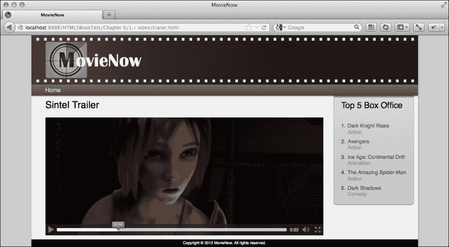
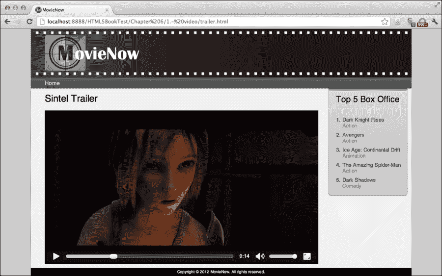
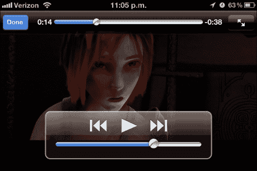
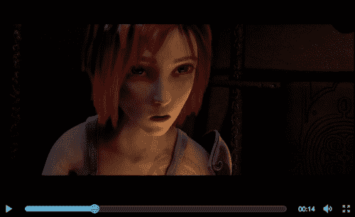
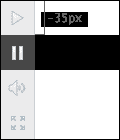
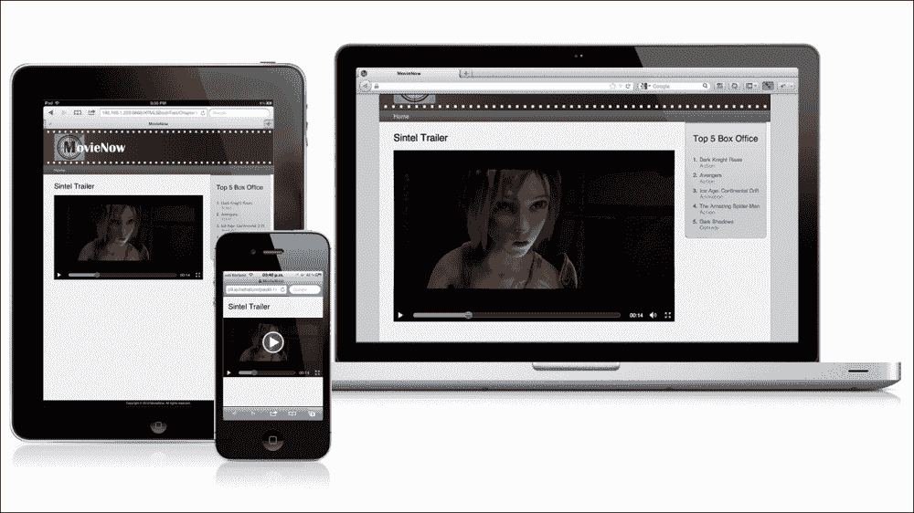

# 第六章：应用：通过 HTML5 视频的预告片

HTML5 引入的最有趣的功能之一是能够在不使用额外插件的情况下播放多媒体。尽管这似乎是任何涉及媒体管理的企业应用的正确解决方案，但仍有许多因素需要考虑。本章涵盖了 HTML5 的`video`和`audio`标签，它们用于播放媒体，以及与当前技术状态相关的注意事项。

作为例子，我们将构建一个用于预告片的视频播放器和用于播客的音频播放器。

本章包括：

+   HTML5 视频介绍

+   实现视频播放器

+   HTML5 音频介绍

+   实现音频播放器

+   如何停止担忧并爱上 Flash

# HTML5 视频介绍

多年来，浏览器一直依赖于外部插件如 Real Player、Quicktime 和 Flash 进行视频播放。Flash 的市场渗透率高达 99%，成为了媒体播放的事实标准；然而，在过去的几年里，移动设备已经用原生应用和 HTML5 解决方案取代了这一解决方案。

HTML5 视频迅速成为嵌入视频的标准和优雅方式。虽然一切似乎都指向 HTML5 的视频解决方案，但关于应支持哪些视频格式的缺乏共识阻碍了其使用。

理想情况下，所有浏览器至少应支持一种格式，但每个公司都有自己的看法。虽然微软和苹果支持 MP4 H.264（因为它们是该格式的专利持有者），但谷歌和 Mozilla 支持 Ogg Theora 和 VP8 WebM 作为免费解决方案。以下表格显示了每个视频格式的浏览器支持情况：

| 浏览器 | 操作系统 | Ogg Theora | MP4 H.264 | VP8 WebM |
| --- | --- | --- | --- | --- |
| **Internet Explorer** | Windows | 手动安装 | 9.0 | 手动安装 |
| Windows Phone | 否 | 否 |
| **Mozilla Firefox** | Windows | 3.5 | 手动安装 | 4.0 |
| Unix | 否 |
| 其他 |
| **Google Chrome** | 所有支持 | 3.0 | 3.0（计划移除） | 6.0 |
| **Safari** | iOS | 否 | 3.1 | 否 |
| MacOS | 手动安装 | 手动安装 |
| Windows | 手动安装 |
| **Opera** | 所有支持 | 10.50 | 否 | 10.60 |

### 注意

一种名为**高效视频编码**（**HEVC**）或 H.265 的新压缩标准可能在 2013 年进入商业产品。它的效率几乎是当前 H.264 标准的两倍。

幸运的是，`video`标签支持使用多个源，允许浏览器选择支持的视频格式，但这意味着每个视频至少需要编码两次。对于您的企业来说，这意味着编码和存储的额外成本。

### 小贴士

一些实现依赖于视频文件扩展名。例如，即使使用 MP4 H.264 格式，您也无法在 iOS 设备上播放扩展名为`.f4v`的视频。

大多数网络浏览器支持渐进式下载而不是流式传输。虽然 Flash 有自己的专有协议来流式传输（尽管已经发布了用于公共使用的规范的不完整版本），称为 **实时消息协议** **RTMP**，但只有 Safari、Safari iOS 和一些 Android 浏览器支持苹果公司实现的新流式传输协议：**HTTP Live Streaming** (**HLS**)。

使用渐进式下载，从浏览器缓存中复制视频文件相当容易，这对于媒体盗版者来说是一个便利的条件。此外，如果你使用流式传输，并且内容分发网络支持自适应比特率流，你可以根据用户的比特率提供不同的视频质量，但使用渐进式下载则不可能做到这一点。

# 实现视频播放器

MovieNow 用户会喜欢有一个方式来可视化他们最喜欢的电影的预告片。为此，我们将创建一个具有基本功能（播放、暂停、快进、音量控制、全屏）的播放器。

我们将以 Sintel 的预告片为例，Sintel 是使用名为 Blender 的免费 3D 动画工具制作的动画电影。这个视频预告片托管在 [`www.w3.org/`](http://www.w3.org/) 网站上，以三种主要视频格式：MP4 (mp4)、WebM (webm) 和 Ogg Theora (ogv)。

首先，让我们创建一个名为 `trailer.html` 的文件，并使用我们的主页面结构。

在 `article` 标签内，我们使用 `video` 标签，这允许我们使用 `poster` 属性指定初始图像，并使用 `controls` 属性显示默认控件。

```js
<video poster="img/trailer-poster.png" controls>
```

你可以直接为 `video` 标签指定 `src` 属性，但为了支持多种视频格式文件，我们将在 `video` 标签内使用 `source` 标签来声明我们的文件。`source` 标签的 `src` 属性允许我们定义视频路径，而 `type` 属性（用于指定格式）。

```js
<source type="video/mp4" src="img/path"></source>
```

在这个例子中，我们将使用：

+   [`media.w3.org/2010/05/sintel/trailer.mp4`](http://media.w3.org/2010/05/sintel/trailer.mp4) 用于 Chrome（尽管它仍然受到支持）、Internet Explorer、Safari 和 Safari iOS

+   [`media.w3.org/2010/05/sintel/trailer.webm`](http://media.w3.org/2010/05/sintel/trailer.webm) 用于 Firefox、Chrome 和 Opera

+   [`media.w3.org/2010/05/sintel/trailer.ogv`](http://media.w3.org/2010/05/sintel/trailer.ogv) 用于 Firefox、Chrome、Opera 和其他浏览器

在这种情况下，可能只需要使用两种格式，但我们将使用三种格式作为示例。最后我们得到：

```js
<video poster="img/trailer-poster.png" controls>
  <source type="video/mp4" src="img/trailer.mp4"></source>
  <source type="video/webm" src="img/trailer.webm"></source>
  <source type="video/ogg" src="img/trailer.ogv"></source>
  <p>Video not supported.</p>
</video>
```

注意，如果没有支持的视频，它会显示 `<p>Video not supported.</p>`。这可以是任何你想要的 HTML 内容。

### 小贴士

如果你的内容分发网络支持 HLS，你可以使用分段编码为 H.264 的视频，并使用 `.m3u8` 播单作为索引文件。为此，你可以使用 Apple Stream Segmenter 这样的工具。

由于每个浏览器都有自己的实现，我们的播放器在 Firefox、Chrome、Safari 等浏览器中看起来都不同。我们的播放器在不同平台上渲染效果不同。

在 Firefox 中，我们的播放器渲染效果如下所示：



在 Chrome 中，我们的播放器渲染效果如下所示：



Chrome

在 iPhone 上，我们的播放器将如下所示：



当需要时，在播放器中反映企业视觉风格或添加自定义功能。隐藏默认控制器并构建自己的控制器是可能的。

## 自定义控件

对于 MovieNow，我们将创建播放/暂停、搜索、音量和全屏控件。我们的设计如下所示：



为了简化创建进度条、搜索条以及音量条的任务，我们使用了 jQuery UI。jQuery UI 是一个 JavaScript 库，它实现了最常见的用户界面元素和交互，如滑块、手风琴、标签等。在我们的案例中，我们创建了一个带有 UI Darkness 主题的自定义下载（[`jqueryui.com/download`](http://jqueryui.com/download)）。

保存我们的 jQuery UI JavaScript 文件到`js`文件夹和样式表到`css`文件夹后，我们像往常一样在`body`标签的末尾之前导入它们：

```js
<script src="img/jquery-ui-1.8.23.custom.min.js"></script>
```

并且在`head`标签中的`css`：

```js
<link rel="stylesheet" href=" css/ui-darkness/jquery-ui-1.8.23.custom.css" type="text/css" />
```

为了支持触摸设备上的 jQuery UI 交互，我们导入 Touch Punch JavaScript 库（[`touchpunch.furf.com/`](http://touchpunch.furf.com/））：

```js
<script src="img/jquery.ui.touch-punch.min.js"></script>
```

现在我们已经放置了所有需要的库，我们可以从`video`标签中移除`controls`属性来隐藏默认控件。

```js
<video poster="img/trailer-poster.png" class="media">
```

在此基础上，让我们定义一个用于我们控件的 HTML 结构：

```js
<div class="media-container">
  <div>
    <div class="media-area">
      <video poster="img/trailer-poster.png" class="media">
        <source type="video/mp4" src="img/trailer.mp4"></source>
        <source type="video/webm" src="img/trailer.webm"></source>
        <source type="video/ogg" src="img/trailer.ogv"></source>
        <p>Video not supported.</p>
      </video>
    </div>
    <div class="controls">
      <div class="play-button"></div>
      <div class="seek"></div>
      <div class="fullscreen-button"></div>
      <div class="volume-container">
        <div class="volume-slider-container">
          <div class="volume-slider"></div>
        </div>
        <div class="volume-button"></div>
      </div>
      <div class="timer">00:00</div>
    </div>
  </div>
</div>
```

我们有三个主要类：

+   `media-container` – 包裹我们所有的播放器

+   `media-area` – 包裹视频标签

+   `controls` – 是包含我们控件的底部栏

在控件内部我们有：

+   `play-button` – 是播放器的播放/暂停按钮

+   `seek` – 进度/搜索条

+   `fullscreen-button` – 是全屏功能按钮

+   `volume-container` – 是`volume-button`的容器

+   `volume-slider` – 用于设置音量

+   `timer` – 是显示分钟和秒（mm:ss）的时间指示器

    ### 小贴士

    我们使用类，尽管使用 ID 的 jQuery 选择器运行更快，因为我们希望允许在同一个页面中必要时使用多个播放器。

### 样式化

首先，我们在`style.css`中添加一些额外的样式。我们定义了一个黑色背景并移除了所有带有`media`类的元素的轮廓：

```js
.media{
  width:100%;
  background-color:#000;
  outline:none;
}
```

我们为**Top 5 Box Office**部分添加了边距：

```js
.media-container{
  margin-right:200px;
}
```

我们为小型设备移除了那个边距，因为我们隐藏了**Top 5 Box Office**部分：

```js
@media only screen and (max-width: 737px){
  …
  .media-container{
    margin-right:0;
  }
}
```

这些样式与布局相关，而不是直接与我们的播放器相关。为了为我们的视频播放器创建样式，让我们创建一个名为`mediaplayer.css`的样式表，并在`trailer.html`的`head`标签中导入它。

```js
<link rel="stylesheet" href="css/mediaplayer.css" type="text/css" />
```

#### 按钮 和 图像精灵

我们使用 `controls` 类定义控件区域，设置黑色背景，设置高度为 `35px`（与行高相同以垂直居中文本），并将 `position` 设置为 `relative`（这样如果我们在定位内设置绝对元素，它们将相对于 `controls`）。

```js
.controls{
  background-color:#000;
  height:35px;
  line-height:35px;
  position:relative;
}
```

我们有一个包含所有播放器控件 `player-control.png` 的图像精灵。你可以在 `img` 文件夹中找到它。


使用精灵的基础是遮罩可见元素以显示它，并隐藏其余部分。在这种情况下，假设我们只想显示我们的暂停按钮。我们的按钮大小为 35 x 35 像素，背景图像为 `player-control.png`；图像中唯一可见的部分是在我们的按钮区域内，因此我们可以使用背景定位来显示不同的图标，如这里所示：



定义我们已有的播放、音量和全屏按钮：

```js
.play-button,.volume-button,.fullscreen-button{
  width:35px;
  height:35px;
  cursor:pointer;
  background-image:url(../img/player-control.png);
}
```

如我们之前看到的，我们在 y 轴上移动 `-35px` 来显示我们的暂停图标：

```js
.play-button.playing{
  background-position:0 -35px;
}
```

我们将同样的原则应用于全屏按钮：

```js
.fullscreen-button{
  background-position:0 -105px;
}
```

在音量按钮的情况下，我们将在其下方设置一个用于设置音量的滑块，因此我们设置背景颜色来隐藏下面的元素，并将 `position` 设置为 `absolute`，`z-index` 为 `1000` 以覆盖滑块：

```js
.volume-button{
  background-position:0 -70px;
  position:absolute;
  left:0;
  background-color:#000;
  z-index:1000;
}
```

#### 样式化搜索和音量条

搜索和音量条可以按照以下方式样式化：

1.  让我们在 `timer` 中定义字体样式：

    ```js
    .timer{
      color:#fff;
      font-size:.8em;
      padding:1px 8px 0;
    }
    ```

1.  到目前为止，我们通过浮动将 `play-button` 定位到左侧，将计时器、音量和全屏定位到右侧：

    ```js
    .play-button,.seek{
      float:left;
    }
    .timer,.volume-container,.fullscreen-button{
      float:right;
    }
    ```

1.  我们可以使用 `media` 类将 `video` 标签浮动到左侧，以避免某些浏览器中的额外间距：

    ```js
    .media{
      float:left;
    }
    ```

1.  使用 `overflow:hidden` 将 `media-area` 包裹在 `media` 旁边：

    ```js
    .media-area{
      overflow:hidden;
      background-color:#000;
    }
    ```

1.  使用绝对定位为 `seek` 条，我们可以使用 `left` 和 `right` 属性动态扩展搜索区域：

    ```js
    .seek{
      top:12px;
      left:48px;
      right:133px;
      height:10px;
      position:absolute;
    }
    ```

### 小贴士

对于这个例子，我们创建了一个灵活的播放器来展示一些与样式相关的技术，但为你的播放器定义静态尺寸是一个好的实践。此外，使用标准分辨率会更好。使用标准分辨率可以提高客户端媒体播放的性能。

#### 功能检测

一些 `video` 标签的功能不是通过 HTML5 JavaScript API 在所有浏览器中都可用。例如，iOS 设备不允许使用 JavaScript 进行音量控制；只能使用默认控件或硬件控件。使用 JavaScript 操作全屏控件仅在 WebKit 浏览器中可行。

我们可以定义一些类来隐藏在全屏或音量功能不可用时显示的按钮。首先，我们隐藏我们的按钮：

```js
.no-fullscreen .fullscreen-button{
  display:none;
}
.no-volume .volume-container{
  display:none;
}
```

然后，我们改变 `seek` 条的 `right` 间距：

```js
.no-volume .seek,.no-fullscreen .seek{
  right:88px;
}
.no-fullscreen.no-volume .seek{
  right:53px;
}
```

#### 样式化滑块

由于我们使用 jQuery UI 来实现搜索和音量滑块，我们想要覆盖一些样式。jQuery UI 滑块使用以下样式：

+   `ui-slider-handle`: 我们用来拖动和搜索的圆形。

+   `ui-state-active`: 在我们拖动时添加到 `ui-slider-handle` 的类。

+   `ui-slider-range`: 定义活动区域的条形。在我们的例子中，它是一个蓝色条形。

让我们一步一步地看看这个过程。

1.  我们希望 `ui-slider-handle` 即使在活动状态下也有相同的颜色，因此我们移除了 jQuery UI 使用的背景图像：

    ```js
    .ui-state-active{
      background-image:none;
    }
    ```

1.  添加光标指针并移除轮廓：

    ```js
    .ui-slider .ui-slider-handle{
      cursor:pointer;
      outline:none;
    }
    ```

1.  改变 `ui-slider-handle` 的大小、圆角，并将其稍微向上移动（仅针对我们的 `seek` 滑块）：

    ```js
    .seek .ui-slider-handle {
      width:16px;
      height:16px;
      top: -4px;
      -moz-border-radius:10px;
      -ms-border-radius:10px;
      -webkit-border-radius:10px;
      border-radius:10px;
    }
    ```

1.  修改进度条的圆角并添加一些内部阴影：

    ```js
    .ui-slider-range {
      -moz-border-radius:15px;
      -ms-border-radius:15px;
      -webkit-border-radius:15px;
      border-radius:15px;
      box-shadow:inset 0 -3px 3px #39a2ce;
    }
    ```

1.  将寻道条进度颜色改为蓝色渐变：

    ```js
    .seek .ui-slider-range {
      background: #4cbae8;
      background-image:-moz-linear-gradient(top, #4cbae8, #39a2ce);
      background-image:-webkit-gradient(linear,left top,left bottom,color-stop(0, #4cbae8),color-stop(1, #39a2ce));
    }
    ```

1.  将音量进度颜色改为纯蓝色：

    ```js
    .volume-slider .ui-slider-range {
      background:#4cbae8;
    }
    ```

1.  使用 `margin` 居中音量滑块并设置 `width` 和 `height`：

    ```js
    .volume-slider{
      margin:12px auto;
      width:6px;
      height:76px;
    }
    ```

1.  设置音量手柄的尺寸和定位：

    ```js
    .volume-slider .ui-slider-handle {
      width:12px;
      height:12px;
      left: -4px;
    }
    ```

1.  要显示和隐藏音量滑块，我们将 `volume-container` 的定位设置为 `relative`：

    ```js
    .volume-container{
      width:35px;
      height:35px;
      position:relative;
    }
    ```

1.  将滑块定位设置为 `absolute`。我们将 `z-index` 设置为 `900`（在音量按钮下方），`overflow` 设置为 `hidden`，并为所有属性添加 CSS 过渡：

    ```js
    .volume-slider-container{
      -moz-transition:all 0.1s ease-in-out;
      -ms-transition:all 0.1s ease-in-out;
      -o-transition:all 0.1s ease-in-out;
      -webkit-transition:all 0.1s ease-in-out;
      transition:all 0.1s ease-in-out; 
      position:absolute;
      bottom:1px;
      left:0;
      height:34px;
      width:35px;
      background-color:#000;
      z-index:900;
      overflow:hidden;
    }
    ```

1.  我们可以然后在悬停时调整 `volume-container` 的大小，以及与之一起的 `volume-slider-container`：

    ```js
    .volume-container:hover .volume-slider-container{
      height:135px;
    }
    ```

现在既然我们的播放器看起来一样，让我们使用 JavaScript 添加所有需要的交互。

### 使用 JavaScript 添加交互

要编写我们的 JavaScript 代码，我们在 `js` 文件夹中创建一个 `movienow.mediaplayer.js` 文件并在我们的 body 结束前包含它：

```js
<script src="img/movienow.mediaplayer.js"></script>
```

#### 初始设置

我们以与地理位置相同的方式开始我们的 JavaScript，通过将 `mediaplayer` 添加到我们的命名空间并定义 `that` 变量：

```js
var movienow = movienow || {};
movienow.mediaplayer = (function(){
  var that = this;
  /** OUR CODE GOES HERE **/ 
})();
```

#### 初始化视频控制器

当 `ready` 文档被触发时，我们向按钮添加点击事件监听器，检测全屏功能，如果不可用则添加 `no-fullscreen` 类；如果可用，初始化用于寻道和音量控制的 jQuery UI 滑块。注意，我们使用不同的函数管理 Mozilla、WebKit 和标准全屏功能。如果音量不可用，我们添加 `no-volume` 类，并最终绑定时间更新和播放结束的事件。

```js
$(document).ready(function(){ 
  $(".media-container .play-button").click(that.play);
  var mediaElements=$(".media-container .media");
  if (mediaElements[0].fullscreenEnabled) {$(".media-container .fullscreen-button").click(that.fullScreen);
  }else if(mediaElements[0].mozRequestFullScreen){
    $(".media-container .fullscreen-button").click(that.mozFullScreen);
  }else if(mediaElements[0].webkitRequestFullScreen){
    $(".media-container .fullscreen-button").click(that.webkitFullScreen);
  }else{
    $(".media-container").addClass("no-fullscreen");
  }  
  $(".media-container .seek").each(function() {
    var duration=that.getPlayer($(this))[0].duration;
    duration = duration?duration:0;
    $(this).slider({
      value: 0,
      step: 0.01,
      orientation: "horizontal",
      range: "min",
      max: duration,
      start: function(event,ui){
        var mediaArea=that.getPlayer($(event.target));
        mediaArea.addClass("seeking");
        mediaArea[0].pause();
      },
      slide:function(event,ui){
        sliderTime(event,ui);
      },
      stop:function(event,ui){
        var mediaArea=that.getPlayer($(event.target));
        controls=that.controls(mediaArea);
        sliderTime(event,ui);
        if(controls.find(".play-button").hasClass("playing")){
          mediaArea[0].play();
        }
        mediaArea.removeClass("seeking");
      }
    });
    if(navigator.userAgent.match(/(iPhone|iPod|iPad)/i)){
      $(".media-container").addClass("no-volume");
    }else{
      that.controls($(this)).find(".volume-slider").slider({
        value: 1,
        step: 0.05,
        orientation: "vertical",
        range: "min",
        max: 1,
        animate: true,
        slide:function(event,ui){
          var mediaArea=that.getPlayer($(event.target));
          mediaArea[0].volume=ui.value;
        }
      });
    }
  });
  mediaElements.bind("timeupdate", that.timeUpdate);
  mediaElements.bind('ended', that.endReproduction);
});
```

#### 设置寻道滑块

要设置寻道滑块，我们将初始值 `value` 设置为 `0`，将 `step` 设置为 `0.01` 以在拖动时实现流畅的电影移动，将 `orientation` 设置为 `horizontal`，将 `range` 设置为 `min` 以考虑最小值和当前手柄位置值之间的范围：

```js
$(this).slider({
  value: 0,
  step: 0.01,
  orientation: "horizontal",
  range: "min",
  max: duration,
  start: function(event,ui){
    var mediaArea=that.getPlayer($(event.target));
    mediaArea.addClass("seeking");
    mediaArea[0].pause();
  },
  slide:function(event,ui){
    sliderTime(event,ui);
  },
  stop:function(event,ui){
    var mediaArea=that.getPlayer($(event.target));
    controls=that.controls(mediaArea);
    sliderTime(event,ui);
    if(controls.find(".play-button").hasClass("playing")){
      mediaArea[0].play();
    }
    mediaArea.removeClass("seeking");
  }
});
```

有三个事件被管理：

+   `start` 在滑块手柄被按下时触发。注意，我们使用 `getPlayer` 函数获取 `video`（该方法将在稍后声明）。我们可以暂停播放并添加 `seeking` 类来指示我们仍在拖动。

+   `slide` 在我们拖动时触发。我们调用 `slideTime` 函数来设置进度条位置和时间文本。

+   `stop` 在鼠标抬起时触发。我们使用 `controls` 函数获取 `video` 标签和控制，调用 `sliderTime` 并使用 `play-button playing` 类恢复播放器的前一个状态（播放或暂停）。最后，我们移除 `seeking` 以指示我们停止拖动。

#### 初始化音量滑块

如果有音量可用，我们初始化音量滑块：

```js
that.controls($(this)).find(".volume-slider").slider({
  value: 1,
  step: 0.05,
  orientation: "vertical",
  range: "min",
  max: 1,
  animate: true,
  slide:function(event,ui){
    var mediaArea=that.getPlayer($(event.target));
    mediaArea[0].volume=ui.value;
  }
});
```

注意，当前滑块的值包含在 `ui.value` 变量中，要将其设置在我们的播放器中，我们使用如下所示的 `volume` 属性：

```js
mediaArea[0].volume=ui.value;
```

#### 获取 DOM 对象的函数

我们定义了两个函数来执行主播放器（对于 `video` 标签或如果是的话 `audio` 标签的 `media` 类）和控制（`controls` 类）的 jQuery 选择器：

```js
this.getPlayer= function(domObject){
  return $(domObject.parentsUntil(".media-container").find(".media"));
};
this.controls= function(domObject){
  return $(domObject.parentsUntil(".media-container").find(".controls"));
};
```

#### 播放和暂停

对于 `play-button`，我们切换 `playing` 类并将我们的播放器设置为播放状态（`player[0].play()`）或暂停状态（`player[0].pause()`）。

```js
this.play = function(event){
  var button=$(event.target);
  var player=that.getPlayer(button);
  if(button.hasClass("playing")) {
    player[0].pause();
    button.removeClass("playing");
  } else {
    player[0].play();
    button.addClass("playing");
  }
};
```

#### 全屏

每个浏览器以不同的方式管理全屏功能。要进入全屏模式，我们使用 `element.requestFullscreen()` 以及其等价函数 `element.mozRequestFullScreen()`（Firefox），`element.webkitEnterFullScreen()`（Safari 和 Chrome）。要退出全屏模式，我们使用 `document.cancelFullScreen()`，`document.mozCancelFullScreen()`（Firefox），以及 `document.webkitCancelFullScreen()`（Safari 和 Chrome）。最后，为了验证浏览器是否处于全屏模式，我们使用 `document.fullScreen`，`document.mozfullScreen`（Firefox），以及 `this.webkitFullScreen`（Safari 和 Chrome）。

即使在用户体验方面，浏览器也有所不同；Chrome 和 Safari 在全屏时显示它们自己的视频控制器，而 Firefox 默认不显示任何控制器。在 Internet Explorer 中不可用全屏功能。我们的实现验证了模式并在全屏模式和正常模式之间切换。

使用标准调用，我们有：

```js
this.fullScreen = function(event){
  var button=$(event.target);
  var player=that.getPlayer(button);
  if(document.fullScreen){
    document.exitFullScreen();
  } else {
    player[0].requestFullScreen();
  }
};
```

使用 Firefox 前缀：

```js
this.mozFullScreen = function(event){
  var button=$(event.target);
  var player=that.getPlayer(button);
  if(document.mozfullScreen){
    document.mozCancelFullScreen();
  } else {
    player[0].mozRequestFullScreen();
  }
};
```

最后，对于 Safari 和 Chrome，我们有：

```js
this.webkitFullScreen = function(event){
  var button=$(event.target);
  var player=that.getPlayer(button);
  if(document.webkitIsFullScreen){
    document.webkitCancelFullScreen();
  } else {
    player[0].webkitEnterFullScreen();
  }
};
```

注意，退出全屏模式的触发事件没有发生，因为浏览器使用 *Esc* 键来管理该功能，但根据每个浏览器对 HTML5 全屏规范的未来实现，我们可以在全屏模式下显示我们的控制器并利用这一点。

#### 格式化时间

我们定义了 `timeFormat` 函数来获取播放器时间（以秒为单位）并以 mm:ss 格式返回：

```js
this.timeFormat=function(seconds){
  var m=Math.floor(seconds/60)<10?"0"+Math.floor(seconds/60):Math.floor(seconds/60);
  var s=Math.floor(seconds-(m*60))<10?"0"+Math.floor(seconds-(m*60)):Math.floor(seconds-(m*60));
  return m+":"+s;
};
```

#### 控制时间

每次我们使用寻道滑块时，我们使用 `currentTime` 属性设置媒体播放器时间，这会触发 `timeupdate` 事件并调用 `timeUpdate` 函数。

```js
this.sliderTime = function(event, ui) {
  var mediaArea=that.getPlayer($(event.target));
  var controls=that.controls(mediaArea);
  mediaArea[0].currentTime=ui.value;
};
```

`timeUpdate` 设置时间为 mm:ss，如果播放器不在 `seeking` 状态（由 `mediaArea` 中的 `seeking` 类定义），它也会更新进度/寻道条。此函数在 `timeupdate` 事件触发时被调用：

```js
this.timeUpdate = function(event) {
  var mediaArea=$(event.target);
  var controls=that.controls(mediaArea);
  var currentTime=mediaArea[0].currentTime;
  var duration=mediaArea[0].duration;
  var timer=$(controls.find(".timer"));
  if(currentTime>=0)timer.html(that.timeFormat(currentTime));
  if(!mediaArea.hasClass("seeking")){
    var seekSlider=$(controls.find(".seek"));
    if(seekSlider.slider("option","max")==0){
      var newDuration=mediaArea[0].duration;
      newDuration=newDuration?newDuration:0;
      seekSlider.slider("option","max", newDuration);
    }
    seekSlider.slider("value", currentTime);
  }
};
```

#### 直到永远

当播放结束，`endReproduction` 被调用，我们从 `play-button` 中移除 `playing` 类以指示我们已经完成了播放：

```js
this.endReproduction = function(event) {
  var mediaArea=$(event.target);
  $(that.controls(mediaArea)).find(".play-button").removeClass("playing");
};
```

最终的脚本应类似于以下代码片段：

```js
var movienow = movienow || {};
movienow.mediaplayer = (function(){
  var that = this;
  $(document).ready(function(){
    /*** play/pause button click event listener ***/ $(".media-container .play-button").click(that.play);var mediaElements=$(".media-container .media");
    if(mediaElements[0].fullscreenEnabled) {/*** fullscreen button click event listener ***/
      $(".media-container .fullscreen-button").click(that.fullScreen);
    }else if(mediaElements[0].mozRequestFullScreen){/*** fullscreen button click event listener mozilla ***/
      $(".media-container .fullscreen-button").click(that.mozFullScreen);
    }else if(mediaElements[0].webkitRequestFullScreen){/*** fullscreen button click event listener webkit ***/
      $(".media-container .fullscreen-button").click(that.webkitFullScreen);
    }else{
      /*** we add class no-fullscreen to hide fullscreen button when it is not available ***/$(".media-container").addClass("no-fullscreen");
    }
    /*** Loop to add jquery ui sliders to progress/seek bar and volume ***/
    $(".media-container .seek").each(function() {
      /*** Duration of the media ***/
      var duration=that.getPlayer($(this))[0].duration;
      duration = duration?duration:0;
      $(this).slider({
        value: 0,
        step: 0.01,
        orientation: "horizontal",
        range: "min",
        max: duration,
        /*** Start seek ***/
        start: function(event,ui){
          var mediaArea=that.getPlayer($(event.target));
          /*** Class seeking to know status of the media player ***/
          mediaArea.addClass("seeking");
          mediaArea[0].pause();
        },
        /*** During seek ***/
        slide:function(event,ui){
          sliderTime(event,ui);
        },
        /*** Stop seek ***/
        stop:function(event,ui){
          var mediaArea=that.getPlayer($(event.target));
          var controls=that.controls(mediaArea);
          sliderTime(event,ui);
          /*** We restore the status (paying or not) to the one before start seeking ***/
          if(controls.find(".play-button").hasClass("playing")){
            mediaArea[0].play();
          }
          mediaArea.removeClass("seeking");
        }
      });
      /*** Volume controllers ***/
      if(navigator.userAgent.match(/(iPhone|iPod|iPad)/i)){
        /*** ios devices only allow to change volume using the device hardware, so we hide volume controllers ***/
        $(".media-container").addClass("no-volume");
      }else{
        /*** volume slider controller ***/
        that.controls($(this)).find(".volume-slider").slider({
          value: 1,
          step: 0.05,
          orientation: "vertical",
          range: "min",
          max: 1,
          animate: true,
          slide:function(event,ui){
            var mediaArea=that.getPlayer($(event.target));
            mediaArea[0].volume=ui.value;
          }
        });
      }
    });
    /*** event triggered when time change on media player ***/ 
    mediaElements.bind("timeupdate", that.timeUpdate);
    /*** event triggered when reproduction end on media player ***/
    mediaElements.bind('ended', that.endReproduction);
  });
  /*** get player using jQuery selectors ***/
  this.getPlayer= function(domObject){
    return $(domObject.parentsUntil(".media-container").find(".media"));
  };
  /*** get control area using jQuery selectors ***/
  this.controls= function(domObject){
    return $(domObject.parentsUntil(".media-container").find(".controls"));
  };
  /*** play or pause and chenge play button icon ***/
  this.play = function(event){
    var button=$(event.target);
    var player=that.getPlayer(button);
    if(button.hasClass("playing")) {
      player[0].pause();
      button.removeClass("playing");
    }else{
      player[0].play();
      button.addClass("playing");
    }
  };
  /*** set on and off fullscreen mode ***/
  this.fullScreen = function(event){
    var button=$(event.target);
    var player=that.getPlayer(button);
    if($(document).context.fullScreenElement){
      $(document).context.exitFullscreen();
    }else{
      player[0].requestFullscreen();
    }
  };
  this.mozFullScreen = function(event){
    var button=$(event.target);
    var player=that.getPlayer(button);
    if($(document).context.mozFullScreenElement){
      $(document).context.mozCancelFullScreen();
    }else{
      player[0].mozRequestFullScreen();
    }
  };
  this.webkitFullScreen = function(event){
    var button=$(event.target);
    var player=that.getPlayer(button);
    if($(document).context.webkitIsFullScreen){
      $(document).context.webkitCancelFullScreen();
    }else{
      player[0].webkitEnterFullScreen();
    }
  };
  /*** set time format to mm:ss ***/
  this.timeFormat=function(seconds){
    var m=Math.floor(seconds/60)<10?"0"+Math.floor(seconds/60):Math.floor(seconds/60);
    var s=Math.floor(seconds-(m*60))<10?"0"+Math.floor(seconds-(m*60)):Math.floor(seconds-(m*60));
    return m+":"+s;
  };
  /*** use by seek slider, change slider position and time on controllers ***/
  this.sliderTime = function(event, ui) {
    var mediaArea=that.getPlayer($(event.target));
    var controls=that.controls(mediaArea);
    mediaArea[0].currentTime=ui.value;
  };
  /*** use by timeupdate event, change slider position and time on controllers ***/
  this.timeUpdate = function(event) {
    var mediaArea=$(event.target);
    var controls=that.controls(mediaArea);
    var currentTime=mediaArea[0].currentTime;
    var duration=mediaArea[0].duration;
    var timer=$(controls.find(".timer"));
    if(currentTime>=0)timer.html(that.timeFormat(currentTime));
    if(!mediaArea.hasClass("seeking")){
      var seekSlider=$(controls.find(".seek"));
      /*** some players (like safari) don't have duration when a player is initialized, this verify duration and assigned again to max property on slider ***/
      if(seekSlider.slider("option","max")==0){
        var newDuration=mediaArea[0].duration;
        newDuration=newDuration?newDuration:0;
        seekSlider.slider("option","max", newDuration);
      }
      seekSlider.slider("value", currentTime);
    }
  };
  /*** change play button when reproduction ends ***/
  this.endReproduction = function(event) {
    var mediaArea=$(event.target);
    $(that.controls(mediaArea)).find(".play-button").removeClass("playing");
  };
})();
```

因此，我们有一个适用于多个平台的视频播放器：



## 可能的改进

到目前为止，我们有一个功能齐全的播放器，但未来我们可以添加更多改进。一个有趣的功能是添加缓冲通知。为了实现这一点，你需要监听`loadstart`事件以识别视频加载的开始，`waiting`和`stalled`（根据浏览器的不同：[`www.longtailvideo.com/html5/buffering/`](http://www.longtailvideo.com/html5/buffering/)）以检测由于缓冲而导致的播放停止，最后是`canplay`和`canplaythrough`以识别缓冲结束。

在`loadstart`、`waiting`和`stalled`时应该显示缓冲通知，而在`canplay`和`canplaythrough`时应该隐藏该通知。

## 仍然不完美

HTML5 视频规范仍在进行中。由于浏览器和平台之间存在多个实现决策，需要不同的编码，因此存在主要的不一致性。尽管如此，它是一个不使用插件的视频支持标准方式。

# 介绍 HTML5 音频

HTML5 音频规范——就像 HTML5 视频一样——仍在开发中，并且没有所有浏览器都支持的音频格式。造成这种情况的原因与阻碍 HTML5 视频标准化支持的原因相同，如下表所示：

| 浏览器 | Ogg Vorbis | WAV PCM | MP3 | AAC |
| --- | --- | --- | --- | --- |
| **Internet Explorer** | 不支持 | 不支持 | 9 | 9 |
| **Mozilla Firefox** | 3.5 | 3.5 | 无 | 无 |
| **Google Chrome** | 6 | 6 | 6 | 6 |
| **Safari** | 手动安装 | 5 | 5 | 5 |
| **Opera** | 10.6 | 10.6 | 无 | 无 |

# 实现音频播放器

MovieNow 需要一个音频播客播放器。为此，我们将使用 HTML5 的`audio`标签。

`audio`标签的行为或多或少与`video`标签相同：

```js
<audio>
  <source src="img/horse.ogg" type="audio/ogg" />
  <source src="img/horse.mp3" type="audio/mp3" />
  <p>Audio not supported.</p>
</audio>
```

### 小贴士

就像`video`标签一样，`audio`标签允许你直接在其内部指定`src`属性。

为了测试，我们将使用来自[`www.w3schools.com/`](http://www.w3schools.com/)的声音效果音频：

+   [`www.w3schools.com/html5/horse.ogg`](http://www.w3schools.com/html5/horse.ogg)适用于 Firefox、Google Chrome 和 Opera

+   [`www.w3schools.com/html5/horse.mp3`](http://www.w3schools.com/html5/horse.mp3)适用于 Internet Explorer、Google Chrome、Safari 和 Safari iOS

我们将创建一个`podcast.html`文件，并导入与`trailer.html`相同的库。

## 自定义控制器

我们的多媒体播放器足够通用，可以使用与`video`标签相同的 HTML 结构来播放音频。我们只需要将`video`标签替换为`audio`标签，将`media`类分配给`audio`标签，并移除全屏按钮：

```js
<div class="media-container no-fullscreen">
  <div>
    <div class="media-area">
      <audio class="media">
        <source src="img/horse.ogg" type="audio/ogg" />
        <source src="img/horse.mp3" type="audio/mp3" />
        <p>Audio not supported.</p>
      </audio>
    </div>
    <div class="controls">
      <div class="play-button"></div>
      <div class="seek"></div>
      <div class="volume-container">
        <div class="volume-slider-container">
          <div class="volume-slider"></div>
        </div>
        <div class="volume-button"></div>
      </div>
      <div class="timer">00:00</div>
    </div>
  </div>
</div>
```

### 样式

最后一个调整与`audio`标签有关。一些浏览器默认定义了`height`属性，因此我们将它重置为`0`：

```js
audio.media{
  height:0;
}
```

# 我是如何学会停止担忧并爱上 Flash 的

令人不安的事实是，HTML5 的视频和媒体功能是一项新技术，浏览器之战使得将这些解决方案作为媒体播放的标准变得更加困难。虽然 Flash 需要安装插件，但它是一种可靠的技术，可以在多个浏览器中重现媒体并流式传输。

随着移动设备上 Flash 支持的减少和视频及音频规范的改进，肯定会有一个没有 Flash 媒体的未来，但就目前而言，Flash 在最坏的情况下，是跨浏览器兼容性的后备解决方案。

像 YouTube 这样的大型媒体交付产品仍然依赖于 Flash 作为主要技术。你可以选择将 HTML5 作为你的主要技术，如果`video`和`audio`标签不受支持，则回退到 Flash，反之亦然，但选择应基于你的应用需求。

# 摘要

HTML5 的`video`和`audio`标签是支持企业应用中媒体内容的简单而优雅的方式，但在需要将它们作为解决方案使用时，应考虑到不同浏览器之间的实现差异。目前，最佳方案是同时使用这两种解决方案，并定义一个主要解决方案和一个后备方案。

下一章将重点介绍 HTML5 的另一个令人兴奋的特性：canvas。我们将使用`canvas`标签作为可视化与电影评论相关的分析的工具。
