# 第九章：应用：通过 Twitter 传播信息

本章涵盖了我们的第二个第三方 API 使用示例——以 Twitter API 为例，并介绍 HTML5 表单验证功能。Twitter 是一个允许用户发布和查看最多 140 个字符的消息的社会网络。这个社交网络提供了一个公共 API，允许开发者执行各种操作。作为练习，我们将向 MovieNow 添加 Twitter OAuth 身份验证和消息发布功能，并介绍 HTML5 表单验证。

对于本章，需要一些后端技术的基本技能。您可以在以下位置查看 PHP 的基础知识：[`php.net/manual/en/tutorial.php`](http://php.net/manual/en/tutorial.php)。

虽然我们使用 PHP，但可以选择其他解决方案及其相应的 Twitter 库（[`dev.twitter.com/docs/twitter-libraries`](https://dev.twitter.com/docs/twitter-libraries)）。有 Java、.NET、Ruby 等库。

通过本章，我们将涵盖以下内容：

+   注册我们的应用程序

+   如何在 MovieNow 上发推文

+   身份验证

+   发布推文

+   新输入字段类型

# 注册我们的应用程序

要使用 Twitter API，我们需要一个 Twitter 账户来注册我们的应用程序。如果您没有 Twitter 账户，您可以在[`www.twitter.com`](http://www.twitter.com)免费注册一个。

注册并登录后，您可以访问 Twitter 开发者页面[`dev.twitter.com/`](https://dev.twitter.com/)。

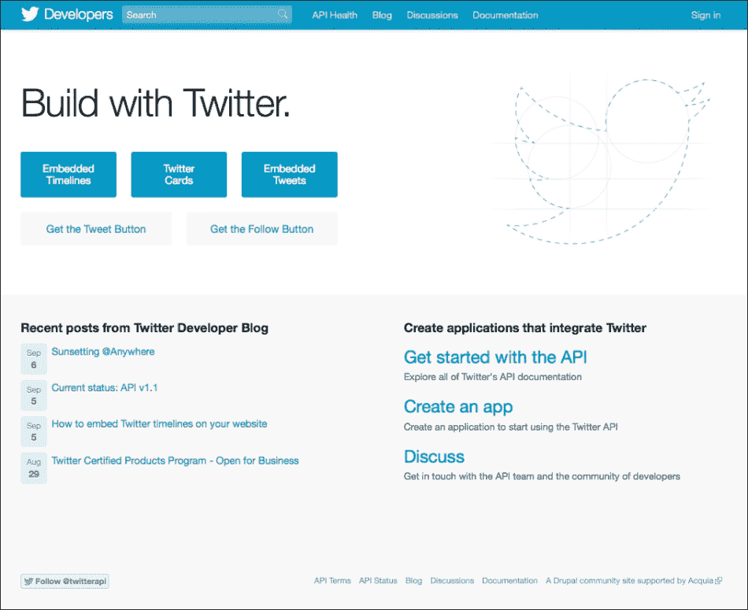

点击**创建应用**链接，并输入您的应用的**名称**、**描述**和**网站**值。**回调 URL**是用户授权使用其账户后应用将被重定向到的地址。在这种情况下，您可以重定向到您的首页。

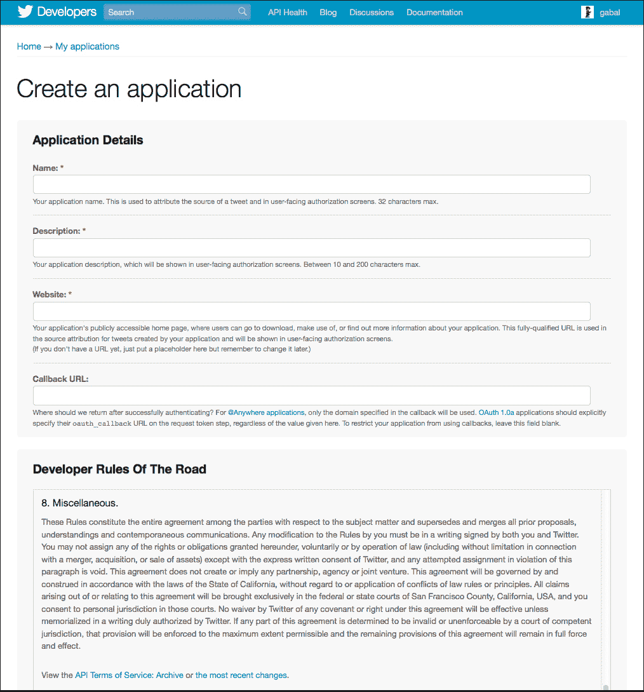

在此之后，您只需接受条款和条件，输入验证码，然后点击**创建您的 Twitter 应用程序**。

现在您已经创建了 Twitter 应用程序，您可以在以下页面查看其详细信息。最重要的参数是**消费密钥**和**消费密钥**，它们用于验证您的应用。

### 小贴士

您不应该向客户端暴露**消费密钥**和**消费密钥**。所有敏感数据都应该加密。

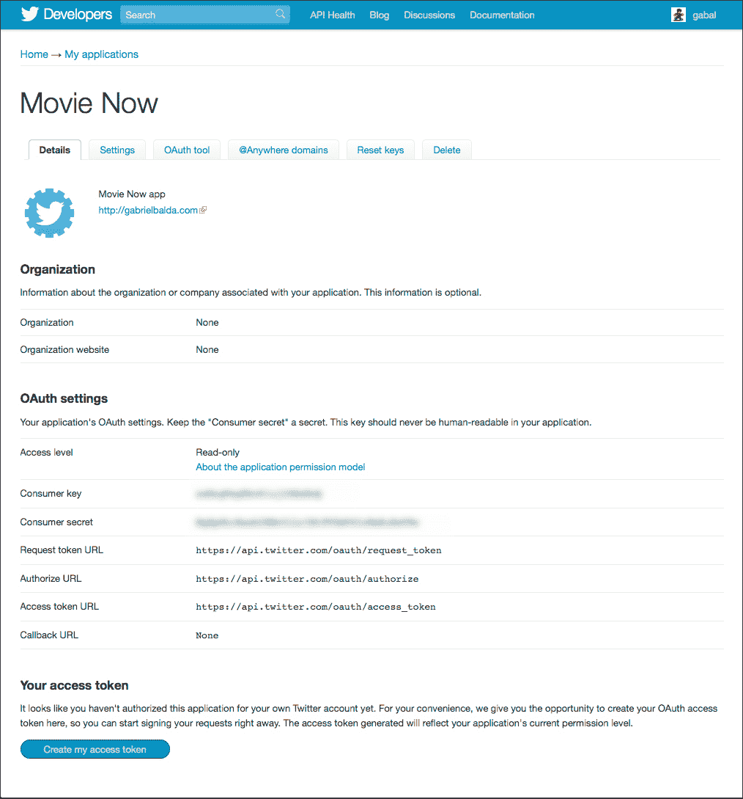

默认情况下，Twitter 的**访问级别**为**只读**。我们可以转到**设置**选项卡，在**应用类型**部分中将**读取和写入**设置为**读和写**，并在**应用图标**部分上传我们的应用图标。

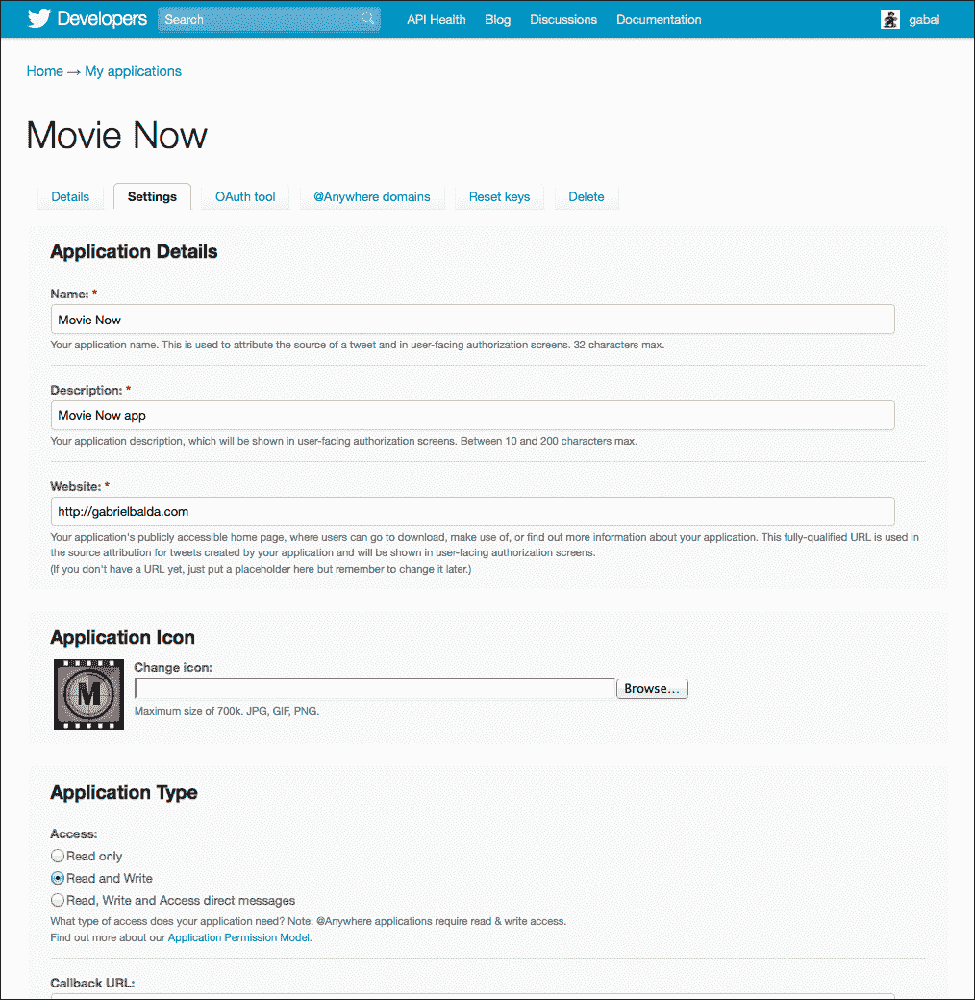

我们已准备好开始使用 Twitter API。

# 如何在 MovieNow 上发推文？

要使用 MovieNow 发推文，我们需要两个功能：Twitter OAuth 身份验证和状态更新（推文）。

我们的示例工作流程很简单：用户使用 MovieNow 右上角的**登录**按钮进行身份验证，然后我们显示用户名和头像，当用户拖动电影以选择它（或在 iPhone 和其他禁用拖动的设备上点击）时，我们显示一个带有电影详情的推文表单，可以通过点击**推文**按钮来发布。

为了简化我们的示例，我们将使用一个包装 Twitter API 并提供异步调用的 Twitter-async PHP 库：[`github.com/jmathai/twitter-async`](https://github.com/jmathai/twitter-async)。

### 小贴士

Jaisen Mathai 的 Twitter-async 文档可以在[`www.jaisenmathai.com/articles/twitter-async-documentation.html`](http://www.jaisenmathai.com/articles/twitter-async-documentation.html)找到。

# 身份验证

下载 Twitter-async 库并将其放入我们在应用程序目录根目录中创建的`lib`文件夹中。我们应该有：

+   `EpiCurl.php` – 使用 PHP `multi_curl`函数抽象并行处理

+   `EpiOauth.php` – 包含 OAuth 身份验证的基本方法

+   `EpiTwitter.php` – 扩展`EpiOauth`并抽象 Twitter API 身份验证和请求

此外，我们可以创建一个名为`secret.php`的 PHP 文件来存储我们的`消费密钥`和`消费密钥`（您可以在 Twitter 应用程序账户页面上找到它们）。

```js
<?php
  $consumer_key = "<PLACE YOUR CONSUMER KEY HERE>";
  $consumer_secret = "<PLACE YOUR CONSUMER SECRET KEY HERE>";
?>
```

我们需要将`index.html`页面扩展名更改为`index.php`以添加 PHP 代码。之后，我们调用 PHP 的`session_start`方法来启动一个新的会话（如果存在一个，则恢复它）。然后，我们导入我们的库。最后，我们可以使用我们的消费者密钥（`$consumer_key`）和消费者密钥（`$consume_secret`）实例化`EpiTwitter`类。

```js
<?php
  session_start();
  include 'lib/EpiCurl.php';
  include 'lib/EpiOAuth.php';
  include 'lib/EpiTwitter.php';
  include 'lib/secret.php';
  $twitterObj = new EpiTwitter($consumer_key, $consumer_secret);
?>
```

`$twitterObj`包含启动新的 Twitter OAuth 会话或使用现有会话获取用户信息所需的信息。为了显示 Twitter 登录或登录信息，我们将在`header`中有两种可能的案例：

如果用户未登录和/或应用程序未授权：

```js
<header>
  <div class="logo">
  </div>
  <div class="twitter-info">
    <a href='url'><div class='twitter-signin'></div></a>
  </div>
</header>
```

如果用户已登录：

```js
<header>
  <div class="logo">
  </div>
  <div class="twitter-info">
    <a href='http://www.twitter.com/username' target='_blank' class='twitter-data'><span>username</span></a>
  </div>
</header>
```

### 小贴士

注意，我们在`header`中添加了类徽标以区分包含 MovieNow 徽标的`divs`。

## 用户未登录和/或应用程序未授权

当我们的用户未登录时，我们想在右上角显示 Twitter 登录页面和/或 MovieNow 的认证页面链接。

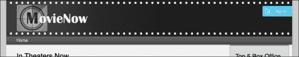

要做到这一点，我们从`$twitterObj`获取授权 URL 并创建一个带有该 URL 的链接：

```js
$url = $twitterObj->getAuthorizationUrl();
echo "<a href='$url'><div class='twitter-signin'></div></a>";
```

如果用户访问此链接并且他们已经登录到 Twitter，他们将直接转到 MovieNow 的授权屏幕：

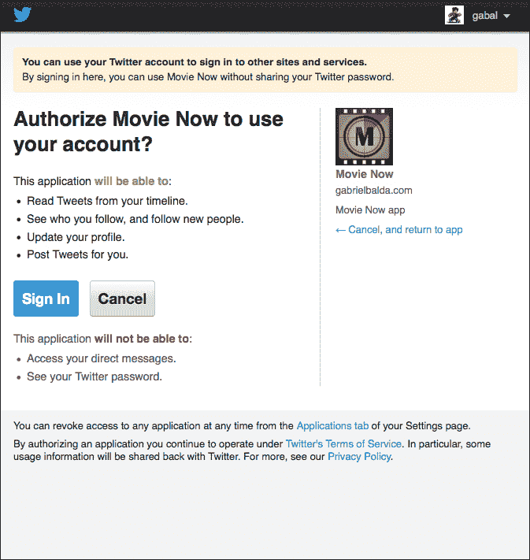

如果用户未登录到 Twitter，他们首先会看到登录屏幕。

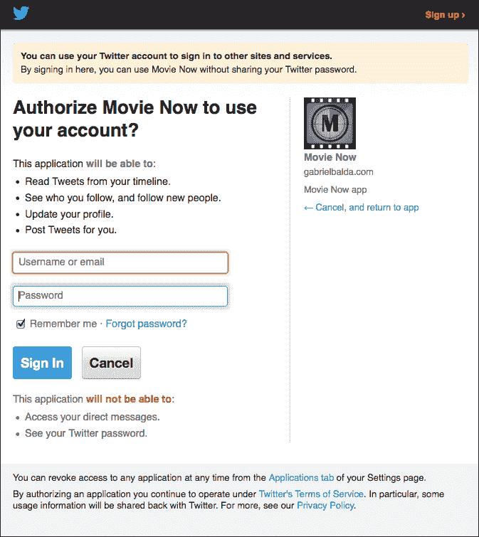

登录后，他们将看到 Twitter MovieNow 授权屏幕。当登录/授权过程结束时，浏览器将重定向到您的 **回调 URL**。

### 小贴士

请记住，您可以通过访问 [`dev.twitter.com/`](https://dev.twitter.com/) 并在 **设置** 选项卡中更改它来随时更改您的 **回调 URL**。

回调 URL 将接收 `oauth_verifier` 和 `oauth_token` 作为参数。我们需要使用 `oauth_token` 来设置用户会话信息。在会话中，我们将存储 `$_SESSION['oauth_token']` 和 `$_SESSION['oauth_token_secret']`。如果它们已设置，则表示用户已经登录。如果没有，我们需要使用 `$_GET['oauth_token']` 来设置我们的会话信息。

首先，我们验证：

```js
if(isset($_GET['oauth_token']) || (isset($_SESSION['oauth_token']) && isset($_SESSION['oauth_token_secret']))){
  if(!isset($_SESSION['oauth_token']) || !isset($_SESSION['oauth_token_secret'])){
    //SET SESSION HERE
  }
}
```

然后，为了设置我们的会话，我们使用 `$twitterObj` 传递 `$_GET['oauth_token']`：

```js
$twitterObj->setToken($_GET['oauth_token']);
```

然后，我们访问令牌信息以设置我们的会话：

```js
$token = $twitterObj->getAccessToken();
$_SESSION['oauth_token']=$token->oauth_token;
$_SESSION['oauth_token_secret']=$token->oauth_token_secret;
```

最后，我们使用从 `getAccessToken` 方法获得的 `oauth_token` 和 `oauth_token_secret` 来设置我们的令牌：

```js
$twitterObj->setToken($token->oauth_token, $token->oauth_token_secret); 
```

## 用户已登录

如果用户已登录，他们希望看到一些信息来告知他们已登录。因此，我们将在页眉的右上角显示他们的 Twitter 头像和用户名。

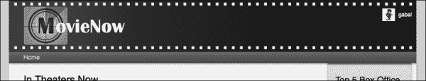

### 小贴士

在任何企业应用程序中，在相同的空间中显示登录和用户已登录信息是一种良好的做法。

现在，我们只需要获取用户信息，因此我们可以使用 `get_accountVerify_credentials` 来获取用户名和头像位置：

```js
$twitterInfo= $twitterObj->get_accountVerify_credentials();
$username = $twitterInfo->screen_name;
$avatar = $twitterInfo->profile_image_url;
```

建立指向 Twitter 用户账户的链接并显示头像：

```js
echo "<a href='http://www.twitter.com/$username' target='_blank' class='twitter-data'><span> $username</span></a>";
```

将所有这些整合在一起，我们有：

```js
<header><div class="logo">
  </div>
  <div class="twitter-info">
  <?php
    if(isset($_GET['oauth_token']) || (isset($_SESSION['oauth_token']) && isset($_SESSION['oauth_token_secret']))){if(!isset($_SESSION['oauth_token']) || !isset($_SESSION['oauth_token_secret'])){$twitterObj->setToken($_GET['oauth_token']);
        $token = $twitterObj->getAccessToken();                                
        $_SESSION['oauth_token']=$token->oauth_token;                                
        $_SESSION['oauth_token_secret']=$token->oauth_token_secret;                                
        $twitterObj->setToken($token->oauth_token, $token->oauth_token_secret);}else{
        $twitterObj->setToken($_SESSION['oauth_token'],$_SESSION['oauth_token_secret']);}
      $twitterInfo= $twitterObj->get_accountVerify_credentials();
      $username = $twitterInfo->screen_name;
      $avatar = $twitterInfo->profile_image_url;
      echo "<a href='http://www.twitter.com/$username' target='_blank' class='twitter-data'><span> $username</span></a>";}else{
      $url = $twitterObj->getAuthorizationUrl();
      echo "<a href='$url'><div class='twitter-signin'></div></a>";
    }
  ?>
  </div>
</header>

```

## 添加一些样式

现在我们已经完成了登录交互，我们可以在 `styles.css` 中添加样式。

首先，我们更改 `header` 的 `div` 样式为 `logo`，以便在 `header` 内部有一个具有不同样式的 `div` 标签。请记住，在 Retina 显示情况下也要更改此设置（`@media only screen and (-webkit-min-device-pixel-ratio:2),only screen and (min-device-pixel-ratio: 2)`）。

`twitter-info` 类是我们用于存储 Twitter 信息的容器，无论用户是否已登录。我们设置 `position` 为 `absolute` 以在屏幕较小的设备上隐藏用户名并仅显示用户头像。

```js
header .twitter-info{
  position:absolute;
  top:20px;
  right:0;
}
```

我们可以删除链接的轮廓：

```js
header .twitter-info a{
  outline:none;
}
```

### 小贴士

您可以使用 `a{outline:none;}` 删除链接的所有轮廓。

添加登录图像和尺寸：

```js
header .twitter-signin{
  width:100px;
  height:36px;
  background:url(../img/twitter-signin.png);
}
```

定位用户头像：

```js
header a.twitter-data img{
  position:absolute;
  left:-38px;
}
```

设置用户名的文本样式信息：

```js
header a.twitter-data{
  line-height:30px;
  color:#fff;
  text-decoration:none;
  font-size:.8em;
  padding-right:10px;
}
```

在 `@media only screen and (max-width: 737px)` 媒体查询内部，我们需要隐藏用户名并显示 Twitter 头像，如果用户未登录。

隐藏 `twitter-info` 块的一部分：

```js
header .twitter-info{
  right:-67px;
}
```

移动头像：

```js
header a.twitter-data img{
  left:-88px;
}
```

隐藏用户名：

```js
header a.twitter-data span{
  display:none;
}
```

现在，我们的 Twitter 登录过程在屏幕较小的设备上应该看起来像以下截图：


在您点击顶部的 Twitter 按钮后，您将被重定向到 Twitter 认证页面（如果您未登录到 Twitter，它将首先重定向您到登录页面）。


如果你授权应用程序，则下一个屏幕将显示你的 Twitter 头像在页面的顶部部分。

# 发布推文

我们的用户现在已认证。下一步是允许发布关于电影的推文。在这种情况下，让我们使用 AJAX 调用一个接收要推文的消息作为 `tweet` 参数的服务。

## 服务

让我们创建一个名为 `tweet.php` 的文件，并将其存储在我们的应用程序的根目录中。导入 Twitter-async 库和 `secret.php` 配置文件：

```js
include 'lib/EpiCurl.php';
include 'lib/EpiOAuth.php';
include 'lib/EpiTwitter.php';
include 'lib/secret.php';
```

我们将返回一个 JSON 对象，指示推文是否成功发布。让我们定义一个变量 `$result` 并将其默认状态设置为 `ok`。

```js
$result = array('status' => 'ok');
```

我们可以使用我们的应用程序信息和验证会话来实例化 `EpiTwitter`。如果不存在会话，将状态设置为 `error`：

```js
  $twitterObj = new EpiTwitter($consumer_key, $consumer_secret);
  if(isset($_SESSION['oauth_token']) && isset($_SESSION['oauth_token_secret'])){
  //TWEET
  }else{
    $result["status"]="error";
  }
```

如果会话存在，设置 `$twitterObj` 令牌并验证凭证：

```js
  $twitterObj->setToken($_SESSION['oauth_token'],$_SESSION['oauth_token_secret']);
  $twitterInfo= $twitterObj->get_accountVerify_credentials();
```

如果我们有 `tweet` 参数，我们将转义我们的消息并调用 `post_statusesUpdate` API，将推文放在 `status`，一个索引数组中。然后我们可以将响应保存到 `$temp` 变量中。

```js
$msg = stripcslashes($_REQUEST['tweet']);
$update_status = $twitterObj->post_statusesUpdate(array('status' => $msg));
$temp = $update_status->response;
```

最后，我们验证 `$temp` 是否包含错误，并将 `$result` 作为 JSON 返回：

```js
if($temp["error"])$result["status"]="error";
echo json_encode($result);
```

将所有这些整合在一起，我们应该有：

```js
<?php
  include 'lib/EpiCurl.php';
  include 'lib/EpiOAuth.php';
  include 'lib/EpiTwitter.php';
  include 'lib/secret.php';
  $result = array('status' => 'ok');
  $twitterObj = new EpiTwitter($consumer_key, $consumer_secret);
  if(isset($_SESSION['oauth_token']) && isset($_SESSION['oauth_token_secret'])){
    $twitterObj->setToken($_SESSION['oauth_token'],$_SESSION['oauth_token_secret']);
    $twitterInfo= $twitterObj->get_accountVerify_credentials();
    if($_REQUEST['tweet']){
      $msg = stripcslashes($_REQUEST['tweet']);
      $update_status = $twitterObj->post_statusesUpdate(array('status' => $msg));
      $temp = $update_status->response;
    }
  }else{
    $result["status"]="error";
  }
  if($temp["error"])$result["status"]="error";
  echo json_encode($result);
?>
```

## 应用 HTML

我们将显示我们的推文表单作为一个带有幕布的模态窗口，以遮挡应用的其他部分。我们将首先在 `index.php` 的末尾添加推文表单的代码。接下来，我们将设置幕布以覆盖我们的页面（我们将将其样式设置为黑色并带有透明度）：

```js
<div class="modal-background-color"></div>
```

对于我们的模态区域，我们将创建一个部分：

```js
<section class="modal-background"></section>
```

### 提示

对于 `modal-background-color`，我们不使用 `section`，因为它没有任何语义信息。

我们将定义推文窗口为一个 `div`：

```js
<div class="tweet"></div>
```

然后，我们可以添加一个带有标题和关闭按钮的栏：

```js
<div class="tweet">
  <div class="tweet-bar">
    <h2>Tweet</h2>
    <div id="close-tweet"></div>
  </div>
</div>
```

最后，我们有我们的推文表单本身。注意，我们将 `textarea` 的 `maxlength` 属性设置为 140，因为推文不能超过 140 个字符。

### 提示

`textarea` 元素中的 `maxlength` 属性在 Internet Explorer 9 或更早版本中不受支持。这是因为它不是 HTML 4.01 规范中 `textarea` 的标准，但它后来被添加到 HTML5 中。

```js
<form id="twitter">
  <textarea  name="tweet" rows="5" id="tweet" title="Tweet Required!" maxlength="140" required></textarea>
    <div class="char-counter"><input type='submit' value='tweet' name='submit' id='tweet-submit' />
      <div id="count">140</div>
  </div>
</form>
```

将所有这些整合在一起，我们有：

```js
<div class="modal-background-color"></div>
<section class="modal-background">
  <div class="tweet">
    <div class="tweet-bar">
      <h2>Tweet</h2>
      <div id="close-tweet"></div>
    </div>
    <form id="twitter">
      <textarea  name="tweet" rows="5" id="tweet" title="Tweet Required!" maxlength="140" required></textarea>
      <div class="char-counter"><input type='submit' value='tweet' name='submit' id='tweet-submit' />
        <div id="count">140</div>
      </div>
    </form>
  </div>
</section>
```

注意，我们使用 `required` 属性来表示此字段不能为空。`required` 属性是一个用于表单验证的 HTML5 属性。我们还使用 `maxlength` 来限制允许的字符数。

```js
<textarea  name="tweet" rows="5" id="tweet" title="Tweet Required!" maxlength="140" required></textarea>
```

## 添加更多样式

我们已经有了我们的推文窗口的 HTML 结构，但我们还没有添加样式。我们的最终设计应该看起来像以下截图：

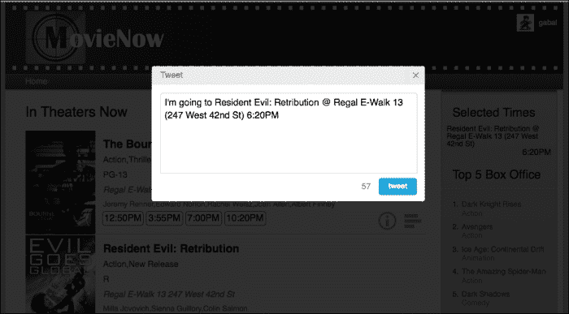

为了实现这一点，我们将在 `styles.css` 中添加一些样式。

1.  我们将 `modal-background-color` 设置为使用 `fixed` 定位和 `z-index: 5000` 来覆盖我们的页面。这个背景应该是黑色，透明度为 80%。

    ```js
    .modal-background-color{
      bottom: 0;
      left: 0;
      right: 0;
      top: 0;
      background-color:#000;
      opacity: 0.8;
      display:none;
      -moz-opacity: 0.8;
      -khtml-opacity: 0.8;
      filter: alpha(opacity=80);
      -ms-filter: "progid:DXImageTransform.Microsoft.Alpha(Opacity=80)";	
      position: fixed;
      z-index: 5000;
    }
    ```

    ### 提示

    虽然正在使用`-ms-filter`来支持较老版本的 Internet Explorer，但这是一种微软的专有解决方案，并不遵循标准。

1.  我们希望`modal-background`位于`modal-background-color`之上，因此我们使用`z-index: 5100`。默认情况下，这两个区域都应通过`display:none`隐藏，如下面的代码片段所示：

    ```js
    .modal-background{
      bottom: 0;
      left: 0;
      right: 0;
      top: 0;
      display:none;
      position: fixed;
      z-index: 5100;
    }
    ```

1.  我们的`tweet`区域为白色，带有圆角，并使用`margin:110px auto`进行居中：

    ```js
    .tweet{
      background-color:#fff;
      border-radius:4px 4px;
      -moz-border-radius:4px 4px;
      -webkit-border-radius:4px 4px;
      -o-border-radius:4px 4px;
      width:470px;
      margin:110px auto;
    }
    ```

1.  然后将 tweet 标题向左浮动并添加一些填充：

    ```js
    .tweet h2{
      float:left;
      padding:8px 15px 6px;
    }
    ```

1.  对于我们的文本区域`#tweet`，我们移除轮廓，添加一些填充和边距，并设置圆角边框样式和字体样式：

    ```js
    #tweet{
      outline:none;
      padding:5px 5px;
      resize:none;
      width:430px;
      margin:15px 15px 8px;
      border-radius:4px 4px 0 0;
      -moz-border-radius:4px 4px 0 0;
      -webkit-border-radius:4px 4px 0 0;
      -o-border-radius:4px 4px 0 0;
      border:1px solid #d3d3d3;
      font-size:1em;
      line-height:1.4em;
    }
    ```

1.  默认情况下，我们的提交按钮`#tweet-submit`是灰色：

    ```js
    #tweet-submit{
      padding:6px 12px;
      background-color:#f6f6f6;
      font-size:.8em;
      border-radius:4px 4px;
      -moz-border-radius:4px 4px;
      -webkit-border-radius:4px 4px;
      -o-border-radius:4px 4px;
      border:1px solid #d3d3d3;
      cursor:pointer;
      color:#888;
      font-weight:bold;
    }
    ```

1.  添加一个`active`类来设置活动时的样式，用蓝色渐变、蓝色边框和白色字体来着色我们的按钮：

    ```js
    #tweet-submit.active{
      background:linear-gradient(top, #33BCEF, #019AD2);
      background:-o-linear-gradient(top, #33BCEF, #019AD2);
      background:-moz-linear-gradient(top, #33BCEF, #019AD2);
      background:-webkit-linear-gradient(top, #33BCEF, #019AD2);
      background:-ms-linear-gradient(top, #33BCEF, #019AD2);
      border-color:#057ed0;
      color:#fff;
    }
    ```

1.  在鼠标悬停时，使其稍微暗一些：

    ```js
    #tweet-submit.active:hover{
      background:linear-gradient(top, #2DADDC, #0271BF);
      background:-o-linear-gradient(top, #2DADDC, #0271BF);
      background:-moz-linear-gradient(top, #2DADDC, #0271BF);
      background:-webkit-linear-gradient(top, #2DADDC, #0271BF);
      background:-ms-linear-gradient(top, #2DADDC, #0271BF);
    }
    ```

1.  将字符计数器和提交按钮向右浮动并移除轮廓：

    ```js
    #tweet-submit,#count{
      float:right;
      outline:none;
    }
    ```

1.  设置字符计数器的字体样式：

    ```js
    #count{
      line-height:30px;
      padding-right:14px;
      color:#999;
      font-size:.9em;
    }
    ```

1.  将`close.png`精灵图像添加到`#close-tweet`按钮，并设置其样式：

    ```js
    #close-tweet{
      cursor:pointer;
      border-left:1px solid #ccc;
      width:30px;
      height:30px;
      float:right;
      background-image:url(../img/close.png);
    }
    ```

1.  在鼠标悬停时移动图片：

    ```js
    #close-tweet:hover{
      background-color:#E5E5E5;
      background-position:0 -30px;
    }
    ```

1.  为包含标题和关闭按钮的栏添加不同的样式。注意我们收圆了左上角和右下角：

    ```js
    .tweet-bar{
      border-radius:4px 4px 0 0;
      -moz-border-radius:4px 4px 0 0;
      -webkit-border-radius:4px 4px 0 0;
      -o-border-radius:4px 4px 0 0;
      background-color:#ececec;
      color:#666;
      font-size:.9em;
      border-bottom:1px solid #ccc;
      overflow:hidden;
    }
    ```

1.  最后，为包含 tweet 提交按钮和字符计数器的区域设置`height`：

    ```js
    .char-counter{
      height:40px;
      padding:0 14px;
    }
    ```

1.  对于移动设备，使用`@media only screen and (max-width: 737px)`媒体查询为文本区域和 tweet 窗口添加不同的`width`：

    ```js
    .tweet{
      width:300px;
    }
    #tweet{
      width:258px;
    }
    ```

在屏幕较小的设备上，我们的 tweet 窗口应类似于以下截图：

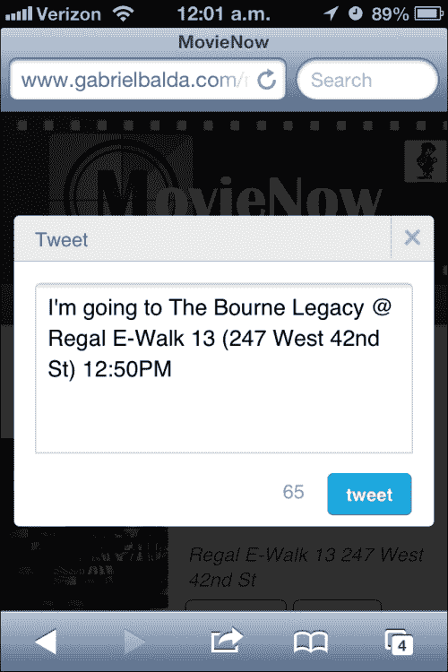

## 添加 JavaScript 交互

现在我们需要添加相应的 JavaScript 来连接这些点。让我们在`js`文件夹中创建一个新的文件`movienow.tweet.js`。在`index.php`中，我们在`movienow.draganddrop.js`之前导入该文件：

```js
<script src="img/ios-orientationchange-fix.js"></script>
<script src="img/jquery-1.8.0.min.js"></script>
<script src="img/jquery.xdomainajax.js"></script>
<script src="img/three.js"></script>
<script src="img/movienow.tweet.js"></script><script src="img/movienow.draganddrop.js"></script>
<script src="img/movienow.charts.js"></script><script src="img/movienow.geolocation.js"></script>
<script src="img/movienow.js"></script>
```

### 提示

如您所注意到的，我们使用了一堆 JavaScript 库，实现最小化技术以减少我们的 JavaScript 和 CSS 文件的大小和请求数量是一个好习惯。

定义主要代码结构并添加一个变量`twitterReady`来验证 tweet 窗口是否已初始化：

```js
var movienow = movienow || {};
movienow.tweet = (function(){
  var that = this;
  var twitterReady = false;
})();
```

隐藏和显示功能将由`showTweetArea`和`hideTweetArea`函数处理。对于`showTweetArea`，我们验证`twitterReady`是否为`true`；如果不是，我们调用`initTweet`函数来设置 Twitter 窗口事件并将`true`赋给`twitterReady`。

我们可以将`message`（带有默认文本）分配给文本区域并显示 tweet 窗口。如果用户未登录，我们显示一个警告。

```js
this.showTweetArea = function(title, time) {if(!twitterReady){
    that.initTweet();twitterReady=true;
    }
  if($(".twitter-data").length>0){
    var message = "I'm going to "+title+" "+time;
    $("#tweet").val(message);
    that.updateCount();
    $(".modal-background").css("display", "block");
    $(".modal-background-color").css("display", "block");
    $("html,body").css("overflow","auto");}
else{
    alert("Please login in twitter to tweet this");}
  };
```

### 提示

在我们的企业应用中显示通知和错误的一个更优雅的方法是使用 HTML 定义自定义模态窗口，并用 CSS 进行样式化。此外，使用模板引擎（如位于[`mustache.github.com`](http://mustache.github.com)的 Mustache）来实现此解决方案也是可能的。

注意我们设置了`$("html,body").css("overflow","auto")`来隐藏浏览器滚动条。

`hideTweetArea`方法隐藏推文窗口并恢复浏览器滚动条：

```js
this.hideTweetArea = function() {
  $(".modal-background").css("display", "none");
  $(".modal-background-color").css("display", "none");
     $("html,body").css("overflow","hidden");
}
```

要更新字符计数器，我们添加一个`updateCount`方法。我们提取`#tweet`文本区域消息并验证其长度是否为 140 个字符。只有当可以推文时，我们才将`active`类添加到我们的提交按钮上。

```js
this.updateCount = function(){
  var info=$("#tweet").val();
  var count= 140 - info.length;
  $('#count').html(count);
  if(count===140||count<0){
    $('#tweet-submit').removeClass("active");
  }else{
    $('#tweet-submit').addClass("active");
  }
};
```

实现此功能的本地替代方法是使用输入字段中的`disabled`属性，而不是添加和删除`active`类。

我们的初始化方法`initTweet`添加了必要的事件：

```js
this.initTweet = function() {
  $("#tweet").keyup(that.updateCount);
     $("#twitter").submit(that.tweet);
  $("#close-tweet").click(that.hideTweetArea);
};
```

最后，我们创建了一个方法来调用我们的 PHP 服务：

```js
this.tweet = function(event) {
  if($("#twitter")[0].checkValidity()){
    $.ajax({
      url: 'tweet.php',
      data: $("#twitter").serialize(),
      success: function(info){
        var data = that.objectifyJSON(info);
        if(data.status!="ok"){
          alert("Ops! There was an error sending your tweet, please try again.");
        }else{
          that.hideTweetArea();
        }
      }
    });
  }
  return false;
};
```

`checkValidity`方法是一个 HTML5 JavaScript 函数，它允许我们验证字段是否有效。在我们的例子中，由于文本区域是必填的，验证就是它不能为空。

由于我们正在使用 AJAX，我们在最后添加`return false`以避免提交时页面刷新。

### 小贴士

通常，我们需要从表单中提取所有输入并构造一个数据参数用于我们的 AJAX 调用。jQuery 中有一个有用的函数叫做`serialize`，它可以为我们构造这个参数。

把所有这些都放在一起，我们应该有：

```js
var movienow = movienow || {};
movienow.tweet = (function(){
  var that = this;
  var twitterReady = false;
  this.initTweet = function() {
    $("#tweet").keyup(that.updateCount);
    $("#twitter").submit(that.tweet);
    $("#close-tweet").click(that.hideTweetArea);
  };
  this.tweet = function(event) {
    if($("#twitter")[0].checkValidity()){
      $.ajax({
        url: 'tweet.php',
        data: $("#twitter").serialize(),
        success: function(info){
          var data = that.objectifyJSON(info);
          if(data.status!="ok"){
            alert("Ops! There was an error sending your tweet, please try again.");
          }else{
            that.hideTweetArea();
          }
        }
      });
    }
    return false;
  };
  this.updateCount = function(){
    var info=$("#tweet").val();
    var count= 140 - info.length;
    $('#count').html(count);
    if(count==140||count<0){
      $('#tweet-submit').removeClass("active");
    }else{
      $('#tweet-submit').addClass("active");
    }
  };
  this.showTweetArea = function(title, time) {
    if(!twitterReady){
      that.initTweet();
      twitterReady=true;
    }
    if($(".twitter-data").length>0){
      var message = "I'm going to "+title+" "+time;
      $("#tweet").val(message);
      that.updateCount();
      $(".modal-background").css("display", "block");
      $(".modal-background-color").css("display", "block");
      $("html,body").css("overflow","auto");
    }else{
      alert("Please login in twitter to tweet this");
    }
  };
  this.hideTweetArea = function() {
    $(".modal-background").css("display", "none");
    $(".modal-background-color").css("display", "none");
    $("html,body").css("overflow","hidden");
  }
})();
```

### 小贴士

`checkValidity`在所有浏览器中都不是可用的。当它不可用时，建议编写自己的`checkValidity`函数以支持跨浏览器。你可以在[`perplexed.co.uk/5201_making_html5_form_backwards_compatible.htm`](http://perplexed.co.uk/5201_making_html5_form_backwards_compatible.htm)页面上查看这种解决方案的一种方法。

剩下的就是在`movienow.dragnaddrop.js`中添加一个调用。在我们的拖放事件监听器内部，我们添加：

```js
that.showTweetArea(event.dataTransfer.getData('Title'),event.dataTransfer.getData('Time'));
```

因此，我们现在有：

```js
$('#dropzone')[0].addEventListener('drop', function(event) {
  if (event.stopPropagation) event.stopPropagation();
  if (event.preventDefault) event.preventDefault();
  var html='<div class="selected-time">';
  html+='<div class="title">'+event.dataTransfer.getData('Title')+'</div>';
  html+='<div class="time">'+event.dataTransfer.getData('Time')+'</div>';		
  html+='</div>';
  $('#dropstage').append(html).show();
that.showTweetArea(event.dataTransfer.getData('Title'),event.dataTransfer.getData('Time'));
  return false;
});
```

对于移动和非拖放启用设备，我们添加：

```js
var iOS = !!navigator.userAgent.match('iPhone OS') || !!navigator.userAgent.match('iPad');
if(('draggable' in document.createElement('span'))&&!iOS){
  //PREVIOUS CODE
}else{
  $(".showtime").bind('click', function(event){
    var info=$(this)[0].title;
    var time=$(this).html();
    that.showTweetArea(info,time);
  });
}
```

我们的推文系统已经准备好了。如果我们选择一部电影（根据设备是拖动还是点击），我们可以通过点击**推文**按钮来推文。

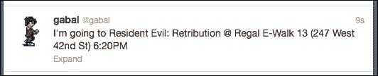

## 跨浏览器表单验证支持

就像其他 HTML5 特性一样，表单验证在各个浏览器之间并不一致。在我们的例子中，如果我们选择一部电影，删除推文窗口中的文本区域内容，然后尝试提交，每个浏览器的行为都会不同。

在 Firefox 中，我们看到的表单验证是一个红色边框和一条消息。

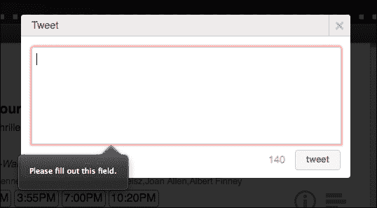

在 Chrome 中，表单验证使用标题来显示**推文必填！**消息，但不显示红色边框。

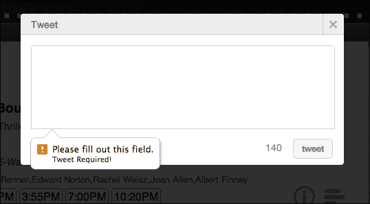

只有 Safari 阻止提交操作。

即使表单验证变得一致，每个浏览器的用户界面元素也完全不同（你会在 Firefox 中注意到一个黑色工具提示，在 Chrome 中则是一个带有图标的白色工具提示）。目前，可以通过从头开始使用 JavaScript 或使用 jQuery 插件（[`docs.jquery.com/Plugins/Validation`](http://docs.jquery.com/Plugins/Validation)）来进行验证。

要禁用 HTML5 表单验证，请将`novalidate`属性添加到表单中。

### 小贴士

即使数据在客户端进行了验证，也必须在服务器端进行验证。请记住，对于某些用户来说，更改 JavaScript 代码相当容易。 

# 新的输入字段类型

HTML5 为表单引入了新的输入类型。这些类型允许更好的控制和验证，但遗憾的是，它们并不在所有现代浏览器中得到完全支持。它们如下所示：

+   `color` 用于选择颜色

+   `date` 允许选择日期

+   `datetime` 允许选择日期和时间

+   `datetime-local` 允许选择日期和时间，但不包括时区

+   `email` 用于应包含电子邮件地址的输入字段

+   `month` 允许选择月和年

+   `number` 用于具有数值的输入

+   `range` 以滑块的形式呈现，允许在数字范围内选择值

+   `search` 用于搜索字段

+   `tel` 用于输入电话号码

+   `time` 允许选择时间

+   `url` 用于应包含有效 URL 的输入

+   `week` 允许选择周和年

# 摘要

随着众多社交网络和服务通过 API 提供数据，我们可以通过补充更多数据和功能来丰富我们的企业管理应用。此外，您可以使用 OAuth 身份验证为用户提供替代身份验证方法。最后，HTML5 表单验证和新的输入类型似乎还不够成熟，不能作为企业管理应用的解决方案；相反，应该实施回退 JavaScript 解决方案，以在浏览器之间提供相同的体验。我们希望浏览器开发者尽快采用 HTML5 规范的这一部分，因为它将缩短开发周期，提高表单数据的可靠性，并为用户提供更好的体验。

在下一章中，我们将介绍 Web Workers 以及它们通过添加运行后台进程和多线程应用的能力，为企业管理应用带来的强大功能。
