# 第十一章. 完成工作：调试您的应用

调试过程在开发过程中可能需要相当多的时间。可能会有不可预见的行为、边缘情况，甚至需要找到并解决的错误。因此，尽可能优化是很重要的，而最重要的第一步是选择正确的工具。任何开发过程都必须涉及测试和调试；即使您的应用程序按预期完美运行，您也应该执行测试用例并分析性能，以确保在您使其发展和引入新功能时其完整性。本章涵盖了在企业应用程序中进行调试和分析性能的一系列工具。

本章将涵盖以下内容：

+   要寻找什么

+   使用哪些工具

+   玩转 HTML 和 CSS

+   使用 JavaScript 逐步进行

+   移动调试

+   Web 调试代理

# 要寻找什么

客户端调试过程集中在浏览器解释的元素上。除非我们使用外部插件（如 Adobe Flash Player），否则我们需要调试：

+   HTML 以查找不正确的样式或测试标签结构的更改

+   CSS 以验证样式的正确性或测试对其的更改

+   使用 JavaScript 验证代码执行，查找可能的错误，或测试代码中的更改

此外，我们还应该测试资源的加载时间（`media`、`html`、`css`和`js`文件）以及 JavaScript 的执行时间（性能分析）。

# 使用哪些工具

大多数现代浏览器现在都提供了调试 Web 应用程序的工具。由于跨浏览器兼容性很重要，我们需要了解它们是如何工作的。一般来说，每个调试器都提供以下功能：

+   实时检查和修改 HTML，并在页面上选择视觉元素，显示其 HTML 代码的等效项（**HTML** | **元素**）

+   实时检查和修改 CSS（**HTML** | **元素**或**CSS** | **资源** | **样式**）

+   实时检查和修改（或声明）JavaScript，并创建断点以停止代码执行并逐步检查（**控制台** | **脚本** | **源代码**）

+   分析每个资源的加载时间（**网络** | **Net** | **时间线** | **工具**）

让我们来看看一些最受欢迎的浏览器调试工具：

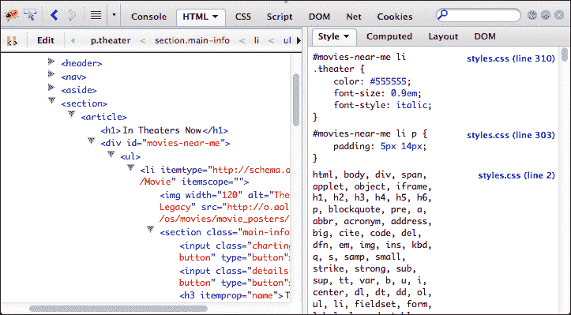

Firefox 15.0.1 Firebug（插件）

### 小贴士

Firebug 插件默认未安装在 Firefox 上。您需要访问[`getfirebug.com/`](http://getfirebug.com/)，并在 Firefox 中点击**安装 Firebug**。

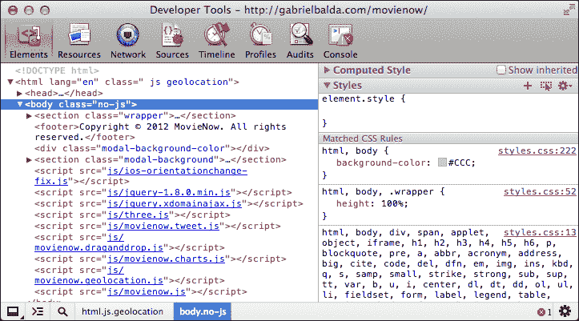

Chrome 22.0.1229.79 开发者工具

对于我们的目的，因为它是最稳健的工具之一，我们将介绍 Firefox 的 Firebug 插件。许多相同的基本概念（HTML 检查、脚本调试、控制台的使用）存在于其他浏览器提供的开发者工具中。

### 注意

对于 Internet Explorer 来说，有许多调试工具可用。除了 Internet Explorer 8 和 9 中包含的开发者工具外，还有 DebugBar ([`www.debugbar.com/`](http://www.debugbar.com/)) 和 dynaTrace ([`www.compuware.com/application-performance-management/ajax-performance-testing.html`](http://www.compuware.com/application-performance-management/ajax-performance-testing.html))。

# 操纵 HTML 和 CSS

在 Firebug 中，您可以使用**HTML**选项卡来探索您的 HTML DOM 对象：

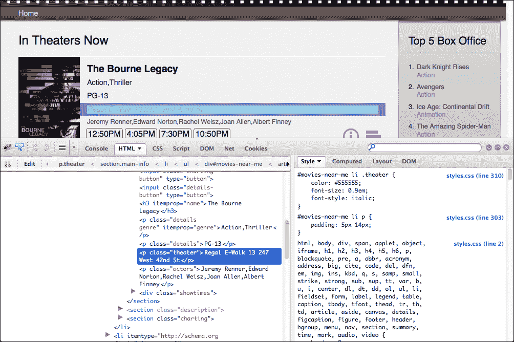

将鼠标悬停在每个标签上，可以看到其对应的渲染元素被突出显示。如果您决定在渲染页面上导航，可以点击**检查**按钮。


**检查**按钮允许您选择渲染页面的区域以查看相应的 HTML 代码。

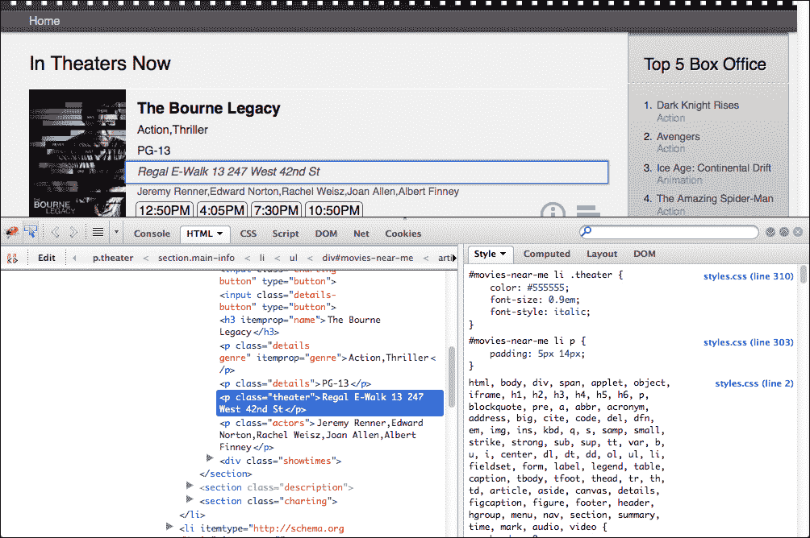

点击**编辑**，可以在浏览器本身内修改您的 HTML 代码。当然，您并不是在修改页面本身，而是在修改浏览器的本地副本。渲染的页面会自动根据修改而改变。这在尝试修改 HTML 结构并在代码中实现之前获得即时反馈非常有用。

右侧的面板允许我们查看所选 DOM 对象的样式，包括对文件和行号的引用（在右侧以蓝色突出显示）。**样式**选项卡按优先级分组样式；您可以通过双击在此选项卡中修改或创建属性或修改选择器。

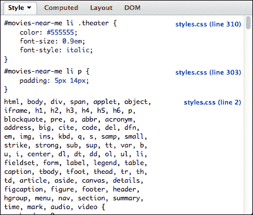

**计算样式**列出了计算样式，它是浏览器、用户和作者应用样式的合并，其中相对值被计算。例如，如果一个`div`标签的样式是`width:50%`，并且它被设置为`width:760px`的`div`包围，那么计算样式将是`width:380px`。

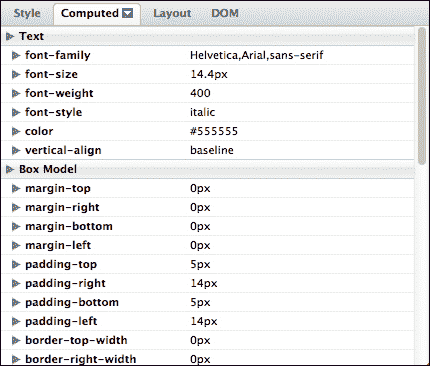

**布局**显示基于 CSS 盒模型应用的填充、边框和边距的图形表示。

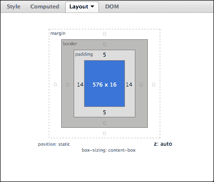

**DOM**显示所选 DOM 的对象属性。这里有很多信息，包括作为“可浏览”树的`document`对象和查看 JavaScript 全局命名空间的能力，以查看哪些对象已被加载。

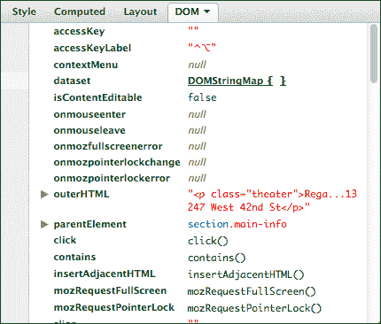

### 小贴士

您可以使用**CSS**选项卡来修改每个`css`文件中的样式。

# 步步为营学习 JavaScript

**脚本**选项卡允许您检查所有使用的 JavaScript 文件。

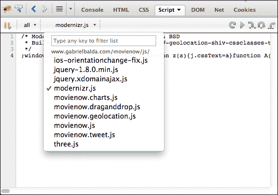

在选择您要检查的文件后，您可以执行 JavaScript 代码的逐步执行。找到您想要停止的行，并点击行号以创建断点。一个表示断点的图形将出现。

### 小贴士

在**脚本**标签中查看时，压缩后的 JavaScript 文件通常显示为单行。在页面的调试版本中包含“未压缩”文件是有用的。

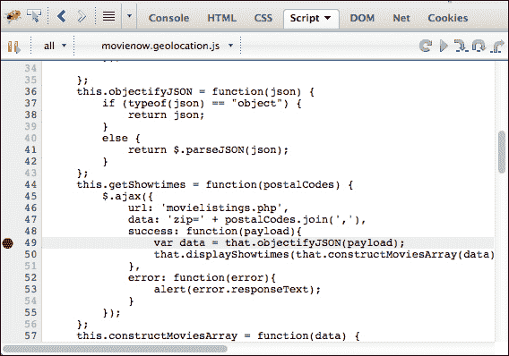

现在刷新浏览器，你将看到执行如何在该行停止。

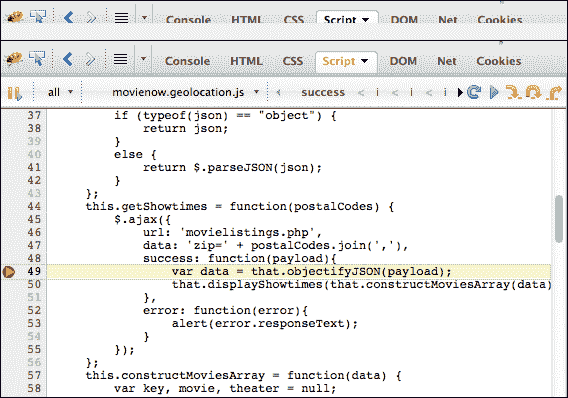

右侧的面板将显示当前作用域中可用的变量。你可以使用它来更改变量值，输入自己的变量，或检查表达式。

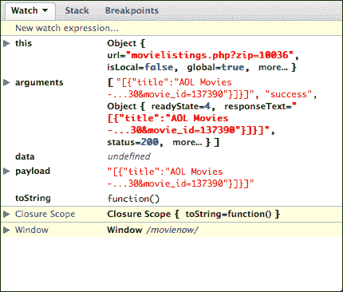

在右上角，你可以找到继续代码执行的控制按钮：


播放符号继续代码执行，指向下的黄色小箭头继续执行到下一行，如果调用了一个函数，则会进入该函数，指向下的黄色大箭头继续执行到当前执行上下文中的下一行，跳过被调用的函数，最后一个黄色箭头则从函数中退出。当然，你可以始终将鼠标悬停在每个按钮上以获取这些信息，因为通常每个按钮都有一个工具提示。这允许你控制如何遍历你的代码。你可以在想要了解特定代码块如何评估的地方设置断点来停止执行。然后你可以逐行执行代码，执行你不需要关心的方法调用，或者完全退出到调用方法。在每一步，你都可以看到设置了哪些变量，当前作用域中有什么可用，真正地了解你的代码在做什么。

## JavaScript 控制台

**控制台**标签记录 JavaScript 错误、警告和 Ajax 调用。你可以在 JavaScript 代码中使用以下方式强制代码写入控制台：

```js
console.log("CONTENT TO WRITE"); 
```

这特别有用，可以输出消息以了解代码的执行情况。你可以写入调试语句来显示特定变量的值，或者只是指示特定的代码块正在执行。你还可以打印对象并在 Firebug 中检查它们。

控制台对象包括其他有用的调试方法，如`info()`、`warn()`和`error()`，以提供更增强的调试反馈。

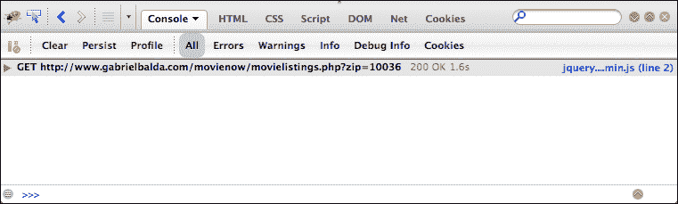

### 小贴士

在将代码部署到生产环境时，删除或注释掉所有`console`调用是一个好的实践，因为一些浏览器不支持它，这会导致执行中断并完全停止。一个解决方案是创建一个脚本，删除这些行，并将其包含在构建过程中。通常，这样的脚本还会打包和压缩你的代码。

控制台的一个有趣特性是它允许你在实时环境中编写和执行代码。你可以在底部找到一个提示，允许你输入代码。

假设你想要打印具有`movies-near-me` ID 的对象中的所有图像，你可以在控制台中编写以下代码：

```js
$("#movies-near-me img").each(function(){console.log($(this).attr("src"))})
```

您应该看到以下结果：

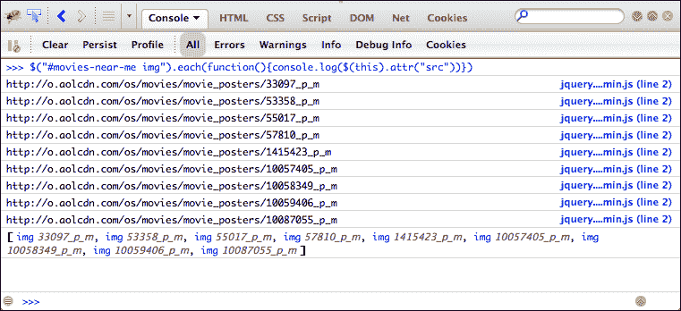

## 分析加载时间

**网络**选项卡编译了所有网络调用，包括状态、域名、文件大小、IP 和加载时间。您可以使用此部分来验证性能问题所在。

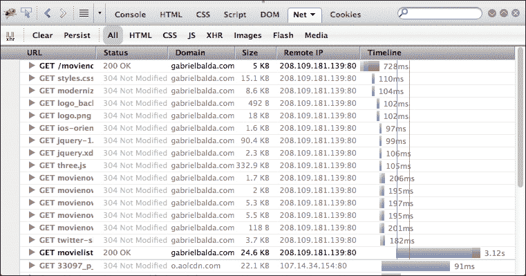

## JavaScript 性能分析

**控制台**选项卡提供了一个分析我们 JavaScript 代码性能的工具。要执行分析，请单击**分析**按钮，然后执行您的 JavaScript 操作（或刷新页面以分析主要 JavaScript 执行），然后再次单击**分析**按钮。

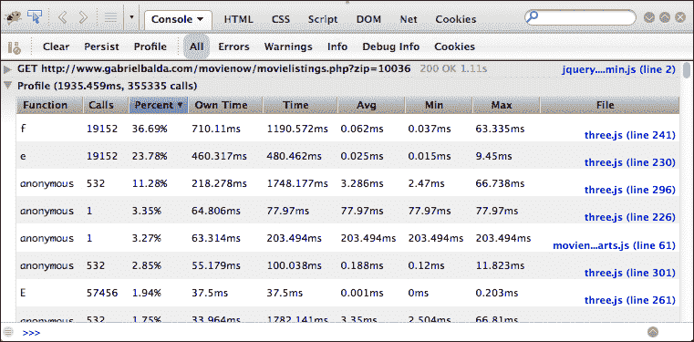

如果函数被注册为**匿名**，无需担心。**文件**字段给出了确切的代码行。

# 移动调试

在移动网络应用程序中调试 HTML、CSS 和 JavaScript 可能会很痛苦，尤其是如果我们使用的是触摸设备。远程调试提供了一种使用您的桌面或笔记本电脑在移动设备上测试您的企业网络应用程序的方法。

Chrome 支持通过 USB 为 Android 设备进行远程调试：[`developers.google.com/chrome/mobile/docs/debugging`](https://developers.google.com/chrome/mobile/docs/debugging)。

Firefox 15 也为 Android 引入了远程调试：[`hacks.mozilla.org/2012/08/remote-debugging-on-firefox-for-android/`](https://hacks.mozilla.org/2012/08/remote-debugging-on-firefox-for-android/)

在版本 6 之前，iOS 设备内部有一个简单的调试界面。

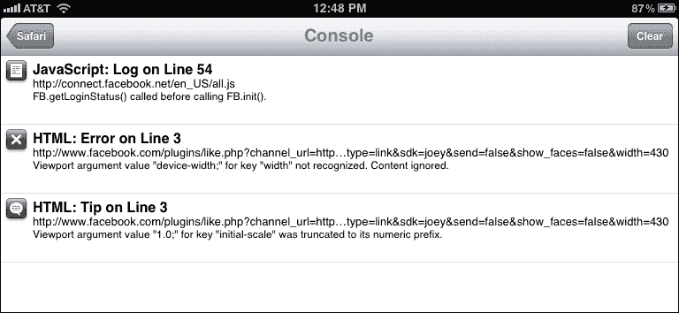

Safari 6.0.1（仅限 Mac）和 iOS 6 支持远程调试。要在任何 iOS 6 中开始远程调试：

1.  在设备（iPhone、iPad 或 iPod）中，转到**设置** | **Safari** | **高级**并启用**Web 检查器**选项。

1.  在 Mac 计算机上打开 Safari。

1.  使用您的 iOS 设备上的 Safari 打开要调试的 Web 应用程序。

1.  使用 USB 线缆将设备连接到您的 Mac 计算机。

1.  如果您在 Safari（Mac）中没有**开发**菜单项，请打开**Safari** | **偏好设置** | **高级**并勾选**在菜单栏中显示开发菜单**。

1.  **转到开发** | **设备名称** 然后选择 **Web 应用程序**。

1.  您现在应该看到一个网页检查器。

1.  还有一个名为 JConsole 的在线工具，允许您远程控制并调试其他窗口和设备中的浏览器。它通过为您提供要包含在您正在调试的应用程序中的脚本引用来实现。然后它提供了一个控制台，您可以在此发送 `console.log` 消息和其他调试信息。更多信息可以在 [`jsconsole.com/remote-debugging.html`](http://jsconsole.com/remote-debugging.html) 找到。

# Web 调试代理

代理是一种充当客户端和服务器之间中间人的硬件设备。将软件代理作为调试网络应用程序的方法是一种广泛使用的做法，其主要目的涉及检查请求数据并查看服务器响应。

在 Windows 平台上，我们推荐使用 Fiddler。您可以在[`www.fiddler2.com/fiddler2/`](http://www.fiddler2.com/fiddler2/)找到它。如果您使用的是 Mac，可以使用 Charles，您可以在[`www.charlesproxy.com/`](http://www.charlesproxy.com/)找到它。两者都是 Web 代理，用于记录服务器和客户端之间的通信。

简单地打开应用程序，开启捕获，并加载您的 Web 应用程序。在这里，您可以看到 Charles 正在捕获 MovieNow 请求：

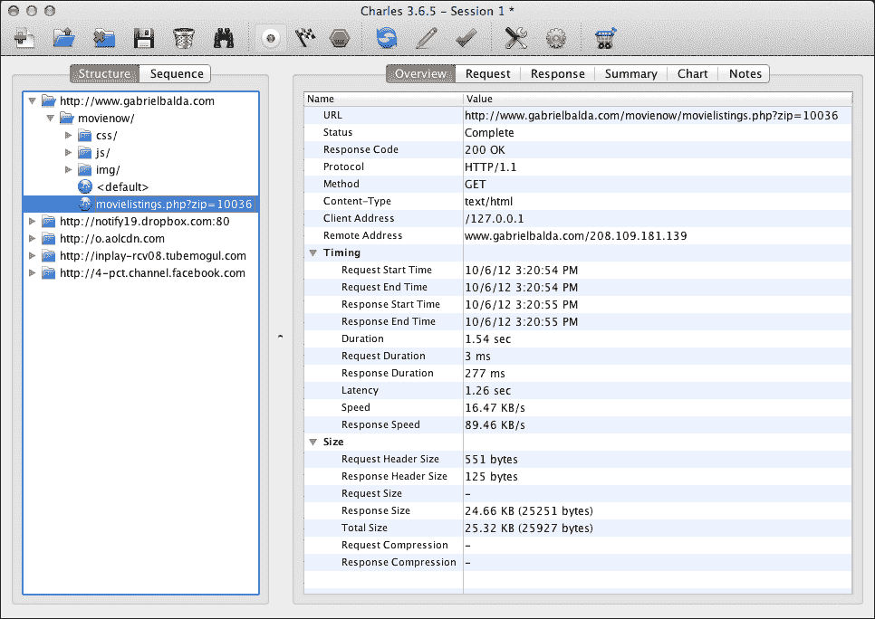

使用代理模拟响应也是可能的。例如，在 Charles 中，您可以前往**工具**，然后选择**映射本地...**来使用本地文件或服务作为您应用程序的响应。您可以在同一菜单中使用**重写...**来修改响应的一部分并将其发送回您的应用程序。这对于测试边缘情况是一个非常有价值的功能。

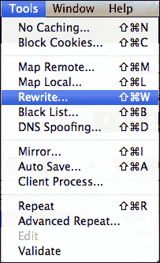

如果您想使用 Charles 与 iOS 设备一起进行远程调试，请按照以下步骤操作：

1.  使用终端中的`ipconfig getifaddr en1.`命令获取您的 Mac IP 地址。

1.  在**代理**菜单中激活**启用 Mac OS X 代理**选项。

1.  将您的 iOS 设备连接到运行 Charles 的 Mac 电脑使用的同一网络。

1.  在您的 iOS 设备上，前往**设置** | **Wi-Fi**，点击您连接的蓝色箭头，然后在**HTTP 代理**部分输入您的 Mac IP 地址和 Charles 使用的端口号（默认为 8888）。

1.  在您的 iOS 设备上的 Safari 中导航。

1.  Charles 应该会显示一个警告，通知您已尝试建立新的连接。点击**允许**。

1.  现在，您应该能够记录您的流量。

# 摘要

在本章中，我们介绍了有用的调试工具，包括移动和 Web 代理，以及如何在浏览器中操作 HTML、CSS 和 JavaScript 以调试我们的应用程序。作为开发者，了解所有可用的调试代码选项对我们来说是一种良好的实践。当调试仅在一个浏览器中发生的错误时，我们必须特别注意该浏览器的技术限制和功能，因为这些限制通常是原因。例如，复杂的 JavaScript 代码在像 Internet Explorer 7 这样的浏览器中可能会很慢。使用该浏览器提供的工具可以让我们深入了解该浏览器的内部结构，从而了解如何防止未来的错误。

在下一章中，我们将介绍企业级应用程序项目的测试工具和框架，以及自动化功能测试的优势。
