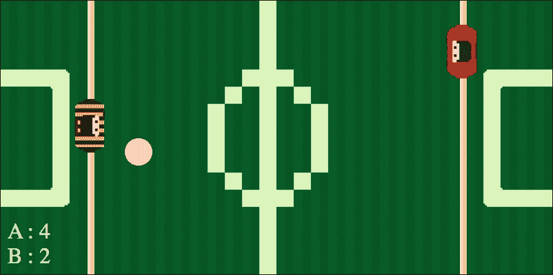
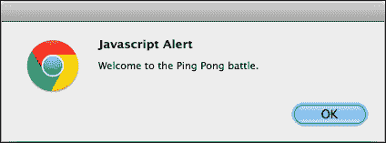
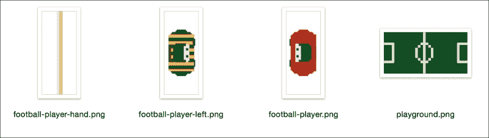
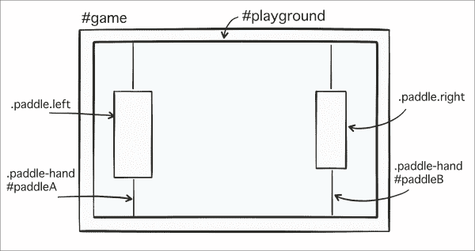
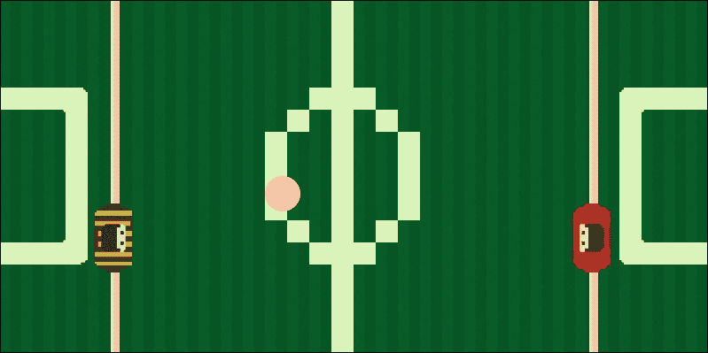
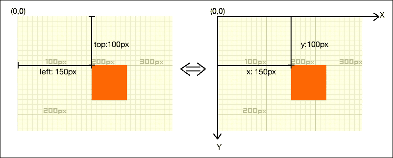
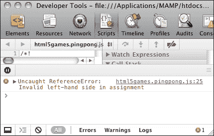
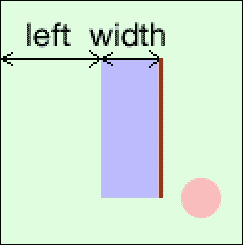
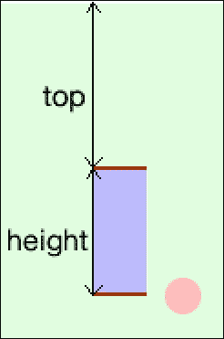
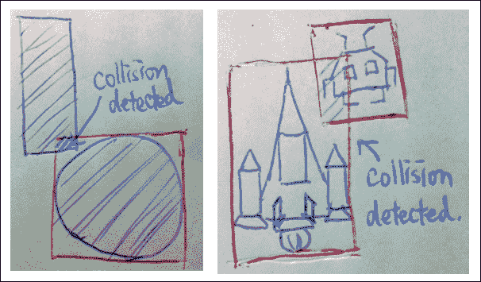

# 第二章：使用基于 DOM 的游戏开发入门

*我们在 第一章 *介绍 HTML5 游戏* 中对整本书将要学习的内容有一个大致的了解。从这一章开始，我们将进入许多通过实践学习的内容，并且每个部分将专注于一个主题。在深入探讨 CSS3 动画和 HTML5 Canvas 游戏之前，让我们从传统的基于 DOM 的游戏开发开始。我们将在这个章节中通过一些基本技术来热身。

在这一章中，我们将做以下事情：

+   设置我们的第一个游戏——乒乓球

+   使用 jQuery JavaScript 库学习基本定位

+   获取鼠标输入

+   创建显示分数的乒乓球游戏

+   学习如何分离数据和视图渲染逻辑

我们将创建一个乒乓球游戏，玩家可以通过鼠标输入与电脑对战。你可以在 [`makzan.net/html5-games/pingpong/`](http://makzan.net/html5-games/pingpong/) 尝试这个游戏。

以下截图显示了本章结束时游戏的外观：



因此，让我们开始制作我们的乒乓球游戏。

### 注意

在撰写本书时，jQuery 版本是 2.1.3。我们在示例中使用的 jQuery 函数是基本函数，应该在未来版本中也能正常工作。

# 准备基于 DOM 的游戏的 HTML 文档

每个网站、网页和 HTML5 游戏都是从默认的 HTML 文档开始的。此外，文档从基本的 HTML 代码开始。我们将从 `index.html` 开始我们的 HTML5 游戏开发之旅。

# 行动时间——安装 jQuery 库

我们将从零开始创建我们的 HTML5 乒乓球游戏。这听起来好像我们即将准备所有的事情。幸运的是，我们可以使用一个 JavaScript 库来帮助我们。**jQuery** 是一个专为轻松导航 DOM 元素、操作它们、处理事件和创建异步远程调用而设计的 **JavaScript 库**。我们将在本书中使用这个库来操作 DOM 元素。它将帮助我们简化我们的 JavaScript 逻辑：

1.  创建一个名为 `pingpong` 的新文件夹作为我们的项目目录。

1.  在 `pingpong` 文件夹内，我们将创建以下文件结构，包括三个文件夹——`js`、`css` 和 `images`——以及一个 `index.html` 文件：

    ```js
    index.html
    js/
      js/pingpong.js
    css/
      css/pingpong.css
    images/
    ```

1.  现在，是时候下载 jQuery 库了。访问 [`jquery.com/`](http://jquery.com/)。

1.  选择 **下载 jQuery** 并点击 **下载压缩的、用于生产的 jQuery 2.1.3**。

1.  将 `jquery-2.1.3.min.js` 保存到我们在步骤 2 中创建的 `js` 文件夹中。

1.  在文本编辑器中打开 `index.html` 并插入一个空的 HTML 模板：

    ```js
    <!DOCTYPE html>
    <html lang="en">
    <head>
      <meta charset="utf-8">
      <title>Ping Pong</title>
      <link rel="stylesheet" href="css/pingpong.css">
    </head>
    <body>
      <header>
        <h1>Ping Pong</h1>
      </header>
      <div id="game">
        <!-- game elements to be here -->
      </div>
      <footer>
        This is an example of creating a Ping Pong Game.
      </footer>
      <script src="img/jquery-2.1.3.min.js"></script>
      <script src="img/pingpong.js"></script></body>
    </html>
    ```

1.  最后，我们必须确保 jQuery 已成功加载。为此，将以下代码放入 `js/pingpong.js` 文件中：

    ```js
    (function($){
      $(function(){
        // alert a message
        alert("Welcome to the Ping Pong battle.");
      });
    })(jQuery);
    ```

1.  保存`index.html`文件并在浏览器中打开它。你应该会看到一个显示我们文本的警告窗口。这意味着我们的 jQuery 已经正确设置：

## *刚才发生了什么？*

我们刚刚使用 jQuery 创建了一个基本的 HTML5 页面，并确保 jQuery 被正确加载。

## 新的 HTML5 doctype

在 HTML5 中，`DOCTYPE`和`meta`标签被简化了。

在 HTML 4.01 中，我们使用以下代码声明 doctype：

```js
<!DOCTYPE HTML PUBLIC "-//W3C//DTD HTML 4.01//EN" "http://www.w3.org/TR/html4/strict.dtd">
```

这是一行很长的代码，对吧？在 HTML5 中，文档类型声明（doctype）已经不能再简单了：

```js
<!DOCTYPE html>
```

我们甚至没有在声明中包含 HTML 版本。这是因为 HTML5 现在是一个没有版本号的活标准。

## Header 和 footer

HTML5 带来了许多新特性和改进，其中之一是语义。HTML5 添加了新元素来提高**语义**。我们只使用了两个元素：`header`和`footer`。**Header**为部分或整个页面提供了一个介绍。因此，我们将`h1`标题放在 header 中。**Footer**，正如其名所示，包含部分或页面的页脚信息。

### 注意

语义化 HTML 意味着标记本身提供了有意义的信息给内容，而不仅仅是定义视觉外观。

## 放置 JavaScript 代码的最佳实践

我们将 JavaScript 代码放在`</body>`标签的关闭之前，并在页面中的所有内容之后。将代码放在那里的原因而不是将其放在`<head></head>`部分中，是有原因的。

通常，浏览器从顶部到底部加载内容并渲染它们。如果 JavaScript 代码放在`head`部分，那么文档的内容将不会加载，直到所有 JavaScript 代码都加载完毕。实际上，如果浏览器在页面中间加载 JavaScript 代码，所有的渲染和加载都会暂停。这就是为什么我们希望在可能的情况下将 JavaScript 代码放在底部。这样，我们可以更快地将 HTML 内容传递给读者。

在撰写本书时，最新的 jQuery 版本是 2.1.3。这就是为什么我们的代码示例中的 jQuery 文件被命名为`jquery-2.1.3.min.js`。文件名中的版本号确保了网络开发者不会在不同项目中混淆相同文件名的不同版本。这个版本号会不同，但使用方式应该是相同的，除非 jQuery 有重大变化而不向后兼容。

### 注意

请注意，一些 JavaScript 库需要在加载任何 HTML 元素之前放置`<head>`标签。当您使用第三方库时，请检查它们是否有这样的要求。

## 选择 jQuery 文件

对于 jQuery 库，目前有两个主要版本；它们是 **1.x** 和 **2.x**。1.x 版本保持与旧浏览器的向后兼容性，主要是针对 IE 6、7 和 8 版本。由于我们的 HTML5 游戏针对现代浏览器，我们选择了不再支持 IE 8 或更旧版本的 2.x 版本。

包含 jQuery 库有两种常见方式。我们可以下载一个 **托管** 版本或使用 **CDN** 版本。托管版本意味着我们下载文件，并自行托管文件。CDN 代表内容分发网络。jQuery 文件托管在几个中央服务器上，以提高文件下载时间。对于 CDN 版本，我们可以在 [`code.jquery.com`](http://code.jquery.com) 找到 URL。我们可以直接在 HTML 中使用 `<script>` 标签包含文件，如下所示：`<script src="img/jquery.min.js"></script>`。

否则，我们可以在文件名中指定版本号，如下所示：`<script src="img/jquery-2.1.3.min.js"></script>`。

## 在作用域内运行 jQuery

我们需要在我们的 JavaScript 代码执行之前确保页面已准备好。否则，当我们尝试访问尚未加载的元素时，可能会出错。jQuery 通过以下代码提供了一种在页面准备好后执行代码的方法：

```js
jQuery(document).ready(function(){
  // code here.
});
```

大多数情况下，我们使用 `$` 符号来表示 jQuery。这是一个使调用我们的 jQuery 函数变得更容易的快捷方式。因此，本质上，我们使用以下代码：

```js
$(function(){
  // code here.
});
```

当我们调用 `$(something)` 时，我们实际上是在调用 `jQuery(something)`。

如果在一个项目中使用多个 JavaScript 库，可能会出现 `$` 变量冲突。为了最佳实践，我们使用一个 **匿名函数** 将 jQuery 对象传递到函数作用域，使其成为 `$` 符号：

```js
(function($){
  // jQuery code here with $.
})(jQuery);
```

匿名函数是一个没有名称的函数定义。这就是为什么它被称为匿名函数。由于我们不能再引用这个函数，匿名函数总是自我执行。JavaScript 的变量作用域绑定到函数作用域。我们经常使用匿名函数来控制某些变量的可用性。例如，在我们的例子中，我们将 jQuery 作为 `$` 变量传递到函数中。

## 在页面准备好后运行我们的代码

`$(function_callback)` 是 DOM 元素的 `ready` 事件的另一个快捷方式。我们需要 jQuery `ready` 函数的原因是防止在 HTML DOM 元素加载之前执行 JavaScript 逻辑。我们在 jQuery `ready` 函数中定义的函数在所有 HTML 元素加载后执行。

它与以下代码行相同：

```js
$(document).ready(function_callback);
```

### 注意

注意，jQuery 的 `ready` 事件在 HTML 结构（DOM 树）加载后触发。然而，这并不意味着内容，例如实际图像内容，已经加载。另一方面，浏览器的 `onload` 事件在所有内容（包括图像）加载后触发。

## 快速问答

Q1. 将 JavaScript 代码放在哪里是最好的位置？

1.  在 `<head>` 标签之前

1.  在 `<head></head>` 元素内部

1.  在 `<body>` 标签之后

1.  在 `</body>` 标签之前

## 下载图像资源

在这一步，我们需要一些图形文件。你可以从代码包中下载图形文件，或者从 [`mak.la/book-assets/`](http://mak.la/book-assets/) 下载。

在资源包中，你可以找到 `第二章` 的图像文件。下载后，将这些文件放入 `images` 文件夹。应该有四个文件，如下面的截图所示：



# 设置乒乓球游戏元素

我们已经做好了准备，现在是时候设置乒乓球游戏了。以下图表显示了游戏元素的放置方式。游戏元素包含我们的游乐场和之后的计分板。在游乐场内部，我们放置了两个装饰元素，即**挡板手**，它作为足球机的把手。然后，我们有两个**挡板**元素——一个在左边，一个在右边。



# 行动时间 - 将乒乓球游戏元素放置在 DOM 中

1.  我们将继续从我们的 jQuery 安装示例，并在文本编辑器中打开 `index.html` 文件。

1.  然后，我们将使用 DIV 节点在主体中创建以下游乐场和 `game` 对象。游乐场内部有两个挡板和一个球，并且游乐场被放置在游戏内部：

    ```js
    <div id="game">
      <div id="playground">
        <div class="paddle-hand right"></div>
        <div class="paddle-hand left"></div>
        <div id="paddleA" class="paddle"></div>
        <div id="paddleB" class="paddle"></div>
        <div id="ball"></div>
      </div>
    </div>
    ```

1.  我们现在已经准备好了 `game` 对象的结构，现在是时候为它们应用样式了。我们将向 `pingpong.css` 文件中添加以下样式：

    ```js
    #game {
      position: relative;
      width: 400px;
      height: 200px;
    }
    #playground{
      background: url(../images/playground.png);
      background-size: contain;
      width: 100%;
      height: 100%;
      position: absolute;
      top: 0;
      left: 0;
      overflow: hidden;
      cursor: pointer;
    }
    #ball {
      background: #fbb;
      position: absolute;
      width: 20px;
      height: 20px;
      left: 150px;
      top: 100px;
      border-radius: 10px;
    }
    ```

1.  然后，我们将在 `pingpong.css` 文件内部追加以下代码来定义两个挡板的尺寸和位置：

    ```js
    .paddle {
      background-size: contain;
      top: 70px;
      position: absolute;
      width: 30px;
      height: 70px;
    }

    #paddleA {
      left: 50px;
      background-image: url(../images/football-player-left.png);
    }
    #paddleB {
      right: 50px;
      background-image: url(../images/football-player.png);
    }
    ```

1.  我们将继续在 `pingpong.css` 文件中的样式，并定义 `paddle-hands`，这是挡板的装饰：

    ```js
    .paddle-hand {
      background: url(../images/football-player-hand.png) 50% 0 repeat-y;
      background-size: contain;
      width: 30px;
      height: 100%;
      position: absolute;
      top: 0;
    }
    .left.paddle-hand {
      left: 50px;
    }
    .right.paddle-hand {
      right: 50px;
    }
    ```

1.  现在我们完成了 CSS 样式，让我们转到 `js/pingpong.js` 文件来处理 JavaScript 的逻辑。我们需要一个函数来根据位置数据更新挡板的 DOM 元素。为此，我们将用以下代码替换当前代码：

    ```js
    (function($){
      // data definition
      var pingpong = {
        paddleA: {
          x: 50,
          y: 100,
          width: 20,
          height: 70
        },
        paddleB: {
          x: 320,
          y: 100,
          width: 20,
          height: 70
        },
      };

      // view rendering
      function renderPaddles() {
        $("#paddleB").css("top", pingpong.paddleB.y);
        $("#paddleA").css("top", pingpong.paddleA.y);
      }

      renderPaddles();

    })(jQuery);
    ```

1.  现在，我们将在一个浏览器中测试设置。在浏览器中打开 `index.html` 文件；我们应该看到一个类似于以下截图的屏幕：

## *发生了什么？*

让我们看看我们刚刚使用的 HTML 代码。HTML 页面包含标题、页脚信息，以及一个具有 ID `game` 的 DIV 元素。`game` 节点包含一个名为 `playground` 的子节点，该子节点又包含三个子节点——两个挡板和球。

我们通常通过准备一个结构良好的 HTML 层次结构来开始 HTML5 游戏开发。HTML 层次结构帮助我们将类似的游戏对象（这些是一些 DIV 元素）组合在一起。如果你曾经使用过 Adobe Flash 制作过动画，这有点像将资产分组到电影剪辑中。我们也可以将其视为游戏对象的层，以便我们能够轻松地选择和设置它们的样式。

## 使用 jQuery

jQuery 命令通常包含两个主要部分：**选择**和**修改**。选择使用 CSS 选择器语法来选择网页中所有匹配的元素。修改操作修改所选元素，例如添加或删除子元素或样式。使用 jQuery 通常意味着将选择和修改操作链在一起。

例如，以下代码选择所有具有 `box` 类的元素并设置 CSS 属性：

```js
$(".box").css({"top":"100px","left":"200px"});
```

## 理解基本的 jQuery 选择器

jQuery 是关于选择元素并在其上执行操作的工具。我们需要一个方法来在整个 DOM 树中选择我们需要的元素。jQuery 从 CSS 中借用了选择器。选择器提供了一组模式来匹配元素。以下表格列出了我们将在这本书中使用的最常见和有用的选择器：

| 选择器模式 | 含义 | 示例 |
| --- | --- | --- |
| `$("Element")` | 选择所有具有给定标签名的元素 | `$("p")` 选择所有 `p` 标签。`$("body")` 选择 `body` 标签。 |

| `$("#id")` | 选择具有给定 ID 属性的元素 | 考虑以下代码：

```js
<div id="box1"></div>
 <div id="box2"></div>
```

`$("#box1")` 选择高亮显示的元素。|

| `$(".className")` | 选择所有具有给定类属性的元素 | 考虑以下代码：

```js
<div class="apple"></div>
<div class="apple"></div>
 <div class="orange"></div>
 <div class="banana"></div>
```

`$(".apple")` 选择设置了 `class` 为 `apple` 的高亮显示元素。|

| `$("selector1, selector2, selectorN")` | 选择所有匹配给定选择器的元素 | 考虑以下代码：

```js
<div class="apple"></div>
<div class="apple"></div>
<div class="orange"></div>
 <div class="banana"></div>
```

`$(".apple,` `.orange")` 选择 `class` 设置为 `apple` 或 `orange` 的高亮显示元素。|

## 理解 jQuery CSS 函数

jQuery 的 `css` 函数用于获取和设置所选元素的 CSS 属性。这被称为获取和设置模式，许多 jQuery 函数都遵循这种模式。

下面是使用 `css` 函数的一般定义：

```js
.css(propertyName)
.css(propertyName, value)
```

`css` 函数接受以下表格中列出的几种类型的参数：

| 函数类型 | 参数定义 | 讨论内容 |
| --- | --- | --- |
| `.css(propertyName)` | `propertyName` 是一个 CSS 属性 | 该函数返回所选元素的给定 CSS 属性的值。例如，以下代码返回 `body` 元素的 `background-color` 属性的值：`$("body").css("background-color")` 它只会读取值，而不会修改属性值。 |
| `css(propertyName, value)` | `propertyName` 是一个 CSS 属性，`value` 是为该属性设置的值。 | 该函数将给定的 CSS 属性修改为给定的值。例如，以下代码将所有具有 `box` 类的元素的背景颜色设置为红色：`$(".box").css("background-color","#ff0000")` |

## 使用 jQuery 在 DOM 中操作游戏元素

我们使用 jQuery 初始化了球拍的游戏元素。我们将进行一个实验，看看我们应该如何使用 jQuery 来放置游戏元素。

## 理解绝对定位的行为

当一个 DOM 节点被设置为 `absolute` 位置时，left 和 top 属性可以被视为一个 **坐标**。我们可以将 left/top 属性视为 X/Y 坐标，其中 Y 轴正方向向下。以下图表显示了它们之间的关系。左侧是实际的 CSS 值，右侧是我们编程游戏时的心理坐标系：



默认情况下，left 和 top 属性指的是网页的左上角。如果此 DOM 节点的任何父节点明确设置了 `position` 样式为 `relative` 或 `absolute`，则这个参考点就不同了。left 和 top 属性的参考点变为该父节点的左上角。

这就是为什么我们需要将游戏设置为相对位置，并将所有游戏元素设置为绝对位置。以下是我们示例中的代码片段，显示了元素的定位值：

```js
#game{
  position: relative;
}
#playground,
#ball,
#paddle {
  position: absolute;
}
```

## 以更好的方式声明全局变量

**全局变量** 是可以在整个文档中访问的变量。任何在函数外部声明的变量都是全局变量。例如，在以下示例代码片段中，`a` 和 `b` 是全局变量，而 `c` 是一个 **局部变量**，它只存在于函数内部：

```js
var a = 0;
var b = "xyz";
function something(){
  var c = 1;
}
```

由于全局变量在整个文档中都是可用的，如果我们将不同的 JavaScript 库集成到同一个网页中，它们可能会增加变量名冲突的机会。作为良好的实践，我们应该尽量减少全局变量的使用。

在前面的 *行动时间* 部分，我们有一个对象来存储游戏数据。我们不是仅仅把这个对象放在全局作用域中，而是创建了一个名为 `pingpong` 的对象，并将数据放在里面。

此外，当我们像上一节讨论的那样将所有逻辑放入自执行函数中时，我们使游戏的数据对象在函数作用域内局部化。

### 注意

在函数作用域内声明变量而不使用 `var`，即使变量是在函数作用域内定义的，也会将变量放入全局作用域。因此，我们总是使用 `var` 声明变量。

## 突击测验

Q1. 如果你想选择所有标题元素，应该使用哪个 jQuery 选择器？

1.  `$("#header")`

1.  `$(".header")`

1.  `$("header")`

1.  `$(header)`

# 获取鼠标输入

在前面的章节中，您学习了如何使用 CSS 和 jQuery 显示游戏对象。接下来，我们需要在游戏中创建一种从玩家那里获取输入的方法。在本节中，我们将讨论鼠标输入。

# 行动时间 - 通过鼠标输入移动 DOM 对象

我们将要创建一个传统的乒乓球游戏。游乐场的左右两侧都有一个挡板。一个球放在游乐场的中间。玩家可以通过使用鼠标控制右侧的挡板，上下移动它。我们将专注于鼠标输入，并将球的运动留到后面的章节：

1.  让我们继续我们的`pingpong`目录。

1.  接下来，在`js/pingpong.js`文件中的`pingpong`数据对象内添加一个`playground`对象。这个对象存储与`playground`相关的变量：

    ```js
    // data definition
    var pingpong = {
      paddleA: {
        x: 50,
        y: 100,
        width: 20,
        height: 70
      },
      paddleB: {
        x: 320,
        y: 100,
        width: 20,
        height: 70
      },
      playground: {
        offsetTop: $("#playground").offset().top,
      }
    };
    ```

1.  然后，创建以下处理鼠标的进入、移动和离开事件的函数，并将其放置在`js/pingpong.js`文件中：

    ```js
    function handleMouseInputs() {
      // run the game when mouse moves in the playground.
      $('#playground').mouseenter(function(){
        pingpong.isPaused = false;
      });

      // pause the game when mouse moves out the playground.
      $('#playground').mouseleave(function(){
        pingpong.isPaused = true;
      });

      // calculate the paddle position by using the mouse position.
      $('#playground').mousemove(function(e){
        pingpong.paddleB.y = e.pageY - pingpong.playground.offsetTop;  
      });
    }
    ```

1.  在上一节中，我们有了`renderPaddles`函数。在本节中，我们定义了一个`render`函数，并调用 paddle 渲染逻辑。然后我们通过`requestAnimationFrame`函数在下一个浏览器重绘时调用`render`函数。

    ```js
    function render() {
      renderPaddles();
      window.requestAnimationFrame(render);
    }
    ```

1.  最后，我们创建一个`init`函数来执行初始逻辑。

    ```js
    function init() {
      // view rendering
      window.requestAnimationFrame(render);

      // inputs
      handleMouseInputs();
    }
    ```

1.  最后，你需要调用`init`函数来启动我们的游戏逻辑：

    ```js
    (function($){
      // All our existing code

      // Execute the starting point
      init();
    })(jQuery);
    ```

1.  让我们测试游戏中的`paddle`控制。在网页浏览器中打开`index.html`页面。尝试在游乐场区域内上下移动鼠标。右侧的挡板应该跟随鼠标的移动。

## *发生了什么？*

我们处理了鼠标事件，根据鼠标位置移动 paddle。您可以在[`makzan.net/html5-games/pingpong-wip-step3/`](http://makzan.net/html5-games/pingpong-wip-step3/)上玩当前正在开发的游戏版本。

## 获取鼠标事件

jQuery 提供了几个实用的鼠标事件，其中最基本的是点击、鼠标按下和鼠标抬起。我们跟踪鼠标进入和鼠标离开事件来开始和暂停游戏。我们还使用鼠标移动事件来获取鼠标位置，并根据游乐场区域的鼠标位置更新 paddle 位置。

我们需要根据游乐场的左上角来获取光标的`y`位置。鼠标事件中的`Y`值是鼠标光标从页面左上角的位置。然后我们通过`$("#playground").offset().top`减去游乐场的位置。

我们通过使用鼠标的`X`和`Y`值来更新 paddle 的`Y`值数据。当在浏览器重绘期间，`render`函数更新 paddle 视图时，这个值最终会在屏幕上反映出来。

## RequestAnimationFrame

时间间隔用于执行游戏循环。`game`循环计算游戏逻辑，计算游戏对象的运动。

`requestAnimationFrame`功能用于根据数据更新视图。我们使用`requestAnimationFrame`功能来更新视图，因为视图只需要在浏览器决定的最佳场景中更新。

`requestAnimationFrame`的间隔不是固定的。当浏览器处于前端时，`requestAnimationFrame`功能会频繁运行。当电池电量低或浏览器处于后台时，浏览器会降低`requestAnimationFrame`功能的执行频率。

我们现在只使用`RequestAnimationFrame`来处理与视图相关的逻辑。在后面的部分，我们需要处理游戏数据计算。对于数据计算，我们将使用`setInterval`，因为`setInterval`函数总是在固定的时间间隔内执行。这就是为什么我们使用`setInterval`函数进行游戏逻辑计算，而使用动画帧进行视图渲染。

## 检查控制台窗口

我们现在正在编写更复杂的逻辑代码。保持对**开发者工具**控制台的关注是一个好习惯。您可以通过在 Windows 上按*F12*或在 Mac OS 上按*command* + *option* + *I*来切换开发者工具。如果代码中包含任何错误或警告，错误信息将出现在那里。它报告任何找到的错误以及包含错误的代码行。在测试 HTML5 游戏时，打开控制台窗口非常有用且重要。我经常看到人们陷入困境，不知道代码为什么不起作用。原因可能是他们有拼写错误或语法错误，并且在几个小时与代码斗争之前没有检查控制台窗口。

以下截图显示，在`js/pingpong.js`文件的第二十五行存在一个错误。错误信息是**赋值中的左侧无效**。在检查代码后，我发现我在设置 jQuery 中的 CSS `top`属性时错误地使用了等号（`=`）：

```js
$("#paddleA").css("top"=top+5);

// instead of the correct code:
// $("#paddleA").css("top", top+5);
```

错误显示如下：



## 使用 JavaScript 间隔移动 DOM 对象

想象一下，现在我们可以让小红球在游乐场周围移动。当球击中挡板时，它会弹开。当球穿过对手的挡板并击中挡板后面的游乐场边缘时，玩家将获得分数。所有这些动作都是通过 jQuery 操作 HTML 页面内的 DIV 的位置来实现的。为了完成这个乒乓球游戏，我们的下一步是移动球。

# 行动时间 - 使用 JavaScript 间隔移动球

我们将使用该函数创建一个计时器。计时器每 30 毫秒移动球一点。我们还将改变球运动的方向，一旦它击中游乐场边缘。现在让我们让球移动起来：

1.  我们将以我们最后的例子，监听多个键盘输入，作为起点。

1.  在文本编辑器中打开`js/pingpong.js`文件。

1.  在现有的 `pingpong.playground` 对象中，我们将其更改为以下代码，为游乐场添加高度和宽度。

    ```js
    playground: {
      offsetTop: $("#playground").offset().top,
      height: parseInt($("#playground").height()),
      width: parseInt($("#playground").width()),
    },
    ```

1.  我们现在正在移动球，并且需要全局存储球的状态。我们将球相关的变量放在 `pingpong` 对象中：

    ```js
    var pingpong = {
      //existing data
      ball: {
        speed: 5,
        x: 150,
        y: 100,
        directionX: 1,
        directionY: 1
      }
    }
    ```

1.  我们定义了一个 `gameloop` 函数，并在每个游戏循环迭代中移动球：

    ```js
    function gameloop() {
      moveBall();
    }
    ```

1.  我们定义了检查球是否撞击游乐场四个边界墙的函数：

    ```js
    function ballHitsTopBottom() {
      var y = pingpong.ball.y + pingpong.ball.speed * pingpong.ball.directionY;
      return y < 0 || y > pingpong.playground.height;
    }
    function ballHitsRightWall() {
      return pingpong.ball.x + pingpong.ball.speed * pingpong.ball.directionX > pingpong.playground.width;
    }
    function ballHitsLeftWall() {
      return pingpong.ball.x + pingpong.ball.speed * pingpong.ball.directionX < 0;
    }
    ```

1.  然后，我们定义了两个函数，在任意玩家获胜后重置游戏。

    ```js
    function playerAWin() {
      // reset the ball;
      pingpong.ball.x = 250;
      pingpong.ball.y = 100;

      // update the ball location variables;
      pingpong.ball.directionX = -1;
    }
    function playerBWin() {
      // reset the ball;
      pingpong.ball.x = 150;
      pingpong.ball.y = 100;

      pingpong.ball.directionX = 1;
    }
    ```

1.  是时候定义 `moveBall` 函数了。该函数检查游乐场的边界，当球碰到边界时改变球的方向，并在所有这些计算之后设置新的球位置。让我们在 JavaScript 文件中放置以下 `moveBall` 函数定义：

    ```js
    function moveBall() {  
      // reference useful varaibles
      var ball = pingpong.ball;

      // check playground top/bottom boundary
      if (ballHitsTopBottom()) {
        // reverse direction
        ball.directionY *= -1;
      }
      // check right
      if (ballHitsRightWall()) {
        playerAWin();
      }
      // check left
      if (ballHitsLeftWall()) {
        playerBWin();
      }

      // check paddles here

      // update the ball position data
        ball.x += ball.speed * ball.directionX;
        ball.y += ball.speed * ball.directionY;
    }
    ```

1.  我们已经计算了球的移动。接下来，我们想要渲染视图，根据数据更新球的位置。为此，定义一个新的 `renderBall` 函数，如下所示。

    ```js
    function renderBall() {
      var ball = pingpong.ball;
      $("#ball").css({
        "left" : ball.x + ball.speed * ball.directionX,
        "top" : ball.y + ball.speed * ball.directionY
      });
    }
    ```

1.  现在，我们需要更新 `render` 函数，以便根据更新的游戏数据渲染球的更新：

    ```js
    function render() {
      renderBall();
      renderPaddles();
      window.requestAnimationFrame(render);
    }
    ```

1.  以下代码行是新的 `init` 函数，我们在其中使用 `setInterval` 函数添加了 `gameloop` 逻辑：

    ```js
    function init() {
      // set interval to call gameloop logic in 30 FPS
      pingpong.timer = setInterval(gameloop, 1000/30);

      // view rendering
      window.requestAnimationFrame(render);

      // inputs
      handleMouseInputs();
    }
    ```

1.  我们已经准备好了每 33.3 毫秒移动一次球的代码。保存所有文件，并在网络浏览器中打开 `index.html` 以测试它。球拍的工作方式与上一个例子一样，球应该在游乐场周围移动。

## *刚才发生了什么？*

我们刚刚成功使球在游乐场周围移动。我们有一个每秒运行 30 次常规游戏逻辑的循环。在这个游戏循环中，我们每次移动球 5 像素。你可以尝试游戏，并在 [`makzan.net/html5-games/pingpong-wip-step6/`](http://makzan.net/html5-games/pingpong-wip-step6/) 上查看正在进行的代码。

球有三个属性：速度、以及 *x* 和 *y* 方向。速度定义了球在每一步移动多少像素。X/Y 方向的值要么是 1，要么是 -1。我们使用以下方程来移动球：

```js
new_ball_x = ball_x_position + speed * direction_x
new_ball_y = ball_y_position + speed * direction_y
```

方向值乘以移动量。当方向是 1 时，球向轴的正方向移动。当方向是 `-1` 时，球向轴的负方向移动。通过切换 *x* 和 *y* 方向，我们可以使球在四个方向上移动。

我们将球的 `X` 和 `Y` 值与游乐场 DIV 元素的四个边缘进行比较。这检查球的下一个位置是否超出边界，然后，我们在 1 和 -1 之间切换方向以创建反弹效果。

## 使用 setInterval 函数创建 JavaScript 计时器

我们有一个计时器来循环并定期移动球。这可以通过 JavaScript 中的 `setInterval` 函数来完成。

这里是 `setInterval` 函数的一般定义：

```js
setInterval(expression, milliseconds)
```

`setInterval` 函数需要两个必需的参数。额外的参数作为参数传递给函数：

| 参数 | 定义 | 讨论 |
| --- | --- | --- |

| `expression` | 要执行的功能回调或代码表达式 | 表达式可以是一个功能回调的引用或内联代码表达式。内联代码表达式用引号引用，而功能回调的引用则不用。例如，以下代码每 100 毫秒调用一次`hello`函数：

```js
setInterval(hello, 100);
```

以下代码每 100 毫秒调用一次`hi`函数，并传递参数：

```js
setInterval("hi('Makzan')", 100);
```

|

| `milliseconds` | 表达式每次执行之间的持续时间，以毫秒为单位 | 间隔的单位是毫秒。因此，将其设置为 1000 意味着每秒运行一次表达式。 |
| --- | --- | --- |

## 理解游戏循环

我们有一个计时器，每 33.3 毫秒执行一些与游戏相关的代码，因此这些代码每秒执行 30 次。这种频率被称为每秒帧数，或 FPS。在游戏开发中，这个计时器被称为**游戏循环**。

在游戏循环中，我们将执行几个常见操作：

+   处理用户输入，这是我们刚才做的

+   更新游戏对象的状态，包括位置和外观

+   检查游戏是否结束

游戏循环中实际执行的内容在不同类型的游戏中有所不同，但目的相同。游戏循环定期执行以计算游戏数据。

## 分离数据和视图逻辑

我们已经分离了数据和视图逻辑。我们使用`setInterval`处理数据，使用`requestAnimationFrame`进行视图渲染。数据专注于所有游戏数据的计算，包括基于计算的对象尺寸和位置。`视图`逻辑专注于根据不断更新的游戏数据更新界面。

在我们的渲染函数中，视图更新 DOM 元素的 CSS。想象一下，如果我们稍后要在 Canvas 中渲染游戏或使用任何其他技术，我们的视图渲染逻辑可以使用特定方法根据相同的游戏数据渲染视图。游戏数据的计算独立于我们用于渲染游戏界面的技术。

# 开始碰撞检测

在上一节中移动球时，我们已经检查了游乐场的边界。现在，我们可以用键盘控制拍子，并观察球在游乐场中移动。现在缺少什么？我们无法与球互动。我们控制拍子，但球就像它们不存在一样穿过它们。这是因为我们遗漏了拍子和移动球之间的碰撞检测。

# 行动时间 – 用拍子击球

我们将使用类似于检查边界的检查方法来检查碰撞：

1.  打开我们在上一节中使用的`js/pingpong.js`文件。

1.  在`moveBall`函数中，我们已经在那里预留了放置碰撞检测代码的位置。找到带有`//` `check` `paddles` `here`的行。

1.  让我们把以下代码放在那里。该代码检查球是否与任一拍子重叠，并在它们重叠时将球弹开：

    ```js
    // Variables for checking paddles
    var ballX = ball.x + ball.speed * ball.directionX;
    var ballY = ball.y + ball.speed * ball.directionY;

    // check moving paddle here, later.
    // check left paddle
    if (ballX >= pingpong.paddleA.x && ballX < pingpong.paddleA.x + pingpong.paddleA.width) {
      if (ballY <= pingpong.paddleA.y + pingpong.paddleA.height && ballY >= pingpong.paddleA.y) {
        ball.directionX = 1;
      }
    }

    // check right paddle
    if (ballX + pingpong.ball.radius >= pingpong.paddleB.x && ballX < pingpong.paddleB.x + pingpong.paddleB.width) {
      if (ballY <= pingpong.paddleB.y + pingpong.paddleB.height && ballY >= pingpong.paddleB.y) {
        ball.directionX = -1;
      }
    }
    ```

1.  在浏览器中测试游戏，球现在在击中左右球拍后会弹开。当它击中游乐场的左右边缘时，它也会重置到游乐场的中心。

## *发生了什么？*

我们通过使球在重叠球拍时弹开来修改了球。让我们看看我们是如何检查球和左球拍之间的碰撞的。

首先，我们检查球的 *x* 位置是否小于左球拍的右边沿。右边沿是 `left` 值加上球拍的 `width`。



然后，我们检查球的 *y* 位置是否在球拍的上边缘和下边缘之间。上边缘是 `top` 值，下边缘是 `top` 值加上球拍的 `height`。



如果球的位置通过了这两个检查，我们就让球弹开。这就是我们检查它的方法，它只是一个基本的碰撞检测。

我们通过检查它们的位置和宽/高来确定两个对象是否重叠。这种碰撞检测在矩形对象中效果很好，但不适用于圆形和其他形状。下面的截图说明了问题。以下图中显示的碰撞区域是假阳性。它们的边界框发生碰撞，但实际形状并没有重叠。这是一个经典且高效的方法来检查碰撞。它可能不是很准确，但计算速度快。



对于特殊形状，我们需要更高级的碰撞检测技术，我们将在后面讨论。

## 尝试一下英雄

我们已经在游乐场上放置了两个球拍。我们为什么不通过在中间场地上添加一个替代球拍来使游戏更具挑战性呢？这就像在足球机器中拥有守门员和前锋一样。

# 控制左球拍的运动

计算机控制左球拍。我们希望创建一个函数，使左球拍追逐球。

# 是时候自动移动左球拍了

为自动移动我们的球拍执行以下操作：

1.  让我们继续使用我们的 `pingpong.js` JavaScript 文件。我们创建一个函数来跟踪球的 *y* 位置。

    ```js
    function autoMovePaddleA() {
      var speed = 4;
      var direction = 1;

      var paddleY = pingpong.paddleA.y + pingpong.paddleA.height/2;
      if (paddleY > pingpong.ball.y) {
        direction = -1;
      }

      pingpong.paddleA.y += speed * direction;
    }
    ```

1.  然后，在游戏循环函数内部，我们调用我们的 `autoMovePaddleA` 函数。

    ```js
    autoMovePaddleA();
    ```

## 发生了什么？

我们创建了一个基于球的 *y* 位置的逻辑来移动左球拍。你可以尝试使用当前进度在 [`makzan.net/html5-games/pingpong-wip-step6/`](http://makzan.net/html5-games/pingpong-wip-step6/) 玩游戏。

由于我们已经在 `renderPaddles` 函数中实现了视图渲染，在这个部分，我们只需要更新球拍的数据，视图将自动更新。

我们使球拍的速度慢于球的速度。否则，玩家永远无法战胜电脑，因为电脑控制的球拍可以始终接住球并将其弹回，如果它们具有相同的速度。

# 在 HTML 中动态显示文本

在前面的章节中，我们已经实现了基本的游戏机制。我们的乒乓球游戏缺少一个显示两名玩家分数的记分板。我们讨论了如何使用 jQuery 修改所选元素的 CSS 样式。我们也可以使用 jQuery 修改所选元素的内容吗？是的，我们可以。

# 行动时间 – 显示两名玩家的分数

我们将创建一个基于文本的记分板，并在任何一名球员得分时更新分数：

1.  我们正在改进现有的游戏，以便我们可以使用最后一个示例作为起点。

1.  在文本编辑器中打开 `index.html`。我们将添加记分板的 DOM 元素。

1.  将 `#scoreboard` HTML 结构添加到 index.html 中的 `#game` DIV 内。`#game` DIV 变成以下形式：

    ```js
    <div id="game">
      <div id="playground">
        <div class="paddle-hand right"></div>
        <div class="paddle-hand left"></div>
        <div id="paddleA" class="paddle"></div>
        <div id="paddleB" class="paddle"></div>
        <div id="ball"></div>
      </div>
      <div id="scoreboard">
        <div class="score"> A : <span id="score-a">0</span></div>
        <div class="score"> B : <span id="score-b">0</span></div>
      </div>
    </div>
    ```

1.  现在，让我们转到 JavaScript 部分。打开 `js/pingpong.js` 文件。

1.  我们需要两个额外的变量来存储玩家的分数。在现有的 `pingpong` 数据对象中添加它们的分数变量：

    ```js
    var pingpong = {
      scoreA : 0,  // score for player A
      scoreB : 0,  // score for player B

      // existing pingpong data goes here.
    }
    ```

1.  查找 `playerAWin` 函数。我们在那里增加玩家 A 的分数并使用以下代码更新记分板：

    ```js
    // player B lost.
    pingpong.scoreA += 1;
    $("#score-a").text(pingpong.scoreA);
    ```

1.  我们可以在上一步中添加类似的代码，在 `playerBWin` 函数中更新玩家 B 的分数，当玩家 A 失败时：

    ```js
    // player A lost.
    pingpong.scoreB += 1;
    $("#score-b").text(pingpong.scoreB);
    ```

1.  让我们转到 `css/pingpong.css` 文件。将以下样式放入文件，使记分板看起来更美观：

    ```js
    /* Score board */
    #scoreboard {
      position: absolute;
      bottom: 0;
      left: 0;
      width: 100%;
      padding: 5px;
      color: lightgrey;
    }
    ```

1.  是时候测试我们最新的代码了。在网页浏览器中打开 `index.html`。尝试通过控制两个球拍来玩游戏并失去一些分数。记分板应该正确地计数。

## 刚才发生了什么？

我们刚刚使用了另一个常见的 jQuery 函数：`text()` 来实时更改游戏内容。

`text()` 函数获取或更新所选元素的文本内容。以下是 `text()` 函数的一般定义：

```js
.text()
.text(string)
```

当我们使用不带参数的 `text()` 函数时，它返回匹配元素的文本内容。当我们使用参数时，它将所有匹配元素的文本内容设置为给定的字符串。

例如，提供以下 HTML 结构：

```js
<p>My name is <span id="myname" class="name">Makzan</span>.</p>
<p>My pet's name is <span id="pet" class="name">
  Co-co</span>.</p>
```

以下 jQuery 调用返回 Makzan：

```js
$("#myname").text(); // returns Makzan
```

然而，在以下 jQuery 调用中，它将所有匹配元素设置为给定的 HTML 内容：

```js
$(".name").text("Mr. Mystery")
```

执行 jQuery 命令会得到以下 HTML 结果：

```js
<p>My name is <span id="myname" class="name">Mr. Mystery</span></p>
<p>My pet's name is <span id="pet" class="name">Mr. Mystery</span></p>
```

## 英雄尝试 – 赢得游戏

假设游戏是一个广告。我们设置整个游戏游乐场使用指针光标，以便用户知道游戏是可点击的，并链接到其他地方。尝试使用 jQuery 的 `click` 事件处理链接到 `handleMouseInputs` 函数的广告。

# 摘要

在本章中，你学习了使用 HTML5 和 JavaScript 创建简单乒乓球游戏的基本技巧。具体来说，我们创建了我们的第一个 HTML5 游戏——乒乓球。在游戏中，我们使用 jQuery 操作 DOM 对象。我们能够使用鼠标事件获取光标位置。我们使用一个非常简单的方法来检测与边界框的碰撞。在逻辑上，我们将数据处理和视图渲染分离。我们还讨论了如何创建游戏循环以及移动球和挡板。

现在我们通过创建一个简单的基于 DOM 的游戏已经热身，我们准备使用 CSS3 的新特性来创建更高级的基于 DOM 的游戏。在下一章中，我们将创建使用 CSS3 过渡和变换的游戏。
