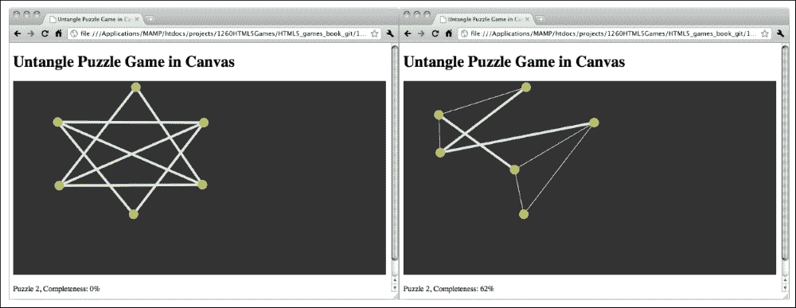

# 第五章. 构建 Canvas 游戏进阶课程

*在前一章中，我们探索了一些基本的画布上下文绘制 API，并创建了一个名为 Untangle 的游戏。在这一章中，我们将通过使用一些其他的上下文绘制 API 来增强这个游戏。*

在这一章中，你将学习以下内容：

+   实现 Untangle 游戏逻辑

+   在画布中使用自定义网络字体填充文本

+   在画布中绘制图像

+   动画精灵图集图像

+   构建多个画布层

以下截图是我们将通过本章构建的最终结果的预览。这是一个基于 Canvas 的 Untangle 游戏，具有动画游戏指南和几个细微之处：


你也可以尝试最终的游戏示例：[`makzan.net/html5-games/untangle/`](http://makzan.net/html5-games/untangle/)。

那我们就开始吧。

# 制作 Untangle 谜题游戏

现在我们已经创建了一个交互式的画布，我们可以拖动圆圈，以及与其它线条交叉的连接圆圈的线条。我们为什么不把它变成一个游戏呢？有一些预定义的圆圈和线条，我们的目标是拖动圆圈，使得没有线条交叉。这被称为**Untangle 解谜游戏**。

# 行动时间 - 在 Canvas 中制作 Untangle 谜题游戏

让我们在我们的线交叉代码中添加游戏逻辑：

1.  我们还需要两个用于游戏逻辑的文件。创建两个新的文件，命名为`untangle.game.js`和`untangle.levels.js`，并将它们放入`js`文件夹中。

1.  在文本编辑器中打开`index.html`文件。添加以下代码以包含我们新创建的文件。将代码放在包含`js/untangle.js`文件之前：

    ```js
    <script src="img/untangle.levels.js"></script>
    <script src="img/untangle.game.js"></script>
    ```

1.  仍然在`index.html`文件中，我们在`canvas`元素之后添加以下代码。它显示了游戏级别信息：

    ```js
    <p>Puzzle <span id="level">0</span>, Completeness: <span id="progress">0</span>%</p>
    ```

1.  打开`untangle.levels.js`文件。将以下级别数据定义代码放入文件中。这是为玩家提供的预定义级别数据，它是一组定义圆圈放置位置及其初始连接方式的集合：

    ```js
    if (untangleGame === undefined) {
      var untangleGame = {};
    }
    untangleGame.levels = [
      {
        circles : [
              {x : 400, y : 156},
              {x : 381, y : 241},
              {x : 84, y : 233},
              {x : 88, y : 73}],
        relationship : [
              {connectedPoints : [1,2]},
              {connectedPoints : [0,3]},
              {connectedPoints : [0,3]},
              {connectedPoints : [1,2]}
        ]
      },
      {
        circles : [
              {x : 401, y : 73},
              {x : 400, y : 240},
              {x : 88, y : 241},
              {x : 84, y : 72}],
        relationship : [
              {connectedPoints : [1,2,3]},
              {connectedPoints : [0,2,3]},
              {connectedPoints : [0,1,3]},
              {connectedPoints : [0,1,2]}
        ]
      },
      {
        circles : [
              {x : 192, y : 155},
              {x : 353, y : 109},
              {x : 493, y : 156},
              {x : 490, y : 236},
              {x : 348, y : 276},
              {x : 195, y : 228}],
        relationship : [
              {connectedPoints : [2,3,4]},
              {connectedPoints : [3,5]},
              {connectedPoints : [0,4,5]},
              {connectedPoints : [0,1,5]},
              {connectedPoints : [0,2]},
              {connectedPoints : [1,2,3]}
        ]
      }
    ];
    ```

1.  在文本编辑器中打开`untangle.game.js`文件。我们将把游戏逻辑放入这个文件。

1.  这是一个新文件，所以我们定义`untangleGame`对象在文件的开始部分：

    ```js
    if (untangleGame === undefined) {
      var untangleGame = {};
    }
    ```

1.  继续在`untangle.game.js`文件中。将以下变量添加到文件中。它们存储游戏的当前级别和进度：

    ```js
    untangleGame.currentLevel = 0;
    untangleGame.levelProgress = 0;
    ```

1.  在开始每个级别时，我们需要设置初始级别数据。为了使代码更易于阅读，我们创建了一个函数。将以下代码追加到`untangle.game.js` JavaScript 文件中：

    ```js
    untangleGame.setupCurrentLevel = function() {
      untangleGame.circles = [];
      var level = untangleGame.levels[untangleGame.currentLevel];
      for (var i=0; i<level.circles.length; i++) {
        untangleGame.circles.push(new untangleGame.Circle(level.circles[i].x, level.circles[i].y, 10));
      }

      untangleGame.levelProgress = 0;

      untangleGame.connectCircles();
      untangleGame.updateLineIntersection();
      untangleGame.checkLevelCompleteness();
      untangleGame.updateLevelProgress();
    }
    ```

1.  这是一个包含多个级别的游戏。我们需要检查玩家是否解决了当前级别的谜题，并跳转到下一个谜题。将以下函数添加到`untangle.game.js`文件的末尾：

    ```js
    untangleGame.checkLevelCompleteness = function () {
      if (untangleGame.levelProgress === 100) {
        if (untangleGame.currentLevel+1 < untangleGame.levels.length) {
          untangleGame.currentLevel+=1;
        }
        untangleGame.setupCurrentLevel();
      }
    }
    ```

1.  我们需要一个额外的函数来更新游戏进度。将以下函数添加到`untangle.game.js`文件的末尾：

    ```js
    untangleGame.updateLevelProgress = function() {
      // check the untangle progress of the level
      var progress = 0;
      for (var i=0; i<untangleGame.lines.length; i++) {
        if (untangleGame.lines[i].thickness === untangleGame.thinLineThickness) {

          progress+=1;
        }
      }
      var progressPercentage = Math.floor(progress/untangleGame.lines.length*100);

      untangleGame.levelProgress = progressPercentage;
      $("#progress").text(progressPercentage);

      // display the current level
      $("#level").text(untangleGame.currentLevel);
    }
    ```

1.  打开 `untangle.input.js` 文件。我们在鼠标移动事件处理程序中添加以下代码，以更新级别进度：

    ```js
    untangleGame.updateLevelProgress();
    ```

1.  我们在鼠标抬起事件处理程序中添加以下代码来检查玩家是否完成了级别：

    ```js
    untangleGame.checkLevelCompleteness();
    ```

1.  现在在编辑器中打开 `untangle.js` 文件。在 jQuery 文档的 `ready` 函数内部，我们有一些设置圆和线的代码。它们现在被我们的级别设置代码所替换。删除对 `untangleGame.createRandomCircles` 和 `untangleGame.connectCircles` 函数的调用。用以下代码替换它们：

    ```js
    untangleGame.setupCurrentLevel();
    ```

1.  最后，在代码编辑器中打开 `untangle.drawing.js` 文件。我们将 `connectCircles` 函数替换为根据级别数据连接圆的函数：

    ```js
    untangleGame.connectCircles = function() {
      // set up all lines based on the circles relationship
      var level = untangleGame.levels[untangleGame.currentLevel];
      untangleGame.lines.length = 0;
      for (var i in level.relationship) {
        var connectedPoints = level.relationship[i].connectedPoints;
        var startPoint = untangleGame.circles[i];
        for (var j in connectedPoints) {
          var endPoint = untangleGame.circles[connectedPoints[j]];
          untangleGame.lines.push(new untangleGame.Line(startPoint, endPoint, untangleGame.thinLineThickness));
        }
      }
    }
    ```

1.  保存所有文件并在浏览器中测试游戏。我们可以拖动圆圈，线宽将指示是否与其他线相交。在鼠标拖动过程中，当检测到更多或更少的线相交时，级别完成百分比应发生变化。如果我们解开了谜题，即没有线相交时，游戏将跳到下一级。当游戏达到最后一级时，它将不断显示最后一级。这是因为我们还没有添加游戏结束界面。

## *刚才发生了什么？*

我们已经将游戏逻辑添加到我们的画布中，以便我们可以玩本章中创建的圆形拖拽代码。这一节更改了相当多的代码。您可以在以下链接找到带有未压缩源代码的工作示例：[`makzan.net/html5-games/untangle-wip-gameplay/`](http://makzan.net/html5-games/untangle-wip-gameplay/)。

让我们回顾一下我们添加到 `untangleGame` 对象中的变量。以下表格列出了这些变量的描述和用法：

| 变量 | 描述 |
| --- | --- |
| `circleRadius` | 所有绘制圆的半径设置。 |
| `thinLineThickness` | 绘制细线时的线宽。 |
| `boldLineThickness` | 绘制粗线时的线宽。 |
| `circles` | 一个数组，用于在画布中存储所有绘制的圆。 |
| `lines` | 一个数组，用于在画布中存储所有绘制的线。 |
| `targetCircle` | 跟踪我们正在拖动的圆。 |
| `levels` | 以 JSON 格式存储每个级别的所有初始数据。 |
| `currentLevel` | 一个数字，帮助您记住当前级别。 |
| `levelProgress` | 所有线中非相交线的百分比。 |

## 定义级别数据

在每个级别中，我们都有一个 Untangle 拼图的圆的初始位置。级别数据设计为一个对象的数组。每个对象包含每个级别的数据。在每个级别的数据内部，有三个属性：级别编号、圆和连接圆的线。以下表格显示了每个级别数据中的属性：

| 级别属性 | 定义 | 讨论 |
| --- | --- | --- |
| `circles` | 定义级别中圆圈位置的数组。 | 这定义了当设置级别时圆圈的初始放置方式。 |

| `relationships` | 定义哪些圆圈相互连接的关系数组。 | 每个级别中都有一些连接圆圈的线条。我们设计线条连接方式，以确保每个级别都有一个解决方案。每个关系数组的索引表示目标圆圈。线条关系的值定义了哪个圆圈连接到目标圆圈。例如，以下代码表示目标圆圈连接到圆圈 1 和圆圈 2：

```js
{"connectedPoints" : [1,2]}
```

|

## 确定升级

当没有线条相互交叉时，级别就完成了。我们遍历每条线，看看有多少线条是细的。细线意味着它们没有与其他线条交叉。我们可以使用细线来计算所有线条的比例，以获得级别的完成百分比：

```js
var progress = 0;
for (var i in untangleGame.lines) {
  if (untangleGame.lines[i].thickness === untangleGame.thinLineThickness) {
    progress+=1;
  }
}
var progressPercentage = Math.floor(progress/untangleGame.lines.length * 100);
```

当进度达到 100%时，我们可以简单地确定级别已经完成。

## 显示当前级别和完成进度

我们在 Canvas 游戏下方显示了一句话，描述当前级别的状态和进度。它用于向玩家显示游戏状态，让他们知道他们在游戏中正在取得进展：

```js
<p>Puzzle <span id="level">0</span>, Completeness: <span id="progress">0</span>%</p>
```

我们使用在第二章中讨论的 jQuery `text` 函数，*基于 DOM 的游戏开发入门*，来更新完成进度：

```js
$("#progress").text(progressPercentage);
```

## 尝试一下英雄

到目前为止，我们在示例 Untangle 谜题游戏中只定义了三个级别。但只有三个级别玩起来还不够有趣。为什么不给游戏添加更多级别呢？如果你想不出级别，试着在互联网上搜索类似的 untangle 游戏，并从中获得一些灵感。

# 在 Canvas 上绘制文本

想象一下，现在我们想在 Canvas 内部直接显示进度级别。Canvas 为我们提供了在 Canvas 内部绘制文本的方法。

# 操作时间 – 在 canvas 元素内显示进度级别文本

1.  我们将继续使用我们的 Untangle 游戏。在文本编辑器中打开`untangle.drawing.js` JavaScript 文件。在`gameloop`函数中的 Canvas 绘制代码之后添加以下代码，该代码在 Canvas 内部绘制当前级别和进度文本：

    ```js
    untangleGame.drawLevelProgress = function() {
      var ctx = untangleGame.ctx;
      ctx.font = "26px Arial";
      ctx.fillStyle = "WHITE";
      ctx.textAlign = "left";
      ctx.textBaseline = "bottom";
      ctx.fillText("Puzzle "+untangleGame.currentLevel+", Completeness: " + untangleGame.levelProgress + "%", 60, ctx.canvas.height-60);
    }
    ```

1.  打开`untangle.js`文件。我们在`gameloop`函数中放入以下代码：

    ```js
    untangleGame.drawLevelProgress();
    ```

1.  保存文件，并在网页浏览器中预览`index.html`。我们会看到文本现在被绘制在 Canvas 内部。

## *发生了什么？*

我们刚刚在基于 Canvas 的游戏中绘制了标题和级别进度文本。我们通过使用`fillText`函数在 Canvas 上绘制文本。以下表格显示了如何使用该函数：

```js
fillText(string, x, y);
```

| 参数 | 定义 |
| --- | --- |
| `String` | 我们将要绘制的文本 |
| `X` | 文本绘制的*x*坐标 |
| `Y` | 文本绘制的*y*坐标 |

这是绘制文本的基本设置。还有更多绘图上下文属性可以设置文本绘制：

| 上下文属性 | 定义 | 讨论 |
| --- | --- | --- |

| `context.font` | 文本的字体样式 | 这与我们用于在 CSS 中声明字体样式的语法相同。例如，以下代码将字体样式设置为 20 像素粗体，使用 Arial 字体：

```js
ctx.font = "bold 20px Arial";
```

|

| `context.textAlign` | 文本对齐 | **对齐方式**定义了文本的对齐方式。它可以有以下值之一：

+   `start`

+   `end`

+   `left`

+   `right`

+   `center`

例如，如果我们想在 Canvas 的右边缘放置一些文本，使用`left`对齐意味着我们需要计算文本的宽度，以便知道文本的 x 坐标。在这种情况下使用右对齐，我们只需直接将 x 位置设置为 Canvas 宽度。文本将自动放置在 Canvas 的右边缘。|

| `context.textBaseline` | 文本基线 | 以下列出了`textBaseline`属性的常见值：

+   `top`

+   `middle`

+   `bottom`

+   `alphabet`

与文本对齐类似，当我们要将文本放置在 Canvas 底部时，`bottom`基线非常有用。`fillText`函数的`y`位置基于文本的底部基线而不是顶部。`alphabet`基线根据小写字母对齐 y 位置。以下截图显示了使用**alphabet**基线的文本绘制效果。|

### 注意

请注意，Canvas 中的文本绘制被视为位图图像数据。这意味着访客无法选择文本；搜索引擎无法索引文本；我们无法搜索文本。因此，我们应该仔细考虑是否要在 Canvas 内绘制文本，或者直接将其放置在 DOM 中。或者，我们应该将`canvas`元素内的备用文本更改为反映绘制文本。

## 快速问答 - 在 Canvas 中绘制文本

Q1\. 如果我们要在 Canvas 的右下角附近绘制一些文本，哪种对齐和基线设置更好？

1.  左对齐，底部基线。

1.  居中对齐，字母基线。

1.  右对齐，底部基线。

1.  居中对齐，中间基线。

Q2\. 我们将使用最新的开放网络标准制作一本具有翻页效果的逼真书籍。以下哪个设置更好？

1.  在 Canvas 中绘制逼真的书籍，包括所有文本和翻页效果。

1.  将所有文本和内容放入 DOM 中，并在 Canvas 中绘制逼真的翻页效果。

## 在 Canvas 中使用嵌入的 Web 字体

我们在记忆中使用了自定义字体，与上一章中的游戏相匹配。自定义字体嵌入在 Canvas 中同样有效。让我们在我们的 Untangle 游戏中进行一个在 Canvas 中绘制自定义字体的实验。

# 实践时间 - 将 Google 网络字体嵌入到 canvas 元素中

让我们使用手写风格的字体绘制 Canvas 文本：

1.  首先，前往 Google 字体目录并选择一种手写风格的字体。我使用了**Rock Salt**字体，您可以从以下网址获取它：[`www.google.com/fonts/specimen/Rock+Salt`](http://www.google.com/fonts/specimen/Rock+Salt)。

1.  Google 字体目录提供了一个 CSS 链接代码，我们可以将其添加到游戏中以嵌入字体。将以下 CSS 链接添加到`index.html`的头部：

    ```js
    <link href='http://fonts.googleapis.com/css?family=Rock+Salt' rel='stylesheet' type='text/css'>
    ```

1.  下一步是使用字体。我们打开`untangle.drawing.js`JavaScript 文件，并在`drawLevelProgress`函数中将上下文的`font`属性修改为以下内容：

    ```js
    ctx.font = "26px 'Rock Salt'";
    ```

1.  现在是时候在我们的网页浏览器中打开游戏以测试结果了。Canvas 中绘制的文本现在使用的是我们在 Google 字体目录中选择的字体。

## *刚才发生了什么？*

我们只是选择了一个网络字体并将其嵌入到 Canvas 中绘制文本。这表明我们可以在 Canvas 中填充文本的字体家族中像其他 DOM 元素一样进行样式设置。

### 提示

有时候，尽管单词数量相同，不同字体的文本宽度也会有所不同。在这种情况下，我们可以使用`measureText`函数来获取我们绘制的文本宽度。Mozilla 开发者网络解释了如何使用该函数，请参阅：[`developer.mozilla.org/en/Drawing_text_using_a_canvas#measureText()`](https://developer.mozilla.org/en/Drawing_text_using_a_canvas#measureText())。

# 在 Canvas 中绘制图像

我们已经在 Canvas 内部绘制了一些文本。那么绘制图像呢？是的。绘制图像和图像处理是 Canvas 的一个大特性。

# 动手时间 – 向游戏中添加图形

我们将要为游戏绘制一个黑板背景：

1.  从代码示例包或以下网址下载图形文件：[`mak.la/book-assets`](http://mak.la/book-assets)。图形文件包括我们本章需要的所有图形。

1.  将新下载的图形文件放入一个名为`images`的文件夹中。

1.  现在是真正加载图像的时候了。在我们刚刚下载的图形文件中有一个`board.png`文件。这是一个黑板图形，我们将它绘制在 Canvas 上作为背景。在上一步骤中添加的代码之后添加以下代码：

    ```js
    untangleGame.loadImages = function() {
      // load the background image
      untangleGame.background = new Image();

      untangleGame.background.onerror = function() {
        console.log("Error loading the image.");
      }
      untangleGame.background.src = "images/board.png";
    };
    ```

1.  由于图像加载需要时间，我们还需要确保在绘制之前它已经被加载：

    ```js
    untangleGame.drawBackground = function() {
      // draw the image background
      untangleGame.ctx.drawImage(untangleGame.background, 0, 0);
    };
    ```

1.  打开`untangle.js`文件，在 jQuery 文档的`ready`函数中：

    ```js
    untangleGame.loadImages();
    ```

1.  在`untangle.js`文件中的`gameloop`函数里，我们在清除上下文之后、绘制其他任何内容之前，在 Canvas 上绘制图像：

    ```js
    untangleGame.drawBackground();
    ```

1.  接下来，我们不希望 Canvas 设置背景颜色，因为我们有一个带有透明边框的 PNG 背景。打开`untangle.css`文件并移除 Canvas 中的背景属性。

1.  现在，保存所有文件并在网络浏览器中打开 `index.html` 文件。背景应该在那里，手写字体应该与我们的黑板主题相匹配。

## *发生了什么？*

我们刚刚在 `canvas` 元素内部绘制了一个图像。您可以在以下 URL 中找到工作示例：

[`makzan.net/html5-games/untangle-wip-graphics1/`](http://makzan.net/html5-games/untangle-wip-graphics1/)

在画布上绘制图像有两种常见方法。我们可以引用现有的 `` 标签，或者动态地在 JavaScript 中加载图像。

这里是如何在 `canvas` 中引用现有的图像标签的，假设我们有以下 `img` 标签在 HTML 中：

```js

```

我们可以使用以下 JavaScript 代码在画布上绘制图像：

```js
var img = document.getElementById('board');
context.drawImage(img, x, y);
```

这里是另一个代码片段，用于在不将 `` 标签附加到 DOM 中的情况下加载图像。如果我们将在 JavaScript 中加载图像，我们需要确保图像在画布上绘制之前已经加载。因此，我们在图像的 `onload` 事件之后绘制图像：

```js
var board = new Image();
board.onload = function() {
  context.drawImage(board, x, y);
}
board.src = "images/board.png";
```

### 小贴士

设置 `onload` 事件处理程序和分配图像 `src` 时，顺序很重要。

当我们将 `src` 属性分配给图像，并且如果图像被浏览器缓存，一些浏览器会立即触发 `onload` 事件。如果我们把 `onload` 事件处理程序放在分配 `src` 属性之后，我们可能会错过它，因为它在我们设置事件处理程序之前被触发。

在我们的示例中，我们使用了后一种方法。我们创建了一个 `Image` 对象并加载了背景。

在加载图像时，我们还应该处理另一个事件，即 `onerror` 事件。当我们访问额外的网络数据时，它特别有用。我们使用以下代码片段来检查我们示例中的错误：

```js
untangleGame.background.onerror = function() {
  console.log("Error loading the image.");
}
```

## 尝试一下英雄

现在加载错误现在只会在控制台中显示一条消息。通常玩家不会查看控制台。我们是否可以向画布写入一条消息，告诉玩家游戏未能加载游戏资源？

## 使用 `drawImage` 函数绘制图像

使用 `drawImage` 函数在画布上绘制图像有三种方法。我们可以在给定的坐标上不进行任何修改地绘制图像，我们也可以在给定的坐标上使用缩放因子绘制图像，或者甚至裁剪图像并只绘制剪切区域。

`drawImage` 函数接受多个参数：

+   在 `drawImage(image, x, y);` 中出现的每个参数都在以下表格中解释：

    | 参数 | 定义 | 讨论 |
    | --- | --- | --- |
    | `image` | 我们将要绘制的图像的引用。 | 我们可以通过使用现有的 `img` 元素或创建 JavaScript `Image` 对象来获取图像引用。 |
    | `x` | 图像将在画布坐标中放置的 *x* 位置。 | *x* 和 *y* 坐标是我们放置图像相对于其左上角的位置。 |
    | `y` | 图像将在画布坐标中放置的 *y* 位置。 |

+   在 `drawImage(image, x, y, width, height);` 函数中出现的每个参数都在以下表格中进行了说明：

    | 参数 | 定义 | 讨论 |
    | --- | --- | --- |
    | `image` | 我们将要绘制的图像引用。 | 我们可以通过获取现有的 `img` 元素或创建 JavaScript `Image` 对象来获取图像引用。 |
    | `x` | 图像在 Canvas 坐标系中放置的**x**位置。 | **x** 和 **y** 坐标是相对于图像的左上角放置图像的位置。 |
    | `y` | 图像在 Canvas 坐标系中放置的**y**位置。 |
    | `width` | 最终绘制图像的**宽度**。 | 如果宽度和高度与原始图像不同，我们将对图像应用缩放。 |
    | `height` | 最终绘制图像的**高度**。 |

+   在 `drawImage(image, sx, sy, sWidth, sHeight, dx, dy, width, height);` 函数中出现的每个参数都在以下表格中进行了说明：

    | 参数 | 定义 | 讨论 |
    | --- | --- | --- |
    | `image` | 我们将要绘制的图像引用。 | 我们可以通过获取现有的 `img` 元素或创建 JavaScript `Image` 对象来获取图像引用。 |
    | `sx` | 剪裁区域左上角的**x**坐标。 | 通过将剪裁区域的**x**、**y**、宽度、高度一起定义，可以确定一个矩形剪裁区域。给定的图像将通过这个矩形进行剪裁。 |
    | `sy` | 剪裁区域左上角的**y**坐标。 |
    | `sWidth` | 剪裁区域的**宽度**。 |
    | `sHeight` | 剪裁区域的**高度**。 |
    | `dx` | 图像在 Canvas 坐标系中放置的**x**位置。 | **x** 和 **y** 坐标是相对于图像的左上角放置图像的位置。 |
    | `dy` | 图像在 Canvas 坐标系中放置的**y**位置。 |
    | `width` | 最终绘制图像的**宽度**。 | 如果剪裁的宽度和高度与剪裁维度不同，我们将对剪裁的图像应用缩放。 |
    | `height` | 最终绘制图像的**高度**。 |

## 英雄尝试 – 优化背景图像

在示例中，我们在每次调用 `gameloop` 函数时将黑板图像作为背景绘制。由于我们的背景是静态的，并且不会随时间变化，因此不断清除并重新绘制它是在浪费 CPU 资源。我们如何优化这个问题？在后面的部分，我们将游戏分成多个层级，以避免重新绘制静态的背景图像。

## 装饰基于 Canvas 的游戏

我们已经增强了 Canvas 游戏，添加了渐变和图像。在继续前进之前，让我们装饰我们的 Canvas 游戏网页。

# 实施动作 – 为游戏添加 CSS 样式和图像装饰

我们将构建一个居中对齐的布局，包含游戏标题：

1.  在文本编辑器中打开 `index.html` 文件。使用一个分组 DOM 元素来设置布局样式对我们来说更容易。我们将所有元素放入一个具有 `id` 页面的部分中。用以下内容替换 HTML 文件的内容：

    ```js
    <section id="page">
      <header>
        <h1>Untangle Puzzle Game in Canvas</h1>
      </header>

      <canvas id="game" width="768" height="400">
        This is an interactive game with circles and lines connecting them.
      </canvas>
      <p>Puzzle <span id="level">0</span>, Completeness: <span id="progress">0</span>%</p>

      <footer>
        <p>This is an example of Untangle Puzzle Game in Canvas.</p>
      </footer>
    </section>
    ```

1.  让我们在 `untangle.css` 文件中应用 CSS 到页面布局。用以下代码替换现有内容：

    ```js
    html, body {
      background: url(../images/title_bg.png) 50% 0 no-repeat, 
          url(../images/bg_repeat.png) 50% 0 repeat-y #889ba7;
      margin: 0;
      color: #111;
    }

    #game{
      position:relative;
    }

    #page {
      width: 820px;
      min-height: 800px;
      margin: 0 auto;
      padding: 0;
      text-align: center;
      text-shadow: 0 1px 5px rgba(60,60,60,.6);
    }

    header {
      height: 88px;
      padding-top: 36px;
      margin-bottom: 50px;
      font-family: "Rock Salt", Arial, sans-serif;
      font-size: 14px16px;
      text-shadow: 0 1px 0 rgba(200,200,200,.5);
      color: #121;
    }
    ```

1.  是时候保存所有文件并在网页浏览器中预览游戏了。我们应该看到一个标题带和一个居中对齐的精美布局。以下截图显示了结果：

## *发生了什么？*

我们刚刚装饰了包含我们的基于 Canvas 的游戏的网页。尽管我们的游戏基于 Canvas 绘图，但这并不限制我们用图形和 CSS 样式装饰整个网页。

### 注意

**canvas 元素的默认背景**

`canvas` 元素的默认背景是透明的。如果我们不对 Canvas 设置任何背景 CSS 样式，它将是透明的。当我们的绘图不是矩形时，这很有用。在这个例子中，纹理布局背景显示在 Canvas 区域内。

## 快速问答 – 设置 Canvas 背景

Q1. 我们如何设置 Canvas 背景为透明？

1.  将背景颜色设置为 `#ffffff`。

1.  不做任何事情。默认情况下它是透明的。

# 在 Canvas 中动画化精灵图集

我们首先在 第三章 中使用了 **精灵图集** 图像，*使用 CSS3 构建纸牌匹配游戏*，当显示一副扑克牌时。

# 行动时间 – 制作游戏指南动画

在图片文件夹中有一个名为 `guide_sprite.png` 的图形文件。它是一个包含动画每个步骤的游戏指南图形。


让我们用 **动画** 将这个指南绘制到我们的游戏中：

1.  在文本编辑器中打开 `untangle.drawing.js` JavaScript 文件。

1.  在 `untangleGame.loadImages` 函数中，添加以下代码：

    ```js
    // load the guide sprite image
    untangleGame.guide = new Image();
    untangleGame.guide.onload = function() {
      // setup timer to switch the display frame of the guide sprite
      untangleGame.guideFrame = 0;
      setInterval(untangleGame.guideNextFrame, 500);
    }
    untangleGame.guide.src = "images/guide_sprite.png";
    ```

1.  仍然在 `untangleGame.drawing.js` 文件中，我们添加以下函数，每 500 毫秒将当前帧移动到下一帧：

    ```js
    untangleGame.guideNextFrame = function() {
      untangleGame.guideFrame++;
      // there are only 6 frames (0-5) in the guide animation.
      // we loop back the frame number to frame 0 after frame 5.
      if (untangleGame.guideFrame > 5) {
        untangleGame.guideFrame = 0;
      }
    }
    ```

1.  接下来，我们在 `untangleGame.drawing.js` 文件中定义 `drawGuide` 函数。这个函数根据当前帧绘制指南动画：

    ```js
    untangleGame.drawGuide = function() {
      var ctx = untangleGame.ctx;
      // draw the guide animation
      if (untangleGame.currentLevel === 0) {
        // the dimension of each frame is 80x130.
        var nextFrameX = untangleGame.guideFrame * 80;
        ctx.drawImage(untangleGame.guide, nextFrameX, 0, 80, 130, 325, 130, 80, 130);
      }
    };
    ```

1.  让我们切换到 `untangle.js` 文件。在 `gameloop` 函数中，我们在结束 `gameloop` 函数之前调用指南绘图函数。

    ```js
    untangleGame.drawGuide();
    ```

1.  让我们在网页浏览器中通过打开 `index.html` 文件来观看动画。以下截图展示了游戏指南的动画。指南动画将在玩家升级前播放并循环：

## *发生了什么？*

当使用 `drawImage` 上下文函数时，我们只能绘制图像的一个区域。

以下截图逐步展示了动画过程。矩形是剪切区域：


我们使用名为`guideFrame`的变量来控制显示哪个帧。每个帧的宽度是 80。因此，我们通过乘以宽度和当前帧号来获取剪切区域的 x 位置：

```js
var nextFrameX = untangleGame.guideFrame * 80;
ctx.drawImage(untangleGame.guide, nextFrameX, 0, 80, 130, 325, 130, 80, 130);
```

`guideFrame`变量通过以下`guideNextFrame`函数每 500 毫秒更新一次：

```js
untangleGame.guideNextFrame = function() {
  untangleGame.guideFrame += 1;
  // there are only 6 frames (0-5) in the guide animation.
  // we loop back the frame number to frame 0 after frame 5.
  if (untangleGame.guideFrame > 5) {
     untangleGame.guideFrame = 0;
  }
}
```

在开发游戏时，动画精灵是一种常用的技术。在开发传统视频游戏时使用精灵动画有一些好处。这些原因可能不适用于网络游戏开发，但使用精灵表动画还有其他好处：

+   所有帧都作为一个文件加载，所以一旦精灵文件被加载，整个动画就准备好了。

+   将所有帧放入一个文件意味着我们可以减少从网络浏览器到服务器的 HTTP 请求。如果每个帧都是一个文件，浏览器会多次请求该文件，而现在它只需请求一个文件并使用一个 HTTP 请求。

+   将不同的图像放入一个文件也减少了文件的重复，这有助于减少重复文件的头部、尾部和元数据。

+   将所有帧放入一个图像中意味着我们可以轻松地剪切图像以显示任何帧，而无需复杂的代码来更改图像源。

精灵表动画通常用于角色动画。以下截图是我在一个名为**邻居**的 HTML5 游戏中使用的愤怒猫的**精灵动画**。


在本例中，我们通过剪切帧并自行设置计时器来构建精灵表动画。当处理大量动画时，我们可能希望使用第三方精灵动画插件或创建自己的 Canvas 精灵动画，以更好地重用和管理逻辑代码。

### 注意

精灵动画是 HTML5 游戏开发中的一个重要主题，有许多在线资源讨论了这个主题。以下是一些链接：

Simurai 的精灵动画教程([`simurai.com/blog/2012/12/03/step-animation/`](http://simurai.com/blog/2012/12/03/step-animation/))讨论了我们可以如何仅使用 CSS 制作精灵动画。

Spritely ([`www.spritely.net/`](http://www.spritely.net/))，另一方面，通过 CSS 在 DOM 元素上提供精灵动画。当我们想要在不使用 Canvas 的情况下动画化精灵时，这很有用。

# 创建多层 Canvas 游戏

现在所有东西都绘制到了没有其他状态来区分绘制项的上下文中。我们可能将 Canvas 游戏分成不同的层，并编写逻辑来控制一次绘制一个层。

# 行动时间 - 将游戏分为四层

我们将把我们的 Untangle 游戏分为四层：

1.  在`index.html`中，我们需要更改或替换当前的`canvas`标签，如下所示。它应该在部分内包含几个 Canvas：

    ```js
    <section id="layers">
      <canvas id="bg" width="768" height="440">
        This is an interactive game with circles and lines connecting them.
      </canvas>
      <canvas id="guide" width="768" height="440"></canvas>
      <canvas id="game" width="768" height="440"></canvas>
      <canvas id="ui" width="768" height="440"></canvas>
    </section>
    ```

1.  我们还需要将一些样式应用到画布上，以便它们相互重叠，从而创建多层效果。同时，我们必须准备一个`fadeout`类和一个`dim`类，以便使目标透明。将以下代码添加到`untangle.css`文件中：

    ```js
    #layers {
      position: relative;
      margin: 0 auto;
      width:768px;
      height: 440px;
    }
    #layers canvas{
      top: 0;
      left: 0;
      position: absolute;
    }
    #guide {
      opacity: 0.7;
      transition: opacity 0.5s ease-out;
    }
    #guide.fadeout {
      opacity: 0; 
    }
    #ui {
      transition: opacity 0.3s ease-out;
    }
    #ui.dim {
      opacity: 0.3;
    }
    ```

1.  打开`untangle.js` JavaScript 文件。我们修改代码以支持层功能。首先，我们添加一个数组来存储每个 Canvas 的上下文引用。在文件的开始处添加它，在 jQuery 文档就绪函数之前，并在`untangleGame`定义之后：

    ```js
    untangleGame.layers = [];
    ```

1.  然后，我们在 jQuery 文档就绪函数中删除以下代码行。

    ```js
    var canvas = document.getElementById("game");
    untangleGame.ctx = canvas.getContext("2d");
    ```

1.  我们用以下代码替换我们删除的代码。我们获取每个 Canvas 层的上下文引用并将它们存储在数组中：

    ```js
    // prepare layer 0 (bg)
    var canvas_bg = document.getElementById("bg");
    untangleGame.layers[0] = canvas_bg.getContext("2d");

    // prepare layer 1 (guide)
    var canvas_guide = document.getElementById("guide");
    untangleGame.layers[1] = canvas_guide.getContext("2d");

    // prepare layer 2 (game)
    var canvas = document.getElementById("game");    
    var ctx = canvas.getContext("2d");
    untangleGame.layers[2] = ctx;

    // prepare layer 3 (ui)
    var canvas_ui = document.getElementById("ui");
    untangleGame.layers[3] = canvas_ui.getContext("2d");
    ```

1.  让我们切换到`untangle.drawing.js`文件。我们将在几个地方更新上下文引用以支持多层。

1.  现在有四个 Canvas 上下文，我们可以清除。找到现有的`clear`函数，并将其替换为以下内容：

    ```js
    untangleGame.clear = function(layerIndex) {
      var ctx = untangleGame.layers[layerIndex];
      ctx.clearRect(0,0,ctx.canvas.width,ctx.canvas.height);
    };
    ```

1.  在`drawCircle`和`drawLine`函数中，将`var ctx = untangleGame.ctx;`替换为以下代码：

    ```js
    var ctx = untangleGame.layers[2];
    ```

1.  在`drawLevelProgress`函数中，将`var ctx = untangleGame.ctx;`替换为以下代码：

    ```js
    var ctx = untangleGame.layers[3];
    ```

1.  在`drawBackground`函数中，我们将现有代码替换为以下代码，该代码在索引为`0`的背景层上绘制：

    ```js
    untangleGame.drawBackground = function() {
      // draw the image background
      var ctx = untangleGame.layers[0];
      ctx.drawImage(untangleGame.background, 0, 0);
    };
    ```

1.  然后，我们转到`loadImages`函数。向函数中添加以下代码。它绘制一次背景：

    ```js
    untangleGame.background.onload = function() {
      untangleGame.drawBackground();
    }
    ```

1.  在`drawGuide`函数中，将`var ctx = untangleGame.ctx;`替换为以下代码：

    ```js
    var ctx = untangleGame.layers[1];
    ```

1.  实际上，我们也在这个函数中淡出指南层。因此，我们将整个`drawGuide`函数替换为以下内容：

    ```js
    untangleGame.drawGuide = function() {
      var ctx = untangleGame.layers[1];
      // draw the guide animation
      if (untangleGame.currentLevel < 2) {
        // the dimension of each frame is 80x130.
        var nextFrameX = untangleGame.guideFrame * 80;
        ctx.drawImage(untangleGame.guide, nextFrameX, 0, 80, 130, 325,
        130, 80, 130);
      }

      // fade out the guideline after level 0
      if (untangleGame.currentLevel === 1)   {
        $("#guide").addClass('fadeout');
      }
    };
    ```

1.  在`guideNextFrame`函数内部，我们清除指南层并重新绘制它。向函数末尾添加以下代码：

    ```js
    untangleGame.clear(1);
    untangleGame.drawGuide();
    ```

1.  在圆形拖动过程中，我们不希望我们的进度文本层阻挡游戏元素。因此，我们将定义一个额外的函数，在有任何游戏圆形重叠层时降低进度层的透明度：

    ```js
    untangleGame.dimUILayerIfNeeded = function() {
      // get all circles,
      // check if the ui overlap with the game objects
      var isOverlappedWithCircle = false;
      for(var i in untangleGame.circles) {
        var point = untangleGame.circles[i];
        if (point.y > 280) {
          isOverlappedWithCircle = true;
        }
      }
      if (isOverlappedWithCircle) {
        $("#ui").addClass('dim');
      } else {
        $("#ui").removeClass('dim');
      }
    };
    ```

1.  我们已经完成了`untangle.drawing.js`文件。让我们切换回`untangle.js`文件。在`gameloop`函数中，我们删除对`drawBackground`和`drawGuide`函数的调用。然后，我们调用`dimUILayerIfNeeded`函数。我们还在每个游戏循环中清除层 2 游戏元素和层 3 关卡进度。现在`gameloop`函数变为以下内容：

    ```js
    function gameloop() {
      // clear the canvas before re-drawing.
      untangleGame.clear(2);
      untangleGame.clear(3);

      untangleGame.drawAllLines();
      untangleGame.drawAllCircles();
      untangleGame.drawLevelProgress();
      untangleGame.dimUILayerIfNeeded();
    }
    ```

1.  最后，打开`untangle.input.js`文件。我们曾在`#game` Canvas 上设置了鼠标按下、移动和抬起事件监听器。由于游戏 Canvas 现在是重叠的，我们之前在`game` Canvas 上的鼠标事件监听器不再触发。我们可以将监听器更改为监听其父`#layers` DIV 的事件，该 DIV 具有与 Canvas 相同的定位和尺寸：

    ```js
    $("#layers"). bind("mousedown touchstart", function(e){
      // existing code that handles mousedown and touchstart.
    });
    $("#layers"). bind("mousemove touchmove", function(e) {
      // existing code that handles mousemove and touchmove.
    });
    $("#layers"). bind("mouseup touchend", function(e){
      // existing code that handles mouseup and touchend.
    });
    ```

1.  保存所有文件，并在网页浏览器中检查我们的代码更改。游戏应该显示得好像我们没有做任何改变一样。尝试将圆圈拖动到黑板底部边缘附近。关卡进度文本应该变暗到低透明度。当你完成第一关时，指南动画将优雅地淡出。以下截图显示了半透明度的关卡进度：

## *发生了什么？*

我们将我们的工作游戏分为四层。在这一节中有相当多的变化。你可以尝试在：[`makzan.net/html5-games/untangle/`](http://makzan.net/html5-games/untangle/)上的工作示例。通过观察源代码，你可以查看未压缩的代码示例。

现在总共有四个 Canvas。每个 Canvas 负责一个层。层被分为背景、游戏指南、游戏本身以及显示关卡进度的用户界面。

默认情况下，Canvas，就像其他元素一样，是依次放置的。为了重叠所有 Canvas 以构建层效果，我们应用了`absolute`定位。

以下截图显示了我们的游戏中的四个层。默认情况下，后来添加的 DOM 位于先添加的 DOM 之上。因此，`bg` Canvas 位于底部，`ui` 位于顶部：


通过使用不同的层，我们可以为每一层创建特定的逻辑。例如，这个游戏中的背景是静态的。我们只绘制一次。指南层是一个 6 帧动画，每帧 500 毫秒。我们在 500 毫秒的间隔中重新绘制指南层。游戏层和 UI 层是核心游戏逻辑，我们每秒绘制 30 次。

## 将 CSS 技术与 Canvas 绘图混合

我们正在创建一个基于 Canvas 的游戏，但我们并不局限于仅使用 Canvas 绘图 API。每个层都是一个独立的 Canvas 层。我们可以将 CSS 技术应用于任何层。现在，关卡进度信息在另一个具有 ID `ui` 的 Canvas 中。在这个例子中，我们混合了我们在第三章中讨论的 CSS 技术，*使用 CSS3 构建匹配卡片游戏*。

当我们在 Canvas 周围拖动圆圈时，它们可能会覆盖关卡信息。在绘制 UI Canvas 层时，我们检查是否有任何圆圈的坐标太低且与文本重叠。然后我们降低 UI Canvas CSS 的透明度，以免分散玩家对圆圈的注意力。

当玩家升级后，我们也淡出指南动画。这是通过使用 CSS 过渡渐变将整个`guide` Canvas 的透明度淡出到 0 来完成的。由于`guide` Canvas 只负责那个动画，隐藏该 Canvas 不会影响其他元素：

```js
if (untangleGame.currentLevel === 1) {
  $("#guide").addClass('fadeout');
}
```

### 小贴士

**仅清除更改区域以提升 Canvas 性能**

我们可以使用清除函数来仅清除 Canvas 上下文的一部分。这将提高性能，因为它避免了每次都重绘整个 Canvas 上下文。这是通过标记自上次绘制以来状态已更改的上下文的'脏'区域来实现的。

在我们的示例中，在指南 Canvas 层中，我们可能考虑仅清除精灵表图像绘制的区域，而不是整个 Canvas。

在简单的 Canvas 示例中，我们可能看不到显著的区别，但当我们有一个包含许多精灵图像动画和复杂形状绘制的复杂 Canvas 游戏时，它有助于提高性能。

## 尝试一下英雄

当玩家进入第 2 级时，我们淡出指南。那么，当玩家拖动任何圆圈时，我们是否应该淡出指南动画？我们该如何做到这一点？

# 摘要

在本章中，你学习了如何在 Canvas 中绘制梯度、文本和图像。具体来说，我们构建了 Untangle 游戏逻辑，并使用了几个高级 Canvas 技术，包括在绘制图像时使用裁剪功能进行精灵表动画。我们通过堆叠几个`canvas`元素将游戏分为几个层级。这使我们能够分别和具体地处理游戏渲染的不同部分。最后，我们在基于 Canvas 的游戏中混合了 CSS 过渡动画。

在这本书中，我们没有提到的是 Canvas 中的位图操作。Canvas 上下文是一个位图数据，我们可以对每个像素应用操作。例如，我们可以在 Canvas 中绘制一个图像，并应用类似 Photoshop 的滤镜到图像上。我们不会在书中涵盖这一点，因为图像操作是一个高级主题，其应用可能不与游戏开发相关。

现在你已经学习了在 Canvas 中构建游戏以及为游戏对象（如游戏角色）制作动画，我们准备在下一章中为我们的游戏添加音频组件和音效。

我们将在第九章中回到基于 Canvas 的游戏，*使用 Box2D 和 Canvas 构建物理赛车游戏*。
