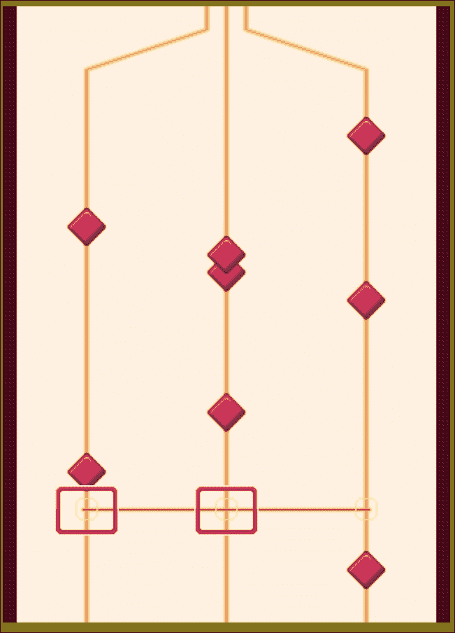

# 第六章。为您的游戏添加声音效果

*在前面几章中，我们讨论了几种绘制游戏对象的技术。在本章中，我们将专注于使用 HTML5 规范中引入的 `audio` 标签。我们可以添加声音效果、背景音乐，并通过 JavaScript API 控制音频。此外，我们将在本章中构建一个音乐游戏。这是一个需要玩家在正确的时间击中正确的弦来产生音乐的游戏。*

在本章中，你将学习以下主题：

+   为 **播放** 按钮添加声音效果

+   构建迷你钢琴音乐游戏

+   将音乐游戏与 **播放** 按钮链接

+   为游戏添加键盘和触摸输入

+   创建键盘驱动的音乐游戏

+   使用等级数据记录和游戏结束事件完成音乐游戏

你可以在：[`makzan.net/html5-games/audiogame/`](http://makzan.net/html5-games/audiogame/) 上播放游戏示例。

以下截图显示了我们将通过本章创建的最终结果：


那么，让我们开始吧。

# 为播放按钮添加声音效果

在前面的 Untangle 游戏示例中，我们有一些鼠标交互。现在想象一下，我们想要在鼠标交互中添加声音效果。这需要我们指导游戏使用音频文件。我们将使用 `audio` 标签在按钮被点击时创建声音效果。

# 添加到播放按钮的声音效果 - 行动时间

我们将从代码包中提供的代码示例开始。我们将有一个类似于以下截图所示的文件夹结构：


执行以下步骤集以向 **播放** 按钮添加声音效果：

1.  `index.html` 文件包含 HTML 的基本结构。现在让我们将以下代码添加到 `index.html` 文件的主体部分：

    ```js
       <div id="game">
         <section id="menu-scene" class="scene">
           <a href="#game"><span>Play</span></a>
         </section>
       </div>
       <audio id="buttonover">
         <source src="img/button_over.aac" />
         <source src="img/button_over.ogg" />
       </audio>
       <audio id="buttonactive">
         <source src="img/button_active.aac" />
         <source src="img/button_active.ogg" />
       </audio>
    ```

1.  HTML 文件成功运行了样式表。该文件可以在名为 `audiogame.css` 的代码包中找到。

1.  接下来，我们在 JavaScript 文件中创建基本的代码结构。在 `audiogame.js` 文件中添加以下 JavaScript 代码：

    ```js
    (function($){
      var audiogame = {
        // game init method
        initGame: function() {
          this.initMedia();
          this.handlePlayButton();
        },
        // init medias
        initMedia: function() {
           // TODO: init media related logic
        },

        handlePlayButton: function() {
          // TODO: logic for the play button
        }

      };

      // init function when the DOM is ready
      $(function(){
        audiogame.initGame();
      });
    })(jQuery);
    ```

1.  然后我们存储音频标签的引用。在 `initMedia` 函数中添加以下代码：

    ```js
    initMedia: function() {
      // get the references of the audio element.
      this.buttonOverSound = document.getElementById("buttonover");
      this.buttonOverSound.volume = 0.3;
      this.buttonActiveSound = document.getElementById("buttonactive");
      this.buttonActiveSound.volume = 0.3;
    },
    ```

1.  我们在 JavaScript 文件中为按钮添加声音效果。在 `handlePlayButton` 函数中添加以下 JavaScript 代码：

    ```js
    handlePlayButton: function() {
      var game = this;

      // listen the button event that links to #game
      $("a[href='#game']")
      .hover(function(){
        game.buttonOverSound.currentTime = 0;
        game.buttonOverSound.play();
      },function(){
        game.buttonOverSound.pause();
      })
      .click(function(){
        game.buttonActiveSound.currentTime = 0;
        game.buttonActiveSound.play();

        return false;
      });
    }
    ```

1.  在浏览器中打开 `index.html` 文件。在那里，你应该看到一个黄色背景上的 **播放** 按钮，如下面的截图所示。尝试将鼠标移至按钮上并点击它。当你悬停在按钮上时，你应该能听到声音，当你点击按钮时，应该能听到另一个声音：

## *发生了什么事？*

我们刚刚创建了一个基本的 HTML5 游戏布局，将播放按钮放置在页面中间。JavaScript 文件处理按钮的鼠标悬停和点击事件，并播放相应的音效。

## 定义音频元素

使用`audio`标签的最简单方法是提供源文件。以下代码片段显示了我们可以如何定义一个音频元素：

```js
<audio>
  <source src="img/button_active.aac" >
  <source src="img/button_active.ogg" >
  <!-- Any code for browser that does not support audio tag -->
</audio>
```

除了设置`audio`标签的源文件外，我们还可以通过使用几个属性来获得额外的控制。以下表格显示了我们可以为音频元素设置的属性：

| 参数 | 定义 | 说明 |
| --- | --- | --- |

| `src` | 定义音频元素的源文件 | 当我们在`audio`标签中使用`src`属性时，它指定了一个音频文件的源文件。例如，在以下代码中，我们加载了一个 Ogg 格式的音效文件：

```js
<audio src='sound.ogg'>
```

如果我们想指定多个不同格式的文件，那么我们就在音频元素内部使用`source`标签。以下代码指定了具有不同格式的`audio`标签，以支持不同的网络浏览器：

```js
<audio>
   <source src='sound.ogg'>
   <source src='sound.aac'>
   <source src='sound.wav'>
</audio>
```

|

| `autoplay` | 指定音频在加载后自动播放 | 自动播放作为一个独立的属性使用。这意味着以下两行代码没有区别：

```js
<audio src='file.ogg' autoplay>
<audio src='file.ogg autoplay="autoplay">
```

|

| `loop` | 指定音频在播放结束后从开头再次播放 | 这也是一个独立的属性。 |
| --- | --- | --- |

| `preload` | 指定音频源在页面加载时加载 | `preload`属性可以取以下任一值：

+   `preload="auto"`

+   `preload="metadata"`

+   `preload="none"`

当`preload`作为一个独立的属性并设置为`auto`时，浏览器将预加载音频。当`preload`设置为`metadata`时，浏览器不会预加载音频的内容。然而，它将加载音频的元数据，如时长和大小。当`preload`设置为`none`时，浏览器将不会预加载音频。内容和元数据将在播放时加载。|

| `controls` | 显示音频的播放控制 | `controls`属性是一个独立的属性。它指示浏览器在音频位置显示播放控制。 |
| --- | --- | --- |

以下截图显示了 Chrome 显示控制：


## 播放声音

我们可以通过调用`getElementById`函数来获取音频元素的引用。然后，通过调用`play`函数来播放它。以下代码播放了`buttonactive`音频：

```js
<audio id="buttonactive">
  <source src="img/button_active.aac" />
  <source src="img/button_active.ogg" />
</audio>
<script>
  document.getElementById("buttonactive").play();
</script>
```

`play`函数从已播放时间开始播放音频，该时间存储在`currentTime`属性中。`currentTime`的默认值是零。以下代码从 3.5 秒处播放音频：

```js
document.getElementById("buttonactive").currentTime = 3.5;
document.getElementById("buttonactive").play();
```

## jQuery 选择器与浏览器选择器

我们之前使用 jQuery 的查询选择器 `$("#buttonactive")` 来选择元素。我们对选中的元素应用 DOM 操作，例如切换类或获取文本内容。在这个例子中，我们使用 `document.getElementById("buttonactive")` 来获取元素的引用。这是因为我们正在使用浏览器上的 Web Audio API 对该元素进行操作。我们不需要 jQuery 对象，我们想要的是浏览器 DOM 元素。

另一种方法是使用 jQuery 选择元素，并通过其 `.get()` 方法检索 jQuery 对象的 DOM 元素。

## 暂停声音

与播放按钮类似，我们可以通过使用 `pause` 函数来暂停音频元素的播放。以下代码将暂停 `buttonactive` 音频元素：

```js
<script>
  document.getElementById("buttonactive").pause();
</script>
```

### 注意

没有用于停止音频元素的 `stop` 函数。相反，我们可以暂停音频并重置元素的 `currentTime` 属性为 0。以下代码展示了如何停止音频元素：

```js
function stopAudio(){
  document.getElementById("buttonactive").pause();
  document.getElementById("buttonactive").currentTime = 0;
}
```

## 调整声音音量

我们也可以设置音频元素的音量。音量必须在 0 到 1 之间。我们可以将音量设置为 0 以静音，或设置为 1 以获得最大音量。以下代码片段将 `buttonactive` 音频的音量设置为 30%：

```js
document.getElementById("buttonactive").volume = 0.3;
```

## 使用 jQuery 鼠标悬停事件

jQuery 提供了一个 `hover` 函数来定义当我们将鼠标悬停在 DOM 元素上和移出时应该执行的行为。以下是使用 `hover` 函数的方法：

```js
.hover(handlerIn, handlerOut);
```

`hover` 函数的参数解释如下：

| 参数 | 讨论 |
| --- | --- |
| `handlerIn` | 当鼠标移入时执行该函数。 |
| `handlerOut` | 这是可选的。当鼠标移出时执行该函数。当未提供此函数时，移出行为与第一个函数相同。 |

在以下代码中，当鼠标移入时我们将播放鼠标悬停声音效果，并在鼠标移出时暂停声音：

```js
$("a[href='#game']").hover(function(){
   audiogame.buttonOverSound.currentTime = 0;
   audiogame.buttonOverSound.play();
},function(){
   audiogame.buttonOverSound.pause();
});
```

## WebAudio 文件格式

当我们定义音频元素的源时，我们使用 **AAC** 格式和 **Ogg** 格式文件。Ogg 是一个免费且开源的媒体容器格式，在 Mozilla Firefox 中得到支持。有一些应用程序可以将音频文件转换为 Ogg 文件。Audacity 就是其中之一。此外，还有一些方便使用的在线工具。Online-Convert ([`audio.online-convert.com`](http://audio.online-convert.com)) 就是其中之一。

### 注意

我们没有使用 MP3 格式，是因为许可证费用。根据 MP3 许可网站 ([`www.mp3licensing.com/royalty/games.html`](http://www.mp3licensing.com/royalty/games.html))，在发行超过 5,000 份副本的分布式游戏中使用 MP3 的版税为每款游戏 2,500 美元。

以下表格显示了在撰写本书时最新流行网络浏览器支持的音频格式：

| 浏览器 | Ogg | AAC | WAV |
| --- | --- | --- | --- |
| Firefox | 是 | 是 | 是 |
| Safari | - | 是 | 是 |
| Chrome | 是 | 是 | 是 |
| Opera | 是 | 是 | 是 |
| 因特网浏览器 | - | 是 | - |

## 快速问答 - 使用音频标签

Q1. 我们如何停止一个 `audio` 元素播放？

1.  使用 `stop` 函数。

1.  使用 `pause` 函数并将 `currentTime` 的值重置为 `0`。

1.  将 `currentTime` 的值重置为 `0`。

Q2. 我们如何将回退内容放置在不支持 `audio` 标签的浏览器中显示？

# 构建迷你钢琴音乐游戏

想象一下，我们现在不仅正在播放音效，而且还在使用 `audio` 标签播放完整的歌曲。随着歌曲的播放，还有一些音乐点向下移动，作为音乐的视觉表现。

# 为音乐游戏创建基本背景的时间行动

首先，我们将在 Canvas 上绘制一些路径作为音乐播放的背景。

1.  我们将继续使用我们的示例并绘制背景。在文本编辑器中打开 `index.html` 文件，并添加以下突出显示的代码，该代码定义了带有两个 Canvas 的游戏场景：

    ```js
    <div id="game">
      <div id="menu-scene" class="scene">
        <a href="#game"><span>Play</span></a>
      </div>

      <div id="game-scene" class="scene">
        <canvas id="game-canvas" width="320" height="440">
          This is an interactive audio game with some music notes moving from top to bottom.
        </canvas>
      </div>
    </div>
    ```

1.  我们在 HTML 文件中添加了一个游戏场景。我们希望将其放在菜单场景的顶部，因此我们在 `audiogame.css` 中添加以下样式以使游戏场景具有 `absolute` 位置：

    ```js
    #game {
      position: relative;
      width: 320px;
      height: 440px;
      overflow: hidden;
    }
    .scene {
      position: absolute;
      width: 100%;
      height: 100%;
    }

    #menu-scene {
      background: url(../images/menu_bg.png);
      display: flex;
      justify-content: center;
      align-items: center;
    }

    #game-scene {
      background: url(../images/game_bg.png);
      top: -440px;
    }

    #game-scene.show-scene {
      top: 0;
      transition: top 0.3s ease-out;
    }
    ```

1.  现在，我们将继续到 JavaScript 部分。打开 `html5games.audio.js` JavaScript 文件。

1.  在 **播放** 按钮的点击处理程序中，我们添加了以下突出显示的代码：

    ```js
    $("a[href='#game']").click(function(){
       // existing code here.

       $("#game-scene").addClass('show-scene');
       return false;
    });
    ```

保存所有文件并在浏览器中打开 `index.html`。当我们点击 **播放** 按钮时，应该有一个滑动动画来显示音乐播放场景。以下截图序列显示了滑动动画：


## *发生了什么？*

我们使用 Canvas 创建了一个游戏场景。在这个音乐游戏示例中，我们介绍了 HTML5 游戏中的基本场景管理。我们创建了一个连接菜单场景和游戏场景的过渡。

## 创建游戏中的场景

在游戏中创建 **场景** 与创建 **层** 类似，就像我们在上一章中所做的那样。场景是一个包含多个子元素的 DOM 元素。所有子元素都定位在绝对位置。现在我们的示例中有两个场景。以下代码片段显示了一个整个游戏中的可能场景结构，包括游戏结束场景、信用场景和排行榜场景：

```js
<div id="game">
  <div id="menu-scene" class="scene"></div>
  <div id="game-scene" class="scene"></div>
  <div id="gameover-scene" class="scene"></div>
  <div id="credit-scene" class="scene"></div>
  <div id="leaderboard-scene" class="scene"></div>
</div>
```

以下截图显示场景被放置在网页的相同位置。它与层结构非常相似。区别在于我们将通过显示和隐藏每个场景来控制场景：


## 在 CSS3 中创建滑动效果

当点击播放按钮时，游戏场景从顶部滑动进入。这个场景转换效果是通过使用 CSS3 过渡移动游戏场景来实现的。游戏场景的初始位置具有负的顶部值。然后我们通过过渡将顶部位置从负值变为零，因此它从顶部动画到正确的位置。

使滑动效果起作用的一个重要因素是设置场景的父`DIV`的溢出为`hidden`。如果没有隐藏溢出，即使顶部位置为负，游戏场景仍然是可见的。因此，将场景的父`DIV`设置为隐藏溢出是很重要的。

以下截图说明了游戏场景的滑动过渡。`#game` DIV 是菜单场景和游戏场景的父元素。当我们将`.show-scene`类添加到游戏场景时，它将顶部值设置为 0，并带有过渡效果：


## 尝试英雄 - 创建不同的场景过渡效果

我们为游戏显示时场景的过渡制作了一个滑动效果。通过使用 JavaScript 和 CSS3，我们可以创造性地制作许多不同的场景过渡效果。尝试为游戏添加你自己的过渡效果，例如淡入、从右侧推入，甚至使用 3D 旋转翻转。

## 可视化音乐回放

如果你曾经玩过《舞力全开》、《吉他英雄》或《Tap Tap Revenge》游戏，那么你可能对音乐点向下或向上移动以及玩家在它们移动到正确位置时击打音乐点的情况很熟悉。以下截图展示了《Tap Tap Revenge》游戏：


我们将在`audio`标签中播放一首歌曲，并在画布中实现类似的音乐可视化。

# 行动时间 - 在音乐游戏中创建回放可视化

为了在音乐游戏中创建回放可视化，你需要执行以下步骤：

1.  我们需要一个既有旋律部分又有基座的歌曲。从下载的文件或从`media`文件夹中的代码包中复制`minuet_in_g.ogg`、`minuet_in_g.aac`、`minuet_in_g_melody.ogg`和`minuet_in_g_melody.aac`文件。

1.  然后，添加带有歌曲作为源文件的`audio`标签。打开`index.html`文件并添加以下代码：

    ```js
    <audio id="melody">
      <source src="img/minuet_in_g_melody.aac" />
      <source src="img/minuet_in_g_melody.ogg" />
    </audio>

    <audio id="base">
      <source src="img/minuet_in_g.aac" />
      <source src="img/minuet_in_g.ogg" />
    </audio>
    ```

1.  音乐可视化主要在 JavaScript 中完成。在文本编辑器中打开`audiogame.js` JavaScript 文件。

1.  添加一个`MusicNote`对象类型来表示音乐数据，并添加一个`Dot`对象类型来表示在画布中音乐音符的视觉点，如下所示：

    ```js
    function MusicNote(time,line){
       this.time = time;
       this.line = line;
    }
    function Dot(distance, line) {
       this.distance = distance;
       this.line = line;
       this.missed = false;
    }
    ```

1.  然后，我们需要几个游戏变量来存储`MusicNote`实例、`Dot`实例和其他信息。关卡数据是一系列由分号分隔的时间和出现的线路。我们将在稍后的部分记录和创建我们自己的数据。关卡数据表示音乐音符应该出现的时间和线路：

    ```js
    var audiogame = {
      // an array to store all music notes data.
      musicNotes: [],
      leveldata: "1.592,3;1.984,2;2.466,1;2.949,2;4.022,3;",
      // the visual dots drawn on the canvas.
      dots: [],
      // for storing the starting time
      startingTime: 0,
      // reference of the dot image
      dotImage: new Image(),

      // existing code inside audiogame object.
    }
    ```

1.  关卡数据以序列化字符串格式存储。我们有一个以下函数来提取`MusicNote`对象实例中的字符串并将其存储在数组中：

    ```js
    var audiogame = {
      // existing code inside audiogame object.

      setupLevelData: function() {
        var notes = this.leveldata.split(";");

        // store the total number of dots
        this.totalDotsCount = notes.length;

        for(var i=0, len=notes.length; i<len; i++) {
          var note = notes[i].split(",");
          var time = parseFloat(note[0]);
          var line = parseInt(note[1]);
          var musicNote = new MusicNote(time,line);
          this.musicNotes.push(musicNote);
        }
      },
    }
    ```

1.  在`initMedia`函数内部添加以下代码。它引用了`melody`和`base`音频标签，并加载了点图像以供以后使用：

    ```js
    initMedia: function() {
      // existing code goes here.

      // melody and base
      this.melody = document.getElementById("melody");
      this.base = document.getElementById("base");

      // load the dot image
      this.dotImage.src = "images/dot.png";
    }
    ```

1.  在`initGame`函数内部添加以下代码。它引用了`canvas`和`canvasContext`变量，以供以后使用：

    ```js
    initGame: function() {
      // existing code goes here.
      this.canvas = document.getElementById("game-canvas");
      this.canvasContext = this.canvas.getContext('2d');
    }
    ```

1.  在 JavaScript 文件中添加以下两个函数。`startGame`函数设置开始时间，并延迟执行`playMusic`函数。后者函数播放旋律和基音音频：

    ```js
    var audiogame = {
      // existing code goes here.
      startGame: function() {
        var date = new Date();
        this.startingTime = date.getTime();

        this.registerMusicPlayback();
      },

      registerMusicPlayback: function() {
         // play both the melody and base
        this.melody.play();
        this.base.play();

        // pause for 3550ms to sync with the music dots movement.
        this.melody.pause();
        this.base.pause();
        setTimeout(this.playMusic.bind(this), 3550);
      },

      playMusic: function() {
        this.melody.play();
        this.base.play();
      },
    };
    ```

1.  将以下`gameloop`函数添加到 JavaScript 中。`gameloop`函数在游戏顶部创建新的点，并将现有的音符向下移动：

    ```js
    var audiogame = {
      // existing code goes here.

      gameloop: function() {
        var canvas = this.canvas;
        var ctx = this.canvasContext;

        // show new dots
        // if the game is started
        if (this.startingTime !== 0)  {
          for(var i=0, len=this.musicNotes.length; i<len; i++) {
            var date = new Date();
            var elapsedTime = (date.getTime() - this.startingTime)/1000;
            var note = this.musicNotes[i];

            var timeDiff = note.time - elapsedTime;

            // When time difference is short enough.
            if (timeDiff >= 0 && timeDiff <= 0.03)  {
              var dot = new Dot(ctx.canvas.height-150, note.line);
              this.dots.push(dot);
            }
          }
        }

        // loop again to remove dots that are out of the screen.
        for(var i=this.dots.length-1; i>=0; i--) {
          // remove missed dots after moved to the bottom
          if (this.dots[i].distance < -100)  {
            this.dots.splice(i, 1);
          }
        }

        // move the dots
        for(var i=0, len=this.dots.length; i<len; i++) {
          this.dots[i].distance -= 2.5;
        }

        // only clear the dirty area, that is the middle area
        ctx.clearRect(ctx.canvas.width/2-200, 0, 400, ctx.canvas.height);

        // draw the music note dots
        for(var i=0, len=this.dots.length; i<len; i++) {
          // draw the music dot.
          ctx.save();
          var center = canvas.width/2;
          var dot = this.dots[i];
          var x = center-100
          if (dot.line === 2) {
            x = center;
          } else if (dot.line === 3) {
            x = center+100;
          }
          ctx.translate(x, ctx.canvas.height-80-this.dots[i].distance);
          ctx.drawImage(this.dotImage, -this.dotImage.width/2, -this.dotImage.height/2);
          ctx.restore();
        }
      }
    };
    ```

1.  现在，在 jQuery ready 函数的末尾添加以下代码：

    ```js
    audiogame.setupLevelData();
    setInterval(audiogame.gameloop.bind(audiogame), 30);
    ```

1.  最后，我们在**播放**按钮的点击事件处理程序中调用`startGame`函数：

    ```js
    game.startGame();
    ```

1.  保存所有文件，并在网络浏览器中打开`index.html`文件。以下截图显示了音乐播放，音乐点出现在顶部并向下移动：

## *发生了什么？*

我们刚刚构建了一个功能齐全的音乐游戏。这是基本回放功能。它播放歌曲，同时旋律和基音部分有一些音乐点向下移动。

## 选择适合音乐游戏的正确歌曲

在选择音乐游戏的歌曲时，我们必须小心版权问题，因为这通常需要你支付使用费或与歌曲版权所有者达成协议。如果你正在构建一个即将在游戏行业取得成功的商业音乐游戏，并且收益可以抵消版权使用费用，那么这是可以接受的。然而，在这里作为一个书籍示例，我们将使用一首无版权的歌曲。这就是为什么我们使用古典歌曲*G 小调的瞬间*，这是一首公共领域的免费歌曲，也是由计算机软件生成的，没有版权表演。

### 注意

即使歌曲本身是免费的，音乐的表现也可以受到版权保护。

## 在移动设备上播放音频

在移动设备上播放音频有一些限制，特别是 iOS 和 Android。最新的 Android 设备上搭载的 Chrome 浏览器只能播放由用户触发的音频。这就是为什么我们无法在超时后直接播放音频。我们需要在点击处理程序之后立即播放音频，然后暂停音频一段时间以同步音频与我们的音乐点。在 iOS 中，也有类似的用户触发限制。我们无法在移动 Safari 中通过编程控制音频音量。我们可能无法在移动 Safari 中降低旋律的音量。除此之外，游戏仍然可以玩。

## 存储和提取歌曲水平数据

在“*时间* *动作—在音乐游戏中创建回放可视化”部分显示的水平数据只是整个水平数据的一部分。这是一个非常长的字符串，存储音乐音符信息，包括时间和行。它以以下格式存储，这是我提出的：

```js
music_current_time, line; music_current_time, line; …
```

每个音乐点数据包含两件信息：出现的时间和显示的线路。这些数据由逗号分隔。每个音乐点数据由分号分隔。你可以选择任何字符来分隔数据，只要分隔符不与数据内容冲突即可。例如，选择数字或句点在这里会是一个糟糕的选择。以下代码通过分割分号和逗号将等级字符串提取到一个`MusicNote`对象中：

```js
musicNotes = [];
leveldata = "1.592,3;1.984,2;2.466,1;2.949,2;4.022,3;";
function setupLevelData() {
   var notes = audiogame.leveldata.split(";");
   for(var i=0, len=notes.length; i<len; i++) {
      var note = notes[i].split(",");
      var time = parseFloat(note[0]);
      var line = parseInt(note[1]);
      var musicNote = new MusicNote(time,line);
      musicNotes.push(musicNote);
   }
}
```

等级数据字符串是通过键盘记录的，我们将在本章后面讨论记录过程。

### 小贴士

等级数据在这里只包含几个音乐点。在代码包中，有完整歌曲的整个等级数据。

JavaScript 的`parseInt`函数有一个可选的第二个参数。它定义了要解析的数字的基数。默认情况下，它使用十进制，但`parseInt`会在字符串以零开头时将其解析为八进制。例如，`parseInt("010")`返回结果 8 而不是 10。如果我们想得到十进制数，则可以使用`parseInt("010",10)`来指定基数。

## 获取游戏的已过时间

尽管我们可以通过访问`currentTime`属性来知道音频元素的已过时间，但我们想从游戏开始的时间获取时间。

我们可以通过在游戏开始时存储当前计算机时间，然后减去当前时间值来获取已过时间。

我们通过使用`Date`对象来获取当前计算机时间。以下代码片段展示了我们如何使用`startingTime`来获取已过时间，它是以毫秒为单位的：

```js
// starting game
var date = new Date();
audiogame.startingTime = date.getTime();

// some time later
var date = new Date();
var elapsedTime = (date.getTime() - audiogame.startingTime)/1000;
```

以下截图显示了在控制台中运行的上述代码片段：


## 创建音乐点

在`gameloop`函数中，我们检查所有的`MusicNote`实例，看是否是创建该音符视觉点的时间。以下代码展示了我们用来创建视觉音乐点的逻辑：

```js
if (audiogame.startingTime !== 0) {
  for(var i in audiogame.musicNotes) {
    // get the elapsed time from beginning of the melody
    var date = new Date();
    var elapsedTime = (date.getTime() - audiogame.startingTime)/1000;
    var note = audiogame.musicNotes[i];

    // check whether the dot appear time is as same as the elapsed time
    var timeDiff = note.time - elapsedTime;
    if (timeDiff >= 0 && timeDiff <= 0.03) {
      // create the dot when the appear time is within one frame of the elapsed time
      var dot = new Dot(ctx.canvas.height-150, note.line);
      audiogame.dots.push(dot);
    }
  }
}
```

基本上，我们获取游戏的已过时间，并将其与每个音符的当前时间进行比较。如果音符的当前时间与已过时间之间的时间差在 30 毫秒以内，那么我们就创建视觉点实例，并让`gameloop`函数绘制它。

## 移动音乐点

游戏开始和音乐开始之间存在时间差。游戏在歌曲开始播放前几秒钟就开始了。这是因为我们需要在音乐开始之前显示并移动音乐点。

当点在灰色线上时，音乐点应该与歌曲匹配。音乐点从游戏顶部出现并向下移动到灰色线。我们延迟音乐播放以等待点从顶部移动到底部。在这个例子中，这大约是 3.55 秒，所以我们延迟了 3.55 秒的音乐播放。这个延迟在播放不同歌曲时可能会有所不同。因此，如果我们扩展游戏以支持多首歌曲播放，我们可能会稍后存储此信息。

当点被创建时，它放置在给定的距离。每次执行`gameloop`函数时，我们都会将所有点的距离减少 2.5。这个距离存储在每个`dot`对象中，表示它离灰色线的距离：

```js
for(var i=0, len=this.dots.length; i<len; i++) {
   audiogame.dots[i].distance -= 2.5;
}
```

点的*y*位置是通过灰色线计算的，减去距离如下：

```js
// draw the dot
ctx.save();
var x = ctx.canvas.width/2-100
if (audiogame.dots[i].line === 2) {
   x = ctx.canvas.width/2;
}
else if (audiogame.dots[i].line === 3) {
   x = ctx.canvas.width/2+100;
}
ctx.translate(x, ctx.canvas.height-80-audiogame.dots[i].distance);
ctx.drawImage(audiogame.dotImage, -audiogame.dotImage.width/2, -audiogame.dotImage.height/2);
```

以下截图显示了灰色线和每个点之间的距离。当距离为零时，它正好在灰色线上：


# 创建一个键盘驱动的迷你钢琴音乐游戏

现在我们可以点击**播放**按钮。音乐游戏滑入并播放歌曲，音符从上往下落下。我们的下一步是添加交互到音乐音符。因此，我们将添加键盘事件来控制三条线击中音乐音符。

# 行动时间 - 创建迷你钢琴音乐游戏

执行以下步骤：

1.  我们想在按下键盘时显示一个指示。打开`index.html`文件并添加以下高亮的 HTML：

    ```js
    <div id="game-scene" class="scene">
       <!-- existing code goes here -->
       <div id="hit-line-1" class="hit-line hide"></div>
       <div id="hit-line-2" class="hit-line hide"></div>
       <div id="hit-line-3" class="hit-line hide"></div>
    </div>
    ```

1.  然后，我们可能想通知访客他们可以通过按下*J*、*K*和*L*键来玩游戏。修改页脚内容如下：

    ```js
    <footer>
       <p>This is an example of making audio game in HTML5\. Press J, K, L to play.
       </p>
    </footer>
    ```

1.  现在，我们将继续到样式表。打开`css/audiogame.css`文件并将以下代码放在文件末尾：

    ```js
    #hit-line-1 {
      left: 35px;
      top: 335px;
    }

    #hit-line-2 {
      left: 135px; /* 320/2-50/2 */
      top:  335px;
    }

    #hit-line-3 {
      left: 235px;
      top: 335px;
    }
    ```

1.  接下来，我们将在 JavaScript 部分添加键盘事件。打开`audiogame.js` JavaScript 文件并在 audiogame 对象内部添加以下代码：

    ```js
    initKeyboardListener: function() {
      var game = this;

      // keydown
      $(document).keydown(function(e){
        // our target is J(74), K(75), L(76)
        var line = e.which-73;

        game.hitOnLine(line);

      });
      $(document).keyup(function(e){
        var line = e.which-73;
        $('#hit-line-'+line).removeClass('show');
        $('#hit-line-'+line).addClass('hide');
      });
    },

    hitOnLine: function (lineNo) {
      $('#hit-line-'+lineNo).removeClass('hide');
      $('#hit-line-'+lineNo).addClass('show');

      // check if hit a music note dot
      for(var i=this.dots.length-1; i>=0; i--) {
        if (lineNo === this.dots[i].line && Math.abs(this.dots[i].distance) < 20) {
          // remove the hit dot from the dots array
          this.dots.splice(i, 1);
        }
      }
    },
    ```

1.  最后，在`initGame`函数中调用`initKeyboardListener`函数：

    ```js
    initGame: function() {
      // existing code goes here.
      this.initKeyboardListener();
    },
    ```

1.  现在保存所有文件并在浏览器中打开游戏。尝试按下*J*、*K*和*L*键。当按下键时，三个击中线条指示器应该出现并淡出。如果音乐点在按下正确键时通过水平线，则它消失：

## *发生了什么？*

我们刚刚为我们音乐游戏添加了键盘交互。当击中键时，会有一个发光动画。当在正确的时间按下正确的键时，音乐点将消失。您可以查看以下 URL 查看当前进度的示例：[`makzan.net/html5-games/audiogame-wip-keyboard/`](http://makzan.net/html5-games/audiogame-wip-keyboard/)。

## 通过按下键来击中三条音乐线

我们使用*J*，*K*和*L*键来击中游戏中的三条音乐线。*J*键控制左侧线，*K*键控制中间线，*L*键控制右侧线。

也有一个指示显示我们刚刚触发了音乐线。这是通过在水平线和垂直线的交点放置以下图像来完成的：


接下来，我们可以使用以下 jQuery 代码来控制显示和隐藏触发的指示图形：

```js
$(document).keydown(function(e){
   var line = e.which-73;
   $('#hit-line-'+line).removeClass('hide');
   $('#hit-line-'+line).addClass('show');
});
$(document).keyup(function(e){
   var line = e.which-73;
   $('#hit-line-'+line).removeClass('show');
   $('#hit-line-'+line).addClass('hide');
});
```

*J*，*K*和*L*键控制音乐线 1 到 3。由于 J，K 和 L 的键码分别是 74，75 和 76，我们可以通过从键码中减去 73 来确定是哪条线。

## 在按键按下时确定音乐点击中

如果点几乎在灰色水平线上，则距离接近零。这有助于我们确定点是否击中了灰色线。通过检查按键按下事件和点距离，我们可以确定是否成功击中了音乐点。以下代码片段显示，当距离足够近时，我们认为点被击中；在这种情况下，它是在 20 像素以内：

```js
// check whether we hit a music note dot
  for(var i=this.dots.length-1; i>=0; i--)  {
    if (lineNo === this.dots[i].line && Math.abs(this.dots[i].distance) < 20)    {
      // remove the hit dot from the dots array
      this.dots.splice(i, 1);
    }
  }
```

坚定地，当我们击中音乐点时，我们会移除音乐点。未击中的点仍然会穿过灰色线并移动到底部。这创造了基本的游戏玩法，玩家必须通过在歌曲播放时正确地在正确的时间击中音乐点来消除所有的音乐点。

### 注意

当我们在迭代中移除数组内的元素时，我们通常从后向前迭代，以避免在数组中删除元素后的空引用错误。

## 根据给定的索引从数组中移除一个元素

当我们触发音乐点时，我们会从数组中移除音乐点数据（因此它将不再被绘制）。要移除数组中的元素，我们使用`splice`函数。以下代码行从给定索引的数组中移除一个元素：

```js
array.splice(index, 1);
```

`splice`函数使用起来有点棘手。这是因为它允许我们在数组中添加或移除元素。然后，它将移除的元素作为另一个数组返回。

这就是我们的`splice`函数的使用方法：

```js
array.splice(index, length, element1, element2, …, elementN);
```

以下表格显示了如何使用参数：

| 参数 | 定义 | 讨论 |
| --- | --- | --- |
| `index` | 指定要添加或移除的数组中元素的索引 | 索引从 0 开始。0 表示第一个元素，1 表示第二个，以此类推。我们也可以使用负索引，例如-1，表示最后一个元素，-2，表示倒数第二个元素，依此类推。 |
| `length` | 指定我们想要移除的元素数量 | 将 0 放入表示我们不移除任何元素。 |
| `element1`, `element2`, … `elementN` | 要添加到数组中的新元素 | 这是可选的。在这里放入一个元素列表表示我们在给定的索引处添加元素。 |

### 注意

Mozilla 开发者网络链接讨论了`splice`函数的不同用法，请参阅：[`developer.mozilla.org/en/JavaScript/Reference/Global_Objects/Array/splice`](https://developer.mozilla.org/en/JavaScript/Reference/Global_Objects/Array/splice)。

## 尝试一下英雄

在类似商业音乐游戏中，当玩家击中或错过音乐点时，有一些文字会显示出来。我们如何将这个功能添加到我们的游戏中？

# 为迷你钢琴游戏添加额外功能

我们已经在游戏中创建了基本的交互。我们可以通过添加旋律音量反馈来进一步改进游戏，这将使表演更加逼真，并计算表演的成功率。

## 根据玩家调整音乐音量

想象一下，现在我们正在一场表演中演奏音乐。我们击打音乐点来演奏旋律。如果我们错过任何一个，那么我们就无法很好地完成表演，旋律就会消失。

# 行动时间 - 移除未击中的旋律音符

我们将存储一些游戏统计数据，并使用它们来调整旋律音量。我们将继续使用我们的 JavaScript 文件：

1.  首先，在变量声明区域添加以下变量：

    ```js
    var audiogame = {
      totalSuccessCount: 0,

      // storing the success count of last 5 results.
      successCount: 5,

      // existing code goes here.

    };
    ```

1.  我们不仅想要移除一个点，还要通过使用键盘击中它来跟踪结果。在`hitOnLine`函数内部添加以下代码：

    ```js
    // check if hit a music note dot
    for(var i in audiogame.dots) {
       if (lineNo === audiogame.dots[i].line && Math.abs(audiogame.dots[i].distance) < 20) {
          // remove the hit dot from the dots array
          audiogame.dots.splice(i, 1);

          // increase the success count
          audiogame.successCount+=1;

          // keep only 5 success count max.
          audiogame.successCount = Math.min(5, audiogame.successCount);

          // increase the total success count
          audiogame.totalSuccessCount +=1;
       }
    }
    ```

1.  在`gameloop`函数中，我们计算所有未击中的点并存储结果。然后，我们可以使用这些统计数据来获取游戏的成功率。将以下代码添加到`gameloop`函数中：

    ```js
    // loop again to remove dots that's out or the screen.
    // existing code goes here.

    // check missed dots
    for(var i=this.dots.length-1; i>=0; i--) {
       if (!audiogame.dots[i].missed && audiogame.dots[i].distance < -10) {
          // mark the dot as missed if it's not marked before
          audiogame.dots[i].missed = true;

          // reduce the success count
          audiogame.successCount -= 1;

          // reset the success count to 0 if it is lower than 0.
          audiogame.successCount = Math.max(0, audiogame.successCount);
       }

       // remove missed dots after moved to the bottom
       if (audiogame.dots[i].distance < -100) {
          audiogame.dots.splice(i, 1);
       }
    }

    // calculate the percentage of the success in last 5 music dots
    var successPercent = audiogame.successCount / 5;

    // prevent the successPercent to exceed range(fail safe)
    successPercent = Math.max(0, Math.min(1, successPercent));

    // move the dots
    // existing code goes here.
    ```

1.  最后，我们通过使用成功率来调整旋律音量。在刚刚添加的`gameloop`函数代码之后放置以下代码：

    ```js
    audiogame.melody.volume = successPercent;
    ```

1.  保存所有文件，并在浏览器中测试我们的游戏。当玩家继续很好地玩游戏时，旋律会继续播放。当玩家错过几个音乐点时，旋律会消失，只有基础音会播放。

## *发生了什么？*

我们刚刚使用玩家的表现作为旋律音量的反馈。这给玩家一种我们真的在演奏音乐的感觉。当我们表现不佳时，旋律音量会降低，歌曲听起来也很糟糕。你可以尝试以下 URL 中的工作示例：[`makzan.net/html5-games/audiogame-wip-volume/`](http://makzan.net/html5-games/audiogame-wip-volume/)。

## 从游戏中移除点

我们希望在点掉到下界以下或被玩家击中时移除点。游戏循环在游戏画布上显示点列表中的所有点。我们可以通过从点的数组中移除其数据来移除点图形。我们将使用以下`splice`函数来移除目标索引处的条目：

```js
audiogame.dots.splice(index, 1);
```

## 将成功次数存储在最后五次结果中

在我们的游戏中，我们需要存储最后五个结果中的成功计数来计算成功率。我们可以通过使用表示这个的计数器来实现这一点。当一个点成功击中时，计数器增加 1，但是当玩家未能击中点时，计数器减少 1。

如果我们将计数器限制在 0 到 5 的范围内，那么计数器就代表了最后几个结果中的成功计数。

## 尝试一下英雄

我们在上一个章节中讨论了如何在 Untangle 游戏中显示游戏进度。我们能否在音乐游戏中应用类似的技术？我们有玩家在游戏中的成功率。我们是否可以将它显示为游戏顶部的百分比条形图？

## 将音乐音符记录为级别数据

游戏依赖于级别数据来播放。如果没有级别数据，播放可视化将不起作用。如果播放可视化不起作用，我们也不能播放。那么我们如何记录这些级别数据呢？

想象一下，现在音乐正在播放，但游戏中没有出现任何音乐点。我们仔细聆听音乐，并在音乐播放时按下*J*、*K*、*L*键。音乐结束后，我们打印出所有按下的键和时间。然后，这些数据将用于音乐的播放可视化。

# 时间行动 – 添加记录音乐级别数据的函数

执行以下步骤：

1.  首先，我们创建一个变量来在录制模式和正常播放模式之间切换。打开`html5games.audio.js`文件，并添加以下代码：

    ```js
      var audiogame = {
        isRecordMode : true,
        //existing code here
    ```

1.  接下来，我们在`keydown`事件处理器中添加以下突出显示的代码。这段代码将所有按下的键存储在一个数组中，并在按下分号键时将它们打印到控制台：

    ```js
    if (game.isRecordMode) {
      // print the stored music notes data when press ";" (186)
      if (e.which === 186) {
        var musicNotesString = "";
        for(var i=0, len=game.musicNotes.length; i<len; i++)     {
          musicNotesString += game.musicNotes[i].time + "," + game.musicNotes[i].line+";";
        }
        console.log(musicNotesString);
      }

      var currentTime = game.melody.currentTime.toFixed(3);
      var note = new MusicNote(currentTime, e.which-73);
      game.musicNotes.push(note);
    }
    ```

1.  最后，我们想要确保在录制模式下不执行`setupLevelData`和`gameloop`函数。这些函数仅用于播放模式：

    ```js
    if (!audiogame.isRecordMode) {
      audiogame.setupLevelData();
      setInterval(audiogame.gameloop.bind(audiogame), 30);
    }
    ```

1.  现在在浏览器中打开`index.html`文件。点击**播放**按钮后，游戏开始，音乐播放但没有音乐音符。尝试按照音乐节奏按下*J*、*K*和*L*键。音乐结束后，按下分号键将级别数据打印到控制台。以下截图显示了控制台显示的级别数据字符串：

## *刚才发生了什么？*

我们刚刚为我们的游戏添加了一个录制功能。现在我们可以录制我们的音乐音符。我们可以通过设置`audiogame.isRecordMode`变量为`true`和`false`来切换录制模式和播放模式。

在每次按键时，我们获取旋律的经过时间，并创建一个带有时间和行号的`MusicNote`实例。以下代码展示了我们如何记录按下的键。在保存之前，`currentTime`被截断到两位小数：

```js
var currentTime = audiogame.melody.currentTime.toFixed(3);
var note = new MusicNote(currentTime, e.which-73);
audiogame.musicNotes.push(note);
```

我们还捕获分号键，将所有记录的 `MusicNote` 数据打印成一个字符串。字符串遵循 `time,line;time,line;` 格式，因此我们可以直接复制打印的字符串并将其粘贴为关卡数据来播放。

### 注意

`toFixed` 函数使用给定的尾随小数位数格式化数字。在我们的例子中，我们使用它来获取带有 `3` 位尾随小数的当前时间。

# 添加触摸支持

现在游戏在桌面浏览器上运行良好。但我们希望使游戏在移动设备上也能玩。

# 行动时间 – 在控制台中指示游戏结束事件

我们针对水平线和垂直线之间的 3 个交点。

1.  我们在那里定义了三个 DIV 元素来显示当按下 *J*、*K* 和 *L* 键时的图形。我们修改 HTML 以向这些元素添加一个 data-line-no 属性：

    ```js
    <div id="hit-line-1" data-line-no="1" class="hit-line hide"></div>
    <div id="hit-line-2" data-line-no="2" class="hit-line hide"></div>
    <div id="hit-line-3" data-line-no="3" class="hit-line hide"></div>
    ```

1.  我们转向 JavaScript。我们在 `audiogame` 对象内部定义了一个新函数：

    ```js
    initTouchAndClick: function() {
      var game = this;
      $('.hit-line').bind('mousedown touchstart', function() {
        var line = $(this).data('lineNo') * 1; // parse in int
        game.hitOnLine(line);
        return false;
      });

      $('.hit-line').bind('mouseup touchend', function(){
        var line = $(this).data('lineNo') * 1; // parse in int
        $('#hit-line-'+line).removeClass('show');
        $('#hit-line-'+line).addClass('hide');
      });
    },
    ```

1.  我们在 `initGame` 函数中调用我们新创建的 `initTouchAndClick` 函数：

    ```js
    initGame: function() {
      // existing code goes here.

      this.initTouchAndClick();
    },
    ```

1.  我们现在可以在移动浏览器中打开游戏，并用手指玩游戏。

## *刚才发生了什么？*

我们已经为游戏添加了一个触摸事件。HTML 元素中的 data-line-no 属性让我们知道玩家正在触摸哪一行。然后我们调用与 `keydown` 事件调用的相同的 `hitOnLine` 函数，它共享一些处理命中或未命中的代码。

# 在播放完成事件中处理音频事件

我们现在可以玩游戏了，但没有指示游戏何时结束。想象一下，现在我们想知道游戏完成时我们玩得怎么样。我们将捕获旋律结束信号并显示游戏的成功率。

# 行动时间 – 在控制台中指示游戏结束事件

执行以下步骤：

1.  打开 `audiogame.js` JavaScript 文件。

1.  在 jQuery ready 函数中添加以下代码：

    ```js
    $(audiogame.melody).bind('ended', onMelodyEnded);
    ```

1.  在文件末尾添加以下事件处理函数：

    ```js
      // show game over scene on melody ended.
      function onMelodyEnded() {
        console.log('song ended');
        alert ('success percent: ' + audiogame.totalSuccessCount / audiogame.totalDotsCount * 100 + '%');
      }
    })(jQuery);
    ```

1.  是时候保存所有文件并在网络浏览器中玩游戏了。当游戏结束时，我们应该看到一个弹出警告，显示成功率。

## *刚才发生了什么？*

我们刚刚监听了音频元素的 `ended` 事件，并用处理函数处理了它。

## 处理音频事件

音频元素中还有许多其他事件。以下表格列出了几个常用音频事件：

| 事件 | 讨论 |
| --- | --- |
| `ended` | 发送音频元素完成播放时 |
| `play` | 发送音频元素播放或恢复时 |
| `pause` | 发送音频元素暂停时 |
| `progress` | 当音频元素正在下载时定期发送 |
| `timeupdate` | 当 `currentTime` 属性改变时发送 |

这里我们只列出了几个常用的事件；你可以参考 Mozilla 开发者中心中的完整音频事件列表：[`developer.mozilla.org/En/Using_audio_and_video_in_Firefox#Media_events`](https://developer.mozilla.org/En/Using_audio_and_video_in_Firefox#Media_events)。

## 尝试一下英雄

在我们的音乐游戏中，当游戏结束时，我们在控制台打印出成功率。我们是否可以在游戏结束时添加一个游戏结束场景并显示它呢？在显示游戏结束场景时使用动画过渡也会很好。

### 注意

我们已经管理了声音资源，并使用原生的 JavaScript API 播放音频。有时管理大量音频的加载和播放会变得很麻烦。有一些 JavaScript 库可以帮助你更容易地管理 HTML5 音频。以下是一些：

+   SoundJS ([`www.createjs.com/SoundJS`](http://www.createjs.com/SoundJS))

+   Buzz ([`buzz.jaysalvat.com`](http://buzz.jaysalvat.com))

+   AudioJS ([`kolber.github.io/audiojs/`](http://kolber.github.io/audiojs/))

# 摘要

在本章中，你学习了如何使用 HTML5 音频元素，并构建了一个音乐游戏。具体来说，我们通过使用 HTML 音频标签和相关 JavaScript API 来管理和控制音频播放。你学习了改变音频标签行为的不同属性。我们利用音频标签创建了一个基于键盘的 canvas 游戏。我们还通过在键盘输入和触摸输入之间共享通用逻辑，使游戏能够在触摸设备上运行。我们使用一种特殊模式创建游戏，这种模式有助于游戏关卡设计师创建关卡数据。

你在我们的 HTML5 游戏中学习了如何添加音乐和音效。现在，我们准备在下一章中通过添加排行榜来构建一个更完整的游戏，用于存储游戏分数。
