# 第八章. 使用 WebSocket 构建多人画图猜谜游戏

*在前几章中，我们构建了几个本地单人游戏。在本章中，我们将借助 WebSocket 构建一个多人游戏。WebSocket 允许我们创建基于事件的客户端-服务器架构。消息会在所有连接的浏览器之间即时传递。我们将结合 Canvas 绘图、JSON 数据打包以及在前几章中学到的几种技术来构建画图猜谜游戏。*

在本章中，我们将学习以下主题：

+   尝试一个现有的多用户绘图板，该绘图板通过 WebSocket 显示来自不同连接用户的绘画

+   安装由 node.js 实现的 WebSocket 服务器

+   从浏览器连接服务器

+   使用 WebSocket API 创建即时聊天室

+   在 Canvas 中创建一个多用户绘图板

+   通过整合聊天室和绘图与游戏逻辑来构建画图猜谜游戏

以下截图显示了本章我们将创建的画图猜谜游戏：

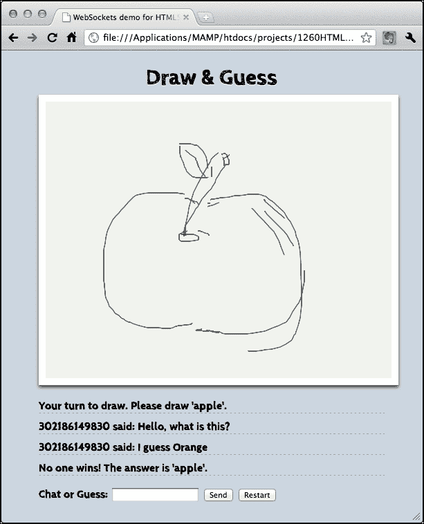

那么，让我们继续吧。

# 安装 WebSocket 服务器

HTML5 WebSocket 为浏览器提供了一个连接到后端服务器的客户端 API。该服务器必须支持 WebSocket 协议才能保持连接的持续性。

## 安装 Node.js WebSocket 服务器

在本节中，我们将下载并安装一个名为 Node.js 的服务器，我们可以在其上安装 WebSocket 模块。

# 是时候安装 Node.js 了

1.  访问包含 Node.js 服务器源代码的网址，[`nodejs.org`](http://nodejs.org)。

1.  点击页面上的 **安装** 按钮。这将根据您的操作系统下载安装包。

1.  按照安装程序的说明安装 Node.js 软件包。安装完成后，我们可以通过以下命令检查 Node.js 是否已安装，并查看其版本：

    ```js
    $ node --version
    ```

1.  前面的命令应该打印出 node.js 的版本号。在我的情况下，它是版本 0.12.0：

    ```js
    v0.12.0
    ```

1.  我们还需要检查是否已通过以下命令安装了 `npm` 软件包管理器：

    ```js
    $ npm --version
    ```

1.  前面的命令应该打印出 npm 的版本号，即 Node.js 软件包管理器。在我的情况下，它是版本 2.5.1。

## *刚才发生了什么？*

我们刚刚下载并安装了 `Node.js` 服务器。我们将在这一环境之上构建服务器逻辑。WebSocket 服务器不一定运行在 Node.js 上。WebSocket 协议有不同的服务器端实现。我们选择 Node.js 是因为它使用 JavaScript，我们在前几章构建了四个 HTML5 游戏后对其比较熟悉。

从 Node.js 分支出来的一个名为 io.js ([`iojs.org`](http://iojs.org))。在撰写本书时，io.js 仍然非常新。如果你计划在未来项目中使用 Node.js，值得检查这两个平台上的最新状态和它们之间的差异。

### 注意

在某些 Linux 发行版中，二进制文件被重命名为`nodejs`。你可以使用以下命令将`nodejs`的符号链接创建到`node`。你可能需要`sudo`来运行此命令：

```js
ln -s "$(which nodejs)" /usr/bin/node
```

## 创建一个发送连接数的 WebSocket 服务器

我们刚刚安装了`node.js`服务器。现在，我们将使用 WebSockets 构建一些内容。想象一下，我们想要一个服务器，它可以接受来自浏览器的连接，然后将连接数发送给所有用户。

# 行动时间 - 运行 WebSocket 服务器

1.  为我们的代码创建一个项目文件夹。在其内部，创建一个名为`server`的新目录。

1.  使用终端或 shell 命令提示符切换到我们新创建的文件夹。

1.  输入以下命令以安装 WebSocket 服务器：

    ```js
    npm install --save ws
    ```

1.  在`server`目录下创建一个名为`server.js`的新文件，内容如下：

    ```js
    var port = 8000;

    // Server code
    var WebSocketServer = require('ws').Server;
    var server = new WebSocketServer({ port: port });

    server.on('connection', function(socket) {
      console.log("A connection established");
    });

    console.log("WebSocket server is running.");
    console.log("Listening to port " + port + ".");
    ```

1.  打开终端并切换到服务器目录。

1.  输入以下命令以执行服务器：

    ```js
    node server.js
    ```

1.  如果一切正常，你应该会得到以下结果：

    ```js
    $ node server.js 
    WebSocket server is running.
    Listening to port 8000.
    ```

## *刚才发生了什么？*

我们刚刚创建了一个简单的服务器逻辑，初始化了 WebSockets 库并监听了连接事件。

## 初始化 WebSocket 服务器

在`Node.JS`中，不同的功能被封装到模块中。当我们需要特定模块的功能时，我们使用`require`来加载它。我们在服务器逻辑中使用以下代码加载 WebSockets 模块并初始化服务器：

```js
var WebSocketServer = require('ws').Server;
var server = new WebSocketServer({ port: port });
```

由于`ws`模块由`npm`管理，它被安装在一个名为`node_modules`的文件夹中。当我们仅使用名称要求一个库时，Node.js 运行时会查找`node_modules`文件夹中的该模块。

我们使用`8000`作为服务器的端口号，客户端通过这个端口号连接到服务器。我们可以选择不同的端口号，但必须确保所选端口号没有被其他常见服务器服务占用。

## 在服务器端监听连接事件

`node.js`服务器是事件驱动的。这意味着大多数逻辑都是在某个事件被触发时执行的。我们在示例中使用的以下代码监听`connection`事件并处理它：

```js
server.on('connection', function(socket) {
  console.log("A connection established");
});
```

`connection`事件带有 socket 参数。我们稍后需要存储这个 socket，因为我们使用这个对象与连接的客户端交互。

## 创建一个客户端连接到 WebSocket 服务器并获取总连接数

在上一个例子中，我们构建了服务器，现在，我们将构建一个连接到我们的 WebSocket 服务器并接收服务器消息的客户端。消息将包含来自服务器的总连接数。

# 行动时间 - 在 WebSocket 应用程序中显示连接数

执行以下步骤：

1.  创建一个名为`client`的新目录。

1.  在`client`文件夹中创建一个名为`index.html`的 HTML 文件。

1.  现在，在我们的 HTML 文件中添加一些标记。为此，将以下代码放入`index.html`文件中：

    ```js
    <!DOCTYPE html>
    <html lang="en">
    <head>
      <meta charset="utf-8">
      <title>WebSockets demo for HTML5 Games Development: A Beginner's Guide</title>
    </head>
    <body>
      <!-- game elements goes here later -->
      <script src="img/jquery-2.1.3.min.js"></script>
      <script src="img/html5games.websocket.js"></script>
    </body>
    </html>
    ```

1.  创建一个名为`js`的目录，并将 jQuery JavaScript 文件放入其中。

1.  创建一个名为 `html5games.websockets.js` 的新文件，如下所示：

    ```js
    var websocketGame = {
    }
    // init script when the DOM is ready.
    $(function(){
      // check if existence of WebSockets in browser
      if (window["WebSocket"]) {

        // create connection
        websocketGame.socket = new WebSocket("ws://127.0.0.1:8000");

        // on open event
        websocketGame.socket.onopen = function(e) {
          console.log('WebSocket connection established.');
        };

        // on close event
        websocketGame.socket.onclose = function(e) {
          console.log('WebSocket connection closed.');
        };      
      }
    });
    ```

1.  在完成这些步骤后，我们应该在我们的项目目录中创建以下文件夹结构：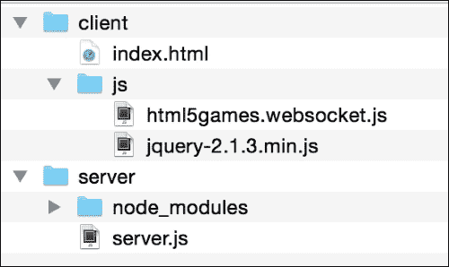

1.  我们现在将测试代码。首先，你需要使用 `node` 在终端中的 **server** 目录运行我们的 `server.js` 代码，即使用 `node server.js`。

1.  接下来，在客户端目录中，使用网页浏览器打开 `index.html` 文件两次，以便我们有两个客户端实例并行运行。

1.  检查服务器终端。应该有类似于以下内容的日志消息，指示连接信息和总连接数：

    ```js
    $ node server.js 
    WebSocket server is running.
    Listening to port 8000.
    A connection established.
    A connection established.
    ```

1.  在两个网页浏览器中，打开 **开发者工具** 中的控制台。你应该在控制台中看到 **WebSocket 连接已建立** 的消息。

## *发生了什么？*

我们刚刚构建了一个客户端，该客户端建立了与我们在上一节中构建的服务器的 WebSocket 连接。然后客户端会将从服务器接收到的任何消息打印到 **开发者工具** 的 **检查器** 中的控制台面板。

## 建立 WebSocket 连接

在任何支持 WebSocket 的浏览器中，我们可以通过创建一个新的 WebSocket 实例来建立连接，以下代码所示：

```js
var socket = new WebSocket(url);
```

`url` 参数是一个包含 WebSocket URL 的字符串。在我们的例子中，我们正在本地运行我们的服务器。因此，我们使用的 URL 是 `ws://127.0.0.1:8000`，其中 8000 代表我们连接的服务器端口号。它是 8000，因为当我们在服务器端构建逻辑时，服务器正在监听端口号 8000。

## WebSocket 客户端事件

与服务器类似，客户端也有几个 WebSocket 事件。以下表格列出了我们将用于处理 WebSocket 的事件：

| 事件名称 | 描述 |
| --- | --- |
| `onopen` | 当建立到服务器的连接时触发 |
| `onmessage` | 当收到来自服务器的任何消息时触发 |
| `onclose` | 当服务器关闭连接时触发 |
| `onerror` | 当连接出现任何错误时触发 |

## 向所有连接的浏览器发送消息

一旦服务器接收到新的 `connection` 事件，我们将连接的更新计数发送给所有客户端。向所有客户端发送消息很简单。我们只需在 `server` 实例中调用 `sendAll` 函数，并将 `string` 类型的消息作为参数即可。

以下代码片段向所有连接的浏览器发送服务器消息：

```js
var message = "a message from server";
server.sendAll(message);
```

# Time for action – sending total count to all users

执行以下步骤以创建游戏的基础逻辑：

1.  在服务器文件夹中，我们创建一个名为 `game.js` 的新文件。我们将在这个文件中存储房间和游戏逻辑。

1.  我们定义了一个 `User` 类，该类存储套接字连接对象并创建一个随机 ID。

    ```js
    function User(socket) {
      this.socket = socket; 
      // assign a random number to User.
      // Long enough to make duplication chance less.
      this.id = "1" + Math.floor( Math.random() * 1000000000);
    }
    ```

1.  我们还定义了一个 `Room` 类。我们在这个类中存储用户实例的集合。

    ```js
    function Room() {
      this.users = []; 
    }
    ```

1.  我们在`Room`类中定义了两个实例方法，用于管理用户的添加和删除。

    ```js
    Room.prototype.addUser = function(user){
      this.users.push(user); 
      var room = this; 

      // handle user closing
      user.socket.onclose = function(){
        console.log('A connection left.');
        room.removeUser(user);
      }
    };
    Room.prototype.removeUser = function(user) {
      // loop to find the user
      for (var i=this.users.length; i >= 0; i--) {
        if (this.users[i] === user) {
          this.users.splice(i, 1);
        }
      }
    };
    ```

1.  然后，我们定义另一个负责向房间中所有已连接用户发送消息的方法：

    ```js
    Room.prototype.sendAll = function(message) {
      for (var i=0, len=this.users.length; i<len; i++) {
        this.users[i].socket.send(message);
      }
    };
    ```

1.  在继续之前，我们需要将新定义的`User`和`Room`类导出，以便其他文件可以使用它们：

    ```js
    module.exports.User = User;
    module.exports.Room = Room;
    ```

1.  在`server.js`文件中，我们用以下代码替换连接处理器，该代码将用户计数发送给所有已连接的用户：

    ```js
    var User = require('./game').User;
    var Room = require('./game').Room;
    var room1 = new Room();
    server.on('connection', function(socket) {
      var user = new User(socket);
      room1.addUser(user);
      console.log("A connection established");
      var message = "Welcome " + user.id 
         + " joining the party. Total connection: "
         + room1.users.length;
      room1.sendAll(message);
    });
    ```

1.  我们接着转向客户端。在**clients** | **js**文件夹内的`html5games.websocket.js`文件中，我们添加一个处理器来打印从服务器接收到的消息。

    ```js
    // on message event
    websocketGame.socket.onmessage = function(e) {
      console.log(e.data);
    };
    ```

1.  最后，我们测试代码。在服务器目录中执行`node server.js`来启动服务器。然后打开`index.html`文件，我们应该在控制台看到以下类似的截图：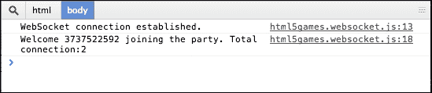

## *发生了什么事？*

我们在`game.js`文件中定义了两个类，`User`和`Room`，我们使用它们来管理所有连接的套接字。

## 定义类和实例方法

在 JavaScript 中，**面向对象编程**是通过使用函数和原型来实现的。当我们通过调用`new Room()`创建一个房间实例时，浏览器会将`Room.prototype`中的所有属性和方法克隆到实例中。

## 处理新连接的用户

对于每个已连接的用户，我们需要通过事件处理器与他们交互。我们将用户对象添加到数组中以方便管理。我们需要处理用户断开连接时的`onclose`事件。为此，我们将该用户从数组中删除。

## 导出模块

在`game.js`文件中定义我们的类之后，我们将它们导出。通过将它们导出到模块中，我们可以使用`require`方法在其他文件中导入它们，如下所示：

```js
var User = require('./game').User;
var Room = require('./game').Room;
```

## 向客户端发送消息

WebSockets 具有从服务器向用户发送消息的能力。传统上，客户端请求服务器，然后服务器响应。在套接字服务器中，所有用户都是连接的，因此消息可以双向触发和发送。在这里，我们遍历所有用户以发送广播消息：

```js
Room.prototype.send = function(message) {
  for (var i=0, len=this.users.length; i<len; i++) {
    this.users[i].socket.send(message);
  }
};
```

然后，我们通过使用`onmessage`事件处理器在客户端监听服务器消息。

```js
// on message event
websocketGame.socket.onmessage = function(e) {
  console.log(e.data);
};
```

# 使用 WebSockets 构建聊天应用

我们现在知道有多少浏览器已连接。假设我们想要构建一个聊天室，用户可以在各自的浏览器中输入消息，并将消息立即发送给所有已连接的用户。

## 向服务器发送消息

我们将让用户输入一条消息，然后将消息发送到`node.js`服务器。服务器然后将消息转发给所有已连接的浏览器。一旦浏览器接收到消息，它就会在聊天区域显示出来。在这种情况下，用户在加载网页后就会连接到即时聊天室。

# 行动时间 - 通过 WebSockets 向服务器发送消息

1.  首先，编写服务器逻辑。

1.  打开`servergame.js`。向文件中添加以下处理用户消息的功能：

    ```js
    Room.prototype.handleOnUserMessage = function(user) {
      var room = this;
      user.socket.on("message", function(message){
        console.log("Receive message from " + user.id + ": " + message);
      });
    };
    ```

1.  在调用我们新创建函数的`Room.prototype.addUser`方法内部添加以下代码：

    ```js
    this.handleOnUserMessage(user);
    ```

1.  现在，转到`client`文件夹。

1.  打开`index.html`文件，在`body`部分添加以下标记。这为用户提供输入以向服务器发送消息：

    ```js
    <input type="text" id="chat-input" autocomplete="off">
    <input type="button" value="Send" id="send">
    ```

1.  然后，将以下代码添加到`html5games.websocket.js` JavaScript 文件中。当用户点击`send`按钮或按*Enter*键时，这将向服务器发送消息：

    ```js
    $("#send").click(sendMessage);

    $("#chat-input").keypress(function(event) {
       if (event.keyCode === 13) {  
          sendMessage();  
       }  
    });

    function sendMessage() {
       var message = $("#chat-input").val();
       websocketGame.socket.send(message);
       $("#chat-input").val("");
    }
    ```

1.  在测试我们的代码之前，检查服务器终端，看看 node 服务器是否仍在运行。按*Ctrl* + *C*来终止它，然后使用`node` `server.js`命令再次运行它。

1.  在网页浏览器中打开`index.html`。你应该看到一个带有**发送**按钮的输入文本字段，如下面的截图所示：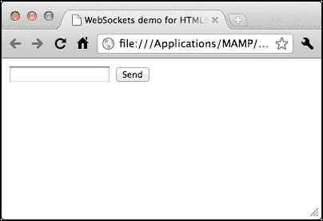

1.  在输入文本字段中输入一些内容，然后点击**发送**按钮或按*Enter*键。输入文本将被清除。

1.  现在，切换到服务器终端，你会看到服务器正在打印我们刚刚发送的文本。你还可以将浏览器和服务器终端并排放置，以查看消息是如何从客户端瞬间发送到服务器的。以下截图显示了包含来自两个连接浏览器的服务器终端：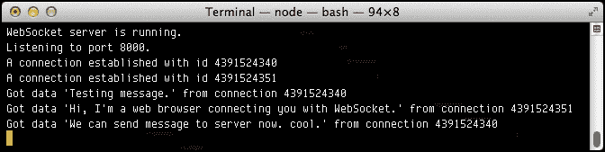

## *刚才发生了什么？*

我们通过为用户添加一个输入文本字段来扩展我们的连接示例，让他们在那里输入一些文本并发送出去。文本作为消息发送到 WebSocket 服务器。然后，服务器将在终端打印收到的消息。

## 从客户端向服务器发送消息

为了从客户端向服务器发送消息，我们在`WebSocket`实例中调用以下`send`方法：

```js
websocketGame.socket.send(message);
```

在以下代码片段中，我们从输入文本字段获取消息并发送到服务器：

```js
var message = $("#chat-input").val();
websocketGame.socket.send(message);
```

## 在服务器端接收消息

在服务器端，我们需要处理从客户端发送的刚刚的消息。我们在 WebSocket `node.js`库的连接实例中有一个名为`message`的事件。我们可以监听连接消息事件以接收每个客户端连接的消息。

以下代码片段显示了如何使用消息事件监听器在服务器终端打印消息：

```js
socket.on("message", function(message){
  console.log("Receive message: " + message);
});
```

# 将服务器端接收到的每条消息发送出去以创建聊天室

在最后一个示例中，服务器可以接收来自浏览器的消息。然而，服务器除了在终端打印收到的消息外，没有做任何事情。因此，我们将向服务器添加一些逻辑来发送消息。

# 执行动作 – 向所有连接的浏览器发送消息

执行以下步骤：

1.  在**服务器**文件夹中打开`game.js`文件以查看服务器端逻辑。

1.  将以下突出显示的代码添加到消息事件监听器处理器中：

    ```js
    user.socket.on("message", function(message){
      console.log("Receive message from " + user.id + ": " + message); 
      // send to all users in room.
      var msg = "User " + user.id + " said: " + message;
      room.sendAll(msg);
    });
    ```

1.  服务器端的实现到此结束。接下来，转到`client`文件夹并打开`index.html`文件。

1.  我们想在聊天历史区域显示聊天消息。为此，将以下代码添加到 HTML 文件中：

    ```js
    <ul id="chat-history"></ul>
    ```

1.  接下来，我们需要客户端 JavaScript 来处理从服务器接收到的消息。我们使用它将消息打印到控制台面板中，将`onmessage`事件处理器中的`console.log`代码替换为以下突出显示的代码：

    ```js
    socket.onmessage = function(e) {
      $("#chat-history").append("<li>"+e.data+"</li>");
    };
    ```

1.  让我们测试我们的代码。通过按*Ctrl* + *C*终止任何正在运行的 node 服务器。然后，再次运行服务器。

1.  打开两次`index.html`文件并将它们并排放置。在文本字段中输入一些内容并按*Enter*键。消息将出现在所有打开的浏览器中。如果你打开了多个 HTML 文件实例，消息将出现在所有浏览器中。以下截图显示了两个浏览器并排显示聊天历史记录：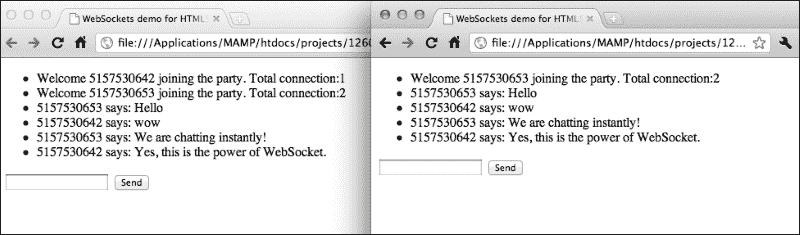

## *发生了什么？*

这是之前示例的扩展。我们讨论了服务器如何将连接计数发送给所有已连接的客户端。我们还讨论了客户端如何向服务器发送消息。在这个例子中，我们将这两种技术结合起来，让服务器将接收到的消息发送给所有已连接的用户。

## Comparing WebSockets with polling approaches

如果你曾经使用服务器端语言和数据库构建过网页聊天室，那么你可能想知道 WebSocket 实现与传统实现之间的区别。

传统的聊天室方法通常通过使用**轮询**方法实现。客户端定期向服务器请求更新。服务器以没有更新或更新数据的方式对客户端进行响应。然而，传统方法有几个问题。客户端直到下一次请求服务器之前都不会收到来自服务器的更新数据。这意味着数据更新会随着时间周期性地延迟，响应不够即时。如果我们想通过缩短轮询持续时间来改善这个问题，那么将利用更多的带宽，因为客户端需要不断向服务器发送请求。

以下图表显示了客户端和服务器之间的请求。它显示发送了许多无用的请求，但服务器在没有新数据的情况下对客户端进行了响应：

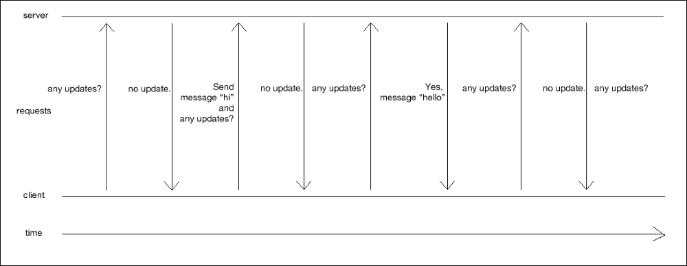

有一种更好的轮询方法叫做**长轮询**：客户端向服务器发送请求并等待响应。与传统的轮询方法不同，服务器不会在“无更新”时响应，而是在需要将某些内容推送到服务器时才响应。在这种情况下，服务器可以在有更新时随时向客户端推送内容。一旦客户端从服务器收到响应，它就会创建另一个请求并等待下一个服务器通知。以下图表显示了长轮询方法，其中客户端请求更新，服务器只在有更新时响应：

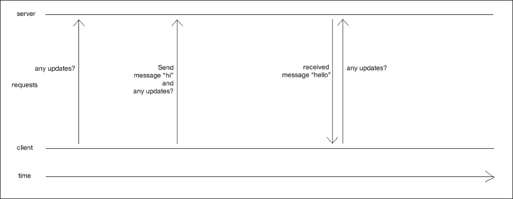

在 WebSocket 方法中，请求的数量远少于轮询方法。这是因为客户端和服务器之间的连接是持久的。一旦建立连接，只有当有更新时，客户端或服务器才会发送请求。例如，当客户端想要向服务器更新某些内容时，它会向服务器发送消息。服务器也只在需要通知客户端数据更新时向客户端发送消息。在连接期间不会发送其他无用的请求。因此，利用的带宽更少。以下图表显示了 WebSocket 方法：

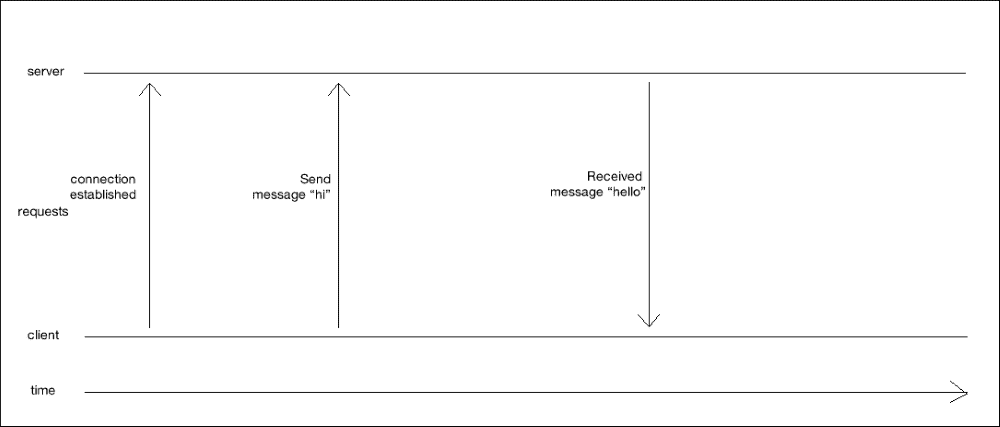

# 使用 Canvas 和 WebSocket 制作共享绘图白板

假设我们想要一个共享的草图板。任何人都可以在草图板上绘制内容，其他人都可以查看。我们学习了客户端和服务器之间如何通信消息。我们将进一步发送绘图数据。

## 构建本地绘图草图板

在我们处理数据发送和服务器处理之前，让我们专注于制作一个绘图白板。我们将使用 Canvas 来构建一个本地绘图草图板。

# 实践时间 - 使用 Canvas 制作本地绘图白板

执行以下步骤：

1.  在本节中，我们将只关注客户端。打开`index.html`文件并添加以下`canvas`标记：

    ```js
    <canvas id='drawing-pad' width='500' height='400'>
    </canvas>
    ```

1.  我们将在 Canvas 上绘制一些内容，为此我们需要 Canvas 的鼠标位置。我们在第四章中这样做过，即*使用 Canvas 和绘图 API 构建 Untangle 游戏*。向 Canvas 添加以下样式：

    ```js
    <style>
      canvas{position:relative;}
    </style>
    ```

1.  然后，打开`html5games.websocket.js`JavaScript 文件以添加绘图逻辑。

1.  在 JavaScript 文件顶部将`websocketGame`全局对象替换为以下变量：

    ```js
    var websocketGame = {
       // indicates if it is drawing now.
       isDrawing : false,

       // the starting point of next line drawing.
       startX : 0,
       startY : 0,
    }

    // canvas context
    var canvas = document.getElementById('drawing-pad');
    var ctx = canvas.getContext('2d');
    ```

1.  在 jQuery 的`ready`函数中，添加以下鼠标事件处理代码。该代码处理鼠标的按下、移动和抬起事件：

    ```js
    // the logic of drawing in the Canvas
    $("#drawing-pad").mousedown(function(e) {
      // get the mouse x and y relative to the canvas top-left point.
      var mouseX = e.originalEvent.layerX || e.offsetX || 0;
      var mouseY = e.originalEvent.layerY || e.offsetY || 0;

      websocketGame.startX = mouseX;
      websocketGame.startY = mouseY;

      websocketGame.isDrawing = true;
    });

    $("#drawing-pad").mousemove(function(e) {
      // draw lines when is drawing
      if (websocketGame.isDrawing) {
        // get the mouse x and y 
        // relative to the canvas top-left point.
        var mouseX = e.originalEvent.layerX || e.offsetX || 0;
        var mouseY = e.originalEvent.layerY || e.offsetY || 0;

        if (!(mouseX === websocketGame.startX && mouseY === websocketGame.startY)) {
          drawLine(ctx, websocketGame.startX, websocketGame.startY,mouseX,mouseY,1);

          websocketGame.startX = mouseX;
          websocketGame.startY = mouseY;
        }
      }
    });

    $("#drawing-pad").mouseup(function(e) {
      websocketGame.isDrawing = false;
    });
    ```

1.  最后，我们有以下函数来在 Canvas 上根据给定的起始点和结束点绘制线条：

    ```js
    function drawLine(ctx, x1, y1, x2, y2, thickness) {
       ctx.beginPath();
       ctx.moveTo(x1,y1);
       ctx.lineTo(x2,y2);
       ctx.lineWidth = thickness;
       ctx.strokeStyle = "#444";
       ctx.stroke();
    }
    ```

1.  保存所有文件并打开 `index.html` 文件。你应该看到一个空白区域，你可以使用鼠标在这里绘制东西。绘图尚未发送到服务器，所以其他人无法查看你的绘图：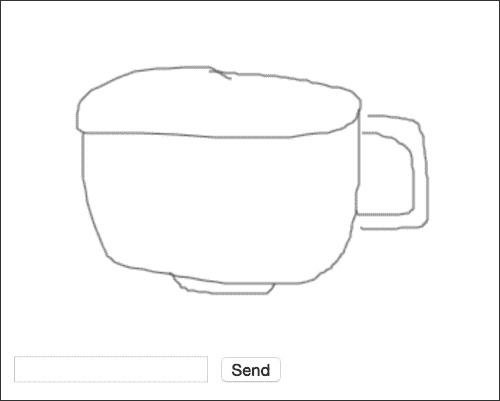

## *刚才发生了什么？*

我们刚刚创建了一个本地绘图板。这就像一个白板，玩家可以通过拖动鼠标在 Canvas 上绘图。然而，绘图数据尚未发送到服务器；所有绘图都仅在本地显示。

`drawing` `line` 函数与我们之前在 第四章 中使用的相同，即 *使用 Canvas 和绘图 API 构建 Untangle 游戏*。我们也使用了相同的代码来获取相对于 `canvas` 元素的鼠标位置。然而，鼠标事件的逻辑与 第四章 不同。

### 在 Canvas 中绘图

当我们在电脑上绘图时，通常意味着我们点击 Canvas 并拖动鼠标（或笔）。线条会一直绘制，直到鼠标按钮抬起。然后，用户点击另一个地方并再次拖动以绘制线条。

在我们的示例中，我们有一个名为 `isDrawing` 的布尔标志，用来指示用户是否在绘图。默认情况下，`isDrawing` 标志为 `false`。当鼠标按钮位于某个点时，我们将标志设置为 `true`。当鼠标移动时，我们在移动的点与鼠标按钮按下时的最后一个点之间画线。然后，当鼠标按钮抬起时，我们将 `isDrawing` 标志设置为 `false`。这就是绘图逻辑的工作方式。

## 英雄试炼 – 使用颜色绘图

我们能否通过添加颜色支持来修改绘图草图板？比如添加红色、蓝色、绿色、黑色和白色的五个按钮？玩家可以在绘图时选择颜色。或者，我们也可以为用户提供不同的笔宽选项。

## 将绘图发送到所有连接的浏览器

我们将进一步通过将我们的绘图数据发送到服务器，并让服务器将绘图发送到所有连接的浏览器。

# 动手实践 – 通过 WebSocket 发送绘图

执行以下步骤：

1.  首先，我们需要修改服务器逻辑。打开 `game.js` 文件，并在文件开头添加两个常量，如下所示：

    ```js
    // Constants
    var LINE_SEGMENT = 0;
    var CHAT_MESSAGE = 1;
    ```

1.  在 `Room.prototype.addUser` 方法中，在方法开头添加以下代码：

    ```js
    this.users.push(user);
    var room = this;
    // tell others that someone joins the room
    var data = {
      dataType: CHAT_MESSAGE,
      sender: "Server",
      message: "Welcome " + user.id 
         + " joining the party. Total connection: " + this.users.length
    };  
    room.sendAll(JSON.stringify(data));
    ```

1.  我们使用 JSON 格式的字符串来传递绘图动作和聊天消息。在用户消息事件处理程序的用户套接字上添加以下代码：

    ```js
    user.socket.on("message", function(message){
      console.log("Receive message from " + user.id + ": " + message);

      // construct the message
      var data = JSON.parse(message);
      if (data.dataType === CHAT_MESSAGE) {
        // add the sender information into the message data object.
        data.sender = user.id;
      }

      // send to all clients in room.
      room.sendAll(JSON.stringify(data));
    });
    ```

1.  在 `server.js` 文件中，由于现在由 `Room.addUser` 方法处理，因此不需要向房间发送欢迎消息。从 `server.js` 文件中删除以下代码：

    ```js
    room1.sendAll(message);
    ```

1.  在客户端，我们需要逻辑来响应服务器，使用相同的数据对象定义。在**client**目录下的**js**目录中打开`html5games.websocket.js` JavaScript 文件。

1.  将以下常量添加到`websocketGame`全局变量中。这些相同的常量及其相同的值也在服务器端逻辑中定义。

    ```js
    // Contants
    LINE_SEGMENT : 0,
    CHAT_MESSAGE : 1,
    ```

1.  当在客户端处理消息事件时，将 JSON 格式的字符串转换回数据对象。如果数据是聊天消息，则将其显示为聊天历史，否则将其绘制在 Canvas 上作为线段。将`onmessage`事件处理器替换为以下代码：

    ```js
    websocketGame.socket.onmessage = function(e) {
       // check if the received data is chat or line segment
       console.log("onmessage event:",e.data);
       var data = JSON.parse(e.data);
       if (data.dataType === websocketGame.CHAT_MESSAGE) {
          $("#chat-history").append("<li>" + data.sender
              + " said: "+data.message+"</li>");
       }
       else if (data.dataType === websocketGame.LINE_SEGMENT) {
          drawLine(ctx, data.startX, data.startY, data.endX, data.endY, 1);
       }

    };
    ```

1.  当鼠标移动时，我们不仅会在 Canvas 中绘制线条，还会将线条数据发送到服务器。将以下高亮代码添加到`mousemove`事件处理器中：

    ```js
    $("#drawing-pad").mousemove(function(e) {
       // draw lines when is drawing
       if (websocketGame.isDrawing) {
          // get the mouse x and y 
          // relative to the canvas top-left point.
          var mouseX = e.originalEvent.layerX || e.offsetX || 0;
          var mouseY = e.originalEvent.layerY || e.offsetX || 0;

          if (!(mouseX === websocketGame.startX && mouseY === websocketGame.startY)) {
             drawLine(ctx, websocketGame.startX, websocketGame.startY,mouseX,mouseY,1);

             // send the line segment to server
     var data = {};
     data.dataType = websocketGame.LINE_SEGMENT;
     data.startX = websocketGame.startX;
     data.startY = websocketGame.startY;
     data.endX = mouseX;
     data.endY = mouseY;
     websocketGame.socket.send(JSON.stringify(data));

             websocketGame.startX = mouseX;
             websocketGame.startY = mouseY;
          }

       }
    });
    ```

1.  最后，我们需要修改发送消息的逻辑。现在，我们在将消息发送到服务器时，将其打包成一个对象并以 JSON 格式进行格式化。将`sendMessage`函数更改为以下代码：

    ```js
    function sendMessage() {
       var message = $("#chat-input").val();

       // pack the message into an object.
       var data = {};
       data.dataType = websocketGame.CHAT_MESSAGE;
       data.message = message;

       websocketGame.socket.send(JSON.stringify(data));
       $("#chat-input").val("");
    }
    ```

1.  保存所有文件并重新启动服务器。

1.  在两个浏览器实例中打开`index.html`文件。

1.  首先，尝试聊天室功能，输入一些消息并发送它们。然后，尝试在 Canvas 上绘制一些东西。两个浏览器应该显示相同的绘图，如下面的截图所示：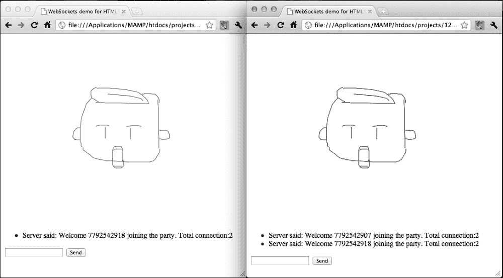

## *发生了什么？*

我们刚刚构建了一个多用户绘图板。这与我们在本章开头尝试的绘图板类似。我们通过发送一个复杂的数据对象作为消息，扩展了你在构建聊天室时学到的内容。

## 定义数据对象以在客户端和服务器之间通信

当一个消息中包含大量数据时，为了在服务器和客户端之间正确通信，我们必须定义一个客户端和服务器都能理解的数据对象。

数据对象中有几个属性。以下表格列出了属性及其原因：

| 属性名称 | 我们为什么需要这个属性 |
| --- | --- |
| `dataType` | 这是一个重要的属性，帮助我们理解整个数据。数据要么是聊天消息，要么是绘图线段数据。 |
| `sender` | 如果数据是聊天消息，客户端需要知道谁发送了消息。 |
| `message` | 当数据类型是聊天消息时，我们当然需要将消息内容本身包含到数据对象中。 |
| `startX` | 当数据类型是绘图线段时，我们包括线的起点的*x*/*y*坐标。 |
| `startY` |
| `endX` | 当数据类型是绘图线段时，我们包括线的终点的*x*/*y*坐标。 |
| `endY` |

此外，我们还在客户端和服务器端定义了以下常量；这些常量用于`dataType`属性：

```js
// Contants
LINE_SEGMENT : 0,
CHAT_MESSAGE : 1,
```

使用这些常数，我们可以用以下可读的代码来比较数据类型，而不是使用无意义的整数：

```js
if (data.dataType === websocketGame.CHAT_MESSAGE) {…}
```

## 将绘图线条数据打包成 JSON 以发送

在上一章中，我们使用`JSON.stringify`函数将 JavaScript 对象存储到本地存储中的 JSON 格式字符串。现在，我们需要在服务器和客户端之间以字符串格式发送数据。我们使用相同的方法将绘图线条数据打包成一个对象，并以 JSON 字符串的形式发送。

以下代码片段展示了我们如何在客户端打包线段数据，并以 JSON 格式字符串的形式将其发送到服务器：

```js
// send the line segment to server
var data = {};
data.dataType = websocketGame.LINE_SEGMENT;
data.startX = startX;
data.startY = startY;
data.endX = mouseX;
data.endY = mouseY;
websocketGame.socket.send(JSON.stringify(data));
```

## 在从其他客户端接收到绘图线条后重新创建绘图线条

JSON 解析通常与`stringify`配对。当我们从服务器接收到消息时，我们必须将其解析为 JavaScript 对象。以下客户端的代码解析数据，并根据数据更新聊天历史或绘制线条：

```js
var data = JSON.parse(e.data);
if (data.dataType === websocketGame.CHAT_MESSAGE) {
  $("#chat-history").append("<li>"+data.sender+" said: "+data.message+"</li>");
}
else if (data.dataType === websocketGame.LINE_SEGMENT) {
  drawLine(ctx, data.startX, data.startY, data.endX, data.endY, 1);
}
```

# 构建多人画猜游戏

在本章早期，我们构建了一个即时聊天室。此外，我们刚刚构建了一个多用户绘图板。那么，将这两种技术结合起来构建一个画猜游戏怎么样？画猜游戏是一种游戏，其中一名玩家被分配一个单词来绘制。所有其他玩家不知道这个单词，根据绘图来猜测单词。绘制者和正确猜出单词的玩家得分。

# 行动时间 - 构建画猜游戏

我们将按照以下方式实现画猜游戏的游戏流程：

1.  首先，我们将在客户端添加游戏逻辑。

1.  在客户端目录中打开`index.html`文件。在*发送*按钮之后添加以下重启按钮：

    ```js
    <input type="button" value="Restart" id="restart">
    ```

1.  打开`html5games.websocket.js` JavaScript 文件。

1.  我们需要一些额外的常数来确定游戏过程中的不同状态。将以下突出显示的代码添加到文件顶部：

    ```js
    // Constants
    LINE_SEGMENT : 0,
    CHAT_MESSAGE : 1,
    GAME_LOGIC : 2,

    // Constant for game logic state
    WAITING_TO_START : 0,
    GAME_START : 1,
    GAME_OVER : 2,
    GAME_RESTART : 3,

    ```

1.  此外，我们还想添加一个标志来指示这位玩家负责绘图。将以下布尔全局变量添加到代码中：

    ```js
    isTurnToDraw : false,
    ```

1.  当客户端从服务器接收到消息时，它会解析消息并检查它是否是聊天消息或线条绘图。现在我们有一种新的消息类型名为`GAME_LOGIC`，用于处理游戏逻辑。游戏逻辑消息包含不同游戏状态的不同数据。将以下代码添加到`onmessage`事件处理器中：

    ```js
    else if (data.dataType === websocketGame.GAME_LOGIC) {
      if (data.gameState === websocketGame.GAME_OVER) {
        websocketGame.isTurnToDraw = false;
        $("#chat-history").append("<li>" + data.winner
           +" wins! The answer is '"+data.answer+"'.</li>");
        $("#restart").show();
      }
      if (data.gameState === websocketGame.GAME_START) {
        // clear the Canvas.
        canvas.width = canvas.width;

        // hide the restart button.
        $("#restart").hide();

        // clear the chat history
        $("#chat-history").html("");

        if (data.isPlayerTurn) {
          websocketGame.isTurnToDraw = true;
          $("#chat-history").append("<li>Your turn to draw. Please draw '" + data.answer + "'.</li>");
        }
        else {
          $("#chat-history").append("<li>Game Started. Get Ready. You have one minute to guess.</li>");
        }
      }
    }
    ```

1.  在客户端逻辑中还有最后一步。我们希望通过向服务器发送重启信号来重启游戏。同时，我们清除绘图和聊天历史。为此，在`html5games.websocket.js`文件中添加以下代码。

    ```js
    // restart button
    $("#restart").hide();
    $("#restart").click(function(){
      canvas.width = canvas.width;
      $("#chat-history").html("");
      $("#chat-history").append("<li>Restarting Game.</li>");

      // pack the restart message into an object.
      var data = {};
      data.dataType = websocketGame.GAME_LOGIC;
      data.gameState = websocketGame.GAME_RESTART;
      websocketGame.socket.send(JSON.stringify(data));

      $("#restart").hide();
    });
    ```

1.  现在是时候转向服务器端了。我们需要更多的状态来控制游戏流程。将`game.js`文件开头的常数替换为以下代码。

    ```js
    // Constants
    var LINE_SEGMENT = 0;
    var CHAT_MESSAGE = 1;
    var GAME_LOGIC = 2;
    // Constant for game logic state
    var WAITING_TO_START = 0;
    var GAME_START = 1;
    var GAME_OVER = 2;
    var GAME_RESTART = 3; 
    ```

1.  在之前的示例中，服务器端只是负责将任何传入的消息发送给所有已连接的浏览器。这对于多人游戏是不够的。服务器将作为游戏主持人，控制游戏流程和获胜条件的确定。我们通过`GameRoom`扩展`Room`类，使其能够处理游戏流程。

1.  现在，将以下代码添加到`game.js`文件的末尾。这是名为`GameRoom`的新类的构造函数，它初始化游戏逻辑。

    ```js
    function GameRoom() { 
      // the current turn of player index.
      this.playerTurn = 0;

      this.wordsList = ['apple','idea','wisdom','angry'];
      this.currentAnswer = undefined;

      this.currentGameState = WAITING_TO_START;

      // send the game state to all players.
      var gameLogicData = {
        dataType: GAME_LOGIC,
        gameState: WAITING_TO_START
      };

      this.sendAll(JSON.stringify(gameLogicData));

    }
    ```

1.  然后，我们将现有的`Room`功能扩展到`GameRoom`原型中，以便`GameRoom`默认可以访问`Room`类的原型函数。

    ```js
    // inherit Room
    GameRoom.prototype = new Room();
    ```

1.  在`GameRoom`类中定义以下`addUser`函数。在现有的`GameRoom`代码之后附加代码。这保留了原始房间的`addUser`函数并添加了额外的逻辑，等待足够多的玩家加入以开始游戏：

    ```js
    GameRoom.prototype.addUser = function(user) {
      // a.k.a. super(user) in traditional OOP language.
      Room.prototype.addUser.call(this, user);

      // start the game if there are 2 or more connections
      if (this.currentGameState === WAITING_TO_START && this.users.length >= 2) {
        this.startGame();
      }
    };
    ```

1.  与之前的示例不同，其中服务器只是将用户消息传递给所有已连接的客户端，现在服务器需要确定用户的消息是否是游戏流程的一部分。在现有的`GameRoom`逻辑之后附加以下代码；它覆盖了原始房间的`handleOnUserMessage`函数，并引入了新的逻辑来处理聊天消息、线段和游戏流程的控制：

    ```js
    GameRoom.prototype.handleOnUserMessage = function(user) {
      var room = this;
      // handle on message
      user.socket.on('message', function(message){
        console.log("[GameRoom] Receive message from " 
              + user.id + ": " + message); 

        var data = JSON.parse(message);
        if (data.dataType === CHAT_MESSAGE) {
          // add the sender information into the message data object.
          data.sender = user.id;
        }
        room.sendAll(JSON.stringify(data));

        // check if the message is guessing right or wrong
        if (data.dataType === CHAT_MESSAGE) {
          console.log("Current state: " + room.currentGameState);

          if (room.currentGameState === GAME_START) {
            console.log("Got message: " + data.message 
                + " (Answer: " + room.currentAnswer + ")");
          }

          if (room.currentGameState === GAME_START && data.message === room.currentAnswer) {
            var gameLogicData = {
              dataType: GAME_LOGIC,
              gameState: GAME_OVER,
              winner: user.id,
              answer: room.currentAnswer
            };

            room.sendAll(JSON.stringify(gameLogicData));

            room.currentGameState = WAITING_TO_START;

            // clear the game over timeout
            clearTimeout(room.gameOverTimeout);
          }
        }

        if (data.dataType === GAME_LOGIC && data.gameState === GAME_RESTART) {
          room.startGame();
        }
      });
    };
    ```

1.  让我们继续`GameRoom`逻辑。将以下新函数添加到`game.js`文件中。这个函数在房间内创建一个新的游戏，通过选择一个玩家作为绘图者，其他玩家作为猜测者；然后，随机为绘图者选择一个单词：

    ```js
    GameRoom.prototype.startGame = function() {
      var room = this;

      // pick a player to draw
      this.playerTurn = (this.playerTurn+1) % this.users.length;

      console.log("Start game with player " + this.playerTurn 
          + "'s turn.");

      // pick an answer
      var answerIndex = Math.floor(Math.random() * this.wordsList.length);
      this.currentAnswer = this.wordsList[answerIndex];

      // game start for all players
      var gameLogicDataForAllPlayers = {
        dataType: GAME_LOGIC,
        gameState: GAME_START,
        isPlayerTurn: false
      };

      this.sendAll(JSON.stringify(gameLogicDataForAllPlayers));

      // game start with answer to the player in turn.
      var gameLogicDataForDrawer = {
        dataType: GAME_LOGIC,
        gameState: GAME_START,
        answer: this.currentAnswer,
        isPlayerTurn: true
      };

      // the user who draws in this turn.
      var user = this.users[this.playerTurn];
      user.socket.send(JSON.stringify(gameLogicDataForDrawer));

      // game over the game after 1 minute.
      gameOverTimeout = setTimeout(function(){
        var gameLogicData = {
          dataType: GAME_LOGIC,
          gameState: GAME_OVER,
          winner: "No one",
          answer: room.currentAnswer
        };

        room.sendAll(JSON.stringify(gameLogicData));

        room.currentGameState = WAITING_TO_START;
      },60*1000);

      room.currentGameState = GAME_START;
    };
    ```

1.  最后，我们导出`GameRoom`类，以便其他文件，如`server.js`，可以访问`GameRoom`类：

    ```js
    module.exports.GameRoom = GameRoom;
    ```

1.  在`server.js`中，我们必须调用我们的新`GameRoom`构造函数而不是通用的`Room`构造函数。将原始与`Room`相关的代码替换为以下`GameRoom`代码：

    ```js
    var GameRoom = require('./game').GameRoom;
    var room1 = new GameRoom();
    ```

1.  我们将保存所有文件并重新启动服务器。然后，在两个浏览器实例中启动`index.html`文件。一个浏览器将从服务器接收到一条消息，告知玩家绘制一些东西。另一方面，另一个浏览器将告知玩家在一分钟内猜测其他玩家正在绘制的内容。

1.  被告知绘制东西的玩家可以在画布上绘制。这些绘画被发送给所有其他已连接的玩家。被告知猜测的玩家不能在画布上绘制任何东西。相反，玩家在文本字段中输入他们的猜测并发送给服务器。如果猜测正确，则游戏结束。否则，游戏将继续进行，直到一分钟倒计时结束。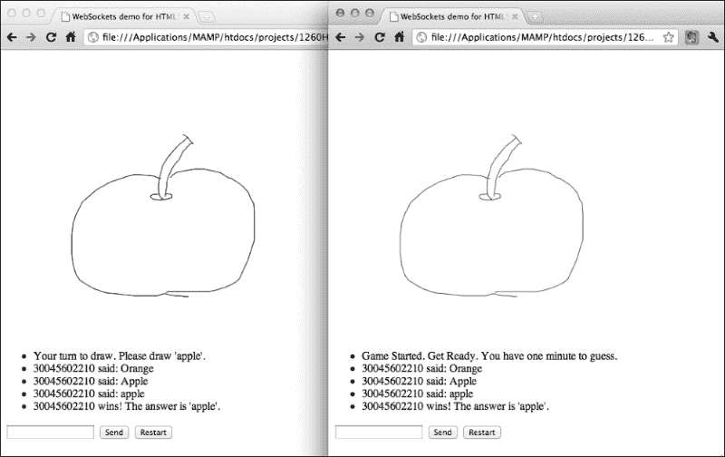

## *发生了什么？*

我们刚刚在 WebSockets 和 Canvas 中创建了一个多人绘制和猜测游戏。游戏与多用户草图板的主要区别在于，现在服务器控制游戏流程，而不是让所有用户绘制。

## 继承 Room 类

在 JavaScript 中，我们可以使用新类继承一个已定义的类。我们定义`GameRoom`类，它继承自`Room`类。`GameRoom`类将具有它继承的`Room`逻辑以及专门为游戏流程设计的额外逻辑。继承是通过将类的实例创建到原型中实现的，如下所示：

```js
GameRoom.prototype = new Room();
```

现在，`GameRoom`具有从`Room`继承的原型方法。我们可以在`GameRoom`中定义更多逻辑，例如`startGame`方法。我们还可以通过在`GameRoom`类中定义具有相同名称的新原型方法来覆盖现有逻辑；例如，我们覆盖了`handleOnUserMessage`方法来发送游戏开始和获胜逻辑。

有时候，我们希望扩展现有的逻辑而不是用新的逻辑替换旧的逻辑。在这种情况下，我们需要执行用同名方法覆盖的逻辑。我们可以使用以下代码来执行原始原型中的方法；我们在`addUser`方法中使用了这种方法来保持原始逻辑：

```js
// a.k.a. super(user) in traditional OOP language.
Room.prototype.addUser.call(this, user);
```

## 控制多人游戏的游戏流程

控制多人游戏的游戏流程比单机游戏要复杂得多。我们可以简单地使用几个变量来控制单机游戏的游戏流程，但我们必须使用消息传递来通知每个玩家特定的更新游戏流程。

首先，我们需要以下高亮的`GAME_LOGIC`常量来指定`dataType`。我们使用这些数据来发送和接收与游戏逻辑控制相关的消息：

```js
// Constants
var LINE_SEGMENT = 0;
var CHAT_MESSAGE = 1;
var GAME_LOGIC = 2;
```

游戏流程中有几个状态。在游戏开始之前，连接的玩家正在等待游戏开始。一旦有多人游戏所需的足够连接，服务器就会向所有玩家发送游戏逻辑消息，通知他们游戏开始。

当游戏结束时，服务器向所有玩家发送游戏结束状态。然后，游戏结束，游戏逻辑暂停，直到任何玩家点击重启按钮。一旦点击重启按钮，客户端就会向服务器发送游戏重启状态，指示服务器准备新游戏。然后，游戏再次开始。

我们在客户端和服务器中都声明了以下四个游戏状态常量，以便他们理解：

```js
// Constant for game logic state
var WAITING_TO_START = 0;
var GAME_START = 1;
var GAME_OVER = 2;
var GAME_RESTART = 3;
```

以下服务器端的代码包含一个索引，指示现在是哪个玩家的回合：

```js
var playerTurn = 0;
```

发送到玩家（轮到他的玩家）的数据与发送到其他玩家的数据不同。其他玩家只收到以下数据，带有游戏开始信号：

```js
var gameLogicDataForAllPlayers = {
  dataType: GAME_LOGIC,
  gameState: GAME_START,
  isPlayerTurn: false
};
```

另一方面，轮到抽卡的玩家会收到以下数据，包含单词信息：

```js
var gameLogicDataForDrawer = {
  dataType: GAME_LOGIC,
  gameState: GAME_START,
  answer: this.currentAnswer,
  isPlayerTurn: true
};  
```

## 房间和游戏房间

到本例结束时，我们创建了两种类型的房间：一个普通房间和一个游戏房间。具体来说，普通房间具有最基本的功能：管理用户和房间内的聊天。游戏房间是在普通房间的基础上构建的，为管理一个画线猜画游戏流程添加了另一个大型逻辑块。游戏流程包括等待游戏开始、开始游戏、确定游戏结束和触发超时。所有这些游戏流程控制都被封装到`GameRoom`类中。

在未来，我们可以通过添加不同类型的游戏来轻松扩展多玩家游戏。例如，我们可以通过创建一个`TicTacToeGameRoom`类来创建一个两人井字棋游戏，该类在`GameRoom`中共享类似的等待和重启游戏逻辑。然而，`TicTacToeGameRoom`类将处理其他游戏流程，例如传递游戏板数据和处理平局。由于所有游戏逻辑都封装在特定的游戏房间中，不同类型的多人游戏不会相互影响。

## 改进游戏

我们刚刚创建了一个可玩的多玩家游戏。然而，还有很多可以改进的地方。在接下来的章节中，我们列出了两种可能的改进方法。

### 改进样式

游戏现在看起来非常简单。我们可以通过添加 CSS 样式和装饰图像来改善其视觉外观。在代码包中，你可以找到一个示例，其中应用了额外的 CSS 样式来使游戏看起来更好。你也可以尝试不同的样式效果。

### 在每个游戏中存储画出的线条

在游戏中，画图者画线，其他玩家猜测画的是什么。现在，想象有两个玩家正在玩游戏，第三个玩家加入他们。由于没有地方存储画出的线条，第三个玩家看不到画图者画了什么。这意味着第三个玩家必须等到游戏结束才能开始玩。

## 尝试一下英雄

我们如何让晚加入游戏的玩家继续游戏而不丢失画出的线条？我们如何为新连接的玩家重建绘画？将当前游戏的全部绘画数据存储在服务器上怎么样？

### 改进答案检查机制

服务器端的答案检查将消息与`currentAnswer`变量进行比较，以确定玩家是否猜对了。如果字母大小写不匹配，则答案被视为错误。当答案是"apples"而玩家猜的是"apple"时，告诉玩家他们的答案是错误的看起来很奇怪。

## 尝试一下英雄

我们如何改进答案检查机制？是否可以考虑改进答案检查逻辑，当使用不同的字母大小写或甚至相似的词语时，将答案视为正确？当前的游戏在风格上相当简单。请为游戏添加装饰，使其对玩家更具吸引力。

# 摘要

在本章中，我们学到了很多关于将浏览器连接到 WebSockets 的知识。几乎实时地，一个浏览器的消息和事件被发送到所有连接的浏览器。

具体来说，我们学习了如何通过利用现有的多人绘图板来绘制，WebSockets 提供实时事件。它显示了其他连接用户的绘图。我们选择了 Node.js 作为服务器端的 WebSocket 服务器。通过使用这个服务器，我们可以轻松构建一个基于事件的服务器来处理来自浏览器的 WebSocket 请求。我们讨论了服务器和客户端之间的关系，比较了 WebSockets 与其他方法，如长轮询。我们构建了一个即时聊天室应用程序。我们还学习了如何实现一个服务器脚本，将所有传入的消息发送到其他连接的浏览器。我们还学习了如何在客户端显示从服务器接收到的消息。接下来，我们构建了一个多用户绘图板，并通过将聊天与绘图板集成，最终构建了一个画图猜谜游戏。

现在你已经学会了如何构建多人游戏，我们准备在下一章中借助物理引擎来构建物理游戏。
