# 第九章. 使用 Box2D 和 Canvas 构建物理赛车游戏

*2D 物理引擎是游戏开发中的热门话题。借助物理引擎，我们只需定义环境和简单规则，就能轻松创建一个可玩的游戏。以现有游戏为例，在愤怒的小鸟游戏中，玩家操控小鸟摧毁敌人的城堡。在割绳子游戏中，糖果掉入怪物的嘴里，以进入下一关。*

在本章中，我们将学习以下主题：

+   安装 Box2D JavaScript 库

+   在物理世界中创建静态地面体

+   在画布上绘制物理世界

+   在物理世界中创建动态盒子

+   前进世界时间

+   为游戏添加轮子

+   创建物理赛车

+   使用键盘输入给汽车添加力

+   在 Box2D 世界中检查碰撞

+   为我们的赛车游戏添加关卡支持

+   用图形替换 Box2D 轮廓绘制

+   添加最终细节，使游戏更有趣

以下截图显示了本章结束时我们将得到的结果；这是一个玩家将汽车移动到目标点的赛车游戏：

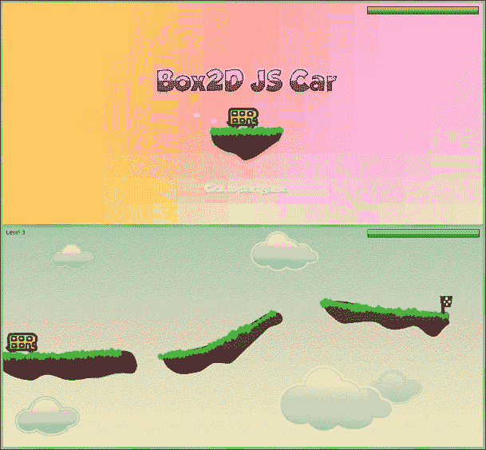

你也可以在 [`makzan.net/html5-games/car-game/`](http://makzan.net/html5-games/car-game/) 上玩游戏，以一窥最终结果。

那么，让我们开始吧。

# 安装 Box2D JavaScript 库

现在，假设我们想要创建一个赛车游戏。我们给汽车施加力使其向前移动。汽车在斜坡上移动，然后飞入空中。之后，汽车落在目标斜坡上，游戏结束。物理世界的每个部分的碰撞都影响着这个运动。如果我们必须从头开始制作这个游戏，那么我们必须至少计算每个部分的速率和角度。幸运的是，物理库帮助我们处理所有这些物理问题。我们只需要创建物理模型并在画布上展示它。我们使用的引擎是 Box2D。

Box2D 是一个 2D 物理仿真引擎。原始的 Box2D 是由 Erin Catto 用 C 语言编写的。后来被移植到 Flash ActionScript。后来，其 2.1a 版本被移植到 JavaScript。你可以在他们的 Google Code 项目中找到 Box2D 2.1a 的 JavaScript 版本，网址为 [`code.google.com/p/box2dweb/`](https://code.google.com/p/box2dweb/)。

### 注意

在撰写本书时，Google Code 宣布他们将在 2016 年关闭。为了以防原始仓库不可访问，我已经将该库分叉到一个 URL ([`github.com/makzan/Box2DWeb-Fork`](https://github.com/makzan/Box2DWeb-Fork))。

# 行动时间 – 安装 Box2D 物理库

我们将设置 Box2D 库。我们必须执行以下步骤来准备我们的项目：

1.  首先，让我们设置我们的游戏项目。创建一个具有以下文件结构的文件夹。HTML 文件包含一个带有空内容的 HTML 模板，并包含所有脚本和样式文件。您可以在代码包中找到完整文档的源代码。请还将 Box2D 源文件下载到 `js` 文件夹中。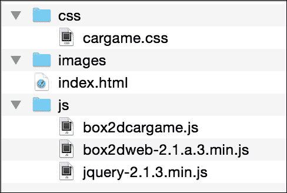

1.  在 HTML 主体中，我们必须定义一个画布，如下所示：

    ```js
    <canvas id="game" width="1300" height="600"></canvas>
    ```

1.  我们必须然后为我们将要在游戏中使用的几个 Box2D 类别设置别名；这使得在代码中引用它们更容易：

    ```js
    // Box2D alias
    var b2Vec2 = Box2D.Common.Math.b2Vec2
      , b2BodyDef = Box2D.Dynamics.b2BodyDef
      , b2Body = Box2D.Dynamics.b2Body
      , b2FixtureDef = Box2D.Dynamics.b2FixtureDef
      , b2World = Box2D.Dynamics.b2World
      , b2PolygonShape = Box2D.Collision.Shapes.b2PolygonShape
      , b2CircleShape = Box2D.Collision.Shapes.b2CircleShape
      , b2DebugDraw = Box2D.Dynamics.b2DebugDraw
      , b2RevoluteJointDef = Box2D.Dynamics.Joints.b2RevoluteJointDef;
    ```

1.  现在，我们将创建一个空的世界来测试我们的 Box2D 库安装。打开 `box2dcargame.js` JavaScript 文件，并在文件中放入以下代码以创建世界：

    ```js
    var carGame = {
    }

    var canvas;
    var ctx;
    var canvasWidth;
    var canvasHeight;

    function initGame() {

      carGame.world = createWorld();

      console.log("The world is created. ",carGame.world);

      // get the reference of the context
      canvas = document.getElementById('game');
      ctx = canvas.getContext('2d');
      canvasWidth = parseInt(canvas.width);
      canvasHeight = parseInt(canvas.height);
    };

    // Create and return the Box2D world.
    function createWorld() {
      // Define the gravity
      var gravity = new b2Vec2(0, 10);

      // set to allow sleeping object
      var allowSleep = true;

      // finally create the world with 
      // gravity and sleep object parameter.
      var world = new b2World(gravity, allowSleep);
      return world;
    }

    // After all the definition, we init the game.
    initGame();
    ```

1.  在网页浏览器中打开 `index.html` 文件。我们应该看到一个没有任何内容的灰色画布。

我们还没有将物理世界呈现到画布上。这就是为什么我们在页面上只看到一个空白的画布。然而，我们在控制台日志中打印了新创建的世界。以下截图显示了控制台跟踪具有以 `m_` 开头的许多属性的世界对象。这些都是世界的物理状态：

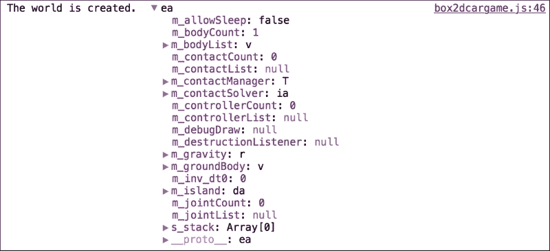

## *发生了什么事？*

我们刚刚安装了 Box2D JavaScript 库并创建了一个空的世界来测试安装。

## 使用 b2World 创建一个新的世界

`b2World` 类是 Box2D 环境中的核心类。我们所有的物理体，包括地面和汽车，都是在该世界中创建的。以下代码显示了如何创建一个世界：

```js
var world = new b2World(gravity, doSleep);
```

`b2World` 类初始化时需要两个参数，如下表所示，包括它们的描述：

| 参数 | 类型 | 讨论 |
| --- | --- | --- |
| `gravity` | b2Vec2 | 这代表了世界的重力 |
| `doSleep` | Bool | 这定义了世界是否忽略休眠对象 |

## 设置世界的重力

我们必须定义世界的重力。重力由 `b2Vec2` 定义。`b2Vec2` 类是一个 *x* 和 *y* 轴的向量。因此，以下代码使用 10 个单位向下定义了重力：

```js
var gravity = new b2Vec2(0, 10);
```

## 将 Box2D 设置为忽略休眠对象

休眠体是一个动态体，它跳过模拟直到它醒来。物理库计算世界中所有体的数学数据和碰撞。当世界中存在太多体需要每帧计算时，性能会变慢。当一个休眠体与另一个对象碰撞时，它会醒来，然后再次进入休眠模式，直到下一次碰撞。

# 在物理世界中创建一个静态地面体

世界现在是空的。如果我们要在那里放置对象，对象将会落下并最终离开我们的视线。现在，假设我们想在世界上创建一个静态地面体，以便对象可以站在上面。我们可以在 Box2D 中做到这一点。

# 是时候创建世界中的地面了

按照以下步骤创建静态地面：

1.  打开`box2dcargame.js` JavaScript 文件。

1.  在文件中定义以下`pxPerMeter`变量；这是 Box2D 世界中的单位设置：

    ```js
    var pxPerMeter = 30; // 30 pixels = 1 meter
    ```

1.  将以下函数添加到 JavaScript 文件的末尾；这创建了一个固定体作为游乐场：

    ```js
    function createGround() {
      var bodyDef = new b2BodyDef;
      var fixDef = new b2FixtureDef;

      bodyDef.type = b2Body.b2_staticBody;
      bodyDef.position.x = 250/pxPerMeter;
      bodyDef.position.y = 370 /pxPerMeter;

      fixDef.shape = new b2PolygonShape();
      fixDef.shape.SetAsBox(250/pxPerMeter, 25/pxPerMeter);
      fixDef.restitution = 0.4;

      // create the body from the definition.
      var body = carGame.world.CreateBody(bodyDef);
      body.CreateFixture(fixDef);

      return body;
    }
    ```

1.  在创建世界后，在`initGame`函数中调用`createGround`函数，如下所示：

    ```js
    createGround();
    ```

1.  由于我们仍在定义逻辑并且尚未以视觉方式展示物理世界，如果我们打开浏览器，我们将看不到任何东西。然而，养成尝试并检查控制台窗口以查找错误消息的习惯是值得的。

## *刚才发生了什么？*

我们已经使用形状和体定义创建了一个地面体。这是一个常见的流程，我们将经常使用它来在世界上创建不同类型的物理体。所以，让我们深入了解我们是如何做到这一点的。

## 像素每米

在 Box2D 中，大小和位置单位以米计算。我们在屏幕上使用像素。因此，我们定义了一个变量来转换米和屏幕像素之间的单位。我们将值设置为 30，这意味着 30 像素等于 1 米。你可以探索你物理世界中的不同值。

我们不应该使用 1 像素等于 1 米，否则我们的对象在 Box2D 规模下会变得非常大。想象一下，我们有一辆宽度为 100 px 的汽车，它将变成 100 米长，这完全不现实。通过定义 30 px/meter 或任何合理的值，屏幕上宽度为 100 px 的对象在模拟中大约是 3.33 米长，这是 Box2D 可以很好地处理的。更多详情，请参阅 Box2D 手册第 1.7 节，[`www.box2d.org/manual.html`](http://www.box2d.org/manual.html)。

## 使用夹具创建形状

夹具包含物理属性及其形状。物理属性定义密度、摩擦和恢复，其中恢复基本上是物体的弹性。形状定义了几何数据。形状可以是圆形、矩形或多边形。我们之前示例中使用的以下代码定义了一个箱形形状定义。`SetAsBox`函数接受两个参数：半宽和半高。这是一个半值，所以形状的最终面积是值的四倍：

```js
fixDef.shape = new b2PolygonShape();
fixDef.shape.SetAsBox(250/pxPerMeter, 25/pxPerMeter);
fixDef.restitution = 0.4;
```

## 创建一个体

在定义了夹具之后，我们就可以使用给定的形状定义创建一个体定义。然后，我们设置体的初始位置，最后请求世界实例根据我们的体定义创建一个体。以下代码展示了如何使用给定的形状定义在世界中创建一个体：

```js
bodyDef.type = b2Body.b2_staticBody;
bodyDef.position.x = 250/pxPerMeter;
bodyDef.position.y = 370 /pxPerMeter;

// create the body from the definition.
var body = carGame.world.CreateBody(bodyDef);
body.CreateFixture(fixDef);
```

一个物体可以是静态物体或动态物体。静态物体是不可移动的，并且不会与其他静态物体发生碰撞。因此，这些物体可以用作地面或墙壁，成为关卡环境。另一方面，动态物体会根据与其他物体（静态或动态）的碰撞以及重力而移动。我们将在后面创建一个动态箱子体。

## 使用恢复系数属性设置弹跳效果

恢复系数的值在 0 到 1 之间。在我们的例子中，箱子正落在地面上。当地面和箱子上的恢复系数都是 0 时，箱子根本不会弹跳。当箱子或地面有一个恢复系数为 1 时，碰撞是完全弹性的。

### 提示

当两个物体相撞时，该碰撞的恢复系数是两个物体各自恢复系数的最大值。因此，如果一个恢复系数为 0.4 的箱子掉在恢复系数为 0.6 的地面上，这个碰撞将使用 0.6 来计算弹跳速度。

# 在画布中绘制物理世界

我们已经创建了地面，但它只存在于数学模型中。我们在画布上没有看到任何东西，因为我们还没有在上面绘制任何东西。为了展示物理的样子，我们必须根据物理世界绘制一些东西。

# 是时候将物理世界绘制到画布上了

执行以下步骤以绘制有用的调试视图：

1.  首先，打开`box2dcargame.js` JavaScript 文件：

    ```js
    var shouldDrawDebug = false;
    ```

1.  添加一个绘制调试线的函数：

    ```js
    function showDebugDraw() {
      shouldDrawDebug = true;

      //setup debug draw
      var debugDraw = new b2DebugDraw();
      debugDraw.SetSprite(document.getElementById('game').getContext('2d'));
      debugDraw.SetDrawScale(pxPerMeter);
      debugDraw.SetFillAlpha(0.3);
      debugDraw.SetLineThickness(1.0);
      debugDraw.SetFlags(b2DebugDraw.e_shapeBit | b2DebugDraw.e_jointBit);

      carGame.world.SetDebugDraw(debugDraw);

      carGame.world.DrawDebugData();
    }
    ```

1.  在`initGame`方法的末尾添加`showDebugDraw`函数调用：

    ```js
    showDebugDraw();
    ```

1.  现在，在浏览器中重新打开游戏，我们应该在画布中看到地体的轮廓，如下面的截图所示：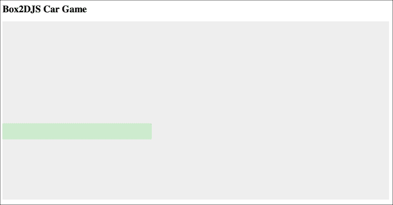

## *发生了什么？*

我们刚刚定义了一个方法，该方法要求 Box2D 引擎在画布中绘制物理体。在我们成功添加自己的图形之前，这对于调试很有用。我们可以通过`SetFlags`方法设置要显示的内容。

标志是位变量。这意味着标志中的每个位都控制一种绘制类型。我们通过使用位运算符或（`|`）组合标志。例如，我们使用以下代码显示形状和关节。

```js
debugDraw.SetFlags(b2DebugDraw.e_shapeBit | b2DebugDraw.e_jointBit);
```

除了形状和关节之外，还有不同类型的调试绘制：

| 位标志 | 讨论 |
| --- | --- |
| `e_aabbBit` | 这会绘制所有的边界框 |
| `e_centerOfMassBit` | 这会绘制质心 |
| `e_controllerBit` | 这会绘制所有的动态控制器 |
| `e_jointBit` | 这会绘制所有的关节连接 |
| `e_pairBit` | 这会绘制广泛的碰撞对 |
| `e_shapeBit` | 这会绘制所有的形状 |

# 在物理世界中创建动态箱子

想象一下，我们将一个盒子放入世界中。盒子从空中落下，最终撞到地面。盒子弹起一点，最终再次落在地面上。这与我们在上一节中创建的不同。在上一节中，我们创建了一个静态地面，它是不可移动的，不能受到重力的影响。现在，我们将创建一个动态的盒子。

# 动作时间 – 将动态盒子放入世界

执行以下步骤以创建我们的第一个动态物体：

1.  打开我们的 JavaScript 文件，并将以下盒子创建代码添加到页面加载事件处理程序中。将代码放置在`createGround`函数之后：

    ```js
    // temporary function
    function createBox() {
      var bodyDef = new b2BodyDef;
      var fixDef = new b2FixtureDef;

      bodyDef.type = b2Body.b2_dynamicBody;
      bodyDef.position.x = 50/pxPerMeter;
      bodyDef.position.y = 210/pxPerMeter;

      fixDef.shape = new b2PolygonShape();
      fixDef.shape.SetAsBox(20/pxPerMeter, 20/pxPerMeter);

      var body = carGame.world.CreateBody(bodyDef);
      body.CreateFixture(fixDef);

      return body;
    }
    ```

1.  我们需要调用我们新创建的`createBox`函数。在`initGame`中调用`createGround`函数之后放置以下代码。

1.  现在，我们将在浏览器中测试物理世界。你应该会看到在给定的初始位置创建了一个盒子。然而，盒子并没有掉下来；这是因为我们还需要做一些事情来让它掉下来：

## *刚才发生了什么？*

我们刚刚在世界上创建了一个动态物体。与不可移动的地面物体相比，这个盒子受到重力的影响，并且在碰撞期间速度会发生变化。当一个物体包含任何质量或密度的形状时，它就是一个动态物体。否则，它是静态的。因此，我们为盒子定义了一个密度。Box2D 会使其成为动态的，并自动根据物体的密度和大小计算质量。

# 前进世界时间

盒子是动态的，但它没有掉下来。我们在这里做错了什么吗？答案是：没有。我们已经正确设置了盒子，但我们忘记了在物理世界中前进时间。

在 Box2D 物理世界中，所有计算都是在系统迭代中完成的。世界根据当前步骤计算所有物体的物理变换。当我们移动`step`到下一个级别时，世界会根据新的状态再次计算。

# 动作时间 – 设置世界步骤循环

我们将通过执行以下步骤来使世界时间前进：

1.  为了前进世界步骤，我们必须定期调用世界实例中的`step`函数。我们使用了`setTimeout`来持续调用`step`函数。将以下函数放入我们的 JavaScript 逻辑文件中：

    ```js
    function updateWorld() {
      // Move the physics world 1 step forward.
      carGame.world.Step(1/60, 10, 10);

      // display the build-in debug drawing.
      if (shouldDrawDebug) {
        carGame.world.DrawDebugData();
      }
    }
    ```

1.  接下来，我们将在`initGame`方法中设置一个时间间隔：

    ```js
    setInterval(updateWorld, 1/60);
    ```

1.  我们将在浏览器中再次模拟世界。盒子在初始化位置创建，并正确地落在地面上。以下截图显示了盒子掉落在地面上的序列：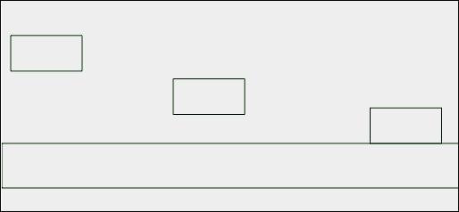

## *刚才发生了什么？*

我们已经推进了世界的时间。现在，物理库以每秒 60 次的频率模拟世界。在游戏循环中，我们调用 `Step` 函数到 Box2D 世界。`Step` 函数模拟物理世界向前一步。在步骤中，物理引擎计算世界中发生的一切，包括力和重力。

# 向游戏中添加轮子

现在，我们在游戏中有一个盒子。想象一下，我们现在创建两个圆形体作为轮子。然后，我们将拥有汽车的基本组件——车身和轮子。

# 行动时间 – 在世界中放置两个圆形

我们将通过以下步骤添加两个圆形到世界中：

1.  打开 `html5games.box2dcargame.js` JavaScript 文件以添加轮子体。

1.  在盒子创建代码之后添加以下代码。这调用我们将要编写的 `createWheel` 函数，以创建一个圆形形状的体：

    ```js
    // create two wheels in the world
    createWheel(25, 230);
    createWheel(75, 230);
    ```

1.  现在让我们来处理 `createWheel` 函数。我们设计这个函数，在给定的世界中，在给定的 *x* 和 *y* 坐标处创建一个圆形体。为此，将以下函数放入我们的 JavaScript 逻辑文件中：

    ```js
    function createWheel(x, y) {
      var bodyDef = new b2BodyDef;
      var fixDef = new b2FixtureDef;

      bodyDef.type = b2Body.b2_dynamicBody;
      bodyDef.position.x = x/pxPerMeter;
      bodyDef.position.y = y/pxPerMeter;

      fixDef.shape = new b2CircleShape();
      fixDef.shape.SetRadius(10/pxPerMeter);

      fixDef.density = 1.0;
      fixDef.restitution = 0.1;
      fixDef.friction = 4.3;

      var body = carGame.world.CreateBody(bodyDef);
      body.CreateFixture(fixDef);

      return body;
    }
    ```

1.  我们现在将在网页浏览器中重新加载物理世界。这次，我们应该看到以下截图所示的结果，其中有一个盒子和两个轮子从空中落下：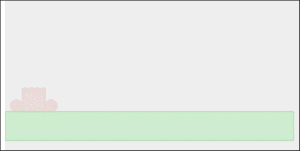

## *发生了什么？*

当模拟物理世界时，盒子和轮子都会掉落并相互碰撞以及与地面碰撞。

创建圆形体与创建盒子体类似。唯一的区别是我们使用 `CircleDef` 类而不是盒子形状定义。在圆形定义中，我们使用 `radius` 属性而不是 `extents` 属性来定义圆形大小。

# 创建物理汽车

我们已经准备好了汽车盒子体和两个轮子体。我们离制作汽车只差一步。想象一下，现在我们有一根胶棒来将轮子粘到汽车体上。然后，汽车和轮子将不再分离，我们将拥有汽车。我们可以使用 **关节** 来实现这一点。在本节中，我们将使用 `joint` 将轮子和汽车体粘在一起。

# 行动时间 – 使用旋转关节连接盒子和两个圆形

执行以下步骤以创建带有盒子和轮子的汽车：

1.  我们目前只在工作逻辑部分。在文本编辑器中打开我们的 JavaScript 逻辑文件。

1.  创建一个名为 `createCarAt` 的函数，该函数接受坐标作为参数。然后，将体和轮子创建代码移动到这个函数中。之后，添加以下高亮的关节创建代码。最后，返回汽车体：

    ```js
    function createCarAt(x, y) {
      var bodyDef = new b2BodyDef;
      var fixDef = new b2FixtureDef;

      // car body
      bodyDef.type = b2Body.b2_dynamicBody;
      bodyDef.position.x = 50/pxPerMeter;
      bodyDef.position.y = 210/pxPerMeter;

      fixDef.shape = new b2PolygonShape();
      fixDef.density = 1.0;
      fixDef.friction = 1.5;
      fixDef.restitution = .4;
      fixDef.shape.SetAsBox(40/pxPerMeter, 20/pxPerMeter);

      carBody = carGame.world.CreateBody(bodyDef);

      carBody.CreateFixture(fixDef);

      // creating the wheels
      var wheelBody1 = createWheel(x-25, y+20);
      var wheelBody2 = createWheel(x+25, y+20);

      // create a joint to connect left wheel with the car body
      var jointDef = new b2RevoluteJointDef();
      jointDef.Initialize(carBody, wheelBody1, new b2Vec2( (x-25)/pxPerMeter ,  (y+20)/pxPerMeter ));
      carGame.world.CreateJoint(jointDef);

      // create a joint to connect right wheel with the car body
      var jointDef = new b2RevoluteJointDef();
      jointDef.Initialize(carBody, wheelBody2, new b2Vec2( (x+25)/pxPerMeter ,  (y+20)/pxPerMeter ));
      carGame.world.CreateJoint(jointDef);

      return carBody;

    }
    ```

1.  在 `initGame` 函数中，我们创建了两个轮子。从 `initGame` 函数中移除调用 `createWheel` 函数的这些代码行。

1.  然后，我们只需要创建一个具有初始位置的汽车。在调用 `createGround` 函数后，将以下代码添加到 `initGame` 函数中：

    ```js
    carGame.car = createCarAt(50, 210);
    ```

1.  是时候保存文件并在浏览器中运行物理世界了。在这个时候，车轮和车身还不是分离的部件。它们粘合在一起形成一个汽车，并正确地落在地面上，如下面的截图所示：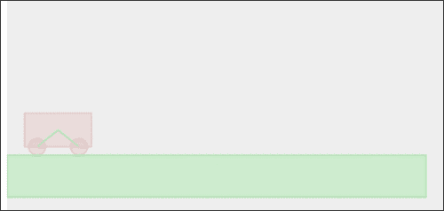

## *发生了什么？*

关节有助于在两个物体（或物体和世界之间）之间添加约束。有许多种类的关节，而我们在这个例子中使用的是**旋转关节**。

## 使用旋转关节在两个物体之间创建锚点

旋转关节通过一个共同的锚点将两个物体粘合在一起。然后，两个物体粘合在一起，并且只能根据共同的锚点旋转。以下截图的左侧显示了两个物体通过一个锚点连接。在我们的代码示例中，我们将锚点设置为正好是车轮的中心点。以下截图的右侧显示了如何设置关节。车轮旋转，因为旋转原点在中心。这种设置使汽车和车轮看起来更真实：

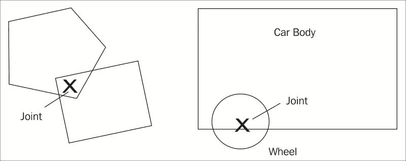

有其他类型的关节，以不同的方式有用。关节对于创建游戏环境很有用，由于有几种类型的关节，每种类型的关节都值得尝试，你应该考虑如何使用它们。以下链接包含 Box2D 手册，解释了每种类型的关节以及我们如何在不同的环境设置中使用它们：[`www.box2d.org/manual.html#_Toc258082974`](http://www.box2d.org/manual.html#_Toc258082974)。

# 使用键盘输入向汽车添加力

我们现在已经准备好了汽车。让我们用键盘来移动它。

# 操作时间 – 向汽车添加力

执行以下步骤以获取键盘输入：

1.  在文本编辑器中打开`box2dcargame.js` JavaScript 文件。

1.  在页面加载事件处理程序中，我们在代码的开头添加了以下`keydown`事件处理程序。它监听右箭头键和左箭头键，以在不同方向上施加力：

    ```js
    $(document).keydown(function(e){
      switch(e.keyCode) {
        case 39: // right arrow key to apply force towards right
          var force = new b2Vec2(100, 0);
          carGame.car.ApplyForce(force, carGame.car.GetWorldCenter());
          return false;
          break;
        case 37: // left arrow key to apply force towards left
          var force = new b2Vec2(-100, 0);
          carGame.car.ApplyForce(force, carGame.car.GetWorldCenter());
          return false;
          break;
      }
    });
    ```

1.  我们已经向物体添加了力。我们需要在每一步中清除力，否则力会累积：

    ```js
    function updateWorld() {
      // existing code goes here.
      // Clear previous applied force.
      carGame.world.ClearForces();
    }
    ```

1.  保存文件并在浏览器中运行我们的游戏。当你按下*箭头*键时，汽车开始移动。如果你持续按住键，世界将不断向汽车添加力，使其加速：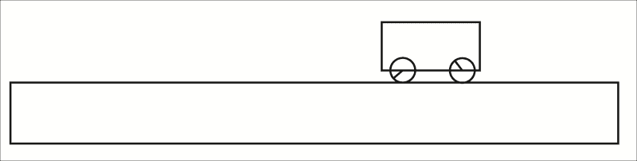

## *发生了什么？*

我们刚刚与我们的车身创建了交互。我们可以通过按箭头键来左右移动汽车。现在游戏看起来越来越有趣了。

## 对物体施加力

我们可以通过在物体中调用`ApplyForce`函数来对任何物体施加力。以下代码显示了该函数的用法：

```js
body.ApplyForce(force, point);
```

这个函数接受两个参数，如下表所示：

| 参数 | 类型 | 讨论 |
| --- | --- | --- |
| `force` | `b2Vec2` | 这是施加到物体上的力向量 |
| `point` | `b2Vec2` | 这是施加力的点 |

## 清除力

在我们对物体施加力之后，该力会持续作用于该物体，直到我们清除它。在大多数情况下，我们在每一步之后清除力。

## 理解 ApplyForce 和 ApplyImpulse 之间的区别

除了 `ApplyForce` 函数之外，我们还可以通过使用 `ApplyImpulse` 函数移动任何物体。这两个函数都会移动物体，但它们使用不同的方法。如果我们想改变物体的实例速度，那么我们就在物体上使用一次 `ApplyImpulse` 来改变其速度以达到我们的目标值。另一方面，我们需要持续对物体施加力以增加速度。

例如，如果我们想增加汽车的速度，类似于踩油门，我们需要对汽车施加力。如果我们正在创建一个需要踢球开始的游戏，我们可能使用 `ApplyImpulse` 函数向球的物体添加实例冲量。

## 尝试一下英雄

你能想到一个不同的情况，我们将在其中需要向物体施加力或冲量吗？

## 向我们的游戏环境添加斜坡

现在，我们可以移动汽车。然而，环境还不够有趣，无法进行游戏。想象一下，现在有一些斜坡供汽车跳跃，并且有两个平台之间的一个间隙，玩家必须驾驶汽车飞越。不同的斜坡设置将使游戏更有趣。

# 行动时间 - 使用斜坡创建世界

执行以下步骤在物理世界中创建斜坡：

1.  我们打开游戏逻辑 JavaScript 文件。

1.  在 `createGround` 函数中，我们将函数更新为接受四个参数。更改的代码如下所示：

    ```js
    function createGround(x, y, width, height, rotation) {
      var bodyDef = new b2BodyDef;
      var fixDef = new b2FixtureDef;

      bodyDef.type = b2Body.b2_staticBody;
      bodyDef.position.x = x /pxPerMeter;
      bodyDef.position.y = y /pxPerMeter;
      bodyDef.angle = rotation * Math.PI / 180;

      fixDef.shape = new b2PolygonShape();
      fixDef.shape.SetAsBox(width/pxPerMeter, height/pxPerMeter);
      fixDef.restitution = 0.4;
      fixDef.friction = 3.5;

      // create the body from the definition.
      var body = carGame.world.CreateBody(bodyDef);
      body.CreateFixture(fixDef);

      return body;
    }
    ```

1.  现在，我们有一个创建地面物体的函数。我们将现在用以下代码替换页面加载处理函数中的地面创建代码：

    ```js
    // create the ground
    createGround(250, 270, 250, 25, 0);
    // create a ramp
    createGround(500, 250, 65, 15, -10);
    createGround(600, 225, 80, 15, -20);
    createGround(1100, 250, 100, 15, 0);
    ```

1.  保存文件，并在浏览器中预览游戏。我们现在应该看到一个斜坡和一个目标平台，如下面的截图所示。尝试通过让汽车跳过斜坡到达目的地而不掉下来来控制汽车。如果失败，请刷新页面重新开始游戏：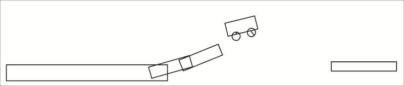

## *发生了什么？*

我们刚刚将地面盒子的创建代码封装在一个函数中，这样我们就可以轻松地创建地面物体的组合。这些地面物体组合了游戏关卡环境。

此外，这是我们第一次旋转物体。我们通过使用 `rotation` 属性来设置物体的旋转，该属性接受弧度值。通过设置盒子的旋转，我们可以在游戏中设置具有不同斜率的斜坡。

## 尝试一下英雄

现在我们已经设置了一个斜坡，我们可以在环境中驾驶汽车。那么，使用不同类型的关节来设置游乐场怎么样？例如，使用滑轮关节作为提升装置怎么样？另一方面，包含一个带有中心关节的动态板怎么样？

# 在 Box2D 世界中检查碰撞

Box2D 物理库自动计算所有碰撞。想象一下，我们现在设置一个地面身体作为目标。当玩家成功将汽车移动到撞击目标时，玩家获胜。由于 Box2D 已经计算了所有碰撞，我们只需要获取检测到的碰撞列表并确定我们的汽车是否撞击了目标地面。

# 行动时间 – 检查汽车和目标身体的碰撞

执行以下步骤来处理碰撞：

1.  再次，我们从游戏逻辑开始。在文本编辑器中打开`box2dcargame.js`JavaScript 文件。

1.  我们在创建地面的代码中设置了一个目标地面，并将其分配给`carGame`全局对象实例中的`gamewinWall`引用，如下所示：

    ```js
    carGame.gamewinWall = createGround(1200, 215, 15, 25, 0);
    ```

1.  接下来，我们转到`step`函数。在每一步中，我们从世界中获取完整的接触列表并检查是否有两个碰撞对象是汽车和目标地面：

    ```js
    function checkCollision() {
      // loop all contact list 
      // to check if the car hits the winning wall.
      for (var cn = carGame.world.GetContactList(); cn != null; cn = cn.GetNext()) {
        var body1 = cn.GetFixtureA().GetBody();
        var body2 = cn.GetFixtureB().GetBody();
        if ((body1 === carGame.car && body2 === carGame.gamewinWall) || (body2 === carGame.car && body1 === carGame.gamewinWall))
        {
          if (cn.IsTouching()) {
            console.log("Level Passed!");
          }
        }
      }
    }
    ```

1.  当我们调用我们的游戏循环函数`updateWorld`时，我们调用我们新创建的碰撞检查函数。

    ```js
    checkCollision();
    ```

1.  我们现在将保存代码并在浏览器中再次打开游戏。这次，我们必须打开控制台窗口来跟踪当汽车撞到墙时是否得到**通过关卡**的输出。尝试完成游戏，一旦汽车撞到目标，我们应该在控制台中看到输出：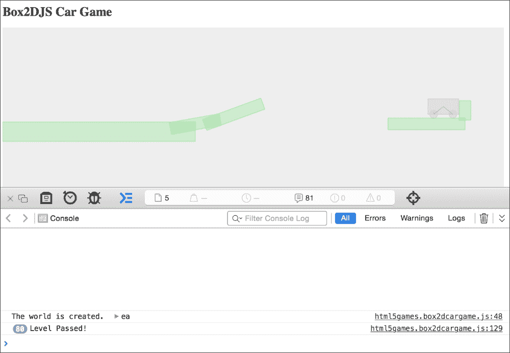

## *发生了什么？*

我们通过检查碰撞接触创建了游戏胜利逻辑。当汽车成功到达目标地面对象时，玩家获胜。

## 获取碰撞接触列表

在每一步中，Box2D 计算所有碰撞并将它们放入`world`实例的**接触** **列表**中。我们可以通过使用`carGame.world.GetContactList()`函数来获取接触列表。返回的接触列表是一个**链表**。我们可以通过以下`for`循环遍历整个链表：

```js
for (var cn = carGame.world.GetContactList(); cn != null; cn = cn.GetNext()) {
   // We have fixture 1 and fixture 2 of each contact node.
   var body1 = cn.GetFixtureA().GetBody();
   var body2 = cn.GetFixtureB().GetBody();
}
```

当我们获取到碰撞的形状时，我们检查该形状的身体是汽车还是目标身体。由于汽车形状可能在固定装置 1 或固定装置 2 中，同样也适用于`gamewinWall`，我们需要检查这两种组合。额外的`isTouching`函数提供了更精确的固定装置之间的碰撞检查。

```js
if ((body1 === carGame.car && body2 === carGame.gamewinWall) ||
   (body2 === carGame.car && body1 === carGame.gamewinWall))
{
  if (cn.IsTouching()) {
    console.log("Level Passed!");
  }
}
```

## 来吧，英雄

我们在 第七章 中创建了一个游戏结束对话框，*保存游戏进度*。那么，我们是否可以使用那种技术在这里创建一个对话框，当玩家击中胜利墙壁时显示他们通过了关卡？这在我们添加不同关卡设置到游戏中作为关卡过渡时也将非常有用。

# 重新启动游戏

你可能已经在上一个例子中尝试刷新页面几次，以使汽车成功跳到目的地。现在想象一下，如果我们能按一个键来重新初始化世界。然后，我们可以通过试错法直到成功。

# 行动时间 – 按下 R 键重新启动游戏

我们将把 *R* 键分配为我们的游戏的重启键。现在，让我们执行以下步骤：

1.  再次，我们只需要更改 JavaScript 文件。在文本编辑器中打开 `box2dcargame.js` JavaScript 文件。

1.  我们需要一个函数来移除所有身体：

    ```js
    function removeAllBodies() {
      // loop all body list to destroy them
      for (var body = carGame.world.GetBodyList(); body != null; body = body.GetNext()) {
        carGame.world.DestroyBody(body);
      }
    }
    ```

1.  我们将创建世界、坡道和汽车代码移动到一个名为 `restartGame` 的函数中。它们最初位于页面加载处理函数中：

    ```js
    function restartGame() {
      removeAllBodies();

      // create the ground
      createGround(250, 270, 250, 25, 0);

      // create a ramp
      createGround(500, 250, 65, 15, -10);
      createGround(600, 225, 80, 15, -20);
      createGround(1100, 250, 100, 15, 0);

      // create a destination ground
      carGame.gamewinWall = createGround(1200, 215, 15, 25, 0);

      // create a car
      carGame.car = createCarAt(50, 210);
    }
    ```

1.  然后，在 `initGame` 函数中，我们调用 `restartGame` 函数以如下方式初始化游戏：

    ```js
    restartGame();
    ```

1.  最后，我们将以下突出显示的代码添加到 `keydown` 处理程序中，以便在按下 *R* 键时重新启动游戏：

    ```js
    $(document).keydown(function(e){
      switch(e.keyCode) {
        case 39: // right arrow key to apply force towards right
          var force = new b2Vec2(300, 0);
          carGame.car.ApplyForce(force, carGame.car.GetWorldCenter());
          break;
        case 37: // left arrow key to apply force towards left
          var force = new b2Vec2(-300, 0);
          carGame.car.ApplyForce(force, carGame.car.GetWorldCenter());
          break;
     case 82: // r key to restart the game
     restartGame();
     break;
      }
    });
    ```

1.  当玩家通过关卡时，我们是否应该重新启动游戏？为此，在检查汽车和胜利旗帜之间碰撞的逻辑中添加以下突出显示的代码：

    ```js
    console.log("Level Passed!");
    restartGame();

    ```

1.  是时候在浏览器中测试游戏了。尝试玩游戏并按下 *R* 键重新启动游戏。

## *发生了什么事？*

我们重构了代码以创建一个 `restartGame` 函数。每次调用此函数时，世界都会被销毁并重新初始化。我们可以通过创建世界变量的新世界实例来销毁现有世界并创建一个新空的世界，如下所示：

```js
carGame.world = createWorld();
```

## 尝试一下英雄

现在唯一重新启动游戏的方法是按重启键。我们是否可以在世界的底部创建一个检查任何掉落汽车的地面？当汽车掉落并击中底部地面时，我们知道玩家失败了，然后他们可以重新启动游戏。

# 为我们的汽车游戏添加关卡支持

想象一下，在完成每场比赛后，我们可以升级到下一个环境设置。我们将需要每个级别的几个环境设置。

# 行动时间 – 使用关卡数据加载游戏

我们将重构我们的代码以支持从关卡数据结构中加载静态地面身体。让我们通过执行以下步骤来完成这项工作：

1.  在文本编辑器中打开 `box2dcargame.js` JavaScript 文件。

1.  我们将需要每个级别的每个地面设置。在 JavaScript 文件顶部放置以下代码。这是一个级别数组。每个级别是另一个包含位置、尺寸和旋转的静态地面身体的数组：

    ```js
    var carGame = {
       currentLevel: 0
    }
    carGame.levels = new Array();
    carGame.levels[0] = [{"type":"car","x":50,"y":210,"fuel":20},
    {"type":"box","x":250, "y":270, "width":250, "height":25, "rotation":0},
    {"type":"box","x":500,"y":250,"width":65,"height":15, "rotation":-10},
    {"type":"box","x":600,"y":225,"width":80,"height":15, "rotation":-20},
    {"type":"box","x":950,"y":225,"width":80,"height":15, "rotation":20},
    {"type":"box","x":1100,"y":250,"width":100,"height":15, "rotation":0},
    {"type":"win","x":1200,"y":215,"width":15,"height":25, "rotation":0}];

    carGame.levels[1] = [{"type":"car","x":50,"y":210,"fuel":20},
    {"type":"box","x":100, "y":270, "width":190, "height":15, "rotation":20},
    {"type":"box","x":380, "y":320, "width":100, "height":15, "rotation":-10},
    {"type":"box","x":666,"y":285,"width":80,"height":15, "rotation":-32},
    {"type":"box","x":950,"y":295,"width":80,"height":15, "rotation":20},
    {"type":"box","x":1100,"y":310,"width":100,"height":15, "rotation":0},
    {"type":"win","x":1200,"y":275,"width":15,"height":25, "rotation":0}];

    carGame.levels[2] = [{"type":"car","x":50,"y":210,"fuel":20},
    {"type":"box","x":100, "y":270, "width":190, "height":15, "rotation":20},
    {"type":"box","x":380, "y":320, "width":100, "height":15, "rotation":-10},
    {"type":"box","x":686,"y":285,"width":80,"height":15, "rotation":-32},
    {"type":"box","x":250,"y":495,"width":80,"height":15, "rotation":40},
    {"type":"box","x":500,"y":540,"width":200,"height":15, "rotation":0},
    {"type":"win","x":220,"y":425,"width":15,"height":25, "rotation":23}];
    ```

1.  将`restartGame`函数替换为以下代码。这更改了函数以接受`level`参数。然后根据级别数据创建地面或汽车：

    ```js
    function restartGame(level) {
       carGame.currentLevel = level;

       // destroy existing bodies.
       removeAllBodies();// create the world 

       // create a ground in our newly created world
       // load the ground info from level data
       for(var i=0;i<carGame.levels[level].length;i++) {
          var obj = carGame.levels[level][i];

          // create car
          if (obj.type === "car") {
             carGame.car = createCarAt(obj.x, obj.y);
             continue;
          }

          var groundBody = createGround(obj.x, obj.y, obj.width, obj.height, obj.rotation);

          if (obj.type === "win") {
             carGame.gamewinWall = groundBody;
          }   
       }
    }
    ```

1.  在页面加载处理函数中，通过提供`currentLevel`来调用`restartGame`函数，如下所示：

    ```js
    restartGame(carGame.currentLevel);
    ```

1.  我们还需要在重启键处理程序中提供`currentLevel`值：

    ```js
    case 82: // r key to restart the game
       restartGame(carGame.currentLevel);
       break;
    ```

1.  最后，更改游戏胜利逻辑中以下突出显示的代码。当汽车撞击目的地时，我们在游戏中提升一个级别：

    ```js
    if ((body1 === carGame.car && body2 === carGame.gamewinWall) ||
       (body2 === carGame.car && body1 === carGame.gamewinWall))
    {
      if (cn.IsTouching()) {
        console.log("Level Passed!");
     restartGame(carGame.currentLevel+1);
      }
    }
    ```

1.  我们现在将在网络浏览器中运行游戏。完成关卡后，游戏应该从下一级重新启动：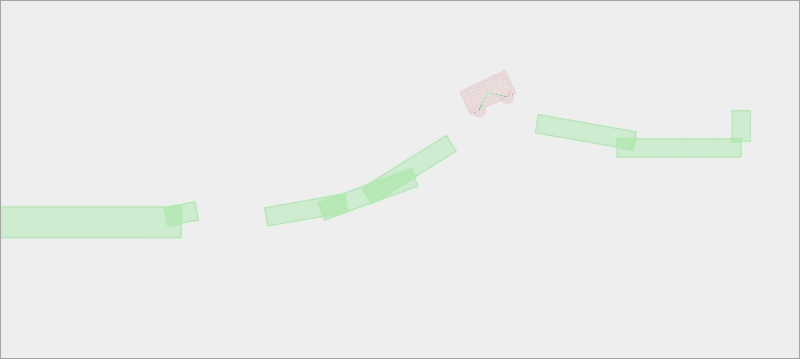

## *刚才发生了什么？*

我们刚刚创建了一个用于存储级别的数据结构。然后，我们使用给定的级别编号创建游戏，并使用级别数据构建世界。

每个级别数据都是一个对象数组。每个对象包含世界中每个地面物体的属性。这包括基本属性，如位置、大小和旋转。还有一个名为`type`的属性。它定义了该物体是普通框体、汽车数据还是目的地胜利地面：

```js
carGame.levels[0] = [{"type":"car","x":50,"y":210,"fuel":20},
{"type":"box","x":250, "y":270, "width":250, "height":25, "rotation":0},
{"type":"box","x":500,"y":250,"width":65,"height":15,"rotation":-10},
{"type":"box","x":600,"y":225,"width":80,"height":15,"rotation":-20},
{"type":"box","x":950,"y":225,"width":80,"height":15,"rotation":20},
{"type":"box","x":1100,"y":250,"width":100,"height":15,"rotation":0},
{"type":"win","x":1200,"y":215,"width":15,"height":25,"rotation":0}];
```

在创建世界时，我们使用以下代码遍历级别数组中的所有对象。然后根据类型创建汽车和地面物体，并引用游戏胜利的地面：

```js
for(var i=0;i<carGame.levels[level].length;i++) {
  var obj = carGame.levels[level][i];

  // create car
  if (obj.type === "car") {
    carGame.car = createCarAt(obj.x,obj.y);
    continue;
  }

  var groundBody = createGround(obj.x, obj.y, obj.width, obj.height, obj.rotation);

  if (obj.type === "win") {
    carGame.gamewinWall = groundBody;
  }   
}
```

## 尝试一下英雄

现在，我们为游戏设置了几个级别。关于复制级别数据以创建更多有趣的关卡如何？创建你自己的级别并与它们一起玩耍。这就像一个孩子搭建积木并与之玩耍一样。

# 用图形替换 Box2D 轮廓绘制

我们创建了一个至少可以玩几个级别的游戏。然而，它们只是一些轮廓框。我们甚至无法在游戏中区分目的地物体和其他地面物体。想象一下，目的地是一个赛车旗帜，有一个代表它的汽车图形。这将使游戏的目的更加清晰。

# 行动时间 – 向游戏中添加旗帜图形和汽车图形

执行以下步骤在物理对象上绘制两个图形：

1.  我们将首先下载本例所需的图形。要下载图形，请访问[`mak.la/book-assets`](http://mak.la/book-assets)。

1.  将本章的图像文件放入`images`文件夹。

1.  现在，是时候编辑`index.html`文件了。将以下 HTML 标记添加到`body`部分：

    ```js
    <div id="asset">
      
      
      
    </div>
    ```

1.  我们想隐藏包含我们的`img`标签的资产 DIV。打开`cargame.css`文件，并添加以下 CSS 规则以使资产 DIV 不在我们的视线中：

    ```js
    #asset {
      position: absolute;
      top: -9999px;
    }
    ```

1.  我们现在将进入逻辑部分。打开`box2dcargame.js` JavaScript 文件。

1.  在`restartGame`函数中，添加突出显示的代码以将`flag`图像的引用分配给胜利的目的地旗帜：

    ```js
    if (obj.type === "win") {
      carGame.gamewinWall = groundBody;
     groundBody.SetUserData( document.getElementById('flag') );
    }
    ```

1.  接下来，将`bus`图像标签的引用分配给汽车形状的用户数据。在创建汽车框定义时，添加以下突出显示的代码：

    ```js
    function createCarAt(x, y) {
      var bodyDef = new b2BodyDef;
      var fixDef = new b2FixtureDef;

      // car body
      bodyDef.type = b2Body.b2_dynamicBody;  
      bodyDef.userData = document.getElementById('bus');

      // existing code goes here.
    }
    ```

    ### 注意

    我们过去使用 jQuery 的`$(selector)`方法来获取元素的引用。jQuery 选择器返回一个包含额外 jQuery 数据的元素对象数组。如果我们想获取原始文档元素引用，那么我们可以使用`document.getElementById`方法或`$(selector).get(0)`。因为`$(selector)`返回一个数组，所以`get(0)`给出列表中的第一个原始文档元素。

1.  然后，我们需要处理轮子。我们将`wheel`图像标签分配给轮子身体的`userData`属性。在`createWheel`函数中添加以下突出显示的代码

    ```js
    function createWheel(x, y) {
      var bodyDef = new b2BodyDef;
      var fixDef = new b2FixtureDef;

      bodyDef.type = b2Body.b2_dynamicBody;
      bodyDef.userData = document.getElementById('wheel');

      // existing code goes here
    }
    ```

1.  我们必须在画布上绘制图像。在`box2dcargame.js`文件中创建一个新的`drawWorld`函数，代码如下。

    ```js
    // drawing functions
    function drawWorld(world, context) {
      for (var body = carGame.world.GetBodyList(); body != null; body = body.GetNext()) {
        if (body.GetUserData() !== null && body.GetUserData() !== undefined) {
          // the user data contains the reference to the image
          var img = body.GetUserData();

          // the x and y of the image. We have to subtract the half width/height
          var x = body.GetPosition().x;
          var y = body.GetPosition().y;
          var topleftX = - $(img).width()/2;
          var topleftY = - $(img).height()/2;

          context.save();
          context.translate(x * pxPerMeter,y * pxPerMeter);
          context.rotate(body.GetAngle());
          context.drawImage(img, topleftX, topleftY);
          context.restore();
        }
      }
    }
    ```

1.  最后，在`updateWorld`函数中调用`drawWorld`函数：

    ```js
    function updateWorld() { 
      ctx.clearRect(0, 0, canvasWidth, canvasHeight);

      // existing code goes here.  

      // render graphics
      drawWorld(carGame.world, ctx);
    } 
    ```

1.  保存所有文件，并在网页浏览器中运行游戏。我们应该看到一个黄色的公交车图形，两个轮子和一个旗帜作为目的地。现在玩游戏，当公交车碰到旗帜时，游戏应该进入下一关：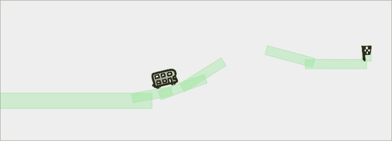

## *刚才发生了什么？*

我们现在以最少的图形展示我们的游戏。至少，玩家可以很容易地知道他们控制的是什么，以及他们应该去哪里。

Box2D 库使用画布来渲染物理世界。因此，我们可以应用我们学到的所有关于画布的技术。在第五章中，*构建 Canvas 游戏大师班*，我们学习了使用`drawImage`函数在画布中显示图像。我们使用这项技术来在物理世界的画布中绘制旗帜图形。

## 在形状和身体中使用 userData

我们如何知道哪个物理身体需要显示为旗帜图像？每个 Box2D 形状和身体都有一个名为`userData`的属性。这个属性用于存储与该形状或身体相关的任何自定义数据。例如，我们可能存储图形文件的文件名，或者直接存储对图像标签的引用。

我们有一个图像标签列表，引用游戏中需要的图形资产。然而，我们不想显示图像标签——它们只是为了加载和引用的目的。我们通过以下 CSS 样式将资产图像标签的位置设置在 HTML 边界之外来隐藏它们。我们不使用`display:none`，因为我们无法获取完全不显示的元素的宽度和高度。我们需要宽度和高度来正确地在物理世界中定位图形：

```js
#asset {
   position: absolute;
   top: -9999px;
}
```

## 根据物理身体的当前状态在每一帧中绘制图形

Box2D 的绘制只是为了在替换我们的图形之前进行开发使用。

以下代码检查形状是否有分配给它的用户数据。在我们的例子中，用户数据用于引用图形资产的`image`标签。我们获取`image`标签，并将其传递给 Canvas 上下文的`drawImage`函数以绘制。

Box2D 中的所有矩形和圆形形状都以中心点为原点。然而，画布中的图像绘制需要左上角点。因此，我们既有*x*和*y*坐标，也有左上角*x*和*y*点的偏移量，这是图像负半宽度和高度：

```js
if (body.GetUserData() !== null && body.GetUserData() !== undefined) {
   // the user data contains the reference to the image
   var img = body.GetUserData();

   // the x and y of the image.
   // We have to subtract the half width/height
   var x = body.GetPosition().x;
   var y = body.GetPosition().y;
   var topleftX = - $(img).width()/2;
   var topleftY = - $(img).height()/2;

   context.save();
   context.translate(x,y);
   context.rotate(s.GetBody().GetRotation());
   context.drawImage(img, topleftX, topleftY);
   context.restore();
}
```

## 在画布中旋转和移动图像

我们使用了`drawImage`函数直接用坐标绘制图像。然而，这里的情况不同。我们需要旋转绘制的图像。这是通过在绘制之前旋转上下文并在之后恢复旋转来完成的。我们可以通过保存上下文状态，平移它，旋转它，然后调用`restore`函数来实现。以下代码展示了如何在一个给定的位置和旋转下绘制图像。`topleftX`和`topleftY`是从图像中心原点到左上角点的偏移距离：

```js
context.save();
context.translate(x,y);
context.rotate(s.GetBody().GetRotation());
context.drawImage(img, topleftX, topleftY);
context.restore();
```

### 小贴士

我们不需要让物理体区域与其图形完全相同。例如，如果我们有一个圆形的鸡，我们可以在物理世界中用球体来表示它。使用简单的物理体可以大大提高性能。

## 尝试一下英雄

我们已经学习了使用 CSS3 过渡来动画化得分板。那么，将它应用到这个赛车游戏中怎么样？此外，给汽车添加一些引擎声音怎么样？只需尝试应用本书中学到的知识，为玩家提供完整的游戏体验。

# 添加最后的修饰使游戏更有趣

想象一下，现在我们想要发布游戏。游戏逻辑基本上已经有了，但与黑白环境相比，它看起来相当丑陋。在本节中，我们将添加一些最后的修饰，使游戏更具吸引力。我们还将应用一些约束来限制`ApplyForce`的时间。这个约束使游戏更有趣，因为它要求玩家在施加过多力量到车上之前先思考。

# 动手实践 – 装饰游戏和添加燃料限制

执行以下步骤将我们的调试绘制转换为丰富的图形游戏：

1.  首先，我们需要一些用于起始屏幕、游戏胜利屏幕以及每个级别的环境背景的背景图像。这些图形可以从名为`box2d_final_game`的代码包中找到。以下屏幕截图显示了本节中我们需要的一些图形：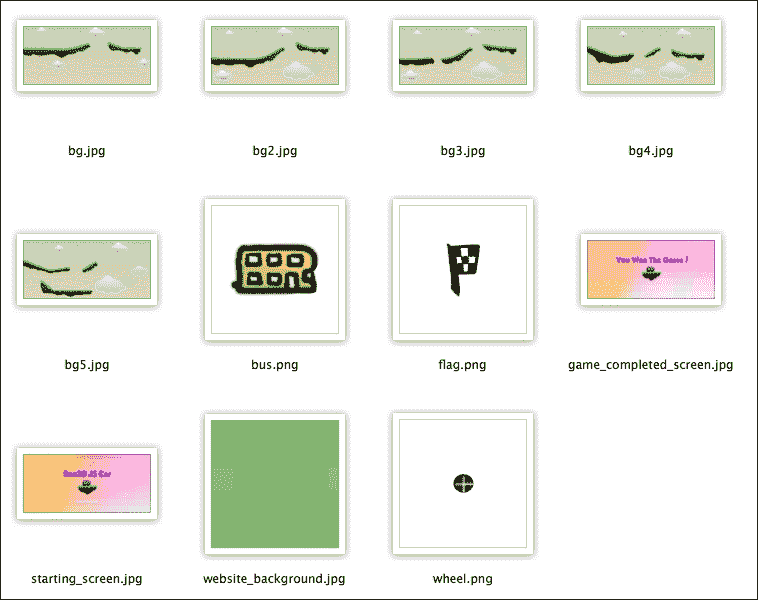

1.  打开`index.html`文件，将画布元素替换为以下标记。这创建了两个额外的游戏组件，名为`current level`和`fuel remaining`，并将游戏组件组合到一个`game-container` DIV 中：

    ```js
    <section id="game-container">
        <canvas id="game" width='1300' height='600' class="startscreen"></canvas>

       <div id="fuel" class="progressbar">
          <div class="fuel-value" style="width: 100%;"></div>
       </div>

       <div id="level"></div>
    </section>
    ```

1.  接下来，我们将从代码包中复制`cargame.css`文件。这个文件包含了游戏的一些类样式定义。应用了新的样式表后，游戏应该看起来与以下屏幕截图中的相似：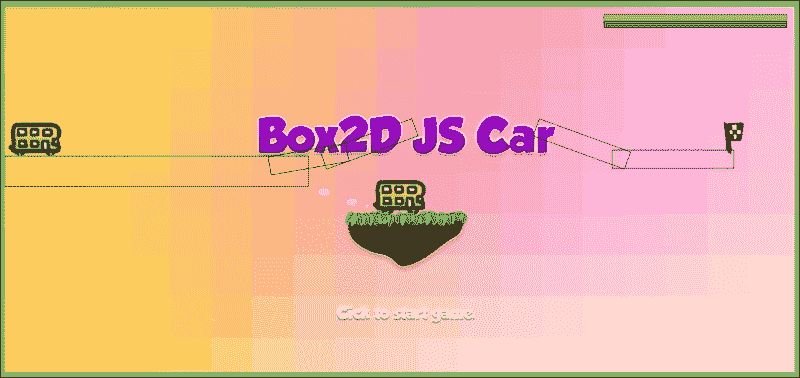

1.  现在，我们将继续到 JavaScript 部分。打开`html5games.box2dcargame.js`文件。

1.  更新`carGame`对象声明，添加以下附加变量：

    ```js
    var carGame = {
       // game state constant
       STATE_STARTING_SCREEN : 1,
       STATE_PLAYING : 2,
       STATE_GAMEOVER_SCREEN : 3,

       state : 0,

       fuel: 0,
       fuelMax: 0,

       currentLevel: 0
    }
    ```

1.  现在，我们有起始屏幕。不是一次性开始游戏，而是页面加载。我们将显示起始屏幕并等待玩家点击游戏画布。将以下逻辑添加到`initGame`函数中：

    ```js
    // set the game state as "starting screen"
    carGame.state = carGame.STATE_STARTING_SCREEN;

    // start the game when clicking anywhere in starting screen
    $('#game').click(function(){
       if (carGame.state === carGame.STATE_STARTING_SCREEN) {
          // change the state to playing.
          carGame.state = carGame.STATE_PLAYING;

          // start new game
          restartGame(carGame.currentLevel);
       }
    });
    ```

1.  接下来，我们需要处理玩家通过所有级别后的游戏获胜屏幕。在获胜旗帜碰撞检查逻辑中，我们使用以下逻辑来确定是否显示下一级或结束屏幕。在文件中找到`console.log("Level Passed!");`代码，并将`restartGame`函数调用替换为以下代码：

    ```js
    if (cn.IsTouching()) {
      console.log("Level Passed!");

      if (carGame.currentLevel < carGame.levels.length - 1) {
        restartGame(carGame.currentLevel+1);
      } else {
        // show game over screen
        $('#game').removeClass().addClass('gamebg_won');

        // clear the physics world
        carGame.world = createWorld();
      }
    }
    ```

1.  然后，我们将处理游戏背景。我们为每个级别的设置准备了每个游戏背景。我们将在`restartGame`函数中切换背景，这相当于重建世界：

    ```js
    $("#level").html("Level " + (level+1));

    // change the background image to fit the level
    $('#game').removeClass().addClass('gamebg-level'+level);
    ```

1.  现在有了游戏图形，我们不再需要物理对象轮廓绘制。我们可以通过将`shouldDrawDebug`对象设置为`false`来关闭调试绘制：

    ```js
    var shouldDrawDebug = false;
    ```

1.  最后，让我们添加一些约束。记住，在我们的级别数据中，我们包括了一个神秘的燃料数据，用于汽车。这是汽车燃料含量的指示器。我们将使用这个燃料来限制玩家的输入。每次对汽车施加力时，燃料都会减少。一旦燃料耗尽，玩家就不能再施加任何额外的力。这种限制使得游戏更有趣。

1.  使用以下逻辑更新箭头键的`keydown`函数。新的代码在这里突出显示：

    ```js
    switch(e.keyCode) {
      case 39: // right arrow key to apply force towards right
        if (carGame.fuel > 0) {
          var force = new b2Vec2(300, 0);
          carGame.car.ApplyForce(force, carGame.car.GetWorldCenter());
          carGame.fuel -= 1;
          $(".fuel-value").width(carGame.fuel/carGame.fuelMax * 100 +'%');
        }
        return false;
        break;
      case 37: // left arrow key to apply force towards left
        if (carGame.fuel > 0) {
          var force = new b2Vec2(-300, 0);
          carGame.car.ApplyForce(force, carGame.car.GetWorldCenter());
          carGame.fuel -= 1;
          $(".fuel-value").width(carGame.fuel/carGame.fuelMax * 100 +'%');
        }
        return false;
        break;
      case 82: // r key to restart the game
        restartGame(carGame.currentLevel);
        break;
    }
    ```

1.  此外，在重启游戏函数中的创建汽车逻辑中，我们初始化燃料如下：

    ```js
    // create car
    if (obj.type === "car") {
       carGame.car = createCarAt(obj.x,obj.y);
     carGame.fuel = obj.fuel;
     carGame.fuelMax = obj.fuel;
     $(".fuel-value").width('100%');
       continue;
    }
    ```

1.  现在，在浏览器中运行游戏。我们应该得到五个图形级别。以下截图显示了最后四个级别的样子：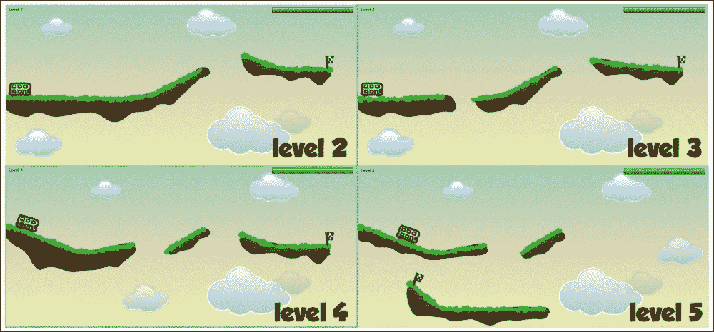

1.  通过所有级别后，我们将得到以下获胜屏幕：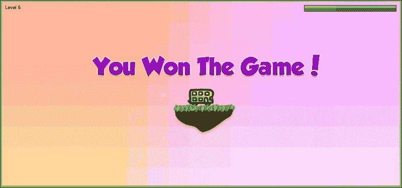

## *发生了什么？*

我们刚刚用更多图形装饰了我们的游戏。我们还绘制了每个级别的环境，一个背景图像。以下截图说明了视觉地面如何表示逻辑物理盒子。与汽车和获胜旗帜不同，地面图形与物理地面无关。这只是一个背景图像，其中的图形位于它们相应的位置。我们可以使用这种方法，因为那些逻辑盒子永远不会移动：

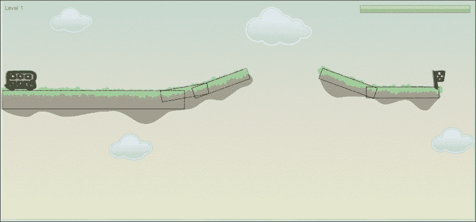

然后，我们可以为每个级别准备几个 CSS 样式，样式名称中包含级别编号，例如`.gamebg-level1`和`.gamebg-level2`。通过将每个类与每个级别背景相关联，我们可以使用以下代码在切换级别时更改背景：

```js
$('#game').removeClass().addClassddClass('gamebg-level'+level);
```

## 在施加力时添加燃料以添加约束

现在，我们通过提供有限的燃料来限制玩家的输入。当玩家对汽车施加力时，燃料会减少。我们使用了以下 `keydown` 逻辑来减少燃料并防止汽车燃料耗尽时施加额外的力：

```js
case 39: 
  if (carGame.fuel > 0) {
    var force = new b2Vec2(300, 0);
    carGame.car.ApplyForce(force, carGame.car.GetCenterPosition());
    carGame.fuel -= 1;
    $(".fuel-value").width(carGame.fuel/carGame.fuelMax * 100 +'%');
  }
```

## 以 CSS3 进度条的形式呈现剩余燃料

在我们的游戏中，我们将剩余燃料以进度条的形式呈现。进度条实际上是一个嵌套在另一个 DIV 中的 DIV。以下标记显示了进度条的结构。外部 DIV 定义了最大值，内部 DIV 显示实际值：

```js
<div id="fuel" class="progressbar">
   <div class="fuel-value" style="width: 100%;"></div>
</div>
```

以下截图说明了进度条的结构：

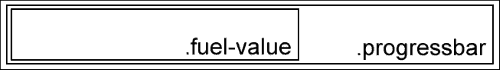

使用这种结构，我们可以通过设置宽度为百分比值来显示具体的进度。我们使用以下代码根据燃料的百分比更新进度条：

```js
$(".fuel-value").width(carGame.fuel/carGame.fuelMax * 100 +'%');
```

这是设置进度条并使用宽度样式控制它的基本逻辑。

# 为平板电脑添加触摸支持

我们在 第六章 *为您的游戏添加音效* 中添加了触摸支持。在本游戏中，我们将添加触摸支持以使其可在平板电脑上玩。

# 行动时间 – 添加触摸支持

执行以下步骤以使我们的游戏在具有触摸输入的平板电脑上运行：

1.  在 `index.html` 文件中，我们在 `#game-container` 结束前添加以下触摸控制：

    ```js
    <div id="left-button" class="touch-control"></div>
    <div id="right-button" class="touch-control"></div>
    <div id="restart-button" class="touch-control">Restart</div>
    ```

1.  我们还可以在 `<head>` 标签内添加一个 `<meta>` 标签来控制视口，使游戏适应 iPad 的 1024 像素宽度。

    ```js
    <meta name="viewport" content="width=device-width, initial-scale=0.78, minimum-scale=0.78, maximum-scale=0.78">
    ```

1.  对于这些控制，我们添加了一些基本样式来定位它们。为此，将以下代码追加到 `cargame.css` 文件中：

    ```js
    .touch-control {
      position: absolute;
    }
    #left-button {
      top: 0;
      left: 0;
      width: 50%;
      height: 100%;
    }
    #right-button {
      top: 0;
      right: 0;
      width: 50%;
      height: 100%;
    }
    #restart-button {
      top: 0;
      left: 50%;
      left: calc( 50% - 50px );
      width: 100px;
      height: 50px;
      text-align: center;
      line-height: 50px;
    }
    ```

1.  现在，我们转到 `box2dcargame.js` 文件，并添加一个名为 `handleTouchInputs()` 的函数：

    ```js
    function handleTouchInputs() {
      // Touch support
      if (!window.Touch) {
        $('.touch-control').hide();
      } else {
        $('#right-button').bind('touchstart', function(){
          if (carGame.state === carGame.STATE_STARTING_SCREEN) {
            // change the state to playing.
            carGame.state = carGame.STATE_PLAYING;

            // start new game
            restartGame(carGame.currentLevel);
          } else {
            carGame.isRightButtonActive = true;
          }
        });
        $('#left-button').bind('touchstart', function(){
          if (carGame.state === carGame.STATE_STARTING_SCREEN) {
            // change the state to playing.
            carGame.state = carGame.STATE_PLAYING;

            // start new game
            restartGame(carGame.currentLevel);
          } else {
            carGame.isLeftButtonActive = true;
          }
        });
        $('#right-button').bind('touchend', function() {
          carGame.isRightButtonActive = false;
        });
        $('#left-button').bind('touchend', function() {
          carGame.isLeftButtonActive = false;
        });
        $('#restart-button').bind('touchstart', function(){
          restartGame(carGame.currentLevel);
        })
      }
    }
    ```

1.  我们在 `initGame` 函数中调用 `handleTouchInputs` 函数：

    ```js
    handleTouchInputs();
    ```

1.  我们持续施加力直到触摸更新事件。我们可以稍微调整值以适应平板电脑。为此，在现有的 `updateWorld` 函数末尾添加以下代码：

    ```js
    // apply force based on the touch event
    if (carGame.isRightButtonActive) {
      if (carGame.fuel > 0) {
        var force = new b2Vec2(50, 0);
        carGame.car.ApplyForce(force, carGame.car.GetWorldCenter());
        carGame.fuel -= 0.1;
        $(".fuel-value").width(carGame.fuel/carGame.fuelMax * 100 +'%');
      }
    } else if (carGame.isLeftButtonActive) {
      if (carGame.fuel > 0) {
        var force = new b2Vec2(-50, 0);
        carGame.car.ApplyForce(force, carGame.car.GetWorldCenter());
        carGame.fuel -= 0.1;
        $(".fuel-value").width(carGame.fuel/carGame.fuelMax * 100 +'%');
      }
    }
    ```

1.  保存所有文件，并在平板电脑上运行游戏，例如 iPad 或 Android，我们应该能够通过按下游戏的左右两侧来控制汽车。我们还可以通过按下重启按钮来重新开始关卡。

## *发生了什么？*

我们刚刚为我们的游戏添加了触摸支持，使其可在平板电脑上玩。我们为左右力创建了两个触摸区域。我们还创建了一个仅在触摸设备上可见的重启按钮：

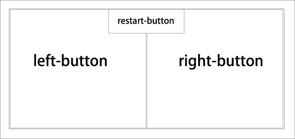

我们监听这些按钮上的 `touchstart` 和 `touchend` 事件。`touchstart` 事件与持续触发事件的 `keydown` 事件不同。我们需要一个布尔值来知道触摸是否开始，并跟踪直到结束。在触摸按下期间，我们在 `updateWorld` 方法中施加力。频率不同，因此我们调整了力的值和燃料消耗，使其在平板电脑上运行得更好。

### 控制 viewport 缩放

当设计移动网页时，我们经常使用 viewport 来告诉浏览器使用设备宽度作为网页的 viewport 宽度：

```js
<meta name="viewport" content="width=device-width, initial-scale=1">
```

在游戏中，尤其是需要频繁点击的游戏中，我们可能想要通过设置相同的值到最小缩放和最大缩放来固定缩放功能。此外，我们可以控制缩放值来调整游戏以适应平板设备。

```js
<meta name="viewport" content="width=device-width, initial-scale=0.78, minimum-scale=0.78, maximum-scale=0.78">
```

### 特定于触摸的按钮

平板和移动设备上没有键盘。我们必须为这些设备创建屏幕输入。在这个游戏示例中，我们创建了三个屏幕按钮：左键、右键和重新开始按钮。我们通过检查`window.Touch`的可用性来隐藏这些按钮：

```js
if (!window.Touch) {
  $('.touch-control').hide();
}
```

# 摘要

在本章中，你学习了如何使用 Box2D 物理引擎在画布中创建汽车冒险游戏。

具体来说，我们使用 JavaScript 物理引擎设置游戏。然后，我们在物理世界中创建了静态和动态物体。我们通过使用关节来约束物体和车轮来设置汽车。我们通过向汽车添加力来控制汽车，通过键盘输入。最后，我们在物理世界中添加碰撞来决定游戏结束和升级。我们现在已经学会了如何使用 Box2D 物理库来创建基于画布的物理游戏。

在下一章中，我们将讨论不同的分销渠道并将我们的游戏放入原生 Mac 应用程序中。
