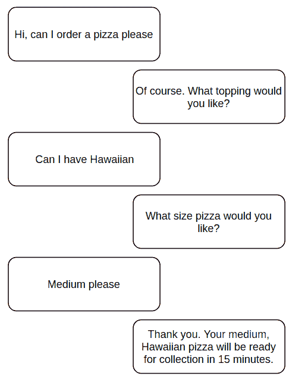
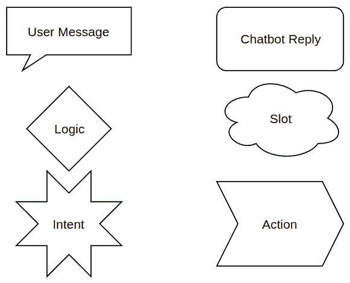
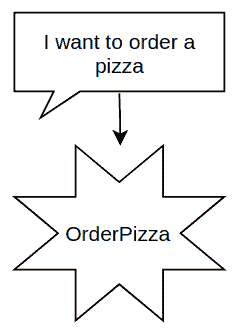
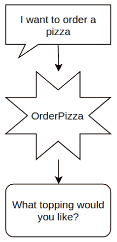
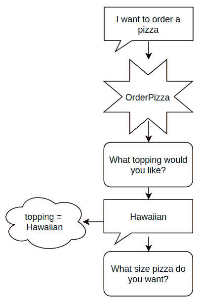
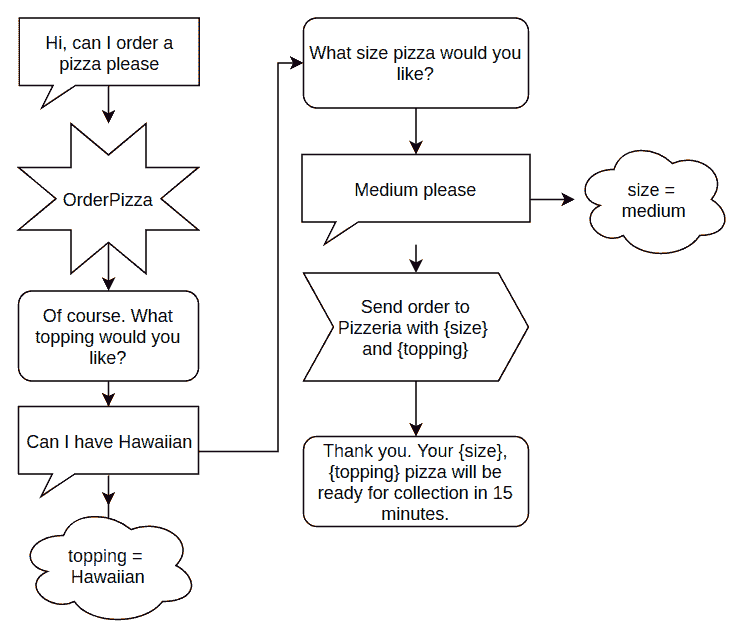

# 第一章：理解聊天机器人

要使用 Alexa 或 Lex 创建成功的聊天机器人，你首先需要了解构成聊天机器人的组件。然后可以使用这些部分来创建对话图和流程图，帮助可视化用户在对话中的路径。拥有用户对话的这种地图可以使构建聊天机器人变得更容易、更快。

在本章的结尾，我们还将介绍 Alexa 和 Lex，并探讨它们的相似之处和不同之处。我们还将快速查看它们的一些用例。

本章将解释以下主题：

+   介绍聊天机器人

+   设计对话流程图

+   最佳实践

+   亚马逊 Alexa 和亚马逊 Lex

# 什么是聊天机器人？

聊天机器人是一种以更人性化的方式与用户互动的新方法，通过对话。这与现有方法大相径庭，现有方法提供的交互或个性化非常有限。

聊天机器人可以是基于语音或文本的交互，这使得它们可以被集成到现有的网站和应用程序中，或者用于电话和虚拟助手。

最近，随着亚马逊 Echo 和 Google Home 等产品的推出，以及大量 Facebook Messenger 聊天机器人的出现，它们受到了广泛关注。这些技术进步使得你可以在不查看屏幕的情况下检查天气或订购披萨，或者在没有等待与呼叫中心交谈的情况下获取个性化信息。

# 什么是聊天机器人？

聊天机器人在与用户互动的方式上非常不同，因此其工作原理也非常不同。聊天机器人主要有三个组成部分：**意图**、**插槽**和**utterances**。

# 意图

意图是聊天机器人的最重要部分。它们是聊天机器人可以处理的任务或对话。它们被称为意图，因为它们是用户打算做的事情。

意图可以从非常简单到极其复杂。一个基本的意图可能只是`SayHello`，它只是对用户说“Hi”。一个更复杂的意图可能是预订假期、选择并购买一双鞋或者订购披萨。它们可以被设计得像你的想象力一样复杂。

当用户说出其中一个**示例 utterances**时，它们就会被启动或触发。示例 utterances 是一系列用户可能在尝试启动意图时可能说出的单词或短语。每个意图可以有大量的示例 utterances。在`SayHello`示例中，它们可能是“Hello chatbot”、“Hey there chatbot”或者仅仅是“Hi”。

# 插槽

为了使聊天机器人真正有用，它必须能够收集有关用户请求的详细信息。如果你想要订购披萨，聊天机器人需要知道你想要什么配料，你想要什么风味的底料，以及你希望它送到哪里。这些信息被收集并存储在插槽中。

槽位被设计成只接受某些类型的信息。如果你试图了解他们是否想要大、中或小披萨，如果他们可以输入任何随机信息，那么这将不会很有用。定义可以存储在某个槽位中的信息被称为创建**槽类型**。

要利用在槽位中收集到的信息，它们可以在聊天机器人逻辑的下一阶段被访问。这可能只是简单地表示“您已订购一个*大* *夏威夷*披萨”，其中大小和配料正是用户之前订购的。

# 话语

话语是一个已经被说出的词或短语。这对于聊天机器人来说至关重要，因为这是用户与聊天机器人交互的方式。

这些话语可以触发用户试图访问的意图，它们也可以用来获取填充槽位所需的精确信息。

# 设计对话流程

现在我们已经了解了构成聊天机器人的组件，我们可以开始设计我们希望聊天机器人处理的对话。现在设计对话使得可视化聊天机器人的工作方式变得容易得多，从而使得构建更加容易和快速。以这种方式设计对话使得它们易于理解，对于不能编写代码的人来说，这是一个创建聊天机器人的伟大工具。

这种设计方法适用于语音或文本聊天机器人；只需想象文本框为气泡即可。

# 从完美的对话图开始

每件事都需要有一个起点，所以最好是完美的。这个阶段的目标是有一个基本的对话图，我们稍后会将其扩展为详细的流程图。

要做到这一点，你需要考虑与用户进行完美对话的内容。首先写下用户会说什么，以及机器人将如何回应。以下是一个订购披萨的例子：



订单披萨对话

这可以通过许多方式完成：使用流程图软件、使用两部手机或两个消息账户，或者简单地用笔和纸。目标是理解聊天机器人将如何与用户互动以及用户可能说些什么。

# 对话流程图

现在我们已经有一个基本的对话图，我们需要将其转换为流程图。流程图在几个关键方面与对话图不同：

+   流程图的每一部分都有自己的符号，这使得理解每个阶段的状况变得容易。

+   流程图不仅仅包含对话。它还描述了幕后发生的逻辑、信息和流程。

+   流程图不是线性的。这意味着它们可以描述许多对话，其中用户说不同的话。

为了正确描述我们的聊天机器人，我们需要为对话的每个部分都有一个符号。首先，我们将使用六个，但稍后可以添加更多符号：



流程图符号

为了创建我们的流程图，我们将使用流程图软件。我们想要使用流程图软件而不是普通文档甚至手工制作的原因有几个：

+   它们很容易编辑。在我们通过这本书的工作过程中，我们将改变对话流程的阶段和话语及回复的文本。每次更改都要重新绘制图表将会非常耗时。

+   这是制作流程图最简单的方法。符号会自动对齐，并且易于编辑和修改。在 Word 中制作流程图将会花费更多的时间。

在本书的所有示例中，我们将使用[www.draw.io](https://www.draw.io/)，但如果你有更喜欢的其他流程图软件，那也可以。我们使用 draw.io，因为它免费、在线且易于使用。

# 创建对话流程图

现在我们已经了解了对话流程图的组成部分，让我们来创建一个吧。我们将使用之前用过的相同的比萨订购对话。

从对话的起始点开始。为用户的第一次话语创建一个符号。这条来自用户的第一条信息非常重要，因为它将触发一个意图：



话语触发意图

现在已经触发了`OrderPizza`意图，我们的聊天机器人可以开始询问用户他们想要订购的比萨。我们将首先询问他们想要什么配料，他们回复“夏威夷”：



开始意图

之后，我们想要记住他们选择了夏威夷作为配料，因此我们需要将这个信息存储为一个槽位。我们将信息存储在槽位名称下，在这种情况下，它将是**topping = Hawaiian**。除了存储槽位，我们还需要继续对话，询问他们想要多大份的比萨：



存储槽位值

在收到用户的回复后，我们将大小存储在槽位中，并继续到下一个阶段。我们重复询问、回答、槽位的过程，以确定用户想要的比萨大小。

现在我们已经拥有了所有需要的信息，我们需要告诉比萨店有人订购了一份中份夏威夷比萨。为此，我们将使用动作符号，并确保包括所需的槽位。当我们将槽位信息包含在任何内容中时，通常将其写成括在花括号中的槽位名称。

除了告诉比萨店订单信息，我们还需要让用户知道他们的订单已经下单，并告诉他们何时取货。同样，我们使用括在花括号中的槽位名称来定制包含槽位信息的消息：



完整的比萨订购流程图

# 用户故事

用户故事是聊天机器人设计和测试中的关键工具。它们是关于虚构用户的故事，包括他们的需求以及他们如何与你的机器人互动。当我们创建用户故事时，它需要尽可能接近真实用户。它们应该基于真实用户或可能使用你的聊天机器人的用户类型。如果你有希望将聊天机器人针对的目标客户，你可以创建数据驱动的用户故事。

要创建用户故事，首先描述用户以及他们为什么与你的机器人交谈。以下是一些披萨订购机器人的示例：

+   克里斯，一位 23 岁的实习生。他希望在手机上订购披萨，以便在下班回家的路上取。

+   克莱尔，一位 35 岁的银行经理。在看电视的同时使用 Alexa 订购披萨。

用户描述不需要非常长或复杂，但它们必须代表机器人将遇到的用户类型。

对于每个用户，请通过流程图模拟机器人与该用户对话。这样做的目的是在我们开始构建机器人之前测试你的流程图。如果你发现某个部分的对话不顺畅，现在修改它将节省你以后的时间。

对于像这样的简单例子，所有对话之间可能没有太大区别，但随着我们创建更复杂的流程图，用户故事将变得更加重要。

# 最佳实践

任何人都可以制作聊天机器人。经过一点练习，你可以在几小时内构建一个简单的机器人。构建这种机器人的问题是，随着它们的范围和复杂性的增长，它们很容易变得难以管理。简单的更改可能导致数小时甚至数天的错误修复，这可能会破坏你最终让聊天机器人工作时的喜悦。

为了避免与一个无序且复杂的聊天机器人一起工作的恐怖经历，有一些最佳实践。遵循这些实践将减少你以后的头痛，并允许你快速轻松地添加新功能。

# 处理错误

在用户与聊天机器人的整个对话过程中，有很多可能出现错误的地方。错误可能发生在语句没有被理解、API 返回错误或开发者的代码中存在错误时。每个错误都需要被捕捉并妥善处理。我们将在第四章“将你的 Alexa 技能连接到外部 API”中介绍如何使用`try`/`catch`和`to()`方法来捕捉这些错误。

# 错过的语句

最常见的错误可能是当语句没有被理解或不是聊天机器人所期望的。这可能是因为用户输入错误，拼写错误，或者只是输入了你没有考虑到的响应。Alexa 和 Lex 都使用**自然语言理解**（**NLU**）来尝试减少拼写错误和不同响应的错误，但它们并不完美。

由于不理解用户的表述是一个如此常见的错误，Lex 和 Alexa 也都有系统来处理它们。这包括当聊天机器人不理解用户刚刚说了什么时可以发送给用户的失败短语。确保这一点设置正确，并且你要求用户再次尝试或选择不同的选项：


失败的表述

Alexa 和 Lex 还有一个功能，可以存储所有它无法理解表述的时间。使用这个列表，你可以添加更多样本表述来帮助聊天机器人理解更多。定期这样做可以极大地提高用户满意度，同时也有助于你了解用户如何与你的机器人互动。

# 外部 API

每次你处理代码之外的事情时，都存在出错的风险。这可能是一个第三方 API、你自己的 API，或者仅仅是向数据库的查询。你应该始终编写这些请求，以便如果请求返回错误，你能完全处理它。这意味着记录错误是什么以及它发生在哪里，并确保在发生错误时聊天机器人仍然可以工作。

确保在发生错误时聊天机器人仍然可以工作是非常重要的，因为没有人愿意和一个在对话中途停止说话的聊天机器人交谈。为了确保这种情况不会发生，你有三个选择：为每个外部调用创建错误消息，让所有错误流到一个非常低级的错误处理器，该处理器发送一个通用的“我们遇到了错误”消息，或者两者的组合。想法是使用自定义消息来处理可能发生的每个错误，但随着你的聊天机器人变得更大、更复杂，这可能会变得非常耗时。

处理错误的有效方法之一是创建一个低级错误处理器，除非提供了特定的错误消息，否则传递一个通用的错误消息。这让你在需要时能够确切地让用户知道出了什么问题，但同时也节省了你创建大量类似错误消息的时间：

```js
try {
    let result = AccessPeopleAPI();
    if (result === null || typeof result !== 'number'){
        throw 'I've failed to get the number of people';
    }
    return 'We have ' + result + ' people in the building';
} catch (error) {
    console.log(error || 'The system has had an error');
    return error || "Unfortunately I've had an error";
}
```

# 代码中的错误

没有开发者愿意承认他们的代码中存在错误，但如果你创建的不仅仅是简单的聊天机器人，那么很可能会有。处理这个问题有不同的方法，从为每个函数编写测试，到彻底的端到端测试，到使用`try`/`catch`将一切包裹起来。这本书将让你决定如何处理这些错误，但期望代码无错误是一个非常危险的道路。

无论你想要如何阻止错误进入你的代码，你都需要在遇到它们时处理它们。这就是为什么拥有一个低级错误处理器也可能很有用。你可以用它来捕获代码中发生的错误，就像你处理外部 API 的错误一样。

# 语调

聊天机器人最棒的地方之一是它们具有对话性和更接近人类的感受。正因为如此，你需要给你的机器人赋予一个个性，并且需要根据聊天机器人的目的和与之互动的用户来调整这个个性。

拥有一个使用俚语的银行聊天机器人可能会让用户对聊天机器人的信任度降低，而拥有一个使用大量非常正式或过时语言的服装销售聊天机器人可能同样令人反感。

尽量设计聊天机器人使用的语言与您的品牌形象保持一致。如果您没有品牌形象，可以通过采访您的员工和客户来构建一个。利用这些采访创建一个与客户紧密相关的人物（类似于用户故事）。

# 确定合适的用例

聊天机器人很棒！能够为用户提供一种全新的交互方式是一种非常美妙的感觉，以至于你想要为每一件事都制作一个聊天机器人。不幸的是，聊天机器人并不适合所有情况，在实施之前需要仔细考虑一些事情。你需要考虑用户是否愿意与聊天机器人讨论某些事情，以及聊天机器人将如何进行回应。

考虑机器人将如何进行交流对于基于语音的聊天机器人尤为重要，因为聊天机器人所说的每一句话都将通过扬声器发送给周围的人听到。这对访问您的银行信息、阅读您的电子邮件或处理任何其他个人信息的人工智能聊天机器人来说可能会很糟糕。在设计您的 Alexa 对话时，问问自己你是否希望 Alexa 告诉你所有的朋友和同事你的医生预约结果，或者朗读你伴侣关于他们当晚计划的电子邮件。

# 设计用于交付方式的信息

由于信息交付方式与现有方式（电子邮件、网站和印刷媒体）非常不同，你还需要考虑用户会有什么感受。例如，当创建一个报纸聊天机器人时，让 Alexa 花 15 分钟读完整份报纸或 Lex 发送一大块文本可能并不太友好。相反，你可以将信息分解成更小的部分，或者提供信息的简要概述。

在提供优质信息和说得太多的聊天机器人之间可能有一条很细的界限。确保信息量是以适合最终交付方式的方式设计的。

# 亚马逊 Alexa 和 Lex

Alexa 和 Lex 是亚马逊开发的一对工具，旨在改变用户与技术互动的方式。它们是平台，允许开发者创建极其强大的对话界面，而无需深入研究深度学习、自然语言处理或语音识别。

它们是 **Amazon Web Services** （**AWS**） 组的一部分，因此与其它服务配合得非常好，使开发过程更加顺畅和一致。

Alexa 和 Lex 之间的主要区别在于，Alexa 平台允许开发者为 Alexa 兼容设备创建技能，而 Lex 允许开发者创建通用的文本或语音聊天机器人。

# Amazon Alexa

Amazon Alexa 是一种基于语音的聊天机器人，它是亚马逊 Echo 系列产品的智能大脑。用户可以通过向他们的 Alexa 账户添加 **技能** 来定制他们的 Echo 体验，就像在智能手机上添加应用程序一样。这些技能可以从 Alexa 技能商店下载，有数千种可供选择。

与应用程序类似，每个这些技能都设计用来执行单一任务，无论是引导你烹饪食谱，指导你完成早晨的锻炼，还是仅仅讲笑话。

Alexa 于 2014 年 11 月发布，并越来越受欢迎。到 2017 年底，亚马逊已经售出了数千万台与 Alexa 连接的设备。这使得到 2018 年 2 月，Alexa 设备在虚拟助手市场中占据了 55% 的份额。

# Amazon Lex

Amazon Lex 是一种聊天机器人服务，允许开发者创建基于文本或语音的聊天机器人，利用亚马逊开发的深度学习、自然语言理解和语音识别的惊人力量。Lex 与 Alexa 的不同之处在于它可以集成到不同的设备和服务中。

Lex 最常被用作基于文本的聊天机器人。用户与基于文本的聊天互动的方式有很多种，Lex 可以与其中很多种集成。开发者可以通过 Lex 平台内置的集成创建 Facebook Messenger 机器人、Slack 机器人、Kik 机器人和 Twilio 短信机器人。

Lex 还可以通过 AWS-SDK 触发，这意味着它可以放在端点后面。这意味着开发者可以设置一个系统，他们向 API 发送消息，然后从 Lex 获取响应。这使您可以从几乎任何系统中发送消息到 Lex。这可以用来在网站上创建聊天窗口，在几乎任何消息服务上创建聊天机器人，或者将其与任何可以连接到互联网的系统集成。

使用 Amazon Transcribe 进行语音识别，您可以创建一个与 Alexa 非常相似的系统。这已经在呼叫中心中被非常有效地使用，允许客户与虚拟服务代表交谈，而不是仅仅等待有人类服务代表可用。这意味着许多呼叫者可以在不与人类交谈的情况下获得他们所需的信息。这意味着如果机器人可以解决你的问题，可以减少获得答案的时间，同时减少通过呼叫中心的人数，减少通话等待时间。

# 摘要

在本章中，我们学习了聊天机器人的组成部分——意图、槽位和话语，以及它们各自扮演的角色。

接下来，我们学习了如何设计对话流程，从理想的对话开始，将其转换为对话流程图。使用流程图软件，我们创建了对话流程图，以帮助可视化我们的聊天机器人如何与用户互动。

我们讨论了创建聊天机器人的最佳实践，从处理错误到设计对话以在聊天机器人上良好工作，从语气到好的聊天机器人用例。

本章的最后部分介绍了 Amazon Alexa 和 Amazon Lex。我们了解了这两种类型聊天机器人的相似之处和不同之处，以及它们的一些背景信息。

# 问题

1.  聊天机器人的三个主要组成部分是什么？

1.  列出两个 Alexa 和 Amazon Lex 共有的特点。

1.  列出 Alexa 和 Amazon Lex 之间的两个不同点。

1.  设计对话流程时，你应该从哪里开始？

1.  “语气”是什么意思？

1.  聊天机器人中可能发生的三种主要错误类型是什么？
