# 第三章：创建您的第一个 Alexa 技能

本章将向您介绍构建 Alexa 技能所需的过程，我们将一起创建我们的第一个 Alexa 技能。我们将学习如何构建和测试我们的技能，以确保一切正常工作。

然后，我们将创建第二个 Alexa 技能，它将与用户进行更真实的对话。这个技能将通过一系列问题收集一组信息，我们将使用这些信息来决定哪辆车最适合用户。这还将涵盖从远程存储访问数据。

本章最后我们将介绍部署您的技能，让您能够发布您的技能供全世界使用。

本章将涵盖以下内容：

+   创建我们的第一个 Alexa 技能

+   在 Lambda 中使用 Alexa SDK 处理来自 Alexa 的请求

+   测试您的 Lambda

+   创建一个使用存储在 S3 上的数据的更复杂的 Alexa 技能

+   部署您的 Alexa 技能

# 技术要求

在本章中，我们将为我们的技能创建一个 Lambda 函数，并使用我们在上一章中创建的本地开发设置来创建和部署它。

本章中使用的所有代码都可在[`bit.ly/chatbot-ch3`](http://bit.ly/chatbot-ch3)找到。

# Alexa 技能套件

要创建我们的第一个 Alexa 技能，我们将使用 Alexa 技能套件。搜索 Alexa 技能套件或访问[www.developer.amazon.com/alexa-skills-kit](https://developer.amazon.com/alexa-skills-kit)，你应该会看到一个带有“创建技能”或“开始技能”按钮的屏幕：

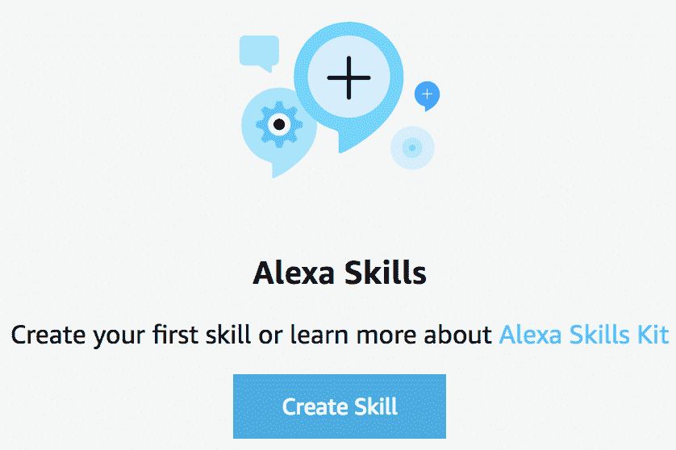

创建您的第一个技能

首先，给您的技能起一个名字。这应该是描述技能做什么的东西。为此，我们可以称之为`Hi`。点击下一步，您将能够选择技能的模型。我们想选择自定义，这样我们就可以创建我们想要的技能：

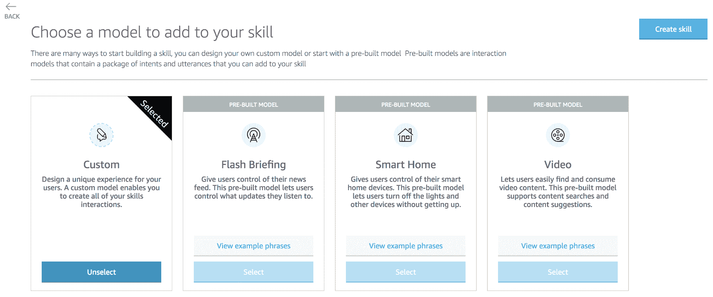

创建一个自定义技能

点击创建技能，一旦设置完成，您将进入 Alexa 技能构建页面。要开始，我们需要点击左侧菜单中的“触发名称”。这就是我们设置启动技能的命令的地方。我将为这个第一个技能使用`sams demo bot`。当你创建更大的技能时，花些时间思考你将使用什么作为你的触发短语，并大声练习说它是个好主意：

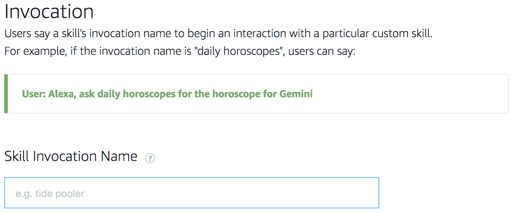

技能触发

现在我们可以开始我们的技能了，我们需要创建一个意图，以便我们的技能做些事情。点击左侧菜单中意图旁边的“添加”按钮来创建一个新的意图。在这里，您可以选择创建自定义意图或使用亚马逊库中的现有意图。亚马逊的大多数意图都与页面导航或音乐控制有关，所以我们选择自定义意图。

给你的意图起一个名字，描述它将要做什么。在我们的例子中，它是说`Hello`，所以这就是它的名字。点击创建自定义意图以开始编辑意图。

现在我们已经进入了`Hello`意图的意图窗口，我们需要添加一些语句。正如我们在第一章，“理解聊天机器人”中讨论的那样，这些是用户可能会说的以触发此意图的短语。对于这个意图，这些语句可能是`hi`、`hello`或`hey`：

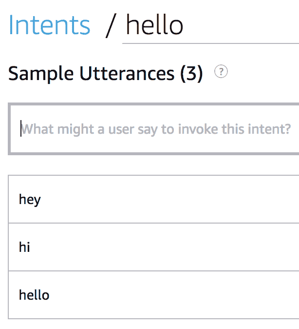

Hello 语句

我们已经完成了我们的第一个 Alexa 意图，所以我们需要保存并构建这个模型。在意图窗口的顶部是保存模型按钮和构建模型按钮，所以保存它然后构建它。构建模型有时需要一段时间，所以只需等待它完成。

# 创建 Lambda 来处理请求

要处理我们新的 Alexa 技能中的意图，我们需要创建一个 Lambda 函数。这将包含我们理解意图并向用户发送回复所需的所有逻辑。

要创建一个 Lambda，我们可以使用第二章，“AWS 和 Amazon CLI 入门”中描述的任何方法，但我们将使用我们的本地开发设置。导航到你的基本 Lambda 文件夹，创建一个名为`hello-alexa-skill`的新文件夹。在那个文件夹内，我们需要创建一个新的`index.js`文件并打开它以创建我们的函数。

首先，我们需要`require`在`alexa-sdk`中，这使得创建 Alexa 的逻辑变得容易很多：

```js
const Alexa = require('alexa-sdk');
```

因为我们需要它，我们还需要确保我们已经安装了它。在命令行界面中，导航到你的`hello-alexa-skill`文件夹，并运行`npm init`命令。这个过程会创建一个包信息，并允许你在文件夹中安装其他包。你可以边设置边设置值，或者通过按*Enter*使用默认值。一旦完成设置，你将有一个名为`package.json`的文件，其中包含此文件夹的配置。

要安装一个新的包并将其添加到我们的`package.json`文件中，我们可以运行`npm install --save package-name`命令。我们想安装`ask-sdk`，所以我们需要运行`npm install --save ask-sdk`。当这个命令运行时，你会看到一个新文件夹被创建，名为`node_modules`，其中包含所有已安装的 npm 包中的代码。

# 创建处理程序

当用户的意图被我们的某个语句触发时，我们需要在代码内部处理它。为此，我们创建一个对象，其中包含针对我们每个意图的方法。目前，我们只有一个`hello`意图，所以我们只需要创建一个处理程序：

```js
const helloHandler = {
    canHandle(handlerInput) {
        return handlerInput.requestEnvelope.request.type === 'IntentRequest' &&
            handlerInput.requestEnvelope.request.intent.name === 'hello';
    },
    handle(handlerInput) {
        const speechText = `Hello from Sam's new intent!`;

        return handlerInput.responseBuilder
            .speak(speechText)
            .getResponse();
    }
};
```

这个`hello`处理程序有两个部分：`canHandle`和`handle`。`canHandle`函数决定此处理程序是否可以处理此请求，如果可以则返回 true，如果不能则返回 false。这是通过请求类型和意图名称来计算的。如果两者匹配，则这是正确的处理程序。`handle`告诉 Alexa 如何响应。对于这个意图，我们只想让 Alexa 说出*来自 Sam 的新意图的问候！*然后获取用户的下一条消息。

现在我们需要将我们的`helloHandler`添加到我们的技能中。

我们可以通过将多个处理程序作为多个参数传递给`.addRequestHandlers`方法来添加多个处理程序：

```js
exports.handler = Alexa.SkillBuilders.custom()
    .addRequestHandlers(
        helloHandler)
    .lambda();
```

# 构建 和 配置 Lambda

现在函数已完成，我们可以使用我们在第二章，*AWS 和 Amazon CLI 入门*中制作的构建脚本。运行`./build.sh hello-alexa-skill`命令来创建我们的 Lambda 并将其部署到 AWS。

当构建脚本完成后，导航到 AWS 中的 Lambda 控制台，你现在应该能看到你新创建的函数。点击这个新的`hello-alexa-skill` Lambda 以打开编辑器。

要使此 Lambda 能够通过 Alexa 技能触发，我们需要将 Alexa 技能套件添加为触发器。这通过在设计师中的“添加触发器”下点击 Alexa 技能套件来完成，创建的 Alexa 技能套件触发器将出现在主设计师截图：

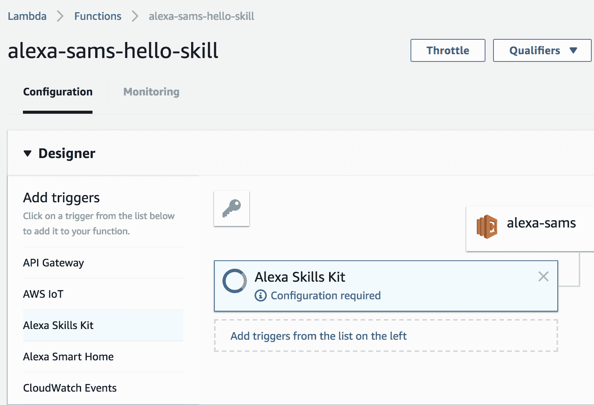

添加 Alexa 技能套件触发器

这也打开了 Alexa 技能套件配置部分。在这里，我们需要提供我们技能的 Alexa 应用 ID。要找到这个，请打开 Alexa 技能套件控制台，转到端点，并选择 Lambda。这将打开一些额外的详细信息和选项。我们的`Skill ID`是第一条信息，可以复制到剪贴板并插入到 Lambda 配置中：

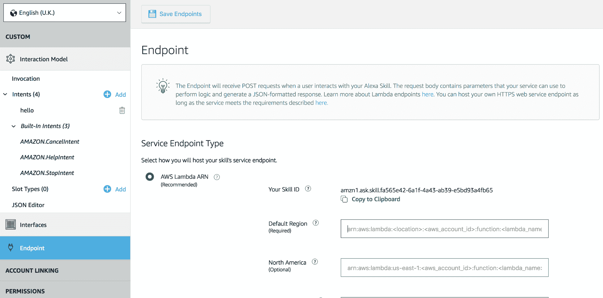

技能端点配置

在退出 Lambda 编辑器之前，我们应该在编辑器屏幕的右上角找到 ARN。复制它，因为我们将在配置技能的最后一步需要它。

# 完成技能配置

现在我们已经配置了 Lambda 并且 ARN 已经复制到剪贴板，我们可以回到我们的技能控制台。在端点下，我们可以在默认区域旁边的文本框中插入我们的 Lambda ARN。这确保了技能正在触发正确的 Lambda。您也可以为不同的区域创建不同的 Lambda，这样您可以为不同的人群提供特定的响应。

点击**保存端点**以保存您的技能，您已经完成了您的第一个 Alexa 技能。现在到了有趣的部分：尝试您的技能！

# 测试您的技能

现在我们已经构建和部署了新的 Alexa 技能，我们需要测试它看看是否工作。在页面顶部，有四个标签：构建、测试、发布和衡量。我们已经完成了构建，所以我们可以点击测试。点击页面顶部的切换按钮以启用此技能的测试：

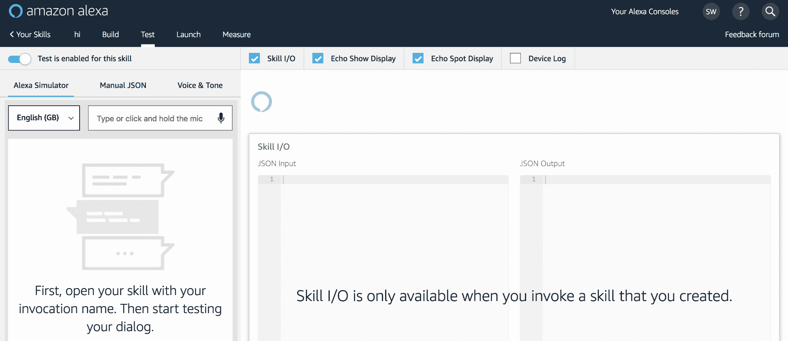

测试屏幕

要与你的新技能互动，你可以键入你的消息，或者点击并按住麦克风按钮，像与 Alexa 交谈一样与你的电脑交谈。要通过与它交谈来测试你的技能，你需要在笔记本电脑或 PC 上有一个麦克风，并且已经允许网页访问该麦克风。一旦你按下*Enter*或松开麦克风按钮，你将看到 Alexa 正在加载，然后她会根据你的意图回复并添加消息到聊天窗口。除了 Alexa 的回复外，你还可以在屏幕的技能 I/O 部分获得信息。如果意图被成功触发，你将得到发送到你的 Lambda 的完整 JSON 输入以及它给出的响应：

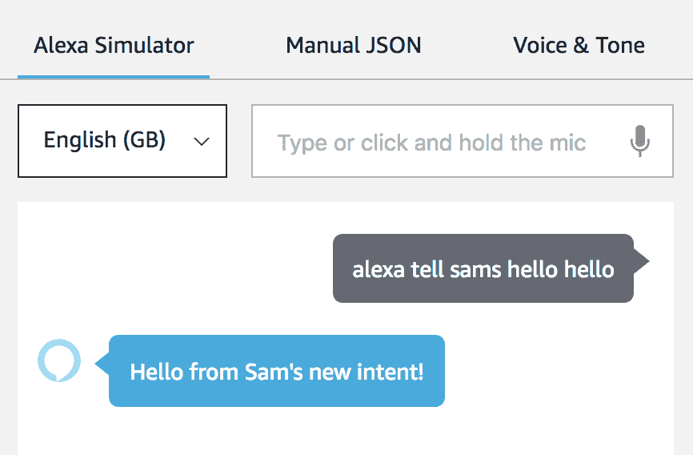

工作中的 hello 测试

这是你与你的机器人聊天时应得到的内容。确保你正在说正确的表述。

# 故障排除你的技能

在最初制作技能或 Lambda 时出现一些错误是非常正常的。关键是学习如何查找错误并修复它们。

在这本书的*附录*中有一个有用的指南，用于在 Lambdas 中查找错误。遵循那些流程，你应该很快就能让你的技能工作。

# 创建一个更有用的技能

当你说*hi*时，技能会回复*hello*，看到它工作是非常好的，但它并不很有用。接下来我们要制作的下一个技能将会更有用。

我们将创建一个建议购买车型并能够提供所建议车型详细信息的技能。

我们将使用的数据将包含三种车型尺寸、两个价格区间，以及小型车（车门数量）和大车型（手动或自动传动）的额外类别。

# 对话流程图

为了确保我们制作一个有效的聊天机器人，我们需要创建我们的对话流程图。这从我们的完美对话开始：

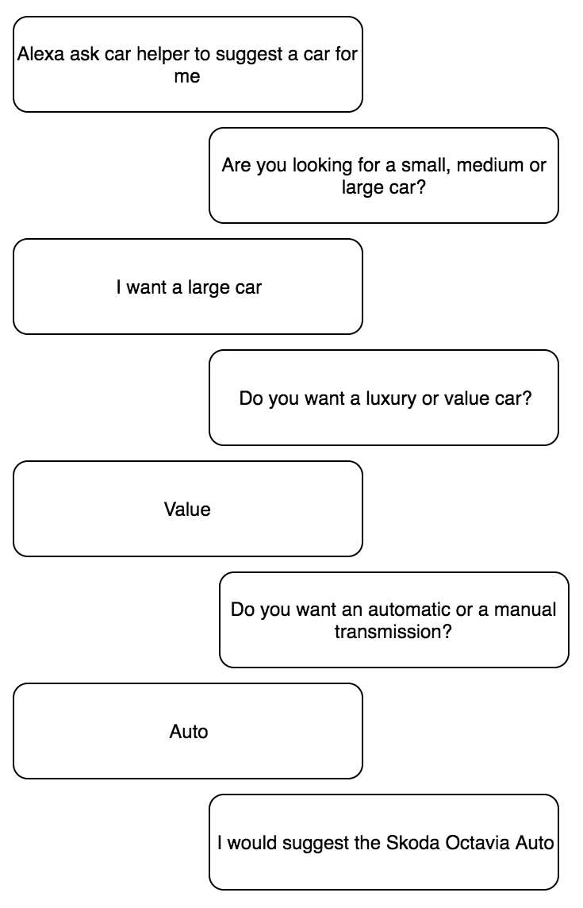

车辆对话

用户选择了一款大型车，因此，我们不得不询问他们想要的价格区间以及他们想要的传动类型。这种逻辑将在对话流程图中变得明显。我们可以为选择中型或小型车的用户创建类似的对话，其中所有对话都会略有不同。当根据用户之前所说的问题不同时，你可能会得到数百种不同的对话。这就是对话流程图真正变得有用之处。

在这个对话流程图中，我们有一个非常重要的*逻辑*组件。它检查用户是否选择小型、中型或大型车，并根据这一点引导对话。这意味着我们现在可以在一个图中展示许多不同的对话选项：

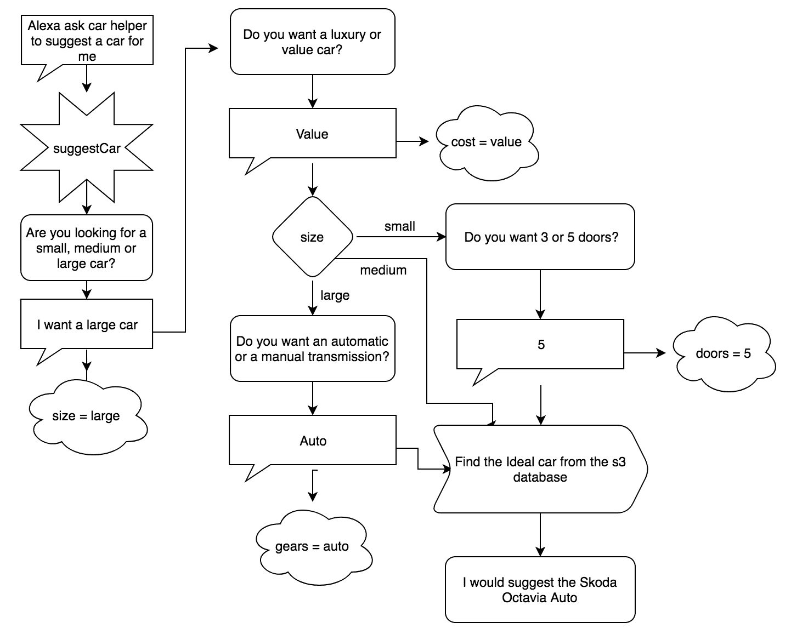

车辆流程图

在流程的末尾，我们还有一个查找功能，以找到适合用户的理想车型。这是本章后面将详细讨论的全新内容。

# 创建 Alexa 技能

我们以之前相同的方式开始创建这个技能。进入你的 Alexa 技能套件开发者控制台，选择创建技能。选择一个合适的名称，例如`carHelper`，并选择自定义技能。

现在我们再次进入技能控制台，我们需要从顶部开始设置唤醒词。输入`Car Helper`或类似的好记且容易说的名称。

# 创建意图

现在我们可以继续到技能的主要部分——添加意图。为此，我们添加一个新的意图，我们可以将其命名为`whichCar`，因为我们试图帮助用户选择*哪辆车*。

这个意图首先需要的是表述。添加用户可能会说的短语，如果他们想知道要买什么车：

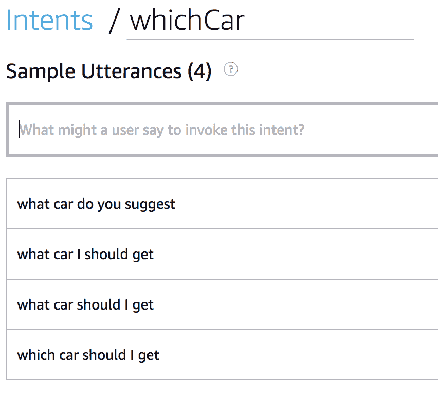

意图表述

# 内部槽位

这是我们需要开始使技能比上次更高级的地方。我们需要存储有关尺寸、成本、车门以及用户是否想要自动或手动变速器的信息。要添加一个新的槽位，滚动到意图槽位并点击创建新槽位。在这里，您可以命名您的槽位，然后通过按*Enter*键或点击+图标将其添加到意图中。为尺寸、成本、车门和变速器都这样做：

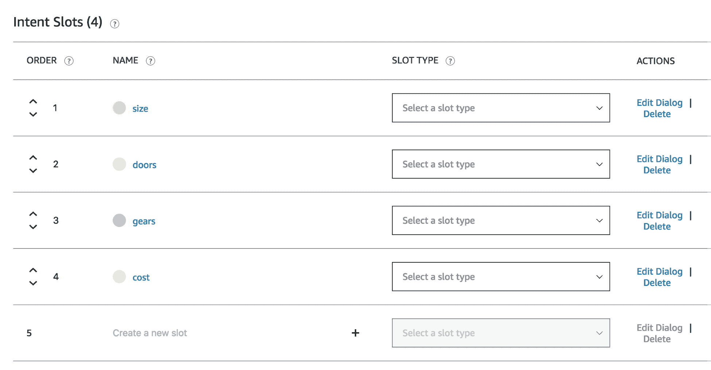

意图槽位

在我们能够将这些信息存储在这些槽位之前，我们需要设置它们的槽位类型。门的数量很简单，因为它只是一个数字，所以可以选择 AMAZON.NUMBER 作为其槽位类型。对于其他三个槽位，情况要复杂一些。

我们需要为这三个槽位创建自定义槽位类型。要创建一个新的槽位类型，点击槽位类型旁边的+号，这将带您进入添加槽位类型屏幕。输入您新槽位类型的名称，然后点击创建自定义槽位类型。我们将从一个名为`carSize`的槽位类型开始。

现在您已经进入了槽位类型编辑屏幕，您将在左侧菜单中看到您的新槽位类型。我们需要添加用户可以选择的三个值：`large`、`medium`和`small`。这样就可以正常工作，但如果用户说的是`big`而不是`large`怎么办？我们可以通过同义词捕获这些表述。我们可以输入尽可能多的新值，如果用户说了这些值，它们将被注册为主要值：

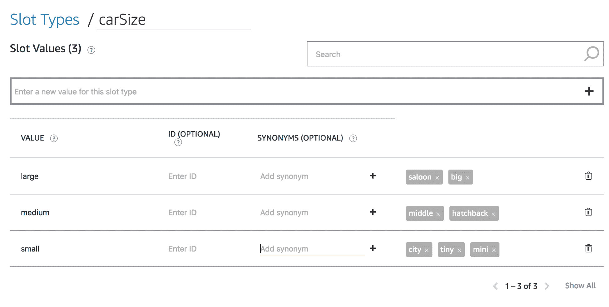

车辆尺寸槽位类型

这个过程需要重复进行，以创建一个具有`luxury`和`value`值的`carCost`槽位类型，以及一个具有`automatic`和`manual`值的`carGear`槽位类型。你还应该为这些值中的每一个添加同义词，以提高你机器人的灵活性。

现在我们已经创建了三个新的槽位类型，我们可以将它们添加到我们的槽位中。您现在应该在槽位类型下拉菜单中找到您的新槽位类型。确保每个槽位都有正确的槽位类型，我们几乎完成了技能编辑器。

我们知道用户总是会要求选择 `size` 和 `cost`，因此我们可以将这些槽位设置为必需。点击意图下的槽位名称将带您进入槽位配置屏幕，在那里我们有槽位类型、槽位填充和槽位确认部分。

在槽位填充部分，有一个切换按钮可以更改槽位为必需。当我们点击这个切换按钮时，它会为我们打开更多设置，以便我们进行配置。第一个是 Alexa 语音提示，我们可以输入一个提示，让用户正确填写槽位：

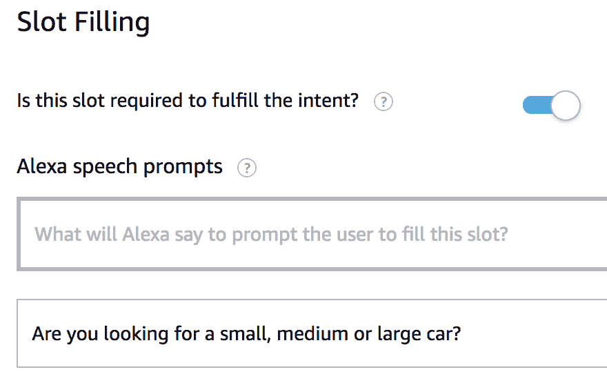

必需的槽位

我们还可以输入用户可能会回复的语句。第一个可以是大小，因此我们需要输入用大括号括起来的槽位名称。除了简单地说出“大”，用户还可能说“我想买一辆大车”或“我在找一辆中档车”。为了处理这些，我们输入这些语句，但将大和中改为 {size}：

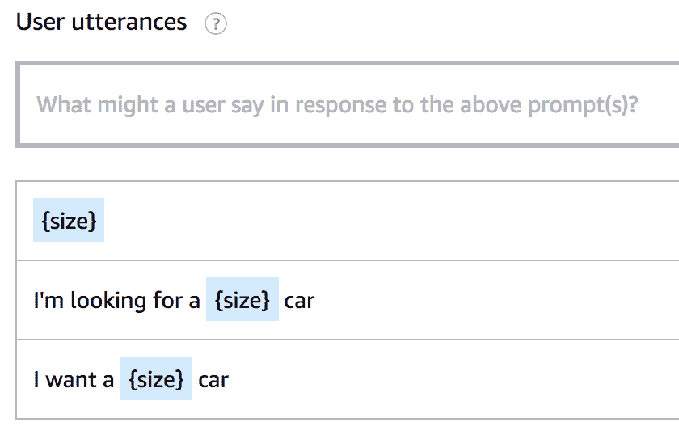

槽位语句

对于 *cost*，使用类似“我想买一辆 {cost} 的车”的语句进行相同的过程。如果您想的话，可以添加一些其他语句。

对于齿轮或车门，我们不需要这样做，因为它们不是每次对话都必须的，但我们将能够从我们的 Lambda 中请求它们。

一旦您创建了三个自定义槽位并将槽位类型添加到所有槽位中，您应该会有看起来像这样的意图槽位：

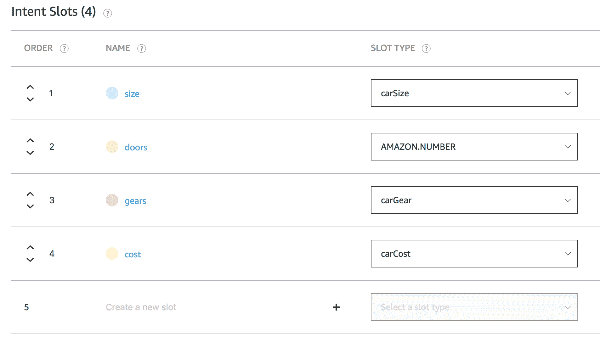

槽位类型完成

# 查找技能 ID

最后一件要做的事情是找到并复制技能 ID，以便我们可以在 Lambda 中使用它。在左侧菜单中选择“端点”，然后选择 AWS Lambda ARN 作为服务端点方法。这将暴露我们需要复制的技能 ID。

# 创建 Lambda

现在我们已经完成了控制台设置，我们可以构建一个 Lambda，它将处理技能背后的逻辑。

首先，在您的 `lambdas` 文件夹中创建一个新的文件夹，取一个合适的名字，例如 `carHelper`。在里面，我们需要创建一个 `index.js` 文件并运行 `npm init`。我们再次使用 `alexa-sdk`，因此需要运行 `npm install --save alexa-sdk`。

设置就绪后，我们可以开始编写 Lambda。我们可以从一个与我们在第一个函数中创建的 Lambda 非常相似的 Lambda 开始：

```js
const Alexa = require('alexa-sdk');

exports.handler = Alexa.SkillBuilders.custom()
    .addRequestHandlers()
    .lambda();
```

我们将要创建的第一个处理程序是用来处理启动请求的。这是当用户说类似“Alexa 启动车助手”的话时；我们的技能被启动，但没有触发任何意图。我们需要通过告诉他们如何触发我们的意图来帮助他们触发我们的意图之一。然后我们可以将其添加为 `.addRequestHandlers()` 中的第一个处理程序：

```js
const LaunchRequestHandler = {
    canHandle(handlerInput) {
        return handlerInput.requestEnvelope.request.type === 'LaunchRequest';
    },
    handle(handlerInput) {
        const speechText = `Hi there, I'm Car Helper. You can ask me to suggest a car for you.`;

        return handlerInput.responseBuilder
            .speak(speechText)
            .reprompt(speechText)
            .getResponse();
    }
};
```

# 处理 whichCar 意图

我们可以开始处理我们的`whichCar`意图。我们首先创建`WhichCarHandler`并将其添加到`addRequestHandlers()`中的列表：

```js
const WhichCarHandler = {
    canHandle(handlerInput) {
        return handlerInput.requestEnvelope.request.type === 'IntentRequest' &&
            handlerInput.requestEnvelope.request.intent.name === 'whichCar';
    },
    async handle(handlerInput) {}
}
```

在这个`handler`函数内部，我们首先需要做的是从事件中获取槽。我们可以使用`es6`解构来简化我们的代码：

```js
const slots = handlerInput.requestEnvelope.request.intent.slots;
const {size, cost, gears, doors} = slots;
```

现在我们有权访问所有四个槽变量。尽管我们创建了槽类型，但我们需要检查我们是否有有效的值。我们将从大小和成本开始，因为我们知道我们总是需要这些槽的值：

```js
if (!size.value || !(size.value === 'large' || size.value === 'medium' || size.value === 'small')) {
    const slotToElicit = 'size';
    const speechOutput = 'What size car do you want? Please say either small, medium or large.';
    return handlerInput.responseBuilder
        .speak(speechOutput)
        .addElicitSlotDirective(slotToElicit)
        .getResponse();
}

if (!cost.value || !(cost.value === 'luxury' || cost.value === 'value')){
    console.log('incorrect cost')
    const slotToElicit = 'cost';
    const speechOutput = 'Are you looking for a luxury or value car?';
    return handlerInput.responseBuilder
        .speak(speechOutput)
        .addElicitSlotDirective(slotToElicit)
        .getResponse();
}
```

这两段代码检查槽是否存在，然后检查它们是否等于预期的响应之一。如果槽未填写或与预期值不匹配，我们使用`.addElicitSlotDirective`让 Alexa 再次请求该槽。

如果请求已经超过这两个块，我们知道我们有一个有效的大小和成本。在我们的流程图中，这就是我们有一个逻辑步骤来决定将他们引导到哪个路径的地方，所以这就是我们现在需要实现的内容。

如果用户选择了一辆大车，我们需要看看他们是否已经选择了档位。如果没有，我们会询问他们是否想要自动或手动变速箱。对于小车和车门数量，我们执行同样的过程：

```js
if (size.value === 'large' && ( !gears.value || !(gears.value === 'automatic' || gears.value === 'manual') )){
    // missing or incorrect gears
    const slotToElicit = 'gears';
    const speechOutput = 'Do you want an automatic or a manual transmission?';
    return handlerInput.responseBuilder
        .speak(speechOutput)
        .addElicitSlotDirective(slotToElicit)
        .getResponse();
}

if (size.value === 'small' && ( !doors.value || !(doors.value == 3 || doors.value == 5) )){
    // missing or incorrect doors
    const slotToElicit = 'doors';
    const speechOutput = 'Do you want 3 or 5 doors?';
    return handlerInput.responseBuilder
        .speak(speechOutput)
        .addElicitSlotDirective(slotToElicit)
        .getResponse();
}
```

如果请求已经超过这个点，有三种可能性：

+   他们选择了一辆小车，并选择了车门数量

+   他们选择了一辆中型车，因此不需要选择车门或档位

+   他们选择了一辆大车，并选择了他们的档位

下一步是根据用户选择找到最好的汽车。为了选择最好的汽车，我们需要有一个排序的汽车选择。我们可以在处理程序外部创建一个对象来存储我们需要的排序汽车的数据：

```js
const cars = [
     {name: 'fiat500', size:'small', cost: 'luxury', doors: 3, gears: 'manual'},
     {name: 'fordFiesta', size:'small', cost: 'luxury', doors: 5, gears: 'manual'},
     {name: 'hyundaiI10', size:'small', cost: 'value', doors: 3, gears: 'manual'},
     {name: 'peugeot208', size:'small', cost: 'value', doors: 5, gears: 'manual'},

     {name: 'vauxhallAstra', size:'medium', cost: 'value', doors: 5, gears: 'manual'},
     {name: 'vwGolf', size:'medium', cost: 'luxury', doors: 5, gears: 'manual'},

     {name: 'scodaOctaviaAuto', size:'large', cost: 'value', doors: 5, gears: 'automatic'},
     {name: 'fordCmax', size:'large', cost: 'value', doors: 5, gears: 'manual'},
     {name: 'mercedesEClass', size:'large', cost: 'luxury', doors: 5, gears: 'automatic'},
     {name: 'vauxhallInsignia', size:'large', cost: 'luxury', doors: 5, gears: 'manual'}
 ];
```

在这个对象包含我们想要的全部汽车选项的情况下，我们需要找到最适合用户的汽车。为此，我们可以使用`Array.filter()`函数。这个函数会遍历数组中的每个项目并对其应用一个函数。如果函数返回 true，则该项目保留在数组中，否则，它将被移除：

```js
// find the ideal car
let chosenCar = cars.filter(car => {
    return (car.size === size.value && car.cost === cost.value && 
        (gears.value ? car.gears === gears.value : true) && 
        (doors.value ? car.doors == doors.value: true));
});
```

为了找到最适合用户的汽车，这个过滤函数会检查`car.size`和`car.cost`是否等于用户选择的内容，然后使用三元表达式来检查档位和车门。如果用户选择了档位类型或车门数量，它会检查汽车信息是否与用户的选择匹配，否则返回`true`。

当我们运行这个函数时，我们会得到匹配用户选择的汽车。如果用户选择了一辆`small`、`luxury`的`3`门车，那么`chosenCar`将等于`[{name: 'fiat500', size:'small', cost: 'luxury', doors: 3, gears: 'manual'}]`。

在我们获取所选汽车更多详细信息之前，我们需要检查我们的函数是否选择了一辆汽车。这可以通过检查我们的新`chosenCar`数组长度为`1`来完成。如果不为`1`，则表示出现了某种错误，我们需要让用户知道。在过滤方法之后添加此代码：

```js
if (chosenCar.length !== 1) {
    const speechOutput = `Unfortunately I couldn't find the best car for you. You can say "suggest a car" if you want to try again.`;
    return handlerInput.responseBuilder
        .speak(speechOutput)
        .getResponse();
}
```

# 亚马逊 S3

现在我们已经选择了车辆，我们可以从 S3 存储桶中获取更多关于该车辆的信息。S3 存储桶允许我们在任何我们想要的地方存储对象并访问它们。

要创建一个 S3 存储桶，在 AWS 控制台中搜索 S3。在 S3 页面，点击创建存储桶按钮开始创建过程。为你的存储桶选择一个名称，注意该名称必须在 S3 的所有存储桶中是唯一的。在存储桶名称的开头或结尾添加你的名字或别名可以帮助使你的存储桶独一无二。在这个例子中，我们不需要在存储桶上设置任何其他属性或权限，所以我们可以直接点击下一步，直到到达最后。

在创建好新的存储桶后，我们可以开始创建将要上传到其中的数据。上传数据到 S3 存储桶非常简单；点击你想要上传的存储桶，然后点击上传按钮。然后你可以拖放文件或点击添加文件以更传统的方式上传文件。对于这个项目，我们不需要为这些文件设置任何权限或属性。

我们将要上传的所有数据都可在[`bit.ly/chatbot-ch3`](http://bit.ly/chatbot-ch3)的`car-data`文件夹中找到。我们将查看一个示例文件，以了解我们将要访问哪些数据：

```js
{
    "make": "Vauxhall",
    "model": "Astra",
    "rrp": 16200,
    "fuelEcon": "44-79 mpg",
    "dimensions": "4.258 m L x 1.799 m W x 2.006 m H",
    "NCAPSafetyRating": "5 star",
    "cargo": 370
}
```

使用这些信息，我们可以为用户提供一个关于我们的聊天机器人为他们推荐的汽车的简要总结。这可以进一步扩展，但向用户提供过多的数据可能会使交互变得过于复杂。

# 访问我们的 S3 数据

现在我们已经将所有数据存储在我们的 S3 存储桶中，并且根据用户的选择选择了一辆车，我们需要获取相关数据。为此，我们可以使用`aws-sdk`与我们的 Lambda 交互来访问`S3`。

在我们的 Lambda 顶部，我们需要引入*AWS*以便我们可以使用*S3*方法。将这两行代码添加到 Lambda 的顶部：

```js
const AWS = require('aws-sdk');
var s3 = new AWS.S3();
```

现在我们已经可以访问 AWS 上的 S3 方法，我们可以获取我们选择的车辆的 JSON 数据。在`whichCar`处理器的末尾，添加以下代码：

```js
var params = {
    Bucket: YOUR BUCKET NAME, 
    Key: `${chosenCar[0].name}.json`
};

return new Promise((resolve, reject) => {
    s3.getObject(params, function(err, data) {
        if (err) { // an error occurred
            console.log(err, err.stack);
            reject(handleS3Error(handlerInput));
        } else { // successful response
            console.log(data);
            resolve(handleS3Data(handlerInput, data));
        }
    });
})
```

这段代码片段的第一部分是选择我们要访问的数据的位置和内容。确保你输入你的存储桶名称。密钥是通过使用模板字符串生成的，这样我们就能获取到与用户选择的车辆相关的文件。

然后，我们返回一个包含`s3.getObject()`方法的 promise，传递我们的`params`和一个`callback`函数。`.getObject()`方法的回调传递`err`和`data`参数。如果有错误，我们将`reject`一个名为`handleS3Error`的函数。如果成功，我们将`resolve`名为`handleS3Data`的函数。我们稍后会创建这些函数。

# 添加 S3 权限

由于我们现在正在从 S3 访问数据，我们还需要更新执行角色以包括 S3 只读权限。在你的 AWS 控制台中，导航到 IAM，这是你控制你的用户、角色和策略的地方。

在左侧菜单中选择“角色”，你应该会看到一个角色列表。如果你是第一次使用 AWS，你将只有一个角色：*LambdaBasic*。当你选择它时，你会进入一个摘要页面，其中有一个“附加策略”按钮。我们需要附加 *S3* 权限，以便我们可以点击该按钮。

这将打开一个列表，显示您账户上可用的所有策略。亚马逊为几乎所有场景都创建了数百个默认策略。我们将搜索 `S3`。我们应该至少得到四个选项，包括 *Redshift*、*FullAccess*、*ReadOnly* 和 *QuickSight*。由于我们只从 S3 获取数据，我们可以勾选 AmazonS3ReadOnlyAccess 复选框，然后点击右下角的“附加策略”按钮：

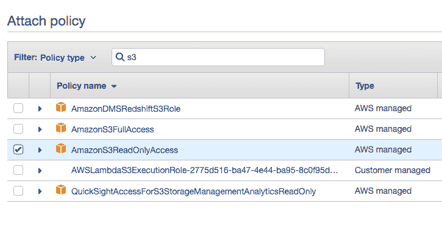

添加 Amazon S3 权限

# 处理我们的数据

完成对 S3 的请求后，我们收到了数据或错误。无论哪种情况，我们都需要处理它并向用户发送响应。我们将创建两个新函数来处理数据或错误：

```js
const handleS3Error = handlerInput => {
    const speechOutput = `I've had a problem finding the perfect car for you.`
    return handlerInput.responseBuilder
        .speak(speechOutput)
        .getResponse();
};

function handleS3Data(data){
    let body = JSON.parse(data.Body);
    console.log('body= ', body);
    let { make, model, rrp, fuelEcon, dimensions, NCAPSafetyRating, cargo} = body;
    let speech = `I think that a ${make} ${model} would be a good car for you. 
    They're available from ${rrp} pounds, get ${fuelEcon} and have a ${cargo} litre boot.`;
    return handlerInput.responseBuilder
        .speak(speechOutput)
        .getResponse();
}
```

错误函数会告诉用户我们找不到最适合他们的车，而数据函数会使用数据创建一个简短的车辆描述。我们需要解析数据的主体，因为数据以缓冲区形式下传。我们需要将缓冲区转换为我们可以使用的格式。

# 测试我们的 Lambda

使用最后一个技能，Lambda 简单到我们甚至可以不对其进行测试。这个 Lambda 更复杂，有多个可能出错的地方，所以我们将正确地对其进行测试。

在 Lambda 控制台中，找到你的函数并打开它。一旦进入，点击测试旁边的下拉菜单，选择配置测试事件。确保选择了“创建新测试事件”选项，我们可以使用 Alexa Intent - GetNewFact 模板。

大多数模板可以保持默认设置，但我们需要更改槽位和 `intentName`（第 20 和 21 行）以及应用程序 ID（第 10 和 35 行）。首先，将 `intentName` 更改为等于我们创建的意图（`whichCar`）。接下来，我们可以添加我们可用的槽位。目前，我们可以将它们都设置为 *null*，因为它们在尚未填充时就是这样：

```js
"slots": {
    "size": null,
    "cost": null,
    "gears": null,
    "doors": null
},
"name": "whichCar"
```

使用你在 Alexa 技能控制台端点部分获得的 ARN，更改第 10 和 40 行的 `applicationId` 值。

将此意图命名为 `whichCarEmpty` 并点击创建。

在我们运行此测试之前，我们可以考虑我们期望发生什么。因为没有槽位被填充，我们预计它将在 `size` 检查处失败，因此我们将得到一个询问我们想要什么尺寸的车的响应。在运行测试之前考虑你期望发生的事情总是好的。这有助于你构建代码理解，如果你没有得到那个响应，它会在你的脑海中拉响一个红灯。

现在我们可以点击测试，我们应该得到执行结果：成功，并带有输出语音"你想要什么尺寸的汽车？请说出小型、中型或大型"的响应。

这正是我们预期的，所以太好了！如果你没有收到这个响应，请查看错误消息，并使用它来找出可能出了什么问题。*附录*中有一个有用的部分，可以用来调试常见的 Lambda 错误。

在这个测试工作之后，我们可以创建另一个包含一些填充槽位的测试。点击测试下拉菜单，再次选择配置测试事件。确保选择创建新测试事件，但这次选择 whichCarEmpty 作为模板。这意味着我们知道应用程序 ID 是正确的，我们唯一需要更改的是槽位。将槽位更改为以下代码：

```js
"slots": {
    "size": { "value": "large"},
    "cost": { "value": "luxury"},
    "gears": { "value": "automatic"},
    "doors": { "value": null}
},
```

将此测试保存为 whichCarLargeLuxuryAuto。当你运行这个测试时，你应该得到以下成功的响应：

"我认为奔驰对你来说是一辆好车。它们的价格从 35,150 英镑起，油耗为 32-66 mpg，后备箱容量为 425 升。"

你可以为每种可能的结果组合创建测试，但由于我们知道我们的 Lambda 正在响应并访问 S3，我们知道所有代码都在正常工作。

# 完成 Alexa 技能套件配置

为了完成我们技能的配置，我们需要获取我们的 Lambda 的 ARN。从 Lambda 页面的顶部或从你的构建脚本的结果中复制它，然后转到 Alexa 技能套件控制台。将其粘贴到默认区域并保存端点。在我们开始测试我们的技能之前，我们只需要做这些。

# 测试

现在我们可以尝试我们的新技能。在这里，你可以看到我与我的汽车助手机器人之间的对话：

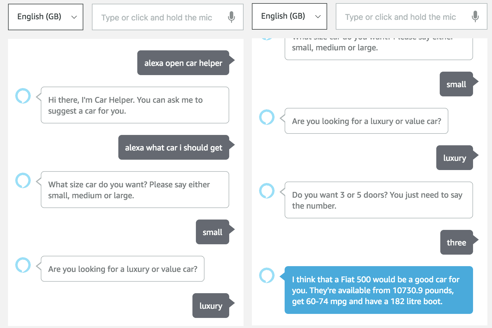

测试汽车助手技能

这个技能并不完美——它不会对你说出的每一个话语都做出响应，而且这个技能还能做更多的事情。好事是，你现在知道你需要的一切来修复所有这些问题。

# 启动你的技能

要将你的技能发布到 Alexa 技能商店，我们需要切换到下一个标签页。这是你将设置将在 Alexa 技能商店中显示的信息的地方。你需要给你的技能起一个独特的名字，简短和长描述，以及示例话语。然后你可以上传一个图标，并选择你的技能的类别和关键词。类别和关键词应该仔细考虑，因为这可能是用户找到你的技能的方式。

本页的最后一部分是*隐私政策*和*使用条款*的 URL。如果你想在技能商店中拥有一个技能，你需要这些。外面有很多例子，对于不存储或甚至不要求用户提供信息的技能来说，它们不应该很复杂。任何使用并存储用户信息的应用程序都需要一个更详细的隐私政策，并且可能值得联系律师：

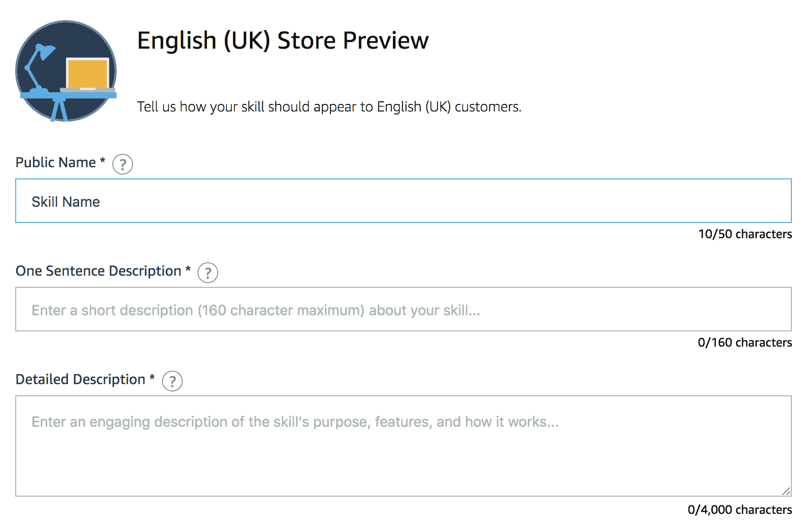

启动设置

下一页会问你关于你的技能的许多隐私和合规性问题。诚实地回答这些问题，然后在部署之前向将测试你的技能的人提供一些信息。

接下来，我们必须选择我们技能的可用性。我们可以使用它来仅允许某些组织访问该技能。如果你为一家公司创建了一个专门的技能并且不希望其他人使用它，这可能会很有用。你还可以选择技能可用的国家。你可以将其限制在一两个国家，或者让每个人都可以使用。

最后一页是一个审阅页面，它会告诉你你的提交是否缺少任何内容。当你修复了一切之后，你可以点击提交以供审查。在技能处于测试状态时，你将无法编辑技能的配置。你仍然可以编辑你的 Lambda，但这样做可能会导致你的技能被拒绝。

一旦经过测试并获得批准，你将拥有一个实时的 Alexa 技能！

# 摘要

本章向我们展示了如何做很多事情。我们首先使用 Alexa Skills Kit 创建了我们第一个 Alexa 技能。这包括了解和创建意图、槽位和语音。配置完成后，我们使用 Alexa-SDK 创建了一个 Lambda 来处理请求。这个 Lambda 是我们定义将发送给用户的响应的地方。最后，我们使用内置的测试工具构建和测试了我们的新 Alexa 技能。

在创建了一个基本的第一个技能之后，我们开始创建一个更有用的第二个技能。我们使用了一个自定义槽位类型并将其应用于意图中的槽位。然后我们使用亚马逊的 S3 服务来存储我们需要的在 AWS SDK 中使用之前的数据，以便轻松获取数据并在我们的 Lambda 中使用它。

使用本章学到的技能，你可以为 Alexa 构建一大系列强大的技能。

在下一章中，我们将学习如何访问 API，这将使我们能够创建更强大的技能。

# 问题

1.  我们在 Lambda 中用于处理 Alexa 请求的工具是什么？

1.  我们需要做哪三件事才能将 Lambda 连接到 Alexa 技能？

1.  我们从我们的 S3 存储桶获取信息的方法是什么？

1.  我们需要对 S3 的响应体进行什么操作，以及为什么？

1.  我们如何创建一个 Lambda 测试？

# 进一步阅读

如果你想尝试不同的响应类型，请查阅 Alexa SDK 响应构建器文档：[`ask-sdk-for-nodejs.readthedocs.io/en/latest/Building-Response.html`](https://ask-sdk-for-nodejs.readthedocs.io/en/latest/Building-Response.html)。

我们只使用了 S3 来获取我们手动存储的数据；还有其他方法可以提供更多 S3 功能：[`docs.aws.amazon.com/AWSJavaScriptSDK/latest/AWS/S3.html`](https://docs.aws.amazon.com/AWSJavaScriptSDK/latest/AWS/S3.html)。
