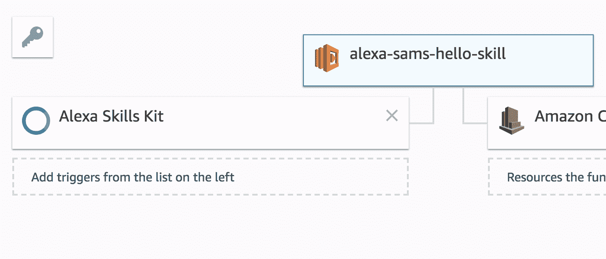

# 附录 B

# 调试

尝试找出为什么你的代码不起作用可能是一个非常令人沮丧的过程，并且可能存在大量不同的问题来源。在这本书中，我们主要有三个问题来源：Lambdas、Alexa 技能设置和 Lex 设置。

# 调试 Alexa 技能

如果你的技能没有起效，那么你需要检查以下几点：

+   你使用的是正确的表述

+   你的模型已保存和构建

+   你的端点设置正确

+   你已将 Alexa 添加为 Lambda 的触发器

+   你的 Lambda 运行正常

# 检查表述

如果 Alexa 回复“对不起，我不知道那个”，请确保你说的或输入的是正确的短语。应该是“Alexa，告诉*你的技能调用* *你的意图表述,*”，所以可能是“Alexa，告诉我的技能你好”或“Alexa，询问汽车助手我应该买什么车。”请检查你是否已正确设置你的技能调用和意图表述。你可以添加更多表述到你的意图中，以便它能够与更多种类的短语一起工作。

你也可以在你的处理程序中添加控制台日志，以确保它们在你期望的时候被触发。

# 保存并构建你的模型

检查你是否已保存并构建了你的模型；保存模型和构建模型按钮应该是灰色，而不是蓝色。重新保存和重建你的模型以确保一切是最新的没有害处。

# 检查你的端点

在 Alexa 技能套件中最后要检查的是端点是否正确设置。确保默认区域框中有一个长的 ARN 代码。如果那里没有，那么打开你的 Lambda 控制台，找到你想处理这个技能的 Lambda。从屏幕右上角复制 ARN 号码，并将其粘贴到 Alexa 技能套件的默认区域框中。它应该具有以下格式：`arn:aws:lambda:your-region:123456789012:function:your-lambda-name`。

# 已将 Alexa 添加为 Lambda 的触发器

如果你的技能仍然不起作用，那么可能是因为你的 Lambda 存在问题。在 Lambda 编辑器中，确保 Alexa 在设计图中正好如以下所示。如果 Alexa 技能套件不在该图中，请从左侧的触发器列表中选择它，并遵循本章前面解释的设置步骤：

Alexa 触发

如果显示 Alexa 技能套件，但有一个完成配置或类似的消息，那么你需要完成它。点击 Alexa 技能套件符号并完成配置，如本章前面所述。

# 调试 Lex 聊天机器人

与 Alexa 技能一样，有几个不同的地方可能导致你的聊天机器人出现错误。以下是一些你需要检查的事项：

+   你使用的是正确的表述

+   你的意图有一个文本响应或正在触发正确的 Lambda

+   你的意图已保存，聊天机器人已构建和部署

+   你的连接平台已正确配置（Facebook、Slack、API）

+   你的 Lambdas 运行正常

# 检查你的表述

如果 Lex 表示它无法理解你所说的话，那么它就无法将你的语句与意图匹配。这种情况可能有两种发生方式：你没有足够接近你使用的语句的样本语句，或者有两个样本语句在不同的意图上匹配得很好。具有相似样本语句的不同意图通常会导致问题。

# 检查意图响应

你的意图可能被触发，但没有返回响应。在意图中向下滚动到“Fulfillment”，确保正在调用 Lambda 或你正在回复文本响应。如果你正在调用 Lambda，请检查 Lambda 日志以查看是否在触发该意图时 Lambda 正在运行。如果没有，你可能只需要保存、构建聊天机器人并再次部署。

# 保存意图，构建和部署

如果所有样本语句和履行都是正确的，那么你应该确保每个意图都已保存，构建你的聊天机器人，并将其部署到与之前相同的别名。很容易忘记这一步，然后 wonder 为什么所有的更改都没有产生任何影响。

# 检查你的连接平台

如果你正在尝试将你的聊天机器人连接到 Facebook、Slack 或你的 API 等平台，请确保它们已正确设置。如果你能在 Lex 控制台中成功测试你的聊天机器人，那么请回过头来检查平台的设置流程，确保你没有错过任何步骤。

# 检查你的 Lambda 是否正在运行

使用 Lambda 调试技巧确保你的 Lambdas 正确响应。

# Lambda 调试

如果你发现问题不是出在你的 Alexa 技能或 Lex 聊天机器人上，那么可能是在你的 Lambda 上存在问题。在你开始更改代码之前，通常一个好的做法是在 Lambda 控制台中创建一个测试。这应该代表 Alexa 或 Lex 发送的请求。使用这个测试来查看是否是 Lambda 出了问题，或者它是否按预期工作。

如果你的测试失败，请在日志中查找错误消息。这通常可以指向问题的根源。

在尝试调试 Lambda 时，以下是一些需要检查的事项：

+   你的 Lambda 已安装所有必需的包

+   你的权限是正确的

+   所有你的变量都已被正确定义

+   你的 Lambda 代码是正确的

+   你 Lambda 调用的所有内容都在运行

# 安装所有必需的包

如果你的 Lambda 不工作，你需要检查所有包是否已安装。前往你的`Lambdas`文件夹并导航到你的问题 Lambda。在其中，应该有一个名为 `archive.zip` 的压缩文件。如果没有，再次运行构建脚本，应该会出现 `archive.zip` 文件——你的 Lambda 现在应该可以工作了。

如果有一个 `archive.zip` 文件，打开它并查看其内容。应该有一个 `index.js` 文件，一个 `package.json` 或 `package-lock.json` 文件，以及一个 `node_modules` 文件夹。如果这些内容中的任何一个缺失，那么重新运行构建脚本并确保它成功执行。

如果所有这些都正确，那么请检查 `package.json` 或 `package-lock.json` 文件，确保您正在 Lambda 代码中要求的所有包都有依赖项。检查 `node_modules` 中每个包是否都有一个文件夹。如果没有，您需要运行 `npm install --save *PACKAGE-NAME*` 将其添加到 `package.json` 文件中。

# 检查您的权限

进入您的 Lambda，向下滚动到执行角色，查看您选择了哪个角色。现在，转到 IAM 服务并选择您使用的角色。查看您添加到该角色的策略，并确保您拥有所有需要的权限。为该角色添加任何需要的策略。

# 修正您的 Lambda 代码

您还需要检查 Lambda 中的代码是否正确。随着您的 Lambda 变得越来越复杂，第一次使其工作变得更加困难。运行您创建的测试，并查找错误信息。

如果您不知道错误信息的意思或如何修复它，请在网上搜索，因为之前肯定有其他人遇到过这个错误。确保您阅读了关于如何修复错误的回复，并在将其用于代码之前理解为什么那个解决方案有效。这有助于您成为一名更好的开发者，并允许您在未来如果出现错误时进行修复。

如果错误信息中没有明显的错误，您可以使用 `console.log('Some information')` 在代码到达每个阶段时记录信息。使用这种方法来确定代码执行到了哪个阶段以及在该点可用的值。常常是变量或其他服务的响应格式与您预期的不同。在错误发生之前能够看到所有数据对于找出代码为何不工作非常有用。

# 检查外部服务

当与外部服务一起工作时，总有可能这些服务停止工作或更改它们的响应。每次您处理外部服务时，都应该处理它，如果它返回错误。如果服务看起来似乎在工作，但您的代码没有工作，那么请使用 `console.log` 输出响应以检查格式。
