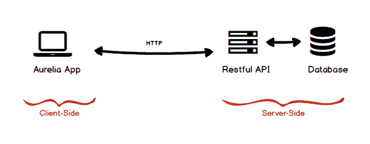
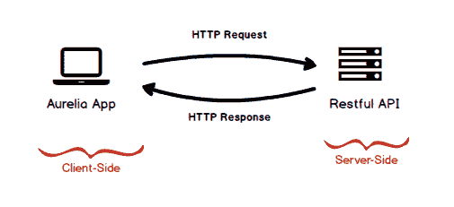
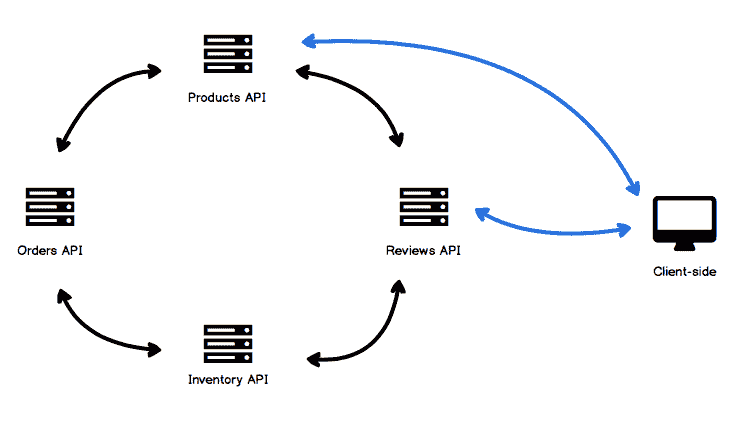
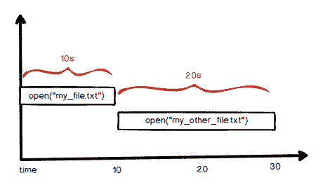
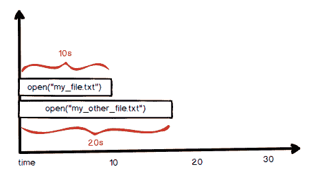
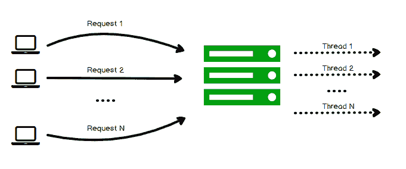
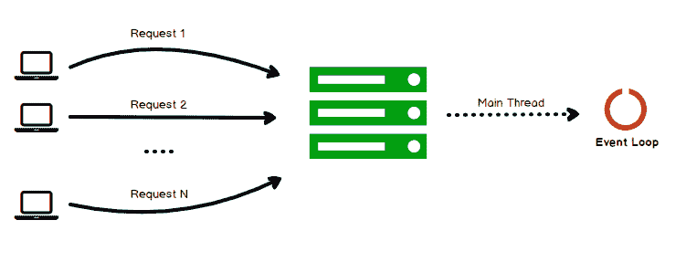
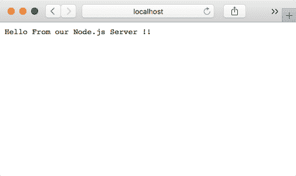
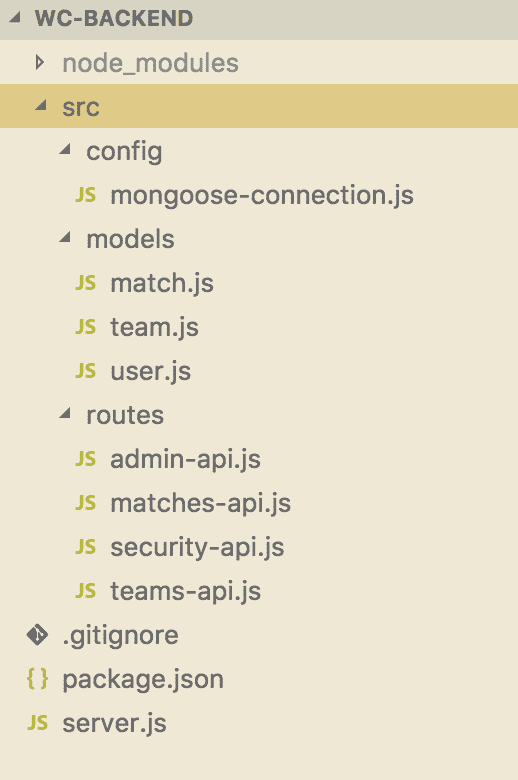
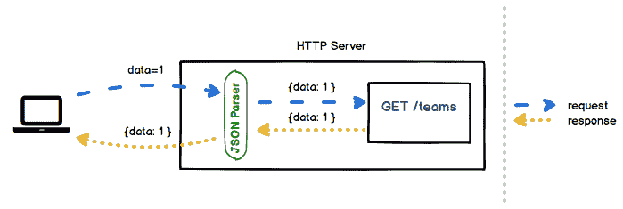

# 第五章：创建我们的 RESTful API

一个网络应用程序由不同的层组成；到目前为止，你一直在开发 FIFA 世界杯项目的客户端层。然而，仅仅向用户展示用户界面是不够的。我们需要处理一些业务逻辑，以便为用户提供适当的用户体验，例如订阅下一场比赛、检索用户喜爱球队的阵容、管理登录等。

为了拥有一个完整的网络应用程序，我们应该在我们的项目中实现以下服务器端缺失的部分：

+   RESTful API 层

+   数据库层

从前，开发者通常在一个项目中实现所有层，这主要是因为采用了像 XAMPP 这样的流行开源 Web 平台，它只需几秒钟就能配置 PHP/MySQL 环境。因此，开发者通常使用 PHP 编写客户端网页，并在同一文件中添加 HTML 代码，将服务器端代码与客户端代码混合。

随着时间的推移，引入了新技术。现在，开发者将客户端和服务器端分离到不同的项目中，并且除了分离项目之外，这些层还部署在不同的域中。所有这一切都得益于新客户端和服务器端框架的引入。所有这些都带来了新的挑战——通信，因此现在需要一种方式来交换信息。RESTful API 成为在客户端和后端之间使用 HTTP 协议作为这些层之间数据传输手段进行通信的正确解决方案。

以下插图展示了创建 Web 应用的新方法：



在本章中，我们将实现 RESTful API 层。为此，我们将使用 Node.js 和 JavaScript 构建一个健壮的 RESTful API。你还将学习概念以及如何使用 Node.js 之上的开源框架 ExpressJS 设计健壮的 API。我们还将探索新的 MEAN 栈，了解其背后的技术以及为什么我们决定将其命名为新的 MEAN 栈。最后，你将学习如何使用新技术改进你的 RESTful API，以改善团队的开发体验。

因此，我们将涵盖以下主题：

+   理解 RESTful

+   设计 API

+   使用 Node.js 创建 API

+   使用 ExpressJS 改进我们的 API

+   编码我们的项目

# 理解 RESTful

在本节中，我们将介绍 HTTP 和**CRUD**（**创建**、**检索**、**更新**和**删除**）组件，这些组件构成了 RESTful 的基本构建块。这些组件共同使得在分布式环境中通过定义良好的 API 在不同应用程序之间进行通信成为可能。

# 理解 HTTP

每次您在网上导航时，您都在使用 HTTP。即使您在 Uber 上预订行程，您也在使用 HTTP。事实上，HTTP 几乎存在于您每天使用的所有应用程序中。

HTTP 基于客户端-服务器通信的原则。这意味着每次您想要访问信息或资源时，您都必须发送一个请求对象，服务器将发送所有请求的信息到一个响应对象中。以下图表解释了这种通信：



因此，为了真正理解如何设计一个健壮的 HTTP RESTful API，我们需要了解 URL 的工作原理以及学习 HTTP 协议。

# URL

URL 是应用程序通过定义良好结构的端点来提供对其信息资产访问的方式。例如，如果您想搜索秘鲁，您可能会通过网页浏览器访问以下 URL：[`www.google.com/search?q=Peru`](https://www.google.com/search?q=Peru)。让我们将之前的 URL 分成几个部分，并详细分析它：


从图中，我们看到基本上有四个部分：

+   **协议**：这是非安全连接的 HTTP 或安全连接的 HTTPS

+   **域名**：将转换为服务器 IP 的已注册域名，其中包含此资源

+   **路径**：这使我们能够将资源分成几个部分

+   **查询字符串**：这是可选的，但允许我们提供额外的数据

我们将始终使用 URL 来访问托管在其他服务器上的资源。

# 动词

HTTP 动词是 RESTful API 背后的魔法。让我们用一个例子来理解 HTTP 动词是如何工作的。我们想要创建一个用于管理产品的 API；我们的第一个版本可能看起来像这样：

| **端点** | **HTTP 动词** | **目标** |
| --- | --- | --- |
| `http://myapp/api/createProduct` | POST | 创建产品 |
| `http://myapp/api/updateProduct/P1` | POST | 更新现有产品 |
| `http://myapp/api/listProducts` | GET | 获取产品完整列表 |
| `http://myapp/api/viewProductDetails/P1` | GET | 获取单个产品 |
| `http://myapp/api/deleteProduct/P1` | POST | 删除一个产品 |

从前面的表中，您可以注意到我们需要记住五个端点，我们使用了两个 HTTP 动词：POST 和 GET。可以理解的是，每次我们想要检索信息时，都会使用 GET 动词，而要执行将修改我们系统中现有信息的操作时，会使用 POST 动词。

因此，让我们使用 HTTP 动词使我们的端点易于记忆。经过简单的重构后，我们的表格可能看起来如下所示：

| **端点** | **HTTP 动词** | **目标** |
| --- | --- | --- |
| `http://myapp/api/products` | GET/POST | 获取产品完整列表。创建新产品。 |
| `http://myapp/api/products/P1` | GETDELETEPUT | 检索单个产品。删除现有产品。修改现有产品。在这种情况下，你必须发送完整的文档，而不仅仅是已更改的字段。 |

现在，我们正在使用 HTTP 动词，并且我们已经将端点数量从五个减少到两个。HTTP 动词与每个请求一起发送到服务器，因此服务器可以使用它们来识别用户想要执行的操作，发送正确的端点和动词。

# 头部信息

头部信息包含了我们发送给服务器每个请求的附加信息。在开发过程中，你将更频繁地使用以下头部信息：

+   **内容类型** - **Type**：告诉服务器你期望哪种类型的响应

+   **接受** - **Accept**：告诉服务器客户端可以处理哪种类型的内容

+   **授权** - **Authorization**：发送一段信息以验证信息消费者的身份

当然，还有更多的头部信息。请参阅 [`developer.mozilla.org/es/docs/Web/HTTP/Headers`](https://developer.mozilla.org/es/docs/Web/HTTP/Headers) 了解更多关于 HTTP 头部信息的内容。

# 主体

主体存在于请求和响应对象中。每次你想在你的数据库中创建新条目时，你都必须在 HTTP 请求的主体部分传递信息。主体部分中的数据被称为 **有效载荷**。

# CRUD 通过 HTTP

当我们讨论 HTTP 动词时，你可能已经注意到，每个动词都与一个 CRUD 操作相关联。基本上，这四个操作指的是所有数据库引擎执行的基本功能。

因此，将每个 HTTP 动词与其相应的 CRUD 操作相对应，我们将得到以下表格：

| **HTTP Verb** | **CRUD Operation** | **GOAL** |
| --- | --- | --- |
| POST | 创建 | 在我们的应用程序中创建或插入一个新元素 |
| GET | 检索 | 从我们的应用程序中检索或读取元素 |
| PUT | 更新 | 更新或修改我们应用程序中的任何现有元素 |
| DELETE | 删除 | 从我们的应用程序中删除或移除任何现有元素 |

# 设计 API

现在我们已经清楚 HTTP 是什么以及其背后的构建块，我们需要设计一个友好且健壮的 API。这个做法的另一个优点是，我们将通过拥有一个定义良好的 API 来提高我们组织中的开发者体验。

API 文档是你在将要进行的每个 API 开发中必须应用的关键实践之一。有了文档，开发团队和 API 消费者都会了解 API 的全部功能，因为它们是以易于阅读的格式定义的。例如，一个组织中的财务团队和物流团队可以共享他们的 API 文档，并立即开始工作，因为他们现在知道了 API 的全部细节。

让我们通过了解 API 的第一步骤和其他设计概念来学习如何设计健壮的 API。

# API 首选

**API 首先**是在开发新产品或服务时你应该牢记的最重要概念之一，你必须把它看作是程序员的用户界面。实际上，API 是你如何在分布式大系统中暴露产品功能的方式。

现在，像云应用和微服务这样的技术和方法正在被广泛应用，并提出了软件开发的新方式。使用微服务，你必须将你的应用程序拆分为不同的独立服务；每个服务包含你应用程序中一组特定的相关功能，例如以一些亚马逊 API 为例，我们可以有如下所示的内容：



如你所见，存在不同的服务需要交换信息和功能。所有这些都必须定义一个一致且自解释的 API，其他服务必须使用这个 API 来执行它们无法完成的操作，或者客户端应用程序可以直接调用 API 来访问某些信息。

API 首先的主要理解是，在你为系统实现任何代码或 UI 设计之前，你应该以这样的方式设计你的 API，即使你没有用户界面，开发者也应该能够导航并访问你的应用程序数据中的信息和功能。

# API 设计

为了设计一个健壮、自解释、友好且易于使用的 API，我们将遵循多年来互联网大牛们所使用和实施的最佳实践。幸运的是，一些优秀的开发者和架构师已经定义了一套规则，我们将在本节中介绍。

# 路径作为名词

你是否见过一些包含完整句子来访问资源的 API 端点？以下是一些示例：

```js
http://myshop.com/createNewProducthttp://myshop.com/deleteProduct
http://myshop.com/updateProduct http://myshop.com/getProductDetail/P01
http://myshop.com/getProductComments/P01
```

首先要记住的是，你永远不应该在你的端点中使用动词。相反，使用复数名词来指代你的 API 端点中的资源。例如，前面的例子可以被重构为以下内容：

| **REST 方法** - **不推荐** | **RESTful 方法** - **推荐** |
| --- | --- |
| `http://myshop.com/createNewProduct` `http://myshop.com/deleteProduct` `http://myshop.com/updateProduct` | `http://myshop.com/products` |
| `http://myshop.com/getProductDetail/P01` | `http://myshop.com/products/P01` |
| `http://myshop.com/getProductComments/P01` | `http://myshop.com/products/P01/comments` |

一个好的做法是不将路径深度扩展超过三个路径。例如，使用以下方法：

```js
http://myshop.com/products/P01/comments
```

不要这样做：

```js
http://myshop.com/products/details/P01/comments/today
```

如果你想要扩展你的 API 以执行额外的操作，例如获取今天发布的第一个 10 条消息，请使用查询字符串而不是路径。考虑以下示例：

```js
http://myshop.com/products/P01/comments?day=today&count=10
```

# CRUD 的 HTTP 动词

现在你已经为你的 API 设计了干净的端点，是时候利用我们关于 HTTP 动词所学的知识了。你可能想知道，如果你使用相同的端点 `/products`，你如何区分创建、更新或删除产品？这就是我们使用 HTTP 动词的情况。例如，对于 `/products` 端点，我们将有以下动词：

| **端点** | **HTTP 动词** | **目标** |
| --- | --- | --- |
| `/products` | POST | 创建一个新的产品 |
| `/products` | PUT | 更新现有产品 |
| `/products` | DELETE | 删除现有产品 |

从前面的表中，你可以注意到关键的区别在于 HTTP 动词。简而言之，一个端点由一个路径和一个 HTTP 动词组成。

# API 文档

当你在实际项目中工作时，你需要设计的端点数量将会更多。你需要一种方法来记住所有你的端点以及它们被设计的原因。同样，我们确信记录软件对于我们记住代码应该做什么非常重要；API 文档允许我们通过记录端点和其他附加元数据（如以下列出的）来告诉 API 消费者如何使用我们的 API。

+   端点路径

+   HTTP 动词

+   预期头信息

+   预期体结构

+   预期结果

有一个很棒的开源工具可以帮助你记录和分享你的 API 文档，它被称为 **Swagger**。我们鼓励你访问官方网站并尝试使用它：[`swagger.io`](https://swagger.io)。

可能的文档可能只是一个简单的表格，包含请求和响应中使用的数据。例如，创建新产品的文档可能如下所示：

| **路径** | **产品** |
| --- | --- |
| HTTP 方法 | POST |
| 预期结果 | HTTP 200 OK 状态码 |
| 预期输入头信息 | Content-type: `application/json` |
| 预期输入体 | {`id`: `Integer`, `name`: `String`, `price`: `Decimal`} |
| 目标 | 使用此端点创建一个新产品 |
| 授权 | 需要授权令牌 |

在了解了如何设计自解释的 API 以及如何使用 HTTP 创建端点之后，让我们继续使用 Node.js 实现一个 RESTful API。

# 使用 Node.js 创建 API

是时候开始享受编码我们的 RESTful API 了。到目前为止，你已经看到了 API 背后的理论，这些知识对于理解以下部分非常重要。所以，你可能想知道为什么选择 Node.js？简短的答案是它很酷！哈哈，开个玩笑。Node.js 自 2009 年由 *Ryan Dahl* 创建以来已经发展演变了。Node.js 被世界各地的领先公司使用，如 LinkedIn、Facebook、Amazon 等。

Node.js 不限于 API 开发。实际上，你可以从命令行工具到 **物联网**（**IoT**）应用创建任何类型的项目。因此，让我们开始学习 Node.js 的优势以及如何编写我们的 API。

# Node.js 优势

Node.js 有很多优势；我们将在以下子主题中探索其中更重要的一些。

# 异步

在大多数编程语言中，I/O 操作是同步执行的。同步执行将阻塞程序流程，直到阻塞操作完成其执行。例如，以下 Python 代码是同步执行的，并阻塞了执行：

```js
file_content = open("my_file.txt") // takes 10 seconds
file_content_2 = open("my_other_files.txt") // takes 20 seconds
print file_content
print file_content_2   
```

总执行时间大约为 30 秒。这是因为 I/O 阻塞操作。如果我们用时间线表示同步执行：



现在如果我们使用 JavaScript 以异步方式执行相同的操作：

```js
open("my_file.txt", (file_content) => {
  console.log(file_content)
})

open("my_file_2.txt", (file_content_2) => {
  console.log(file_content_2)
})
```

从前面的代码中，你可以注意到我们使用回调来处理文件的内容。回调是在某些事件发生后被调用的函数。例如，`(file_content)=> {}`将在`my_file.txt`的内容准备好使用时被调用。

两个`open()`语句将同时执行。并行执行这些语句将帮助我们减少执行时间。例如，让我们看看这个异步代码的时间线执行：



现在执行时间将仅为 20 秒，并且，通过这种方式，我们已经提高了应用程序的性能。这是 Node.js 带来的关键优势之一。

# 单线程

每当一个新的用户请求到达后端服务器时，它将为该请求创建一个新的线程，这是不使用 Node.js 的后端服务器的经典行为。一旦服务器向用户发送响应，它就会释放线程。处理几个线程没问题，但想象一下，如果你需要同时处理数百万用户会发生什么？让我们用图表来展示这个问题：



Node.js 由于其单线程策略而没有这个问题。它不会为每个请求启动一个新的线程，而是将使用相同的主线程来处理所有请求，并由事件循环支持。以下图表描述了这种情况：



这种场景更适合 CPU 利用率；多个线程允许 Node.js 利用多核 CPU。然而，我们需要超过一个简单的章节来讨论它们。我们强烈建议您访问官方 Node.js 网站[`nodejs.org/en/`](https://nodejs.org/en/)。

现在是时候编写一个简单的 HTTP 服务器并开始有趣的环节了！

# 简单 HTTP 服务器

是时候开始编码，看看我们如何使用 Node.js 实现一个简单的 HTTP 服务器了。所以，打开你的终端，并在你选择的目录中，创建一个名为`my-server`的新文件夹：

```js
$ mkdir my-server
$ cd my-server
```

一旦你进入`my-server`文件夹，我们需要初始化一个 NPM 模块，所以运行以下命令：

```js
$ npm init -y

{
 "name": "my-server",
 "version": "1.0.0",
 "main": "index.js",
 "scripts": {
 "test": "echo \"Error: no test specified\" && exit 1"
 },
 "keywords": [],
 "author": "",
 "license": "ISC",
 "description": ""
}

```

现在是时候通过在终端中执行 `touch server.js` 命令来创建 `server.js` 文件了。这个文件将包含我们服务器的代码。我们将开始导入 HTTP 模块：

```js
const http = require('http')
```

我们使用内置的 `require` 函数导入任何模块，并定义 `http` 变量来存放模块引用。让我们通过编写以下代码来实现一个简单的处理器：

```js
const myRequestHandler = (request, response) => {
    response.end('Hello From our Node.js Server !!')
}
```

如您所见，处理器只是一个声明了两个参数的函数：

+   `request`：用于读取客户端发送的信息

+   `response`：用于向客户端发送信息

我们的处理器正在使用 `response` 参数将友好的消息发送给客户端。现在是我们使用之前声明的 `http` 引用创建服务器实例的时候了：

```js
const server = http.createServer(myRequestHandler)
```

我们正在创建一个不执行任何操作的空服务器。为了使我们的服务器变得有用，我们传递之前声明的 `request` 处理器 `myRequestHandler`。有了这个，每当某个客户端向我们的服务器发送 HTTP 请求时，我们的服务器就能够发送我们的 `Hello` 消息。为了完成我们的服务器实现，我们需要监听客户端请求：

```js
server.listen(5000, () => {
    console.log("server is running on port 5000")
})
```

就这些了！现在我们有一个简单的 HTTP 服务器，执行 `node server.js` 命令来运行服务器。让我们测试一下。转到 [`localhost:5000`](http://localhost:5000)，您应该看到以下内容：



现在您已经知道如何使用 Node.js 内置的 HTTP 模块创建一个简单的 HTTP 服务器。然而，为了创建一个强大的 RESTful 后端，我们需要使用一个更复杂的框架。

在下一节中，我们将使用 Express.js 来增强我们的简单服务器。

# 使用 Express.js 优化我们的 API

Express.js 是一个基于 Node.js 的开源 Web 框架。我们可以使用 Node.js 的 HTTP 模块来实现我们的 REST API，但我们需要编写大量的代码来处理简单的用户请求。Express.js 非常灵活，并提供了一套功能，使我们能够创建健壮的 API。

# 编写我们的服务器

是时候创建我们的 FIFA 后端文件夹并开始 API 开发了。打开您的终端并运行以下命令：

```js
$ mkdir wc-backend
$ cd wc-backend
$ npm init -y

{
 "name": "wc-backend",
 "version": "1.0.0",
 "description": "",
 "main": "index.js",
 "scripts": {
 "test": "echo \"Error: no test specified\" && exit 1"
 },
 "keywords": [],
 "author": "",
 "license": "ISC"
}

```

初始化完成后，让我们安装 Express.js。执行以下命令：

```js
$ npm install --save express
```

接下来，在根目录中创建 `server.js` 文件，并编写以下代码：

```js
const express = require('express')
const app = express()

app.use((req, res) => {
    res.send("Hello!")
})

app.listen(3000, () => {
    console.log('running on port: 3000')
})
```

我们开始导入 `express` 模块并将一个 express 应用实例化到 `app` 变量中。接下来，我们使用应用实例通过 `app.use` 函数配置一个简单的请求处理器。在这个函数中，我们传递另一个作为参数的函数，该函数有两个参数：请求和响应：`req` 和 `res`。为了发送一个简单的消息，我们使用 `res` 参数。

服务器应用实例配置完成后，我们通过调用其 `listen` 函数并传递它将监听新 HTTP 请求的 HTTP 端口来激活它：

```js
$ node server.js
```

我们强烈建议你在开发中使用**nodemon**。nodemon 会在检测到源代码中的更改时自动重启你的 Node 应用程序。要安装 nodemon，只需执行`npm install -g nodemon`命令。要运行你的服务器，使用`nodemon server.js`命令。

让我们通过在浏览器中打开`http://localhost:3000`或使用 HTTP 客户端命令行工具来测试它。考虑以下示例：

```js
$ curl http://localhost:3000

Hello!
```

到目前为止一切顺利！让我们定义一个路由路径来创建一个自解释的 API。将以下更改应用到`server.js`文件中：

```js
...
app.use('/hello', (req, res) => {
    res.send("Hello!")
})
...
```

现在，前往`http://localhost:3000/hello`，你应该会看到相同的`Hello!`消息。你可以导航到`http://localhost:3000`来查看更改后的结果：

```js
$ curl http://localhost:3000/hello

Hello!
```

# 使用路由

路由是我们 RESTful API 背后的魔法。如果你记得我们之前讨论 HTTP 动词时的情况，RESTful 是通过将 CRUD 操作与 HTTP 动词结合而成的。Express.js 使得定义这些 RESTful 方式变得简单。例如，打开`server.js`文件并应用以下更改：

```js
...
app.get('/hello', (req, res) => {
    res.send("Hello!")
})
...
```

如你所见，我们将`use`更改为`get`。既然你这么聪明，你知道`get`指的是 GET HTTP 动词，所以让我们定义我们的队伍 API 的 RESTful 路由。在`server.js`中应用以下更改：

```js
...

app.get('/teams', (req, res) => {
    res.send("*To retrieve the list of teams*")
})

app.post('/teams', (req, res) => {
    res.send("*To create a new team*")
})

app.put('/teams', (req, res) => {
    res.send("*To update an existing team*")
})

app.delete('/teams', (req, res) => {
    res.send("*To delete an existing team*")
})

...
```

一旦我们应用了这些更改，就是测试它们的时候了。在你的终端中运行以下命令：

```js
$ curl -X POST http://localhost:3000/teams
 *To create a new team* 
$ curl -X GET http://localhost:3000/teams
  *To retrieve the list of teams*
```

太棒了！我们的 RESTful API 响应正确。注意，我们使用`-X [HTTP Verb]`来告诉 curl 我们想要为给定请求使用哪个 HTTP 动词。现在我们已经准备好了我们 API 的主要骨架，我们需要以一致的方式组织我们的项目，因为我们将会创建一组文件，并且应该始终组织我们的源代码。继续阅读！

# 编码我们的项目

到这里我们就位了！我们将实现我们项目的代码。我们的应用程序由三个领域组成：

+   **队伍**：用于管理参加世界杯比赛的队伍信息

+   **比赛**：用于管理比赛期间所有比赛的信息

+   **安全**：用于管理用户信息和权限

队伍和比赛遵循相同的实现方式，只有一些小的变化。因此，在本节中，我们将编写实现`Team`领域的代码，并通过我们的 API 公开它，然后你可以自己实现`Match`领域的代码。当然，完整的源代码可以在[`github.com/Packt-Aurelia-Fullstack-Book/worldcup-app`](https://github.com/Packt-Aurelia-Fullstack-Book/worldcup-app)的 GitHub 仓库中找到。

那么，既然已经说到了这里。让我们开始吧！

# 我们的项目结构

让我们从创建我们源代码的项目结构开始。在你的工作目录中创建以下目录和文件，如下面的截图所示：



`src` 文件夹包含三个子文件夹：`models`、`routes` 和 `config`。在本章中，我们将仅使用 `routes` 文件夹和 `teams-api.js` 文件。其他两个将在下一章讨论数据库和 MongoDB 时进行探讨。

路由文件夹的目标是托管所有 API 路由声明。我们已在 `server.js` 文件中声明了我们的路由；如果我们正在处理一个小项目，这可能是个好主意，但对于将有很多路由声明的大项目来说，这并不是一个好主意。因此，一个很好的策略是按 API 功能分离路由；例如，teams-API、matches-API 和 auth-API。这样，我们将拥有更易于阅读和易于维护的代码。

# 实现 Teams API

在我们开始编码之前，我们必须首先设计我们的 API。以下表格包含了我们将要实现的 API 的文档：

| **路由** | **HTTP 方法** | **目标** | **响应** |
| --- | --- | --- | --- |
| `/teams` | GET | 列出所有团队 | Http 200 - OK |
| `/teams` | POST | 创建新的团队，请求体为{`name`: String} | Http 201 - Created |
| `/teams/:id` | GET | 获取单个团队 | Http 200 - OKHttp 404 - Not Found |
| `/teams/:id` | PUT | 更新现有团队 | Http 200 - OKHttp 404 - Not Found |
| `/teams/:id` | DELETE | 删除现有团队 | Http 200 - OKHttp 404 - Not Found |

记住这一点，让我们开始有趣的环节！

# 配置 JSON 解析器

我们将首先配置我们的服务器以能够解析 JSON。这意味着 Express.js 将自动解析 HTTP 请求进出的数据。以下图表解释了这一点：



如您所见，所有请求都将被 **JSON 解析器** 截获。**JSON 解析器** 更为人所知的是 **中间件**。中间件只是一个简单的函数，它在另一个函数之前被处理。例如，**GET /teams** 函数应该是在每个请求中应该调用的唯一函数，但由于我们已配置了**JSON 解析器**，**GET /teams** 将在**JSON 解析器**函数完成后被调用。

要在我们的代码中配置此功能，首先我们需要安装它。在终端中运行 `npm install --save body-parser`，并应用以下更改：

```js
const express = require('express')
const bodyParser = require('body-parser')
const app = express()

app.use(bodyParser.json())

app.get('/teams', (req, res) => {

    const teams = [{ "name": "Peru" }, {"name": "Russia"}]

    res.json(teams)
})
...
```

首先，我们导入 `body-parser` 模块。然后，我们使用 `app.use` 函数配置应用程序使用我们的 `bodyParser.json()`。所有中间件都是通过调用此函数进行配置的。

最后，为了测试 JSON 解析器是否工作正常，我们定义了一个包含两个团队及其相应名称的 `teams` 变量。要发送 `teams`，我们使用 `res.json` 而不是 `res.send`。让我们通过执行以下命令来检查结果：

```js
$ curl -X GET http://localhost:3000/teams

[{"name":"Peru"}, {"name":"Russia"}]
```

现在我们 API 能够接收和发送 JSON，让我们将路由移动到自己的文件中。

# 重构路由

我们之前在 `routes` 文件夹中创建了 `teams-api.js` 文件。打开该文件并应用以下更改：

```js
const express = require('express')
const api = new express.Router()

let teams = [
    { id: 1, name: "Peru"},
    { id: 2, name: "Russia"}
]
```

首先，我们导入`express`模块。从这个模块中，我们声明了`api`变量，它是一个`express.Router`的实例。为了存储一些关于团队的假数据，我们创建了一个`teams`变量。我们将使用这个路由来配置我们的 CRUD/HTTP 处理器，如下所示：

```js
api
  .route('/teams')
  .get((req, res) => {
    res.json(teams)
  })
  .post((req, res) => {

  })

app.listen(3000, () => {
...
```

使用`api`路由变量，我们定义`'/teams'`路径作为 HTTP 处理器的根路径。在`get`处理器中，我们只是发送团队的列表作为响应。

最后，我们需要将`api`路由导出以便在`server.js`文件中使用：

```js
...
module.exports = api
```

一旦我们准备好了，打开`server.js`文件以应用以下更改，这将配置服务器使用此路由：

```js
const express = require('express')
const bodyParser = require('body-parser')
const teamsApi = require('./src/routes/teams-api')
const app = express()

app.use(bodyParser.json())
app.use(teamsApi)

...
```

首先，我们从相对路径导入 Teams API 模块到我们的项目中，并使用`app.use`函数来配置我们的路由。让我们测试一下；在您的终端中运行以下命令：

```js
$ curl -X GET localhost:3000/teams

[{"id": 1, "name":"Peru"},{"id": 2, "name":"Russia"}]
```

太棒了！现在我们的代码整洁，一切按预期工作。是时候编写一些代码来实现 POST、PUT 和 DELETE 处理器了。我们将使用假的`teams`变量在内存中添加数据，直到我们学习如何在下一章中使用真正的数据库。

# 创建团队

要创建一个团队，我们需要实现 POST 处理器。新团队的数据将通过 HTTP 请求的`body`参数发送。将以下更改应用到`teams-api.js`文件中：

```js
...
api
  .route('/teams')
  ...
  .post((req, res) => {
    let team = req.body 
 teams.push(team) 
 res.status(201).json(team)
  })
  ...
...
```

首先，我们从`req.body`属性读取数据。然后，我们将新元素插入到`teams`数组中。最后，我们发送包含新团队的`teams`数组，并指定 HTTP 状态码 201，表示资源已创建。

您可以在[`en.wikipedia.org/wiki/List_of_HTTP_status_codes`](https://en.wikipedia.org/wiki/List_of_HTTP_status_codes)找到完整的 HTTP 状态码列表。

为了测试，我们将使用以下命令调用我们的 API：

```js
$ curl -X POST -H "Content-Type: application/json" -d '{"id":3, "name": "Brasil"}' localhost:3000/teams
```

我们的命令这次有点奇怪。因为我们使用 JSON，我们必须明确告诉 HTTP 请求我们正在发送 JSON 数据，所以我们使用`-H`头选项。为了发送信息，我们使用`-d`数据选项。就这样！看起来很难，但实际上并不难。

现在，您可以使用 GET 方法列出所有团队并查看添加到我们列表中的新团队。

# 检索列表

我们已经有了列表处理器，但列表还不够。除了检索完整列表外，我们还需要检索单个团队。为此，我们需要添加一个新的 GET 路由并学习如何使用参数。将以下更改应用到`teams-api.js`中：

```js
...
api
  .route('/teams')
...

api
  .route('/teams/:id')
  .get((req, res) => {
      const id = req.params.id

      for(let team of teams) {
          if (team.id == id)
            return res.json(team)
      }

      return res.status(404).send('team not found')
  })

module.exports = api
```

首先，我们声明了一个新的路由，它现在包含一个动态参数—`/teams/:api`。我们称之为动态参数，因为当然它可以取任何值，这些值将作为`req.params`对象的属性可用。请注意，你为参数使用的名称将被创建为一个属性，例如，在这个例子中是`req.params.id`。

接下来，我们创建了一个简单的 `for` 循环，遍历完整的团队列表，寻找与路由参数中传递的相同 `id` 的团队。如果找到团队，我们通过调用 `res.json(team)` 语句发送团队。由于我们希望在发送响应后立即退出处理程序，我们使用 `return` 来退出处理程序。如果没有找到团队，我们发送一个错误消息，并将响应标记为 HTTP `status` 404，这意味着资源未找到。

最后，为了测试我们的实现，执行以下命令：

```js
$ curl http://localhost:3000/teams/1
 {"id":1,"name":"Peru"}$ curl http://localhost:3000/teams/2
  {"id":2,"name":"Russia"}
```

请记住，默认情况下，curl 总是发送一个 -X GET 请求，如果没有明确定义 HTTP 动词。

让我们继续我们的最后两个实现，PUT 和 DELETE。

# 更新一个团队

更新过程是两个过程的组合——搜索团队和更新过程本身。在前一个实现中，我们编写了查找现有团队的代码。所以，让我们通过定义一个可以用于检索、更新和删除的函数来重用相同的代码。打开 `teams-api.js` 文件并应用以下更改：

```js
...
let teams = [
    { id: 1, name: "Peru"},
    { id: 2, name: "Russia"}
]

function lookupTeamIndex(id) {
 for(var i = 0; i < teams.length; i++) {
 let team = teams[i]
 if (team.id == id)
 return i
 }
 return -1
}

api
  .route('/teams')
...
```

我们创建了一个 `lookupTeam` 函数，它期望 `id` 作为参数，如果找到，将返回一个有效的团队索引。否则，它将返回 -1。现在我们需要重构我们的处理程序以检索团队：

```js
...
api
  .route('/teams/:id')
  .get((req, res) => {
      let id = req.params.id
      let index = lookupTeamIndex(id)

 if (index !== -1)
 return res.json(teams[index])

      return res.status(404).send('team not found')
  })
...
```

在完成这些之后，让我们实现我们的更新处理程序。在相同的 `teams-api` 文件中应用以下更改：

```js
...
api
  .route('/teams/:id')
  .get((req, res) => {
     ...
  })
  .put((req, res) => {
 const id = req.params.id
 const index = lookupTeam(id)

 if (index !== -1) {
 const team = teams[index]

 team.name = req.body.name
 teams[index] = team

 return res.json(team)
 }

 return res.status(404).send('team not found')
 })
...
```

因此，我们定义了一个 `.put` 路由，并通过传递 `id` 参数来查找一个团队。如果返回一个有效的索引，我们将团队实例保存在 `team` 变量中，并通过从 `request.body` 对象中读取数据来应用更改到其 `name` 属性，最后发送更新后的团队。如果传递的 ID 没有有效的索引，我们返回一个 `Not Found` 消息。

执行以下命令来测试：

```js
$ curl -X PUT -H "Content-Type: application/json" -d '{"name": "Brasil"}' localhost:3000/teams/999

Team not found
```

# 删除一个团队

`delete` 过程与 `update` 类似。首先，我们需要从 `teams` 数组中检索一个有效的索引，然后将其从中删除。打开 `teams-api.js` 文件并应用以下更改：

```js
...
api
  .route('/teams/:id')
  .get((req, res) => {
     ...
  })
  .put((req, res) => {
     ...
  })
  .delete((req, res) => {
 const id = req.params.id
 const index = lookupTeam(id)
 const team = teams[index]

 if (index !== -1) {
 teams.splice(index, 1)
 return res.send(team)
 }

 return res.status(404).send('team not found')
 })
...
```

因此，我们定义了一个 `.delete` 路由，并通过传递 `id` 参数来查找一个团队。如果返回一个有效的索引，我们将团队实例保存在 `team` 变量中。接下来，我们使用 `splice(index, 1)` 表达式从数组中删除元素。最后，我们仅为了信息目的返回被删除的 `team`。

我们完成了！我们已经实现了一个暴露 HTTP 处理程序的 RESTful API，用于我们的团队功能。我们需要对我们的路由和其他高级功能应用安全性。我们将在后续章节中学习所有这些内容。继续阅读！

# 摘要

在本章中，我们探索了 API 的世界，并了解了如何使用 HTTP 协议和 CRUD 操作来实现 API。这种伟大的组合使得信息交换比以前更容易。

我们还学习了如何使用 Node.js 创建 API，并看到了如何使用最流行的开源 Web 框架之一 Express.js 构建一个 RESTful API 是多么容易。

在下一章中，我们将把我们的 API 与 MongoDB 集成，以便将信息保存到真实的数据库中，而不是发送虚假数据。情况正在变得更好。
