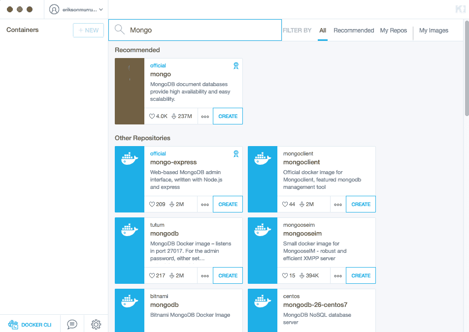
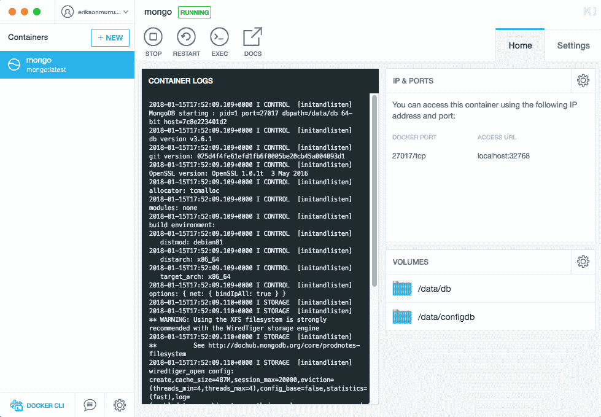
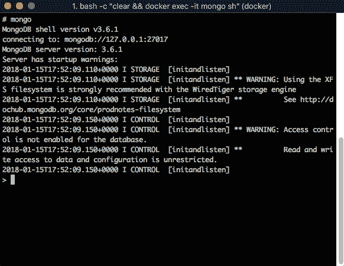
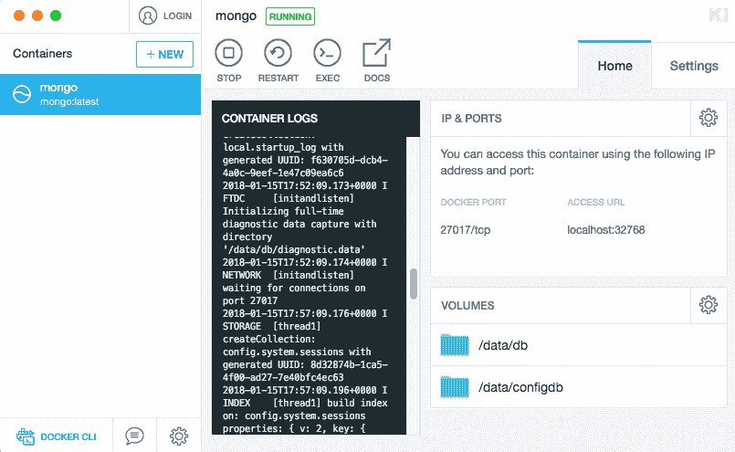

# 第六章：在 MongoDB 中存储我们的数据

你每天使用的所有应用程序都将它们的信息存储在数据库中。数据库允许你为用户提供最佳体验。想象一下，如果没有数据库，你的用户可能会遇到多么困难。例如，想象你购买了一部新的 iPhone，需要将你的 Instagram 账户中的所有联系人添加到你的新手机上。如果没有数据库，你需要复制所有联系人信息并将其本地添加到新设备上。这听起来可能很荒谬，但这就是没有数据库的世界可能的样子。

学习如何创建能够连接到数据库并存储信息的应用程序非常重要。因此，现在你将学习如何使用 MongoDB 作为你的 NoSQL 数据库，以及如何使用名为 Mongoose.js 的最受欢迎的库之一将我们的后端与之集成。

在本章中，我们将涵盖以下主题：

+   NoSQL 数据库

+   介绍 MongoDB

+   MongooseJS

+   将我们的 API 与 MongoDB 集成

# NoSQL 数据库

全球的大公司都在使用 NoSQL 数据库来提供用户在使用应用程序时期望的速度；例如，Facebook、Amazon 和 Google 都在使用它们。然而，为什么这些数据库如此特别？为了回答这个问题，让我们看看 SQL 和 NoSQL 数据库之间的区别：

| **SQL 数据库** | **NoSQL 数据库** |
| --- | --- |
| 基于表格和硬结构化 | 不基于表格 |
| 鼓励规范化 | 鼓励非规范化 |
| 需要模式 | 无模式 |
| 快速 | 超快速 |
| 可扩展性难以实现 | 可扩展性极其容易实现 |

当然，还有更多差异和好处，但讨论所有优点及其背后的科学超出了本书的范围。

重要的是要知道，有不同类型的 NoSQL 数据库来解决不同类型的挑战。让我们来了解一下它们。

# 文档数据库

这是最受欢迎的数据库之一，归功于 MongoDB 和 CouchDB。这种类型的数据库以 JSON 格式存储信息。由于这是一个键值存储，你可以保存包含数组、嵌套文档和其他不同数据类型的复杂对象。例如，你可以在 JSON 文档中保存以下 *人*：

```js
{
  "identification" : "PE0022458197",
  "name": {
    "firstName": "Jack",
    "LastName": "Ma"
  },
  "age": 45,
  "addresses": [ 
    {"country": "Peru", "address": "MyTown PE#32"},
    {"country": "China", "address": "OtherTown CH#44"}
  ]
  ...
}
```

正如你所见，你不需要在不同的文档（或 SQL 数据库中的表）中存储地址；你可以在同一个文档（或 SQL 数据库中的表）中完美地存储它们。

# 介绍 MongoDB

正如其官方网站所述，MongoDB 是一个开源的文档数据库，它具有你想要的可扩展性和灵活性，以及你需要的查询和索引。

MongoDB 使用集合来持久化一组 JSON 文档，文档的模式可能会随时间变化，而不会影响集合中存储的其他文档。当您在处理具有不同角色和用户的复杂应用程序时，无模式特性非常出色。一个用户可能会使用一些字段，而其他用户可能需要一些其他字段，但不需要用 null 值填充未使用的字段。相反，不需要的字段不会持久化到 JSON 文档中。

# 安装 MongoDB

您可以在其官方网站 [`www.mongodb.com`](https://www.mongodb.com) 上学习如何安装 MongoDB。我们强烈建议您在开发环境中使用 Docker 而不是在本地机器上安装 MongoDB。那么，让我们看看如何使用 Docker 容器安装 MongoDB。

首先，您需要从其官方网站下载 Docker，[`www.docker.com`](https://www.docker.com)。下载完成后，继续安装。如果您在 MacOS 或 Windows 上工作，Docker 还会安装另一个名为 **Kitematic** 的工具。安装完成后，在容器部分查找 mongo。然后，点击创建。看看下面的截图：



工具将下载镜像，一旦完成，它将运行 MongoDB 容器，并为我们提供 MongoDB 运行的宿主机和端口，如图所示：



对于使用 Linux 的用户，执行以下命令以创建 MongoDB 容器：

```js
> docker run -p 27017:27017 -v $(pwd)/data:data/db mongo
```

之前的命令将启动一个新的容器，并暴露其内部端口 `27017`，并将您的宿主机的 `data` 目录共享到容器中。通过这样做，我们可以将容器信息持久化到我们的宿主机文件系统中。

一旦我们的 MongoDB 数据库在 Docker 上运行，我们需要在 MongoDB 上进行一些实践。

# CRUD 操作

在我们将 API 集成到 MongoDB 之前，了解如何直接与 MongoDB 交互非常重要。因此，让我们学习如何使用 MongoDB 命令行工具执行基本的 CRUD 操作。为此，我们需要访问 MongoDB 容器的终端，但使用 Kitematic 非常简单。在容器的工具栏中，点击 exec 选项。这将启动一个连接到 MongoDB 容器终端的终端窗口。

当它启动时，输入 `mongo` 以进入 MongoDB CLI。看看下面的截图：



对于使用 Linux 的用户。您可以通过运行以下命令进入容器：

```js
$ docker exec -it mongo sh
```

太棒了！现在我们可以开始使用 MongoDB 了。

# 创建文档

要插入文档，首先我们指定 `collection` 名称，并通过调用 `insert` 方法传递 JSON 文档，如下所示：

```js
> db.collection_name.insert(JSON_Object)
```

让我们向 `teams` 集合插入第一个团队：

```js
> db.teams.insert({"code": "PER", 
  ... "name": "Peru", 
  ... "ranking": 11, 
  ... "captain": "Paolo Guerreo", 
  ... "Trainer": "Ricardo Gareca", 
  ... "confederation": "Conmebol"})

WriteResult({ "nInserted" : 1 })

```

行首的三个点代表新行或*Enter*键。

如果插入执行正确，你应该会收到包含其`nInserted`属性中插入的文档数量的`writeResult`响应。

# 检索文档

要检索文档列表，我们使用`find`方法。例如，运行以下查询以检索完整的球队列表：

```js
> db.teams.find()

{ "_id" : ObjectId("5a5cf1419afc8af268b9bb21"), "code" : "PER", "name" : "Peru", "ranking" : 11, "captain" : "Paolo Guerreo", "Trainer" : "Ricardo Gareca", "confederation" : "Conmebol" }
```

如你所见，一个新`_id`属性已被自动添加。这个属性被称为 JSON 文档的主键。这是一个自动生成的值，所以当你运行命令时，你将有一个不同的值。

随着时间的推移，球队的集合将不仅仅只有一个球队。那么，我们如何从集合中检索一个单独的球队呢？你还记得我们传递给`find`方法的`{}` JSON 对象吗？这个 JSON 对象用于查询集合。所以，如果我们想检索`Peru`队，我们必须执行以下查询：

```js
> db.teams.find({"code": "PER"})

{ "_id" : ObjectId("5a5cf1419afc8af268b9bb21"), "code" : "PER", "name" : "Peru", "ranking" : 11, "captain" : "Paolo Guerreo", "Trainer" : "Ricardo Gareca", "confederation" : "Conmebol" }
```

注意，我们可以传递 JSON 文档中使用的任何字段。例如，你可以使用`name`、`ranking`、`captain`等等。

# 更新文档

要更新文档，我们使用`updateOne`或`updateMany`方法。例如，让我们更新`Peru`队的`排名`属性。执行以下代码：

```js
> db.teams.updateOne({"code": "PER"}, {$set: {"ranking": 1}})

{ "acknowledged" : true, "matchedCount" : 1, "modifiedCount" : 1 }
```

语法看起来有点奇怪，但并不是。你可能的第一个问题是为什么我们需要`$set`？我们需要`$set`来指定我们想要更新的字段。否则，你会替换整个文档。考虑以下示例：

首先，让我们列出我们的球队集合，以查看第一次更新的反映：

```js
> db.teams.find({"code": "PER"})

{ "_id" : ObjectId("5a5cf1419afc8af268b9bb21"), "code" : "PER", "name" : "Peru", "ranking" : 1, "captain" : "Paolo Guerreo", "Trainer" : "Ricardo Gareca", "confederation" : "Conmebol" }
```

此外，是的，`排名`字段已更新为`1`。现在让我们尝试不使用`$set`运算符来更新此文档：

```js
> db.teams.updateOne({"code": "PER"}, {"ranking": 1})

[thread1] Error: the update operation document must contain atomic operators :
```

注意，会抛出一个错误，并且没有进行任何更改。这对我们很有帮助，因为我们正在使用`updateOne`方法，但还有一个名为`update`的方法，如果我们不正确使用它，会给我们带来麻烦。例如，运行以下代码：

```js
> db.teams.update({"code": "PER"}, {"ranking": 1})

WriteResult({ "nMatched" : 1, "nUpserted" : 0, "nModified" : 1 })
```

在此刻，当你意识到你忘记了`$set`运算符时，你已经失去了你队的资料。尝试找到`Peru`队：

```js
> db.teams.find({"code": "PER"})
```

没有显示结果。现在可能有一滴眼泪从你的脸颊滑落。有趣，对吧？

在更新或删除文档时要小心。这种类型的生产错误可能会让你失去职位。

# 删除文档

最后，要删除文档，我们使用`deleteOne`或`deleteMany`方法。例如，再次插入`Peru`队并运行以下代码：

```js
> db.teams.deleteOne({"code": "PER"})

{ "acknowledged" : true, "deletedCount" : 1 }
```

太好了！现在我们处于良好的状态，可以学习 Mongoose 以及如何将我们的 API 与 MongoDB 集成。继续阅读！！

我们建议您使用 GUI 工具来探索您的 MongoDB 数据。我们使用**Robo 3T**或 Robomongo。您可以从其官方网站[`robomongo.org`](https://robomongo.org)下载。

# MongooseJS

Mongoose.js 是最受欢迎的 NPM 模块之一，用于将 Node.js 应用程序与 MongoDB 数据库集成。它提供了一种简单的方式来建模我们的应用程序数据，并附带不同的内置功能来验证、转换和查询我们的数据库，避免样板代码。

我们将使用我们在上一节中安装的 MongoDB 容器。我们需要的信息是 MongoDB 运行的主机和端口。这些信息在 Kitematic 工具的 `Home/IP & Ports/Access URL` 部分显示。例如，在我的情况下，这些是 `localhost` 和 `32768`：



# 安装 Mongoose

要安装 Mongoose，我们将使用 NPM。因此，在你的终端中，导航到 `wc-backend` 项目并运行以下命令：

```js
$ npm install --save mongoose
```

安装完成后，我们需要进入 `src` 文件夹并创建一个名为 `config` 的新文件夹。在 `config` 文件夹中，现在创建一个名为 `mongoose-connection.js` 的新文件：

```js
$ cd src
$ mkdir config
$ touch config/mongoose-connection.js
```

现在我们已经安装了 Mongoose 并创建了配置文件，是时候编写一些代码来建立与 MongoDB 的连接了。

# 配置 Mongoose

这就是最精彩的部分开始的地方。因此，我们需要创建一个到 *数据库* 的连接；为此，打开 `mongoose-connection.js` 文件并应用以下更改：

```js
const mongoose = require('mongoose')

mongoose.connect('mongodb://localhost:32768/wcDb')

mongoose.Promise = global.Promise

mongoose.connection.on('connected', () => {
  console.log('connection is ready')
})

mongoose.connection.on('error', () => {
  console.log(err)
})

```

首先，我们导入 Mongoose 模块并将其托管到 `mongoose` 常量中。然后，我们调用 `connect` 函数并传递连接 URL，使用 *主机* 和 *端口* 指向我们的 MongoDB docker 容器。最后，我们告诉 mongoose 我们的数据库名称将是 `wcDb`。如果连接成功，将调用 `connected` 事件，并打印出 `connection is ready` 消息。让我们来测试一下；执行以下命令：

```js
$ node src/config/mongoose-connection.js

connection is ready
```

太棒了！我们的 Node.js 模块能够使用 Mongoose 成功地与 MongoDB 建立连接。现在我们需要定义模式、模型和集合。继续阅读！

# 定义模式

要在我们的数据库中存储信息，我们需要创建一个模型，这个模型是基于初始模式定义创建的。这个模式定义包含了我们想要存储的信息的属性和数据类型。让我们为我们的团队集合定义模式。在同一个 `mongoose-connection.js` 文件中，添加以下代码：

```js
...
const TeamSchema = new mongoose.Schema({
  name: String,
  ranking: Number,
  captain: String,
  trainer: String,
  confederation: String
})
```

如您所见，定义模式很简单。我们使用 `mongoose.Schema` 对象，并将我们想要为模式定义的字段作为 JSON 对象定义。

# 数据类型

如同其他数据库引擎，字段应该使用数据类型定义。以下都是有效的类型：

+   `字符串`

+   `日期`

+   `数字`

+   `布尔值`

+   `数组`

+   `ObjectId`

+   `缓冲区`

+   `混合`

也许你对列出的几乎所有数据类型都很熟悉。`Mixed`数据类型基本上允许你定义一个字段，其值可以是任何数据类型。个人来说，我们不推荐使用这种数据类型，因为维护一个`Mixed`字段可能会变得困难，你可能需要编写样板代码来使用它。

# 验证

Mongoose 自带几个内置验证器。一些验证器存在于所有数据类型中，而一些则仅针对特定数据类型。例如，`String`字段将具有`min`和`max`验证器，但`Boolean`类型则没有。

让我们在`Team`模式中添加一些验证。打开`mongoose-connection.js`文件并应用以下更改：

```js
...
const TeamSchema = new mongoose.Schema({
  name: {
    type: String,
    min: 3,
    max: 100,
    required: true,
    unique: true
  },
  ranking: {
    type: Number,
    min: 1
  },
  captain: {
    type: String,
    required: true
  },
  Trainer: {
    type: String,
    required: true
  },
  confederation: {
    type: String,
    required: true,
    uppercase: true
  }
})
```

现在，我们的模式看起来更专业，这将帮助我们验证在 MongoDB 中持久化之前的数据。大多数验证器都是自解释的。正如你可能已经注意到的，当你想要应用验证器时，声明字段的语法会略有变化；在这种情况下，应该传递一个 JavaScript 对象来定义数据类型和验证器。要了解更多关于验证器的信息，请访问[`mongoosejs.com/docs/validation.html`](http://mongoosejs.com/docs/validation.html)。

# 创建模型

现在我们有了我们的模式，是时候告诉 Mongoose 我们想要使用该模式来创建新对象，以便将它们发送到 MongoDB。为此，我们需要通过传递已定义的模式来创建一个模型。打开`mongoose-connection.js`文件并添加以下代码：

```js
...
const Team = mongoose.model('team', TeamSchema)
```

信不信由你，我们只需要这一行代码就能将我们的模式与 MongoDB 接口。在这一行中，我们告诉 Mongoose 我们想要将我们的集合称为`team`。调用`mongoose.model`的结果将是一个对象，它是模型；我们将使用这个对象来创建新的实例。`Team`对象还包含内置的 CRUD 方法，因此我们将使用它们来创建对数据库的 CRUD 操作。

为了测试一下，让我们创建`Peru`团队并将其保存在我们的数据库中。在同一文件中，添加以下更改：

```js
...
const peruTeam = new Team({
  name: 'Peru',
  ranking: 11,
  captain: 'Paolo Guerrero',
  Trainer: 'Ricardo Gareca',
  confederation: 'Conmebol'
})

peruTeam.save((err, data) => {
  if (err)
    throw err

  console.log("Team was created with the Id", data._id)
})
```

首先，我们使用之前创建的`Team`模型实例创建`peruTeam`对象。每个新实例都包含内置函数。调用内置的`save`函数将`peruTeam`保存在数据库中。定义了一个回调来处理操作的结果。如果一切顺利，将显示一个显示新生成 ID 的消息。因此，执行以下命令来测试一下：

```js
$ node src/config/mongoose-connection.js

connection is ready
Team was created with the Id 5a5f8e5c34a28e049c026ed6
```

太棒了！现在我们准备好开始将我们的数据库模块和 RESTful API 进行集成。继续阅读吧！！

# 将我们的 API 与 MongoDB 集成

到这里就完成了！现在是时候实现我们的 Teams Rest 控制器了。为此，我们将开始解耦具有与 MongoDB 数据库通信逻辑的所有逻辑的 Team 模型。一旦 Team 模型重构完成，我们将在 Team Rest 控制器中开始实现代码以实现以下 CRUD 操作：

+   列出所有团队

+   创建新的团队

+   更新现有团队

+   删除团队

让我们动手解决吧！

# 解耦团队模型

我们在根项目目录中创建了一个 `models` 文件夹。在这个文件夹中，我们将创建我们应用程序的所有模型。开始在 `src`/`models` 文件夹中创建 `team.js` 文件：

```js
$ touch src/models/team.js
```

记住我们使用 `touch` 命令创建一个新文件。然后，打开这个文件，并从 `src/config/mongoose-connection.js` 文件中剪切以下行并将它们复制到 `src/models/team.js` 文件中，如下所示：

```js
const mongoose = require('mongoose')

const TeamSchema = new mongoose.Schema({
    name: {
      type: String,
      min: 3,
      max: 100,
      required: true,
      unique: true
    },
    ranking: {
      type: Number,
      min: 1
    },
    captain: {
      type: String,
      required: true
    },
    Trainer: {
      type: String,
      required: true
    },
    confederation: {
      type: String,
      required: true,
      uppercase: true
    }
  })

  module.exports = mongoose.model('team', TeamSchema)
```

我们只需要隔离 `TeamSchema` 定义，然后我们将导出 mongoose 创建的模型，以便稍后由 Rest 控制器访问。确保你的 `src/config/mongoose-connection` 文件看起来如下：

```js
const mongoose = require('mongoose')
mongoose.connect('mongodb://localhost:32768/wcDb', { useMongoClient: true })
mongoose.Promise = global.Promise

mongoose.connection.on('connected',() => {
  console.log('connection is ready')
})

mongoose.connection.on('error', err => {
  console.log(err)
})
```

太好了！到目前为止，一切顺利。现在是时候实现我们的 Rest 控制器了。

# 实现 Rest 控制器

隔离业务逻辑始终是一个好的实践；因此，我们不会直接从 Rest 控制器调用模型。

# 连接应用

让我们先调用 `mongoose-connection` 模块来打开与 MongoDB 的连接。打开 `server.js` 文件并应用以下更改：

```js
const express = require('express')
const bodyParser = require('body-parser')
const teamsApi = require('./src/routes/teams-api')
const mongooseConfig = require('./src/config/mongoose-connection')
const app = express()

app.use(bodyParser.json())
app.use(teamsApi)
...
```

这就是我们建立新连接所需的所有内容。`mongoose-connection` 文件包含打开 MongoDB 连接的逻辑，所以我们不需要编写更多代码。

# 创建一个新的团队

要创建一个新的团队，我们需要调用由 Mongoose 提供的模型内置方法。`save` 函数用于创建和更新任何模型的字段。因此，我们首先将开始将 `Team` 模型导入到 `src/routes/teams-api.js` 文件中，如下所示：

```js
const express = require('express')
const api = express.Router()
const Team = require('../models/team')

let teams = [
    { id: 1, name: "Peru"},
    { id: 2, name: "Russia"}
]
...
```

现在我们已经使用 `require` 函数导入了模块并将其存储在 `Team` 常量中，我们可以用它来创建一个新的团队。让我们修改 Rest 控制器的 `POST HTTP` 方法：

```js
...
api
  .route('/teams')
  .get((req, res) => {
    res.json(teams)
  })
  .post((req, res, next) => {
    let team = new Team(req.body)

 team.save()
 .then(data => res.json(data))
 .catch(err => next(err) )
  })
...
```

需要注意的第一个更改是函数中的 `next` 参数。此参数用于在 Mongoose 无法创建新团队时向 express 抛出错误。然后，我们创建一个新的团队，通过 `req` 对象的 `body` 参数调用 `save` 函数。`save` 函数返回一个 `Promise`，它只是一个异步调用，当成功完成时，将在 `then` 方法中返回新保存到 `Team` 的信息。一旦我们有了数据，我们就以 `JSON` 类型将信息发送给客户端。

让我们测试一下。首先，我们需要通过执行 `node server.js` 来启动服务器，然后我们将使用 cURL 来测试这个端点。打开你的终端并运行以下命令：

```js
$ curl -X POST -H 'Content-type: application/json' -d '{"code": "GER", "name": "Germany", "ranking": 8, "captain": "Paolo Guerreo", "Trainer": "Ricardo Gareca", "confederation": "Conmebol"}' http://localhost:3000/teams

{"__v":0,"name":"Germany","ranking":8,"captain":"Paolo Guerreo","Trainer":"Ricardo Gareca","confederation":"CONMEBOL","_id":"5a662fbf728726072c6298fc"}
```

如果一切顺利，你应该会看到响应包含自动生成的 `_id` 属性的 JSON 对象。让我们看看再次运行它会发生什么：

```js
$ curl -X POST -H 'Content-type: application/json' -d '{"code": "PER", "name": "Peru", "ranking": 11, "captain": "Paolo Guerreo", "Trainer": "Ricardo Gareca", "confederation": "Conmebol"}' 

http://localhost:3000/teams

MongoError: E11000 duplicate key error collection: wcDb.teams index: name_1 dup key: { :\"Peru\" }
...

```

现在我们收到一个丑陋的错误，说我们遇到了重复键错误。为什么会这样？让我们从我们之前定义的模型模式中找到答案。打开 `src/models/team.js` 文件：

```js
const mongoose = require('mongoose')

const TeamSchema = new mongoose.Schema({
    name: {
      type: String,
      min: 3,
      max: 100,
      required: true,
      unique: true
    },

...
```

热狗！你找到了答案。我们遇到的问题是因为我们定义了 `name` 属性为 `unique:true`。

我们需要在消息中修复一些内容。我们期望从 REST API 接收 JSON 响应，所以让我们在我们的后端配置一个全局异常处理器，将错误作为 JSON 对象发送，而不是一个丑陋且难以理解的 HTML 页面。打开`server.js`文件并应用以下更改：

```js
const express = require('express')
const bodyParser = require('body-parser')
const teamsApi = require('./src/routes/teams-api')
const mongooseConfig = require('./src/config/mongoose-connection')
const app = express()

app.use(bodyParser.json())
app.use(teamsApi)

app.use((err, req, res, next) => {
 return res.status(500).send({ message: err.message })
})

app.listen(3000, () => {
    console.log('running on port: 3000')
})
```

我们定义了一个全局中间件，它是一个期望四个参数的函数：

+   `err`: 如果没有抛出错误，则包含`null`；否则，它是一个错误实例或另一个值

+   `req`: 客户端发送的源请求

+   `res`: 响应属性

+   `next`: Express.js 将调用的下一个操作的引用

如预期，所有错误都会返回一个不同于`200`的 HTTP 状态。在我们定义其他 CRUD 操作的正确状态之前，让我们默认使用`status(500)`。现在，让我们再次运行它并看看会发生什么：

```js
$ curl -X POST -H 'Content-type: application/json' -d '{"code": "PER", "name": "Peru", "ranking": 11, "captain": "Paolo Guerreo", "Trainer": "Ricardo Gareca", "confederation": "Conmebol"}' http://localhost:3000/teams

{"error":"E11000 duplicate key error collection: wcDb.teams index: name_1 dup key: { : \"Peru\" }"}
```

如您所见，我们接收了一个包含单个`error`属性的 JSON 对象。太棒了！让我们继续学习如何检索完整的团队列表。

# 列出团队

要检索完整的团队列表，我们将使用 GET HTTP 方法。让我们先稍微清理一下我们的代码。到目前为止，我们一直在使用一个团队数组；我们不再需要它了，所以让我们将其删除。在`src/routes/teams-api.js`中，应用以下更改：

```js
...

api
  .route('/teams')
  .get((req, res) => {
    // TODO
  })
  .post((req, res, next) => {
    let team = new Team(req.body)
    team.save()
      .then(data => res.json(data))
      .catch(err => next(err) )
  })

api
  .route('/teams/:id')
  .get((req, res) => {
      // TODO
  })
  .put((req, res) => {
    // TODO

  })
  .delete((req, res) => {
    // TODO
  })

...
```

现在我们已经清理了代码，添加以下更改以实现检索完整团队列表的逻辑：

```js
...
api
  .route('/teams')
  .get((req, res, next) => {
    Team.find()
 .then(data => res.json(data))
 .catch(err => { next(err) })
  })
  .post((req, res, next) => {
    let team = new Team(req.body)
    team.save()
      .then(data => res.json(data))
      .catch(err => { next(err) } )
  })
...
```

首先，我们调用`find`方法以返回一个`Promise`，作为创建新团队时使用的`save`函数。由于它是一个`Promise`，我们将从数据库返回的数据接收进**`then`**函数，如果出现问题，它将在`catch`函数中返回一个错误。让我们测试它：

```js
$ curl http://localhost:3000/teams

[{"_id":"5a662fbf728726072c6298fc","name":"Peru","ranking":11,"captain":"Paolo Guerreo","Trainer":"Ricardo Gareca","confederation":"CONMEBOL","__v":0}]
```

太棒了！现在我们能够使用我们刚刚实现的`api`检索团队列表。让我们继续！

# 查找一个单个团队

要查找单个团队，我们将使用`findById`内置方法，并将一个有效的 ID 传递给它。因此，应用以下更改：

```js
api
  .route('/teams/:id')
  .get((req, res, next) => {
      let id = req.params.id

 Team.findById(id)
 .then(data => res.json(data))
 .catch(err => next(err))
  })
  .put((req, res) => {
    // TODO

  })
  .delete((req, res) => {
    // TODO
  })
```

首先，我们从`req.params`对象中提取 ID。请注意，我们不是使用`/teams`路由。相反，我们使用的是`/teams/:id`路由。这意味着 Express.js 将把`id`属性作为`params`对象中的一个元素注入。然后，我们调用`findById`方法并将响应发送给客户端。让我们测试它：

```js
$ curl http://localhost:3000/teams/5a662fbf728726072c6298fc

{"_id":"5a662fbf728726072c6298fc","name":"Peru","ranking":11,"captain":"Paolo Guerreo","Trainer":"Ricardo Gareca","confederation":"CONMEBOL","__v":0}
```

太棒了！它正在工作。请注意，我们正在使用一个现有的 ID——`5a662fbf728726072c6298fc`。这个值对您来说将是不同的。要获取一个有效的值，只需调用`/teams`端点以列出所有您的团队，然后复制并替换`_id`属性中的值。

现在，如果我们传递一个无效的 ID 会发生什么？让我们测试它：

```js
$ curl http://localhost:3000/teams/5a662fbf728726072c629233

null
```

现在检索到一个`null`值。根据我们的 API 文档，我们必须返回`HTTP 404`状态来表示未找到响应。因此，为了做到这一点，我们需要验证`findById`方法的结果，并在收到 null 响应时引发错误。请继续并应用以下更改：

```js
...
api
  .route('/teams/:id')
  .get((req, res, next) => {
      let id = req.params.id
      Team.findById(id)
        .then(data => {
          if (data === null) {
 throw new Error("Team not found")
 }

          res.json(data)
        })
        .catch(err => { next(err) })
  })
  ...
```

现在这个实现中，如果我们收到一个`null`，我们将引发一个错误，这个错误将由我们的全局错误处理器处理，它会发送一个包含错误信息的 JSON 对象。让我们测试一下：

```js
$ curl http://localhost:3000/teams/5a662fbf728726072c629233

{"error":"Team not found"}
```

最后，我们需要修改我们的错误处理器，将 HTTP 状态码更改为`404`。在`server.js`文件中，应用以下更改：

```js
...
app.use((err, req, res, next) => {
    let status = 500

 if (err.message.match(/not found/)) {
 status = 404
 }

 return res.status(status).send({ error: err.message })
})
...
```

首先，我们声明一个`STATUS`变量并将其默认值设置为`500`。然后，我们应用正则表达式验证来检查消息是否包含`not found`字符串。如果是这样，`STATUS`将更改为`404`。所以，让我们再次测试它，在`curl`命令中添加`-v`标志来查看 HTTP 状态：

```js
curl http://localhost:3000/teams/5a662fbf728726072c629233 -v
...
>
< HTTP/1.1 404 Bad Request
...
{"error":"Team not found"}
```

就这样！现在，我们准备好学习如何更新一个`team`了。

# 更新团队

要更新我们的`teams`，首先我们需要使用路径中提供的`ID`在我们的数据库中查找现有的团队。如果找到一个团队，我们将对`team`对象应用更改。所以，让我们开始添加以下代码：

```js
api
  .route('/teams/:id')
  .get((req, res, next) => {
     ...
  })
  .put((req, res, next) => {
    let id = req.params.id 

 Team.findById(id)
 .then(data => {
 if (data == null) {
 throw new Error("Team not found")
 }
 return data
 })
 .then(team => {
 // We found the team. 
 // Code to update goes here!
 })
 .catch(err => next(err))

  })
  .delete((req, res) => {
    // TODO
  })
...
```

首先，我们从端点中提取传递的`id`。然后，我们调用`findById`方法来查找现有的团队。如果找到一个有效的团队，我们将有一个作为参数的`team`对象。否则，将抛出一个错误。

如您所见，我们需要向我们的逻辑中添加更多的代码行。现在，是时候从`req.body`对象中提取值并修改找到的`team`了：

```js
...
  .put((req, res, next) => {
    let id = req.params.id
    let teamBody = req.body

    Team.findById(id)
      .then(data => {
        if (data == null) {
          throw new Error("Team not found")
        }
        return data
      })
      .then(team => {
         team.code = teamBody.code || team.code
 team.name = teamBody.name || team.name
 team.ranking = teamBody.ranking || team.ranking
 team.captain = teamBody.captain || team.captain
 team.trainer = teamBody.trainer || team.trainer
 team.confederation = teamBody.confederation || team.confederation

      })
      .catch(err => {
        next(err)
      })

  })
...
```

我们创建了一个`teamBody`变量来存储`req.body`数据。然后，我们将这些值转换为`team`对象。我们使用`||`运算符；如果这个值在请求体中发送，这个运算符将分配`teamBody.code`。否则，它将分配给`team`对象相同的值。通过这种方式，我们只能在值被发送时更改这些值。

现在，为了将其保存到数据库中，我们将调用保存方法，就像我们编写创建新`Team`的逻辑时做的那样：

```js
... 
.put((req, res, next) => {
    let id = req.params.id
    let teamBody = req.body

    Team.findById(id)
      .then(data => {
        if (data == null) {
          throw new Error("Team not found")
        }
        return data
      })
      .then(team => {
        team.code = teamBody.code || team.code
        team.name = teamBody.name || team.name
        team.ranking = teamBody.ranking || team.ranking
        team.captain = teamBody.captain || team.captain
        team.trainer = teamBody.trainer || team.trainer
        team.confederation = teamBody.confederation || team.confederation

        return team.save()
      })
      .then(result => res.json(result))
      .catch(err => next(err))

  })
...
```

太棒了！现在我们已经实现了更新我们的`Team`实体的逻辑。让我们测试一下。执行以下命令：

```js
$ curl -X PUT -H 'Content-type: application/json' -d '{"ranking": 1}' http://localhost:3000/teams/5a662fbf728726072c6298fc

{"_id":"5a662fbf728726072c6298fc","name":"Peru","ranking":1,"captain":"Paolo Guerreo","Trainer":"Ricardo Gareca","confederation":"CONMEBOL","__v":0}
```

极好！现在我们能够更新`Team`实体。然而，你有没有注意到我们的代码有点难以组织？我们正在使用多个`Promise`实体来查找和保存一个产品。如果我们需要执行更多的异步操作会发生什么？迟早，我们会有很多`then`指令的代码，这可能很难维护和理解。但是，别担心！async/await 来拯救这一天！继续阅读。

# async/await 指令

async 和 await 是两个指令，它们可以帮助我们从`Promise`混乱中拯救我们的生命。这将允许我们使用异步语法编写异步代码。让我们组织我们的代码，看看它是如何工作的！

首先，我们需要为更新过程创建一个新的函数，如下所示：

```js
...
const Team = require('../models/team')

const updateTeam = async (id, teamBody) => {
  try {
    let team = await Team.findById(id)

    if (team == null) throw new Error("Team not found")

    team.code = teamBody.code || team.code
    team.name = teamBody.name || team.name
    team.ranking = teamBody.ranking || team.ranking
    team.captain = teamBody.captain || team.captain
    team.trainer = teamBody.trainer || team.trainer
    team.confederation = teamBody.confederation || team.confederation

    team = await team.save()
    return team

  } catch (err) {
    throw err
  }
}

api
  .route('/teams')
...
```

在前面的代码中，首先要注意的是`async`关键字。这个关键字会将返回的结果包装成一个`Promise`，并允许我们使用`await`关键字。你无法在非异步函数中使用`await`关键字。`await`关键字将等待异步调用`Team.findById(id)`结束，并返回结果。当我们调用`team.save()`方法时，也会发生同样的事情。

使用 async-await 帮助我们避免`Promise`混乱。它为我们提供了一个可能看起来像异步执行的执行流程。

一旦我们定义了`updateTeam`异步函数，我们需要修改我们的`PUT`端点来调用这个新函数：

```js
...
  })
  .put((req, res, next) => {
 updateTeam(req.params.id, req.body)
 .then(team => res.json(team))
 .catch(err => next(err))

  })
  .delete((req, res) => {
    // TODO
  })
...
```

我们说过`async`会将结果包装成一个`Promise`，因此要使用这个结果，我们需要使用`then`和`catch`方法来处理返回的`Promise`。

就这样！现在我们准备好学习如何删除现有的对象了。

# 删除团队

删除一个团队非常简单。为此，我们将调用`Team`模型的内置`remove`方法。添加以下代码：

```js
...
.delete((req, res, next) => {
    let id = req.params.id

 Team.remove({_id: id})
 .then(result => res.json(result))
 .catch(err => next(err))
  })

module.exports = api
```

现在，让我们测试一下。执行以下命令：

```js
$ curl -X DELETE http://localhost:3000/teams/5a662fbf728726072c6298fc

{"n":1,"ok":1}
```

现在的输出略有不同；我们收到了一个包含两个参数的 JSON 对象：

+   `n`：被删除的文档数量

+   `ok`：如果操作成功则为`1`，如果不成功则为`0`

太棒了！现在我们有了管理团队的 Rest API，但我们的 API 中缺少一个关键部分，那就是安全性。我们将在后续章节中添加认证和授权层来使我们的 API 更安全。继续阅读！

# 概述

在本章中，你学习了什么是数据库以及 SQL 数据库和 NoSQL 数据库之间的区别。我们还实现了将信息持久化到 MongoDB 数据库中的管理团队的 API。

你还学习了关于 async/await 的内容，我们能够编写更易于阅读和维护的异步逻辑。

在下一章中，我们将探索 Aurelia 的高级功能，以将我们的 REST API 集成到我们的 Aurelia Web 应用程序中。
