# 第十章：部署

现在我们知道了如何创建 Aurelia 应用程序，我们应该能够在自己的服务器上部署它们，或者如果你想利用其他大型公司的资源，为什么不使用云服务提供商来部署我们的应用程序呢？

在本章中，你将学习如何使用 Docker 和 NGINX 在你的自托管服务器上部署你的应用程序。此外，你还将学习如何在 Heroku 上部署应用程序以及地球上最好的云服务提供商之一——**亚马逊网络服务**（**AWS**）。

我们将使用 Docker 在本地部署，因为这会使我们的部署具有可移植性，这样你就可以在自己的数据中心或云中部署你的应用程序。

话虽如此，在本章中，我们将涵盖以下主题：

+   为我们的网站配置生产环境

+   在你的服务器上部署

+   在 Heroku 上部署

+   在 AWS S3 存储桶上部署

# 为我们的网站配置生产环境

在我们将应用程序部署到生产之前，我们应该准备和配置它。让我们创建一个示例 Aurelia 应用程序并将其部署。打开一个新的终端窗口并运行以下命令以启动一个新的`deployme`项目：

```js
$ au new deployme
 ...
 ...
 Happy Coding!

$ ls deployme/aurelia_project/environments
  dev.js  stage.js  prod.js
```

让我们导航到`aurelia_project/environments`文件夹。在这个文件夹中，你会找到以下文件，它们映射到特定的开发环境：

+   `dev.js`：包含开发阶段的配置。

+   `stage.js`：包含预发布阶段的配置。这个阶段也被称为**质量保证**（**QA**）。

+   `prod.js`：包含生产阶段的配置。在这个阶段，我们的应用程序正在被我们的最终用户使用。

让我们打开`dev.js`文件并检查开发阶段配置的内容：

```js
export default {
  debug: true,
  testing: true
};
```

配置文件是一个简单的 JSON 文件。正如你在`dev.js`文件中看到的那样，`debug`和`testing`属性为 true。这意味着在我们开发应用程序时，我们将能够调试和测试应用程序。让我们添加一个新的属性来看看它是如何工作的。在`dev.js`文件中，应用以下更改：

```js
export default {
  debug: true,
  testing: true,
  appTitle: 'DeployMe [dev]'
};
```

现在，让我们打开`prod.js`文件并查看应用程序应该如何配置为生产环境：

```js
export default {
  debug: false,
  testing: false
};
```

在生产中，我们不需要调试任何东西，我们也不测试我们的应用程序，所以我们必须禁用调试和测试，并将值设置为`false`。让我们创建`appTitle`属性，但这次使用生产环境的正确值：

```js
export default {
  debug: false,
  testing: false,
  appTitle: 'DeployMe'
};
```

现在，让我们对`app.js`文件应用以下更改，从环境`environment.js`配置文件中读取`appTitle`：

```js
import environmentConfig from './environment'

export class App {
  constructor() {
    this.appTitle = environmentConfig.appTitle;
  }
}
```

现在，让我们对`app.html`文件应用以下更改：

```js
<template>
  <h1>${appTitle}</h1>
  <p>
    Hello :)!
  </p>
</template>
```

一旦应用了更改，让我们运行应用程序，但这次让我们指定环境，以便查看应用程序的标题如何根据环境而变化。请运行以下命令以开发环境运行：

```js
$ au run --watch --env dev
  ...
  Application Available At: http://localhost:9000

```

在你的浏览器中导航到`http://localhost:9000`，你应该会看到以下图像类似的内容：

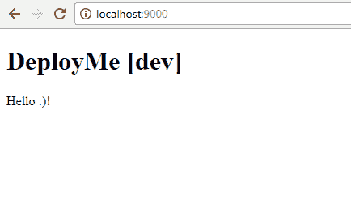

太棒了！现在让我们运行应用程序，但这次让我们将`(--env)`环境标志从`dev`更改为`prod`，以便创建生产版本：

```js
$ au run --env prod
  ...
 Application Available At: http://localhost:9000
```

在您的浏览器中导航到`http://localhost:9000`，您应该会看到以下类似图像：

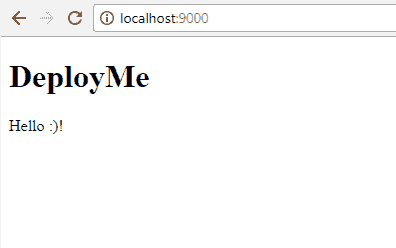

太棒了！我们几乎完成了生产版本。在我们部署应用程序之前，我们需要创建代码的压缩版本。为此，执行以下命令：

```js
$ au build --env prod
```

上述命令将在`scripts`文件夹中生成构建脚本，其中将包含准备就绪的 JavaScript 文件。这些文件被压缩以改善客户端浏览器的加载性能。我们将使用`dist`文件夹和`index.html`进行部署过程。基本上，Aurelia 应用程序的部署具有以下文件架构：

```js
./
   - index.html
   - dist/
     - app-bundle.js
     - vendor-bundles.js
```

JavaScript 文件的详细信息在第一章的“Aurelia CLI 部分”中提供，*介绍 Aurelia*。

太棒了！让我们学习如何部署我们的应用程序。继续阅读！

# 在自己的服务器上部署

到目前为止，我们已经准备好了生产文件，可以部署。典型的部署场景是当你想在本地服务器、本地计算机或内部企业服务器上部署你的 Web 应用程序时。这对那些想要管理和完全控制他们服务器的大公司来说是一种常见做法。所以，让我们学习如何使用 Docker 和 NGINX 作为我们的最佳盟友来完成这项工作。

# 创建我们的 NGINX 配置文件

NGINX 在我们部署中扮演的唯一角色是作为 Web 服务器，因此我们将为我们的服务器编写一个简单的配置文件。请前往项目根目录创建名为`default.conf`的文件：

```js
server {
    listen 80;
    server_name localhost;

    location / {
 root /usr/share/nginx/html;
 index index.html index.htm;
 }

    error_page 500 502 503 504 /50x.html;
}
```

让我们了解这个配置文件的作用。首先，我们告诉 NGINX 在端口`80`上`listen`。这意味着当我们想要访问我们的应用程序时，我们应该调用这个端口。其次，我们定义了 NGINX 将找到我们的应用程序文件的位置。我们必须将`scripts`文件夹和`index.html`文件复制到这个文件夹中。

太棒了！我们有了应用程序 Web 服务器的 NGINX 配置文件。让我们继续设置`Dockerfile`文件。

# 创建我们的 Dockerfile

我们的`Dockerfile`包含了构建 Docker 镜像的配方，其中包含了启动我们的 NGINX Web 服务器所需的所有配置，同时它还将包含必须复制到容器内的 Web 应用程序。请前往项目根目录创建名为`Dockerfile`的文件：

```js
FROM nginx:alpine

COPY default.conf /etc/nginx/conf.d/default.conf

COPY index.html /usr/share/nginx/html/index.html
COPY dist /usr/share/nginx/html/scripts
```

是的，就是这样！这是一个简单的 Docker 文件，它使用`nginx:alphine`作为其基础镜像。我们`COPY`了包含 NGINX 配置文件的`default.conf`文件，最后我们`COPY`了我们的 Web 应用程序文件。

就这样！让我们构建我们的 Docker 镜像并运行我们的第一个容器。

# 在 Docker 上运行我们的应用程序

在我们能够运行我们的应用程序之前，我们需要使用我们的 `Dockerfile` 创建一个 Docker 镜像。打开一个新的终端并导航到项目根目录。一旦到达那里，运行以下命令来构建我们的 Docker 镜像：

```js
$ cd /some/path/deployme
$ docker build -t mydeploymeapp .

Sending build context to Docker daemon 130.9MB
Step 1/4 : FROM nginx:alpine
Digest: sha256:17c4704e19a11cd47545fa3c17e6903fc88672021f7f907f212d6663baf6ab57
Status: Downloaded newer image for nginx:alpine
 ---> 91ce6206f9d8
Step 2/4 : COPY default.conf /etc/nginx/conf.d/default.conf
 ---> 0e744f0e2556
Step 3/4 : COPY index.html /usr/share/nginx/html/index.html
 ---> 092ad92d0d5c
Step 4/4 : COPY scripts /usr/share/nginx/html/scripts
 ---> 6d097542eec5
Successfully built 6d097542eec5
Successfully tagged mywebapp:latest 
```

我们使用 `docker build` 命令来构建一个新的镜像。`-t` 选项允许我们给我们的镜像命名，在这种情况下，我们的镜像名为 `mydeploymeapp`。注意最后一个命令参数中的点（`.`）；`docker build` 命令使用 `Dockerfile` 来构建新的镜像。我们在命令的最后一个选项中指定了这个 `Dockerfile` 的路径；由于这个文件位于我们运行 `docker build` 的根目录中，我们应该使用 *点* 符号来指定当前文件夹，在这个例子中，它包含 `Dockerfile`。

一旦构建过程完成，我们将看到 `Successfully built` 的消息。

现在，我们已经准备好启动我们的应用程序。运行以下命令以启动一个新的 `mydeploymeapp` Docker 容器：

```js
$ docker run -p 8000:80 mywebapp
```

我们使用了 `docker run` 命令来启动一个新的容器，并通过 `-p` 选项将我们的主机 `8000` 端口映射到容器内的 NGINX `80` 端口，该端口正在监听。最后一个参数是我们想要创建的 Docker 镜像，在这种情况下，是我们的应用程序镜像。

太棒了！我们的应用程序已经启动并运行。让我们导航到 `http://localhost:8000`，你应该会看到以下页面：

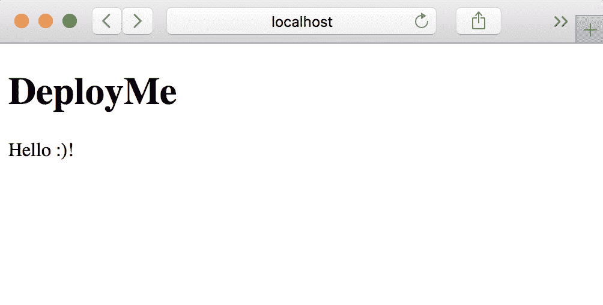

就这样！我们已经成功使用 Docker 和 NGINX 在本地服务器上部署了我们的 Aurelia 应用程序。您可以在远程服务器上安装 Docker 并按照本节中相同的步骤安装任何 Aurelia 应用程序。

在接下来的章节中，我们将学习如何将应用程序部署到云端。继续阅读！

# 在 Heroku 上部署

是时候利用云服务并开始寻找新的方法了。在本节中，我们将了解如何将我们的 Aurelia 示例应用程序部署到 Heroku。在开始部署过程之前，我们将按照以下步骤进行操作：

1.  创建 Heroku 账户

1.  准备我们的应用程序

1.  部署

让我们从第一步开始。

# 创建 Heroku 账户

导航至 [`heroku.com`](https://heroku.com) 并点击“免费注册”按钮。然后，填写您的账户信息。准备好后，我们需要安装 Heroku CLI。这个 CLI 将为我们提供一个易于使用的命令行工具，我们将使用它来部署我们的应用程序并在我们的应用程序上执行其他管理操作。

要下载 Heroku CLI，请导航至 [`devcenter.heroku.com/articles/heroku-cli`](https://devcenter.heroku.com/articles/heroku-cli)。选择您的操作系统并遵循安装说明。安装完成后，打开一个新的终端窗口并执行以下命令以登录到您的 Heroku 工作空间：

```js
$ heroku login

 Enter your Heroku credentials:
 Email: erikson.murrugarra@gmail.com
 Password: ***************
 Logged in as erikson.murrugarra@gmail.com
```

前面的命令将要求你提供在注册过程中使用的 `email` 和 `password`。提供你的凭证，如果一切正确，你将收到 `Logged in as ...` 的消息。

# 准备应用程序

Heroku，就像其他云服务提供商一样，不提供部署静态 HTML 文件的方式，因此我们需要使用另一种策略来部署我们的应用程序。我们将创建一个简单的 PHP 文件，它将作为入口点，其中包含一行代码来导入我们的 `index.html` 文件：

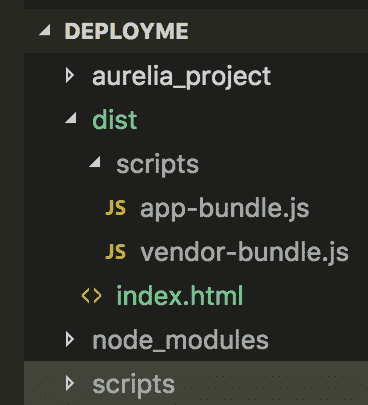

现在，在 `dist` 文件夹中，继续创建一个包含以下内容的 `index.php` 文件：

```js
<? 
  include_once("index.html");
```

我们使用 `invoke_once` 函数将 `index.html` 页面作为主页面导入。

# 部署

一旦我们有了应用程序的静态文件和 `index.php` 入口点文件，让我们创建一个新的 Heroku 应用程序。导航到 `dist` 文件夹并运行以下命令来 `init` 一个新的 Git 仓库：

```js
$ cd dist
$ git init
$ git add .
$ git commit -m "My Application commit"
```

我们使用 `git add` 后跟一个点（.）来将所有文件添加到暂存区。这意味着所有更改都将成为提交的候选内容。

一旦我们有了本地的 Git 仓库，让我们创建一个名为 `mydeploymeapp` 的新 Heroku 应用程序。执行以下命令：

```js
$ heroku apps:create deploymeapp

 Creating  deploymeapp... done
 https://deploymeapp.herokuapp.com/ | https://git.heroku.com/deploymeapp.git
```

我们使用 Heroku CLI 工具并调用 `apps:create` 选项来创建一个新的应用程序。你必须更改应用程序的名称，因为它们应该与其他应用程序的名称在全球范围内不同。一旦创建，Heroku 将响应并提供应用程序的 URL。

现在我们已经创建了应用程序，让我们将代码推送到 Heroku 创建的 Git 仓库以托管我们的应用程序代码并查看结果。执行以下命令：

```js
$ git push heroku master

Counting objects: 3, done.
...
remote:
remote: -----> PHP app detected
remote:
...
done.
To https://git.heroku.com/mydeploymeapp.git
 15cb66e..72d4d2a master -> master
```

如你所见，Heroku 将自动识别我们正在部署一个 PHP 应用程序，并将部署我们的应用程序。让我们继续前进并导航到你的应用程序的 URL；我的网址是 [`mydeploymeapp.herokuapp.com`](https://mydeploymeapp.herokuapp.com)：

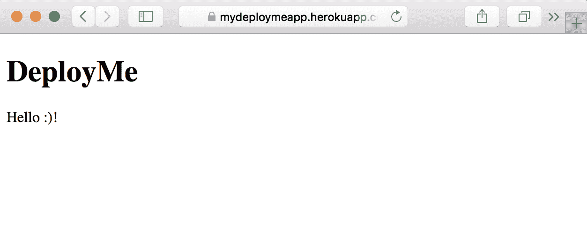

太棒了！现在我们知道了如何使用 Heroku 在 *云* 上部署我们的应用程序，让我们来看看我们如何使用另一个非常流行的云服务提供商来做这件事。我们将学习如何使用 **Amazon Simple Storage Service**（**Amazon S3**）来部署我们的网站。继续阅读！

# 在 AWS S3 存储桶上部署

AWS 是全球最大的云服务提供商之一。我们将学习如何使用 AWS S3 部署我们的 Aurelia 应用程序。是的，我没有疯！我们将不安装任何服务器或 **弹性云计算**（**Elastic Cloud Compute**，**EC2**）虚拟机实例来部署我们的应用程序。

# 上传文件

在我们开始这个过程之前，你需要在 AWS 上有一个账户。访问以下网址以创建你的免费账户—[`aws.amazon.com`](https://aws.amazon.com)。

一旦你完成了注册过程并登录到 AWS 控制台，请继续导航到 S3 服务仪表板，如下所示：

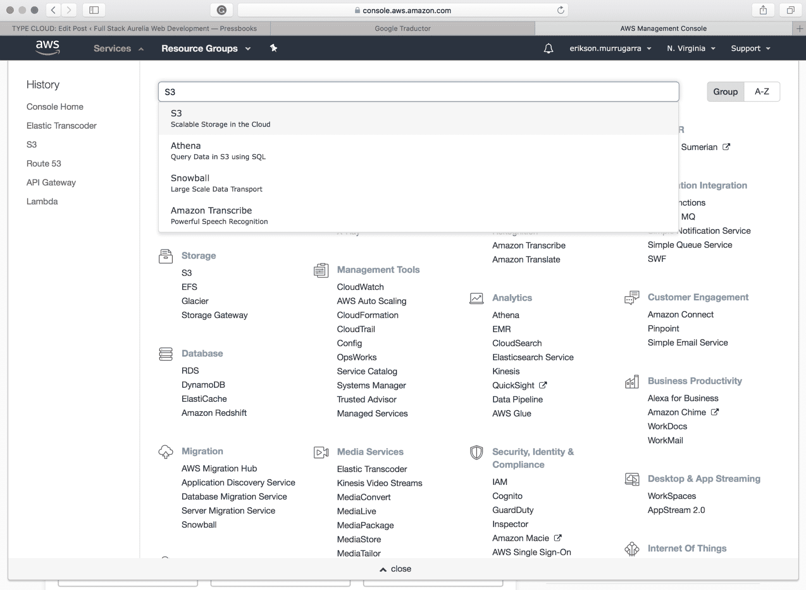

一旦加载了 S3 控制台，您将看到之前创建的所有 AWS 存储桶列表。如果没有，您将看到一个空列表。点击“创建存储桶”按钮创建一个新的存储桶，并以您的应用程序名称命名存储桶，然后点击“下一步”按钮接受默认设置：

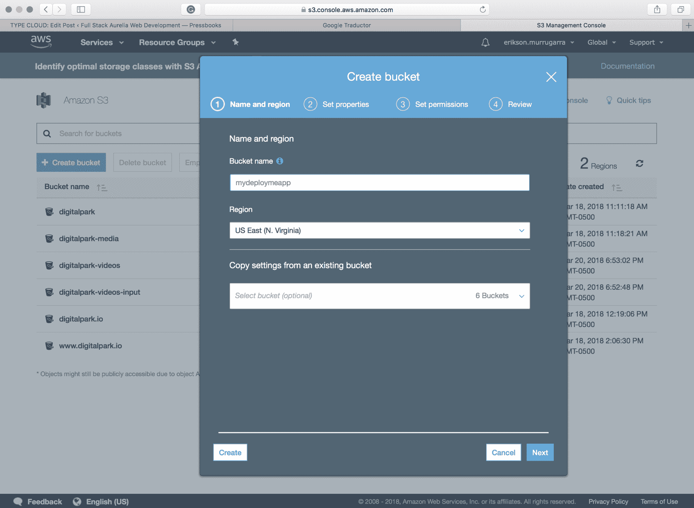

一旦创建，您应该会在列表中看到新的 S3 存储桶：

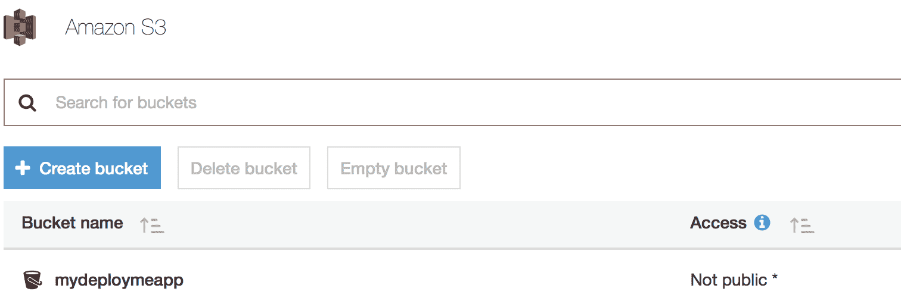

现在进入您的存储桶，通过点击“添加文件”按钮并选择文件来上传`index.html`文件到存储桶。提交文件时，别忘了授予公共读取权限：

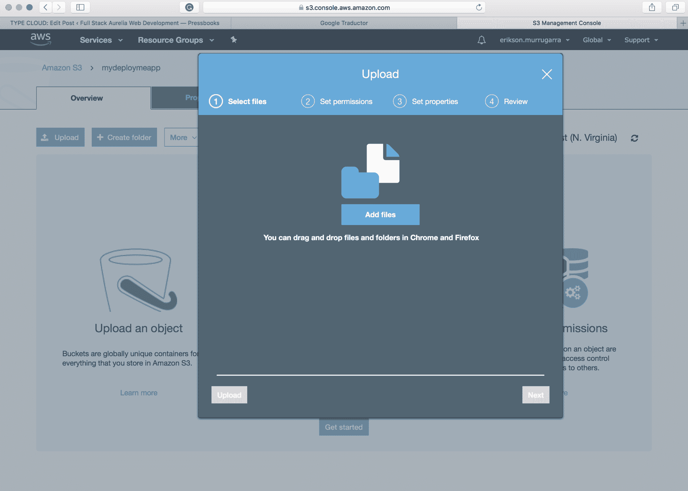

一旦我们选择了想要在 S3 中部署的 Web 应用程序文件，我们应该将这些文件设置为公开，这样 S3 就能够公开提供文件，否则我们的用户将无法访问我们的 Web 应用程序文件。为此，在“管理公共权限”下拉列表中选择“授予此对象（们）公共读取访问权限”选项，如图所示：

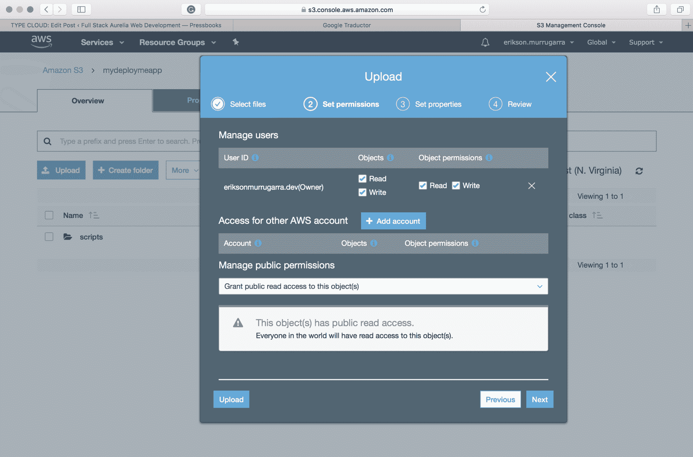

太棒了！要将内容上传到`script`文件夹，您需要在存储桶中创建一个脚本文件夹。为此，只需点击“创建文件夹”按钮。一旦创建了文件夹，请将`app-bundle.js`和`vendor-bundle.js`文件上传到 S3 脚本文件夹（别忘了授予公共权限）。

# 配置我们的 S3 存储桶以供网页使用

让我们配置我们的存储桶以充当网站存储桶。在这样做之前，让我们从我们的 Web 浏览器中访问我们的`index.html`文件。为此，选择`index.html`页面，并复制对象设置面板中出现的“链接”旁边的 URL：

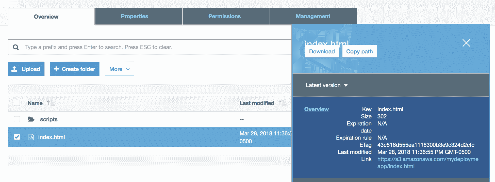

导航到提供的链接，您应该会看到您的 Web 应用程序正在运行：

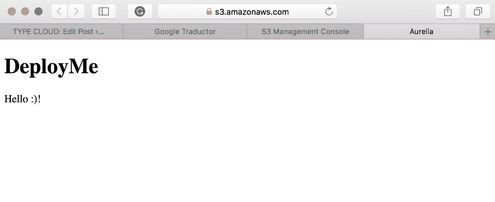

我们应该做最后一步。首先，请注意，URL 不友好，我们正在使用`index.html`文件访问 Web。这不是在 Amazon S3 上部署 Web 应用程序的正确方式。让我们配置我们的存储桶，使其明确成为 Web 存储桶。

让我们转到我们的存储桶中的“属性”选项卡，并选择静态 Web 主机选项。选择“使用此存储桶来托管网站”选项，将`index.html`作为索引页面，然后点击“保存”：

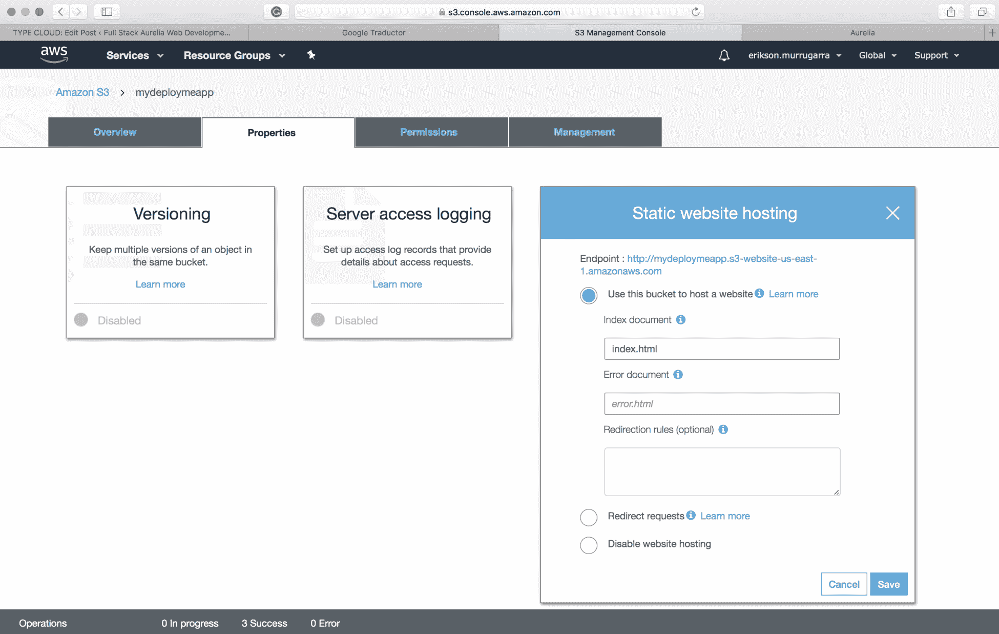

太酷了！现在我们准备好了。复制 AWS 提供的新 URL 并导航到它，以查看 Web 应用程序正在运行：

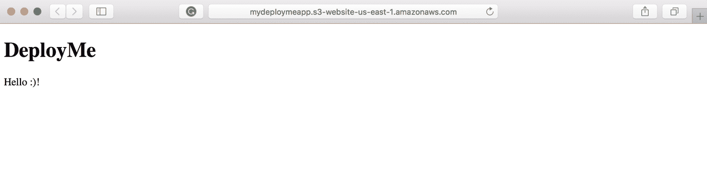

太棒了！您现在可以使用 S3 存储桶部署应用程序到 AWS，而无需提供任何虚拟服务器。恭喜您！

# 摘要

在本书的最后一章中，您学习了如何在自管理的或本地服务器上部署 Web 应用程序，以及如何利用云服务。

您学习了如何使用 Docker 来部署应用程序。使用 Docker 将帮助您在开发的各个阶段，所以我们强烈建议您购买一本 Docker 书籍，并立即开始学习它！

我们还介绍了如何在 Heroku 上部署应用程序。Heroku 是一个 **平台即服务**（**PaaS**），它会为您管理和监控应用程序。因此，您无需担心基础设施；您只需关注创建出色的应用程序即可。

最后，您了解了如何使用 AWS S3 存储桶来部署应用程序，无需进行任何虚拟服务器配置。

Aurelia 正变得越来越受欢迎，并被重要组织采用；现在是成为专家并为 Aurelia 将在革命性未来扮演的重要角色做好准备的时候了。另一方面，您对 Docker 和云计算的了解还不是很深入。我们鼓励您探索这些在 IT 领域极为重要的技术。

话虽如此，我们祝愿您在接下来的冒险中一切顺利。
