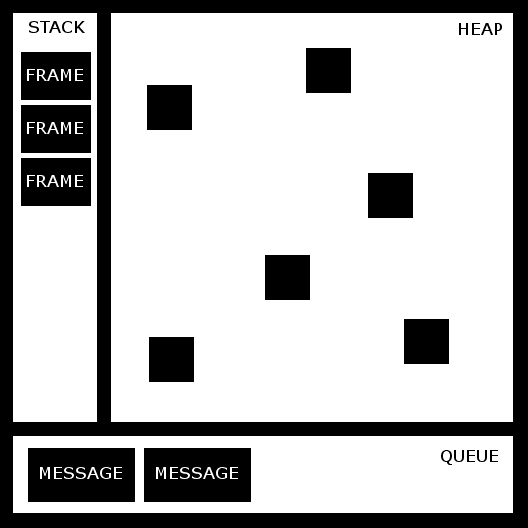

# 第四章：运行时 —— 事件循环和 this 操作符

在接下来的两章中，我们将学习一些与 TypeScript 运行时密切相关的概念。TypeScript 仅在设计时使用；TypeScript 代码随后被编译成 JavaScript，并在运行时执行。JavaScript 运行时负责 JavaScript 代码的执行。我们必须理解，我们永远不会执行 TypeScript 代码，我们总是执行 JavaScript 代码；因此，当我们提到 TypeScript 运行时，我们实际上是在谈论 JavaScript 运行时。

理解运行时至关重要，因为它将帮助我们理解本书后面将要探索的许多函数式编程技术的实现。

在本章中，我们将涵盖以下主题：

+   环境

+   事件循环

+   this 操作符

让我们从了解环境开始。

# 环境

在我们可以开始开发 TypeScript 应用程序之前，我们必须首先考虑运行时环境。一旦我们将 TypeScript 代码编译成 JavaScript，它就可以在许多不同的环境中执行。虽然这些环境中的大多数将是 Web 浏览器的一部分，如 Chrome、Internet Explorer 或 Firefox，但我们可能还希望能够在服务器端或桌面应用程序中运行我们的代码，例如 Node.js、RingoJS 或 Electron。

必须牢记，在运行时有一些变量和对象是特定于环境的。例如，我们可以创建一个库并访问`document.layers`变量。虽然`document`是 W3C **文档对象模型**（**DOM**）标准的一部分，但`layers`属性仅在 Internet Explorer 中可用，并且不是 W3C DOM 标准的一部分。

*W3C*将 DOM 定义为：

文档对象模型是一个平台和语言中立的接口，它将允许程序和脚本动态访问和更新文档的内容、结构和样式。文档可以进一步处理，并且处理结果可以合并回显示的页面。

类似地，我们也可以从浏览器运行时环境中访问一组称为**浏览器对象模型**（**BOM**）的对象。BOM 包括`navigator`、`history`、`screen`、`location`和`document`对象，这些都是`window`对象的部分属性。

我们需要记住，DOM 仅在 Web 浏览器中可用。如果我们想在 Web 浏览器中运行我们的应用程序，我们将能够访问 DOM 和 BOM。然而，在 Node.js 或 RingoJS 等环境中，这些 API 将不可用，因为它们是完全独立于 Web 浏览器的独立 JavaScript 环境。我们还可以在服务器端环境中找到其他对象（例如 Node.js 中的`process.stdin`），如果我们尝试在 Web 浏览器中执行我们的代码，这些对象将不可用。

我们还需要考虑到这些 JavaScript 环境存在多个版本。在某些情况下，我们必须支持多个浏览器和 Node.js 的各种版本。处理此问题时推荐的做法是使用条件语句来检查功能的可用性：

```js
if (Promise && typeof Promise.all === "function") {
    // User Promise.all here...
}
```

这是在检查环境或版本可用性之前执行的：

```js
if (
    navigator.userAgent.toLowerCase().indexOf('chrome') > -1 &&
    navigator.vendor.toLowerCase().indexOf("google") > -1
) {
    // Use Promise.all here...
}
```

有一个出色的库可以帮助我们在为浏览器开发时实现功能检测。这个库叫做**Modernizr**，可以在[`modernizr.com/`](http://modernizr.com/)下载。

# 理解事件循环

TypeScript 运行时（JavaScript）基于`事件循环`的并发模型。这个模型与其他语言（如 C 或 Java）中的模型相当不同。在专注于`事件循环`本身之前，我们必须首先理解一系列运行时概念。

以下是一些关键运行时概念的视觉表示：**堆（HEAP**），**栈（STACK**），**队列（QUEUE**）和**帧（FRAME**）：



我们现在将探讨这些运行时概念各自的作用。

# 帧结构

**帧**是工作的一个顺序单元。在上面的图中，帧由栈内的块表示。

当在 JavaScript 中调用`函数`时，运行时会创建一个帧在栈中。该帧包含该函数的参数和局部变量。当函数返回时，该帧将从栈中移除。让我们看一个例子：

```js
function foo(a: number): number {
    const localFooValue = 12;
    return localFooValue + a;
}

function bar(b: number): number {
    const localBarValue = 4;
    return foo(localBarValue * b);
}
```

在声明了`foo`和`bar`函数之后，我们调用`bar`函数：

```js
bar(21);
```

当`bar`函数执行时，运行时将创建一个新的帧，包含`bar`的参数以及所有局部变量（`b`和`localBarValue`）。然后，该帧（在上面的图中表示为黑色方块）被添加到栈的顶部。

在内部，`bar`函数调用了`foo`函数。当`foo`被调用时，会创建一个新的帧并将其分配到栈的顶部。当`foo`的执行完成（`foo`已返回）时，顶部帧将从栈中移除。当`bar`的执行也完成时，它也将从栈中移除。

现在，让我们想象一下如果`foo`函数调用了`bar`函数会发生什么：

```js
function foo(a: number): number {
    const localFooValue = 12;
    return bar(localFooValue + a);
}

function bar(b: number): number {
    const localBarValue = 4;
    return foo(localBarValue * b);
}
```

上述代码片段创建了一个永无止境的`函数调用`循环。每次函数调用都会向栈中添加一个新的帧，最终栈中将没有更多空间，并会抛出错误。大多数软件工程师都熟悉这种错误，称为**栈溢出（stack overflow）**错误。

# 栈

**栈**包含顺序步骤（帧）。栈是一种表示简单**后进先出（Last-in-first-out，LIFO）**对象集合的数据结构。因此，当帧被添加到栈中时，它总是被添加到栈的顶部。

由于堆栈是一个后进先出（LIFO）集合，`事件循环`从顶部到底部处理其中存储的帧。一个帧的依赖项被添加到堆栈的顶部，以确保每个帧的所有依赖项都得到满足。

# 队列

**队列**包含一个等待处理的列表。每个都与一个函数相关联。当堆栈为空时，从队列中取出一条消息进行处理。处理包括调用相关函数并将帧添加到堆栈中。当堆栈再次为空时，消息处理结束。

在之前的运行时图中，队列内的块代表消息。消息通常由用户或应用程序事件生成。例如，当用户在一个具有事件处理器的元素上点击时，会向队列中添加一条新消息。

# 堆

**堆**是一个不知道存储在其中的项目顺序的内存容器。堆包含当前正在使用的所有变量和对象。它还可能包含当前不在作用域内但尚未被垃圾回收器从内存中移除的帧。

# 事件循环

并发是同时执行两个或更多操作的能力。JavaScript 运行时在单个线程上执行，这意味着我们无法实现真正的并发。

**事件循环**遵循运行至完成（run-to-completion）的方法，这意味着它将在处理完任何其他消息之前，从开始到结束处理一条消息。

正如我们在第三章“掌握异步编程”中看到的，我们可以使用`yield`关键字和生成器来暂停函数的执行。

每次调用函数时，都会向队列中添加一条新消息。如果堆栈为空，则处理该函数（将帧添加到堆栈中）。

当所有帧都添加到堆栈中后，从顶部到底部清除堆栈。在处理过程结束时，堆栈为空，然后处理下一条消息。

Web 工作者可以在不同的线程中执行后台任务。它们有自己的队列、堆栈和堆。

`事件循环`的一个优点是执行顺序相当可预测且易于跟踪。这种方法的缺点是，如果一条消息处理时间过长，应用程序将变得无响应。遵循的一个好习惯是使消息处理尽可能短，如果可能的话，将一条消息拆分成几条消息。

Node.js 运行时结合了非阻塞 I/O 模型和单线程事件循环模型，这意味着当应用程序等待 I/O 操作完成时，它仍然可以处理其他事情，例如用户输入。

# `this`操作符

在 JavaScript 中，`this` 操作符的行为与其他语言略有不同。`this` 操作符的值通常由函数的调用方式决定。它的值在执行期间不能通过赋值来设置，并且每次函数调用时可能不同。

当使用 **strict** 和 **non-strict** 模式时，`this` 操作符也有一些不同之处。ECMAScript 5 的严格模式是一种选择进入 JavaScript 限制变体的方式。您可以在 [`developer.mozilla.org/en-US/docs/Web/JavaScript/Reference/Strict_mode`](https://developer.mozilla.org/en-US/docs/Web/JavaScript/Reference/Strict_mode) 上了解更多关于严格模式的信息。

# 全局上下文中的 this 操作符

在全局上下文中，`this` 操作符始终指向全局对象。在网页浏览器中，`window` 对象是全局对象：

```js
console.log(this === window); // true
this.a = 37;
console.log(window.a); // 37
console.log(window.document === this.document); // true
console.log(this.document === document); // true
console.log(window.document === document); // true
```

之前的示例应该使用 JavaScript 实现。如果启用了 `strict` 编译标志，TypeScript 中的前述代码将失败，因为 `strict` 标志启用了 `noImplicitThis` 标志，这阻止我们在值不明确的范围内使用 `this` 操作符，例如全局范围。

# 函数上下文中的 this 操作符

函数内部 `this` 的值取决于函数的调用方式。如果我们以非严格模式调用一个函数，函数内部的 `this` 值将指向全局对象：

```js
function f1() {
  return this;
}

f1() === window; // true
```

之前的示例应该使用 JavaScript 实现。如果启用了 `strict` 编译标志，TypeScript 中的前述代码将失败，因为它也启用了 `noImplicitThis` 标志。

然而，如果我们以严格模式调用一个函数，函数体内的 `this` 值将是 `undefined`：

```js
console.log(this); // global (window)

function f2() {
  "use strict";
  return this; // undefined
}

console.log(f2()); // undefined
console.log(this); // window
```

之前的示例应该使用 JavaScript 实现。

然而，在作为实例方法调用的函数内部，`this` 操作符的值指向实例。换句话说，在类（一个方法）中的函数内部的 `this` 操作符的值指向类实例：

```js
const person = {
  age: 37,
  getAge: function() {
    return this.age; // this points to the instance (person)
  }
};

console.log(person.getAge()); // 37
```

之前的示例应该使用 JavaScript 实现。

在前述示例中，我们使用了对象字面量表示法来定义一个名为 `person` 的对象，但使用类声明对象时也适用：

```js
class Person {
  public age: number;
  public constructor(age: number) {
    this.age = age;
  }
  public getAge() {
    return this.age; // this points to the instance (person)
  }
}

const person = new Person(37);
console.log(person.getAge()); // 37
```

之前的示例应该使用 TypeScript 实现。

在运行时，类（使用所谓的原型）作为原型链实现。如果您对原型了解不多，请不要担心，因为我们在下一章中会了解更多关于它们的内容。现在我们只需要知道，前述章节中描述的行为是在与原型一起工作时发生的：

```js
function Person(age) {
    this.age = age;
}

Person.prototype.getAge = function () {
    return this.age; // this points to the instance (person)
};

var person = new Person(37);
console.log(person.getAge()); // 37
```

之前的示例应该使用 JavaScript 实现。

当一个函数用作构造函数（使用 `new` 关键字）时，`this` 操作符指向正在构造的对象：

```js
function Person() { // function used as a constructor
  this.age = 37;
}

const person = new Person();
console.log(person.age); // logs 37
```

之前的示例应该使用 JavaScript 实现。

# call、apply 和 bind 方法

所有函数都从`Function.prototype`继承了`call`、`apply`和`bind`方法。我们可以使用这些方法来设置`this`的值。

`call`和`apply`方法几乎相同；两种方法都允许我们调用一个函数并在函数内部设置`this`操作符的值。`call`和`apply`之间的主要区别在于，虽然`apply`允许我们将参数作为数组传递给函数，但`call`要求显式列出函数参数。

一个有用的记忆法是 A（apply）代表数组，C（call）代表逗号。

让我们来看一个例子。我们首先声明一个名为`Person`的类。这个类有两个属性（`name`和`surname`）和一个方法（`greet`）。`greet`方法使用`this`操作符来访问实例属性`name`和`surname`：

```js
class Person {

  public name: string;
  public surname: string;

  public constructor(name: string, surname: string) {
    this.name = name;
    this.surname = surname;
  }

  public greet(city: string, country: string) {
    // we use the this operator to access name and surname
    let msg = `Hi, my name is ${this.name} ${this.surname}.`;
    msg += `I'm from ${city} (${country}).`;
    console.log(msg);
  }

}
```

在声明了`Person`类之后，我们将创建一个实例：

```js
const person = new Person("remo", "Jansen");
```

如果我们调用`greet`方法，它将按预期工作：

```js
person.greet("Seville", "Spain");
```

或者，我们可以使用`call`和`apply`函数来调用该方法。我们在两个函数中都提供了`person`对象作为第一个参数，因为我们想让`this`操作符（在`greet`方法内部）将`person`作为其值：

```js
person.greet.call(person, "Seville", "Spain");
person.greet.apply(person, ["Seville", "Spain"]);
```

如果我们提供一个不同的值作为`this`的值，我们就无法在`greet`函数内访问`name`和`surname`属性：

```js
person.greet.call(null, "Seville", "Spain");
person.greet.apply(null, ["Seville", "Spain"]);
```

前面的两个例子可能看起来没有用，因为第一个直接调用了函数，而第二个导致了意外的行为。`apply`和`call`方法只有在我们需要在函数调用时让`this`操作符取不同的值时才有意义：

```js
const valueOfThis = { name : "Anakin", surname : "Skywalker" };
person.greet.call(valueOfThis, "Mos espa", "Tatooine");
person.greet.apply(valueOfThis, ["Mos espa", "Tatooine"]);
```

`bind`方法可以用来设置`this`操作符（在函数内部）的值，无论它是如何被调用的。

当我们调用一个函数的`bind`方法时，它返回一个与原始函数具有相同主体和作用域的新函数，但`this`操作符（在主体函数内部）将永久绑定到`bind`的第一个参数，无论函数是如何被使用的。

让我们来看一个例子。我们首先将创建一个实例，这个实例是我们之前声明的`Person`类：

```js
const person = new Person("Remo", "Jansen");
```

然后，我们可以使用`bind`将`greet`函数设置为具有相同作用域和主体的新函数：

```js
const greet = person.greet.bind(person);
```

如果我们尝试使用`bind`和`apply`调用`greet`函数，就像我们之前的例子中做的那样，我们将能够观察到，这次`this`操作符将始终指向对象实例，无论函数是如何被调用的：

```js
greet.call(person, "Seville", "Spain");
greet.apply(person, ["Seville", "Spain"]);
// Hi, my name is Remo Jansen. I'm from Seville Spain.

greet.call(null, "Seville", "Spain");
greet.apply(null, ["Seville", "Spain"]);
// Hi, my name is Remo Jansen. I'm from Seville Spain.

const valueOfThis = { name: "Anakin", surname: "Skywalker" };
greet.call(valueOfThis, "Mos espa", "Tatooine");
greet.apply(valueOfThis, ["Mos espa", "Tatooine"]);
// Hi, my name is Remo Jansen. I'm from Mos espa Tatooine.
```

除非你非常熟悉你在做什么，否则不建议使用`apply`、`call`和`bind`方法，因为它们可能会导致其他开发者遇到复杂且难以调试的运行时问题。

一旦我们使用`bind`将一个对象绑定到一个函数上，我们就不能覆盖它：

```js
const valueOfThis = { name: "Anakin", surname: "Skywalker" };
const greet = person.greet.bind(valueOfThis);
greet.call(valueOfThis, "Mos espa", "Tatooine");
greet.apply(valueOfThis, ["Mos espa", "Tatooine"]);
// Hi, my name is Remo Jansen. I'm from Mos espa Tatooine.
```

在 JavaScript 中，不建议使用`bind`、`apply`和`call`方法，因为这可能会导致混淆。修改`this`操作符的默认行为可能会导致意外结果。请记住，只有在绝对必要时才使用这些方法，并正确记录代码，以减少由潜在的可维护性问题引起的风险。然而，TypeScript 3.2.0 引入了一个新的编译标志，称为`strictBindCallApply`，这使得`bind`、`apply`和`call`方法更安全。

# 摘要

在本章中，我们学习了 TypeScript 和 JavaScript 运行时的基本方面。我们了解到，潜在的区别在于网络浏览器和 Node.js 等平台的执行环境。我们还学习了函数是如何通过`event`循环进行处理和执行的，以及`this`操作符的值在不同上下文中如何变化。

在下一章中，我们将学习更多关于运行时的知识，我们将探讨闭包和原型。然后我们将完全准备好深入研究各种函数式编程技术的实现。
