# 第九章：函数-响应式编程

在前面的章节中，我们学习了函数式编程范式。我们探讨了函数式编程的主要概念、技术和模式。在本章中，我们将学习函数式响应式编程范式，包括以下主题：

+   响应式编程

+   函数式响应式编程

+   流

+   可观察对象

+   观察者模式

+   迭代器模式

+   操作符

我们将学习函数式响应式编程是什么以及它如何帮助我们开发易于扩展和维护的应用程序。

# 响应式编程

在本节中，我们将学习函数式编程和响应式编程之间的主要区别以及响应式编程的主要好处。

# 函数式编程与函数式响应式编程的比较

函数式编程和响应式编程应被视为两种不同的范式。函数式编程侧重于将函数解释为数学函数——无状态且无副作用。另一方面，响应式编程侧重于将变化传播为事件流。术语*函数式响应式编程*用于指代响应式编程的超集。函数式响应式编程试图利用函数式和响应式编程范式的好处。例如，在函数式响应式编程中，事件流可以被组合，我们被鼓励避免外部状态变更，并且许多函数式编程原则仍然适用。

# 函数式响应式编程的好处

函数式响应式编程深受函数式编程原则的影响，因此，许多函数式编程的好处也被函数式响应式编程所共享。函数式响应式应用程序更容易推理，因为它们倾向于避免状态变更和副作用，并促进声明式风格。它们特别适合基于事件的架构和并发系统。许多开发者认为，函数式响应式编程是一种易于扩展的编程风格，因为它遵循可组合性的原则。

# 与可观察对象一起工作

响应式编程要求我们改变对应用程序中事件思考的方式。响应式编程要求我们将事件视为值流。例如，鼠标点击事件可以表示为数据流。每次点击事件都会在数据流中生成一个新值。在响应式编程中，我们可以使用数据流来查询和操作流中的值。

我们将使用 **JavaScript 的响应式扩展库（RxJS**）。RxJS 为我们提供了一个可观察模式的实现，以及许多操作符和实用工具，使我们能够操作可观察对象。RxJS 还包括一些辅助工具，允许我们根据不同的数据类型创建可观察对象。

我们可以使用 `npm` 来安装 RxJS：

```js
npm install rxjs
```

可观察模式也被称为 **可观察序列模式**，这是将两种其他流行的模式结合在一起的结果：观察者和迭代器模式。在本节中，我们将更深入地了解这些模式，以便更好地理解可观察对象是什么以及它们是如何在内部工作的。

# 观察者模式

在观察者模式的实现中，我们可以有许多已知的监听器实体订阅消息。以下代码片段包含了一个观察者模式中监听器实现的非常基础的示例：

```js
class Listener<T> {

    public update: (message: T) => void;

    public constructor(fn: (message: T) => void) {
        this.update = fn;
    }

}
```

`Listener` 对象有一个名为 `update` 的方法，该方法在第二个实体，即 `Producer`，生成一条新消息时被调用。一个 `Producer` 实例管理多个 `Listener` 实例。可以通过 `notify` 方法生成一条 `message`。然后，这条 `message` 被传递给所有已订阅的监听器。以下代码片段包含了一个观察者模式中生产者实现的非常基础的示例：

```js
class Producer<T> {

    private _listeners: Listener<T>[] = [];

    public add(listener: Listener<T>) {
        this._listeners.push(listener);
    }

    public remove(listener: Listener<T>) {
        this._listeners = this._listeners.filter(
            l => l !== listener
        );
    }

    public notify(message: T) {
        this._listeners.forEach(
            l => l.update(message)
        );
    }

}
```

以下代码片段声明了一些 `Listener` 实例和一个 `Producer` 实例。然后，它使用 `add` 方法将两个监听器都订阅到 `Producer` 的消息。稍后，我们使用 `Producer` 中的 `notify` 方法发送一条消息。这条消息将被所有已订阅的监听器接收。在这种情况下，两个监听器都将接收到这条消息：

```js
const listerner1 = new Listener(
    (msg: string) => console.log(`Listener 1: ${msg}`)
);

const listerner2 = new Listener(
    (msg: string) => console.log(`Listener 2: ${msg}`)
);

const notify = new Producer<string>();
notify.add(listerner1);
notify.add(listerner2);
notify.notify("Hello World!");
```

现在我们已经学习了如何实现观察者模式，接下来我们将关注可观察序列模式使用的第二种模式——迭代器模式。

# 迭代器模式

要理解可观察序列模式是如何工作的，我们还需要了解迭代器模式。以下代码片段使用生成器创建了一个迭代器，该迭代器遍历数组中给定数字的倍数。只有数组中给定数字的倍数会被迭代：

```js
function* iterateOnMultiples(arr: number[], divisor: number) {
    for (let item of arr) {
        if (item % divisor === 0) {
            yield item;
        }
    }
}
```

要获取迭代器的一个实例，我们只需要调用该函数，并传递一个数组和数字作为其参数。该函数返回一个迭代器，它将返回数组中给定数字的倍数：`3`。我们可以调用迭代器的 `next` 方法来获取下一个元素。每个元素都有一个名为 `done` 的属性和一个名为 `value` 的属性。`done` 属性可以用来检查是否还有更多项目需要迭代。`value` 属性可以用来访问当前项的值：

```js
const iterator1 = iterateOnMultiples([1, 2, 3, 4, 5, 6, 7, 8, 9, 10], 3);

const iteratorResult1 = iterator1.next();
console.log(iteratorResult1.value);

if (iteratorResult1.done === false) {

    const iteratorResult2 = iterator1.next();
    console.log(iteratorResult2.value);

}
```

我们也可以使用 `for...of` 语句迭代迭代器中的所有项目，而不是手动访问 `done` 属性：

```js
const iterator2 = iterateOnMultiples([1, 2, 3, 4, 5, 6, 7, 8, 9, 10], 3);

for (let value of iterator2) {
    console.log(value);
}
```

观察者和迭代器模式在许多不同场景中非常有用。我们可以将这两种模式结合在一个称为**可观察序列**或简单地称为**可观察值**的模式中。可观察值允许我们迭代并通知序列中的变化。现在我们了解了什么是可观察值，我们将学习如何使用 RxJS 创建可观察值的实例。

# 创建可观察值

**可观察值**是数据流，这也解释了为什么我们可以想象使用可观察值来表示像`onClick`事件这样的事件。然而，可观察值的用例比这要多样化得多。在本节中，我们将探讨如何根据不同类型创建可观察值。

# 从值创建可观察值

我们可以使用`of`函数根据值创建一个可观察值。在 RxJS 的老版本中，`of`函数是`Observable`类的一个静态方法，可用作`Observable.of`。这应该提醒我们使用范畴论中的`Applicative`类型的`of`方法，因为可观察值从范畴论中汲取了一些灵感。然而，在 RxJS 6.0 中，`of`方法作为一个独立的工厂函数可用：

```js
import { of } from "rxjs";

const observable = of(1);

const subscription = observable.subscribe(
    (value) => console.log(value),
    (error: any) => console.log(error),
    () => console.log("Done!")
);

subscription.unsubscribe();
```

前面的代码片段使用`of`函数声明了一个具有一个唯一值的可观察值。代码片段还展示了如何使用`subscribe`方法订阅可观察值。`subscribe`方法接受三个函数参数：

+   **项目处理器**：为序列中的每个项目调用一次。

+   **错误处理器**：如果序列中发生错误，则调用。此参数是可选的。

+   **完成处理器**：当序列中没有更多项目时被调用。此参数是可选的。

以下图表被称为**弹珠图**，用于以视觉方式表示可观察值。箭头代表时间，圆圈代表值。在这种情况下，我们只有一个值：

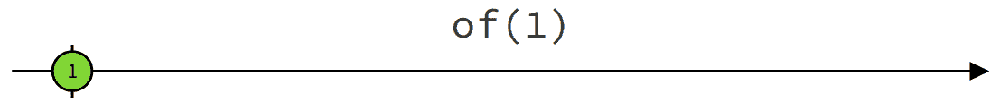

如我们所见，圆圈中间也有一条小的垂直线。这条线用来表示可观察值的最后一个元素。在这种情况下，订阅中的项目处理器只会被调用一次。

# 从数组创建可观察值

我们可以使用`from`函数根据现有的数组创建一个可观察值：

```js
import { from } from "rxjs";

const observable = from([10, 20, 30]);

const subscription = observable.subscribe(
    (value) => console.log(value),
    (error: any) => console.log(error),
    () => console.log("Done!")
);

subscription.unsubscribe();
```

前面的代码片段使用`from`函数声明了一个具有三个值的可观察值。代码片段还展示了如何再次进行订阅。

以下这个弹珠图以视觉方式表示了前面的例子。生成的可观察值有三个值（**10**、**20**和**30**），其中**30**是可观察值的最后一个元素：

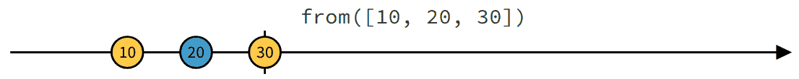

我们还可以使用`interval`函数生成具有给定元素数量的数组：

```js
import { interval } from "rxjs";

const observable = interval(10);

const subscription = observable.subscribe(
    (value) => console.log(value),
    (error: any) => console.log(error),
    () => console.log("Done!")
);

subscription.unsubscribe();
```

前面的代码片段使用 `interval` 函数声明了一个包含十个值的可观察对象。代码片段还展示了我们可以再次订阅。在这种情况下，订阅中的项目处理程序将被调用十次。

下面的油管图以可视化的方式表示了前面的示例。生成可观察对象包含十个值，其中 `9` 是它包含的最后一个项目：

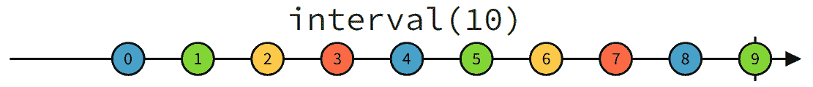

在这种情况下，订阅中的项目处理程序将被调用十次。

# 从事件创建可观察对象

也可以使用事件作为流中项目来源来创建一个可观察对象。我们可以使用 `fromEvent` 函数来完成此操作：

```js
import { fromEvent } from "rxjs";

const observable = fromEvent(document, "click");

const subscription = observable.subscribe(
    (value) => console.log(value)
);

subscription.unsubscribe();
```

在这种情况下，订阅中的项目处理程序将根据点击事件发生的次数被调用。

请注意，前面的示例只能在网页浏览器中执行。要在网页浏览器中执行前面的代码，您需要使用模块打包器，例如 Webpack。我们不会涉及这个主题，因为它超出了本书的范围。

# 从回调创建可观察对象

使用 `bindCallback` 函数也可以创建一个可观察对象，它会迭代回调的参数：

```js
import { bindCallback } from "rxjs";
import fetch from "node-fetch";

function getJSON(url: string, cb: (response: unknown|null) => void) {
    fetch(url)
        .then(response => response.json())
        .then(json => cb(json))
        .catch(_ => cb(null));
}

const uri = "https://jsonplaceholder.typicode.com/todos/1";
const observableFactory = bindCallback(getJSON);
const observable = observableFactory(uri);

const subscription = observable.subscribe(
    (value) => console.log(value)
);

subscription.unsubscribe();
```

前面的示例使用了 `node-fetch` 模块，因为 Node.js 中没有 `fetch` 函数。您可以使用以下 `npm` 命令安装 `node-fetch` 模块：

```js
npm install node-fetch @types/node-fetch
```

`getJSON` 函数接受一个 URL 和一个回调作为其参数。当我们将其传递给 `bindCallback` 函数时，会返回一个新的函数。这个新函数只接受一个 URL 作为其唯一参数，并返回一个可观察对象，而不是接受一个回调。

在 Node.js 中，回调遵循一个明确的模式。Node.js 回调接受两个参数，`error` 和 `result`，并且不会抛出异常。我们必须使用 `error` 参数来检查是否出错，而不是使用 `try`/`catch` 语句。RxJS 还定义了一个名为 `bindNodeCallback` 的函数，允许我们与回调一起工作：

```js
import { bindNodeCallback } from "rxjs";
import * as fs from "fs";

const observableFactory = bindNodeCallback(fs.readFile);
const observable = observableFactory("./roadNames.txt");

const subscription = observable.subscribe(
    (value) => console.log(value.toString())
);

subscription.unsubscribe();
```

辅助函数 `bindCallback` 和 `bindNodeCallback` 有非常相似的行为，但第二个是专门设计来与 Node.js 回调一起工作的。

# 从承诺创建可观察对象

可观察对象序列的项目来源的另一个潜在来源是 `Promise`。RxJS 还允许我们使用 `from` 函数处理此用例。我们必须将 `Promise` 实例传递给 `from` 函数。在下面的示例中，我们使用 `fetch` 函数发送 HTTP 请求。`fetch` 函数返回一个承诺，该承诺被传递给 `from` 函数：

```js
import { bindCallback } from "rxjs";
import fetch from "node-fetch";

const uri = "https://jsonplaceholder.typicode.com/todos/1";
const observable = from(fetch(uri)).pipe(map(x => x.json()));

const subscription = observable.subscribe(
 (value) => console.log(value.toString())
);

subscription.unsubscribe();
```

生成的可观察对象将只包含承诺的结果作为其唯一项目。

# 冷和热可观察对象

官方 RxJS 文档如下探讨了冷和热可观察对象之间的差异：

"冷可观察对象在订阅时开始运行，也就是说，只有当调用 Subscribe 时，可观察对象序列才开始向观察者推送值。值也不会在订阅者之间共享。这与热可观察对象不同，例如鼠标移动事件或股票行情，它们在订阅活动之前就已经开始产生值。当观察者订阅一个热可观察对象序列时，它将获得订阅后发出的所有流值。热可观察对象序列在所有订阅者之间共享，并且每个订阅者都会收到序列中的下一个值。"

如果我们想要控制组件的执行流程，理解这些区别是很重要的。关键点是要记住冷可观察对象是惰性评估的。

# 使用操作符

在本节中，我们将学习如何使用一些称为操作符的函数，这些函数允许我们以许多不同的方式操作可观察对象。

# Pipe

在 RxJS 中，可观察对象有一个名为`pipe`的方法，这与函数式编程中的管道操作符非常相似。当我们连接两个函数时，我们生成一个新的函数，该函数将第一个函数的返回值作为参数传递给管道中的第二个函数。

在响应式编程中，这个想法非常相似。当我们通过一个操作符将一个可观察对象管道化时，我们生成一个新的可观察对象。新的可观察对象将原始可观察对象中的每个项目传递给一个操作符，该操作符将它们转换为新序列中的项目。

我们在这里不会包含代码示例，因为在本章的剩余部分，我们将多次使用`pipe`方法。

# Max

`max`操作符函数可以用来在一个可观察对象中找到最大值。我们必须使用`pipe`方法来应用`max`操作符：

```js
import { from } from "rxjs";
import { max } from "rxjs/operators";

const observable = from<number>([2, 30, 22, 5, 60, 1]);

observable.pipe(max());

const subscription = observable.subscribe(
    (value) => console.log(value)
);

subscription.unsubscribe();
```

下面的弹珠图展示了应用`max`操作符之前的初始序列和应用`max`操作符之后的结果序列：

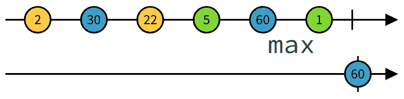

结果序列只包含一个值（原始序列中的最大值）。

# Every

`every`操作符函数可以用来测试一个可观察对象中的所有值是否都符合给定的要求：

```js
import { from } from "rxjs";
import { every } from "rxjs/operators";

const observable = from<number>([1,2, 3, 4, 5]);

observable.pipe(every(x => x < 10));

const subscription = observable.subscribe(
    (value) => console.log(value)
);

subscription.unsubscribe();
```

之前的代码片段使用了`every`操作符来测试一个可观察对象中的所有值是否都低于十。下面的弹珠图展示了应用`every`操作符之前的初始序列和应用`every`操作符之后的结果序列：

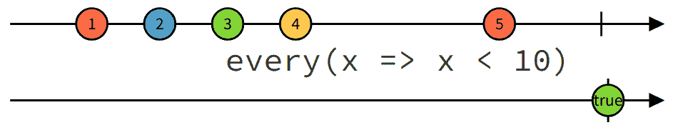

结果序列只包含一个值（true 或 false）。

# Find

`find`操作符函数可以用来查找一个可观察对象中符合给定约束的第一个值：

```js
import { from } from "rxjs";
import { find } from "rxjs/operators";

const observable = from<number>([2, 30, 22, 5, 60, 1]);

observable.pipe(find(x => x > 10));

const subscription = observable.subscribe(
    (value) => console.log(value)
);

subscription.unsubscribe();
```

之前的代码片段使用了`find`操作符来查找一个可观察对象中大于十的第一个值。下面的弹珠图展示了应用`find`操作符之前的初始序列和应用`find`操作符之后的结果序列：

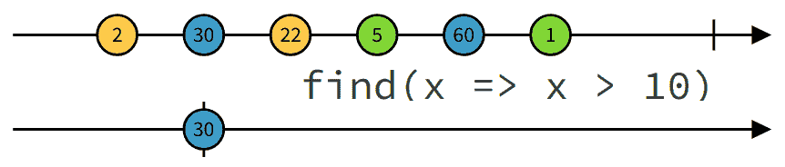

结果序列只包含一个值（符合给定约束的流中的第一个值）。

# Filter

`filter`运算符函数可以用来找到符合给定约束的可观察对象中的值：

```js
import { from } from "rxjs";
import { filter } from "rxjs/operators";

const observable = from<number>([2, 30, 22, 5, 60, 1]);

observable.pipe(filter(x => x > 10));

const subscription = observable.subscribe(
    (value) => console.log(value)
);

subscription.unsubscribe();
```

前面的代码片段使用`filter`运算符来找到大于十的观察对象中的值。以下是大理石图，展示了应用`filter`运算符后的初始序列和结果序列：

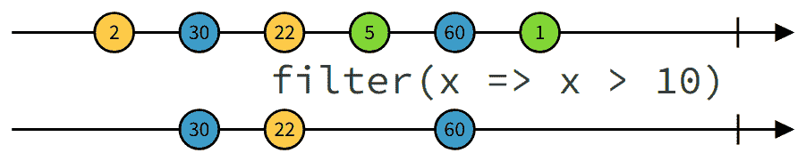

结果序列只包含一些值（与给定约束匹配的流中的值）。

# Map

`map`运算符函数可以用来将可观察对象中的值转换为派生值：

```js
import { from } from "rxjs";
import { map } from "rxjs/operators";

const observable = from<number>([1, 2, 3]);

observable.pipe(map(x => 10 * x));

const subscription = observable.subscribe(
 (value) => console.log(value)
);

subscription.unsubscribe();
```

前面的代码片段使用`map`运算符将观察对象中的值转换为新的值（原始值乘以十）。以下是大理石图，展示了应用`map`运算符后的初始序列和结果序列：

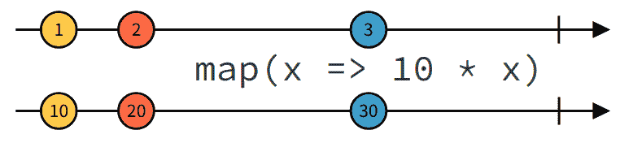

结果序列包含原始序列中每个值的新的映射值。

# Reduce

`reduce`运算符函数可以用来将可观察对象中的所有值转换为一个单一值：

```js
import { from } from "rxjs";
import { reduce } from "rxjs/operators";

const observable = from<number>([1, 2, 3, 3, 4, 5]);

observable.pipe(reduce((x, y) => x + y));

const subscription = observable.subscribe(
    (value) => console.log(value)
);

subscription.unsubscribe();
```

前面的代码片段使用`reduce`运算符将观察对象中的值转换为一个新单一值（所有值的总和）。将多个值转换为一个单一值的函数称为累加器。以下是大理石图，展示了应用`reduce`运算符后的初始序列和结果序列：

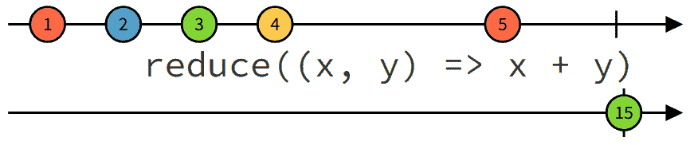

结果序列只包含一个值（累加器的结果）。

# Throttle

`throttle`运算符函数可以用来减少添加到可观察对象中的值的数量：

```js
import { fromEvent, interval } from "rxjs";
import { throttle, mapTo, scan } from "rxjs/operators";

const observable = fromEvent(document, "click")
                    .pipe(mapTo(1))
                    .pipe(throttle(x => interval(100)))
                    .pipe(scan((acc, one) => acc + one, 0));

const subscription = observable.subscribe(
    (value) => console.log(value)
);

subscription.unsubscribe();
```

前面的代码片段创建了一个用于`click`事件的观察对象。每次点击都会向序列中添加一个项目。示例还使用了`pipe`方法和`mapTo`函数将所有点击事件映射到数值`1`。然后我们使用`throttle`运算符来减少添加到序列中的值的数量。如果在小于声明的时间间隔内发生两个或多个点击事件，则只有第一个值将被添加到序列中。

请注意，前面的示例只能在网页浏览器中执行。要在网页浏览器中执行前面的代码，您需要使用模块打包器，例如 Webpack。我们不会涉及这个主题，因为它超出了本书的范围。

以下大理石图展示了应用`reduce`运算符后的初始序列和结果序列：

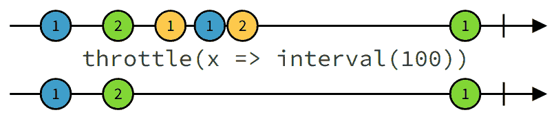

结果序列只包含一些值，因为时间上过于接近的值被忽略了。

# Merge

可以使用 `merge` 操作符函数将两个可观察对象的值合并成值对：

```js
import { from } from "rxjs";
import { merge } from "rxjs/operators";

const observableA = from<number>([20, 40, 60, 80, 100]);
const observableB = from<number>([1, 1]);

const observableC = observableA.pipe(merge<number, number>(observableB));

const subscription = observableC.subscribe(
    (value) => console.log(value)
);

subscription.unsubscribe();
```

上一段代码片段使用了 `merge` 操作符将两个可观察对象的值合并到一个新的可观察对象中。这些值按时间顺序排列。以下的水晶图展示了应用 `merge` 操作符之前的初始序列和结果序列：

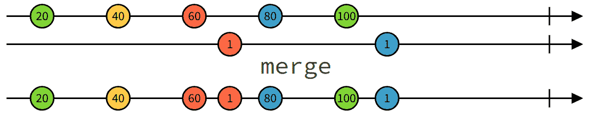

结果序列包含两个可观察对象的时间顺序中的值，并按其发生的时间顺序排列。

# Zip

可以使用 `zip` 操作符函数将两个可观察对象的值合并成值对：

```js
import { from } from "rxjs";
import { zip } from "rxjs/operators";

const observableA = from<number>([1, 2, 3, 3, 4, 5]);
const observableB = from<string>(["A", "B", "C", "D"]);

const observableC = observableA.pipe(zip<number, string>(observableB));

const subscription = observableC.subscribe(
    (value) => console.log(value)
);

subscription.unsubscribe();
```

上一段代码片段使用了 `zip` 操作符将两个可观察对象的值合并到一个新的可观察对象中。新可观察对象中的值是包含来自第一个可观察对象的值和来自第二个可观察对象的值的值对，并且按其在序列中的索引分组。以下的水晶图展示了应用 `zip` 操作符之前的初始序列和结果序列：

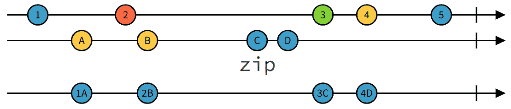

结果序列包含合并成单个值对的两个可观察对象的值。

# 摘要

在本章中，我们学习了函数式反应式编程范式。我们了解到许多函数式编程思想，如纯函数和函数组合，可以应用于反应式编程。我们还学习了什么是可观察对象，以及我们如何创建它们并与之交互。

在下一章中，我们将学习一些生产就绪的函数式编程库，例如 Ramda 和 Immutable.js。
