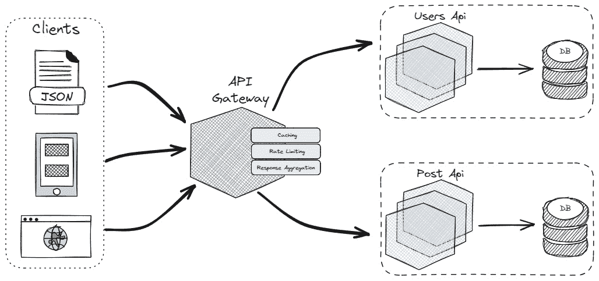
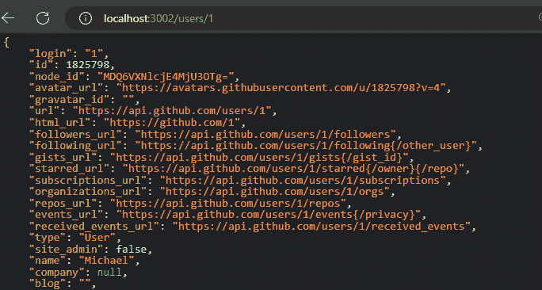
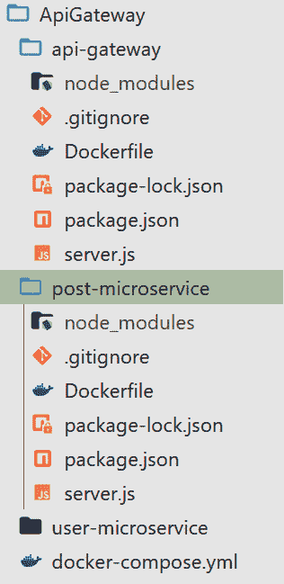
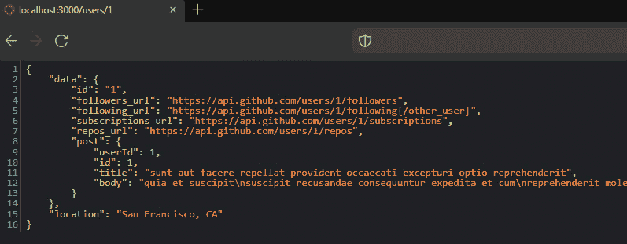
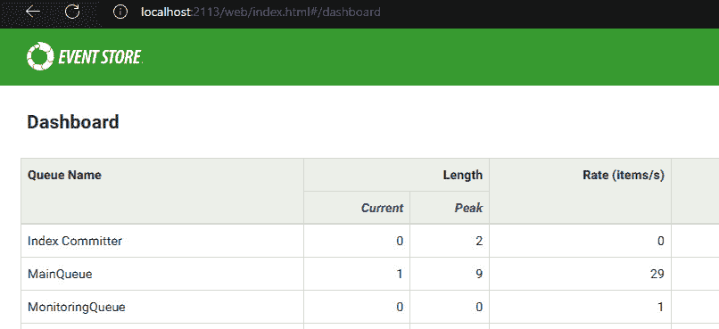
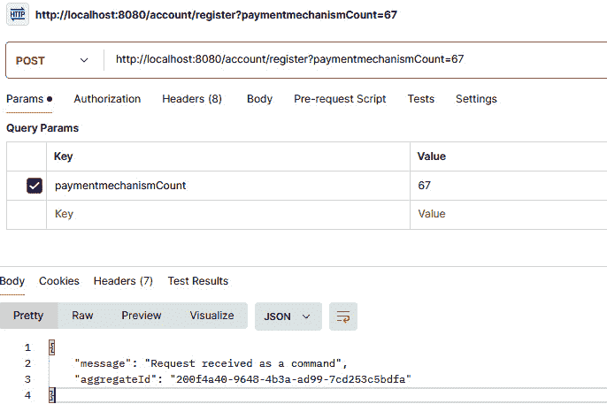

# 第十一章：微服务架构

软件开发的世界正在不断演变。随着应用程序复杂性的增加，传统的单体架构难以跟上步伐。本章深入探讨了一些关键设计模式，这些模式赋予开发者构建可扩展和弹性系统的能力——API 网关、**命令查询责任分离**（**CQRS**）、事件溯源以及服务注册和发现。

这些模式，尤其是在微服务架构中联合使用时，提供了许多好处。它们促进了服务之间的松散耦合，使得它们更容易独立开发、维护和部署。它们还通过允许根据特定需求对单个服务进行扩展来增强可伸缩性。此外，这些模式有助于提高容错性和弹性，确保即使个别服务遇到问题，应用程序也能保持稳健。

本章将全面介绍这些模式中的每一个，概述其核心概念、优势和用例。我们将探讨如何应用其中的一些模式来构建现代、可扩展应用程序的坚实基础。通过理解这些模式，您将能够设计并开发能够在软件开发不断变化的领域中茁壮成长的应用程序。

本章涵盖了以下主题：

+   开始使用 API 网关

+   CQRS 和事件溯源

+   微服务中的服务注册和发现

让我们进入本章内容！

# 技术要求

为了跟随本章内容，我们需要一个集成开发环境（我们更倾向于 Visual Studio Code），Postman，Docker 以及您选择的浏览器。

建议从[`github.com/PacktPublishing/Hands-on-Microservices-with-JavaScript`](https://github.com/PacktPublishing/Hands-on-Microservices-with-JavaScript)下载仓库，并打开`Ch11`文件夹，以便轻松跟随我们的代码片段。

# 开始使用 API 网关

API 网关通过充当中央枢纽，管理客户端应用程序和分布式微服务之间的通信，与微服务架构集成。当我们构建微服务时，我们希望它们能够独立开发、部署和扩展，而不影响客户端应用程序。客户端仅与 API 网关交互，这可以保护他们免受底层微服务网络的复杂性。



图 11.1：一个简单的 API 网关

API 网关接收来自客户端的请求，并根据请求内容或 URL 智能地将它们路由到适当的微服务（们）。它可以处理简单的路由或复杂场景，涉及多个微服务共同完成一个请求。让我们探讨将 API 网关集成到我们的微服务架构中的重要性：

+   **简化客户端交互**：客户端有一个集中的入口点/单一联系点（即 API 网关）来与应用程序交互，无论涉及多少个微服务。这减少了客户端的开发复杂性。

+   **提高可扩展性**：API 网关可以独立扩展以处理增加的流量，而不会影响单个微服务。微服务也可以根据其特定的工作负载独立扩展，突显了 API 网关的重要性。

+   **增强安全性**：API 网关的集中式安全管理加强了整体应用程序的安全性。API 网关可以实施身份验证、授权和其他安全策略，以保护微服务免受未经授权的访问。

+   **减少开发复杂性**：开发者不需要在每个微服务中实现诸如路由、安全和监控逻辑等功能。API 网关集中处理这些跨领域关注点。

让我们看看 API 网关是如何工作的。

## API 网关的工作原理

在微服务架构中，API 网关充当所有客户端请求的中央入口点。它在管理和优化客户端与后端服务之间的通信流中发挥着关键作用。通过处理身份验证、路由、负载均衡和其他重要功能，API 网关确保微服务保持松散耦合和可扩展。

下面是 API 网关通常处理客户端请求的步骤分解：

1.  **客户端请求**：客户端（例如，一个 Web 或移动应用）向 API 网关发送请求。请求包括诸如 HTTP 方法、URL 路径、头部和可能的内容体等详细信息。

1.  **请求处理**：API 网关接收请求并检查其内容。根据 URL 路径或其他路由规则，网关确定哪个后端服务应该处理该请求。

1.  **身份验证和授权**：API 网关会检查请求中的身份验证令牌（例如，JWT 或 OAuth 令牌）。它验证令牌的有效性并检查客户端是否有访问请求资源的必要权限。

1.  **请求转换**：API 网关可能会修改请求以适应后端服务的需求。这可能包括更改协议、修改头部或修改请求体。

1.  **路由和聚合**：网关将请求路由到适当的后端服务。如果请求涉及多个服务，网关将处理与每个服务的通信并将它们的响应聚合为单个响应发送给客户端。

1.  **缓存和负载均衡**：网关检查响应是否已缓存，以便快速提供而无需击中后端服务。它还将在后端服务的多个实例之间分配请求负载，以平衡流量并提高性能。

1.  **速率限制和节流**：API 网关强制执行速率限制，以控制客户端在指定时间段内可以发出的请求数量。如果客户端超过允许的请求速率，它可能会限制请求。

1.  **响应处理**：一旦后端服务响应，网关可能会在将其发送回客户端之前修改响应。这可能包括添加或删除头信息、转换数据格式或聚合多个响应。

1.  **日志记录和监控**：API 网关记录请求和响应的详细信息，以便进行监控和分析。跟踪的指标包括请求数量、响应时间和错误率，以监控服务的健康和性能。

既然我们已经了解了 API 网关的工作原理，让我们看看在特定情况下更好的选择是单一还是多个 API 网关。

## 单个与多个 API 网关

你可以在微服务架构中实现多个 API 网关，但这并不总是最直接或推荐的方法。在某些情况下，这可能会带来好处，但通常，出于简单性和可维护性的考虑，单个 API 网关更受欢迎。

当你希望实现集中管理、一致的客户端体验和简化的可扩展性时，单个 API 网关是理想的——所有这些都有助于简化 API 操作并降低复杂性。

虽然单个网关通常更受欢迎，但在某些情况下可能需要考虑使用多个网关：

+   **异构客户端类型**：如果你有使用截然不同协议或通信风格的客户端（例如，移动应用、Web 应用和遗留系统），可以使用单独的 API 网关来满足这些特定需求，使用自定义协议或功能。然而，这种做法在长期维护中可能会变得复杂。

+   **物理分离**：如果你的微服务地理分布在不同的数据中心或云区域，出于性能考虑，你可能考虑在每个位置放置一个 API 网关。然而，这会引入额外的管理开销，以保持网关之间的一致性。

+   **安全分区**：在非常具体的、对安全性敏感的场景中，你可以在应用程序的不同安全区域内实现单独的 API 网关。这允许对某些微服务的访问进行更严格的控制。然而，这需要仔细的设计和专业知识，以避免创建不必要的复杂性。

通常，单一 API 网关的好处超过了使用多个网关的潜在优势，因为前者促进了简单性、可维护性和一致的客户端体验。

如果你想要获得多个 API 网关的好处而又不增加复杂性，这里有一些替代方案：

+   **按客户端类型路由的 API 网关**：考虑使用一个单一的 API 网关，其路由逻辑能够区分不同的客户端类型并相应地定制响应。

+   **微服务外观**：在部分微服务中实现一个**外观**模式（稍后将详细介绍），以处理特定的客户端交互，可能减少对多个网关的需求。

在实施多个 API 网关之前，你应该仔细考虑你的具体需求。在大多数情况下，一个设计良好的单一 API 网关将为你的微服务架构提供最佳解决方案。

外观模式

在这个上下文中，外观指的是在部分微服务中实现一个层，专门处理与客户端的交互。而不是引入多个 API 网关，这可能会增加复杂性，微服务外观充当一个简化的接口或*前端*，为客户端抽象微服务的内部工作。

是时候实施并看到 API 网关在实际中的力量了。下一节将深入探讨 API 网关实际实施的细节。

## 使用 API 网关实现微服务

使用不同的形式和不同的库实现 API 网关模式是可能的。在我们的仓库中，`Ch11`/`ApiGateway` 文件夹就是这种情况。

为了展示 API 网关模式的实际价值，我们需要至少有两个微服务。需要至少两个微服务来展示 API 网关模式真实价值的原因是，该模式旨在处理多个服务并整合它们的功能以供客户端使用。在本章中，我们将使用以下两个微服务：

+   后端微服务

+   用户微服务

### 实现后端微服务

我们的第一个微服务，*后端微服务*，作为 `jsonplaceholder` 服务的包装/抽象。`jsonplaceholder` 是一个免费在线服务，提供带有伪造数据的 REST API。它通常被开发者用来轻松访问和利用看起来真实的样本数据（用户、帖子、评论等），而无需设置自己的数据库。这使得他们可以快速测试 API 端点、前端功能以及用户交互。

1.  创建一个新的文件夹（在我们的例子中是 `post-microservice` 文件夹）。

1.  运行 `npm install express axios` 来安装所需的包。

你的 `package.json` 应该看起来像这样：

```js
{
  "dependencies": {
    "axios": "¹.7.2",
    "express": "⁴.19.2"
  }
}
```

对于所有章节，你不需要安装列出的确切包版本。虽然我们的重点是使用包本身而不是特定版本，但如果新版本中有重大更改或破坏性差异，请参阅官方文档以获取更新。

现在，让我们在我们创建的文件夹（即 `post-microservices`）中创建一个名为 `server.js` 的新文件，并使用以下代码块：

```js
const express = require('express');
const axios = require('axios'); // Requires the axios library for making HTTP requests
const app = express();
const port = 3001; // Port on which the server will listen
app.get('/posts/:id', async (req, res) => {
  const postId = req.params.id; // Extract the ID from the URL parameter
  try {
    const response = await axios.get(
     `https://jsonplaceholder.typicode.com/posts/${postId}`);
    const post = response.data;
    if (post) {
      res.json(post); // Send the retrieved post data as JSON response
    } else {
      res.status(404).send('Post not found'); // Respond with 404 if post not found
    }
  } catch (error) {
    console.error(error);
    res.status(500).send('Internal Server Error'); // Handle errors with 500 status
  }
});
app.listen(port, () => {
  console.log(`Server listening on port ${port}`);
});
```

此代码片段使用 Express 框架创建一个简单的 Web 服务器，监听端口 `3001`。它导入 `axios` 库以发送 HTTP 请求。服务器有一个单一的路径 `/posts/:id`，它响应 `GET` 请求。当对该路径发出请求时，它会从 URL 中提取 `id` 参数。然后服务器异步地向 `https://jsonplaceholder.typicode.com/posts/${postId}` 发送请求以获取特定的帖子。如果找到帖子，它将帖子数据作为 JSON 响应发送。如果没有找到帖子，它将返回 `404` 状态码。如果在请求过程中出现任何错误，它将记录这些错误并以 `500`-状态码响应，表示内部服务器错误。

使用 `node server.js` 命令运行我们的微服务，并测试是否一切正常。打开您喜欢的浏览器，导航到 `localhost:3001/posts/1` (*图 11.2*).


图 11.2：帖子微服务的响应

### 实现用户微服务

我们的第二个微服务被称为 *用户微服务*。它的实现与我们的帖子微服务大致相同，但端口不同（`3002`）和服务抽象（GitHub 服务抽象）不同：

```js
const express = require('express');
const axios = require('axios'); // Requires the axios library for making HTTP requests
const app = express();
const port = 3002; // Port on which the server will listen
app.get('/users/:id', async (req, res) => {
    const userId = req.params.id; // Extract the ID from the URL parameter
    try {
        const response = await
          axios.get(`https://api.github.com/users/${userId}`);
        const user = response.data;
        if (user) {
            res.json(user); // Send the retrieved employee data as JSON response
        } else {
            res.status(404).send('User not found'); // Respond with 404 if employee not found
        }
    } catch (error) {
        console.error(error);
        res.status(500).send('Internal Server Error'); // Handle errors with 500 status
    }
});
app.listen(port, () => {
    console.log(`Server listening on port ${port}`);
});
```

使用 `node server.js` 命令运行我们的微服务，并测试是否一切正常。打开您喜欢的浏览器，导航到 `localhost:3002/users/1` (*图 11.3*).



图 11.3：用户微服务的响应

让我们构建我们的 API 网关作为第三个微服务，并将帖子微服务和用户微服务结合起来。

### 开发 API 网关

实现了两个微服务后，我们准备好展示 API 网关的价值和力量。我们计划为 API 网关实现速率限制、缓存和响应聚合功能。在理解了基本知识后，您可以添加更多功能，如日志记录、适当的异常处理、监控和其他有趣的行为。

首先，您需要理解 API 网关本身就是一个独立的微服务。因此，为它创建一个新的文件夹（在我们的 GitHub 仓库中称为 `api-``g``ateway`）。我们有 `package.json`，内容如下：

```js
{
  "dependencies": {
    "apicache": "¹.6.3",
    "axios": "1.7.2",
    "express": "4.19.2",
    "express-rate-limit": "7.3.1"
  }
}
```

我们将使用 `express-rate-limit` 包在我们的微服务中实现速率限制功能。在微服务架构中，应用程序被分解成更小、更独立的微服务时，**速率限制**是一种用于控制服务在特定时间段内可以接收的请求数量的技术。它就像交通控制器一样，防止服务因请求激增而超载。

相反，`apicache`用于实现 API 网关的缓存行为。**缓存**是指允许您将后端服务的响应存储一段时间内的功能。然后，这些缓存数据可以服务于后续请求，提高性能并减少后端负载。

让我们创建一个`server.js`文件来实现 API 网关。我们导入的包看起来像这样：

```js
const express = require('express');
const apicache = require('apicache');
const axios = require('axios');
const rateLimit = require('express-rate-limit');
```

首先，让我们配置我们的速率限制：

```js
const limiter = rateLimit({
    windowMs: 60000, // 1 minute window
    max: 100, // 100 requests per minute
    message: 'Too many requests, please slow down!'
});
```

我们使用`express-rate-limit`来控制用户在一分钟内可以访问您的 API 网关的次数。它就像一个守门人。如果一个用户在一分钟内请求少于一百次，他们可以通过。如果他们超过一百次，他们将收到一个`Too many requests, please slow down`（请求过多，请慢点）的消息。这保护了我们的 API 免受过载，并确保每个人都能有一个良好的用户体验。我们将在指定端点路由时使用此`limiter`对象。让我们继续并实现数据聚合：

```js
async function getAggregatedData(id) {
    const postResponse = await axios.get(
        `http://postmicroservice:3001/posts/${id}`);
    const userResponse = await axios.get(
        `http://usermicroservice:3002/users/${id}`);
    const aggregatedData = {
        data: {
            id: userResponse.data.login,
            followers_url: userResponse.data.followers_url,
            following_url: userResponse.data.following_url,
            subscriptions_url:
              userResponse.data.subscriptions_url,
            repos_url: userResponse.data.repos_url,
            post: postResponse.data
        },
        location: userResponse.data.location
    };
    return aggregatedData;
}
```

这个函数，`getAggregatedData`，从两个不同的微服务中检索数据以构建一个组合响应。它接受一个 ID 作为输入：

1.  首先，它使用`axios.get`进行两次独立的异步调用。一次从端口号为`3001`的帖子微服务中获取帖子数据，另一次从端口号为`3002`的用户微服务中获取用户数据。

1.  然后，它将数据合并成一个名为`aggregatedData`的单个对象。包括用户数据，如位置、跟随者的 URL 以及通过 URL 被跟随的人。此外，从第一次调用中检索到的帖子数据被添加到键`post`下。

1.  最后，该函数返回包含有关用户及其帖子所有相关信息的`aggregatedData`对象。

通过在 API 网关中聚合数据，我们向客户端应用程序提供了一个简化的 API。它们只需要调用网关内的单个端点（`/users/:id`），即可接收组合的用户和帖子数据，而不是分别对每个微服务进行单独调用。

例如，当请求`localhost:3000/users/1`时，我们应该从帖子微服务和用户微服务中获取用户信息。以下是获取多个微服务聚合数据的方法：

```js
app.get('/users/:id', limiter, async (req, res) => {
    const id = req.params.id;
    try {
        const aggregatedData = await getAggregatedData(id);
        res.json(aggregatedData);
    }
    catch {
        res.status(400).json({ success: false, message:
          'Bad request' });
    }
});
```

此代码使用 Express.js 定义了一个 API 网关的路由处理器。它处理对`/users/:id` URL 路径的`GET`请求，其中`:id`是一个动态参数，代表用户 ID。在路由处理器函数之前应用了`limiter`中间件，这确保只有允许的请求（通常基于之前的代码，每分钟一百次）可以继续。在函数内部，API 从请求参数中提取 ID。然后调用`getAggregatedData`函数以异步检索和合并用户和帖子数据。如果成功，该函数发送包含检索到的聚合数据的 JSON 响应。如果在数据检索过程中出现错误，它将发送一个状态码为`400`（错误请求）和通用错误消息的响应。

我们 API 网关的最后一个功能是缓存。我们需要将以下代码片段添加到 `server.js` 文件中：

```js
let cache = apicache.middleware;
app.use(cache('5 minutes'));
```

使用此代码，我们对所有类型的端点应用五分钟的缓存。

我们的基础设施（帖子微服务、API 网关和用户微服务）已经完成；现在是时候测试它们全部一起了。

### 在 Docker 中测试 API 网关

要测试 API 网关，您可以单独运行每个微服务，但如您所知，我们在 `getAggregatedData` 函数中为微服务有不同的名称 – `http://post-microservice:3001` 和 `http://user-microservice:3002`。为了使这些微服务正常工作并且不必每次都运行每个微服务，我们将它们容器化。

对于每个微服务，我们都有 `Dockerfile`，如下图所示：



图 11.4：API 网关项目结构

`Dockerfile` 是一个包含构建 Docker 镜像指令的文本文件。它就像一个食谱，告诉 Docker 如何采取步骤来创建一个为您的应用程序提供自包含环境的容器。

所有三个 Docker 文件完全相同，内容如下：

```js
FROM node:alpine
WORKDIR /app
COPY package*.json ./
RUN npm install
COPY . .
CMD [ "node", "server.js" ]
```

此 `Dockerfile` 为 Node.js 应用程序创建一个镜像。它从一个轻量级的 Node.js 基础镜像开始，安装依赖项，复制您的整个项目，然后在启动时运行您的服务器代码。

在我们的根目录中有一个 `docker-compose.yml` 文件，它将结合这三个 `Dockerfile` 文件并将它们组合起来：

```js
services:
  post-microservice:
    build:
      context: ./post-microservice
      dockerfile: Dockerfile
    ports:
      - 3001:3001
  user-microservice:
    build:
      context: ./user-microservice # Correct the path if necessary
      dockerfile: Dockerfile
    ports:
      - 3002:3002
  api-Gateway:
    build:
      context: ./api-Gateway
      dockerfile: Dockerfile
    ports:
      - 3000:3000
    depends_on:
      - post-microservice
      - user-microservice
```

此 `docker-compose.yml` 文件定义了一个多容器应用程序。它创建了三个服务 – `post-microservice`、`user-microservice` 和 `api-gateway`。每个服务都从单独的目录（例如，`./post-microservice`）使用共同的 `Dockerfile` 构建自己的镜像。

每个服务都在特定的端口上公开（帖子为 `3001`，用户为 `3002`，网关为 `3000`）。

`api-Gateway` 依赖于 `post-microservice` 和 `user-microservice` 在其启动之前处于活动状态，以确保依赖项可用。要组合这些微服务的 Docker 文件，导航到包含 `docker-compose.yml` 文件的文件夹，并运行 `docker-compose up -d` 命令。它应该一起构建和运行组合服务。以下是使用 Docker 一起运行所有必需服务的外观：


图 11.5：API 网关在 Docker 中的表现

从您的浏览器导航到 `localhost:3000/users/1`，您应该得到以下聚合数据：



图 11.6：API 网关在实际应用中的表现

到目前为止，我们已经探讨了 API 网关在微服务架构中的作用，强调了它如何通过充当路由、安全和负载均衡的中心入口点来简化客户端交互。我们学习了 API 网关如何从多个微服务中聚合数据，应用缓存和速率限制，并增强可伸缩性。通过将其集成到我们的架构中，我们提高了性能和安全性，同时保持了单个微服务的灵活性和独立性。最后，我们使用 Docker 容器化了微服务和 API 网关，以实现高效的测试和部署。

在下一节中，我们将探讨其他有趣的模式，例如 CQRS 和事件溯源。首先，我们将了解它们是什么，以及为什么我们会使用它们。

# CQRS 和事件溯源

CQRS 是一种在分布式系统（通常是微服务）中使用的软件设计模式，用于分离读写操作。这种分离提供了几个优点，尤其是在处理具有高读写差异或复杂数据模型的应用程序时。

当你申请使用分布式架构的应用程序的工作时，你经常会听到关于 CQRS 的消息，很可能会被问到其使用情况。首先，我们需要理解的是，CQRS 不是一个架构风格；它既不是架构也不是架构原则。它只是一个没有广泛使用的模式。那么，CQRS 是什么？在回答这个问题之前，让我们了解 CQRS 试图解决的问题。

传统的单体应用程序通常使用单个数据库来读取和写入数据。随着应用程序的增长，这种方法可能会导致以下挑战：

+   **扩展瓶颈**：当读流量激增时，可能会影响写性能（反之亦然）。

+   **数据模型不匹配**：最优的读写模型可能不同。读取可能从去规范化数据中受益以实现更快的检索，而写入可能需要规范化结构以保持数据完整性。这种不匹配会导致低效或重复。

+   **事务冲突**：更新和读取可能会竞争资源，可能相互阻塞或导致不一致（违反**ACID**（**原子性，一致性，隔离性，持久性**）原则）。

+   **优化挑战**：优化读取可能会妨碍写性能，反之亦然。

当我们与单体应用一起工作时，我们通常使用一个单一的数据存储。这意味着我们在同一个数据库中有多个读写指令。我们使用相同的数据存储模型，当只涉及一个单一存储时，开发方面的一切都很简单。但是，这真的是全部吗？好吧，当我们只有一个数据存储时，并不是所有事情都顺利。根据我们的需求，我们可能需要将我们的数据库分成读数据库和写数据库。

## 理解 CQRS

CQRS 帮助我们将数据存储区分为读取和写入数据存储。为什么？一个原因是我们需要优化我们的读写操作。使用 CQRS，我们可以优化我们的读取数据存储以有效地读取数据。我们还可以配置我们的模式以优化读取操作。同样适用于写入数据存储。

当我们有独立的数据存储时，根据负载，我们可以独立扩展它们。当我们有独立的读取和写入数据存储时，我们可以根据每个的具体负载要求独立扩展它们。这在读取操作需求高的应用程序中特别有用。通过解耦读写操作，我们可以扩展读取数据存储以处理负载，而不会影响写入数据存储的性能，反之亦然。这种方法允许更有效的资源分配，确保每个数据存储都针对其特定角色进行了优化。

在 CQRS 中，读取和写入是分离的存储，我们有两个不同的数据模型。现在我们可以专注于优化和构建它们，以支持仅一个操作——要么是读取，要么是写入。

总结一下，以下是 CQRS 的好处：

+   **改进性能**：优化的读写模型可以显著提高读写操作的性能。

+   **增强的可扩展性**：您可以根据其访问模式独立扩展读写模型。这允许您更有效地处理波动性的读写负载。

+   **数据建模的灵活性**：每个模型都可以根据其特定目的进行设计，从而提高整体数据管理并减少复杂性。

CQRS 是不是银弹？当然不是。当您将 CQRS 集成到项目中时，应考虑以下因素：

+   **增加复杂性**：与单一存储相比，实现 CQRS 引入了额外的复杂性。为了成功实施，需要进行仔细的设计和权衡分析。

+   **数据一致性**：在读取和写入模型之间保持一致性需要仔细考虑。可以采用诸如最终一致性或物化视图等策略。

CQRS 是一种适用于具有*高读写差异*（例如，具有频繁的产品查看和较少购买的电子商务）的应用程序的有价值模式，具有对读写操作有不同要求的*复杂数据模型*，以及需要*独立扩展*读写操作的场景。

在采用 CQRS 之前，仔细分析您应用程序的需求。虽然它在特定场景中提供了显著的好处，但增加的复杂性可能对于更简单的应用程序来说并不必要。

讨论 CQRS 时，讨论事件源也很重要。它们是互补的模式，可以很好地一起工作，但它们解决了应用程序架构的不同方面。

## 事件源

**事件溯源**是一种将数据作为一系列事件持久化的设计模式。你不会存储实体的当前状态（例如用户账户），而是记录每个修改该实体的操作。这创建了一个不可变的历史变更记录，允许你执行以下操作：

+   回放事件以在任何时间点重建状态。

+   深入了解应用程序的历史，以便进行审计和调试。

+   简化数据演变，因为可以添加新事件而无需修改现有事件。

这些事件代表已经发生的事情，而不是数据的当前状态。通过回放事件流，你可以在任何时间点重建状态。CQRS 中的传统数据库可以用于写入模型（即存储命令）。事件溯源在 CQRS 的读取模型方面表现出色。事件溯源的事件流作为读取模型的真实来源。读取模型是通过回放相关事件构建的实体化投影。

然而，非常重要的一点是要注意，CQRS 可以在不使用事件溯源的情况下实现。事件溯源在管理读取模型时通常受益于 CQRS，因为这两种模式在许多场景中都很好地协同工作：

+   CQRS 通过使用优化的读取模型来高效地处理大量读取操作。

+   事件溯源提供了完整的记录来构建这些读取模型。

+   事件流的更新会自动触发读取模型中的更新，确保一致性（尽管可能适用最终一致性）。

事件溯源与事件流

事件流与事件溯源不同，尽管它们密切相关且经常一起使用。关键区别在于，事件流是一种在不同系统部分之间或不同系统之间传输一系列事件的机制。事件流侧重于事件的交付，确保它们被感兴趣的各方接收。它可以用于各种目的，例如实时通知、数据管道或触发其他微服务的操作。

相反，事件溯源是一种数据持久化模式，其中实体的整个变更历史都存储为一系列事件。它侧重于事件作为系统真实来源的存储和利用。这些事件用于回放历史并在需要时重建数据的当前状态。

这里有一个类比来更好地理解。想象一下事件流就像一个直播——它持续地向任何订阅者提供更新（事件）。事件溯源就像一个详细的日志——它保留所有过去更新的永久记录，供将来参考。

但这两者是如何联系起来的呢？事件溯源通常利用事件流来高效地存储和传输事件的序列。事件溯源的事件流可以被订阅了它的其他系统或服务使用。一些事件存储（稍后将进一步讨论），这些是专门为事件溯源设计的事件存储数据库，可能具有内置的事件流功能。本质上，事件流是一个更广泛的概念，用于描述数据在运动中的状态。事件溯源利用事件流来保存其事件历史。

让我们快速看一下事件存储。

## 事件存储

在我们的 CQRS 和事件溯源生态系统中，我们需要考虑的另一个元素是一个**事件存储**。这是一种专门类型的数据库，专门设计用于存储事件的序列。与传统关注数据当前状态的关系型数据库不同，事件存储将每个实体所做的每个更改记录为一个独特的事件。这创建了一个不可变的历史记录，记录了所有已发生的行为，从而带来了以下好处：

+   **可审计性和调试**：通过审查事件序列，您可以轻松跟踪更改并识别问题。这提供了关于发生了什么、何时以及为什么的详细日志。

+   **数据演变**：随着您的应用程序的发展，可以添加新的事件到存储中，而无需修改现有逻辑。这使得适应不断变化的需求而不会破坏现有功能变得更加容易。

+   **可回放性**：通过以特定顺序回放事件流，您可以在任何时间点重建实体的状态。这对于各种目的都很有用，例如重建物化视图或灾难恢复。

+   **可扩展性**：事件存储通常优化以处理大量写入操作，这使得它们非常适合具有频繁数据更改的事件驱动架构。

从本质上讲，事件存储不仅捕获了更改的完整且不可变的历史记录，而且还增强了灵活性和可扩展性。通过保存修改实体状态的每个事件，事件存储为可靠的审计跟踪、轻松适应新的业务需求以及按需重建状态提供了基础。这些功能使其成为现代架构中不可或缺的组件，尤其是在高数据吞吐量和问责制重要的领域。

这就是事件存储通常的工作方式：

+   **事件**：每个对实体的操作或更改都表示为一个事件。这些事件包含有关更改的相关数据，例如时间戳、用户 ID 和特定的修改。

+   **只追加**：事件以只追加的方式存储，这意味着一旦添加后，它们不能被修改或删除。这确保了事件历史的不可变性。

+   **事件流**：每个实体通常都有自己的事件流，这是一系列与该实体相关的所有事件。

事件存储通常通过将每个实体或更改表示为事件来工作。这些事件捕获有关更改的相关信息，例如发生时间、负责的用户以及修改的特定细节。一旦事件被记录，它将以追加方式存储，这意味着一旦添加后就不能被更改或删除。这确保了事件历史保持不可变，提供了一个可靠的审计跟踪。此外，每个实体都与自己的事件流相关联，这是一个与该特定实体相关的所有事件的按时间顺序序列。这个流允许你根据存储中记录的事件序列，从实体的初始状态追踪到其当前形式。

事件存储提供了以下显著的优点，使其非常适合现代架构，特别是那些由事件驱动的架构：

+   其中一个关键优势是创建一个**不可变历史记录**。系统中的每一次更改都以事件的形式存储，确保过去的行为不会被篡改或更改。这创建了一个可靠、防篡改的审计跟踪，允许你跟踪实体的完整生命周期，这对于调试、合规性和历史分析特别有用。

+   在**可伸缩性**方面，事件存储被设计成高效地处理大量写入操作。由于事件是追加到存储中而不是修改现有记录，因此它们可以支持频繁数据变更的应用程序，并确保性能保持一致，即使数据量增长。这使得它们成为需要处理大量数据或处理实时事件流的系统的绝佳选择。

+   另一个重要的好处是**数据演化**。随着应用程序的演变和新业务需求的产生，事件存储允许你在不影响现有功能的情况下进行适应。可以添加新事件来反映系统中的变化，同时保留旧事件数据，从而保留完整的历史记录。这种灵活性简化了随着时间的推移演化应用程序的过程，同时保持与先前数据版本的向后兼容性。

+   **可重放性**是事件存储的另一个重要特性。通过重放事件流，你可以重建实体在任何时间点的状态。这种能力对于灾难恢复、重建物化视图，甚至模拟过去系统状态以进行分析或测试非常有价值。它赋予你回顾过去并确切了解实体如何达到当前状态的能力，这是传统数据库所无法实现的，因为传统数据库只存储数据的最新状态。

这些好处使事件存储成为构建可伸缩、灵活和健壮系统的强大工具，尤其是在事件驱动架构中，维护更改的详细历史记录至关重要。

这里是使用事件存储的挑战：

+   **查询**：传统的数据库查询技术可能不直接适用。在事件流上设计高效的查询可能需要不同的方法。

+   **复杂性增加**：与传统的数据库相比，事件存储需要不同的数据管理思维。

最后，让我们看看一些流行的事件存储选项，包括以下内容：

+   **EventStoreDB**：领先的专用事件存储解决方案。

+   **Apache Kafka**：一个可以用于事件存储的分布式流平台。

+   **传统数据库（经过修改）**：例如 PostgreSQL 这样的关系型数据库可以被配置为仅追加功能，以作为基本的事件存储。

总结来说，事件存储库是构建事件驱动架构和需要详细变更历史、数据演变能力和弹性的应用的宝贵工具。

理论已经足够了；现在是时候将 CQRS 和事件溯源付诸实践了。

## 实现 CQRS 和事件溯源

让我们创建一个简单的应用程序，该程序使用 CQRS 和事件溯源。我们的应用程序将允许我们将多个支付机制附加到我们的账户上。我们将能够注册支付机制到账户中，禁用它们，并启用它们。我们将使用 NestJS，但你也可以使用任何其他框架。在 `Ch11` 的 `CQRS_EventSourcing` 文件夹中，我们的 Git 仓库中有 `cqrs_app` 文件夹。你可以下载它以正确地跟随本章，但另一种选择是从头开始实现一切，正如我们在这里计划做的那样：

1.  创建任何文件夹并打开你喜欢的 IDE。将空文件夹加载到你的 IDE 中，然后在命令行中输入 `npx @nestjs/cli new cqrs_app` 或 `npm i -g @nestjs/cli` 并使用 `nest` `new cqrs_app`。

1.  这应该在文件夹中安装 NestJS 模板。现在，让我们安装所需的包：

    ```js
    npm i @nestjs/cqrs
    npm i @eventstore/db-client
    npm i uuid
    EventStoreDB for Docker. You can easily run it using a simple Dockerfile; however, to operate it with all the necessary infrastructure components, you’ll need to compose them together in the future. Create a docker-compose.yml file with the following content:

    ```

    services:

    eventstore.db:

    image: eventstore/eventstore:24.2.0-jammy

    environment:

    - EVENTSTORE_CLUSTER_SIZE=1

    - EVENTSTORE_RUN_PROJECTIONS=All

    - EVENTSTORE_START_STANDARD_PROJECTIONS=true

    - EVENTSTORE_HTTP_PORT=2113

    - EVENTSTORE_INSECURE=true

    - EVENTSTORE_ENABLE_ATOM_PUB_OVER_HTTP=true

    ports:

    - '2113:2113'

    volumes:

    - type: volume

    source: eventstore-volume-data

    target: /var/lib/eventstore

    - type: volume

    source: eventstore-volume-logs

    target: /var/log/eventstore

    volumes:

    eventstore-volume-data:

    eventstore.db 使用 eventstore/eventstore:24.2.0-jammy 镜像，这是 EventStoreDB 的一个特定版本。你可以使用其他版本，只需进行一些不同的配置。该服务使用几个环境变量来配置 EventStore，包括启动所有投影和启用不安全连接（这不建议在生产环境中使用）。该服务将主机上的端口 2113 映射到容器内的端口 2113，允许访问 EventStoreDB 实例。最后，它定义了用于数据和日志的持久卷，以确保即使在容器重启的情况下信息也能得到保留。

    ```js

    ```

1.  运行`docker-compose up -d`命令来运行它。运行成功后，您可以导航到`localhost:2213`以访问`EventStoreDB`仪表板。



图 11.7：事件存储仪表板

1.  现在，在我们的`src`文件夹中，创建一个`eventstore.ts`文件，内容如下：

    ```js
    import {EventStoreDBClient, FORWARDS, START} from
      '@eventstore/db-client'
    const client = EventStoreDBClient.connectionString(
      'esdb://localhost:2113?tls=false',
    )
    const connect = () => {
      try {
        client.readAll({
          direction: FORWARDS,
          fromPosition: START,
          maxCount: 1,
        })
      } catch (error) {
        console.error('Failed to connect to
          EventStoreDB:', error) }
    }
    export {client, connect}
    @eventstore/db-client library to interact with EventStoreDB. It establishes a connection (stored in the client), using a connection string that points to a local EventStoreDB instance (localhost:2113) with EventStoreDB for production is that it provides encryption for data transmitted over a network. Without TLS, data transmitted between the client and EventStoreDB, such as commands, events, and sensitive information, is sent in plain text. This means anyone with access to the network could potentially intercept and read the data, leading to security vulnerabilities, including data theft or man-in-the-middle attacks.
    ```

    提供的`connect`函数尝试从事件流的开始（`direction: FORWARDS, fromPosition: START`）读取单个事件（`maxCount: 1`）。在读取操作过程中遇到的任何错误都会被捕获并记录到控制台。最后，客户端连接和`connect`函数都被导出，以便在其他代码部分中潜在使用。

1.  我们将存储基于账户的元素，如事件、命令和聚合体，并将它们一起存储。将基于账户的元素（如事件、命令和聚合体）一起存储有助于在领域模型内保持一致性和清晰性。这些元素是紧密相连的命令，它们启动改变聚合体状态的动作，这些变化被捕获为事件。将它们放在一起简化了操作的逻辑流程，确保所有相关组件都易于访问和组织。这就是为什么我们需要在`src`下创建一个名为`account`的文件夹。创建文件夹后，在`src` / `account`下创建一个名为`account.commands.ts`的新文件，内容如下：

    ```js
    import {ICommand} from '@nestjs/cqrs'
    export class RegisterAccountUnitCommand implements
      ICommand {
      constructor(
        public readonly aggregateId: string,
        public readonly paymentmechanismCount: string,
      ) {}
    }
    export class DisableAccountUnitCommand implements
      ICommand {
      constructor(public readonly aggregateId: string) {}
    }
    export class EnableAccountUnitCommand implements
      ICommand {
      constructor(public readonly aggregateId: string) {}
    }
    ```

    此代码定义了在 NestJS 应用程序的账户单元系统中使用 CQRS 的三个命令：

    +   `RegisterAccountUnitCommand`：此命令接受一个`aggregateId`（账户单元的唯一标识符）和一个`paymentmechanismCount`（关联的支付方式数量）。它用于创建一个新的账户单元。

    +   `DisableAccountUnitCommand`：此命令仅接受`aggregateId`，并可能禁用账户单元。

    +   `EnableAccountUnitCommand`：与禁用命令类似，它接受`aggregateId`并通常重新启用之前已禁用的账户单元。

    这些命令代表了用户可能在账户单元上执行的不同操作，并且通过专注于修改系统状态（即创建、禁用或启用）来遵循 CQRS 模式。

1.  我们不会直接调用所需的功能，而是使用命令来封装它们。我们的命令基于命令设计模式。使用命令模式，可以将每个动作/请求封装为一个对象。这种封装带来了许多额外的功能，具体取决于上下文；可以实现延迟执行、重做、撤销、事务操作等。`ICommand`接口帮助我们实现这一点。

    我们还需要实现其他合约来覆盖使用事件源进行 CQRS 的事件。在`src/account`文件夹中，创建一个名为`account.events.ts`的新文件，内容如下：

    ```js
    import {UUID} from 'uuid'
    import {IEvent} from "@nestjs/cqrs";
    export class AccountEvent implements IEvent {
      constructor(
          public readonly aggregateId: UUID,
          public readonly paymentmechanismCount: string
      ) {}
    }
    export class AccountRegisteredEvent extends
      AccountEvent {}
    export class AccountDisabledEvent extends AccountEvent {}
    export class AccountEnabledEvent extends AccountEvent {}
    ```

在 CQRS 中，事件用于传达系统发生的变化。通过从 `@nestjs/cqrs` 包提供的 `IEvent` 继承，我们确保 `AccountEvent` 及其子类符合 CQRS 框架中预期的事件结构。这允许框架适当地处理这些事件，例如将它们发布到事件总线或持久化以实现最终一致性：

+   `AccountEvent`（基类）：作为所有账户事件的基类。它继承自 `IEvent`（来自 `@nestjs/cqrs`）并持有常见的属性，如 `aggregateId` 和 `paymentmechanismCount`。

+   `AccountRegisteredEvent` 继承自 `AccountEvent`，针对特定操作（例如注册、禁用和启用）进行定制，如果需要，可能包含额外的属性。

这种方法促进了代码的重用，并保持了不同账户单元事件的事件数据一致性。

我们已经指定了我们的命令和事件，但尚未使用它们。`src` | `account` 目录下的 `account.aggregate.ts` 文件的目的正是如此。我们首先需要指定我们的命令处理器。如果你有一个命令，就应该有一个处理器来处理它。

## 命令和处理器

命令代表用户或外部系统想要在领域模型上执行的操作。它们封装了执行操作所需的数据。在我们的例子中，`RegisterAccountUnitCommand`、`DisableAccountUnitCommand` 和 `EnableAccountUnitCommand` 都是代表对账户单元执行操作的命令。

命令通常定义为接口或类。它们通常包括指定操作和任何必要数据的属性（例如我们命令中的 `aggregateId`）。相反，**命令处理器**（在本章中也称为处理器）负责接收命令，执行必要的逻辑以修改系统状态，并可能产生反映这些变化的事件。它们在命令和领域模型之间充当桥梁。

每个命令通常都有一个相应的命令处理器。处理器接收命令，与领域逻辑（即聚合根、实体和服务）交互，并相应地更新系统状态。它还可能触发事件的创建，以传达这些变化。

我们的 `account.aggregate.ts` 包含 `AggregateRoot`、`CommandHandler` 和 `EventHandler` 的实现。首先，我们将查看命令处理器：

```js
@CommandHandler(RegisterAccountUnitCommand)
export class RegisterAccountUnitHandler
  implements ICommandHandler<RegisterAccountUnitCommand>
{
  constructor(private readonly publisher: EventPublisher) {}
  async execute(command: RegisterAccountUnitCommand): Promise<void> {
    const aggregate = this.publisher.mergeObjectContext
      (new AccountAggregate())
    aggregate.registerAccount(command.aggregateId,
      command.paymentmechanismCount)
    aggregate.commit()
  }
}
```

这段 NestJS 代码定义了一个命令处理器，用于使用 CQRS 注册账户单元。`@CommandHandler`装饰器将其与`RegisterAccountUnitCommand`关联。它注入`EventPublisher`（用于事件存储）。在`execute`方法中，它创建一个`AccountAggregate`实例，使用命令数据调用其`registerAccount`方法，并可能提交更改。这展示了通过与领域模型交互并可能发布事件来处理命令。我们稍后会讨论`AggregateRoot`。现在，我们只需关注命令背后的基本思想。

我们还有两个具有类似实现但方法调用不同的命令：

```js
@CommandHandler(DisableAccountUnitCommand)
export class DisableAccountUnitHandler implements
  ICommandHandler<DisableAccountUnitCommand> {
  constructor(private readonly publisher: EventPublisher){}
  async execute(command: DisableAccountUnitCommand):
    Promise<void> {
    const aggregate = this.publisher.mergeObjectContext(
        await AccountAggregate.loadAggregate
          (command.aggregateId)
    );
    if (!aggregate.disabled) {
      aggregate.disableAccount();
      aggregate.commit();
    }
  }
}
```

`DisableAccountUnitHandler`使用`AccountAggregate.loadAggregate`检索与`command.aggregateId`关联的`AccountAggregate`实例。

它使用`!aggregate.disabled`验证账户是否已经被禁用。如果没有被禁用，它调用`aggregate.disableAccount`来执行禁用逻辑，然后调用`aggregate.commit`以将更改作为事件持久化。

此处理器确保账户单元只被禁用一次，并在成功禁用后触发事件发布（如果适用）。最后一个处理器是`EnableAccountHandler`，它是`DisableAccountUnitHandler`的对立面：

```js
@CommandHandler(EnableAccountUnitCommand)
export class EnableAccountUnitHandler implements
  ICommandHandler<EnableAccountUnitCommand> {
  constructor(private readonly publisher: EventPublisher){}
  async execute(command: EnableAccountUnitCommand):
    Promise<void> {
    const aggregate = this.publisher.mergeObjectContext(
        await AccountAggregate.loadAggregate
          (command.aggregateId)
    );
    if (aggregate.disabled) {
      aggregate.enableAccount();
      aggregate.commit();
    }
  }
}
```

我们已经完成了处理器。现在是时候探索`@nestjs/cqrs`包中的`IEventHandler<T>`接口了。这些处理器响应由聚合体发出的特定领域事件。

在 CQRS 的上下文中，事件处理器负责处理系统内部发生的领域事件。这些事件代表你的聚合体中的重大状态变化，事件处理器通过执行聚合体本身之外的效果或附加逻辑来响应这些变化。

在同一文件（`account.aggregate.ts`）中，我们有三个事件处理器（`AccountRegisteredEventHandler`、`AccountDisabledEventHandler`和`AccountEnabledEventHandler`）：

```js
interface AccountEvent {
  aggregateId: string;
  paymentmechanismCount: string;
}
async function handleAccountEvent(eventType: string, event:
  AccountEvent): Promise<void> {
  const eventData = jsonEvent({
    type: eventType,
    data: {
      id: event.aggregateId,
      paymentmechanismCount: event.paymentmechanismCount,
    },
  });
  await eventStore.appendToStream(
    'Account-unit-stream-' + event.aggregateId,
    [eventData],
  );
}
```

所有事件处理器都有相同的契约，这就是我们使用`AccountEvent`接口的原因。它实现了一个函数，名为`handleAccountEvent`，该函数接受一个事件类型和一个事件对象作为参数。该函数以 JSON 兼容的格式准备数据，并使用事件存储服务来持久化事件信息，这些信息属于涉及到的账户聚合的特定流。

现在，让我们看看具体的事件处理器实现：

```js
@EventsHandler(AccountRegisteredEvent)
export class AccountRegisteredEventHandler
  implements IEventHandler<AccountRegisteredEvent> {
  async handle(event: AccountRegisteredEvent):
    Promise<void> {
    await handleAccountEvent('AccountUnitCreated', event);
  }
}
@EventsHandler(AccountDisabledEvent)
export class AccountDisabledEventHandler implements
  IEventHandler<AccountDisabledEvent> {
  async handle(event: AccountDisabledEvent): Promise<void> {
    await handleAccountEvent('AccountUnitDisabled', event);
  }
}
@EventsHandler(AccountEnabledEvent)
export class AccountEnabledEventHandler implements
  IEventHandler<AccountEnabledEvent> {
  async handle(event: AccountEnabledEvent): Promise<void> {
    await handleAccountEvent('AccountUnitEnabled', event);
  }
}
```

在此代码中，我们定义了用于账户注册、禁用和启用的事件处理器。当一个账户被注册时，`AccountRegisteredEventHandler`触发与账户创建相关的逻辑。同样，`AccountDisabledEventHandler`和`AccountEnabledEventHandler`分别处理账户禁用和启用事件。这些处理器利用`handleAccountEvent`函数进行集中式事件处理。

那是很好的，但这些命令如何与事件交互呢？为了演示这一点，我们需要讨论另一个概念，称为聚合根，这是领域驱动设计（DDD）中的一种流行模式。

## 实现聚合根

在 DDD 中，**聚合根**是一个用于建模复杂领域的根本概念。它作为相关对象簇（也称为**聚合**）中的中心实体。

一个聚合根封装了与特定领域概念相关的核心数据和逻辑。在我们的例子中，`AccountAggregate` 将包含关于账户的所有必要信息（即，ID、支付机制计数和禁用状态）。这集中了账户的状态并促进了数据完整性。

聚合根在事件源技术中扮演着至关重要的角色，该技术将领域对象的变化作为一系列事件进行持久化。在我们的代码中，`AccountAggregate` 的方法，如 `registerAccount`，将事件应用到聚合中，反映状态变化。通过从事件流中重建状态，聚合根成为账户历史的中心真相来源。

聚合根定义了我们领域内的交易边界。在一个聚合内，所有相关实体（包括根本身）的状态更改必须原子性地发生。这确保了聚合内的数据一致性。

聚合根还作为外部与聚合交互的唯一入口点。这意味着应用程序的其他部分（或其他聚合）应通过聚合根的方法与领域交互。这促进了松散耦合并简化了对领域逻辑的推理。

聚合根通过集中状态管理和定义事务边界来促进数据一致性和完整性。它们通过提供一个清晰的交互入口来简化领域逻辑。它们还通过封装相关实体及其行为来提高代码的可维护性。

通过有效地利用 DDD 中的聚合根，我们可以构建健壮且可维护的领域模型，这些模型准确地反映了您的业务流程。现在，让我们看看如何通过从事件存储中读取其事件流来重建 `AccountAggregate` 的状态：

```js
export class AccountAggregate extends AggregateRoot {
..........
static async loadAggregate(aggregateId: string):
  Promise<AccountAggregate> {
    const events = eventStore.readStream(
      'Account-unit-stream-' + aggregateId);
    let count = 0;
    const aggregate = new AccountAggregate();
    for await (const event of events) {
      const eventData: any = event.event.data;
      try {
        switch (event.event.type) {
          case 'AccountUnitCreated':
            aggregate.applyAccountRegisteredEventToAggregate({
              aggregateId: eventData.id,
              paymentmechanismCount:
                eventData.paymentmechanismCount,
            });
            break;
          case 'AccountUnitDisabled':
            aggregate.accountDisabled();
            break;
          case 'AccountUnitEnabled':
            aggregate.accountEnabled();
            break;
          default:
            break
        }
      } catch(e) {
        console.error("Could not process event")
      }
      count++;
    }
    return aggregate;
}}
```

这段 NestJS 代码定义了一个名为 `loadAggregate` 的异步函数，它接受一个聚合 ID 作为输入。它从事件存储中检索与该 ID 相关的事件 `stream`。然后该函数遍历每个事件，并将它描述的更改应用到 `AccountAggregate` 对象上。有处理不同事件类型的情况，例如 `AccountUnitCreated`、`AccountUnitDisabled` 和 `AccountUnitEnabled`。如果事件类型不被识别，则跳过。如果处理事件时出现错误，它记录错误消息但继续迭代。最后，该函数返回填充的 `AccountAggregate` 对象。

下载我们的 Git 仓库以获取实现聚合根的更完整示例。以下是处理操作的聚合根片段：

```js
export class AccountAggregate extends AggregateRoot {
……
 registerAccount(aggregateId: string,
    paymentmechanismCount: string) {
    this.apply(new AccountRegisteredEvent(aggregateId,
      paymentmechanismCount));
  }
  enableAccount(): void {
    if(this.disabled) {
      this.apply(new AccountEnabledEvent(this.id,
        this.paymentmechanismCount))
    }
  }
  disableAccount() {
    if (!this.disabled) {
      this.apply(new AccountDisabledEvent(this.id,
        this.paymentmechanismCount));
    }
  }
…
}
```

如你所猜，命令通过聚合根与事件交互，后者封装了触发事件的逻辑。

## 实现投影

在 CQRS 和事件源架构中，`Account Created`或`Account Disabled`）。

投影就像电影院中的放映室。它们将事件流（电影胶片）*投影*到特定格式，适合读取。这种格式称为**读取模型**，它针对高效查询数据进行了优化。

有了这些，让我们了解为什么投影很重要：

+   **读取效率**：投影有助于从事件流中重建整个系统状态，因为为每个读取查询这样做会非常慢。投影预先处理事件流，为频繁访问的信息创建一个单独的、优化的数据结构。

+   **灵活性**：我们可以使用投影创建多个针对不同读取需求的投影。一个投影可能专注于账户详情，而另一个可能分析购买历史。

接下来，让我们看看投影是如何工作的：

1.  **事件监听器**：投影充当事件监听器，订阅事件流。

1.  **处理事件**：随着新事件的到来，投影逐个处理它们，并相应地更新其内部读取模型。

1.  **读取模型访问**：当读取查询到达时，系统从投影的读取模型而不是整个事件流中检索相关数据。

投影不是事件存储的替代品。事件存储仍然是所有历史事件的单一真相来源。投影只是提供了一种从该历史中高效访问特定数据的方法。话虽如此，让我们看看投影的一些好处：

+   **更快地读取**：针对读取模型的查询比重新播放整个事件流要快得多。

+   **可伸缩性**：投影可以独立扩展以处理增加的读取流量。

+   **灵活性**：不同的投影满足不同的读取需求，而不会影响写入性能。

我们计划实现一个简单的投影，以展示在 CQRS 和事件源架构中使用投影的用法。

在`src` /`paymentmechanism`文件夹下，创建一个`paymentmechanism-total.projection.ts`文件，具有以下功能：

```js
@EventsHandler(AccountRegisteredEvent,
  AccountDisabledEvent, AccountEnabledEvent)
export class PaymentMechanismProjection implements
  IEventHandler<AccountRegisteredEvent |
  AccountDisabledEvent | AccountEnabledEvent> {
  private currentPaymentMechanismTotal: number = 0;
  constructor() {
    console.log('Account info Projection instance created:', this);
  }
  handle(event: AccountRegisteredEvent |
    AccountDisabledEvent | AccountEnabledEvent): void {
    if (event instanceof AccountRegisteredEvent) {
      this.handleAccountRegistered(event);
    } else if (event instanceof AccountDisabledEvent) {
      this.handleAccountDisabled(event);
    } else if (event instanceof AccountEnabledEvent) {
      this.handleAccountEnabled(event);
    }
  }
 ........
 .......
```

此代码定义了一个名为`PaymentMechanismProjection`的事件处理类，在 CQRS 架构和事件源中。它监听与账户管理相关的三个特定事件：

+   `AccountRegisteredEvent`：当创建新账户时触发。

+   `AccountDisabledEvent`：当账户被停用时触发。

+   `AccountEnabledEvent`：当停用的账户被重新激活时触发。

该类跟踪支付机制的总数（`currentPayment` **MechanismTotal**），但其初始值为零。

`handle` 方法是核心功能。它检查传入事件的类型，并根据事件类型调用特定的处理函数：

+   `handleAccountRegistered`：通过根据事件数据中的信息递增 `currentPaymentMechanismTotal` 来处理 `AccountRegisteredEvent`。

+   `handleAccountDisabled`：处理 `AccountDisabledEvent` 并递减 `currentPaymentMechanismTotal`。

+   `handleAccountEnabled`：处理 `AccountEnabledEvent` 并执行 `handleAccountDisabled` 的相反操作。

这是一个简化的例子，但它展示了事件处理程序投影如何监听特定事件并根据相应的事件数据更新其内部状态，保持对数据的视图优化，以适应特定目的（例如，跟踪总支付机制）。以下是这个类中我们的详细处理方法：

```js
handleAccountRegistered(event: AccountRegisteredEvent) {
    const pmCount = parseInt(event.paymentmechanismCount,
      10);
    this.currentPaymentMechanismTotal += pmCount;
    console.log("currentPaymentMechanismTotal",
      this.currentPaymentMechanismTotal)
  }
  handleAccountDisabled(event: AccountDisabledEvent) {
    const pmCount = parseInt(event.paymentmechanismCount,
      10);
    this.currentPaymentMechanismTotal -= pmCount;
    console.log("currentPaymentMechanismTotal",
      this.currentPaymentMechanismTotal)
  }
  handleAccountEnabled(event: AccountEnabledEvent) {
    const pmCount = parseInt(event.paymentmechanismCount,
      10);
    this.currentPaymentMechanismTotal += pmCount;
    console.log("currentPaymentMechanismTotal",
      this.currentPaymentMechanismTotal)
  }
```

我们的处理程序简单地与 `currentPaymentMechanismTotal` 交互，并围绕它构建逻辑。这个想法很简单，但你可以根据这个知识实现更复杂的逻辑。

## 实现 API 功能

我们使用控制器作为请求流程的入口点。在经典流程中，控制器接受请求并将它们转发到相关的服务。当我们应用 CQRS 和事件溯源时，我们通常使用相同的控制器，但不是指定直接的服务，而是应用命令模式来提供命令及其处理程序。控制器作为客户端和后端逻辑之间的中介，确定应用程序应该如何响应各种请求。控制器将特定的路由映射到包含业务逻辑的相应方法。通过在控制器内组织请求处理，应用程序保持了关注点的清晰分离，使其更加结构化、可扩展且易于管理。

在 `src` 文件夹下创建一个名为 `api` 的新文件夹。然后，在 `src` / `api` 下创建一个名为 `account.controller.ts` 的新文件，内容如下：

```js
@Controller('Account')
export class AccountUnitController {
  constructor(private readonly commandBus: CommandBus) {}
  @Post('/register')
  async registerAccount(@Query('paymentmechanismCount')
    paymentmechanismCount: string): Promise<any> {
    const aggregateId = uuid()
    await this.commandBus.execute(new
      RegisterAccountUnitCommand(aggregateId,
        paymentmechanismCount))
    return { message: 'Request received as a command',
      aggregateId };
  }
  @Post('/:id/disable')
  async disableAccount(@Param('id') id: string):
    Promise<any> {
    await this.commandBus.execute(new
      DisableAccountUnitCommand(id))
    return { message: 'Request received as a command' };
  }
  @Post('/:id/enable')
  async enableAccount(@Param('id') id: string):
    Promise<any> {
    await this.commandBus.execute(new
      EnableAccountUnitCommand(id))
    return { message: 'Request received as a command' };
  } }
```

这个 NestJS 控制器处理账户管理。它命名为 `AccountUnitController` 并映射到 `/Account` 路由。控制器使用命令总线发送命令。通过 `POST` 请求暴露了三个功能：

+   `registerAccount` 允许你通过发送 `RegisterAccountUnitCommand` 创建一个带有支付机制计数的新的账户。

+   `disableAccount` 通过 `DisableAccountUnitCommand` 使用 ID 使账户失效。

+   `enableAccount` 使用 `EnableAccountUnitCommand` 根据其 ID 激活账户。

所有成功的请求都会返回一条消息，表明已收到命令和聚合 ID（用于注册）。

为了启用控制器的功能，我们需要导入几个基本元素。`Controller`、`Param`、`Post`和`Query`从`@nestjs/common`是必要的，用于定义控制器、处理路由参数和处理带有查询参数的 HTTP `POST`请求。`CommandBus`从`@nestjs/cqrs`允许我们根据 CQRS 模式分发命令。我们从`account.commands`文件导入特定的命令（`DisableAccountUnitCommand`、`EnableAccountUnitCommand`和`RegisterAccountUnitCommand`）以对账户单元执行特定操作。最后，我们导入`uuid`包以生成这些操作的唯一 ID：

```js
import {Controller, Param, Post, Query} from
  '@nestjs/common'
import {CommandBus} from '@nestjs/cqrs'
import {
  DisableAccountUnitCommand,
  EnableAccountUnitCommand,
  RegisterAccountUnitCommand
} from '../account/account.commands'
import {v4 as uuid} from 'uuid'
```

我们的控制器不了解事件。它只与命令交互。请求将流向命令处理器，它们将触发我们的事件。

除了控制器外，我们还有`account.module.ts`文件，其中包含`AccountModule`：

```js
export class AccountModule implements OnModuleInit {
  async onModuleInit() {
    this.startSubscription();
  }
  private startSubscription() {
    (async (): Promise<void> => {
      await this.subscribeToAll();
    })();
  }
  private async subscribeToAll() {
    const subscriptionList = eventStore.subscribeToAll({
      filter: streamNameFilter({ prefixes: ["Account-unit-stream-"] 
        }),
    });
    for await (const subscriptionItem of subscriptionList){
      console.log(
          `Handled event ${subscriptionItem.event?.revision}@${subscriptionItem.event?.streamId}`
      );
      const subscriptionData: any =
        subscriptionItem.event.data;
      console.log("subscription data:", subscriptionData);
    }
  }
}
```

要查看包含导入功能的完整示例，请查看我们的仓库。

此代码定义了用于 CQRS 架构和事件源模式的`AccountModule`。它实现了`OnModuleInit`生命周期钩子，该钩子在模块初始化后调用。

下面是功能分解：

+   `onModuleInit`: 当模块准备就绪时调用此方法。

+   `startSubscription (private)`: 这是一个私有方法，用于初始化对事件流的订阅。它使用**立即调用的函数表达式**（**IIFE**）来封装异步逻辑。

最后，我们将查看`subscribeToAll(private, async)`；这是一个私有的异步方法，执行实际的订阅工作。它使用`eventStore.subscribeToAll`来订阅所有以`Account-unit-stream-`前缀开始的事件流。此方法通常捕获与账户管理相关的所有事件。它使用`for await...`循环遍历订阅。对于收到的每个事件，它记录事件修订号和流 ID，提取事件数据，并记录它。`AccountModule`订阅事件存储中的特定类别的事件（与账户相关的事件）。每当有新的与账户相关的事件到达时，它会记录有关事件及其数据的详细信息，以供潜在的处理或监控。

## 测试应用程序

在运行我们的应用程序之前，您应该通过`docker-compose up -d`命令运行提供的`docker-compose`文件。这确保我们已经有`EventStoreDB`作为数据存储。要确保数据存储正在运行，只需导航到`localhost:2113`，你应该会看到`EventStoreDB`的仪表板。

要运行我们的应用程序，从命令行执行`nest start`命令。打开您的 Postman 应用程序，创建一个新标签。选择`paymentmechanismcount`设置为`67`。然后，点击**发送**按钮。



图 11.8：账户注册

操作成功后，你应该在 VS Code 控制台中看到以下消息。


图 11.9：账户注册日志

在您的情况下，ID 将不同，因为它是由系统自动生成的。在运行具有不同支付机制计数的相同命令（在我们的情况下是二十三）后，您应该会收到以下消息，其中 `currentPaymentMechanismCount=90`。ID 再次不同，但如果您使用相同的支付机制计数，值应根据 `currentPaymentMechanismTotal = currentPaymentMechanismTotal + paymentMechanismCount` 公式进行总计：


图 11.10：账户注册计算

现在，我们有两个不同的 ID（聚合 ID），我们可以使用其中任何一个来启用和禁用请求。

在 Postman 中打开一个新标签页，并向 `http://localhost:8080/account/YOUR_AGGREGATE_ID/disable` 发送 POST 请求。最后一个聚合 ID 存储了 `paymentmechanismCount` 的值，即二十三。因此，禁用端点应该最终使 `currentPaymentMechanismTotal = 67` 的值。逻辑是九十减去二十三等于六十七。

运行 `http://localhost:8080/account/90f80d89-4620-4526-ae3e-02a8156df9a1/disable` 并点击 **发送**：


图 11.11：禁用账户的响应

要启用账户，只需将 `disable` 替换为 `enable` 并再次运行命令。它应该将 `currentPaymentMechanismTotal` 恢复到 `90`。

除了 CQRS 和事件溯源之外，我们还有微服务的服务注册和发现。下一节将帮助我们更详细地了解它们。

# 微服务中的服务注册和发现

微服务开发本身包含大量的模式和最佳实践。确实不可能在一本书中涵盖所有这些。在本节中，我们将提供在微服务开发中使用的流行模式和技巧。

在微服务架构中，应用程序被构建为一系列小型、独立的服务。这些服务需要相互通信以处理用户请求。服务注册和发现是一种机制，通过使服务能够动态地找到彼此来简化这种通信。

## 理解服务注册和发现

想象一个中心数据库。这个数据库被称为 **服务注册表**，作为系统中所有微服务的目录。每个服务实例（即运行微服务副本的个体）都会向注册表注册自己。在注册过程中，服务提供如下详细信息：

+   **网络位置**：服务可以找到的地址（IP 地址和端口号）。

+   **能力**：服务能做什么（例如，处理支付或提供用户数据）。

+   **健康信息**：服务当前是否健康以及是否可以处理请求的状态细节。

你可以使用诸如 Consul、ZooKeeper 和 Eureka Server（如 Netflix 所使用）等工具进行实际的服务注册。

服务注册经常与 API 网关集成，API 网关是外部客户端访问微服务的单一入口。API 网关可能会利用服务注册来发现它需要路由请求到的微服务的最新位置。

相反，**服务** **发现**是微服务找到它们需要交互的其他服务位置的过程。有两种主要方法：

+   **客户端发现**：需要另一个服务（客户端）的服务直接查询注册表以找到目标服务的地址。

+   **服务器端发现**：一个单独的组件，如负载均衡器，位于服务之前。该组件从注册表中检索服务位置并将请求路由到适当的服务实例。

让我们看看服务注册和发现的一些好处：

+   **动态服务位置**：服务不需要将其他服务的地址硬编码。它们可以从注册表中按需发现它们，使系统更能适应变化。

+   **可扩展性和弹性**：随着你添加或删除服务实例，注册表会自动反映这些变化。这确保了客户端始终与可用的服务交互。

+   **松耦合**：服务变得松耦合，因为它们依赖于注册表进行通信。这促进了微服务的独立开发和部署。

通过使用中央注册表并启用动态发现，服务注册和发现简化了通信并促进了微服务架构的灵活性。

## 实现服务注册和发现的方法

在 Node.js 微服务中实现服务注册和发现有两种主要方法：

+   第一种选择是使用专用的服务注册工具。这种方法利用一个专门为服务注册和发现功能设计的独立服务。我们可以使用流行的选项，如 Consul、ZooKeeper 和 Eureka Server（Netflix）。这些工具提供了注册、发现、健康检查等功能。

+   第二种选择是 Node.js 客户端库。每个注册工具通常提供一个 Node.js 客户端库，它简化了与注册表的交互。该库允许您的微服务自行注册、发现其他服务并监控其健康。

最后，让我们在结束本章之前看看如何实现服务注册。

## 实现服务注册

现在，让我们简要地看看如何实现服务注册：

1.  选择一个服务注册工具，并安装其 Node.js 客户端库：

    +   在启动期间，每个微服务都会使用库将自己注册到注册表中。它提供其网络位置、能力和健康信息。

    +   在客户端发现中，需要另一个服务的服务使用库查询注册表以获取目标服务的地址。

    +   在服务器端发现中，一个单独的组件，例如负载均衡器，从注册表中检索服务位置并相应地路由请求。

1.  现在，让我们继续构建一个简单的注册表：对于较小的部署或学习目的，您可以使用 Node.js 本身实现基本的服务注册。以下是一个简化的示例：

    +   **数据存储**：使用轻量级的内存数据存储，例如 Redis，或者简单的 Node.js 对象来存储服务信息

    +   **注册**：在启动过程中，每个微服务通过发送包含其详细信息的消息来向注册表注册自己

    +   **发现**：服务可以通过查询注册表来检索可用服务及其地址列表

在结束本节之前，让我们看看服务注册和发现的一些重要考虑因素，首先是**安全性**。在实现自己的注册表时，确保适当的身份验证和授权机制来控制对注册和发现功能的访问。接下来是**可扩展性**。自制的注册表可能不适合大型部署。考虑为生产环境使用专用工具。最后，**健康检查**非常重要。定期检查已注册服务的健康状态，以确保它们可用。

本章已经涵盖了关于微服务架构的所有内容。现在是时候总结一下了。

# 摘要

本章深入探讨了强大微服务架构的构建块。它涵盖了 API 网关，解释了其目的、用例以及如何实现它们以获得最佳性能，包括缓存、速率限制和响应聚合。然后，本章探讨了 CQRS 和事件源模式，以及使它们工作的技术——事件流。最后，本章讨论了服务注册和发现，这对于微服务之间相互通信至关重要。本章提供了构建设计良好且可扩展的微服务基础设施的知识和实践示例。

在下一章中，我们将深入探讨测试策略，并介绍如何为您的微服务编写有效的单元和集成测试。
