# 第一章：设置您的开发环境

欢迎您！本书旨在帮助您开始使用 Raspberry Pi、Node.js 和 Johnny-Five 框架用 JavaScript 编写机器人代码。本章将详细介绍 Raspberry Pi 是什么以及我们将如何使用它，并帮助您准备好开发环境。

本章将涵盖以下主题：

+   什么是 Raspberry Pi

+   我们将如何使用 Raspberry Pi

+   安装操作系统

+   设置 SSH 和硬件接口

+   安装 Node.js

+   安装 Johnny-Five 和 Raspi-IO

# 技术要求

为了开始，您需要以下物品：

+   **一个 Raspberry Pi 3**：原始型号或 B 型号都可以。

+   **电源供应**：将 Raspberry Pi 插入电脑的 USB 端口可能会导致严重问题，因为它无法提供足够的电力以允许 Raspberry Pi 正常工作，因此您需要一个合适的墙壁电源适配器。

+   **MicroSD 卡**：这至少需要 8GB 来存储 Raspbian 操作系统和我们将要编写的代码。您还需要一种从电脑写入 SD 卡的方法——要么是完整的 SD 卡适配器，要么是 USB 卡读卡器。

+   **一个 PC9685 GPIO 扩展板**：有一些需要组装的扩展板在 Adafruit 上（[`www.adafruit.com/product/815`](https://www.adafruit.com/product/815)），但如果您对焊接没有信心，那么在亚马逊上搜索`PC9685`可以找到许多预组装的。

+   **文本编辑器**：您的代码编辑器没问题；我们只需要在将操作系统镜像烧录到 SD 卡上后编辑几个文件。

如果这是您第一次涉足硬件项目，我建议您购买至少包含以下项目的套件，因为它将帮助您完成本书中的许多项目，并为您提供创建您自己的设计的部件：

+   Pi Cobbler

+   电阻

+   LED 灯

+   一个伺服电机

+   一个电机

+   按钮

+   其他传感器和外设

以下是一些这些物品的好例子（在撰写本文时）：

+   **Raspberry Pi 3 B+入门套件**：[`www.sparkfun.com/products/14644`](https://www.sparkfun.com/products/14644)

+   **Adafruit Raspberry Pi 3 Model B 入门套件**：[`www.adafruit.com/product/2380`](https://www.adafruit.com/product/2380)

+   **如果您已经有了 Pi，他们还出售不含 Pi 的套件**：[`www.adafruit.com/product/3241`](https://www.adafruit.com/product/3241)

# 什么是 Raspberry Pi？

因此，现在您有了这个绿色、信用卡大小的物体，上面有一堆您认识的端口和一些引脚，如图所示。您可以看到一些芯片和一些您可能不认识的部件。在我们讨论这个相当不起眼的板上的电力之前，我们需要澄清一些我们将全书使用的词汇：

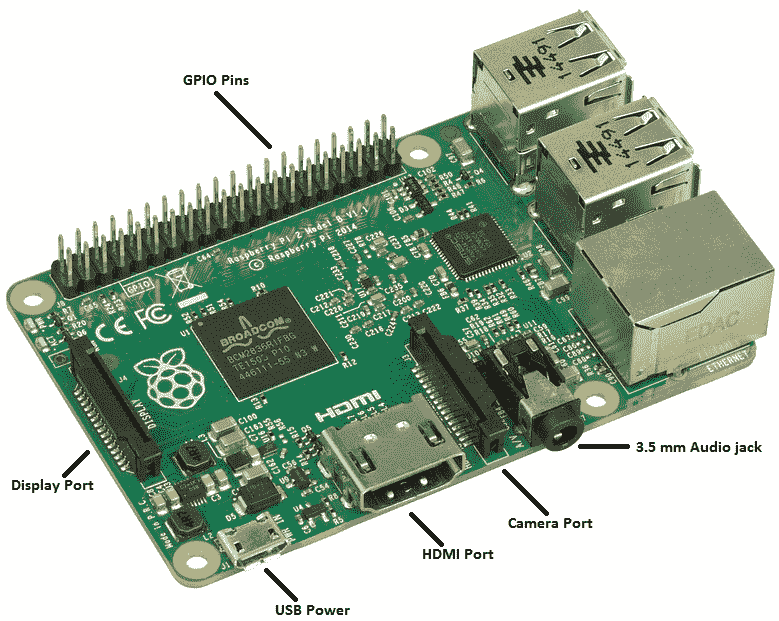

# 微控制器

**微控制器**是一个包含一系列设备的术语。它用来描述一个包含处理器、内存和输入/输出外围设备（或与这些外围设备交互的方式）的设备，该设备旨在执行特定类型的任务。一个极其常见的微控制器是 Arduino Uno，而树莓派在技术上也被归类为这一类别。

# 通用输入/输出（GPIO）引脚

微控制器通过发送和接收通过为输入和/或输出信号设计的引脚发送的电信号与传感器、LED 和按钮等设备进行接口。这些引脚可以分为多个子类别，正如我们在后续章节中将了解到的那样，但你可以将它们整体称为 GPIO 引脚。我们将在整本书中使用这个缩写。

# Debian 和 Raspbian

Debian 是一个针对 Linux 新手的非常用户友好的 Linux 发行版。它包含了许多在 Linux 预装时常用的实用程序，并且与许多你可能会用于计算机的外围设备兼容，例如 Wi-Fi 网卡和 USB 设备。

Raspbian 是专门为在树莓派设备上运行而修改的 Debian 版本。它为树莓派的 GPIO 引脚、USB Wi-Fi 设备和扩展槽提供了驱动程序，这些驱动程序允许你连接特定的显示屏和摄像头。

Raspbian 有两种版本——Raspbian Full 和 Raspbian Lite。Full 版本包含图形桌面，有针对教育编程和开发的程序。Lite（我们将用于本书的项目）只有命令行界面，但在使用树莓派外围设备时仍然具有完整的功能。截至本书编写时，Raspbian 的当前版本是 4.14，昵称为**Stretch**。

# Johnny-Five 和 Raspi-IO

回到 2012 年，Rick Waldron 编写了一个名为*node-serialport*的程序来操作 Arduino Uno，并围绕它创建了一个名为 Johnny-Five 的库。从那时起，Johnny-Five 库已经发展到超过 100 位贡献者，可以控制超过 40 个平台，包括树莓派！它还可以控制许多类型的传感器和外围设备，你可以使用这些设备在 Node.js 中创建你梦寐以求的机器人项目！

Johnny-Five 库能够支持如此多的平台之一的方式是通过创建所谓的 IO 插件。你为希望控制的每种类型的板创建一个 IO 插件。例如，我们将安装并使用 Raspi-IO 插件来使用 Johnny-Five 与树莓派。

这个系统的优点在于，你在本书中编写的代码可以在 Johnny-Five 支持的任何其他平台上使用（你只需要更改引脚号！）当你使用相同的 API 为任何可能使用的设备编写代码时，为 Node.js 机器人网络编写代码要容易得多。

# 因此，树莓派在技术上是一个微控制器...

让我们回到树莓派是什么的问题。简而言之，它是一个微控制器。它拥有数十个 GPIO 引脚，可以用来与许多物理外围设备接口，以实现特定的任务。低成本和小尺寸使得树莓派成为一个多功能的设备，但它的功率允许你用它来完成其他微控制器可能无法胜任的任务。

# ...但它也是一个计算机！

关于树莓派的一个有趣的事实是，虽然它是一个微控制器，但它也可以用作一台完整的计算机！虽然它当然不是最强大的硬件，但安装了完整的 Raspbian 系统后，连接到显示器、键盘和鼠标的树莓派可以成为孩子们和成人学习编程的绝佳机器！树莓派最初的目的是创建一个低成本的教育机器来教授编程，它在这一点上远远超出了所有人的预期。它同时也是为创客世界提供的一款优秀的微控制器，这是一个巨大的额外优势！

# 我们将如何使用树莓派

因此，我们已经确定树莓派（Raspberry Pi）对于其体积来说是一个非常灵活且强大的机器，但鉴于有如此多的选择，确定从哪里开始可能会有些困难。幸运的是，我们有一个计划，将引导你完成你的第一个树莓派和 Johnny-Five 项目，这样你就可以跟上进度，同时也会赋予你构建高级机器人项目的能力。

# 充分利用树莓派所能提供的一切！

我们将要构建的项目将利用树莓派既是微控制器又是计算机的事实。我们将通过 Raspbian 发行版使用 Linux 操作系统，并利用它来在 Node.js 中运行我们的项目。我们还将使用 Johnny-Five 和 Raspi-IO 来利用树莓派的 GPIO，以便以易于理解和可移植到许多不同硬件平台的方式创建机器人项目。

# Johnny-Five – 让我们能够在 Node.js 中编写硬件

在过去，当你想到机器人项目时，意味着用 C 或 C++编写代码，通常是通过 Arduino IDE 和 API。然而，随着微控制器的变得更加强大，它们能够运行其他编程语言，甚至是脚本语言，如 Python 和 JavaScript 的子集。

当然，有了像树莓派这样的计算机/微控制器混合体，你能够运行标准的 Node.js，这样你就可以在不处理任何底层语言的情况下创建甚至高级的机器人项目。能够在 Node.js 中编写机器人项目有很多好处：

+   **基于事件的系统**：在 Arduino 和 C/C++ 级别的机器人编程中，你需要通过循环的每次迭代检查每个事物的状态，并相应地采取行动。这可能会创建出庞大的函数和代码路径。使用 Node.js 和 Johnny-Five，我们可以使用事件发射器和系统，它们与实际世界的传感器读取和外设交互非常契合，因为实际世界中的事物需要时间。这将帮助你以反映世界异步工作方式的方式组织代码。

+   **垃圾回收/自动内存管理**：虽然 Arduino 和 C++ 会为你处理大部分内存管理，但在使用 C 的微控制器编程中，需要严格的内存管理。虽然你有时需要考虑 Raspberry Pi 的资源限制，但这比 20K SRAM 的时代要容易得多。

+   **使用你已知的语言**：与其试图记住新语言中事物的工作方式，不如专注于一次学习少量内容，这将加速你在电子和机器人领域的学习。使用 Node.js 可以帮助你专注于学习电子的广泛而多样的世界，而不是额外的工作，即记住它是 `uint8_t` 还是 `uint16_t`。

# 安装操作系统

为了开始使用 Johnny-Five 和 Raspberry Pi，我们需要通过将其烧录到 microSD 卡上来设置 Raspbian 操作系统。然后，我们需要编辑 SD 卡上的某些文件，以便 Raspberry Pi 能够带 Wi-Fi 和 SSH 功能启动。最后，在安装 Node.js、Johnny-Five 和 Raspi-IO 之前，我们需要启动 Raspberry Pi 并设置一些设置。

# 下载 Raspbian Lite

以下步骤将向您展示如何下载 Raspbian Lite：

1.  第一步是下载 Raspbian Lite 镜像，这样我们就可以将其烧录到我们的 microSD 卡上。获取镜像的最佳地点是 [`www.raspberrypi.org/downloads/raspbian/`](https://www.raspberrypi.org/downloads/raspbian/)，如下面的截图所示：

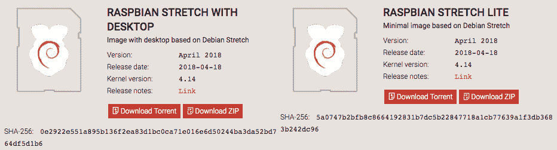

Raspbian 下载页面的截图，包含完整版和精简版下载链接

1.  选择 RASPBIAN STRETCH LITE（或当前版本），这将替换掉单词 STRETCH。给自己一些时间来完成这一步；虽然 Raspbian Lite 比完整的 Raspbian 小得多，但它仍然有几百兆字节，下载可能需要一些时间！

如果你正在准备使用 Raspberry Pi 和 Raspbian 运行一个班级、黑客马拉松或其他活动，最好是预先下载并将其放置在闪存驱动器上，以便分发，因为会议和活动的 Wi-Fi 可能比正常情况下慢，甚至可能断断续续，所以要做好准备！

# 将镜像烧录到 SD 卡中

幸运的是，将 OS 镜像烧录到 SD 卡的工具已经从复杂的命令行工具发展而来，这些工具可以像烧录 SD 卡一样轻松地覆盖您的电脑硬盘。我目前最喜欢的工具是**Etcher**，您可以在[`etcher.io/`](https://etcher.io/)下载，以下步骤所示：

1.  免费版已经足够满足我们的需求，因此下载并安装它，就像下载 Raspbian Lite 一样。

1.  下载完两者后，您需要将 micro SD 卡放入您的电脑中，无论是将其放入全尺寸 SD 适配器然后插入电脑的插槽，还是使用 USB-to-micro-SD 适配器。无论您使用哪种方式，在继续之前，请确保您的电脑可以看到该卷作为驱动器。然后，启动 Etcher。以下截图显示了 Etcher 在 Mac 上的运行情况：

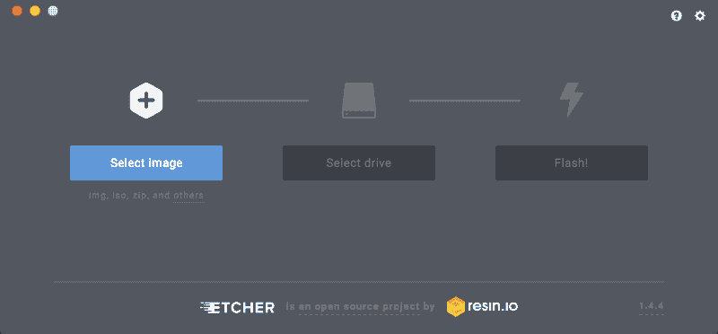

Etcher 程序在 Mac 上运行的截图

1.  一旦您看到与前面截图类似的窗口，您需要选择您刚刚下载的 Raspbian Lite 镜像。您甚至不需要解压`.zip`文件——Etcher 可以直接处理！选择镜像后，只要您的机器可以看到它，Etcher 应该会自动选择您的 micro SD 卡驱动器！一旦您确认镜像和 micro SD 卡驱动器已正确选择，点击“Flash！”开始烧录过程。

有时，对于较大的 micro SD 卡，Etcher 会发出关于驱动器非常大的警告（当我使用 64 GB 卡时就会发生这种情况）。这是为了防止您覆盖您的电脑硬盘。您可以通过确认窗口绕过警告——但请务必确保首先选中您的 micro SD 卡驱动器！

几分钟后，烧录器会将镜像烧录到您的 micro SD 卡上，然后验证镜像是否已存在于卡上。完成此操作后，**拔出并重新插入** micro SD 卡，以便您的电脑将其识别为驱动器；驱动器应命名为`boot`。我们还没有完全编辑完镜像文件，因此 Etcher 礼貌地尝试弹出 micro SD 卡驱动器时需要忽略。

# 编辑 SD 卡上的文件

我们需要编辑和创建一些文件在我们的 Raspberry Pi 镜像中，以便在打开 Raspberry Pi 时能够通过 SSH 访问它。首先，我们将使用以下步骤设置 Wi-Fi：

如果您使用以太网线和端口将 Raspberry Pi 连接到互联网，您可以跳过此步骤。如果这不能使 Wi-Fi 工作，您需要查看“启动 Pi”部分下的信息框以获取故障排除步骤和设置此设置的替代方法（如果更复杂）。

1.  为了设置 Wi-Fi，您需要在 micro SD 卡驱动器的根目录下创建一个名为`wpa_supplicant.conf`的文件，其中包含以下文本：

```js
ctrl_interface=DIR=/var/run/wpa_supplicant GROUP=netdev
update_config=1
network={
    ssid="yourNetworkSSID"
    psk="yourNetworkPasswd"
}
```

1.  将`yourNetworkSSID`替换为您要连接的 Wi-Fi 网络的 SSID，然后将`yourNetworkPasswd`替换为该 Wi-Fi 网络的密码。

在撰写本文时，Raspberry Pi 的 Wi-Fi 芯片只能连接到 2.4 GHz 网络，所以你需要确保你输入一个在该带宽上运行的网络，否则你的 Raspberry Pi 将无法连接！

1.  在你设置好 Wi-Fi 网络后，你将想要告诉 Raspberry Pi 允许你通过 SSH 连接到它。为此，你需要在 `wpa_supplicant.conf` 文件相同的 `root` 文件夹中创建一个名为 `ssh` 的文件。确保 `ssh` 文件为空且没有扩展名。完成所有操作后，micro SD 卡驱动器的 `root` 目录将类似于以下截图：

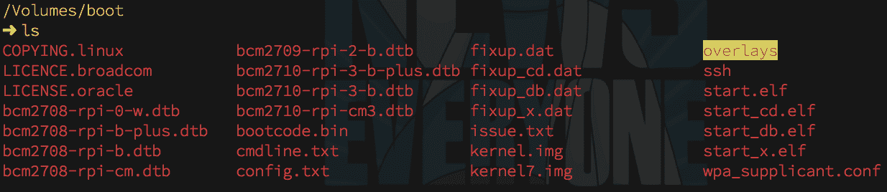

编辑后 micro SD 驱动器上的文件列表

一旦完成所有这些，完全弹出 microSD 驱动器，取出 microSD 卡并将其插入 Raspberry Pi。我们现在可以启动 Raspberry Pi 并开始安装软件。

# 启动 Pi

将 micro SD 卡插入后，将电源连接到 Raspberry Pi。一个红色和一个绿色的 LED 应该会亮起。红色 LED 应该是稳定的——这是电源指示灯。绿色灯会闪烁——这是指示活动的 LED。Raspberry Pi 在插入电源后最多需要一分钟来启动。接下来，我们将 SSH 连入。

# 从 Linux 或 Mac 进行 SSH 连接

如果你在一台 Mac 或 Linux 机器上，你将打开一个终端并输入以下内容：

```js
ssh pi@raspberrypi.local
```

如果你成功，你会看到一个询问主机真实性的问题出现。通过输入 `yes` 并按 *Enter* 来回答。然后，你会被要求输入密码，密码是 `raspberry`，如以下截图所示：

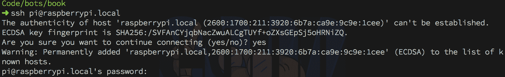

从 Mac 终端成功 SSH 进入 Raspberry Pi

输入密码后，你应该会看到以下内容：

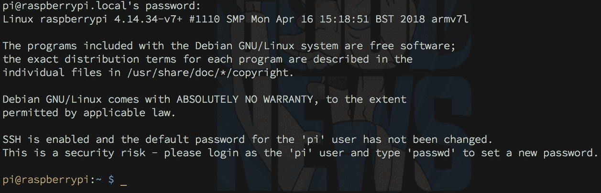

从 Mac 通过 SSH 成功登录 Raspberry Pi

# 从 Windows 进行 SSH 连接

为了从 Windows 机器上 SSH 连接，你需要使用一个名为 PuTTY 的程序。你可以在 [`putty.org/`](https://putty.org/) 获取它。但首先，你需要 Raspberry Pi 的 IP 地址。你需要一个显示器、一根 HDMI 线和一个 USB 键盘。一旦你有了这些，请按照以下步骤操作：

1.  在启动 Raspberry Pi 之前，将显示器、HDMI 线和 USB 键盘连接到 Raspberry Pi **。然后插入电源**。

1.  当它提示你输入用户名时，输入 `pi`。当它要求输入密码时，输入 `raspberry`。一旦你登录，输入 `ifconfig`。你应该会看到大量信息出现。

1.  在 `wlan0` 部分下方查找 `inet` 地址。对于以下输出，IP 地址是 `192.168.1.106`，如以下截图所示。将此 IP 地址记下来。然后，你可以拔掉显示器和键盘——你不会再需要它们了：

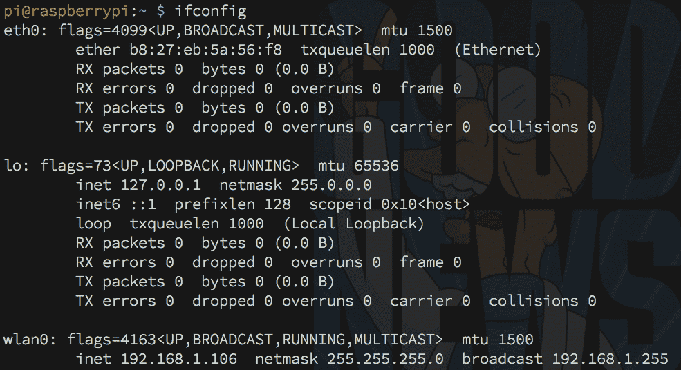

从终端获取 IP 地址

1.  一旦你有了树莓派的 IP 地址，你就可以启动 PuTTY。打开的窗口是配置窗口，如下面的截图所示：

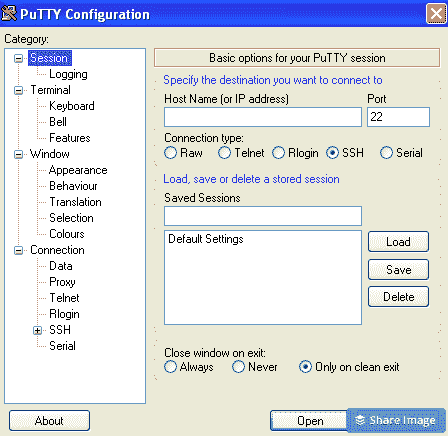

PuTTY 配置窗口

1.  将你获得的 IP 地址输入到标记为“主机名（或 IP 地址）”的字段中，然后点击“打开”按钮。你将被询问关于主机真实性的问题（仅在你第一次连接时）。选择“是”。然后当提示时，输入`Pi`作为用户名，`raspberry`作为密码。完成这些后，你应该会看到以下内容：

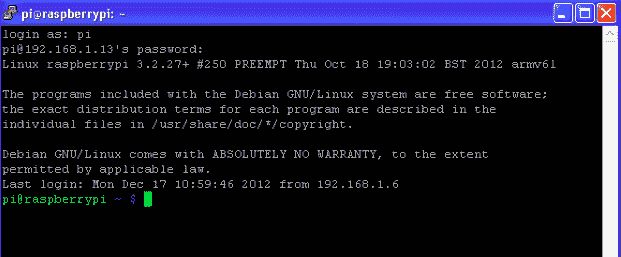

使用 PuTTY 成功登录树莓派

现在每个人都已登录，让我们为我们的项目设置树莓派！

# 设置密码和硬件接口

现在我们已经将树莓派连接到 Wi-Fi 并 SSH 登录，在安装 Node.js 和开始编码之前，我们需要做一些更改。

# 首先，更改你的密码！

当你登录时，你的树莓派会警告你，使用默认用户名和密码启用 SSH 并不非常安全，这是绝对正确的！第一步是更改我们的密码。

为了做到这一点，在你的 SSH 窗口中，输入`passwd`并按*Enter*键。你将被提示输入当前密码（`raspberry`）和新密码。输入你喜欢的任何密码（只是不要忘记它！）然后你会被要求确认，哇！新密码已设置，如下面的截图所示。你的树莓派将更加安全：


更改 Pi 密码

# 更新树莓派

接下来，通过运行以下命令确保树莓派已更新并准备好使用：

```js
sudo apt-get update && sudo apt-get upgrade
```

这将花费一些时间，但确保一切正确更新是值得的。

# 打开硬件接口

接下来，我们将设置树莓派，以便我们的硬件代码可以运行。运行以下命令：

```js
sudo raspi-config
```

你将看到一个带有许多不同选项的图形菜单，如下面的截图所示：

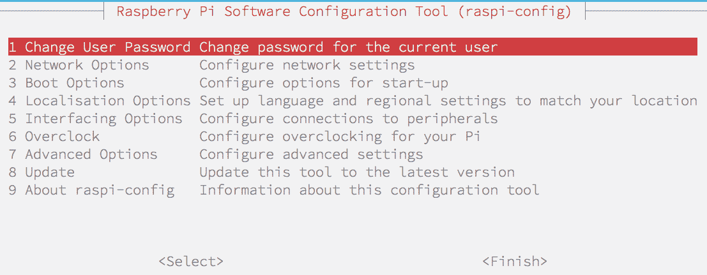

raspi-config 菜单

你将想要使用箭头键选择`接口选项`，然后选择`I2C`和`是`来打开它。重复 SPI，然后使用*Tab*键关闭菜单。当它提示你重启时，说`是`，然后 SSH 重新登录，因为你要准备安装 Node.js、Johnny-Five 和 Raspi-IO！

# 安装 Node.js、Johnny-Five 和 Raspi-IO

因此，现在我们的 Raspbian 操作系统已安装并设置好，是时候安装 Node.js（它捆绑了 npm）、Johnny-Five 和 Raspi-IO 了！

# 安装 Node.js 和 npm

在过去，你必须在 Pi 上编译 Node.js 源代码，由于 Raspberry Pi 使用的 ARM 处理器没有二进制文件，因此成功率各不相同。幸运的是，由于过去几年第三方的大力支持，你现在可以从 [`nodejs.org/en/`](https://nodejs.org/en/) 网站轻松下载二进制文件！但我们如何从 Raspberry Pi 的命令行中完成这个操作呢？

# 检测你的 ARM 处理器版本

如果你使用的是本书推荐的 Raspberry Pi 3 Model B，你很可能在 ARM v8（Raspberry Pi 3 原本是 ARMv7，这也很好！）上。但你应该始终检查（如果你使用的是不同的 Raspberry Pi，如 Pi Zero 或 Pi 2/1 系列，则应加倍检查）。要在你的 Raspberry Pi 上检查 ARM 版本，请在 SSH 终端中运行以下命令：

```js
uname -m
```

你将看到一个类似 `armv#` 的返回消息，其中 `#` 是一个数字（可能后跟一个字母）。这个数字很重要，因为它告诉我们需要哪个 Node.js 二进制文件。一旦你有了你的 ARM 版本，请按照以下步骤操作：

1.  前往 Node.js 下载页面 [`nodejs.org/en/download/`](https://nodejs.org/en/download/)，如下截图所示：

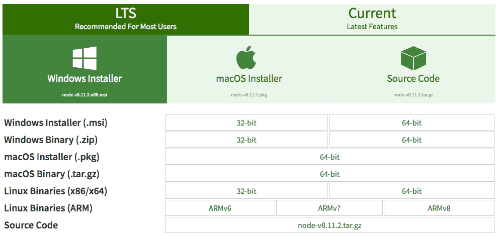

Node.js 二进制下载页面的快照

1.  右键单击你需要的 ARM 版本链接并复制 URL。然后，在你的 Raspberry Pi 的 SSH 终端中运行以下命令：

```js
wget <binary-download-url>
```

将 `<binary-download-url>`（包括尖括号）替换为你从 Node.js 下载网站复制的 URL。下载完成后，我们需要使用以下代码提取存档：

```js
tar -xvf node-v****-linux-armv**.tar.xz
```

1.  星号将根据 Node.js 的当前 LTS 版本和你的 ARM 版本而有所不同。Raspberry Pi 将在控制台输出大量的文件名，然后返回你的 shell 提示符。这意味着二进制文件已经被提取到你的 `home` 文件夹中。我们需要将它们放入 `/usr/local` 文件夹。为此，请运行以下命令：

```js
cd node-v****-linux-armv** 
sudo mv ./lib/* /usr/local/lib
sudo mv ./share/* /usr/local/share
```

1.  这将把所有预编译的二进制文件移动到你的 Raspberry Pi 上的新位置。一旦完成，运行以下命令：

```js
node -v
npm -v
```

你应该会看到以下类似的内容：

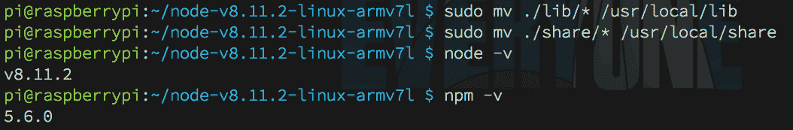

成功的 Node.js 安装结果

1.  如果一切顺利，你现在已经安装了 Node.js 和 npm！让我们用 Johnny-Five 和 Raspi-IO 来结束这个话题！请注意，你可以通过运行以下命令来完全清理二进制下载：

```js
cd ~
rm -rf node-v**-linux-armv**
rm -rf node-v****-linux-armv**.tar.xz
```

一些有更多 Debian 经验的人可能会问，*为什么我们不能直接使用* *apt-get*？简短的回答是，名为 `node` 的软件包很久以前就被占用了，因此，由于这种情况，以及 `sudo apt-get install nodejs` 已经过时（在撰写本文时，使用此命令将安装 `v4`，而不是我们需要的 `v8+`，如果它安装 Node.js 的话），我们需要下载二进制文件并自己移动它们。

# 安装 Johnny-Five 和 Raspi-IO

要安装 Johnny-Five，一旦你确认已经安装了 Node.js 和 npm，运行以下命令：

```js
npm i -g johnny-five raspi-io
```

这将全局安装库；你不需要在每个新项目中重新安装它。就这样！你现在可以开始使用 Johnny-Five 在树莓派上开发 Node.js 机器人项目了！

# 摘要

感觉好像有很多，但现在你已经完成了构建这本书中项目所需的完整开发环境，并且你已经迈出了用 JavaScript 构建机器人的第一步。你了解了更多关于树莓派是什么以及为什么我们使用它，以及如何准备操作系统镜像！

# 问题

1.  我们将在本书的项目中使用哪种常见的树莓派操作系统，以及它是基于哪个 Linux 发行版的？

1.  GPIO 代表什么？

1.  谁最初启动了 Johnny-Five 项目，他们用它来控制什么？

1.  你在树莓派上运行什么命令来找出它使用的 ARM 架构？

1.  为什么更改树莓派的默认密码很重要？

1.  使用 JavaScript 和 Node.js 进行机器人代码有哪些好处？

1.  为什么我们必须下载 Node.js 的二进制文件而不是使用 Raspbian 的包管理器？

# 进一步阅读

你可以使用以下资源进一步阅读本章涉及的主题：

+   **从树莓派组织的网站了解更多关于树莓派的信息**：[`www.raspberrypi.org/`](https://www.raspberrypi.org/)

+   **从 Johnny-Five 的主项目页面了解更多关于 Johnny-Five 的信息（随着我们使用他们的文档来完成本书的许多项目，我们将看到很多这个网站）**：[`johnny-five.io/`](http://johnny-five.io/)

+   **从 Raspbian 网站了解更多关于 Raspbian 操作系统的信息**：[`www.raspberrypi.org/documentation/raspbian`](https://www.raspberrypi.org/documentation/raspbian/)
