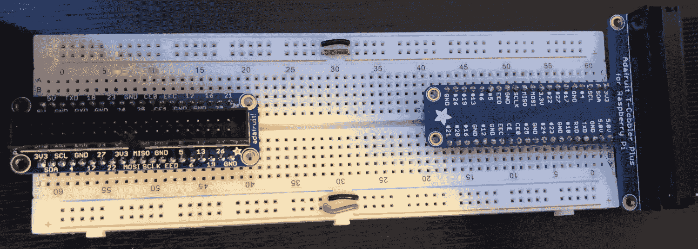
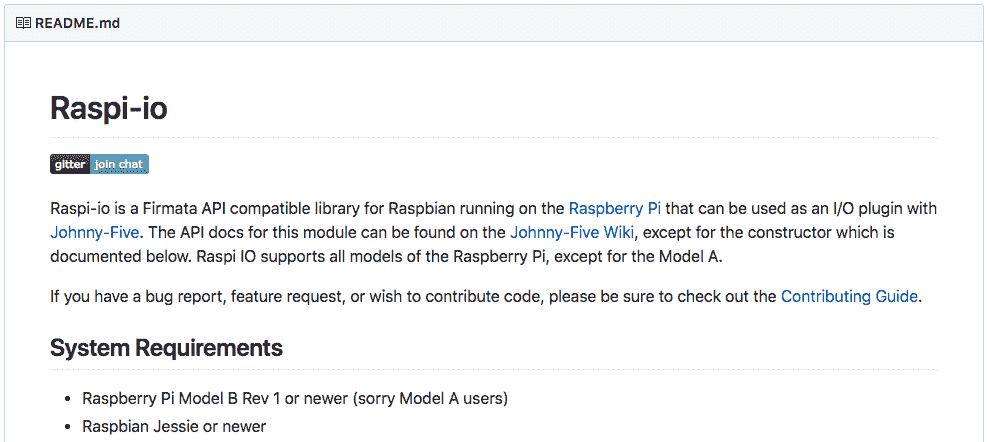
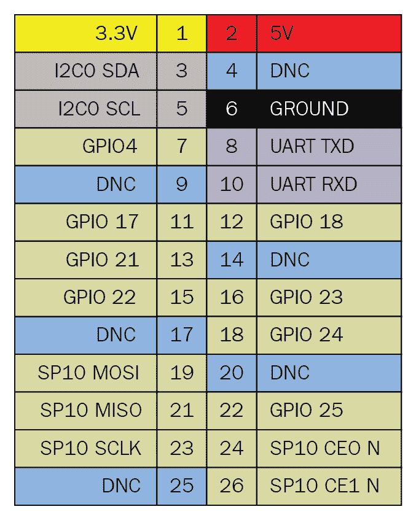
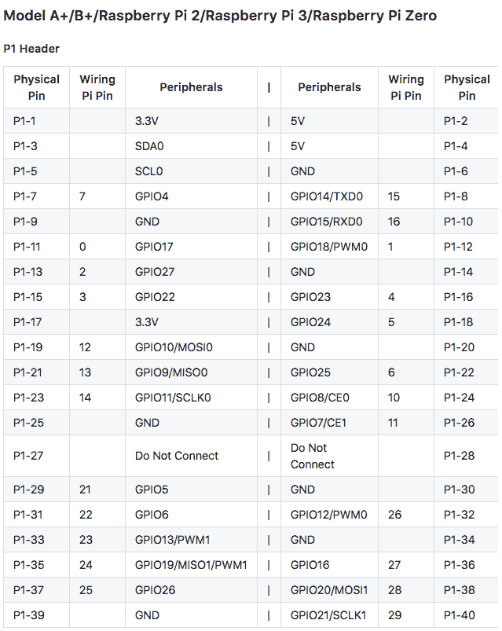
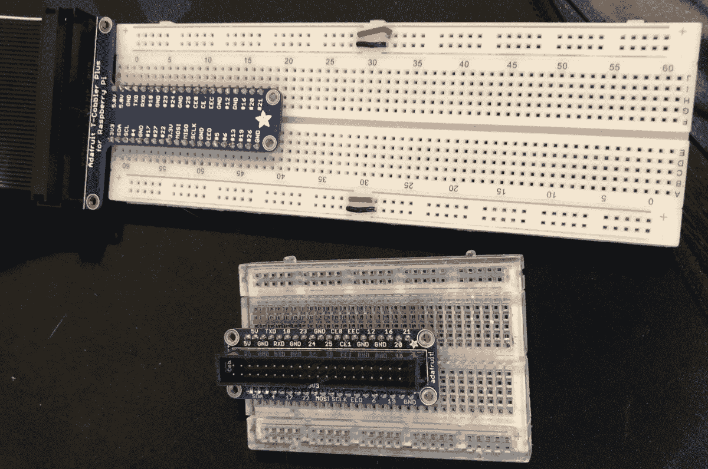
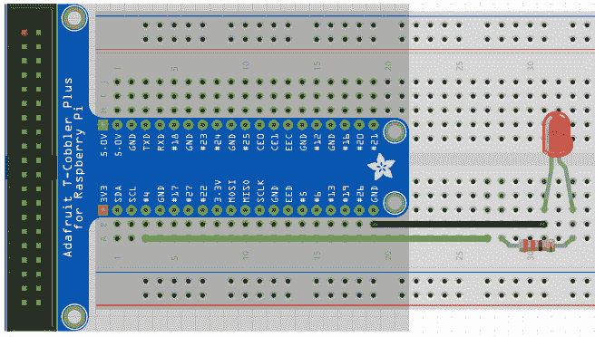

# 第二章：创建您的第一个 Johnny-Five 项目

现在我们已经设置了开发环境，是时候开始编写代码并让 LED 发光了！我们将从运行 Johnny-Five 机器人的“Hello World！”开始：让 LED 闪烁。在这个过程中，我们将了解如何导航 Johnny-Five 和 Raspi-IO API 文档，并检查 Johnny-Five 的事件系统。

本章将涵盖以下主题：

+   创建项目文件夹

+   安装 Johnny-Five 和 Raspi-IO

+   连接 LED

+   让 LED 闪烁

# 技术要求

您将需要第一章“设置开发环境”中设置的 Raspberry Pi，一个面包板，以及一个 Pi Cobbler 以方便引脚访问。您可以从 Adafruit、SparkFun 或 Amazon 购买 Pi Cobbler（有时也称为 Pi Wedge）。Pi Cobbler 也包含在第一章“设置开发环境”中推荐的套件中。

本章的示例代码在此：[`github.com/PacktPublishing/Hands-On-Robotics-with-JavaScript/tree/master/Chapter02`](https://github.com/PacktPublishing/Hands-On-Robotics-with-JavaScript/tree/master/Chapter02)。

以下图显示了两种不同的 Raspberry Pi Cobbler，都来自 Adafruit。右侧的 Cobbler 连接了扁平电缆：



我们将在本章后面讨论如何设置 Cobbler。您还需要一个 LED、一些跳线或面包板电线，以及一个 330 欧姆的电阻。

如果您在问自己“电阻器是什么，它有什么作用？”，简短的解释是电阻器将阻止来自引脚的 5V 电流烧毁需要接近 3.3V 电流的 LED。有关电流、电压和电阻的更深入介绍，SparkFun 网站上有一些优秀的免费材料。您可以通过以下链接访问这些材料：

**电流**：[`learn.sparkfun.com/tutorials/what-is-electricity`](https://learn.sparkfun.com/tutorials/what-is-electricity)

**电阻器**：[`learn.sparkfun.com/tutorials/resistors`](https://learn.sparkfun.com/tutorials/resistors)

# 创建项目文件夹

我认为组织 Raspberry Pi 的最佳方式是将每个项目放在自己的文件夹中。在这本书的源代码中，我已经这样做了。但让我们一步一步地了解如何设置您自己的项目文件夹。首先，您需要创建文件夹本身。对于本章的项目，我们将称之为`led-blink`，您需要运行以下命令：

```js
cd ~
mkdir led-blink
```

确保您在 Raspberry Pi 的 SSH 会话中运行此命令，而不是在您的桌面上。

从现在开始，除非文本中直接说明要在您的桌面上运行某些内容，否则您应该在我们在第一章，“设置开发环境”中设置的 Raspberry Pi 的 SSH 会话中运行所有命令。

# 设置 npm 来管理我们的模块

我们将使用不仅仅是 Johnny-Five 和 Raspi-IO 来创建我们的项目，并且你希望能够通过你喜欢的 Git 托管服务移动你的代码，例如将其移动到新的 Raspberry Pi。为了使这个过程尽可能顺利，我们将确保 `npm` 能够准确地重新创建你的项目。为此，我们想要一个预先准备好的 `package.json` 文件。为此，导航到你的 `project` 文件夹并初始化它：

```js
cd led-blink
npm init -y
```

`npm init` 命令中的 `-y` 选项告诉 `npm` 使用默认答案回答所有初始化问题。这对于只有你将使用的项目来说是可以的，但如果你打算将你的工作部署供他人使用，或者创建自己的 `npm` 模块，请确保相应地编辑你的 `package.json` 文件。

这些命令创建我们的 `package.json`，这样当我们使用 `--save` 选项安装 `npm` 模块时，清单将更新，以便当你移动你的项目时，有一个完整的依赖项记录。

# 开始使用 Johnny-Five 和 Raspi-IO

现在我们项目文件夹已经准备好依赖项，我们将开始探索 Johnny-Five 和 Raspi-IO 文档，这些文档将帮助我们创建本书中的项目。

# 收集资源和文档

我们将使用以下两个主要来源的文档来为本书中的项目：

+   **Johnny-Five 网站**：[`johnny-five.io/`](http://johnny-five.io/)

+   **Raspi-IO GitHub README 和 wiki**：[`github.com/nebrius/raspi-io`](https://github.com/nebrius/raspi-io)

以下截图显示了 GitHub 上的 Raspi-IO README：



我们将使用 `johnny-five.io` 上的 Johnny-Five 文档来查找 API 调用和其他关于 Johnny-Five 库的信息，以及用于 Raspberry Pi 特定信息的 Raspi-IO README，包括引脚编号。

# 查看 LED 闪烁项目

我们首先需要的是来自 Raspi-IO README 的内容：我们将阅读并运行他们的 `led-blink` 代码作为我们的 *Hello World!* 让我们看看代码块：

```js
const Raspi = require('raspi-io');
const five = require('johnny-five');

const board = new five.Board({
  io: new Raspi()
});

board.on('ready', () => {

  // Create an Led on pin 7 (GPIO4) on P1 and strobe it on/off
  // Optionally set the speed; defaults to 100ms
  (new five.Led('P1-7')).strobe();

});
```

这看起来不多，但这里发生了很多事情！前两行使用 `require` 引入 `johnny-five` 和 `raspi-io` 模块。然后，我们开始构建一个 `board` 对象，并将一个新的 `raspi-io` 模块实例作为其 I/O 传递。这是我们告诉 Johnny-Five 库我们在 Raspberry Pi 上运行代码的方式。

接下来，我们将在 `ready` 事件上设置我们的板对象的事件监听器。根据 Johnny-Five 文档，此事件在 *板实例对象完成任何必须在程序运行之前进行的硬件初始化后触发*。这意味着你不应该在事件处理器之外运行任何与机器人相关的代码，因为你不能确定你的板是否已准备好接收硬件命令。

从第 10 行开始的注释非常有帮助，因为它们告诉我们如何连接我们的 LED。我们将使用引脚 7（GPIO 4）——这意味着从顶部起的第七个物理引脚，被指定为 GPIO 4。

# Raspberry Pi 引脚编号

引脚 7...标记为 GPIO 4？这很令人困惑！幸运的是，有许多免费的引脚图可以帮助我们翻译，如下面的图所示：



一个 GPIO/引脚图（来源：raspberrypi.org）

此外，Raspi-IO 库将接受许多相同的引脚名称，如 wiki 中方便的转换表所示：



来自 Raspi-IO wiki 的引脚表

当在 Raspberry Pi 上连接任何 Johnny-Five 项目时，保留这些引脚指南是很有帮助的。

# 连接 LED

现在我们已经通过了文档，并弄清楚哪里放什么，我们可以开始组装我们的 Raspberry Pi 项目。你需要你的 Raspberry Pi、Pi Cobbler、两根面包板电线、一个 LED（颜色不重要）和一个 300 欧姆电阻。

# 组装并连接 cobbler

为了确保 cobbler 放置正确，你需要确保当放置在 GPIO 引脚上时，扁平电缆从 Raspberry Pi 向外延伸，并且连接器侧面的小卡子面向 cobbler 的正确方向（这通常由扁平电缆插入的引脚周围的塑料墙确保；在施加过多压力之前，请确保它已对齐！）。

你希望将 cobbler 放置在至少半尺寸的面包板上，尽管我倾向于使用全尺寸的 Raspberry Pi 项目。确保 cobbler 上的两排引脚位于面包板中心凹槽的两侧，如下面的照片所示：



全尺寸（顶部）和半尺寸（底部）面包板上的 cobbler

新手使用面包板？SparkFun 网站上有一个关于它们如何工作的出色解释（以及一些有趣的趣闻），[`learn.sparkfun.com/tutorials/how-to-use-a-breadboard`](https://learn.sparkfun.com/tutorials/how-to-use-a-breadboard)。

# 连接电阻和 LED

你需要使用一根电线将 GPIO 4（引脚 7）连接到 330 欧姆电阻，并将电阻连接到 LED 的正极（长腿）。然后，你需要将负极（短腿）连接到地，或任何标记为 GND 的引脚。你的完成项目将看起来像这样：



你的 LED 项目

现在 LED 已经连接好了，是时候让它闪烁了！

# 让 LED 闪烁

为了让 LED 闪烁，我们需要在 Raspberry Pi 上安装代码，然后运行它！

# 将代码放置在 Raspberry Pi 上

如果你已经在你的桌面上编写了代码，需要将其传输到你的 Raspberry Pi，有几种方法可以做到：你可以在 macOS X 或 Linux 机器上使用`rsync`：

```js
rsync ./blink-led.js 
pi@raspberrypi.local:~/<project folder>/
```

将 `<项目文件夹>` 替换为你想要转移到的文件夹（例如，书籍文件夹将是 `hands-on-robotics-with-javascript/ch2/blink-led`）。

对于 Windows，请遵循在 [`winscp.net/eng/docs/ui_commander`](https://winscp.net/eng/docs/ui_commander) 安装和使用 WinSCP 的指南。

# 运行你的代码

一旦你的代码在 Raspberry Pi 上，你将想要切换到你的 SSH 会话并运行以下命令，如果你使用的是本书的源代码：

```js
cd hands-on-robotics-with-javascript/ch2/blink-led
```

否则，使用 `cd` 命令进入你在 Raspberry Pi 上存储 `blink-led.js` 文件的文件夹。然后，运行以下命令：

```js
sudo node blink-led.js
```

注意，Raspi-IO 插件要求你以 `sudo` 命令运行。如果一切顺利，你应该在你的面包板上看到一个快速闪烁的 LED。如果不这样，这里有一些故障排除步骤：

1.  检查线路

1.  仔细检查线路（真的，95% 的时间问题是线路问题）

1.  确保在 Raspberry Pi 上 Node.js 脚本没有出现错误

# 摘要

恭喜！你已经制作了一个 Johnny-Five 机器人！在本章中，你学习了如何连接 LED，浏览 Johnny-Five 和 Raspi-IO 的文档，并在 Raspberry Pi 上运行你的代码！

# 问题

1.  在 Johnny-Five 文档中查看，在 API 部分的 LED 节下查找 `strobe` 函数。第一个参数做什么？如果你将 500 作为第一个参数传递会发生什么？

1.  `LED.strobe()` 函数的第二个参数是什么？这对于等待 LED 关闭的应用程序有什么帮助？

1.  Johnny-Five 的 LED 对象是否发出任何事件？为什么，或者为什么不？

1.  使用 Raspi-IO 文档，Raspberry Pi 的 P1-29 引脚在 GPIO #方面是如何翻译的？

1.  使用 Johnny-Five 文档，命名一个与 `LED.strobe()` 函数同义的函数。

1.  在 Johnny-Five 应用程序中，`ready` 事件触发之前会发生什么？

# 进一步阅读

你可以查阅以下资源，以获取与本章节主题相关的进一步阅读材料：

+   **Johnny-Five 文档**：[johnny-five.io](http://johnny-five.io)

+   **Johnny-Five GitHub 仓库**：[`github.com/rwaldron/johnny-five`](https://github.com/rwaldron/johnny-five)

+   **Raspi-IO 库**：[`github.com/nebrius/raspi-io`](https://github.com/nebrius/raspi-io)
