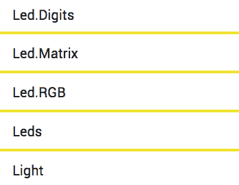
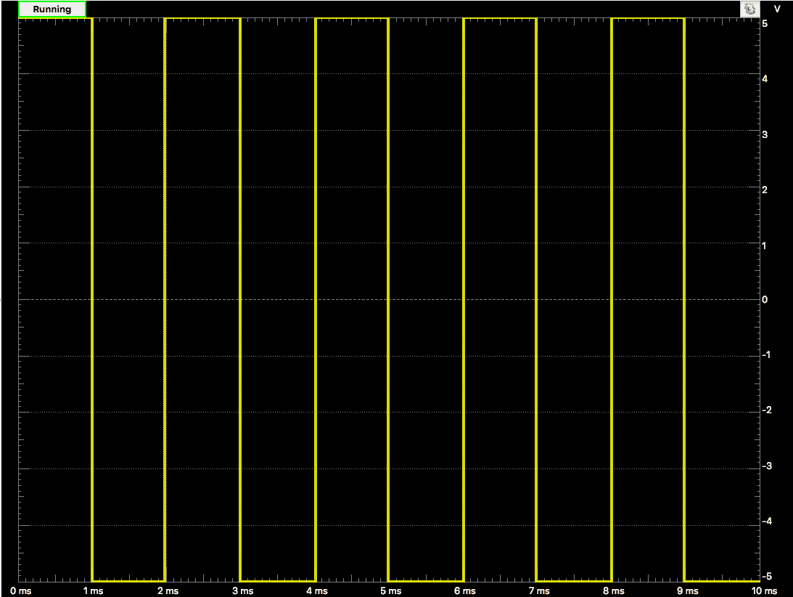
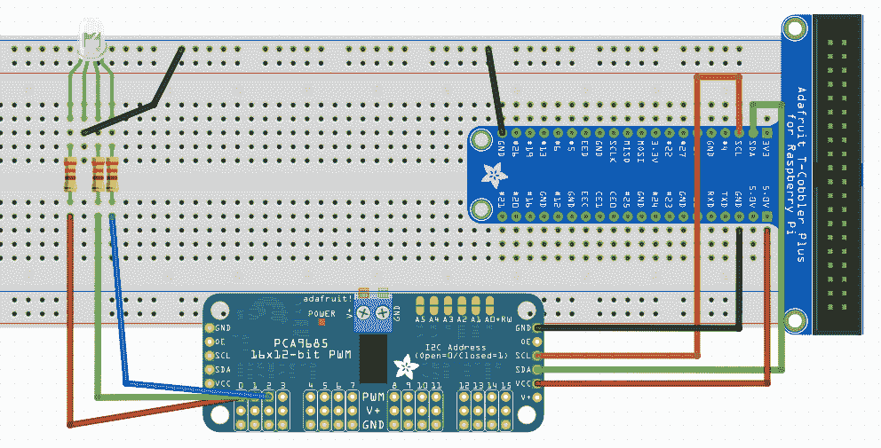

# 第三章：使用 RGB LED 构建交互式项目

现在我们已经使用 Johnny-Five 和 Raspi-IO 构建了一个项目，现在是时候处理 GPIO 扩展器和 PWM 输出了，并使用 RGB LED 构建一个交互式项目。我们还将了解更多关于 Johnny-Five REPL 的信息，了解 PWM 引脚的工作原理，并使用这些知识从命令行控制 RGB LED。

本章将涵盖以下主题：

+   查看 LED 和 LED.RGB API

+   PWM 引脚和 GPIO 扩展器

+   带有颜色的其他节点包

+   Johnny-Five REPL

# 技术要求

您已经从第一章，*设置您的开发环境*中安装了本章所需的全部软件先决条件。您需要确保您的 Raspberry Pi 连接到互联网，并且已经使用您选择的方法 SSH 登录。

本章的示例代码可以在[`github.com/nodebotanist/hands-on-robotics-with-javascript/tree/master/ch3`](https://github.com/nodebotanist/hands-on-robotics-with-javascript/tree/master/ch3)找到。

对于硬件，您需要以下内容：

+   您的 Raspberry Pi

+   Cobbler/breadboard

+   Breadboard wires

+   PCA9685 GPIO 扩展板

+   RGB LED

+   330 欧姆电阻 x 3

# 查看 LED 和 LED.RGB API

在上一章中，我们简要地介绍了 Johnny-Five 中的 LED API，但在本章中，我们将深入探讨并讨论 PWM 输出以及标准 LED 的表亲 RGB LED——之所以这样命名，是因为它有一个红色、绿色和蓝色通道，可以复制数千种颜色。我们将使用 RGB LED 以及 Johnny-Five 中内置的一些更强大的工具，在本章中构建一个交互式项目。

# LED 对象

LED 对象通常是人们首先查看 Johnny-Five 文档的对象。它也是一个很好的对象，可以用来概述对象文档的一般结构。让我们看一下每个部分，并了解我们稍后应该在哪里查找什么：

+   **参数**：本节讨论需要传递给对象构造函数的参数，以及它们需要采取的形式（顺序、对象键等）。

+   **形状**：这些是附加到构建对象上的字段，可能对用户编写代码有用。它们可以是只读的，如果是这种情况，会有标记。

+   **组件初始化**：这通常是一段示例代码，但它始终是对如何构建相关对象的常见用法的描述。如果有多个控制器用于特定组件，它们将使用每个控制器的示例进行列举。这对于我们的 GPIO 扩展板将很有用。

+   **用法**：这是一个示例代码，表示如何使用对象的最基本功能；对于 LED，这是`blink`函数，对于传感器，这将显示您通常用于从传感器获取读数的函数。

+   **API**：这是对对象可用的每个函数的完整文档，包括参数和预期结果。

+   **事件**：许多对象会发出事件（例如板上的 `ready` 事件）；本节详细说明了它们何时会触发。

+   **示例**：Johnny-Five 社区是一个极好的示例来源，与所讨论对象相关的示例将被编目并链接在本节中。

花点时间熟悉 LED 文档 ([`johnny-five.io/api/led/`](http://johnny-five.io/api/led/))，因为 `Led.RGB` 对象实际上是 LED 对象的一个子类，并将继承其许多功能。

# Led.RGB 对象

一旦你熟悉了 LED 对象，点击侧边栏中的 Led.RGB 链接，如下截图所示：



你将被带到 Led.RGB 文档页面。在 *组件初始化* 部分，查找 *LED RGB PCA9685* 部分。忽略布线图（它是为 Tessel 2，一个不同的微控制器），但请注意示例代码，如下所示：

```js
new five.Led.RGB({
   controller: "PCA9685",
   pins: {
     red: 2,
     green: 1,
     blue: 0
   }
});
```

这是我们将用来初始化 `RGB.LED` 对象的代码。

我们还需要 API 部分，以便确定我们使用 `RGB.LED` 对象所需的函数和参数。特别看一下 `color()` 函数。

现在我们有了将颜色转换为 RGB 值的模块，我们可以开始讨论如何使用 RGB LED 将这些颜色引入我们的项目中。

# PWM 引脚和 GPIO 扩展器

在我们连接并运行 RGB LED 项目之前，关于 PWM 引脚和 GPIO 扩展器的讨论是必要的，因为这些话题将影响你将要完成的绝大多数 Johnny-Five 项目。

# PWM 引脚是如何工作的？

你并不总是想让 LED 以全亮度发光，尤其是在 RGB LED 的情况下，每个通道（红色、绿色和蓝色）的亮度决定了 LED 的感知颜色。大多数微控制器的引脚是数字的：它们在 5V 时为 HIGH，在 0V 时为 LOW。那么，你如何使用这些类型的引脚调整 LED 的亮度呢？答案涉及到平均电压和我们可以翻转数字引脚从 HIGH 到 LOW 的速度。

脉宽调制（PWM）引脚通过设置引脚 HIGH 和 LOW 的时间百分比来操作。以下截图显示了在短时间内以 50% 运行的引脚状态的示波器读数：



50% PWM 引脚的示波器读数

与 LED 闪烁开和关相比，这导致 LED 看起来以半亮度发光：这是因为人眼无法跟上状态变化的速度，看到的是 LED 是开着的，但变暗了。这有助于我们通过组合不同亮度的红、绿、蓝通道来使用 RGB LED 创建数千种不同的颜色。

当我们在 Johnny-Five 代码中设置颜色时，我们可以传递从`0`到`255`的值给红色、绿色和蓝色。这很好地与使用相同范围的 Web 十六进制颜色一起工作。一般来说，你可以设置 PWM 引脚从`0`到`255`（本书范围之外的某些例外除外）。

# 为什么我们需要 GPIO 扩展器

那么，为什么我们一开始就需要 GPIO 扩展器，当树莓派有这么多 GPIO 引脚时？这是因为 PWM 引脚需要计算资源和定时器，许多微控制器都有有限的硬件 PWM 引脚。你可以用软件模拟 PWM 引脚，但结果往往不可靠。例如，Arduino Uno 有八个 PWM 引脚。树莓派只有一个 GPIO 引脚，许多项目（包括本书后面包含的伺服和电机项目）将需要比一个更多的引脚，我们不希望使用软件 PWM。

这就是为什么我们使用 PCA9685 GPIO 扩展器的原因：它有 16 个专用的 PWM 引脚，并提供所有资源来运行它们。它使用名为 I²C（发音为*eye-squared-see*）的协议与树莓派通信，其细节超出了本书的范围，并且被封装在 Johnny-Five 组件对象中。如果你想了解更多关于 I²C 如何工作，请参阅*进一步阅读*部分。

# 连接我们的 GPIO 扩展器和 RGB LED

首先，你将想要将 PCA9685 扩展板连接到你的 PI 上：GND 连接到 GND，VCC 连接到 5V，SDA 连接到 SDA，SCL 连接到 SCL。接下来，从 cobbler 连接一个第二个 GND 引脚到面包板侧面的一个地线。然后是我们的 LED：长腿连接到地线。长腿一侧单独的腿是红色通道；将其连接到 PCA9685 板上的 0 列 PWM 行引脚。绿色和蓝色在另一侧；分别将它们连接到 PWM-1 和 PWM-2。完成所有这些后，你的项目应该看起来类似于以下：



本章项目的完成布线

# 引入其他 Node 包

Node.js 以创建小型、几乎微小的包而自豪，并且拥有出色的 npm 包管理器（以及其他工具）来帮助管理这些包。因为树莓派运行的是完整的 Node.js 版本，我们可以利用这一点来构建更有趣的项目。

# 项目 - 构建彩虹

你能立刻想起橙色 RGB 代码吗？我做不到。将我们已知颜色系统转换为 RGB（尤其是像红色、橙色和矢车菊蓝这样的名称）更容易记住。但与其构建一个为我们转换颜色的函数，我们不如利用我所说的 Stilwell 定律：*如果你想到了，它可能已经在 npm 上了*。不出所料，颜色模块将帮助我们。

# 使用`color npm`模块

为了使用`color npm`模块，我们首先需要安装它。在你的 SSH 会话中，在你的`项目`文件夹中，运行以下代码：

```js
npm i --save color
```

这也将保存颜色包到您的 `package.json` 中，以便于代码的可移植性。该模块导出一个函数，我们将使用它将像 `red` 或 `#FF0000` 这样的颜色字符串转换为表示 `red`、`green` 和 `blue` 的整数数组。我们将使用这些值来设置我们的 RGB LED。以下是一个示例：

```js
const Color = require('color')

let ledColor = Color('orange')
let ledRed = ledColor.red()
let ledGreen = ledColor.green()
let ledBlue = ledColor.blue()
```

我们将使用这个功能来帮助设置 Johnny-Five 程序中 RGB LED 的颜色。

# 启动我们的 Johnny-Five 代码

让我们结合我们对 `Led.RGB` 对象和颜色 npm 模块的了解，来创建一个基本的代码项目，我们将称之为 `rgb-led-rainbow.js`：

```js
const Raspi = require('raspi-io')
const five = require('johnny-five')
const color = require('color')

const board = new five.Board({
 io: new Raspi()
})

board.on('ready', () => {
  let rgbLED = new five.Led.RGB({
  controller: "PCA9685",
  pins: {
    red: 0,
    green: 1,
    blue: 2
  }
  });

  let colors = ['red', 'orange', 'yellow', 'green', 'blue', 'rebeccapurple']
  let colorIndex = 0
  let currentColor

  setTimeout(() => {
    currentColor = color(colors[colorIndex])
    rgbLED.color([currentColor.red(), currentColor.green(), currentColor.blue()])
    colorIndex++
    if(colorIndex >= colors.length) {
      colorIndex = 0
    }
  }, 1000)
})
```

此代码循环遍历 `colors` 数组中的颜色，并且每秒设置一次 RGB LED 的颜色，并向前移动，生成彩虹。

# REPL - Johnny-Five 中的强大工具

调试我们的 LED 可能很棘手。在不重新布线的情况下，我们如何判断我们的绿色和蓝色通道是否颠倒，或者红色是否比其他通道亮得多？一个在调试 Johnny-Five 项目时非常有用的工具是 **读-求值-打印循环**（**REPL**）。

# REPL 是如何工作的？

如果您以前使用过 Node.js、Python 或其他一些解释型语言，REPL 可能对您来说并不陌生。它允许您在运行时将语句写入 CLI 以直接从语言引擎生成结果。这在调试代码时非常有帮助，因为您可以在运行时查看并修改代码的状态。这在 Johnny-Five 中也是如此：REPL 允许我们插入 Johnny-Five 对象，因此我们可以查看并操作它们在运行时的状态。我们将使用这个功能来玩我们的 RGB LED 并从命令行控制它。

# 将我们的 RGB LED 添加到 REPL

请查看 Johnny-Five 文档中的 REPL；它位于 API 的 `Board` 组件部分。对我们来说重要的是 `this.repl.inject()`，它接受一个对象，并使该对象的所有属性从 CLI 可访问。让我们修改我们的代码，通过使 `rainbow` 函数在设置 LED 之前检查布尔值，并将该布尔值和 RGB LED 组件对象添加到 CLI 中来利用 REPL：

```js
const Raspi = require('raspi-io')
const five = require('johnny-five')
const color = require('color')

const board = new five.Board({
 io: new Raspi()
})

board.on('ready', () => {
  let rgbLED = new five.Led.RGB({
  controller: "PCA9685",
  pins: {
    red: 0,
    green: 1,
    blue: 2
  }
  });

  let colors = ['red', 'orange', 'yellow', 'green', 'blue', 'rebeccapurple']
  let colorIndex = 0
  let currentColor
  let rainbowCycle = true

  setTInterval(() => {
    if(rainbowCycle) {
      currentColor = color(colors[colorIndex])
      rgbLED.color([currentColor.red(), currentColor.green(), currentColor.blue()])
      colorIndex++
      if(colorIndex >= colors.length) {
        colorIndex = 0
      }
    }
  }, 1000)

  this.repl.inject({
    rainbowCycle,
    rgbLED,
    color
   })
})
```

现在，我们可以通过 Johnny-Five 在 Raspberry Pi 上运行此代码时提供的命令行 REPL 访问 LED 和控制彩虹循环的布尔值。

# 从命令行界面控制我们的 LED

将代码移动到您的 Raspberry Pi 上，并在 SSH 会话中，使用 `cd` 命令导航到您的 `project` 文件夹，然后运行您的项目（务必使用 `sudo`！）：

```js
sudo node rgb-led-repl.js
```

然后，您可以操作 RGB LED 和颜色库来改变灯光的颜色。这里有一些您可以尝试的事情：

```js
>> rainbowCycle = false // this stops the rainbow color cycle
>> rgbLED.off() // turns the RGB LED off
>> rgbLED.color(color('rebeccapurple').rgb().array()) // sets the LED purple!
```

# 摘要

在本章中，您使用 Raspberry Pi 和 Johnny-Five 创建了您的第一个交互式项目！我们首先探索了 LED 和 LED.RGB API，然后通过允许我们使用 `npm` 模块来探索在 Node.js 中运行的力量，然后我们通过 REPL 将所有这些结合起来！

# 问题

1.  PWM 代表什么，它与 LED 有什么作用？

1.  树莓派有哪些支持 PWM 功能的引脚？有多少个？

1.  为什么我们需要一个 GPIO 扩展板来控制我们的 RGB LED？

1.  不使用 PWM，我们的 RGB LED 能显示多少种颜色？

1.  我们 GPIO 扩展器使用什么协议与树莓派通信？

1.  颜色模块为我们做了什么？

1.  REPL 如何帮助调试？是什么让它如此强大？

# 进一步阅读

+   **关于 PWM 的更多阅读**：[`learn.sparkfun.com/tutorials/pulse-width-modulation`](https://learn.sparkfun.com/tutorials/pulse-width-modulation)

+   **关于 I²C 的更多阅读**：[`learn.sparkfun.com/tutorials/i2c`](https://learn.sparkfun.com/tutorials/i2c)
