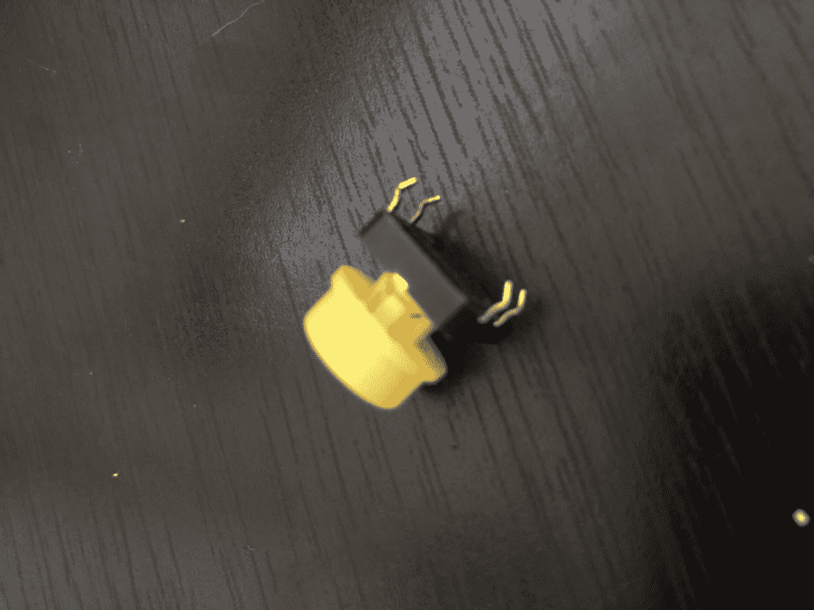
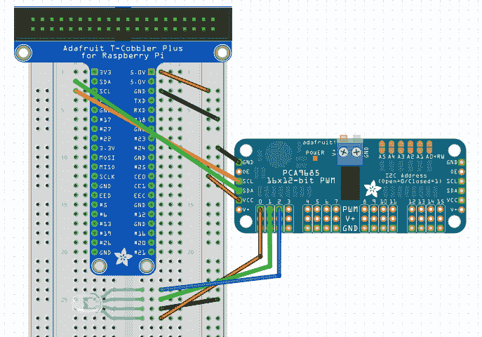
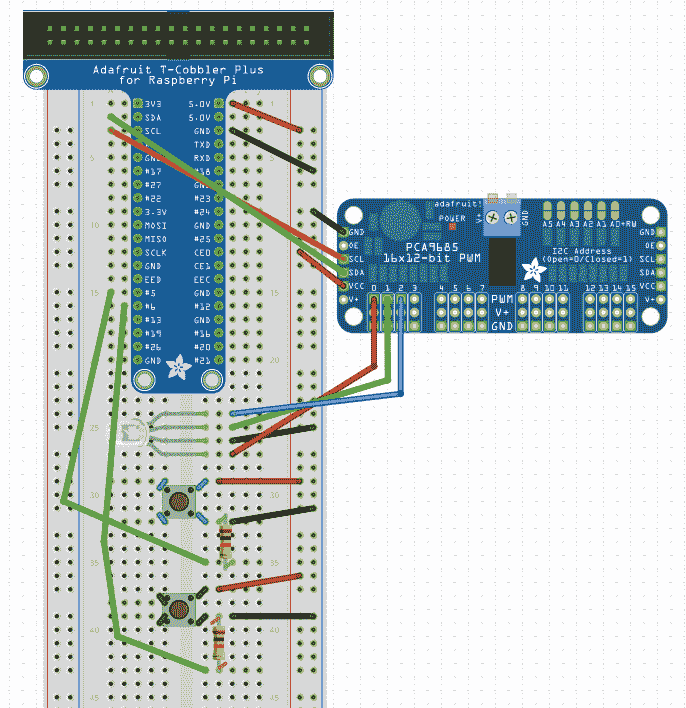

# 第四章：使用按钮输入

我们现在已经在 Johnny-Five 中探讨了数字和 PWM 输出，但这只是故事的一半。在机器人项目中使用输入设备可以做很多事情，允许用户输入或观察项目周围的世界来影响输出。

我们将从用户输入设备——按钮开始。我们还将讨论树莓派如何处理数字输入，并将按钮构建到我们之前的项目中，允许用户停止彩虹颜色循环，并自行推进颜色。

本章将涵盖以下主题：

+   在机器人项目中使用输入

+   Johnny-Five 传感器和按钮对象

+   连接按钮

+   将按钮添加到我们的 RGB LED 项目中

# 技术要求

你需要你的树莓派，以及从第三章，“使用 RGB LED 构建交互式项目”项目中连接好的 RGB LED，以及 GPIO 扩展板。

# 在机器人项目中使用输入

你可以在机器人项目中使用输出设备做很多事情，但当你添加输入时，可能性变得无穷无尽。无论是用户控制的输入，如按钮和电位计，还是测量环境光线或空气质量等环境传感器的输入，输入设备可以为任何机器人项目增添新的维度。

# 数字输入与模拟输入的比较

就像数字和 PWM 输出一样，有两种类型的输入设备：数字和模拟。数字输入要么开启要么关闭：按钮是这种类型的典型例子。模拟输入根据它们所感应的内容提供不同级别的电压或信号；例如，光敏电阻在环境光线高时输出较高的电压信号，而在光线暗时输出较低的电压信号。

为了从模拟设备读取数据，你需要一个可以接受模拟输入的引脚。但正如我们在上一章中看到的，树莓派上的所有 GPIO 引脚都是数字的。幸运的是，有方法可以绕过这个限制。

# 如何使用树莓派处理模拟输入

在树莓派上获取模拟传感器数据有两种方法：添加具有模拟引脚的 GPIO 扩展器，或使用利用数字信号来通信模拟数据的传感器。

# 模拟 GPIO 扩展器

这些板几乎与我们在第三章，“使用 RGB LED 构建交互式项目”中使用的 GPIO 扩展板完全一样，除了它们不是添加 PWM 输出引脚，而是添加模拟输入引脚。这些板通常还使用 I²C 接口与树莓派通信。然而，我通常发现这些板是不必要的，因为许多收集多个通道数据的传感器（如加速度计）已经使用 I²C 或其他数字接口，而收集单个通道数据的少数传感器可以在板上的这些数字接口中找到。

# 使用具有数字接口的输入设备

这是我们项目中的做法。这些设备使用 UART、SPI 和 I²C 等协议，允许只有数字 GPIO 的设备接收模拟数据。在每个项目的材料中，所包含的设备不需要模拟输入引脚。

# Johnny-Five 如何处理输入

因此，我们已经通过板`ready`事件了解了 Johnny-Five 如何使用事件。如果你曾经用 C 和 Arduino 编程，你可能熟悉事件循环风格的程序——一个循环永远运行并检查输入设备的状态，然后相应地做出反应。你可能也了解中断驱动的编程，其中硬件引脚的变化会导致代码跳转到特定函数。

Johnny-Five 的代码更接近中断风格；事件驱动几乎所有的 Johnny-Five 项目。这有几个好处；你可以通过事件类型来组织你的代码，并确保每个功能只在需要时触发，无需处理自己的硬件中断例程。

当 Johnny-Five 项目从传感器或设备接收输入时，它会触发一个`data`事件。但如果你只想在环境变化时运行函数怎么办？`change`事件就是为你准备的。我们将在稍后的章节中更详细地探讨确切的事件类型和它们何时触发，但在此期间请记住，事件是捕捉你的传感器和输入设备数据的方式。

# 典型 Johnny-Five 项目的结构

Johnny-Five 项目由几个关键部分和构建块组成，这使得阅读示例变得非常容易。让我们通过一个示例来了解更多。

# 开始——包括库和创建我们的板对象

本节通过引入 Johnny-Five 为我们搭建了舞台。以下代码片段告诉它我们正在使用树莓派，并构建相应的板对象。如果你正在使用其他`npm`模块，例如我们在第三章中使用的`color`模块，你将使用`require`将它们也引入这里，如下所示：

```js

const five = require("johnny-five")
const Raspi = require("raspi-io")

let board = new five.board({
 io: new Raspi()
})
```

# 板就绪事件处理器

在 Johnny-Five 项目中，除了头文件之外的所有其他内容都放在这个事件处理器中。这个处理器，如这里所示，意味着我们的板已准备好读取和写入 GPIO 引脚，并且任何在事件处理器外部运行的、操作 GPIO 的代码可能无法保证工作，并可能导致异常行为：

```js
board.on("ready", function() {
  // Everything else goes in here!
});
```

# 构建我们的组件对象

在板就绪事件处理器内部，我做的第一件事是为我项目的所有组件设置 Johnny-Five 对象。如果所有组件类型和引脚都在代码的同一位置，那么从代码中连接项目会更容易：

```js
  // remember, this goes inside the board ready event handler!
  let LED = new five.LED('P1-7')
  let button = new.five.Button('P1-8')
```

# 输入事件处理器和输出设备操作

这就是有趣的部分，我们等待输入并相应地操作输出！这将监视连接到`P1–8`的按钮被按下，然后点亮一个 LED。但是，当按钮释放时，我们如何关闭 LED？为此，我们将再次查看 Johnny-Five 文档：

```js
  // We'll go over more about the Button in the next section!
  // This is still inside the board ready event handler!
  button.on('press', () => {
    led.on()
  })
```

# Johnny-Five 按钮对象

在我们编程按钮项目之前，让我们仔细看看 Johnny-Five 按钮对象，以便我们知道要寻找哪些事件，以及构造函数需要我们从我们这里得到哪些信息。

# 按钮对象

当我们查看按钮的参数部分时，只有一个必需的参数，即引脚（pin）。因此，我们需要记住将信号连接到哪个引脚，但除此之外，默认值将很好地为我们服务：

+   `invert`：默认为 false，并反转上和下值。我们希望保持这个 false，因为我们焊接的按钮不需要反转。

+   `isPullup`：告诉将上拉电阻连接到其 GPIO 引脚的板初始化此按钮时上拉已启用。我们将自己焊接电阻，所以这个可以保持默认的 false。

+   `isPulldown`：与`isPullup`类似，但带有下拉电阻。由于我们将自己焊接下拉电阻，所以请将其保留为 false。

+   `holdtime`：这是按钮必须按下多少毫秒后才会触发保持事件。在这里，默认的 500 毫秒将足够好。

还有一个名为`collection`的特殊部分，它详细说明了如何使用同一个对象控制多个按钮。这是一个有趣的设计，虽然我们不会在我们的双按钮项目中探索它，但一个很好的附加项目是将它重构为使用按钮的`collection`对象。

# 按钮事件

按钮对象使用三个事件，并且每个事件都可以用于单个按钮对象的实例：

+   `press`，`down`：这些是相同的事件，当按钮被按下时它们会被触发

+   `release`，`up`：当按钮释放时，这些事件被触发

+   `hold`：当按钮按下时间超过构造函数中`holdtime`参数设置的阈值时，此事件被触发

如果你之前处理过硬件，你可能会担心按钮事件的`噪声`；一个按钮按下或释放时触发多个事件，按钮未按下时释放事件，等等。Johnny-Five 已经将去抖动功能集成到按钮对象中，因此无需担心噪声按钮！

# 焊接按钮

我们将在上一章的项目中添加按钮，以便用户可以通过按按钮来改变 RGB LED 的工作方式。当你看一个按钮时，你会看到四个触须。虽然按钮有四个触须，但按钮只有两个输入/输出——一个电流入的地方，一个当按钮被按下时电流出的地方。这是因为按钮本质上控制着电流的流动。当按钮没有被按下时，触点没有连接，电流无法流动，而当按下时，导体桥接两侧，电流就可以流动。这就是我们将如何使用按钮作为输入设备：高信号表示按钮被按下，低信号表示没有被按下。

# 在面包板上放置按钮

拿起你的按钮，观察底部的金属触须。通常，两对触须向按钮内部弯曲。每边都有一个进出，每对具有相同弯曲方向的触须中都有一个。放置在面包板上时，请记住这一点，如下面的图片所示：



当你在面包板上放置按钮时，你想要确保按钮跨越面包板中间的凹槽，以防止短路。

一旦你将按钮放入面包板，确保它放置得很好，并且没有触须卷曲到自身而不是进入面包板插座。如果有，使用尖嘴钳将其拉直。

现在你已经将按钮放置在面包板上，是时候将其连接到你的 Pi 上了。

# 使用下拉电阻

所以问题是，我们如何将三根线连接到只有两个引脚的设备上？我们将使用所谓的下拉电阻将输入连接到未连接到电源的按钮一侧。当按钮被按下时，电流将通过电阻流入信号线，我们将使用 Pi 的数字输入引脚来检测这作为按钮按下。

要做到这一点，将按钮的一侧连接到面包板上的 5V 电源引脚。在另一侧，放置一个 10K 欧姆的电阻，将其连接到面包板的另一行，并在该行放置一根线，将其连接到面包板上的 GPIO 引脚。然后，在按钮的第二行，在电阻下方放置一根线，将其连接到面包板上的 GND 引脚。

电阻防止了当按钮被按下时 Pi 短路，这会导致你的 Pi 暂时停止工作，如果时间过长，将会造成不可修复的损坏。

短路，或短路，是指电路的电源和地之间没有负载（如我们的电阻）连接，这会导致很多问题。要了解更多信息，请查看本章的“进一步阅读”部分，或任何电子学入门书籍。

# 添加按钮到我们的 RGB LED 项目

现在我们已经了解了按钮的工作原理以及如何将其连接到 Pi，让我们将两个按钮添加到我们的 RGB LED 项目中。

# 连接所有线路

在我们连接按钮之前，我们需要对我们的当前布线设置做一些整理。

# 使用电源和地线侧轨

从现在开始，我们将需要更多访问电源和 GND 引脚，我们不希望有很多很长的线在我们的项目中交错。所以我们将首先进行一些硬件重构。

1.  从排线中取出 RGB LED 的地线。

1.  从 GPIO 扩展器的 5V 和 GND 排线中取出 VCC 和 GND。

1.  在排线的 5V 排和外部长排（如果有标记为红色和蓝色的，使用红色）之间放置一根线。

1.  在排线和另一个外排之间放置一根线。

1.  将 RGB LED 的地线插入到连接到排线 GND 的侧轨。

1.  如下图所示，将 GPIO 扩展器的 GND 插入到连接到排线 GND 的侧轨，将 VCC 插入到连接到排线 5V 的侧轨。



# 连接按钮

现在我们已经整理好了电源和地线，让我们放置按钮。对于这两个按钮：

1.  按照上一节所述，将按钮放置在面包板上，连接面包板中心的间隙。

1.  将按钮的一侧连接到连接到排线 5V 引脚的侧轨。

1.  在另一侧放置一个 10K 欧姆电阻，连接到一个空轨。

1.  将带有电阻的按钮侧连接到连接到排线 GND 的侧轨。确保电阻在按钮和接地连接之间！

1.  将电阻的另一端连接到排线上的一个引脚；如下一图所示，使用#5 为按钮 1，#6 为按钮 2：



现在你就可以编写一些代码了！

# 按钮 1 – 停止和启动彩虹

在我们设置按钮之前，我们将对彩虹循环程序进行一些重构，以适应按钮的新功能。

# 重构彩虹循环

我们将重构彩虹循环以执行以下操作：

1.  查看作用域变量，以查看颜色是否应该在定时间隔内继续改变（用于停止和启动按钮）

1.  将改变 RGB LED 到下一个颜色的代码拆分成自己的函数（用于下一个颜色按钮）

让我们看看重构：

```js
board.on('ready', () => {
  let rgbLED = new five.Led.RGB({
    controller: "PCA9685",
    pins: {
      red: 0,
      green: 1,
      blue: 2
    }
  })
  let colorCycle = true

  setInterval(() => {
    if( colorCycle ) {
      colorChange()
    }
  }, 1000)

  function colorChange() {
    console.log(currentColor)
    currentColor = color(colors[colorIndex])
    rgbLED.color([currentColor.red(), currentColor.green(), currentColor.blue()])
    colorIndex++
    if(colorIndex >= colors.length) {
      colorIndex = 0
    }
  }
})
```

我们将使`button1`停止和启动彩虹颜色的循环。为此，我们需要做的是：

1.  构建一个按钮对象来在代码中表示我们的按钮

1.  监听 Johnny-Five 按钮对象 API 的`press`事件

1.  添加一个名为`cycleOn`的可变变量，可以设置为 true 或 false，并让改变颜色的循环使用它来决定是否改变颜色

1.  我们还将把改变颜色的逻辑提取出来，为下一个按钮做准备

让我们将其添加到我们的板子准备处理器的开头：

```js
  let button1 = new five.Button('P1-29')

  button1.on('press', () => {
     colorCycle = !colorCycle
  })
```

在你的 Pi 上加载这个程序，使用`sudo node rainbow-pause-button.js`运行它，看看按按钮几次会发生什么！

# 按钮 2 – 下一个颜色

现在我们将添加第二个按钮和按下处理程序，以便在按下时第二个按钮将颜色前进到数组中的下一个颜色：

```js
  let button2 = new five.Button('P1-31')

  button2.on('press', () => {
    colorChange()
  })
```

现在，当你按下第二个按钮时，LED 的颜色将前进到数组中的下一个颜色。

# 摘要

本章汇集了用户输入和输出——RGB LED。我们学习了如何在 Johnny-Five 中使用输入事件来操作输出设备，这是大多数 Johnny-Five 项目的核心，并学习了如何使用多个输入（按钮）来实现不同的效果。

# 问题

1.  Johnny-Five 按钮对象有哪些事件可用？

1.  树莓派可以使用模拟输入设备吗？

1.  我们将如何使用 Pi 与传感器一起使用？

1.  为什么`RGB.LED`对象没有事件？

# 进一步阅读

+   **关于模拟输入引脚的更多信息**：[`learn.sparkfun.com/tutorials/analog-to-digital-conversion`](https://learn.sparkfun.com/tutorials/analog-to-digital-conversion)

+   **关于上拉电阻的更多信息**：[`learn.sparkfun.com/tutorials/pull-up-resistors`](https://learn.sparkfun.com/tutorials/pull-up-resistors)
