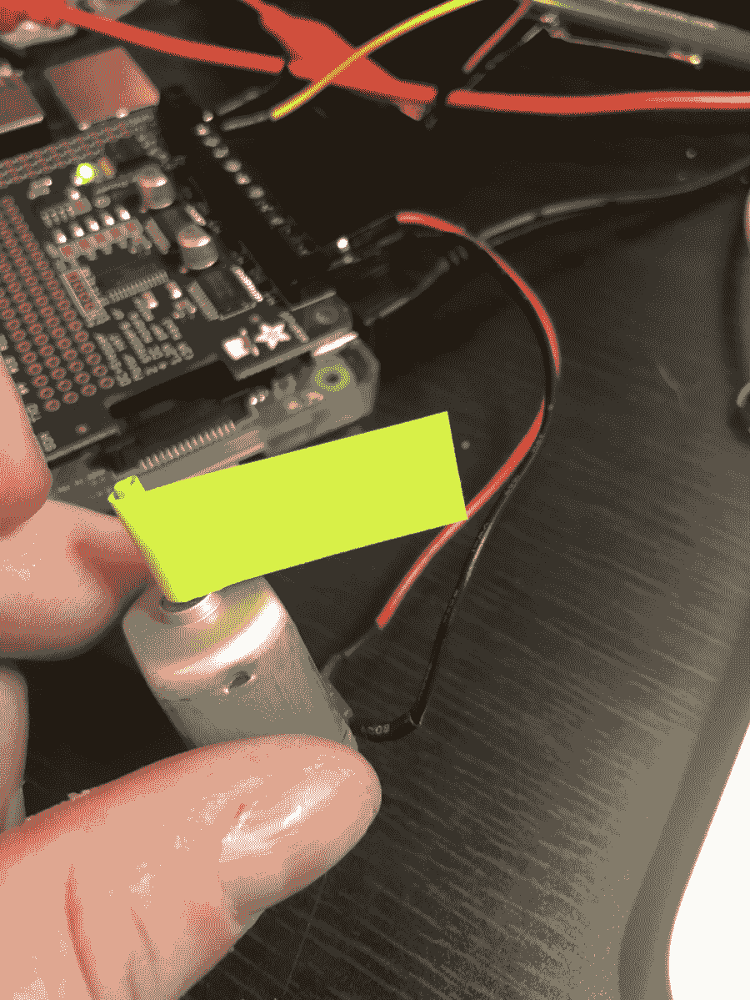
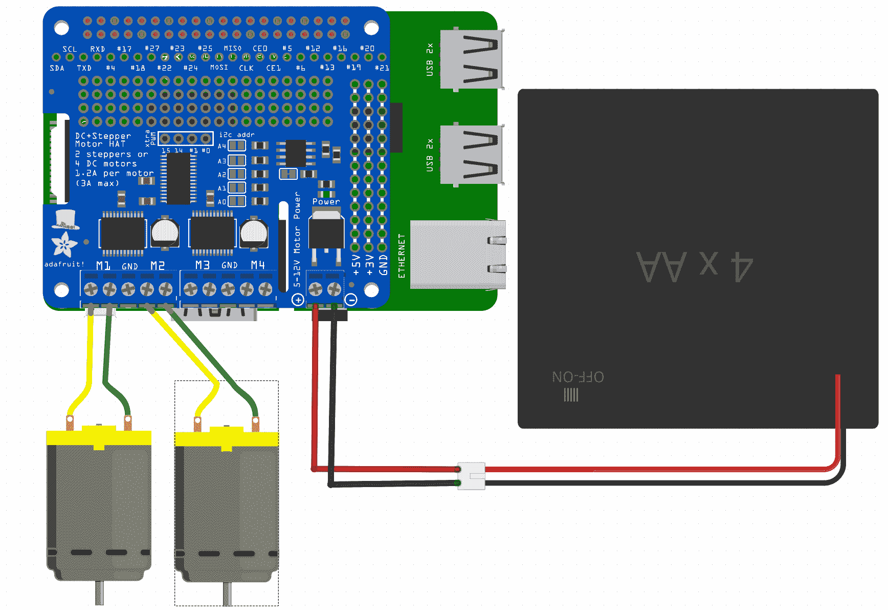

# 第六章：使用电机移动你的项目

我们已经探讨了使用输入来发现我们机器人周围的世界，以及使用输出让我们的机器人进行通信，但任何机器人都应该具备的另一项关键技能是：移动的能力！在接下来的几章中，我们将讨论各种让我们机器人移动的方法，并讨论如何控制这种移动。我们将从本章开始，讨论最简单的移动组件：电机。

本章将涵盖以下主题：

+   更多关于电机的内容

+   使用 Raspberry Pi 为电机驱动项目做准备

+   Johnny-Five 电机对象

+   解决你的电机化项目的故障

+   项目 - 构建一个随机电机化猫玩具

+   项目 - 使用齿轮箱电机和电机对象

# 技术要求

你需要 Adafruit Pi 电机帽子套件([`www.adafruit.com/product/2348`](https://www.adafruit.com/product/2348))，一个小型 5V 电机，你也可以从 Adafruit([`www.adafruit.com/product/711`](https://www.adafruit.com/product/711))或许多其他供应商那里购买，一个带有电线端子和开关的 4xAA 电池盒，可以从 Adafruit([`www.adafruit.com/product/830`](https://www.adafruit.com/product/830))和许多其他供应商那里购买，2 个*齿轮箱*或*TT*电机，可以从 Adafruit([`www.adafruit.com/product/3777`](https://www.adafruit.com/product/3777))和许多其他供应商那里购买，以及一个贴纸（或一张纸，剪刀和胶带）。

**注意**：如果你不会焊接或者不习惯焊接，可以在亚马逊上找到一种替代的全组装帽子([`www.amazon.com/SB-Motorshield-Raspberry-expansion-ultrasonic/dp/B01MQ2MZDV/ref=sr_1_fkmr1_1?s=electronics&ie=UTF8&qid=1534705033&sr=8-1-fkmr1&keywords=raspberry+pi+motor+controller+TB6612`](https://www.amazon.com/SB-Motorshield-Raspberry-expansion-ultrasonic/dp/B01MQ2MZDV/ref=sr_1_fkmr1_1?s=electronics&ie=UTF8&qid=1534705033&sr=8-1-fkmr1&keywords=raspberry+pi+motor+controller+TB6612))。我将在必要时注明代码中的更改——任何本章引用的 L293D 帽子，即指这个帽子。

本章的代码可在[`github.com/PacktPublishing/Hands-On-Robotics-with-JavaScript/tree/master/Chapter06`](https://github.com/PacktPublishing/Hands-On-Robotics-with-JavaScript/tree/master/Chapter06)找到。

# 更多关于电机的内容

电机是一种可以以不同速度连续旋转轴的组件。然而，电机有很多不同的种类；让我们看看一些例子：

+   **直流电机**：这种电机是最简单的：它可以单向运行，速度由你提供的功率决定。这些通常只有两根线：一根接地，一根供电；我们将后者与电机帽子结合来控制速度。使用正确的控制器，我们可以使电机双向移动。

+   **带有刹车的电机**：这些电机有一个额外的线来控制刹车，可以在不需要减速到停止的情况下停止电机，就像直流电机一样。Johnny-Five 库支持这些电机，但本书不会涉及。

+   **步进电机**：步进电机用于精确运动，因为它们的运动是按电机尺寸变化的步进。它们设计为双向的，非常适合需要电机扭矩且精确的地方。我们将在本章的第二项目中更多地讨论这些内容。只需知道，一个简单的识别步进电机的方法是它有 5 根线，而不是 2 或 3 根：


左边是普通电机，右边是步进电机

# 如何使用微控制器控制电机

你可以直接将直流模型电机连接到微控制器的 PWM 引脚来为其供电，但这通常是不推荐的：电机消耗大量电力，许多微控制器限制每个引脚的电流输出。

更推荐的解决方案，我们将在本章中使用，是使用外部电机控制器；这些通常包含进行更复杂运动所需的电路（例如允许它们反向运动），并允许外部电源为电机提供必要的电力，而不会从微控制器中吸取电力。

# 准备使用树莓派进行电机驱动项目

为了使用 Johnny-Five 和树莓派开始学习电机，我们需要添加一个帽子（想象一下 Arduino 面板，但针对 Pi，或者如果你是电子新手，则是堆叠在 Pi 上的附加板）以使我们能够：

+   为电机提供外部电源

+   比树莓派本身控制电机更好（尤其是在步进电机的情况下）

# 组装帽子

按照如下方式将电池组和电机连接到帽子的螺丝端子：


图中的黄色线应该是你的地线（通常是黑色），绿色应该是你的电源线（通常是红色）。

# 将帽子安装在 Pi 上

从 Pi 上移除所有电源，并确保电池组已关闭。此外，如果它还连接在 GPIO 引脚上，请移除 Cobbler。然后，将帽子底部的插槽与 Pi 顶部的引脚对齐，使其位于 Pi 之上。然后，轻轻按下帽子直到它就位。**不要用力按——你可能会弯曲一些 Pi 的引脚**。一切就绪后，它应该看起来像这样：


电机应该这样插入螺丝端子：


重新为 Pi 上电，然后我们将开始使用 Johnny-Five 电机对象进行编码。

# Johnny-Five 电机对象

Johnny-Five 中的电机对象允许我们轻松控制电机，而无需担心通过 Pi 与帽子通信。在我们编写项目之前，让我们用 REPL 编写一个测试设置，以确保一切正常。

创建一个新的 `project` 文件夹，并在其中运行以下命令：

```js
npm init -y
```

然后，在文件夹中创建一个名为 `motor-test.js` 的文件。首先，引入 Johnny-Five 和 Raspi-IO，实例化你的板对象，并创建一个 `board.on('ready')` 处理器，就像我们通常做的那样：

```js
const Raspi = require('raspi-io')
const five = require('johnny-five')
const board = new five.Board({
  io: new Raspi()
})

board.on('ready', () => {

})
```

现在，我们已经准备好设置我们的电机对象，记住我们需要为我们的帽子进行配置。

# 我们帽子的构造函数

如果你使用的是 Adafruit 帽子，你的构造函数如下：

```js
let motor = new five.Motor(five.Motor.SHIELD_CONFIGS.ADAFRUIT_V2.M1)
```

如果你使用的是 L293D 帽子，你的构造函数如下：

```js
let motor = new five.Motor(five.Motor.SHIELD_CONFIGS.ADAFRUIT_V1.M1)
```

将适用的任何一个放入 `board.on('ready')` 函数中。

# 移动电机的函数

参考 Johnny-Five 文档，有几个函数允许我们通过命令行使用 REPL 移动电机：

```js
motor.forward(speed) // speed 0-255, starts the motor forward
motor.stop() // the motor coasts to a stop
motor.start(speed) // resumes the motor moving forward
motor.reverse(speed) // moves the motor backward
```

现在我们知道了如何控制电机，让我们添加 REPL 功能来测试它

# 添加 REPL 控制

在 `board.on('ready')` 函数的末尾添加以下内容：

```js
board.repl.inject({
  motor
})
```

现在我们有了完全的控制权！

# 加载和运行你的电机

将项目加载到 Pi 上，并在 Pi 的 ssh 会话中导航到该文件夹。然后，运行以下命令：

```js
npm i --save johnny-five raspi-io
```

完成之后，打开电池组并运行以下命令：

```js
sudo node motor-test.js
```

一旦看到 *Board Initialized*，你应该尝试之前的一些命令：

```js
motor.forward(speed) // speed 0-255
motor.stop()
motor.start(speed)
motor.reverse(speed)
```

希望你的电机正在愉快地旋转！

# 解决你的电机项目故障

但如果你的电机不转动怎么办？如果你的电机没有旋转，这里有几点需要检查：

+   电机帽子的电池组已经打开了吗？不要笑，我花了很多时间在怀疑为什么它不起作用，最后发现它没有电源。大多数电机帽子上都有一个电源指示灯，告诉你它是否有电：


Adafruit 帽子上的电源 LED 正在外部电源的螺丝端子上方，并亮起红色

+   你的电池是新的是吗？电机消耗的电量很大，长时间使用会很快耗尽它们。

+   正如我在第一章中提到的：检查你的接线。然后，再检查一遍。

+   确保所有电线都牢固地固定在正确的螺丝端子上，这样轻轻一拉就不会松动。

+   你在使用可充电电池吗？如果是这样，我钦佩你对再利用的承诺，但你需要 6 个可充电电池来运行电机，因为可充电电池和非可充电电池之间的电压不同。

希望你的电机之前没有旋转，现在应该已经旋转了，我们可以构建我们的第一个项目。

# 项目 – 猫玩具

在这个项目中，我们将在电机上放一张纸，然后编写一些随机代码，使其以不同的速度来回旋转（毕竟，猫对可预测的玩具会感到无聊）。

这个项目的布线与电机测试相同；那里不需要做任何改变。

# 在电机轴上放一张纸

要么用一条长粘性便条的粘性端绕着电机轴滚动，要么用一条长纸条粘在上面。它应该看起来像这样：



在我们玩具相对简单的构造之后，让我们编写一些随机的代码！

# 编写代码以随机启动/停止电机

我们希望电机以 1-10 秒内的任意速度启动，然后停止 1-10 秒，然后重复。我们还想让它向前或向后移动是随机的。我把速度限制在 75——任何更快的东西对我来说猫都承受不了！

在你的`cat-toy.js`文件中，删除`board.repl.inject`语句，并添加以下内容：

```js
startMovement()

function startMovement(){
  let direction = Math.round(Math.random())
  let speed = Math.round(Math.random() * 75)
  let time = Math.round(Math.random() * 10)

  if(direction == 0){
    motor.forward(speed)
  } else {
    motor.reverse(speed)
  }

  setTimeout(stopMovement, time*1000) 
}

function stopMovement(){
  let time = Math.round(Math.random() * 10)
  motor.stop()
  setTimeout(startMovement, time * 1000)
}
```

这将随机化启动和停止、速度和方向。我的猫至少被它轻微地娱乐了。如果你有猫，不妨试试！

将项目加载到 Pi 上，在 Pi SSH 会话中导航到该文件夹。然后运行：

```js
sudo node cat-toy.js
```

然后看看它怎么走！

我们已经有一个电机在工作，但如果你想要制作一个带轮子的机器人，我们需要两个电机；让我们在下一个项目中看看这个概念。

# 项目 – 使用两个齿轮电机和电机对象

现在我们已经探索了电机对象，让我们深入一点，在探索电机对象的同时，使用两个 TT 电机构建一个项目。

如果你想要更进一步，你可以从 Adafruit 购买这样的底盘[`www.adafruit.com/product/3796`](https://www.adafruit.com/product/3796)和一对这样的轮子[`www.adafruit.com/product/3757`](https://www.adafruit.com/product/3757)，然后自己组装一个移动的 2 轮机器人！记住，你可能需要用电池组给 Pi 供电（那些为手机充电的小 USB 包效果很好）或者保持在 Pi 电源线的范围内。如果你选择后者，我会把电源插头固定在 Pi 上，并且非常小心不要让机器人拉得太用力。说实话，如果要让 Pi 自己移动，我强烈建议使用电池。

# 连接你的 TT 电机

对于这个图，假设正常的直流电机是我们的 TT 电机——黄色将是地线（通常是黑色）线，绿色将是电源线（通常是红色）。



现在是时候开始编写代码，让我们的电机使用 Johnny-Five 和电机对象执行常见的轮式车辆运动了。

# Johnny-Five 的电机对象

在你的项目文件夹中创建一个名为`driver-bot.js`的新文件。从 Johnny-Five 和 Raspi-IO 库的常规设置开始，你的板对象，以及你的`board.on('ready')`处理程序：

```js
const Raspi = require('raspi-io')
const five = require('johnny-five')
const board = new five.Board({
  io: new Raspi()
})

board.on('ready', () => {

})
```

接下来，在`board.on('ready')`处理程序中，我们将添加两个 TT 电机的构造函数：

如果你使用的是 Adafruit 帽子，你的构造函数是：

```js
let leftMotor = new five.Motor(five.Motor.SHIELD_CONFIGS.ADAFRUIT_V2.M1)
let rightMotor = new five.Motor(five.Motor.SHIELD_CONFIGS.ADAFRUIT_V2.M2)
```

如果你使用的是 L293D 帽子，你的构造函数是：

```js
let leftMotor = new five.Motor(five.Motor.SHIELD_CONFIGS.ADAFRUIT_V1.M1)
let rightMotor = new five.Motor(five.Motor.SHIELD_CONFIGS.ADAFRUIT_V1.M2)
```

现在我们已经构建了电机，我们将通过传递包含`leftMotor`和`rightMotor`的数组来创建 Motors 对象：

```js
let motors = new Five.Motors([leftMotor, rightMotor])
```

在我们开始编写驾驶函数之前，让我们谈谈 Motors 对象的好处。将你的电机放在 Motors 对象中的主要好处是，在同时能够控制所有电机的同时，还能保持对每个单独电机的控制。例如：

```js
leftMotor.forward(255) // left motor full speed ahead!
rightMotor.reverse(255) // right motor full speed reverse!
motors.stop() // both motors coast to a stop
```

Motors 对象允许你调用任何 Motor 对象函数，并且它将一次性在所有电机上执行。

让我们利用这些知识来编写一些常见的驾驶函数，我们可以用这些函数与我们的电机一起使用。

# 编写一些函数

首先，我们希望让我们的机器人向前行驶。在`driver-bot.js`的`board.on('ready')`处理程序中，添加以下内容：

```js
function goForward(speed) {
  motors.forward(speed)
}
```

在这里，我们再次看到了`motors`对象的好处；我们不需要分别告诉左右电机向前移动。

让我们添加另一个函数，让我们的电机滑行到停止：

```js
function stop() {
  motors.stop()
}
```

另一个让我们的机器人向后行驶：

```js
function goBackward(speed) {
  motors.reverse(speed)
}
```

现在已经完成这些，我们再添加一些转弯如何？幸运的是，`motors`对象仍然允许我们单独控制每个电机——所以转弯不是问题：

```js
function turnRight(speed) {
  leftMotor.forward(speed)
  rightMotor.stop()
}

function turnLeft(speed) {
  rightMotor.forward(speed)
  leftMotor.stop()
}
```

最后，让我们添加原地左转或右转的能力：

```js
function spinRight(speed) {
  leftMotor.forward(speed)
  rightMotor.reverse(speed)
}

function spinLeft(speed) {
  rightMotor.forward(speed)
  leftMotor.reverse(speed)
}
```

现在，我们的电机拥有了它们驱动所需的全部！让我们给自己提供 REPL 访问这些方法、`motors`对象和`motor`对象：

```js
board.repl.inject({
 leftMotor,
 rightMotor,
 motors,
 goForward,
 goBackward,
 stop,
 turnRight,
 turnLeft,
 spinRight,
 spinLeft
})
```

现在我们已经准备好加载我们的代码，并让我们的电机转起来（既指比喻意义也指字面意义）！

# 运行我们的电机项目

将项目加载到 Pi 上，并在 Pi SSH 会话中导航到该文件夹。然后运行：

```js
sudo node driver-bot.js
```

一旦你看到*Board Initialized*，你可以自由尝试我们的新函数：

```js
goForward(100) // start moving both motors forward
stop() // and stop
goBackward(50) // go backward at half the previous speed
stop()
goForward(100)
turnRight(100)
turnLeft(200) // a faster left turn
spinRight(255) // robots can't get dizzy, maximum fastness
spinLeft(100)
stop()
```

就这样——你已经编写了你需要驱动两轮机器人的所有代码！

作为附加项目，想想你如何能够驱动机器人而不必每次都输入函数名！

# 摘要

在本章中，我们学习了为我们的机器人添加运动的第一组件：电机。我们学习了电机的类型以及如何将它们与微控制器接口连接。然后，我们编写了代码来测试我们的电机与 Pi 帽和 REPL，并利用我们对 Johnny-Five Motor 对象的了解制作了一个小型随机猫玩具。最后，我们构建了一个项目，使我们能够亲手探索 Motors 对象的能力，并编写代码来驱动两轮机器人。

# 问题

1.  电机是什么？

1.  电机和步进电机有什么区别？

1.  为什么你应该为电机使用外部电源？

1.  为什么我们需要一个帽子来控制我们的电机？

1.  使用多个电机时，Motors 对象有哪些好处？
