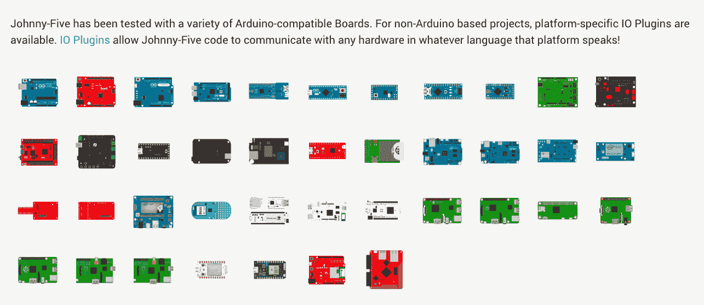
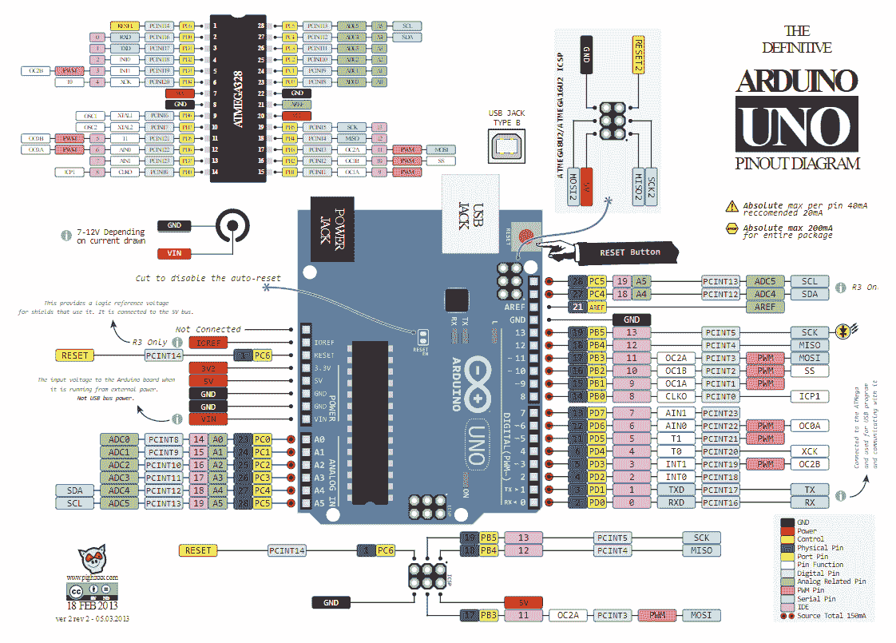
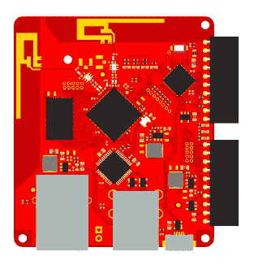
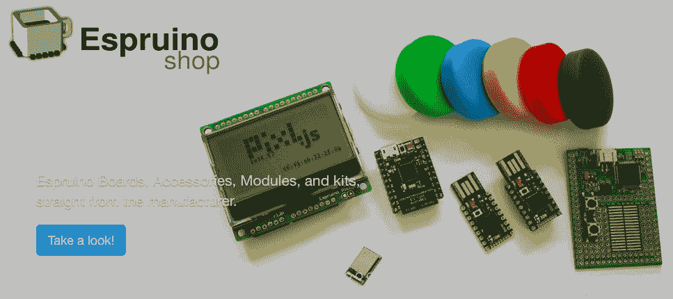
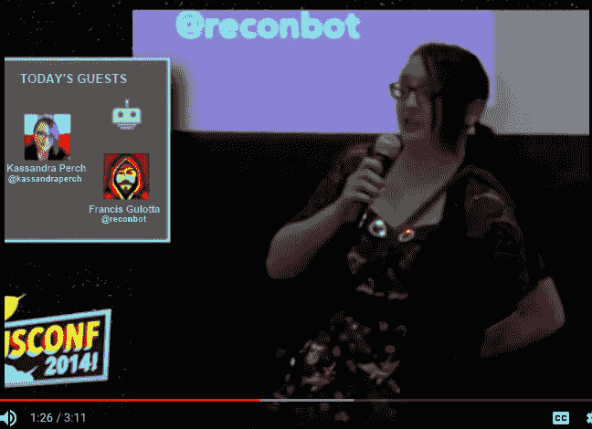
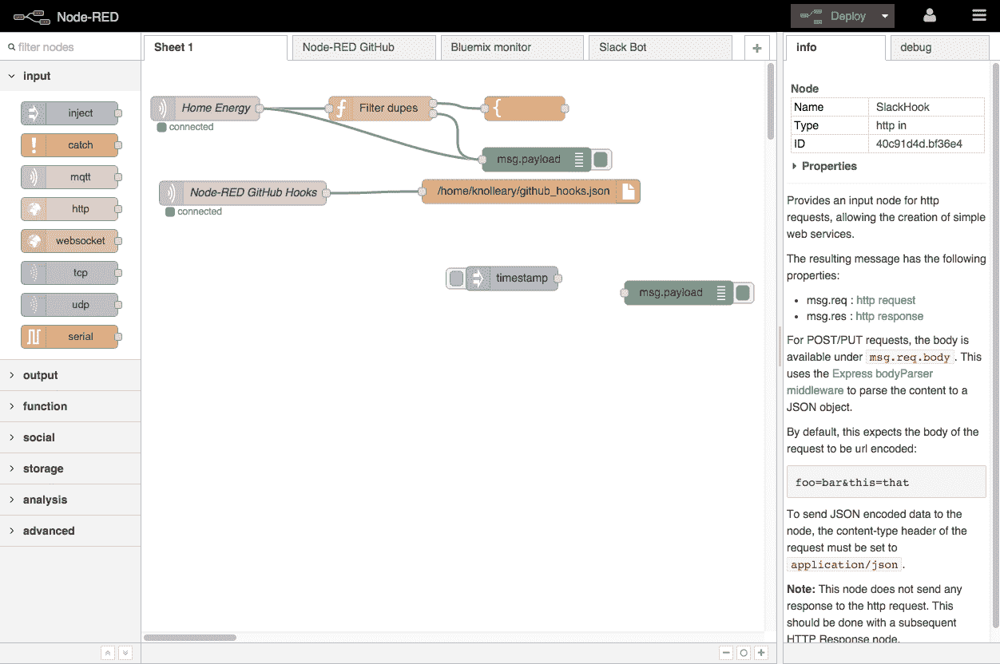

# 第十一章：构建 NodeBots 集群

我们现在的 NodeBots 可以感知并显示周围世界的信息，并从互联网收集信息进行显示。现在，是时候看看 NodeBots 之间如何交流了。我们还将利用本章讨论从这里开始的方向——JavaScript 可以在许多不同的板子和设备上使用，以及许多新的和令人兴奋的方式！

本章将涵盖以下主题：

+   项目 – 连接多个 NodeBots

+   扩展你的 NodeBots 知识

+   继续你的 NodeBots 冒险

# 技术要求

对于本章，你可以选择使用带有无线互联网访问的第二个 Raspberry Pi。你也可以只使用你现有的设备，我们将假装它是两个不同的 Pi。你还需要你的 TSL2591 光传感器、你的 Pi Cobbler 和几根面包板线。

本章的代码可在[`github.com/PacktPublishing/Hands-On-Robotics-with-JavaScript/tree/master/Chapter11`](https://github.com/PacktPublishing/Hands-On-Robotics-with-JavaScript/tree/master/Chapter11)找到。

# 项目 – 连接多个 NodeBots

在这个项目中，我们将使用一个`npm`模块，它允许我们在 Pi 上设置 Raspberry Pi 代理——如果你有一个 Pi，我们将让它像两个不同的设备一样相互通信，如果你有第二个 Pi，我们将让它们相互通信。

# 可选 – 设置第二个 Raspberry Pi

如果你只使用你的原始 Pi，请跳过这一部分。

使用第一章中的说明，*设置你的开发环境*，来设置你的第二个 Pi。你不需要 Cobbler 或其他任何配件来完成这个项目；如果你使用第二个 Pi，你只需要一个良好的电源和一个按照第一章中的说明设置的 microSD 卡，*设置你的开发环境*。

如果你使用两个 Pi，没有 Cobbler 的 Pi 是代理 Pi，而你原始的带有 Cobbler 的 Pi 是客户端 Pi。

如果你使用两个 Pi，你将想要设置代理 Pi 的主机名，以便它们不会冲突。为此，请运行以下命令：

```js
sudo raspi-config
```

然后，使用箭头键选择网络选项，然后选择主机名。将主机名设置为你能记住的东西（我使用了`nodebotanist-pi-broker.local`）。然后，保存并退出`raspi-config`，并重新启动 Pi。

当你想要在代理 Pi 上启动会话时，你现在将使用你自定义的主机名；例如，如果我想 SSH 到我的代理 Pi，我会运行以下命令：

```js
ssh pi@nodebotanist-pi-broker.local
```

# 设置你的项目文件和文件夹

你将需要为这个项目创建两个单独的项目文件夹：`client` 和 `broker`。创建这些文件夹并运行以下命令：

```js
npm init -y
```

在`client`文件夹中，运行以下命令：

```js
npm i --save mqtt dotenv
```

在 `broker` 文件夹中，运行以下命令：

```js
npm i --save mosca
```

然后，在两个文件夹中，创建一个`index.js`和一个`.env`文件。

# 如果你只有一个 Pi

将`client`和`broker`文件夹移动到树莓派，在你的树莓派 SSH 会话中导航到`client`文件夹，并运行以下命令：

```js
sudo npm i -g forever
npm i --save johnny-five raspi-io
npm i
```

然后，导航到`broker`文件夹并运行以下命令：

```js
npm i
sudo apt-get install mongodb-server // installs mongodb 
systemctl enable mongod.service // makes it so mongodb starts when the pi does
```

然后，重新启动树莓派：

```js
sudo reboot
```

# 如果你使用两个树莓派

将`client`文件夹移动到你的原始树莓派，通过 SSH 连接到你的原始树莓派，导航到`client`文件夹，并运行以下命令：

```js
npm i --save johnny-five raspi-io
npm i 
```

然后，将`broker`文件夹移动到你设置的第二个树莓派，通过 SSH 连接到它，导航到`broker`文件夹，并运行以下命令：

```js
sudo apt-get install mongodb-server // installs mongodb 
systemctl enable mongod.service // makes it so mongodb starts when the pi does
npm i
```

然后，重新启动代理树莓派：

```js
sudo reboot
```

现在我们已经安装并配置好了项目依赖，是时候连接这个项目了。

# 将光传感器添加到树莓派

如果你使用一个树莓派，将光传感器连接到它。如果你使用两个树莓派，将光传感器连接到客户端树莓派。以下图示应与你的单个树莓派或客户端树莓派相匹配：


现在我们可以设置树莓派上的 MQTT 代理。

# 在树莓派上创建一个 MQTT 代理

如果你使用两个树莓派，请在代理树莓派上执行此整个部分。如果你使用一个树莓派，请在你的一个树莓派上完成所有这些操作。

我们将使用 Mosca 库在树莓派上设置一个 MQTT 代理。`mosca npm`库使得设置和启动 MQTT 代理变得非常简单。我们只需要一个运行的 mongoDB 实例（我们在上一步，*设置光传感器*中已经处理好了）。

在`broker`文件夹（在你的原始树莓派或代理树莓派上），在`index.js`文件中，我们将设置`mosca`：

```js
const mosca = require('mosca')

const mqttBroker = new mosca.Server({
  port: 1883,
  backend: {
    type: 'mongo',
    url: 'mongodb://localhost:27017/mqtt',
    pubsubCollection: 'MQTT-broker-NodeBots',
    mongo: {}
  }
})

server.on('ready', () => {
  console.log('MQTT broker ready!')
})

server.on('clientConnected', (client) => {
  console.log('Client connected to MQTT broker: ', client.id)
})

server.on('published', (packet, client) => {
  client = client || {id: 'N/A'} // Catches a weird edge case with mosca
  console.log(`Client: ${client.id}\nTopic: ${packet.topic}\nMessage: ${packet.payload.toString()}\n`)
})
```

我们现在已经准备好了 MQTT 代理！是时候编程我们的客户端了。

# 编程 MQTT 客户端 – 让树莓派报告家

在你的`client`文件夹（以及如果你的设备使用两个树莓派，你的客户端树莓派），打开`index.js`文件，编写一个脚本以每次传感器数据变化时收集光传感器数据，阈值为`10`（以防止产生过多的 MQTT 消息）：

```js
const Raspi = require('raspi-io')
const five = require('johnny-five')
const request = require('request')

const board = new five.Board({
  io: new Raspi()
})

board.on('ready', () => {
    let light = new five.Light({
       controller: 'TSL2591',
       threshold: 10
    })

    light.on('change', () => {

    })
})
```

然后，在`board.on('ready')`处理程序之前，构建你的 MQTT 客户端连接，并添加一个`mqttClient.on()`处理程序，它订阅`light`主题：

```js
const mqttClient = mqtt.connect(
  process.env.MQTT_BROKER_URL,
  {
    port: process.env.MQTT_BROKER_PORT
  }
)

mqttClient.on('connect', () => {
  mqttClient.subscribe('light')
})
```

然后，在`board.on('ready')`处理程序中，我们将添加将光数据发布到我们的 MQTT 代理的代码。

```js
light.on('change', function() {
  mqttClient.publish('light', this.value)
})
```

现在我们已经编写了客户端代码，我们需要设置环境变量并运行它。

# 如果你使用一个树莓派

在`client`文件夹中，创建一个`.env`文件，并添加以下内容：

```js
MQTT_BROKER_URL:mqtt://localhost
MQTT_BROKER_PORT: 1883
```

确保再次将`client`和`broker`文件夹移动到你的树莓派上。

# 如果你使用两个树莓派

在客户端树莓派上，在`client`文件夹中，创建一个`.env`文件，并添加以下内容：

```js
MQTT_BROKER_URL:mqtt://[broker pi hostname]
MQTT_BROKER_PORT: 1883
```

将`[broker Pi hostname]`替换为你在*设置第二个树莓派*部分中创建的主机名。

最后一次将`client`文件夹移动到客户端树莓派。

现在，是时候运行代码了！

# 运行我们的 MQTT 项目

对于单个树莓派和两个树莓派的设置，说明略有不同，但最终结果应该是相同的。

# 如果你使用一个树莓派

通过 SSH 连接到你的树莓派，导航到`client`文件夹，并运行以下命令：

```js
su - pi -c "node forever start index.js"
```

这将使我们的客户端在后台运行，并在必要时重新启动，这样我们就可以看到经纪人的`console.log()`输出。它还将确保我们的脚本以 root 用户身份运行，这样 Johnny-Five 代码才能正常工作。

然后，导航到`broker`文件夹，并运行以下命令：

```js
sudo node index.js
```

当你改变传感器上的灯光时，你应该开始在控制台看到经纪人的消息正在移动；这是我们`client`文件夹中设置的 MQTT 客户端在与不同端口上的 MQTT 经纪人进行通信。

# 如果你使用两个树莓派

通过 SSH 连接到你的客户端树莓派，导航到`client`文件夹，并运行以下命令：

```js
su - pi -c "node forever start index.js"
```

这将使我们的客户端在后台运行，并在必要时重新启动，这样我们就可以看到经纪人的`console.log()`输出。它还确保我们的脚本以 root 用户身份运行，以便 Johnny-Five 代码能够正常工作。

然后，通过 SSH 连接到你的经纪人树莓派，导航到`broker`文件夹，并运行以下命令：

```js
sudo node index.js
```

当你在传感器上改变灯光时，你应该开始在控制台看到经纪人的消息正在移动；这是两个树莓派正在使用 MQTT 相互通信！你的客户端树莓派正在向经纪人发布消息，它通过`console.log()`记录这些消息，但你也可以连接到使用这些数据的其他客户端！

现在，你已经构建了你第一个 NodeBots 集群的开端！现在是时候看看这本书范围之外的 NodeBots 的广阔世界了。

# 扩展你的 NodeBots 知识

NodeBots 宇宙非常庞大，每天都在扩展！实际上，我们只是刚刚开始探索 Johnny-Five 的世界。

# 在其他板子上使用 Johnny-Five

在这本书中我们使用的树莓派只是 Johnny-Five 支持的 40 多块板子中的一块。只需浏览一下 Johnny-Five 网站的平台支持页面，就可以清楚地看到这一点：



最棒的消息是，你在这本书中编写的代码可以转移到这里展示的大多数板子上。将你的代码移植到其他板子只需要两个步骤：更改引脚号码，并确保你切换到的板子提供了你需要的功能。

# 确定引脚号码

改变引脚号码意味着你需要知道你新板上的哪些引脚完成哪些任务。例如，如果你正在将 I2C LCD 从树莓派移动到 Arduino Uno，你需要知道 SDA 和 SCL 引脚在 Uno 上的位置。

获取这些信息最好的方式是在互联网上搜索[板子名称]引脚图，并为 Uno 搜索如下所示的图片：



ARDUINO 板和 ATMega328PU 的引脚图([`commons.wikimedia.org/wiki/File:Pinout_of_ARDUINO_Board_and_ATMega328PU.svg`](https://commons.wikimedia.org/wiki/File:Pinout_of_ARDUINO_Board_and_ATMega328PU.svg))由 pighixxx 提供，许可协议为*Creative Commons Attribution-Share Alike 4.0 International* ([`en.wikipedia.org/wiki/Creative_Commons`](https://en.wikipedia.org/wiki/Creative_Commons))。

然后，你可以从那里匹配引脚。

# 检查平台支持页面

一些板子支持其他板子不支持的协议和外设：Arduino Uno 有模拟输入引脚，而 Pi 没有，但 Pi 有 USB 支持，而 Uno 没有。幸运的是，Johnny-Five 文档在*平台支持*部分告诉你什么支持，什么不支持。这里以 Uno 为例：


现在你已经看到了在 Johnny-Five 中继续你的冒险的地方，让我们看看更大的 NodeBots 世界。

# 其他 Node 机器人平台

在 NodeBots 的世界中，有广阔的天地，而这个列表远非详尽无遗。但让我们迈出第一步，进入这个更广阔的世界。

# Tessel 2

Tessel 项目旨在以相对较低的成本创建一个 Node.js 本地的机器人项目，同时提供卓越的用户体验，他们确实做得非常出色（免责声明：我是 Tessel 项目团队的一名贡献成员）。从硬件角度来看，它与 Raspberry Pi 非常相似——它在 Linux 上运行 Node.js；但它不仅仅是一种不同的 Linux，`tessel-cli`还抽象化了我们在 Pi 上必须执行的许多`ssh-ing`和 Linux 命令。Tessel 2 是当前型号，并且它直接支持 Johnny-Five。要了解更多信息，请访问 Tessel 项目网站[`tessel.io/`](https://tessel.io/)。



使用开源许可从 https://github.com/tessel/project 获取的图片

# Espruino 生态系统

此外，还有运行 JavaScript 版本而不是完整 Node.js 的 Johnny-Five 生态系统之外的机器人。一个非常受欢迎的系列是 Espruino 项目板。有 Espruino 主板、Espruino Wi-Fi、Espruino Pico、Puck.js、Pixl.js，以及写作时可用的 MDBT42Q 扩展板。Espruino 项目由 Gordon Williams 领导，你可以在[`www.adafruit.com/?q=Espruino`](https://www.adafruit.com/?q=Espruino)找到这些板子，而更详细的信息可在[`www.espruino.com/`](http://www.espruino.com/)找到。



Espruino 系列在我心中占有特殊位置，因为它曾为我的第一个 NodeBots 供电，一个发光连衣裙：



作者在 NodeConf US 2014 上穿着上图所示的发光连衣裙进行圆桌讨论

# 使用 Node-RED 进行图形化编程

Node-RED 是一个项目，它允许你使用块进行图形编程，并使用 Node.js 编写块。它的图形界面使许多任务对年轻的未来程序员来说更容易理解：



使用开源许可从 https://github.com/node-red/node-red 获取的图片

再次强调，这个列表只是触及了不断扩大的 NodeBots 世界的表面，我鼓励你们去探索并找到适合你们的方法！

# 继续你的 NodeBots 冒险

这里有一些我在过去几年中整理的建议，希望能帮助你们继续 NodeBots 之旅；我希望它们能帮到你们，我迫不及待地想看看你们会构建什么！

# 确定要构建什么

我倾向于在我的手机上打开一个笔记文件，记录我想拥有的酷东西。然后，我会浏览这个清单，思考：*我能构建这个吗？* 我确保不要考虑是否可以立即直接购买——有时候构建你想要的东西比直接购买更有趣，而且大约 90%的时间，你最终能构建一个适合你的项目，而不是将就使用商店里不完全满足你需求的成品。

# 与 NodeBots 社区取得联系

加入我们的 Gitter 群组[`gitter.im/rwaldron/johnny-five`](https://gitter.im/rwaldron/johnny-five)。我们乐于帮助解决问题和回答问题！当你看到有人在 Twitter、Reddit 等地方做 NodeBots 时，确保与他们取得联系！合作带来解决方案和创新，在 Johnny-Five 和 NodeBots 社区中，人越多越有益！

# 学习更多关于电子的地方

这里有一些书籍的小选集，可以帮助那些不是电气工程师的人学习电子和相关技能；我发现它们在我项目遇到硬件问题时非常有帮助：

+   《*Adafruit 优秀焊接指南*》（[`learn.adafruit.com/adafruit-guide-excellent-soldering/tools`](https://learn.adafruit.com/adafruit-guide-excellent-soldering/tools)）。如果你不知道如何焊接，或者你只是随意尝试，读一读这本书，确保你的焊接技术不是阻碍你的项目工作的原因。

+   《*发明家电子实用指南，第四版*》，作者 Paul Scherz。这是一本厚重的书，内容密集，但如果你想学习电子组件的工作原理而不需要做微分方程，这是一本很好的参考书。

+   《*电子入门*》，作者 Forrest M Mims III。你需要一本比《实用指南》更轻便的书吗？这本书是业余电子爱好者的经典之作，这个项目笔记本系列教你如何使用组件构建有趣且富有教育意义的项目。

# 摘要

在本章中，我们通过学习如何让我们的 NodeBots 相互交流（或与自己交流）共同完成了 NodeBots 之旅。然后，我们深入了解了 Johnny-Five 和 NodeBots 的更广阔世界。最后，我们推荐了一些优秀的读物，以继续你在电子和相关技能方面的知识探索之旅。

我喜欢看到读者们所创造的成果——请随时通过`@nodebotani.st`或`@nodebotanist`在推特上联系我，向我展示您的作品——即使它只是一个闪烁的 LED 灯，您只是自豪地想展示它，我也总是很高兴看到。

非常感谢您的阅读。我非常感激我的读者，并祝愿大家一切顺利！
